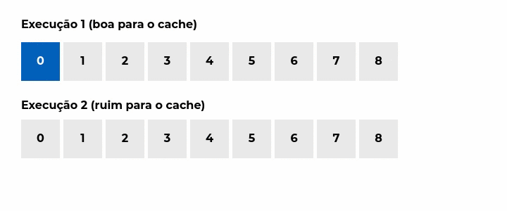
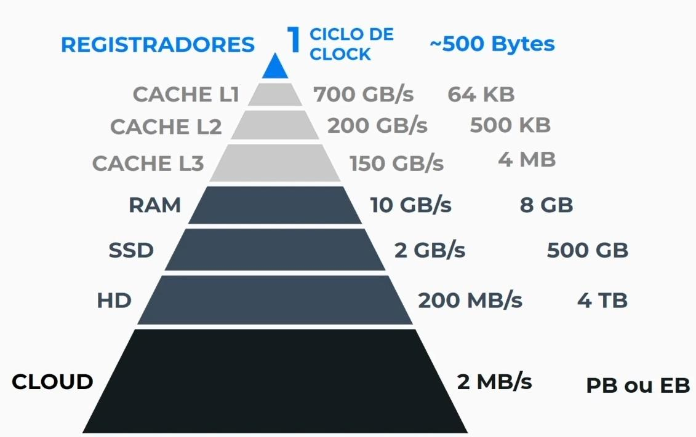

# Curso Alura - Arquitetura de computadores: por trás de como seu programa funciona

## Aula 1 - Como o Computador lê seu código

### Aula 1 - Apresentação - Vídeo 1

Transcrição  
Olá! É um prazer tê-lo neste curso.

Audiodescrição: Andrew Ijano é uma pessoa de pele clara, olhos e cabelos castanhos.

Meu nome é Andrew Ijano e quero indagar algo:

Você já se perguntou como o computador interpreta as instruções que passamos por meio de linguagens de programação? Ou como os componentes internos do computador comunicam-se para funcionar em harmonia? Ou até mesmo, o que está ocorrendo entre a linguagem de programação que escrevemos e aquele emaranhado de fios e eletricidade que existe dentro do computador?

A resposta para essas e várias outras perguntas será encontrada neste curso sobre o funcionamento dos computadores. E você perceberá que, ao contrário do que muitas pessoas pensam, os computadores não têm nada de mágico.

- O que vamos aprender?
- Como o computador lê o seu programa
- Como o computador executa um programa
- Como dados são armazenados

Neste curso, veremos como o computador lê o nosso programa e como ele transforma vários símbolos que escrevemos em editores de texto em algo que o computador compreende de verdade.

Entenderemos por que programas escritos em C são mais rápidos do que programas escritos em Python e por que, ainda assim, Python pode ser a melhor escolha em determinadas situações.

Também vamos compreender o processo de execução de um programa em um computador. Para isso, atravessaremos diversos componentes internos do computador, como SSD, HD, memória RAM e CPU.

Explicaremos o significado desses termos, suas diferenças e como eles se comunicam para executar o programa.

Também abordaremos termos como multi-core, dispositivos de I/O e memória cache. Finalmente, veremos como os dados são armazenados, como números inteiros (10), caracteres (A), listas ([1,2,3]) e números decimais (0,25) são representados internamente no computador e por que isso é relevante na programação.

Para quem é este curso?
Para quem é direcionado este curso? Este curso se destina a pessoas que possuem algum conhecimento em programação ou têm grande interesse em tecnologia e desejam aprender mais sobre o funcionamento interno de um computador.

Por quê? Porque, para programar de forma eficaz, é essencial compreender o que ocorre dentro do seu programa, permitindo tomar decisões mais informadas para seu projeto.

Então, prontos para começar?

Vejo você no curso!

### Aula 1 - O código de máquina - Vídeo 2

Transcrição  
Atualmente, vivemos em um mundo que está cercado de computadores. Temos um computador em nossa mesa, um computador portátil que podemos levar para vários lugares, um computador em uma sala isolada do outro lado do mundo encarregado apenas com cálculos e até mesmo um computador em nossa cozinha, na geladeira que auxilia nosso cotidiano.

E o que esperamos que todos esses computadores façam? Desejamos que, sempre que interagimos com eles, executem ações ou programas. Porém, para que esses computadores executem os programas, precisam ter sido escritos por alguém.

Contextualizando  
Por exemplo, se desejarmos fazer ligações no celular, alguém precisou programar para que ao clicarmos no ícone de ligação, o celular passe a ligar para alguém. Então, se você já teve algum contato com linguagem de programação, deve ter aprendido a fazer esse tipo de programa.

Para executar e escrever esses programas, provavelmente utilizou ferramentas como o navegador, editores de texto online como o P5 ou o Scratch, ou IDEs como o IntelliJ ou o Eclipse. Nesse processo, geralmente se escreve o código usando esses editores e ao executá-lo, o computador interpreta o código e entrega o resultado.

No entanto, o computador está longe de ser mágico. Ele executa ações bem definidas e algo muito real e factível.

Para desmistificar a ideia de que o computador é mágico e totalmente abstrato, e para entendermos melhor o que estamos escrevendo e o que está acontecendo abaixo daquele emaranhado de circuitos elétricos, vamos entender como o computador funciona.

Como o computador funciona

Quando escrevemos um código, escrevemos algo em uma linguagem que chamamos de alto nível, uma linguagem que nós, humanos, conseguimos entender. É uma linguagem, por exemplo, como JavaScript, onde podemos escrever palavras em inglês como function e, por exemplo, let.

Escrevemos nomes de variáveis com palavras que entendemos, conseguimos escrever os textos que queremos que o computador exiba na tela. É algo muito próximo da nossa linguagem cotidiana.

No entanto, há um problema. O computador não entende esse tipo de linguagem. Ele utiliza um tipo de linguagem bastante restrito, conseguindo apenas realizar operações aritméticas como adição, subtração, multiplicação, algumas operações para armazenar e recuperar coisas da memória, e fazer comparações para verificar se dois elementos são iguais ou diferentes.

Esse conjunto de instruções é chamado de código de máquina.

Temos o código de alto nível e o código de máquina.

O Código de Máquina e Linguagem de Alto Nível

Alto nível

Para entendermos a diferença desses dois tipos de linguagem, vamos pegar um pequeno exemplo.

```JavaScript
let a = 7;
let b = 2;
let c = a + b;
if (c !== 0) { 
    C++;
}
```

Temos um código em JavaScript que executa uma sequência de operações, embora não tenha muita aplicação prática. Criamos duas variáveis, a e a. A variável a recebe o valor 7 e b recebe o valor 2. Em seguida, criamos uma terceira variável, a variável c, que receberá a soma de a e b.

Em seguida, verificamos uma condição. Se c for diferente de 0, entramos dentro da condicional (if) e incrementamos c (C++). Esse é o código em JavaScript, código em linguagem de alto nível.

Código de Máquina
E para mostrar o que seria o código de máquina, vamos usar uma notação simplificada de algo chamado linguagem de montagem, ou assembly.

```JavaScript
guarda 7 em a
guarda 2 em b
pega a
soma b
guarda em c
compara ce 0
se_igual_pula 1 linha
incrementa c
```

A linguagem de montagem, que está representando o código de máquina, possuiria uma sequência de instruções muito mais extensa, com significados específicos.

A primeira instrução, por exemplo, guardaria o valor 7 dentro de uma posição específica do computador, que representaria a variável a.

No próximo passo, fazemos o mesmo para o valor b: pegamos o valor 2 e armazenamos em algum lugar da memória do computador. Em seguida, precisamos inicializar o c, que será a soma de a e b.

Primeiro, pegamos o valor de a já armazenado. O computador encontra onde esse valor está e armazena ele para realizar as próximas operações. Logo depois, ele soma o valor que está armazenado na posição de b.

Sendo mais específico, se pegarmos o valor de a como 7, o computador encontrou o valor de b, que é 2, e somou. Ele somou 2 e agora temos 9. Em seguida, ele pega o resultado dessa operação de soma, que é 9, e armazena esse valor em c. Assim, ele guarda esse valor em algum ponto do computador.

Então ocorre uma operação de comparação: é verificado se c e 0 são iguais. Se forem, seguindo a lógica do código JavaScript, não executará o código dentro da condicional, dentro do if. Portanto, não queremos que c seja incrementado se for igual a 0. Se for igual, pulamos uma linha e não se executa a instrução de incrementar c.

Caso seja diferente, c será incrementado. Agora, é possível comparar esses dois tipos de linguagem e ver que o código da máquina é um pouco mais granular e um pouco mais limitado na expressividade que podemos usar.

Não precisa entender o código da máquina para programar, mas é interessante conhecer os processos que ocorrem por trás.

Código Binário  
Mesmo assim, o computador não usa essa anotação para fazer ou representar comandos. Na realidade, o computador usa uma sequência de zeros e uns, o que chamamos de código binário. Você pode até ter ouvido falar que o computador comunica-se apenas com zeros e uns.

Isso acontece porque o computador é formado internamente por um conjunto de fios e circuitos pelos quais a eletricidade passa. Se um fio está transmitindo eletricidade, o computador interpreta como um; e se um fio não está transmitindo eletricidade, é interpretado como zero.

Essa lógica de estar ligado ou desligado estende-se a todos os componentes do computador, com isso, surge o código binário. Por meio dessa sequência de ligado e desligado, conseguimos representar a informação.

Temos nosso código-fonte em linguagem de alto nível, código-fonte que entendemos. Nós compreendemos o que significa imprimir 2 mais 2.

```JavaScript
imprimir (2 + 2)
```

O que precisamos fazer é transformar esse código-fonte em código para a máquina, que é um conjunto de zeros e uns, ligado e desligado dentro do circuito. Portanto, precisamos encontrar uma forma de converter este código-fonte em um código compreensível para a máquina.

Conclusão  
Para isso, precisamos de uma espécie de tradutor que pega o código que conhecemos e o transforma em um código que o computador entenda.

Vamos ver como funciona esse tipo de tradutor no próximo vídeo!

### Aula 1 - Para saber mais: bits e bytes

Em um computador, cada um desses 0s e 1s é chamado de bit, que vem do inglês Binary Digit ou dígito binário. Essa é a menor unidade possível para o armazenamento de informação.

Como bit é uma unidade muito pequena, costuma-se trabalhar com grupos de 8 bits, essa quantidade agrupada de bits é chamada de byte. Por convenção, quando medimos o armazenamento em um computador usamos o byte.

Para representar essas unidades, utilizamos b (“b” minúsculo) para o bit e B (“B” maiúsculo) para byte. Ou seja, 1B = 8b.

Você pode encontrar essas unidades em conjunto com prefixos SI como kg(quilograma, ou mil unidades de gramas), M(mega, ou 1 milhão de unidades), G (giga, ou 1 bilhão de unidades) e assim por diante. Por exemplo:

- Um arquivo de 200 MB é um arquivo com 200 milhões de bytes.
- Uma internet com velocidade de 20 Mbps transfere 20 milhões de bits por segundo ou 2,5 milhões de bytes por segundo.
- A diferença entre maiúsculas e minúsculas pode passar despercebida, mas é algo bem importante!

### Aula 1 - O tradutor do computador - Vídeo 3

Transcrição  
Para executarmos o código que escrevemos, necessitamos de um tradutor que converta o código-fonte em código de máquina e posteriormente o envie para a máquina executar.

Mas, como o tradutor funciona? Como é o processo de tradução? Para ilustrar, usaremos um exemplo.

O tradutor do computador
Exemplo:

```JavaScript
let c = a + b;
```

Digamos que temos esse trecho de código: let c recebe a mais b, acima.

Neste caso, estamos criando uma nova variável, a variável c, que irá receber o valor das variáveis a mais b.

Processo de tradução  
Durante o processo de tradução, o tradutor interpreta esse código que escrevemos, como um texto puro, uma sequência de caracteres.

Ele examinará individualmente cada caractere, incluindo espaços, letras, símbolos especiais e até caracteres invisíveis de quebra de linha. Em seguida, ao ler um caractere por vez, ao identificar o texto, o tradutor reconhecerá as palavras e agrupar conjuntos de caracteres, como let, a fim de compreender seus significados e a relação entre eles.

Nesse momento, ele vai identificar, por exemplo, os nomes de variáveis, analisando que c, a e b são nomes de variáveis. Ele vai identificar que let, a sequência l, e, t, indica que estamos declarando uma nova variável.

Por exemplo, quando encontramos os símbolos igual e mais, o intérprete compreende que estamos realizando uma atribuição a uma variável e uma adição de dois valores. Assim, ele deduz o significado dessas combinações de símbolos e, ao fazer isso, identifica possíveis erros, verifica a declaração prévia das variáveis que estamos utilizando e determina os tipos das variáveis em questão.

Portanto, se a, por exemplo, é um texto ou é um número, coisas desse tipo. Ele realiza todo esse processo de verificação, tentando entender o que essa combinação de caracteres significa e, a partir disso, começa a gerar o código de máquina.

A primeira ação que ele executará é a identificação do uso da variável a. Para tal, ele requer um código de máquina que permita a captura do valor de a. Dessa forma, ao executar posteriormente e capturar o valor de a, ele associa a ligação que, no nosso exemplo, define que a terá o valor de 7.

Em seguida, quando percebe que também vai usar o b e somar o valor de a com o valor de b, ele usa o comando no código de máquina para adicionar o valor de b a esse bound que está armazenando no computador. No nosso exemplo, b vale 2, então a soma deles, no momento da execução, será de 9.

Em seguida, ele reconhece que após a adição dos valores de a e b, deve criar uma nova variável chamada c para armazenar o resultado dessa soma. Assim, ele utiliza o terceiro comando de código de máquina, denominado guarda c. Dessa maneira, ele armazena o resultado contido nesse bound fictícia na variável c.

Dessa forma, temos esses três comandos em código de máquina que correspondem àquela linha do código-fonte:

```JavaScript
pega a
soma b
guarda c
```

E esses códigos de máquina serão convertidos em código binário:

```JavaScript
11011001  10110011
11001101  1011000
11000001  1001001
```

Portanto, tanto as instruções quanto o destinatário dessas instruções serão convertidos em uma sequência de zeros e uns. Esses zeros e uns serão consolidados em um único código de máquina, que poderá ser fornecido à máquina para execução posterior.

```JavaScript
1101100110110011110011011011000110000011001001
```

Assim, esse é o funcionamento fundamental da tradução. Na prática, há uma série adicional de etapas envolvendo cálculos complexos e conceitos avançados. No entanto, a ideia central permanece a mesma: o código que você escreve é interpretado por esse tradutor como um texto simples.

O tradutor tentará identificar as palavras-chave e o que elas significam dentro desse texto. Transformará em código de máquina em zeros e uns. E os zeros e uns serão então enviados para a máquina executar.

Entendemos o procedimento de traduzir um trecho de código, mas como o código fonte completo, com várias linhas e comandos, é convertido para código de máquina? Esse processo pode ocorrer de duas formas.

Primeira abordagem para realizar a tradução  
A primeira abordagem consiste em simplesmente tomar o código fonte, onde o tradutor lê o código fonte por completo e o traduz integralmente. Ele coleta todos os comandos em um único arquivo, gerando assim o código de máquina.

Uma vez concluída essa conversão, o tradutor não é mais necessário. Subsequentemente, podemos enviar esse código de máquina para o computador executar.

Assim, é importante notar que existem dois passos envolvidos: primeiro, a tradução completa do código fonte, e depois a execução. Esse processo é bastante semelhante ao que ocorre, por exemplo, na tradução de um livro.

Suponhamos que tenhamos um livro em inglês. O tradutor desse livro lê o livro inteiro, traduz o livro por completo para o português e gera uma nova versão em português. Após concluir a tradução, o tradutor não é mais necessário.

Quando a pessoa que comprou esse livro for lê-lo, ela não precisa do tradutor ao lado para conseguir ler esse livro, porque ela consegue entender o significado dele diretamente. É basicamente o mesmo processo.

Essa lógica de processo é análoga: o tradutor lê o livro inteiro em inglês, traduz para o português e, posteriormente, quando a leitora ou leitor deseja ler, não é mais necessário o tradutor para possibilitar a leitura. Da mesma maneira, no contexto computacional, não precisamos do tradutor para executar o código.

Tipo de tradutor Compilador  
A prática de compilar todos os códigos de uma vez, agrupando e traduzindo cada instrução em um único arquivo, é conhecida como compilação e o tradutor responsável por isso é chamado de compilador.

Segunda abordagem para realizar a tradução  
No entanto, existe uma segunda abordagem para realizar essa tradução. Podemos adquirir o código-fonte e permitir que o tradutor converta um segmento do código e envie-o para a execução no computador. Traduz um trecho de código e manda para o computador executar.

E vai fazendo isso linha por linha, trecho por trecho. Assim, temos o tradutor rodando no momento de execução de forma contínua. Logo, precisamos desse tradutor específico para executar o código, porque ao mesmo tempo que ele traduz, ele já manda para executar, comando por comando.

Essa segunda abordagem é semelhante a um outro tipo de tradução, a dos intérpretes em tempo real.

Por exemplo, se uma pessoa se comunica em inglês e outra em português, o intérprete em tempo real realiza o seguinte processo: quando a primeira pessoa diz "good morning", o tradutor interpreta imediatamente o significado e responde à segunda pessoa em português, dizendo "bom dia".

Portanto, nesse processo, a pessoa expressa o conteúdo na primeira língua, o tradutor interpreta e, simultaneamente, comunica o significado desse trecho de conteúdo à outra pessoa. Assim, é necessário que o tradutor esteja presente continuamente para facilitar a compreensão mútua.

Tipo de tradutor Interpretador  
Da mesma forma que no contexto do computador, dependemos do tradutor para a execução. Com essa abordagem semelhante ao intérprete em tempo real, esse tipo de tradutor é conhecido como um interpretador. Ele interpreta um comando por vez e envia instruções para a execução.

Conclusão  
Portanto, temos essas duas formas de tradutores: os compiladores e os interpretadores. Mas qual é a diferença prática entre eles? Por que escolhemos um em vez do outro no dia a dia?

Vamos analisar as diferenças entre esses dois tipos de tradutores mais para frente!

### Aula 1 - Executando diferentes linguagens - Vídeo 4

Transcrição  
Para entendermos a diferença entre programas que são compilados e programas que são interpretados, faremos um pequeno exemplo. Utilizaremos o mesmo programa escrito em duas linguagens diferentes: uma que iremos compilar e outra que vamos interpretar.

Executando diferentes linguagens  
Para realizar essa tarefa, utilizaremos um editor de texto, como o Visual Studio Code. Na primeira aba temos um arquivo chamado programa.c, encontramos um programa em linguagem C, muito semelhante aos exemplos que estamos analisando.

programa.c

```c
// COMPILANDO
#include `<stdio.h>`

int main() {
int a = 7;
int b = 2;
int c = a + b;

if (c != 0) { 
    c++; 
}
// for (int i = 0; i < 10000000; i++) {
// c++;}

printf("Olá, c = %d\n", c);
return 0;
}
```

Neste programa em C, faremos a compilação.

Na outra aba, temos essencialmente o mesmo programa, porém escrito em Python, chamado programa.py. Faremos a interpretação deste.

programa.py

```python
#INTERPRETADO

a = 7
b = 2
c = a + b

if c != 0:
c += 1
# for i in range(10000000)
# c +=1
print('Olá, c = ', c)
```

Se você não conhece essas linguagens, não precisa se preocupar com a sintaxe. É apenas para captar a ideia geral.

Para fazermos a execução, compilação e interpretação desses programas, do lado direito, temos o terminal onde faremos a execução.

Primeiro, vamos começar e analisar se conseguimos executar esse programa em C. Para isso, usamos o compilador de C:

> gcc programa.c -o programa

Executamos enviando o programa. A compilação foi bem rápida, porque o código desse programa é bem curto. Em seguida, vamos executar esse programa com o comando ./programa.

> ./programa

Obtemos a resposta:

> Olá, c = 10.

Faremos a mesma coisa para o programa interpretado. Para isso, esse programa em Python, precisamos apenas de um comando, que é o interpretador de Python, enviando o código programa.py como argumento.

> python3 programa.py

Temos a resposta:

> Olá, c = 10

Que é o resultado de C dado a execução de todo esse programa.

É possível identificar uma grande distinção entre programas interpretados e compilados, que consiste no fato de que os compilados incluem um estágio adicional, que é o da compilação do programa.

Para realizar edições, é necessário sempre compilar e, em seguida, executar. Esse processo afeta o desenvolvimento do programa, especialmente quando há a necessidade de efetuar múltiplas modificações em um programa interpretado.

Vamos somar 10 na linha 5 do arquivo programa.py,c = a + b + 10, editamos e já podemos executar usando o comando python3 programa.py no terminal. Obtemos a seguinte resposta:

> Olá, c = 20

Agora desejamos multiplicar por 2 o valor de c no print():

programa.py

```python
# INTERPRETADO

a = 7
b = 2
c = a + b + 10

if c != 0:
c += 1
# for i in range(10000000)
# c +=1
print('Olá, c = ', c*2)
```

já podemos executar novamente. O btemos como retorno:

> lá, c = 40

Vamos somar 1, editamos e executamos.

> print('Olá, c = ', c*2 + 1)

Obtemos:

> Olá, c = 41

Isso resulta em um processamento bastante rápido e dinâmico, uma vez que o programa interpretado é executado imediatamente, sem a necessidade de esperar por uma compilação prévia.

Por outro lado, no caso do programa compilado (programa.c), quando desejamos fazer edições semelhantes, como adicionar 10, multiplicar por 2 ou somar 1, é necessário seguir um processo em que primeiro compilamos o programa e, em seguida, executamos.

Vamos adicionar o 10:

programa.c

```c
// COMPILANDO
#include `<stdio.h>`

int main() {
int a = 7;
int b = 2;
int c = a + b + 10;

if (c != 0) { 
    c++; 
}
// for (int i = 0; i < 10000000; i++) {
// c++;}

printf("Olá, c = %d\n", c);
return 0;
}
```

Compilamos o programa com o comando gcc programa.c -o programa e na sequência executamos com ./programa.

```c
gcc programa.c -o programa
./programa
```

Obtemos como retorno:

> Olá, c = 20

Adicionamos a multiplicação por 2:

programa.c

```c
// COMPILANDO
#include `<stdio.h>`

int main() {
int a = 7;
int b = 2;
int c = a + b + 10;

if (c != 0) { 
    c++; 
}
// for (int i = 0; i < 10000000; i++) {
// c++;}

printf("Olá, c = %d\n", c*2);
return 0;
}
```

Compilamos e posteriormente executamos no terminal e obtemos:

> Olá, c = 40

Podemos somar um agora:

> printf("Olá, c = %d\n", c*2 + 1);

NovamentecCompilamos, posteriormente executamos no terminal e obtemos:

> Olá, c = 41

Esse ciclo de compilação e execução adiciona um tempo adicional antes de podermos efetivamente executar as alterações.

Agora, essa distinção talvez não pareça tão relevante, uma vez que a compilação do programa ocorre quase instantaneamente devido ao tamanho reduzido do arquivo.

No entanto, quando lidamos com um arquivo mais extenso, possivelmente com vários componentes no projeto e dependências significativas, o tempo de compilação pode variar de vários segundos a alguns minutos.

Assim, é importante considerar que o tempo de compilação é um fator que deve ser levado em consideração, pois impacta o desenvolvimento do projeto.

Nesse sentido, os programas interpretados oferecem uma vantagem significativa, pois permitem a identificação e correção mais ágil dos erros de execução, uma vez que a execução começa imediatamente após a ativação do interpretador.

Assim, é por essa razão que os programas interpretados têm a reputação de serem benéficos para o desenvolvimento de software. No entanto, os programas compilados possuem uma grande vantagem que os interpretados não oferecem, que é a rapidez na execução.

Se verificarmos no arquivo programa.c, vamos descomentar esse código da linha 14, onde temos uma interação, um for, que é executado mais ou menos umas 10 milhões de vezes o incremento desse C++.

programa.c

```c
// COMPILANDO
#include `<stdio.h>`

int main() {
int a = 7;
int b = 2;
int c = a + b + 10;

if (c != 0) { 
    c++; 
}
 for (int i = 0; i < 10000000; i++) {
 c++;
 }

printf("Olá, c = %d\n", c*2 + 1);
return 0;
}
```

Agora vamos verificar o tempo de execução deste programa que está configurado para uma alta quantidade de processos. Primeiramente, precisamos compilá-lo, e em seguida o executaremos.

```c
gcc programa.c -o programa
./programa
```

Obtemos:

> Olá, c = 20000041

Como podemos observar, o tempo de execução foi praticamente instantâneo. Porém, para confirmar, utilizaremos o comando time no terminal do Linux e observamos que a execução do programa levou aproximadamente 28 a 29 milissegundos.

> ./programa

Executed in 28.75 millis

Vamos agora executar o mesmo processo, mas com um programa em Python. A estrutura do programa é semelhante, com um loop que incrementará uma variável c cerca de 10 milhões de vezes.

programa.py

```python
#INTERPRETADO

a = 7
b = 2
c = a + b + 10

if c != 0:
c += 1
for i in range(10000000):
        c +=1
print('Olá, c = ', c*2)
```

Ao executá-lo, notamos que o tempo de execução não foi tão instantâneo quanto o do programa em C.

> python3 programa.py  
  Olá, c = 20000041

Utilizando o comando time python3 programa.py novamente, observamos que a execução desse programa demorou aproximadamente 2,6 segundos. Isso quer dizer que o programa em Python é basicamente noventa vezes mais lento do que o programa em C.

Entendo que pode parecer que isso acontece principalmente devido ao fato de o Python ser uma linguagem interpretada, mas não é essa a única razão. A demora também é influenciada por diversas decisões específicas da linguagem, incluindo a forma como a memória é alocada e como as informações são representadas.

Entretanto, o fato de ser interpretada tem grande influência no tempo de execução.

Portanto, se a pessoa desenvolvedora está pensando em criar programas que necessitam de alta performance e serem extremamente rápidos, normalmente opta-se pelas linguagens compiladas. Isso porque elas geram diretamente o código de máquina para o computador executar, o que facilita e agiliza o processo de execução.

Conclusão  
Conseguimos perceber algumas diferenças, mesmo que superficialmente, entre esses dois tipos de linguagem e esses dois tipos de execução.

Agora vamos aprofundar um pouco mais na comparação desses dois tipos de tradutores.

### Aula 1 - Compiladores vs Interpretadores - Vídeo 5

Transcrição  
Agora que analisamos na prática a diferença entre um programa compilado e um programa interpretado, podemos começar a analisar melhor as características de cada um.

Compiladores e Interpretadores  
A primeira coisa que notamos no exemplo prático é que um programa compilado tem uma execução muito mais rápida do que um programa interpretado.

Isso ocorre porque o compilador possui todo o contexto do programa, o que permite realizar otimizações mais complexas e gerar um código de máquina que está pronto para a execução pelo computador. Por outro lado, o interpretador deve interpretar o programa e enviá-lo para execução durante o processo, o que pode afetar bastante a performance de programas interpretados.

O processo de compilação permite a detecção de erros sem necessariamente ter que executá-los. Assim, se houver um erro de sintaxe no programa, como uso de variáveis antes de declará-las ou mistura de tipos de variáveis, é possível verificar esses problemas durante a compilação e corrigir o programa antes da execução.

Já com programas interpretados, se houver um erro, a única maneira de identificá-lo é durante a execução.

A ausência de um processo de compilação em programas interpretados acaba facilitando o desenvolvimento do software, pois permite que modificações sejam feitas no programa e seu resultado seja visualizado instantaneamente. Isso agiliza o desenvolvimento do software, pois elimina o tempo extra de compilação antes de poder executar o programa.

Quando o desenvolvimento é concluído e desejamos distribuir o software para outras pessoas, os interpretadores têm uma grande vantagem, pois conseguem executar em diferentes máquinas. Um programa compilado gera um código de máquina que funciona apenas em uma máquina específica, ou pelo menos em uma classe de computadores semelhantes ao seu.

Portanto, se você tiver dois computadores com componentes diferentes e compilar o programa em um deles, o código da máquina gerado não será executado no outro computador. Para distribuir o programa, seria necessário compilar para vários tipos específicos de computadores.

No entanto, se o computador no qual você deseja rodar o código tem um interpretador instalado, ele consegue rodá-lo. Isso facilita a distribuição do código para computadores.

| **Aspecto**                     | **Compiladores**                | **Interpretadores**            |
|----------------------------------|----------------------------------|---------------------------------|
| **Execução**                    | Rápida                          | Lenta                          |
| **Verificação de erros**        | Antes de executar               | Durante a execução             |
| **Tempo adicional**             | Necessário para compilar         | Não necessário, executa na hora |
| **Portabilidade**               | Executa em uma máquina          | Executa em diferentes máquinas |
| **Aplicações**                  | Linguagens como C, Rust, Go     | Linguagens como JavaScript, Python, PHP, Ruby |

Aplicações de compiladores e Interpretadores

Agora, vamos analisar algumas aplicações de cada linguagem.

Compiladores  
Linguagem C  
Linguagem Rust  
Linguagem Go

No caso dos compiladores, frequentemente encontramos linguagens como C, Rust e Go, que são utilizadas em programas que demandam alta performance, como motores para jogos ou servidores responsáveis pelo processamento de grandes volumes de dados ou requisições.

Além disso, a linguagem C serve como base para a maioria dos sistemas operacionais que utilizamos atualmente. São linguagens que enfatizam a performance.

Interpretadores  
JavaScript  
Python  
PHP  
Ruby

Por outro lado, para interpretadores, encontramos linguagens como JavaScript, Python, PHP ou Ruby. Essas linguagens valorizam bastante o processo de desenvolvimento do software, tornando a facilidade de desenvolver tais linguagens potencialmente maior do que nos programas compilados.

Elas são geralmente usadas em aplicações web, servidores e até em projetos de ciência de dados, nos quais as modificações são constantemente feitas e é desejado visualizar o resultado instantaneamente.

No entanto, estruturando as coisas dessa maneira, dá a impressão de que C é uma linguagem compilada e JavaScript é uma linguagem interpretada. Na verdade, uma linguagem é apenas um formalismo para escrever uma sequência de operações ou um algoritmo.

Um compilador ou interpretador é apenas a implementação dessa linguagem. Sendo assim, é possível ter a linguagem C com um compilador e um interpretador. Portanto, na prática, uma única linguagem pode ter ambos.

Frequentemente, acabamos nos confundindo porque normalmente usamos uma implementação específica apenas para uma linguagem que é a mais famosa e acabamos atribuindo que essa linguagem específica é compilada ou interpretada. No entanto, na realidade isso não é verdade.

Podemos ter mais de uma implementação de um mesmo compilador e um mesmo interpretador. Além disso, podemos encontrar linguagens e implementações que não se encaixam em nenhum desses dois.

Conclusão  
Na realidade, existem implementações que buscam combinar as vantagens de ambos os enfoques, criando implementações híbridas para solucionar problemas específicos. Essas linguagens também possuem uma grande notoriedade, e é possível que você já tenha se deparado com algumas delas.

Vamos agora examinar essas implementações!

### Aula 1 - Implementações modernas - Vídeo 6

Transcrição  
Com o intuito de mitigar as desvantagens, existem abordagens mais modernas que se situam em uma posição intermediária entre compilação e interpretação. Uma delas é conhecida como Just-In-Time Compilation (compilação no momento certo), também chamada de JIT Compilation.

Implementações modernas

JIT Compilation  
Vamos examinar como esse processo funciona. Suponhamos que temos um código-fonte extenso, repleto de funções, que pretendemos executar.

```Javascript
function pitagoras(a, b) {
let soma = a*a + b*b;
return raizQuadrada (soma);
}
```

Entretanto, não necessariamente iremos executar todo o código, incluindo todas as funções, no momento da execução.

Se formos forçados a realizar a compilação, o compilador analisará o código por completo, realizará a compilação completa e gerará o código de máquina para a totalidade do nosso código-fonte. Isso pode prolongar desnecessariamente o processo de compilação para o nosso código.

Para um interpretador, esse cenário não gera muitos problemas, pois ele se concentra apenas na porção do código que está efetivamente em execução. No entanto, o interpretador tende a ser mais lento, e, portanto, ao executarmos operações que exigem alto desempenho, isso se transforma em uma desvantagem.

Com isso, conseguimos analisar um método de obter um meio-termo entre os dois. Em vez de compilarmos todo o nosso código, se percebermos que estamos utilizando uma função específica, podemos interpretar o nosso código e compilar a função inteira no momento de execução, enviando para o computador o código binário da função inteira para ser executado.

Com isso, conseguimos aumentar consideravelmente a performance do nosso código. Conseguimos trazer a velocidade dos códigos compilados, e ainda não precisamos passar por um processo de compilação no meio. Assim, modificamos o código e conseguimos executar imediatamente, mantendo a facilidade de desenvolvimento dos códigos interpretados.

Esse meio-termo é tão famoso que você pode estar usando - por exemplo, na implementação da Google para JavaScript, chamada de V8. É ela que está rodando em navegadores Google, como o Chrome, e também é implementada no Node.js, que é a implementação para você criar códigos de back-end em JavaScript.

Então, esse método de compilação no momento adequado é um método bastante comum para otimizar códigos interpretados visando obter uma maior performance.

Java  
Além da compilação no momento adequado, nós encontramos outro caso peculiar de meio-termo entre interpretação e compilação, que é o do Java. A implementação do Java visava resolver um problema específico, que era a capacidade de compilar nosso código e executá-lo em várias máquinas diferentes.

Para resolver isso, o que eles fizeram foi o seguinte: temos o nosso código-fonte a ser executado e a primeira coisa que fazemos é compilá-lo.

Neste caso, em vez de gerar um código binário para enviar diretamente ao computador, geramos um código intermediário chamado bytecode (podemos conhecer isso como o .class do Java). Este bytecode é específico do Java, mas não é específico da máquina em que estamos rodando.

E para executá-lo de fato, precisamos passar por um segundo interpretador, chamado de JVM ou Java Virtual Machine (Máquina Virtual Java). É este interpretador que vai pegar o nosso bytecode, interpretar linha por linha e executá-lo.

Assim, com o compilador, conseguimos ter todo o contexto para fazer otimizações e verificar erros antes de executar, e devido ao fato de termos um bytecode que não é específico do computador, podemos enviá-lo para várias máquinas que, tendo o JVM instalado, conseguem executar o nosso programa.

Esta é a implementação intermediária usada pelo Java.

Conclusão  
Dessa forma, podemos entender agora como o código que escrevemos é transformado em um código de máquina que o computador entende.

Mas como esse código é executado? Como o computador executa o código que escrevemos? Vamos aprender isso na sequência!

### Aula 1 - Compiladores e interpretadores

William terminou de programar o código fonte de um jogo e, para executá-lo, precisou passar esse código por um tradutor. Ele observou que após esse processo foi gerado um novo arquivo que pode ser executado diretamente pelo computador.

Sobre esse processo de tradução, marque as alternativas corretas:

Resposta:

O novo arquivo gerado é o jogo em código de máquina.

> Alternativa correta! Para o programa ser executado diretamente pelo computador, ele precisa ser escrito como código de máquina.

### Aula 1 - Faça como eu fiz

Chegou a hora de repassarmos o que vimos até aqui nas aulas. Procure relembrar explicando para si o que aprendeu. É importante que tenha entendido o conteúdo. Caso algo não tenha ficado claro, não hesite em nos procurar no fórum.

Opinião do instrutor

Continue com os seus estudos, e se houver dúvidas, não hesite em recorrer ao nosso fórum!

### Aula 1 - O que aprendemos?

Nesta aula, aprendemos:

- Como funciona a linguagem que o computador entende: a linguagem de máquina;
- O computador precisa de um programa tradutor para transformar um código em uma linguagem de programação de alto nível para linguagem de máquina;
- Existem, em geral, dois tipos de tradutores: compiladores e interpretadores;
- Quais as diferenças entre compiladores e interpretadores, e suas implementações modernas.

## Aula 2 - Como o computador executa um programa?

### Aula 2 - Armazenando código - Vídeo 1

Transcrição  
Você escreveu o seu programa e gerou o código-fonte. O passo seguinte é executá-lo.

Para interpretar esse código, só precisamos do código-fonte. Se tiver sido compilado, agora temos o código de máquina. Ambos os arquivos são armazenados em algum lugar do computador, provavelmente em algum sistema de pastas com o qual você já possui familiaridade.

Sistema de Pastas

Esse sistema de pastas opera em conjunto com vários outros arquivos e possuem uma estrutura hierárquica. Esse é um papel do sistema operacional (SO), que controla onde cada byte será armazenado e como representará cada arquivo nessa estrutura.

Exemplo de hierarquia de pastas:

Pasta Principal  
Subpasta 1  
Código-fonte  
Código de máquina  
Subpasta 2  
Arquivo  
Arquivo  

Mas como o sistema de pastas é armazenado fisicamente? Como guardamos fisicamente esses arquivos?

Para responder a essa pergunta, vamos lembrar da última vez que desligamos nosso computador. Suponhamos que estávamos trabalhando com alguns documentos, desligamos o computador e no dia seguinte, quando ligamos novamente, nossos arquivos ainda estavam lá.

Memória Não Volátil

Se estavam, isso significa que guardamos esses arquivos na memória não volátil. O armazenamento dos arquivos é preservado nesse tipo de memória não volátil, que mantêm informação mesmo quando desligada. Podemos ligar e desligar o computador quantas vezes quisermos, e os arquivos continuarão lá.

Existem basicamente dois tipos de memória não volátil para computadores pessoais. O primeiro deles é o HD (Hard Disk ou Disco Rígido), que é composto por um conjunto de discos magnéticos que giram muito rápido e uma agulha que vai e volta nesses discos para ler e escrever neles.

A grande vantagem deste tipo de armazenamento é sua capacidade. Atualmente, encontramos HDs com 2 ou 4TB de armazenamento. Eles são bem úteis quando precisamos armazenar vários arquivos e são relativamente baratos comparados a outros tipos de armazenamento.

Contudo, o HD tem suas desvantagens, sendo uma delas a velocidade. Por haver uma agulha que precisa fisicamente encontrar o arquivo necessário, e um disco que está constantemente rodando, o processo de escrita e leitura dos arquivos se torna lento.

Além disso, o HD é frágil. Se, por exemplo, colocarmos um HD em um notebook que é constantemente movimentado enquanto ligado, isso pode danificar o disco, diminuindo sua durabilidade.

Para solucionar esses problemas, existe o segundo meio de armazenamento mais popular para computadores pessoais: o SSD (Solid State Drive ou Unidade de Estado Sólido).

Diferente dos HDs, que têm um disco magnético girando constantemente, o SSD é composto apenas por chips eletrônicos. A tecnologia empregada nos SSDs é muito parecida com a usada em pendrives e cartões SD. Se você já viu um pendrive aberto, notará que é apenas um chip que armazena todas as informações, mesmo quando desligado.

Portanto, as maiores vantagens dos SSDs são seu tamanho reduzido e velocidade. Mesmo sendo menores, conseguem armazenar grandes quantidades de informação. Além disso, são bem mais rápidos, pois não há partes físicas se movimentando, o que os torna mais eficientes que os discos rígidos.

Eles também são mais resistentes, então se tivermos um notebook com SSD, podemos movimentá-lo sem nos preocuparmos com possíveis danos.

A grande desvantagem dos SSDs é que eles ainda são consideravelmente caros em comparação aos discos rígidos (HDs). Embora a diferença de preço esteja diminuindo e eles estejam se tornando cada vez mais atraentes para uso em computadores pessoais, os SSDs ainda apresentam um custo elevado.

Além disso, os SSDs têm uma limitação de escrita. Devido à forma como são construídos, se escrevermos demais em uma parte específica do SSD, a capacidade de retenção de dados, mesmo quando desligado, acaba se desgastando. Portanto, se escrevermos muito ou alterarmos frequentemente os bits do SSD, ele terá um tempo de vida útil bem menor.

No entanto, mesmo com esta desvantagem, os SSDs ainda são vantajosos para uso cotidiano. Recentemente, temos visto uma presença cada vez maior de SSDs em notebooks e smartphones. Essa é a escolha comum de armazenamento para esses tipos de dispositivos.

Independentemente de estarmos usando um HD ou um SSD, essa categoria de armazenamento é chamada de memória secundária do computador. Isso ocorre porque o computador não trabalha diretamente com essa forma de armazenamento.

Quando temos programas que queremos executar e trabalhar com eles efetivamente, precisamos enviá-los para um segundo tipo de memória, chamada de memória de trabalho do computador, que é a RAM.

### Aula 2 - Memória RAM - Vídeo 2

Transcrição  
Temos o nosso programa que está armazenado na memória não volátil, que é transferido pelos barramentos do computador para a memória RAM a fim de ser executado posteriormente.

Pode-se perguntar: para que serve esse tipo de memória? Por que temos uma memória RAM? Para compreendermos melhor essa situação, vamos fazer uma pequena analogia.

Para que Serve a Memória RAM?  
Vamos imaginar que temos uma cozinha com uma bancada e uma grande despensa capaz de armazenar vários tipos de alimentos. Nessa cozinha, assumimos o papel de chefe e, para preparar uma receita, é necessário buscar os alimentos na despensa e organizá-los na bancada.

Sobre a bancada, se efetuam todos os processos necessários para a receita, como fatiar maçãs ou quebrar ovos.

Caso percebamos que faltam ingredientes, é necessário voltar à despensa, pegar o ingrediente necessário e retomar o trabalho na bancada. No entanto, se a bancada encontra-se cheia e não há mais espaço, é preciso remover algo dela e devolver à despensa para somente depois continuar o preparo da receita.

Nessa analogia, percebemos a necessidade de uma bancada para a preparação das receitas. Se a bancada é grande, conseguimos fazer várias receitas ao mesmo tempo, pois caberá mais ingredientes.

Por outro lado, caso a bancada seja pequena, será necessário fazer várias viagens da bancada até a despensa para conseguir continuar o preparo da receita.

Além da bancada, possuímos a despensa, que armazena grande quantidade de alimentos para vários dias, mas nela não conseguimos cozinhar nada. No contexto dessa analogia, a despensa representa o disco rígido HD ou SSD e a bancada é a memória RAM.

Interpretando a analogia, se a bancada é o local em que preparamos as receitas, a memória RAM é onde guardamos os dados que o computador lê e modifica constantemente em determinado momento. Por esse motivo, a memória RAM também é chamada de "memória de trabalho".

O tamanho da bancada representa a capacidade de armazenamento da RAM. Se, por exemplo, temos uma memória de 16GB ao invés de uma de 4GB, seremos capazes de executar diversos programas simultaneamente.

Conseguiríamos, por exemplo, abrir várias abas do Chrome sem travar o computador ou, num jogo com um mapa muito grande e detalhado, guardar maior quantidade de informações desse mapa sem precisar buscar informações no HD constantemente.

Se possuímos um disco com grande capacidade de armazenamento, significa que podemos armazenar vários aplicativos, fotos e programas, que são nossas "receitas" ou "ingredientes" para o computador executar.

Do mesmo modo que limpamos a bancada ao término do preparo de uma receita, quando desligamos o computador ao trabalhar com memória RAM, todos os dados nela contidos são apagados. Por isso, esse tipo de memória, diferentemente do HD e do SSD, é chamado de "memória volátil". Ou seja, quando o computador é desligado, os dados são apagados.

Assim, compreendemos a necessidade de ambas as memórias. A memória HD é necessária para guardar os dados que precisamos ao longo do tempo, mesmo após o computador ser desligado, e a memória RAM para armazenar os dados com os quais estamos trabalhando no momento.

Além disso, uma memória RAM física se parece bastante com uma placa estreita com um conjunto de chips dispostos lado a lado. Contudo, podemos abstrair isso e imaginar que a memória RAM é, na verdade, uma tabela com índices, onde cada índice representa o armazenamento de um byte específico.

#RAM  
0 10010010  
1 00110101  
2 11111111  
3 10101010  
4 01100110  
5 11110000

Se nós quisermos ler ou escrever alguma coisa na RAM, precisamos especificar o índice que vamos ler ou onde pretendemos escrever e realizar a operação neste lugar.

Esses índices são como locais dentro da RAM, é por isso que também são conhecidos como endereços. Portanto, temos o endereço 0 da memória, o endereço 1 da memória, o endereço 2 da memória e assim em diante.

Esta é a forma como a memória RAM funciona. Ela armazena uma espécie de tabela dos dados com os quais estamos trabalhando no momento.

Mas, da onde surge esse nome? Por que memória RAM? RAM vem do termo Random Access Memory (Memória de Acesso Aleatório). O nome foi escolhido porque é possível acessar qualquer posição na memória com a mesma quantidade de tempo e esforço.

Por exemplo, se estamos escrevendo no endereço 0 da memória e depois queremos ler o endereço 1, isso leva o mesmo tempo do que se estivéssemos escrevendo no endereço 0 e quiséssemos ler o endereço 10.000. O tempo para saltar de um endereço para outro é sempre constante.

Isso é diferente quando se trata de um HD. No HD temos a situação onde se estamos escrevendo no endereço 0, precisamos percorrer fisicamente até o endereço 10.000 para conseguir ler.

Esse aspecto perdeu um pouco a exclusividade quando começamos a trabalhar com SSDs, que também permitem acesso aleatório. Portanto, nossos dispositivos de armazenamento mais modernos também possuem essa característica.

No entanto, quando falamos de RAM, ou Random Access Memory, estamos falando deste tipo específico de memória. Dessa forma, temos o seguinte processo:

Iniciamos em nossa despensa, representada pelo SSD ou HD, que seria o local onde guardamos os arquivos que precisaremos executar. Em seguida, enviamos esse código para a bancada, ou seja, a RAM, onde começamos a manipular as coisas.

Agora, precisamos enviar todo esse código que está na RAM para quem vai manipular as coisas e executar os programas de fato, que seria o nosso processador ou CPU. Veremos a seguir como ele funciona.

### Aula 2 - O que comprar?

Letícia quer investir em um novo computador. Ela usualmente possui poucos arquivos e programas instalados, mas usa muitos deles todos de uma vez e deseja um bom desempenho ao inicializar o computador.

Pensando nessa situação, quais são conclusões corretas para a escolha do novo computador?

Resposta:

Como Letícia usa vários programas ao mesmo tempo, investir em uma memória RAM com mais capacidade é importante.

> Alternativa correta! Da mesma forma que uma bancada maior permite fazer várias receitas ao mesmo tempo, uma RAM com grande capacidade permite o uso de vários programas juntos. Com isso, o computador não vai ficar tão lento quando abrir várias abas do navegador.

Alternativa correta  
Como Letícia precisa ter o processo de inicialização do computador rápido e usar vários programas ao mesmo tempo, investir na velocidade de iniciação e acesso simultâneos aos programas instalados, por meio de um computador com um dispositivo SSD é importante.

Alternativa correta!  
A velocidade de um SSD, em comparação ao HD, pode acelerar a inicialização do computador e de programas. Como não há a necessidade de uma grande capacidade de armazenamento, o SSD possui um bom custo-benefício.

### Aula 2 - Para saber mais: Memória ROM

No SSD ou disco rígido é onde são armazenadas informações sobre o sistema operacional do seu computador e permite você utilizá-lo no dia a dia. Mesmo assim, no momento que o computador liga, como ele sabe quais dispositivos estão conectados nele e onde ele precisa ler as informações?

Esse tipo de dado inicial e crucial para o funcionamento do computador é localizado na memória ROM, do inglês Read-Only Memory ou “memória de apenas leitura”. Ela é um tipo de memória não-volátil com baixo armazenamento, bem diferente da RAM ou HD/SSD. Uma ROM possui vários modelos, mas todos são projetados para serem apenas lidos, ou seja, não é esperado que o usuário escreva informações nessa memória.

Atenção: um HD ou SSD não são ROMs! Essa é uma confusão comum, principalmente porque todos são não-voláteis.

Dessa forma, quando o computador é inicializado, as primeiras informações que ele irá buscar estarão na ROM, por exemplo, o BIOS ( Basic Input/Output System ou sistema básico de entrada/saída). Elas vão ajudá-lo a identificar os dispositivos conectados, como o HD, e carregar o sistema operacional.

### Aula 2 - Funcionamento do processador - Vídeo 3

Transcrição  
A CPU, que significa Central Process Unit ou Unidade Central de Processamento, é um termo que você pode já ter ouvido relacionado aos gabinetes de computadores fixos, como os computadores gamers.

No entanto, quando falamos de CPU, estamos nos referindo a um pequeno chip quadrado, também conhecido como processador.

Portanto, é o processador ou CPU que irá receber as instruções da memória RAM, tentar entender o que essas instruções significam e executá-las.

Partes da CPU

Ela é composta por algumas partes. A primeira parte, responsável por receber as instruções da memória RAM, é chamada de Unidade de Controle ou UC. Esta unidade irá analisar cada instrução, bit a bit, e tentará entender o que ela significa.

Por exemplo, a instrução pode requerer que a Unidade de Controle obtenha os dados armazenados no endereço 30 da memória RAM, compare dois valores ou adicione o número 2. No "balde" do computador, como vimos nos exemplos, essa unidade incrementará os dados para armazená-los em outras variáveis.

Portanto, será a Unidade de Controle que, por meio de seus circuitos internos, entenderá o significado da instrução e coordenará todos os estados do processador para executá-la.

Em seguida, temos a segunda parte, chamada Unidade Lógico Aritmética, ou ULA. É ela que irá manipular a maioria dos dados, realizando as operações aritméticas, como adição, multiplicação, divisão e subtração.

A ULA também executa operações de comparação, como verificar se 3 é menor que 5, se dois valores são iguais ou diferentes, e realiza operações lógicas. Por exemplo, se lhe for perguntado qual é o resultado de "verdadeiro e falso", ela retornará "falso". Essas são as operações lógicas "e" e "ou".

Com base nisso, a Unidade de Controle enviará à ULA os estados que ela deve ter. A Unidade de Controle irá configurá-la para que execute a operação desejada.

Em uma etapa, a ULA receberá um sinal elétrico informando que deve realizar uma operação de adição e qual será o valor que precisa incrementar. No nosso caso, será "2".

Para executar a soma, ela também receberá o valor que estava no "balde", que em nosso exemplo é "7". Assim, ela adicionará 2 a 7 e retornará "9", que é a soma desses dois valores, e o armazenará no "balde".

Portanto, é basicamente dessa maneira que a Unidade de Controle se comportará. Ela determinará o comportamento da ULA, que realizará a operação. Mas, de onde vêm os valores do "balde" teórico que estamos considerando desde o início do curso?

Para entendermos sua procedência, vamos usar um exemplo que retoma a analogia da cozinha.

Suponhamos que estamos naquela mesma cozinha. Temos a nossa tábua e nossa faca para cortar alimentos, e queremos fazer uma salada de batata. Começamos por pegar a batata, cortá-la e, em seguida, queremos cortar uma cebola. Mas, como não temos mais espaço na tábua, precisamos de um local para armazenar as batatas cortadas.

Podemos pegar um prato, colocar as batatas nele e armazená-lo na bancada, liberando espaço na tábua para a cebola. O problema é que isso deixa as batatas muito longe de nós.

Precisamos encontrar um lugar em nossa bancada para encaixar a batata, longe de onde estamos cortando, o que pode tornar nosso processo de cozinhar um tanto lento.

Para acelerar todo esse processo, podemos apenas guardar a batata no canto da tábua, um lugar que não ocupa muito espaço e ainda nos deixa uma área livre para cortar a cebola. Como a batata já está no canto da bancada, podemos apenas arrastá-la um pouco e juntar com a cebola para realizar uma operação de soma nesses dois valores.

Nessa analogia, a bancada, a faca e outros utensílios podem ser considerados como a ULA ou nosso processador em geral. Esse canto da bancada, ou seja, o "balde" onde acumulamos os valores, constitui os Registradores.

Registradores

Os registradores são um conjunto de posições onde armazenamos valores intermediários durante as operações. É a partir desses registradores que recebemos os valores para realizar operações e onde guardamos os resultados.

Como podemos imaginar, esses registradores são o terceiro componente principal de uma CPU. São eles que guardam e são responsáveis pela memória de um processador.

Portanto, essa é a memória mais básica que temos em nosso processador, e ela guarda a instrução atual. Quando a RAM envia uma instrução para o processador, a primeira coisa que ela faz é armazená-la nos registradores.

Eles também armazenam a posição da instrução atual. Portanto, se estivermos executando um programa sequencial, é importante saber qual é a posição da memória que estamos lendo para depois ler a próxima.

Além disso, os registradores armazenam valores intermediários, ou seja, o acúmulo de operações, facilitando a execução desses cálculos.

Eles ainda podem guardar vários outros valores, mas mesmo assim, não temos muitos. Temos cerca de centenas de registradores, o que equivale a algumas centenas de bytes.

Portanto, apesar de ser uma memória bastante pequena, é útil para armazenar estes valores intermediários e coisas que usamos rapidamente e localmente, apenas dentro do processador.

Após realizar todas as operações e armazenar o resultado final no registrador, se em uma próxima instrução quisermos saber qual é o valor armazenado no registrador, enviamos uma instrução para armazenar esse valor na memória e o que ele vai retornar é o valor do resultado da operação — no nosso caso, o valor "9".

Podemos ver que a memória envia instruções para o processador e modifica os seus estados internos. Ela modifica qual a operação que a Unidade Lógico Aritmética executará e onde serão armazenados os valores.

Quando estamos trabalhando com circuitos elétricos, podemos pensar que cada bit dessa instrução vai ligar ou desligar alguma função dentro do processador. Portanto, se alterarmos um bit, a instrução muda. Alguma função dentro do processador é ligada, algum circuito passa a receber energia agora e a instrução muda, e o que ela vai executar será algo diferente.

Portanto, todas as contas que fazemos no computador seguem essa lógica. Mudamos um bit, a instrução muda e ele faz somas, multiplicações, divisões, operações e comparações usando apenas esses três componentes:

- A Unidade de Controle para entender o que a instrução significa;
- A Unidade Lógico Aritmética para modificar os dados e

Os Registradores para armazenar estes valores intermediários, possibilitando que nós realizemos os cálculos necessários.
Compreendemos o papel de cada componente, mas como eles se organizam e se unem para executar um programa?

### Aula 2 - Executando código - Vídeo 4

Transcrição  
Um processador é um componente repleto de circuitos e fios, onde a eletricidade circula incessantemente. Devido a essa grande quantidade de eletricidade, é necessário garantir que tudo ocorra de forma ordenada e no momento adequado.

Assim como em uma linha de montagem de carros, que estabelece uma ordem para as operações e cada componente realiza sua função específica no tempo certo, é preciso que as instruções de um computador sejam executadas de maneira organizada.

Dessa forma, todas as instruções do computador são executadas na mesma sequência de passos, sempre seguindo uma sequência cíclica. Vamos analisar como elas são.

Sequência de Execução do Computador

A primeira fase é chamada de "buscar" (do inglês "Fetch"). Nesta fase, o processador acessa a memória RAM, composta por instruções e dados, e busca a instrução que deve ser executada.

Ele consulta, por exemplo, a posição zero da memória e guarda essa instrução no registrador responsável pela instrução atual. Supondo que a instrução é "pega 3", ela será armazenada no registrador de instrução.

A questão é: como o processador sabe qual instrução deve buscar em determinado momento? A resposta é que ele possui outro registrador especial, conhecido como contador.

Esse contador é o responsável por armazenar a posição na memória da instrução atual. Se o contador é zero, significa que a instrução na posição zero da memória deve ser buscada.

Ele funciona como um contador físico que aumenta de 1 em 1 (1, 2, 3, 4), e isso ocorre porque as instruções são executadas sequencialmente. Se executamos a posição zero, então devemos passar para as posições 1 e 2. Se quisermos começar a executar na posição 10, precisamos modificar o valor desse contador. Conforme as instruções são executadas, o contador é incrementado.

Sendo assim, buscamos a instrução e seus bytes estão guardados no registrador. Em seguida, precisamos entender o que ela significa. Entramos então na segunda fase: decodificar.

A instrução é enviada para a unidade de controle, que irá configurar o processador como um todo para executar essa instrução. Por exemplo, se a instrução é "pega 3", isso significa pegar o valor que está na posição 3 da memória. Para isso, é necessário configurar o ponteiro da memória RAM para acessar a posição 3.

Com tudo configurado, partimos para a terceira fase: executar a instrução. O processador, atento à posição 3 da memória, recupera o valor "7" armazenado lá e o coloca em outro registrador especial, conhecido como acumulador.

O acumulador funciona como aquele "balde" onde armazenamos valores intermediários entre as operações. Nesse caso, o valor "7" é armazenado ali.

Assim que essa operação é concluída, voltamos para a primeira fase e buscamos a próxima instrução. Todas as operações são feitas nessa ordem. Isso fornece a visão de que todas as operações ou instruções são executadas neste ciclo:

- Buscar a instrução;
- Decodificar;
- Executar;
- Repetir o ciclo.

Mas como temos certeza de que tudo está sendo feito na ordem correta? Como sabemos que terminamos de buscar e podemos decodificar a instrução? Como temos certeza de que, ao configurar o processador, todas as chaves corretas foram acionadas?

Para termos essa certeza, é necessário que todas as operações sejam sincronizadas, assim como acontece, por exemplo, em uma música. Assim como temos um metrônomo que sincroniza o tempo da música, ou um tambor que sincroniza as remadas dos remadores de um barco, nós precisamos de alguma forma de sincronizar cada operação, cada fase de um processo.

No processador, isso é chamado de clock (relógio, em tradução literal). No entanto, isto não significa que ele marca as horas, mas sim que ele determina o tempo em que cada fase deste processo ocorrerá — como se fosse o "tic-tac" de um relógio, a cada "tic" (ou “tick”, em inglês), ele vai mudar a fase de execução dessa instrução.

Vamos utilizar o exemplo abaixo e ver como isso funciona.

RAM	#  
pega 3	0  
soma 4	1  
guarda 5	2  
7	3  
2	4  
0	5  
Acumulador:	7  
Contador:	0  
Instrução:	pega 3

No nosso código, vamos adicionar esse clock. Na primeira fase do clock, estamos na fase de buscar. O contador foi incrementado, agora vale 1. Nós precisamos buscar a instrução que está na posição 1 da memória. Então, "soma 4" é copiada para o registrador de instrução. Agora, o registrador de instrução tem a instrução "soma 4".

RAM	#  
pega 3	0  
soma 4	1  
guarda 5	2  
7	3  
2	4  
0	5  
Acumulador:	7  
Contador:	1  
Instrução:	soma 4

Na próxima fase, nós vamos decodificar a instrução que está guardada no registrador. Vamos configurar a ULA (Unidade lógico Aritmética) para somar valores, e vamos configurar o ponteiro da memória RAM para a posição 4 da memória, pois queremos somar o valor que está na memória RAM, na posição 4, ao processador.

RAM	#  
pega 3	0  
soma 4	1  
guarda 5	2  
7	3  
2	4  
0	5  
Acumulador:	7  
Contador:	1  
Instrução:	soma 4

Na próxima fase, nós vamos executar essa instrução, pois está tudo configurado. O processador vai pegar o valor que está na posição 4 da memória RAM, que é "2", e o valor do acumulador, que é "7".

Estes valores serão enviados para a ULA. A ULA vai somar "2" mais "7", que resulta em "9", e este valor será guardado de volta no acumulador. Com isso, teremos o valor "9" guardado.

RAM	#  
pega 3	0  
soma 4	1  
guarda 5	2  
7	3  
2	4  
0	5  
Acumulador:	9  
Contador:	1  
Instrução:	soma 4

Avançando para a próxima instrução, nós estamos novamente na fase de buscar. Vamos buscar a instrução que está na posição 2 da memória, porque o contador do processador foi incrementado. Pegamos essa instrução e a guardamos no registrador.

RAM	#  
pega 3	0  
soma 4	1  
guarda 5	2  
7	3  
2	4  
0	5  
Acumulador:	9  
Contador:	2  
Instrução:	guarda 5

Na próxima fase, vamos decodificar esta instrução, e percebemos que é para guardar o valor 5. Vamos guardar o que está no acumulador na posição 5 da memória. Portanto, a unidade de controle precisa ir e colocar o ponteiro na posição 5 da memória RAM.

RAM	#  
pega 3	0  
soma 4	1  
guarda 5	2  
7	3  
2	4  
0	5  
Acumulador:	9  
Contador:	2  
Instrução:	guarda 5

Na próxima fase, vamos executar. Pegamos o que está no acumulador e transferimos para a memória RAM. Pegamos o valor "9", e agora, na posição 5 da memória RAM, temos o valor "9".

RAM	#  
pega 3	0  
soma 4	1  
guarda 5	2  
7	3  
2	4
9	5  
Acumulador:	9  
Contador:	2  
Instrução:	guarda 5

É dessa maneira que um programa é executado no computador. Nós vamos seguindo os "tics" do clock, passando pelas fases de buscar, decodificar e executar, selecionando os valores que queremos pegar da memória RAM.

Além disso, vemos que a velocidade com que esses "tics" do clock ocorrem é o que determina a velocidade com que uma instrução será executada. A velocidade do processador de um computador é, em média, um clock de 3 bilhões desses "tics" por segundo, o que equivale, aproximadamente a 3 GHz.

Se você já viu essa especificação de GHz em seu processador, e encontrou 3 GHz, esse valor significa 3 bilhões de "tics" por segundo. Ou seja, são várias e várias instruções, vários passos que são executados em apenas um segundo. O computador executa bastante coisa.

Pensando assim, as tarefas que um computador executa podem parecer repetitivas e chatas, pois envolve sempre esse processo de buscar, decodificar e executar. Ele precisa fazer vários passos para executar instruções que levam apenas 3 linhas para nós digitarmos.

No entanto, é exatamente para isso que o computador foi projetado. O computador foi feito para executar essas tarefas repetitivas.

Se, ao observar sua rotina, você identifica tarefas muito repetitivas, quase algorítmicas, tente otimizar isso e automatizar para que o computador execute. Afinal, os computadores foram desenvolvidos para essas atividades, e desempenham muito bem essa função.

Busque aproveitar melhor os 3 bilhões de "tics" por segundo que um computador pode realizar, pois nossas ações são muito mais lentas do que isso.

### Aula 2 - Os componentes do processador

Um processador é composto de várias partes com funções bem específicas.

O que é correto dizer sobre o funcionamento do processador?

Resposta

Alternativa correta!  
As instruções são processadas num ciclo de três passos chamados buscar, decodificar e executar.

> Alternativa correta! Cada instrução passa por esse ciclo e o tempo entre cada uma é sincronizado pelo clock do processador.

Alternativa correta!  
O clock define a velocidade com que as instruções são executadas. Ou seja, quanto maior a velocidade do clock, mais rápido um programa será executado.

> A velocidade do clock é um dos principais fatores para medir a velocidade de execução de um certo programa. Muitos entusiastas utilizam a técnica de overclocking , que aumenta o desempenho em programas mas pode causar superaquecimento do processador, um maior gasto energético e uma redução no seu tempo de vida.

Alternativa correta!  
Antes de serem executadas, as instruções precisam ser decodificadas pela Unidade de Controle (UC).

> Alternativa correta! É a UC mesmo que é responsável por decodificar uma instrução lida na RAM. Cada bit decodificado liga um fio ou circuito específico que modifica o estado do processador.

### Aula 2 - Memória na prática - Vídeo 5

Transcrição  
Anteriormente, discutimos a diferença entre a memória secundária, que é o HD e SSD, e a memória de trabalho, a memória RAM.

Vimos também que nem tudo cabe na memória RAM, semelhante a uma bancada. Se começarmos a colocar muitas coisas nela, vai lotar. Teremos que retirar alguns itens, devolver para o armário e fazer essa troca. Portanto, a memória RAM é limitada e só comporta algumas coisas que são prioritárias naquele momento.

Contudo, é possível que você, como pessoa em aprendizado de programação, se pergunte: esse conhecimento é interessante, mas como isso vai me ajudar, enquanto estou aprendendo programação? Vou encontrar a necessidade de usar esse tipo de conhecimento no meio do código, fazendo sistemas?

Para responder essa pergunta, vamos ver um exemplo que ilustra bem essa situação.

A Memória em nossa Rotina  
Vamos acessar o editor de texto do Visual Studio Code, e vamos pensar em uma determinada situação. Suponhamos que estamos escrevendo programas para um site que trabalha com vendas e produtos. Eles têm uma tabela com vários produtos, uma tabela mais ou menos como a vista abaixo.

descrição da tabela:

> CÓDIGO, AVALIAÇÃO, QUANTIDADE, PREÇO

Cada linha dessa tabela terá o código do produto, a avaliação, a quantidade e o preço.

Nos pediram para escrever um programa que lerá essa tabela e imprimirá para a pessoa usuária quais são os produtos que custam menos de 50 reais. Ou seja, ler a tabela e imprimir todos os produtos que custam 50 reais ou menos.

Com um pouco de estudo, podemos chegar à ideia vista abaixo.

```JavaScript
const fs = require('fs');

// LÊ TODAS AS LINHAS DE UMA VEZ
// EXECUTA DEPOIS
imprimeProdutosBaratos('tabela_pequena.csv');

function imprimeProdutosBaratos(nomeArquivo) {
    const todasAsLinhas = geraTodasAsLinhas(nomeArquivo);
    
    for (const linha of todasAsLinhas) {
        imprimeSeForProdutoBarato(linha);
    }
}

function geraTodasAsLinhas(nomeArquivo) {
    const tabela = fs.readFileSync(nomeArquivo, 'utf8');
    return tabela.split('\n');
}
```

Criamos um programa em JavaScript onde lemos a tabela inteira e guardamos isso numa lista. Depois, para cada elemento da lista, verificamos se é um produto barato e, se for, imprimimos.

Se você não tem costume com a linguagem e as notações Java, não precisa se preocupar. O importante é entender a ideia.

Nesse código, criamos a função imprimeProdutosBaratos(), onde primeiro lemos a tabela e geramos todas as linhas. A variável todasAsLinhas é uma lista que contém todas as linhas da tabela.

Em seguida, iteramos por todas essas linhas e, se for um produto barato, o imprimimos.

Vamos testá-la utilizando a tabela de produtos que nos foi fornecida, chamada tabela_pequena.csv, e ver como ela se comporta.

Acessando o terminal do VS Code, vamos executar o programa leTudo com o comando abaixo.

```JavaScript
node leTudo.js
```

O programa foi bastante rápido, e tivemos dois resultados: produtos com estes códigos, ambos custando exatamente R$50.

código: f75c9831-e93a-4a8f-a8a0-be4a957187a2; preço: R$ 50

código: 3eb5e156-90d0-4bca-a22a-aafd25ddbc62; preço: R$ 50

Entregamos o programa funcionando e todo mundo ficou feliz. No entanto, passado algum tempo, o site cresceu e a empresa começou a ter vários outros produtos. Cm isso, a tabela_pequena não representava mais a quantidade de produtos que eles possuíam.

Eles nos forneceram uma nova tabela, chamada de tabela_grande, que agora incluía todos os novos produtos que eles haviam adquirido.

Vamos rodar o comando abaixo no terminal e ver a diferença de tamanho entre a tabela_pequena e a tabela_grande.

```JavaScript
ls -sh | grep tabela
```

Resultado no terminal:

4.0K descrição da tabela

2.0G tabela grande.csv

4.0K tabela pequena.csv

A tabela_pequena tem 4 KB de tamanho, um tamanho aceitável. Mas a tabela_grande que eles nos forneceram é muito maior do que isso, consistindo em 2 GB.

Para ter uma ideia, a memória RAM que eu, Andrew, estou usando neste computador tem uma capacidade total de 8 GB e, na verdade, se olharmos para o painel de desempenho no terminal, acima da linha de comando, veremos uma linha onde está escrito Mem, a qual informe que só temos disponíveis no máximo 7.6 GB.

Mem[||||||||4.82G/7.67G]

Conseguimos ter uma noção de quão grande é essa tabela. Se pensarmos que tudo o que colocamos na memória são as variáveis que estamos armazenando e rodando no programa, isso já é algo para começarmos a prestar atenção.

Entretanto, mesmo sabendo que a tabela tem um tamanho de 2GB e, apesar de ter quase esse valor disponível de memória, vamos executar o programa. Dessa vez, não com a tabela_pequena, mas sim com a grande.

Para isso, vamos alterar a linha imprimeProdutosBaratos('tabela_pequena.csv') do código para que receba tabela_grande.

```JavaScript
// LÊ TODAS AS LINHAS DE UMA VEZ
// EXECUTA DEPOIS
imprimeProdutosBaratos('tabela_grande.csv');
```

Em seguida, voltamos ao terminal e executamos o programa.

```JavaScript
node leTudo.js
```

Quando executamos o programa novamente, notamos que está demorando para que algo aconteça. Parece que o programa travou ou algo assim.

Porém, ao observar o desempenho da memória no painel, percebemos que ela começa a crescer bastante. O que antes eram 4.82 GB, agora está em 5.5 GB e crescendo.

Isso ocorre porque não necessariamente o JavaScript irá armazenar exatamente 2 GB. Às vezes, a maneira como a implementação funciona demandará muito mais do que isso.

Ou seja, se sobrecarregarmos a memória, pode ser que o computador trave e esse programa nem funcione. Vamos aguardar um pouco e ver como será o fim deste programa.

buffer.js:604

slice: (buf, start, end) => buf.utf8Slice(start, end),

Error: Cannot create a string longer than 0x3fffffe7 characters

Retorno omitido

code: 'ERR_STRING_TOO_LONG'

Depois de alguns segundos, percebemos que o programa, na verdade, nem rodou. O problema aqui não foi necessariamente o fato de a memória RAM não ser suficiente, e sim porque criamos uma string ou texto muito maior do que é permitido pelo JavaScript.

Portanto, já é possível constatar que, seja pela memória RAM, que poderia sobrecarregar a própria implementação do JavaScript, notamos que a nossa solução, que funcionava muito bem, agora não funciona mais. Para resolver isso, precisamos pensar em outra alternativa.

Em vez de ler a tabela inteira para analisá-la posteriormente para ver quais são as linhas que são produtos mais baratos ou não, percebemos que só precisamos do conhecimento de uma linha para saber se ela é um produto barato.

Dessa forma, o que podemos fazer é ler uma linha, ver se é um produto barato e imprimir o código e preço. E depois, ler a próxima linha.

Assim, não precisamos armazenar a tabela inteira na memória, evitando gastar uma quantidade imensa de memória RAM que pode acabar não escalando e tornando-nos limitados, pois não conseguiríamos ler arquivos maiores do que a memória RAM disponível. No entanto, se procedermos linha por linha, não temos essa limitação de memória.

Por isso, criamos um segundo programa, o lePorLinha.js, que faz basicamente a mesma coisa.

```JavaScript
const fs = require('fs');
const readline = require('readline');

// LÊ E EXECUTA LINHA POR LINHA
imprimeProdutosBaratos('tabela_pequena.csv');

async function imprimeProdutosBaratos(nomeArquivo) {
    const leitorDeLinhas = geraLeitorDeLinhas(nomeArquivo);
    
    for await (const linha of leitorDeLinhas) {
        imprimeSeForProdutoBarato(linha);
    }
}

function geraLeitorDeLinhas (nomeArquivo) {
    return readline.createInterface({
        input: fs.createReadStream(nomeArquivo),
        crlfDelay: Infinity,
    });
}
```

Se observarmos o código acima, é bem similar ao anterior. Nele, imprimimos o produto super barato e percorremos as linhas. A diferença é que esse programa cria um leitor de linhas.

Em vez de armazenar todas as linhas na memória, cria-se um objeto geraLeitorDeLinhas que, a cada iteração nesse loop (laço), vai ler uma linha do arquivo. Assim, não gastamos mais memória que seria necessária para o tamanho de uma linha, por exemplo.

Se executarmos esse novo arquivo lePorLinha.js com a tabela_grande, não mais a pequena,

Para isso, vamos alterar a linha imprimeProdutosBaratos('tabela_pequena.csv') do código para que receba tabela_grande.

```JavaScript
// LÊ E EXECUTA LINHA POR LINHA
imprimeProdutosBaratos('tabela_grande.csv');
```

Em seguida, voltamos ao terminal e executamos o programa com o comando abaixo.

```JavaScript
node lePorLinha.js
```

Se observarmos o resultado, estamos imprimindo muitas linhas agora. O programa não está mais travando e obtemos uma resposta quase instantânea de todos os produtos que temos. Já conseguimos ver que a quantidade de produtos é muito grande agora. Essa empresa cresceu bastante.

Além disso, não temos um aumento de memória significativo. Podemos ver que muito tempo se passou e a memória não está crescendo muito mais. Está basicamente estável no valor de 4.85G. O consumo de memória mantém-se constante em relação ao tamanho do arquivo.

É fundamental considerar que, caso estejamos aprendendo a programar ou desejamos construir sistemas nos quais precisamos ler uma grande quantidade de dados, devemos nos preocupar com a quantidade de memória que será consumida.

Esse é um desafio comum que enfrentamos na programação. Inclusive, se trata de uma situação que pode surgir em entrevistas de emprego.

Concluindo, essa é uma situação-problema bastante comum que encontraremos ao lidar com grandes volumes de dados.

### Aula 2 - Faça como eu fiz

Chegou a hora de você seguir todos os passos realizados por mim durante esta aula. Caso já tenha feito, excelente. Se ainda não, é importante que você execute o que foi visto nos vídeos para poder continuar com a próxima aula.

Opinião do instrutor

Continue com os seus estudos, e se houver dúvidas, não hesite em recorrer ao nosso fórum!

### Aula 2 - O que aprendemos?

Nesta aula, aprendemos:

- Como o SSD e HD funcionam e quais as diferenças entre eles;
- Qual é o papel da memória RAM no computador e qual sua diferença para a memória secundária (SSD ou HD);
- Como funcionam os principais componentes de um processador;
- Como um programa em código de máquina é executado no computador;
- A importância do clock do processador para a velocidade de processamento;
- Que existem limitações de memória num computador e como criar programas eficientes para contornar esse problema.

## Aula 3 - Como o computador executa vários programas?

### Aula 3 - Processadores modernos - Vídeo 1

Transcrição  
Conseguimos entender como o processador executa nosso programa, sempre seguindo a sequência de buscar, decodificar e executar. Este é o modelo que estávamos utilizando para o processador, e, historicamente, a única diferenciação de velocidade era o clock. Quanto mais rápido o clock, mais veloz era o processador.

Contudo, ao longo dos anos, aumentar a velocidade do clock ficou cada vez mais difícil devido a problemas como componentes muito pequenos, superaquecimento e consumo excessivo de energia. Foi necessário, então, criar novas alternativas para melhorar o desempenho do processador.

Analisando a forma como construímos nosso processador até agora, notamos que a sequência constante de buscar, decodificar e executar uma instrução deixa o processador ansioso. Para entender melhor, vamos considerar a seguinte situação: imagine uma lavanderia com uma máquina de lavar e uma máquina de secar. Cada uma demora uma hora para lavar e secar a roupa. Nesta lavanderia, recebemos três remessas de roupa para lavar e secar. Como organizamos essas remessas para que todas sejam lavadas e secas?

Uma opção é colocar a primeira remessa para lavar, esperar uma hora e, depois que terminar, colocá-la na máquina de secar, esperar mais uma hora, retirar, dobrar e guardar. Em seguida, pegamos a segunda remessa, seguimos o mesmo processo, e depois a terceira. Agindo desta maneira, lavamos e secamos essas três remessas de roupa em seis horas.

No entanto, ao avaliarmos mais a fundo, percebemos que as máquinas de lavar e secar permanecem ociosas grande parte do tempo. Quando a primeira remessa está secando, por exemplo, a máquina de lavar fica uma hora parada, quando poderia estar lavando a segunda remessa.

Seguindo essa lógica, poderíamos colocar a primeira remessa para lavar e, no momento que a retiramos para colocar na secadora, colocamos a segunda remessa para lavar. Desse modo, sempre teríamos roupa sendo lavada e secada simultaneamente. Assim, lavaríamos e secaríamos todas as três remessas em apenas quatro horas, ganhando duas horas nessa operação.

Podemos aplicar a mesma lógica ao ajustar o processador para que ele execute as partes de buscar, decodificar e executar simultaneamente. Então, ao buscar, decodificar e executar, em vez de começarmos a buscar só no final de executar, o que podemos fazer é, ao decodificar a instrução lida, já solicitamos ao processador a busca da próxima instrução. Com isso, as instruções ficarão em uma linha de montagem, uma no estágio de busca, outra decodificando e outra executando, sempre prontas para serem executadas.

1 2 3 4 5
Buscar  Decodificar  Executar  
Buscar  Decodificar  Executar
Buscar  Decodificar  Executar

Dessa maneira, conseguiremos executar uma instrução a cada ciclo de clock, em vez de uma a cada três ciclos, basicamente triplicando a velocidade com que nosso processador executa as instruções. Esse conceito é chamado de pipeline de instruções, advindo da ideia de linha de montagem, onde as instruções são executadas uma após a outra, seguindo o mesmo caminho.

Assim, conseguimos melhorar bastante a ideia do processador, mas ainda existem possibilidades de aprimoramento. Por exemplo, quando o processador está buscando informações na memória RAM, a Unidade Lógica Aritmética não está fazendo nada, apenas aguardando.

Portanto, nós poderíamos emitir alguma instrução específica para a CPU e prosseguir executando para que já obtenhamos o resultado quando necessário. Seguindo essa ideia, se duplicarmos alguns componentes do processador, conseguiremos duplicar todo esse pipeline, possibilitando a execução de duas instruções a cada ciclo de clock.

1 2 3 4 5  
Buscar  Decodificar  Executar  
Buscar  Decodificar  Executar  
Buscar  Decodificar  Executar

Assim, conseguimos executar duas instruções simultaneamente, aumentando a velocidade de execução das instruções. Se um processador precisa de certo desempenho para executar instruções e decidimos duplicar esse conjunto de circuitos, conseguiremos dobrar o número de instruções executadas simultaneamente.

Se chamarmos de conjunto de processadores a parte do processador que possui a Unidade Lógica Aritmética, Unidade de Controle e Registradores de Núcleo, e duplicarmos isso, teremos um processador Dual-Core, que possui dois núcleos.

Provavelmente você, como pessoa desenvolvedora, já ouviu falar de processadores Dual-Core ou Quad-Core. Isso significa que eles têm mais de um núcleo - dois ou quatro núcleos - que são capazes de executar instruções simultaneamente, ao mesmo tempo, em paralelo. Portanto, é como se fossem mini-processadores dentro do mesmo chip.

Essas são as ideias que estão presentes em quase todos os nossos processadores atuais. E mesmo que pareçam ideias simples, elas necessitaram de um longo período de pesquisa e vários anos para serem de fato implementadas. Ainda assim, é uma área em constante crescimento e desenvolvimento.

### Aula 3 - Para saber mais: Lei de Moore

Em 1965, Gordon Moore previu que o número de componentes de um circuito integrado (transistores) dobraria a cada período de 18 meses, resultando num processador duas vezes mais rápido. Isso originou a chamada Lei de Moore. Essa lei virou uma medida econômica das empresas e é responsável pelo crescimento exponencial de performance da tecnologia que vemos nas últimas décadas.

Gráfico do crescimento do número de transistores dos processadores de 1970 até 2005. É possível ver que há um crescimento menor do que o dobro a cada 18 meses, mas está de acordo com a lei de Moore

Entretanto, nos últimos anos, os fabricantes de processadores estão encontrando limites físicos para manter esse padrão e o crescimento [está cada vez diminuindo mais](https://www.uol.com.br/tilt/noticias/redacao/2019/01/29/o-que-e-a-lei-de-moore-e-porque-voce-deve-se-preocupar-com-o-fim-dela.htm) . Por isso, pesquisadores procuram outras soluções para manter o crescimento da performance de um processador, mas sem precisar aumentar o número de transistores ou a velocidade de clock.

Algumas das soluções para isso são técnicas que você viu em aula. Outras são o uso de hardwares específicos que aceleram o processamento (aprenderemos sobre o assunto nas próximas atividades) e alterações na performance das linguagens de programação.

### Aula 3 - Entrada e saída - Vídeo 2

Transcrição  
Já vimos como nossos programas são executados, como o que escrevemos é transformado em bits e, posteriormente, retornado como resultado. Mas como nós conseguimos interagir com esses programas? Como podemos enviar algo para eles e receber algum resultado de volta? Para o computador fazer isso, ele precisa do dispositivo de entrada e saída, ou I/O. Vamos entender o que é isso!

Então, temos o computador que é a CPU, responsável por processar os dados que enviamos a ela, e a memória RAM, que guarda todos os dados, instruções e programas com os quais estamos trabalhando no momento. Ao redor disso, temos o dispositivo de entrada e saída. Para entrada, temos acessórios como teclado, mouse, webcam e microfone. Para saída, temos a tela, o monitor onde vemos as coisas, fones de ouvido ou alto-falantes, onde ouvimos o som, e até uma impressora, por exemplo. Em torno disto também estão inclusos o HD e o SSD, então esses componentes também são considerados como dispositivos de entrada e saída.

Dessa forma, podemos ver que esses dispositivos são responsáveis pela ponte entre a pessoa usuária e o computador. Portanto, é com eles que conseguimos interagir com esses componentes internos, que são o processador e a memória RAM. Devido a essa intensa interação com eles, muitas vezes acabamos nos confundindo, pensando que o monitor ou o teclado que usamos é o computador. Quando, na verdade, o principal, que realiza todas essas computações, é apenas o processador e a memória RAM.

Nesse mundo de dispositivos de entrada e saída, já percebemos que existe uma gama bem grande de cada um desses tipos de dispositivos. Vamos pensar na seguinte situação: temos uma tela bem antiga, pequena e quadrada, para a qual estamos desenvolvendo um programa específico para que ela imprima o valor de uma conta. Porém, trocamos por um monitor mais moderno, um hardware completamente diferente e com uma tela bem maior, com resolução totalmente distinta.

O fato de termos escrito um programa para a tela inicial significa que ele não vai funcionar no novo monitor? Como fazemos para não ter que escrever um programa específico para cada tipo de tela? Podemos simplesmente criar um comando para imprimir o resultado de 2 + 2 em qualquer tela que tivermos?

Para fazer isso, o que o computador possui internamente é chamado de drivers de dispositivo. São por meio desses drivers que conseguimos abstrair várias particularidades dos diferentes dispositivos de entrada e saída. Assim, conseguimos simplesmente mandar imprimir 2 + 2 e o computador, através desse driver, vai saber como imprimir no hardware específico.

Da mesma forma, temos dois tipos diferentes de armazenamento: o HD, que tem uma agulha e um disco girando e precisa saber como e onde mover a agulha para encontrar um dado específico; e o SSD, que é apenas um conjunto de chips de silício que armazena dados por meio de eletricidade e funciona de uma forma completamente diferente. Mas o computador, na hora de programar, executa exatamente da mesma forma.

Portanto, são esses drivers, essas abstrações, que fazem com que possamos programar sem ter que nos preocupar 100% com os hardwares que estamos usando.

Mas como esses dispositivos funcionam? Para termos uma ideia superficial de alguns desses dispositivos, vamos olhar para dois dos principais dispositivos com os quais interagimos usando o computador: o monitor e o teclado.

Comecemos pelo monitor! Quando o ligamos, vemos diversas gamas de gráficos, cores diferentes e formas. Mas, no fundo, todos esses gráficos que vemos no computador, são apenas um conjunto de pequenos quadrados, um ao lado do outro, que possuem cores diferentes.

Caso diminuíssemos o número deles e aumentássemos o tamanho desses quadrados, a imagem que veríamos no computador seria algo sem muitas curvas, pois, na verdade, as coisas são apenas formadas por pequenos quadrados. Cada um desses quadrados é chamado de pixel e cada pixel é como se fosse uma fonte de luz, a qual nós apenas alteramos a cor.

A cor de um pixel é definida por três componentes: vermelho, que é representado por R (Red), verde, representado por G (Green), e azul, representado por B (Blue). Se você já trabalhou com cores no computador, provavelmente já deve ter encontrado a expressão RGB, que é uma forma de representar cores.

Utilizando esses três componentes, nós conseguimos representar toda a gama de cores que vemos no monitor. Por exemplo, se o vermelho, verde e azul estiverem todos ligados no máximo, vemos a cor branca. Ao remover a cor azul, veremos a cor amarela. Se removemos o verde, mantendo o vermelho e o azul, veremos o roxo-magenta.

Logo, é por meio dessas combinações de cores, e pela alteração da intensidade de cada um dos componentes, que conseguimos visualizar todas as cores no computador. Agora, como esses pixels são atualizados na tela? Como são exibidos? Isso varia de dispositivo para dispositivo, existem diferentes tipos de tela/ monitor. Em geral, podemos considerar que os pixels são atualizados linha por linha, da esquerda para a direita. Assim, sempre que uma imagem for alterada no monitor, o computador terá de atualizar pixel por pixel, sequencialmente, na tela.

Para fazer isso com cada um deles, é preciso realizar vários cálculos complexos para determinar a posição do objeto. Por exemplo, se estivermos utilizando o mouse, o computador terá de calcular onde está a posição do cursor naquele momento para saber onde terá que desenhar, quais pixels precisará acender e quais cores deverá exibir.

Imagine uma situação onde existem elementos com transparência. Temos que calcular as transparências sobre as transparências. Assim, o computador precisa resolver esses cálculos complexos para determinar qual será a cor do pixel.

Se considerarmos um único pixel, esses cálculos podem ser razoáveis. No entanto, uma tela Full HD tem 1920 pixels por 1080 pixels. Isso resulta em aproximadamente 2 milhões de pixels. Se estivermos assistindo a um vídeo em 60fps, (frames per second, ou "quadros por segundo"), em Full HD, o computador terá de fazer uma atualização de aproximadamente 120 milhões de pixels por segundo. Isso requer muito processamento para atualizar os pixels na tela.

A fim de resolver esse problema, a maioria dos computadores usa componentes específicos para esse tipo de serviço, como a placa de vídeo. A placa de vídeo foi projetada para realizar rapidamente vários desses tipos de cálculo necessários para atualizar os pixels em uma tela.

Atualmente, as placas de vídeo já vêm incorporadas ao chip do próprio processador, por isso é conhecida como placa de vídeo integrada. Contudo, pessoas que precisam de uma alta capacidade de processamento gráfico necessitarão de mais tempo para executar esses cálculos, pois são muito mais complexos.

Os computadores costumam usar placas de vídeo mais robustas, conhecidas como placas de vídeos dedicadas. Isso ocorre porque utilizam um chip separado para realizar este tipo de processo. Portanto, é dessa maneira que o computador mostra os resultados para nós, através dessas placas de vídeo, atualizando os pixels.

Agora, passemos para o teclado: como ele funciona? Como conseguimos enviar informações para o computador? Para entender o funcionamento do teclado, podemos pensá-lo como um conjunto de fios. Assim, nós temos um conjunto de fios energizados, que passam pelas linhas do computador, e um conjunto de fios desenergizados, que passam pelas colunas. Nesse contexto, cada tecla será um conjunto específico de linha e coluna nesse computador.

Se observarmos uma tecla específica, ela pode ser interpretada como um interruptor, ligando uma linha energizada com uma coluna desenergizada. Assim, se pressionarmos essa tecla, acontecerá a transmissão de energia da linha para a coluna, emitindo o sinal que a tecla foi pressionada. Quando o teclado vê essa combinação específica de linha e coluna, ele emite esse sinal indicando que determinado caractere foi pressionado, o enviando para o computador.

Uma observação importante é que o teclado nem sempre envia o sinal que determinado caractere foi pressionado, mas sim informa que o caractere na posição 11, por exemplo, foi pressionado. Ou seja, avisa qual foi a posição onde o caractere foi pressionado.

Vamos a um exemplo para entendermos melhor! Se tivermos um teclado no idioma dos Estados Unidos, veremos que a tecla ao lado do L possui dois : e ponto e vírgula ;. Logo, se o computador souber que estamos tratando do teclado dos Estados Unidos, ao pressionar essa tecla, aparecerá na tela o símbolo de ponto e vírgula ;.

O computador possui uma espécie de tabela que informa: "se estivermos usando determinado teclado, a posição tal corresponderá ao caractere tal". Porém, podemos alterar essa tabela de acordo com o computador. Por exemplo, podemos informar ao computador que estamos usando um teclado ABNT, onde a tecla ao lado do L é o ç. Assim, podemos pressionar a tecla de ponto e vírgula e o computador entenderá como ç, sem a necessidade de mudar fisicamente o teclado.

Ou seja, podemos alternar os distintos tipos de teclados que estamos usando, sem a necessidade de alterar o equipamento físico. Isso também pode ser a explicação para o fato de mudarmos o idioma do teclado, pressionarmos uma tecla e aparecer um caractere diferente do que estava fisicamente escrito na tecla. Isso pode ocorrer porque o idioma do seu teclado está ajustado de forma diferente, por isso, é importante saber qual teclado você está usando no momento.

É por meio desses dispositivos de entrada e saída que conseguimos nos comunicar com os computadores e receber os resultados!

### Aula 3 - Para saber mais: Como uma tela funciona na prática?

Se você quiser ver na prática como uma tela funciona, assista ao vídeo incrível do [The Slow Mo Guys](https://www.youtube.com/watch?v=3BJU2drrtCM) no qual são apresentadas diferentes telas em câmera lenta e bem de perto. Dessa forma, você consegue ver a atualização de uma tela acontecendo e como é a “cara” de um pixel. O vídeo está em inglês com legendas em português (lembre-se de configurar a legenda antes de assistir).

### Aula 3 - Para saber mais: Por que as teclas do teclado tem essa ordem?

A ordem dos caracteres do teclado que nós conhecemos como (QWERTY) tem uma história antiga e você pode conferir nesse [vídeo da Nexo Jornal](https://youtu.be/zfMvxTmY2rQ).

E aí? Depois de ver o vídeo, acha que conseguiria trocar o padrão das teclas do seu teclado?

### Aula 3 - Dispositivos de entrada e saída

Nesta aula, vimos diferentes tipos de dispositivos de entrada e saída e o funcionamento de alguns deles.

O que é correto dizer sobre esses dispositivos?

Alternativa correta  
Os drivers de dispositivo permitem escrevermos o mesmo código para diversos dispositivos diferentes.

> Alternativa correta! São os drivers de dispositivo que abstraem as particularidades de cada dispositivo. Dessa forma, a gente pode escrever um código que desenha algo na tela e isso funcionará para vários monitores diferentes.

Alternativa correta  
Como telas atuais possuem milhões de pixels, computadores pessoais precisam de placas de vídeo (GPUs) para renderizar eles a tempo para quem está usando.

> Alternativa correta! Placas de vídeo são especialistas em realizar tarefas repetitivas, simples e em grande quantidade ao mesmo tempo, como o cálculo de vários pixels da tela. Muitas delas são instaladas com o processador e são chamadas de placa de vídeo integrada.

### Aula 3 - Para saber mais: Placa de vídeo

Uma GPU (Graphics Processing Unit) ou placa de vídeo é a unidade responsável pela renderização dos pixels na tela do computador e está em todos os computadores pessoais. O [artigo da Oficina da Net](https://www.oficinadanet.com.br/hardware/27791-o-que-e-a-placa-de-video) traz uma ótima explicação se você tem interesse em saber mais sobre o assunto.

Além disso, esse tipo de unidade de processamento é muito usado hoje em dia para diversas aplicações fora do escopo gráfico. Algoritmos de machine learning e ciência de dados utilizam a alta capacidade de processamento numérico da GPU para acelerar seus cálculos. Isso é chamada de computação acelerada via GPU e você pode conferir mais sobre o assunto no [artigo da Ciência e Dados](http://www.cienciaedados.com/gpu-e-deep-learning/).

Para juntar tudo isso, vale a pena ouvir o [podcast do Hipsters Ponto Tech](https://hipsters.tech/nvidia-gpus-games-e-deep-learning-hipsters-204/) que eles comentam a importância das placas de vídeo para ciência de dados e cloud computing.

Por fim, para o ramo de machine learning, foi criada uma nova unidade para acelerar a computação: a TPU (Tensor Processing Unit ou Unidade de Processamento de Tensores). Elas aumentam muito a performance nessas aplicações, em relação à GPU, e é usada em grandes empresas de tecnologia. Você pode conferir a ideia no [vídeo da Google sobre TPU](https://www.youtube.com/watch?v=MXxN4fv01c8) (em inglês com legendas traduzidas para português pelo YouTube). Trata-se de uma tecnologia bem complexa, então não precisa se preocupar em como ela funciona internamente.

### Aula 3 - Tarefas simultâneas - Vídeo 3

Transcrição  
Quando utilizamos o computador, executamos várias tarefas simultaneamente. Estamos navegando na internet enquanto ouvimos música e, ao mesmo tempo, com outra janela aberta, programamos algo em um editor de texto, por exemplo. Isso nos dá a ilusão de que tudo está acontecendo ao mesmo tempo. Mas como o computador consegue fazer isso?

Você pode até pensar que um processador de quatro núcleos consegue fazer mais de uma coisa ao mesmo tempo, o que é verdade. Entretanto, o computador provavelmente está rodando dezenas de programas ao mesmo tempo, e isso está muito além do processamento paralelo que um processador quad-core pode oferecer. Então, como isso é possível?

A verdade é que computador faz basicamente uma "ilusão de ótica". Sabe aquela ideia de o cinema ser apenas um conjunto de imagens que passam rapidamente, uma após a outra, criando a ilusão de movimento? No computador, é quase a mesma coisa: para conseguir executar uma música e mover o mouse simultaneamente, o que ele faz é executar um pouco da música e, em seguida, mover um pouco o mouse, o que ocorre muito rapidamente e repetidas vezes.

Um processador moderno, por exemplo, consegue fazer aproximadamente 3 milhões de instruções em um segundo. Com essa velocidade, alternando entre as tarefas, cria-se a impressão de que ambas estão acontecendo simultaneamente. Essa ideia é chamada de multitasking, ou multitarefa, em português.

Mas como isso funciona quando temos múltiplos programas sendo executados ao mesmo tempo, utilizando essa técnica? Vamos supor que queremos mover o mouse, tocar música, conectar com a internet e calcular a física de um jogo. Para fazer isso, o Sistema Operacional precisa estabelecer algumas regras para que a execução de cada um desses programas seja alternada.

É como se ele reservasse um determinado tempo para cada programa, colocando-os em uma espécie de fila. O primeiro na fila é executado por um tempo determinado e, quando esse tempo termina, ele é encaminhado para o final da fila, dando lugar ao próximo programa. É dessa forma que o sistema operacional consegue organizar a execução e cria essa ilusão de paralelismo.

Ao mesmo tempo, para intensificar essa ilusão de paralelismo com sistemas que interagimos, certas ações que executamos em nossos dispositivos podem criar um sinal para o sistema operacional, burlando essa fila e obtendo prioridade na execução. Assim, tudo que necessitamos em tempo real, o sistema operacional tentará executar. É por isso que ações como mover o mouse ocorrem tão rapidamente.

Todas essas técnicas se unem para criar a ilusão de paralelismo e tornar o processo mais eficiente. Usando processadores super otimizados, dispositivos de entrada e saída que permitem uma interação com os programas, além de criar ilusões de paralelismo, o computador consegue executar vários programas simultaneamente!

### Aula 3 - O que aprendemos?

Nesta aula, aprendemos:

- As diversas otimizações feitas no processadores modernos, como pipelining e multi-core;
- Como podemos nos comunicar com o computador por meio dos dispositivos de entrada e saída;
- Como monitores e teclados funcionam;
- Como o computador executa vários programas ao mesmo tempo por meio de multitasking.

## Aula 4 - Como a memória funciona?

### Aula 4 - Cache: Trazer para perto - Vídeo 1

Transcrição  
Considerando tudo o que já aprendemos, podemos notar que o computador é muito eficiente. Há um processador capaz de executar várias tarefas e uma memória que armazena muitos dados.

Memória Cache na comunicação eficiente entre CPU e RAM
Tudo parece certo, porém, na comunicação entre esses dois componentes identificamos um possível problema. Vamos analisar uma situação.

Suponha que o processador deseja solicitar um dado da memória RAM. Para isso, ele precisa enviar o pedido de dado até a memória RAM. Em seguida, a memória precisa decodificar o endereço, entender onde o processador deseja que o dado seja extraído. Depois disso, ela precisa buscar o dado e realizar todo o percurso de volta para enviá-lo ao processador.

Esse processo pode levar até dezenas de ciclos de clock somente para obter esse dado da memória RAM. Durante esses ciclos, o processador fica em espera, sem realizar outra tarefa. Pode parecer estranho perder tanto tempo na comunicação com a memória, afinal, fizemos várias otimizações no processador.

Para encontrar uma solução, vamos recorrer à analogia da cozinha que mencionamos anteriormente. Temos o cozinheiro representando o processador e a bancada fazendo o papel da memória RAM.

Nesse caso, uma bancada maior seria uma representação mais adequada, já que nela conseguimos acomodar ingredientes de várias receitas que estão sendo preparadas simultaneamente, assim como o processador consegue executar vários programas e processos.

No entanto, quando estamos fazendo um bolo, por exemplo, não vamos até o final da bancada, pegamos um ovo, voltamos e quebramos. Depois, voltamos até o fim da bancada, pegamos outro ovo e repetimos o procedimento.

Quando vamos preparar uma receita, pegamos todos os ingredientes necessários e os deixamos próximos. Os ingredientes que serão usados posteriormente, são deixados um pouco mais afastados, para podermos usá-los quando necessário.

Dessa forma, sempre mantemos as coisas que necessitaremos no momento mais próximas, para que o ato de cozinhar seja mais rápido. É a partir dessa lógica que melhoraremos o desempenho da comunicação com a memória.

Teremos dois tipos de memória em uso. Continuaremos com a memória RAM, construída de um material chamado DRAM, que vem de Dynamic RAM, no português, RAM Dinâmica.

Esse tipo de RAM é mais barata, o que nos permite armazenar grandes quantidades de memória na escala de gigabytes, mas tem a desvantagem de ser mais lenta.

Isso significa que buscar informações nesta memória leva mais tempo. Por outro lado, existe um segundo tipo de memória RAM, chamada de SRAM, que vem de Static RAM, RAM Estática no português.

Esse tipo de RAM é muito mais rápido que a DRAM, mas também é mais cara. Por isso, não conseguimos armazenar uma quantidade de dados tão grande quanto na DRAM. No entanto, é justamente essa SRAM que auxiliará nosso processo de comunicação com a memória RAM**, a DRAM.

O que faremos é pegar o processador com todos os componentes e encaixar essa RAM estática, a SRAM, dentro do processador, pois é nesse local onde os dados são manipulados a todo momento. Essa memória mais rápida é onde armazenaremos os dados que estamos utilizando no momento.

Esse tipo de memória localizada no processador que guarda os dados que estamos utilizando em dado momento, é denominada memória cache.

Para entender como essa memória funciona, vamos analisar uma nova situação. Suponha que o processador queira buscar uma instrução na memória RAM. Ao invés do processador ir diretamente na memória RAM e extrair o dado para executá-lo, ele vai pegar um bloco inteiro e copiar na memória cache. Desse modo, ele extrai a primeira instrução e a executa.

Mas, por que o processador copia um bloco inteiro? Isso acontece porque, ao buscar uma instrução na memória, é provável que a próxima instrução esteja localizada logo em seguida.

Os dados que precisaremos também provavelmente estarão próximos. Logo, o que fazemos é copiar todo esse bloco. Dessa forma, quando formos buscar valores na memória, primeiro verificamos se o valor não se encontra na memória cache.

Por exemplo, se quisermos buscar o valor na posição 3 da memória RAM, a primeira coisa a fazer é perguntar se esse valor já não se encontra na memória cache. Se estiver lá, não será preciso percorrer todo o trajeto até a memória RAM.

Seguindo o mesmo raciocínio, ao buscar a próxima instrução, verificamos se ela já existe na memória cache. Essa metodologia permite agilizar consideravelmente a comunicação com a memória.

Mas, e se quisermos escrever algum dado? Nesse caso, verificamos se o dado que queremos escrever já se encontra no cache. Se não estiver, buscamos na memória RAM e o levamos. Assim, o dado é escrito na própria memória cache. Se houver qualquer alteração no cache, é preciso identificar que aquele valor difere do existente na memória RAM e que foi modificado.

Isso é necessário, pois, quando precisamos colocar de volta, precisamos substituir o valor por outro que está na memória RAM, para isso precisamos escrever novamente na memória RAM. Assim, a memória cache terá uma cópia local dos dados com os quais estamos trabalhando. Assim que terminarmos as modificações, fazemos as alterações de volta na memória RAM.

Portanto, é por meio dessa técnica de aproximar os objetos que estão sendo manipulados que conseguimos melhorar significativamente o desempenho do computador.

Vale lembrar que a memória cache não é unica, mas subdivida em várias partes do processador. Dentro do CPU, por exemplo, temos uma parte conhecida como cache de nível 1 ou cache L1, devido ao termo em inglês Level 1. Existe também um segundo nível de cache, o cache L2, que é um pouco maior e mais lento que o L1.

Imagine que você possui um processador com dual-core, nesse caso, cada core terá o seu próprio cache L1 e cache L2.

Além desses, também existe o cache L3, compartilhado por todos os cores. Portanto, todos podem acessar o próprio cache L3, que é bem maior, mas um pouco mais lento.

Por que existem tantas subdivisões de memória? Para responder a essa pergunta, é preciso entender o conceito de hierarquia de memória.

Aprenderemos isso no vídeo seguinte, até lá!

### Aula 4 - Para saber mais: Outros tipos de cache

A memória cache é uma técnica muito importante para otimizar o funcionamento do processador e é cada vez mais explorada atualmente. Mesmo assim, essa não é uma ideia limitada aos componentes do processador mas é usada em quase todas as comunicações de dados atualmente.

Alguns lugares muito comuns são em navegadores, banco de dados e servidores.

Cache em navegadores  
Quando você acessa páginas em um navegador, como Chrome ou Firefox, você precisa se comunicar com servidores pela internet e esperar todo o conteúdo da página ser transferido para seu computador. Como as páginas não costumam ser alteradas com frequência, os navegadores costumam guardar esses dados dentro do próprio computador. Dessa forma, a próxima vez que você acessar ela, será muito mais rápido.

Esse tipo de armazenamento local de dados de servidores também é usado em outros aplicativos, além de navegadores, como o Facebook.

Cache em bancos de dados  
Alguns sistemas usam estruturas chamadas de bancos de dados. Elas são formas de guardar e estruturar uma grande quantidade de informação no HD/SSD. Porém, algumas pesquisas nessa estrutura podem não ser tão rápidas e seria interessante guardar valores muito pedidos para acelerar as respostas.

Por isso, muitos bancos de dados utilizam uma estrutura de dados rápida (muitas vezes em memória RAM) para guardar essas respostas, como o [Memcached](https://aws.amazon.com/pt/memcached/) e o [Redis](https://aws.amazon.com/pt/redis/). Você pode encontrar [cursos aqui na Alura sobre Redis](https://cursos.alura.com.br/course/nosql-chave-valor-com-redis-1/task/9498).

Cache em servidores  
Muitas vezes, alguns serviços de um servidor podem ser bem mais requisitados que outros. Por exemplo, uma página inicial de um site de computadores que mostra todos os produtos em desconto naquele dia. Dessa forma, para acelerar a resposta e diminuir a carga nas máquinas, esses equipamentos podem guardar versões prontas dessas páginas durante um período de tempo. Assim, sempre que uma pessoa pedir a página para o servidor, ele não precisará buscar no banco de dados nem fazer um processamento complexo para devolver a resposta.

Esse processo é normalmente feito em conjunto com uma Content Delivery Network (CDN) ou Rede de Distribuição de conteúdo. Elas basicamente distribuem cópias das suas mídias para diversos servidores para que o dado esteja o mais próximo possível de você. Essa é a técnica vital para o [funcionamento da Netflix](https://exame.com/tecnologia/este-e-o-segredo-da-netflix-para-nunca-sair-do-ar/). Você pode ver mais sobre como elas funcionam no [vídeo do Código Fonte TV](https://www.youtube.com/watch?v=02rvd_7HcFY).

### Aula 4 - Para saber mais: Programas cache-friendly

Algumas linguagens que oferecem um controle maior na alocação de memória, como C e C++, podem ter o tempo de execução de seus programas influenciados pela memória cache. Ou seja, só mudando a ordem de execução de alguns trechos de código, ele pode ficar bem rápido ou lento. Programas que conseguem otimizar ao máximo isso são chamados de cache-friendly ou bons para o cache.

Para ver isso funcionando na prática, acesse o [código no GitHub](https://gist.github.com/AndrewIjano/5a46dfd50693dd2d198266b0f864b738) e [execute aqui](http://cpp.sh/).

Você vai ver que o tempo de execução sem cache é muito maior:

Resultado da execução do programa em C++. A saída indica que o programa com cache executa em 83 milissegundos e, sem o cache, em 1426 milissegundos

Isso acontece porque essa segunda execução não é feita de forma linear. Assim, quando o computador for copiar um bloco de dados para o cache, o próximo elemento da nossa lista nunca vai estar lá.

Para visualizar o que está acontecendo, a animação abaixo ilustra a execução de cada um, caso tivéssemos uma lista de 8 elementos.



Animação com a execução de cada um dos programas. A execução 1 mostra um acesso linear e a execução 2, um acesso espaçado

De qualquer forma, não são todas as implementações de linguagens que precisam desse cuidado com o cache. O Node.js, uma implementação de JavaScript, faz várias otimizações que quase mascaram esse tipo de coisa. Mesmo assim, é algo importante para se ter em mente ao longo de uma carreira de programação.

### Aula 4 - Hierarquia de memória - Vídeo 2

Transcrição  
Até o momento, exploramos os diversos tipos de memória, como registradores, memórias cache e HD.

Cada um desses dispositivos armazena informações e possuem particularidades específicas, que podem ser resumidas em três aspectos:

- Custo da memória;
- Capacidade de armazenamento;
- Velocidade de acesso.

Analisando esses três aspectos, podemos identificar qual seria a memória perfeita para um computador super eficiente, ou seja, barata, com grande capacidade de armazenamento e rápida.

Porém, as memórias não funcionam dessa forma. Não é possível ter uma memória com essas características, pois há uma compensação entre a velocidade e a capacidade de armazenamento.

Uma memória super rápida tende a ser mais cara e, por isso, possui uma menor quantidade de armazenamento. Por outro lado, uma memória capaz de armazenar muitos dados e que seja barata não será tão rápida. Portanto, para construirmos sistemas eficientes, temos que aceitar esse fato e buscar o equilíbrio entre essas duas vertentes. É por isso que existe a hierarquia de memória.

Hierarquia de memória

Essa hierarquia pode ser descrita da memória mais rápida para a mais lenta.



Pirâmide composta por 8 blocos, cada um representando um nível da hierarquia de memória. No topo, os Registradores com 500 Bytes. Nos três blocos abaixo os níveis de cache, sendo L1 com 700GB/s até 64KB, L2 com 200GB/s até 500KB e L3 com 150 GB/s até 4MB. No quinto bloco a memória RAM com 10GB/s até 8GB. Seguido pela SSD com 2GB/s até 500GB. Abaixo, o HD com 200 MB/s até 4TB e no último bloco a Cloud com 2MB/s até PB ou EB

No topo, temos os Registradores que são memórias mais rápida disponível em um computador. Eles estão localizados dentro do processador sendo acessados em um ciclo de clock.

Embora sejam extremamente rápidos, temos alguns poucos registradores que armazenam apenas alguns bytes. Em média, temos cerca de 500 bytes de armazenamento disponíveis com todos os registradores.

Então, se precisamos de mais armazenamento, descemos o nível da hierarquia até os níveis de chache L1, L2 e L3. Esses níveis são um pouco mais lentos, possuem velocidades entre 700 Giga/segundo a 150 Giga/segundo, mas conseguimos armazenar dados na ordem de KBytes e mega bytes, como 64 KBytes no L1 e 4 MegaBytes no L3.

Descendo mais na hierarquia, temos a memória RAM e os HDs que oferecem um armazenamento muito maior. A memória RAM possui velocidade de acesso de 8 Giga/segundo e os HDs possuem, em média, 4 TeraBytes de armazenamento. Porém, são mais lentos, estando na ordem dos 10 Giga/segundo e os HDs têm velocidade de apenas 200 Mega/segundo.

Essas são as memórias que utilizamos internamente no computador. Para necessidades de armazenamento ainda maiores, avançamos para a camada mais baixa da hierarquia de memória, o armazenamento em nuvem, o Cloud.

Esse tipo de memória não está presente fisicamente no computador, mas sim remotamente. Ainda assim, conseguimos obter armazenamentos na escala de PetaBytes e ExaBytes, que correspondem a milhares ou milhões de TeraBytes. No entanto, esse tipo de memória tem uma velocidade de acesso muito menor, já que dependemos da velocidade da internet para o acesso.

Cada uma dessas camadas possui ordens de grandeza diferentes tanto em velocidade de armazenamento quanto em capacidade. À medida que subimos na hierarquia, ganhamos velocidade e à medida que descemos, ganhamos capacidade de armazenamento.

Além disso, todo o sistema é construído de maneira que cada camada só precisa se comunicar com as camadas vizinhas. Isso significa, por exemplo, que a memória RAM só precisa enviar dados para o L3. Além disso, a RAM só manda e recebe dados para o SSD e talvez o HD.

Mas, como tudo isso funciona? Isso está relacionado a um dos maiores princípios da computação chamado princípio da localidade.

Princípio da localidade

Esse princípio pode ser dividido em duas partes. Há o princípio da localidade temporal, que significa que se acessarmos um determinado lugar, provavelmente vamos acessá-lo novamente depois.

Isso parte do mesmo princípio que, ao criar um programa,provavelmente vamos sempre utilizar as mesmas variáveis e portanto, acessamos repetidamente a mesma porção da memória.

Outra situação comum é quando temos nossos arquivos organizados por pastas anuais. A tendência é que acessemos mais frequentemente a pasta do ano atual, que contém os projetos que estamos trabalhando. Já as pastas dos anos anteriores serão menos acessadas.

E também existe o princípio da localidade espacial que significa que, se acessamos um local, provavelmente acessaremos o vizinho em breve, ou seja, os dados próximos.

Essa é a razão pela qual fazemos a cópia de blocos de dados para a memória cache. Ao acessarmos uma instrução, copiamos o bloco inteiro, prevendo que em breve serão necessárias as instruções subsequentes. Isso ocorre porque os programas que executamos, assim como os dados que armazenamos, são organizados de forma sequencial.

São esses princípios que explicam por que a hierarquia de memória faz sentido. Durante um período, vamos sempre acessar a mesma porção de memória, ou seja, muito mais do que qualquer outro elemento do computador.

Consequentemente, se isso acontece, então, alocamos na memória mais rápida disponível. As outras porções de memória, que serão menos acessadas, podem ser alocadas em memórias mais lentas.

É por isso que a memória é organizada de forma hierárquica. Até mesmo os algoritmos e o sistema operacional são estruturados para permitir a aplicação desse princípio da localidade, possibilitando a otimização do funcionamento geral.

### Aula 4 - Os diferentes tipos de memória

Nesta aula, vimos que o computador acessa dados a partir de diferentes tipos de memória, cada uma com sua particularidade.

Por que precisamos desses vários tipos de memória?

Respostas:

Como o princípio da localidade diz que nós usamos a mesma porção de dados durante um período de tempo, é importante ter memórias rápidas para poucos dados e lentas para muitos dados.

> Alternativa correta! Nós costumamos acessar sempre uma mesma porção de dados durante um período de tempo. Por isso, temos várias camadas de memória com capacidades e velocidades diferentes. Dessa forma, a região pequena que vai ser mais acessada vai estar numa memória mais rápida que outros dados numa região mais abrangente.

Memórias rápidas são muito caras, então não é viável usá-las para armazenar uma grande quantidade de dados.

> Alternativa correta! Memórias rápidas são muito caras para armazenar grandes quantidades de dados e elas gastam mais energia que outras. Por exemplo, uma RAM de 16GB é quase o mesmo preço de um HD de 2TB (100 vezes mais capacidade).

### Aula 4 - Para saber mais: Fitas magnéticas

Pode parecer estranho ouvir falar no uso de fitas magnéticas hoje em dia. Esse tipo de tecnologia ficou muito popular entre os anos de 1970 e 1990 para o armazenamento de áudio, com as fitas cassetes, mas quase não se ouve mais falar delas com a chegada de novas tecnologias de armazenamento.


Foto de uma fita cassete num fundo liso

Mesmo assim, as fitas magnéticas nunca chegaram a desaparecer e elas possuem uma enorme demanda no mundo todo, mas em uma área diferente do que você espera.

Uma das grandes desvantagens das fitas magnéticas é que elas [são muito lentas para ler e escrever!](https://youtu.be/alxqpbSZorA?t=492) A coisa complica mais se você precisa fazer o acesso aleatório de dados, porque a máquina precisaria rebobinar toda a fita para conseguir ir de um ponto da memória até outro. Por isso, elas foram facilmente substituídas por HDs e SSDs no uso diário em computadores pessoais.

Por outro lado, fitas magnéticas podem armazenar enormes quantidades de dados por um preço baixo e possuem um tempo de vida bem alto. [Estimativas de 2016 da Forbes](https://www.forbes.com/sites/tomcoughlin/2016/07/24/the-costs-of-storage/?sh=4ae7ff763239) mostram que HDs são 65% mais caros que fitas. Além disso, você pode encontrar [fitas com 12 TB](https://www.lto.org/lto-8/) de capacidade (e, a partir de 2030, podem aparecer [modelos com 400 TB](https://gizmodo.uol.com.br/fita-armazenamento-fujifilm-400tb/)). Ainda, fitas tem um tempo de vida de até 30 anos, 6 vezes maior que um HD.

Esse é o cenário perfeito para momentos em que precisamos armazenar grandes quantidades de dados que vamos mexer muito raramente: os backups. Muitos dados no mundo são armazenados em fitas, como física de partículas, arquivos nacionais, [grandes filmes](https://spectrum.ieee.org/computing/it/the-lost-picture-show-hollywood-archivists-cant-outpace-obsolescence) e até bancos. [Neste vídeo](https://spectrum.ieee.org/computing/it/the-lost-picture-show-hollywood-archivists-cant-outpace-obsolescence), você pode ver como a Organização Europeia para a Pesquisa Nuclear (CERN) utiliza fitas para armazenar os 1 GB por segundo de dados que eles captam em pesquisas.

Para saber mais sobre o assunto, você pode conferir o [artigo da IEEE Spectrum](https://spectrum.ieee.org/computing/hardware/why-the-future-of-data-storage-is-still-magnetic-tape) (em inglês).

### Aula 4 - Processador de 32 ou 64 bits - Vídeo 3

Transcrição  
Vamos analisar a seguinte situação. No navegador, acessamos o site da Mozilla e queremos baixar o navegador Firefox.

O site instrui sobre qual navegador Firefox baixar conforme o idioma. Em seguida, pergunta qual navegador queremos baixar. Selecionamos a opção Firefox.

Logo abaixo, precisamos selecionar um instalador. Existem diversas opções de instalador, como Windows 64-bit, Windows 32-bit, Linux 64-bit e Linux 32-bit, ou seja, são várias escolhas de sistema operacional. Pesquisando na internet e avaliando o computador, chegamos a conclusão que a melhor opção é Linux 64-bit.

Se você já instalou programas no seu computador, provavelmente já se deparou com essa situação. Para isso ou você já sabia a opção correta, ou pesquisou para descobrir e então baixou.

Mas o que significa cada uma dessas opções? Podemos notar que 50% dessas opções se referem ao sistema operacional que usamos. Mas o que significa a segunda parte? Qual é a diferença entre 32-bit e 64-bit neste contexto?

Entendendo as diferenças e implicações dos processadores de 32 e 64 bits  
Como estamos falando de processador, nesse caso, isso se refere ao tamanho de informação que pode ser processada pela CPU em um ciclo de clock.

Essa informação, por exemplo, são os dados armazenados no registrador. Então, se temos um processador, ele terá seus próprios registradores, que armazenam, por exemplo, a instrução atual, o acumulador, que guarda os valores intermediários, algumas constantes.

Se temos um processador que é de 32 bits, essas informações são armazenadas em uma sequência de 32 bits, ou seja, uma sequência de 32 zeros e uns. Assim, um processador de 32 bits terá essa largura de registradores, essa será a quantidade de informação que ele consegue armazenar em um registrador.

Se temos um processador de 64 bits, teremos o dobro de tamanho. Desse modo, cada instrução vai ocupar 64 bits e formar 64 sequências de zeros e uns.

Então, se o tamanho do registrador altera, isso significa que as instruções também mudam. Para 32 bits teremos um tipo de sequência, e para 64 bits teremos outra. Serão instruções diferentes, porque elas têm tamanhos diferentes e são armazenadas de maneiras distintas.

Mas por que escolheria um processador de 32 bits em vez de um de 64 bits ou vice-versa? A escolha por um processador de 64 bits surge porque ele apresenta melhor performance.

Com um tamanho de registradores maior, conseguimos processar mais dados de uma só vez, isso nos fornece maior desempenho para alguns tipos de cálculos otimizados para isso. Além disso, com mais memória, conseguimos realizar otimizações mais complexas durante o processamento.

Apesar disso, esta vantagem pode ser discutível e não é o principal motivo para escolher um processador de 64 bits. A maior vantagem de todas é a memória.

Temos a memória RAM e o processador, certo? Para o processador acessar alguma posição da memória RAM, tem um registrador que guarda o endereço da memória. Esse endereço aponta para um lugar específico na RAM.

Mas quais são os valores que conseguem ser representados nesse registrador? Como descobrimos, esses registradores são conjuntos de zeros e uns. Cada zero e um representa um valor, à medida que são organizados.

Então, se o registrador tiver um bit, quantos valores conseguimos armazenar nesse registrador? Como é um bit, temos apenas zero e um. Então, são apenas dois valores possíveis.

Se temos dois bits, conseguimos armazenar os valores zero, um, dois ou três. Portanto, conseguimos armazenar quatro valores com dois bits.

Repare que de um para outro dobramos a quantidade de valores representados. O mesmo acontece de dois para três, a quantidade também dobra. Seguindo essa lógica, com trinta e dois bits, é possível representar dois elevado a trinta e dois valores, ou seja, valores de zero a dois elevado a trinta e dois menos um.

Isso significa que se tivermos um processador de 32 bits, o maior endereço da memória que podemos representar ou referenciar na RAM é o valor dois elevado a trinta e dois menos um, que equivale aproximadamente 4GB.

Portanto, em um processador de 32 bits, não podemos ter mais do que quatro gigabytes, pois não há memória suficiente em um registrador para caber esse valor.

Atualmente, isso pode parecer um absurdo, afinal, podemos encontrar diversos computadores com quatro, dezesseis ou até trinta e dois gigas de RAM. Portanto, essa era uma limitação que precisava ser modificada. Por isso foi criado o processador com 64 bits.

Nessa opção, dobramos o número de bits que estamos utilizando, ou seja, podemos referenciar valores até dois elevado a sessenta e quatro menos um, que é aproximadamente dezesseis bilhões de gigabytes de RAM. Com isso diminuímos bastante a limitação de memória.

Mas, por que precisamos escolher entre um instalador de 32 e 64 bits? Isso ocorre porque, por exemplo, se temos um processador de 32 e escolhemos um instalador de 64 bits, as instruções que virão nesse instalador terão sessenta e quatro bits.

Portanto, as instruções serão maiores do que os registradores do processador. O processador não é capaz de entender essas instruções, portanto ele não conseguirá interpretar e executar.

Por isso, se você tem um processador de 32 bits, precisa usar um instalador que possui instruções de 32 bits. O inverso já não é tão válido, processadores de 64 bits possuem suporte para instruções de trinta e dois.

Portanto, se você tem dúvidas sobre qual processador possui, é sempre bom escolher um instalador de trinta e dois, pois ele funcionará em ambos. Porém, se você tem certeza que possui o de 64 bits, escolha esse, pois ele estará otimizado para o seu processador.

Dessa forma, podemos perceber que quem desenvolve software e drivers, precisa oferecer suporte para esses dois tipos de processadores. Isso porque eles desejam que cada um dos seus programas funcione melhor no processador que cada pessoa possui.

No entanto, se você possui um computador a partir de 2010, muito provavelmente o processador que virá é de 64 bits. Ao longo dos anos, o número de computadores fabricados com 32 bits está diminuindo cada vez mais.

Com a popularidade dos 32 bits em queda, isso impacta nos sistemas operacionais mais populares, como, por exemplo, o Windows, o Mac OS e o Linux Ubuntu. Cada vez mais estão tentando retirar o suporte dos programas em processadores de 32 bits, que estão ficando cada vez menos populares nos computadores pessoais.

Portanto, essa é a situação dos processadores no momento em que o curso foi gravado. Isso não significa que os processadores de 32 bits deixarão de ser usados, com certeza encontrarão algum nicho específico para atuarem, que não seja computadores pessoais. Os processadores de 8 bits, por exemplo, continuam presentes no nosso dia a dia, nas máquinas de lavar roupa.

Sabendo disso tudo, você possui uma percepção mais objetiva para escolher seu instalador.

### Aula 4 - Faça como eu fiz

Chegou a hora de você seguir todos os passos realizados por mim durante esta aula. Caso já tenha feito, excelente. Se ainda não, é importante que você execute o que foi visto nos vídeos para poder continuar com a próxima aula.

Opinião do instrutor

Continue com os seus estudos, e se houver dúvidas, não hesite em recorrer ao nosso fórum!

### Aula 4 - O que aprendemos?

Nesta aula, aprendemos:

- A função da memória cache para melhorar a performance do computador;
- Como as memórias de um computador são divididas de forma hierárquica;
- O que é o princípio da localidade;

Qual a diferença entre processadores 32 e 64 bits, e qual é o impacto disso na hora de escolher o instalador de um programa.

## Aula 5 - Como os dados são armazenados?

### Aula 5 - Números inteiros - Vídeo 1

Transcrição  
Quando um código é executado, os valores armazenados nas variáveis são gravados na memória, sejam eles números ou caracteres.

int x = 100;

char y = 'a';

No entanto, como esses valores são representados na forma de zeros e uns para serem armazenados na memória? Para entender esse processo, primeiro, analisemos a representação de números inteiros.

Números inteiros
Suponhamos que tenhamos 1 bit para armazenar um número. Com apenas 1 bit, podemos representar dois estados: ligado (1) e desligado (0), ou seja, apenas dois valores.

0 -> 0

1 -> 1

2 valores

Agora, se dispusermos de 2 bits, conseguimos representar não apenas 0 e 1, mas também 2 e 3, totalizando 4 valores possíveis.

00 -> 0

01 -> 1

10 -> 2

11 -> 3

4 valores

Dobrou. Se continuarmos dobrando para 3 bits, representamos 8. E se prosseguirmos dessa maneira, com 7 bits, temos 128 valores que podemos representar - de 0 a 127. Isso é muito interessante!

No entanto, 0 e 127 são valores positivos. Mas, e se quisermos representar valores negativos? Podemos adicionar mais 1 bit, que será um bit de sinal. Dessa forma, todos os números que começam com 1 bit e 0, serão números positivos. E todos os números que começam com 1 bit e 1, serão números negativos.

Assim, representamos números de 0 a 127 e de -0 a -127, totalizando 256 valores. Porém, 0 e -0 são a mesma coisa. Então, na verdade, são 255 valores, que vão de -127 a 127.

É com essa notação que o computador representa os números, consegue somar, subtrair e multiplicar esses números na Unidade de Lógica Aritmética dentro do processador.

E se 127 não for um número grande o suficiente para suas necessidades, podemos simplesmente aumentar o número de bytes que utilizamos para representar esse número.

Por exemplo, na linguagem C, são utilizados 4 bytes para representar o número inteiro padrão dessa linguagem. Então, levamos 4 bytes para representar um número inteiro, que fornece aproximadamente valores de -2 bilhões até mais de 2 bilhões. Isso é uma representação suficiente para o uso diário na programação.

Além disso, existem valores específicos, um pouco maiores, que exigem mais bytes para serem representados, para situações em que necessitamos de mais armazenamento.

Conclusão  
Portanto, essa é a forma como armazenamos números inteiros no computador. Mas, e como representamos os caracteres?

Aprenderemos sobre isso na sequência!

### Aula 5 - Caracteres - Vídeo 2

Transcrição  
Aprendemos como representar números inteiros. No entanto, como fazemos isso para letras ou caracteres?

Caracteres

Na verdade, é o mesmo processo. Vamos, por exemplo, querer representar as letras de A a Z, ou seja, o alfabeto. Nesse caso, diríamos que A é 0, B é 1, C é 2 e assim por diante, até Z que é igual a 25.

A - Z

A = 0

b = 1

C = 2 … Z = 25

Assim, sempre que quisermos mencionar A, representaremos na memória o número 0. Sempre que quisermos mencionar B, representaremos na memória o número 1. Portanto, sempre que quisermos mencionar um caractere, representaremos na memória o número correspondente a ele.

Como são 26 valores, é possível representá-los usando 5 bits, porque 5 representa o número de 0 a 32. Portanto, com 5 bits, representamos o número de 0 a 25. Com isso, já conseguimos ter uma ideia de como representaremos o restante dos caracteres.

Sempre que quisermos mencionar um símbolo, precisaremos associá-lo a um número, precisaremos informar qual número o representará e na memória o representaremos usando esse número.

Disponibilizamos as letras de A a Z, sendo importante mencionar tanto as formas maiúsculas quanto as minúsculas. A questão que se coloca é a definição do caractere zero, isto é, se será atribuído ao "A" maiúsculo ou ao "a" minúsculo.

É essencial estabelecer uma ordem clara para esse conjunto de caracteres, a fim de evitar possíveis confusões na comunicação, garantindo a adoção de um padrão único por todos.

ASCII (American Standard Code for Information Interchange)
Para resolver esse problema, foi criado o ASCII. O ASCII vem de American Standard Code for Information Interchange (Código Padrão Americano para o Intercâmbio de Informação).

O ASCII surgiu no início da computação e codifica caracteres em 7 bits. Assim, conseguimos representar caracteres maiúsculos, minúsculos, números e alguns símbolos especiais, todos usando 7 bits. Podemos visualizar na tabela todos os caracteres representados pelo ASCII.

Tem alguns caracteres invisíveis, como espaço e TAB, além dos símbolos visíveis. A codificação ASCII foi uma das mais influentes de todas e, até hoje, usamos em certas aplicações.

Sobre ASCII, um ponto interessante é que na época, funcionava muito bem para os EUA. Afinal, cobria os tipos de caracteres que eles usavam. Eles conseguiam representar praticamente todos os textos daquele tempo.

O tempo passou, e os computadores começaram a padronizar blocos de 8 bits, ou 1 byte. A memória era sempre representada byte a byte. Como o ASCII era feito em 7 bits, tínhamos aquele bit adicional nos 8 bits para representar mais coisas. Com o bit adicional, dobramos o número de caracteres, podendo representar ainda mais símbolos nessa região de memória.

Com isso, surgiram vários grupos, cada grupo definindo quais seriam esses símbolos adicionais ao incrementar esse bit adicional.

Uma dessas codificações que surgiram, partindo de uma extensão do ASCII, foi o Latin1.

Latin1  
O Latin1 adicionava caracteres acentuados e mais símbolos, sempre pensando no uso para caracteres de línguas latinas. Conseguimos analisar, nessa tabela, todos os caracteres do Latin1.

A tabela abaixo foi parcialmente transcrita.

!"#$%&'()*+, - ./0123456789:;<=>? @ABCDEFGHIJKLMNOPQRSTUVWXYZ[]^ abcdefghijklmnopqrstuvwxyz{|}~

.................

¡¢£¤¥¦§ ¨©ª«¬-® 42 ÀÁÂÃÄÅÆÇÈÉÊËÌÍÎÏÐÑÒÓÔÕÖ×ØÙÚÛÛÝÞß àáâãäåæçèéêëìíîïðñòóõõö÷øùúûüýþÿ

Acima dos pontos, temos os caracteres ASCII originais e, abaixo desses pontos, os caracteres adicionais do Latin1. Podemos observar que há A maiúsculo com acento, crase, a letra "o" usando acentos. Portanto, vários caracteres úteis para línguas latinas.

Isso foi adequado. Para caracteres das línguas latinas, estava muito bom. Ainda usamos essa codificação em certas aplicações na computação. Só que ainda tínhamos outro problema, que é, pense no mundo todo.

O mundo é composto por vários países, com pessoas falando línguas diferentes e usando símbolos distintos. Na época em que surgiu o ASCII e o Latin1, esses países também possuíam computadores e utilizavam codificações próprias. Tinham codificações para representar caracteres em japonês e coreano.

O problema é que essas codificações eram totalmente incompatíveis entre si. Se, por exemplo, uma pessoa dos Estados Unidos quisesse enviar algum texto digital para uma pessoa no Japão, e eles usassem as respectivas codificações locais, a comunicação simplesmente não funcionaria.

Para resolver esse problema, era necessário ter uma codificação que acolhesse todos esses caracteres, principalmente por causa da internet. Atualmente, estamos constantemente comunicando com diferentes países por meio da internet.

A solução foi criar o Unicode.

UNICODE

O objetivo do Unicode é tratar de letras, caracteres e seus respectivos números. Ou seja, ele é uma tabela que indica qual símbolo corresponde a qual número, e, posteriormente, usamos esse número para representá-lo na memória.

Portanto, o Unicode apenas estabelece que o "A" vai ser 65, que o caractere katakana "K" do japonês será 12.363 e que o emoji (ícone de expressão) de rosto sorrindo será 128.513. Ele apenas faz essa ponte entre caracteres e números.

Mas, como conseguimos implementar isso?

Como implementar?
Vamos tentar entender como funciona a implementação do Unicode. Por exemplo, para representar o emoji de rosto sorrindo, ele é representado por um número, que podemos escrever usando basicamente 17 bits, que são 2 bytes e 1 bit.

☻ = 128513 -> 17 bits

Todo unicode: 1 milhão -> 3 bytes

Se pegarmos o maior caractere possível do Unicode, teremos algo em torno de 1 milhão, que vai precisar de basicamente 3 bytes para representar esse caractere. Para representar todo o Unicode, qualquer caractere do Unicode, precisaremos de 3 bytes.

Até o momento parece tudo bem: 3 bytes para representar cada caractere. No entanto, o ASCII e o Latin1 usavam apenas 1 byte para cada caractere. ASCII e Latin1, juntos, representavam a maior parte da web naquela época e a maior parte dos textos digitais.

Se eles tivessem que mudar para essa nova codificação do Unicode, gastariam 2 bytes a mais para representar o mesmo que já faziam antes. Isso seria um enorme gasto de armazenamento e traria vários problemas, porque muitos computadores não seriam compatíveis com essa nova codificação.

Era necessário encontrar uma outra alternativa. Para resolver esse problema, foi criado o UTF-8.

UTF-8

O UTF-8 em relação a outras codificações existentes é que ele não tem um número fixo de bytes para todos os caracteres.

Cada caractere tem um tamanho variado. Portanto, o UTF-8 foi criado para que os caracteres que são ASCII, e apenas o ASCII original de 7 bits, possam ser representados usando 1 byte. E qualquer caractere que não seja ASCII vai acabar precisando de mais de 1 byte.

Assim, quanto maior o número Unicode desse caractere, maiores as chances dele precisar de bytes maiores para ser representado.

Dessa forma, conseguimos ter uma codificação de tamanho variado, que ocupa menos espaço e é compatível com ASCII. Sendo assim, uma codificação de texto que era ASCII, pode ser facilmente convertida para UTF-8. Assim, conseguimos aproveitar vários textos nesse processo.

Por todas essas qualidades, a codificação UTF-8 tornou-se a solução mais popular nos dias de hoje. Em 2020, 95% da web usa UTF-8.

Conclusão  
Provavelmente, todos os textos que você escreve em programas ou plataformas web onde você pode escrever textos com acento, estão codificados em UTF-8. Portanto, é dessa forma que conseguimos codificar texto e caracteres no computador.

Até mais!

### Aula 5 - O contexto da codificação - Vídeo 3

Transcrição  
Entendemos como representar números inteiros e caracteres, um número inteiro 65 é representado na memória como um número inteiro 65, e o caracter "A" maiúsculo em ASCII também é representado na memória como um número inteiro 65.

Diante disso, surge a dúvida: como o computador distingue um do outro? Ele sabe que estamos nos referindo ao número inteiro 65 ou ao caracter "A" maiúsculo? A resposta é que o computador não sabe.

Na verdade, em algum momento, por algum contexto, foi indicado para ele se aqueles bits, aquela coleção de zeros e uns, estão se referindo a um número ou se estão se referindo a um caracter. E muitas vezes ele precisa, efetivamente, dessa indicação, ou ele pode errar.

O contexto da codificação

Vamos examinar um exemplo de um computador que errou porque a codificação não era a que ele esperava. Por exemplo, páginas web antigas que mostram um pequeno quadrado com um ponto de interrogação em seu conteúdo, provavelmente em locais onde deveriam estar caracteres acentuados.

Nesses casos, a situação ocorreu devido à página da web ter sido escrita em uma codificação, possivelmente Latin 1, porém, no HTML da página, não foi especificada nenhuma codificação. Quando o navegador encontrou essa página, começou a processá-la e percebeu a ausência de uma indicação de codificação específica.

Portanto, o navegador tentou utilizar o UTF-8 como padrão, uma vez que é a codificação padrão para ele. Assim, codificou a página e exibiu para a pessoa usuária.

Ao fazê-lo, alguns caracteres do Latin 1 que são representados de forma diferente do UTF8, acabam por não ser entendidos pelo navegador, que exibe um quadrado para indicar o erro.

O mesmo ocorre ao assistir a um filme com legendas, onde alguns caracteres especiais ou acentuados são substituídos por outros caracteres, adicionando mais ruído à compreensão.

É o mesmo problema: o interpretador de legendas, que executa o filme, estava esperando uma codificação de texto e recebeu outra. Assim, quando lidamos com codificação, é necessário indicar qual está sendo usada em algum lugar ou, se não houver especificação, haverá uma codificação padrão.

Devemos sempre enviar a codificação padrão que o programa está esperando.

Vamos analisar uma exemplificação utilizando letras e números. Se tivermos um programa em C, e nossa intenção é imprimir o número 65.

```c
#include `<stdio.h>`

int main() {
printf("%d\n", 65);
return 0;
}
```

Para isso, compilamos e executamos o programa, que imprimirá o número 65 usando esse comando printf(). A diferença é que, o que tem nesse printf? Usamos esse símbolo especial %d para indicar que esse é o valor que vamos imprimir.

Desejamos imprimir um número decimal neste trecho de código, d de decimal. E o número decimal a ser impresso será o número 65. Contudo, esse número 65 também pode ser interpretado como caractere, o caractere ASCII. O que fazemos? Substituímos o d por c.

> #include `<stdio.h>`

```c
int main() {
printf("%c\n", 65);
return 0;
}
```

Ao invés de um número decimal, desejamos um caractere. "c" de caractere. E, se compilarmos e executarmos, agora vamos imprimir o caractere "A".

```c
gcc chars.c -o chars; ./chars
```

A

Dessa forma, fica claro que ao alterarmos a expectativa do que o computador deve receber, obteremos uma resposta distinta. Portanto, mesmo quando os bits na memória são idênticos, será o contexto que determinará qual resultado será gerado.

Até a próxima aula!

### Aula 5 - Para saber mais: UTF-8, UTF-16 e UTF-32

Vimos a codificação UTF-8 para representar os vários caracteres do sistema Unicode, mas essa não é a única codificação para isso. Existem outros dois sistemas UTF-16 e UTF-32. Vamos ver a diferença entre esses três.

Atenção: todos os três sistemas conseguem codificar todos os caracteres do Unicode. Apenas a quantidade de bits que eles usarão para fazer isso que muda.

UTF-8
Essa codificação representa os caracteres em pedaços de 8 bits e sua grande vantagem é manter os textos codificados apenas em ASCII (a grande maioria da Web no passado) intactos. Ele tem um tamanho variável e cada caractere pode ocupar 8, 16, 24 ou 32 bits.

Essa é a codificação mais comum na web hoje.

UTF-16
Essa codificação representa os caracteres em pedaços de 16 bits. Isso significa que a codificação não é mais compatível com ASCII e ocupa o dobro de memória em textos que possuem apenas caracteres da língua inglesa. Ele tem um tamanho variável e cada caractere pode ocupar 16 ou 32 bits.

Sua grande vantagem é ocupar menos espaço quando o texto possui muitos caracteres asiáticos (UTF-8 usaria 3 bytes por caractere e UTF-16 apenas 2). Mesmo assim, essa vantagem é [bem questionada](http://utf8everywhere.org/) e muitas pessoas não recomendam o seu uso em muitos casos.

Essa é a codificação [usada em sistemas Windows](https://docs.microsoft.com/pt-br/windows/win32/intl/unicode?redirectedfrom=MSDN).

UTF-32
Essa codificação representa os caracteres em pedaços de 32 bits. Ela não é compatível com ASCII e ocupa 4 vezes mais espaço em textos que só utilizavam ASCII. Mesmo assim, diferentemente do UTF-8 e UTF-16, essa codificação tem um tamanho fixo e essa é sua grande vantagem. Como cada caractere ocupa a mesma quantidade de bits, é fácil saber em qual posição cada caractere está em um texto (é só pegar o índice do caractere e multiplicar por 32).

### Aula 5 - Listas - Vídeo 4

Transcrição  
Entendemos como representar valores individuais, como números e caracteres.

Listas

No entanto, quando necessitamos representar uma lista de números e desejamos acessar cada elemento dessa lista por um índice específico, como, por exemplo, o índice 2, que corresponde ao número 3, utilizamos uma estrutura de dados conhecida como lista, array ou vetor.

Lista de números: [1,2,3,4,5]

Existem diversas maneiras de implementar essa estrutura de dados. Uma delas consiste em ter a nossa lista com os números [1, 2, 3, 4, 5].

Para representar essa lista na memória RAM, simplesmente escrevemos os números 1, 2, 3, 4, 5, armazenando esses valores em locais consecutivos da memória. Ou seja, os valores são armazenados de forma contínua, um ao lado do outro.

A vantagem desse método é que é eficiente com cache, e o fato de elementos que têm sentido juntos estarem um ao lado do outro. Assim, quando o computador copia as coisas para o cache, ele vai copiar a lista inteira. Além disso, uma segunda vantagem é que é fácil de encontrar os valores.

Mas é realmente fácil de encontrar os valores? Vamos tentar entender como conseguimos encontrar valores nessa forma de armazenar a lista.

Memória RAM …1 2 3 4 5 …
#10 11 12 13 14  

Começo da lista  
Sabemos que o início da lista é no endereço 10, onde está a posição do número 1. E vamos dizer que queremos acessar o elemento de índice 0 da lista, representado por lista[0]. O elemento de índice 0 da lista é o número 1. E ele é o elemento na posição 10, que é o início da lista.

lista[0] = elemento na posição 10 (começo da lista)

Para acessar o elemento de índice 1 da lista, utilizamos a posição de memória correspondente, que é 11, onde encontramos o número 2. O endereço 11 é obtido somando 10 (o início da lista) com 1, representando o deslocamento até o elemento desejado.

Da mesma forma, para acessar o elemento de índice 2 da lista, utilizamos a posição de memória 12, onde está localizado o número 3. O endereço 12 é calculado somando 10 (o início da lista) com 2, representando o deslocamento até o elemento desejado.

lista[0] = elemento na posição 10 (começo da lista)

lista[1] = elemento na posição 10 + 1

lista[2] = elemento na posição 10 + 2

Há um padrão consistente na forma como acessamos os elementos da lista por meio de seus índices. Sempre que desejamos acessar um elemento de um índice específico, como 0, 1 ou 2, seguimos o mesmo padrão. Vamos ao elemento na posição 10, que é o início da lista, e adicionamos o valor do índice desejado. Esse padrão é aplicável de maneira uniforme para todos os índices na lista.

É essa ideia algorítmica que o computador usa para saber onde está cada elemento na lista que ele armazena na memória. Agora já sabemos como representar e como encontrar valores em uma lista.

No entanto, o que acontece se não temos números do tamanho de um endereço? Por exemplo, se temos uma lista em um formato onde cada elemento é um inteiro de 2 bytes.

Nesse caso, o número 1 vai ocupar a posição 10 e a 11 na memória. E então o tamanho importa. Porque se quisermos acessar o elemento de índice 1 da lista, ele é um elemento na posição 10, mas agora não é mais 1, é mais 2. Porque ele começa no endereço 12.

lista[1] = elemento na posição 10 + 2

lista[2] = elemento na posição 10 + 3

É compreensível pensar que, com a mudança na situação, possa parecer necessário elaborar uma abordagem diferente ou calcular de forma distinta. No entanto, a ideia subjacente permanece a mesma. Ao considerarmos que o número 2 é, na verdade, o resultado de 1 multiplicado por 2, estamos indicando que 2 é o tamanho do elemento.

lista[1] = elemento na posição 10 + 1 * 2

Portanto, mesmo nessa nova perspectiva, a base do raciocínio permanece consistente com a ideia anterior.

Cada elemento dessa lista vai ter tamanho 2. E o 1, nesse caso, é o índice do elemento. Se o índice fosse 0, estaria acessando o elemento da posição 10 no início da lista. Como o índice é 1, pulamos duas posições. Assim, acessamos o segundo elemento. Se o índice fosse 2, pulávamos mais duas posições.

É dessa maneira que o computador consegue localizar elementos em uma lista, onde os elementos podem ter tamanhos variados. Isso é alcançado através da fórmula que combina o início da lista com o índice do elemento multiplicado pelo tamanho do elemento. Todos os elementos têm o mesmo tamanho, embora possam variar em conteúdo.

Aparentemente, isso resolve todos os problemas, correto?

Se os itens possuem tamanho 3, utilizamos o tamanho 3 para realizar o cálculo. Contudo, isso não necessariamente resolve todos os problemas. Se considerarmos uma situação onde temos listas, como a lista 1, que contém os elementos 1 e 2, a lista 2, contendo o elemento 3, e a lista 3, com o elemento 4.

[1,2] [3] [4]

Queremos criar uma lista de listas. Cada elemento dessa lista será uma lista.

Lista de listas  
No entanto, o desafio que enfrentamos é que essas listas podem ter tamanhos variáveis. Uma delas pode conter dois elementos, enquanto outra possui apenas um. Como devemos lidar com essa situação?

A solução para esse desafio, onde os elementos possuem tamanhos variáveis, é que não vamos armazenar o conteúdo. Não iremos manter nessa lista os elementos 1 e 2, mas sim, o endereço dessas listas.

Lista de endereços

[L1, L2, L3]

Como assim o endereço? O termo L1 significa o início da lista 1. Lembra quando usamos o número 10 como o início de uma lista? Seguindo a mesma lógica, L1 é o início da lista 1 e 2. Da mesma forma, o L2 e o L3 indicam o início das respectivas listas.

Vamos chamar isso de endereço da lista (list address).

Qual é a vantagem disso? Todos os endereços têm o mesmo tamanho. Portanto, se armazenarmos uma lista de endereços, podemos utilizar a ideia anterior, apenas acessando elementos do mesmo tamanho. Como isso se organiza na memória RAM?

O primeiro passo é armazenar as listas da lista 1, 2 e 3, da mesma maneira que fizemos anteriormente, em espaços contíguos. Para a lista 1, armazenamos o elemento 1 na posição 14 e o elemento 2 na posição 15.

O mesmo é seguido pelos elementos 3 e 4. Agora, para a lista de listas, os elementos que serão guardados de forma contígua são os endereços de início de cada uma das listas. Sendo, portanto, o endereço 14, o endereço 16 e o endereço 17, que são os inícios de cada uma das listas.

Se considerarmos que essa lista de listas pode ser um elemento de algum outro espaço, também podemos guardar o início dessa lista de listas, que será o endereço 11. Isso será armazenado em uma possível variável lista de listas. Trabalhamos com essa variável e o valor dela será este endereço 11.

Essa ideia de armazenar valores que fazem referência a outros elementos da memória, como se estivéssemos direcionando para eles - o endereço 11 aponta para a lista de listas e o endereço 14 aponta para a lista 1 - é o que chamamos de ponteiros.

Os valores que apontam para outros valores na memória são chamados de ponteiros.

Conclusão  
Portanto, é dessa forma que organizamos e representamos valores complexos no computador.

Até mais!

### Aula 5 - Valor e referência - Vídeo 5

Transcrição  
Agora que compreendemos o que é um ponteiro, é fundamental abordar um conceito essencial em computação. Caso não esteja familiarizado com esse conceito, poderá enfrentar desafios futuros ao tentar identificá-lo.

Para ilustrar essa situação, abrimos o interpretador interativo do JavaScript e criamos uma variável chamada const lista1. Em seguida, atribuímos a lista1 uma lista contendo exclusivamente o número 1.

```JavaScript
const lista1 = [1,1,1,1,1]
```

Ao verificar o conteúdo de lista1, usando o comando lista1 teclando "Enter" confirmamos que se trata de uma lista contendo apenas o número 1.

lista1

`[1,1,1,1,1]`

Limpamos o terminal e criamos uma segunda variável que chamarei de lista2, que receberá uma cópia do conteúdo da lista1.

```JavaScript
const lista2 = lista1
```

Se verificarmos lista2, veremos que ela contém os mesmos valores que lista1, o número 1.

lista2

`[1,1,1,1,1]`

Modificando o primeiro elemento da lista2  
A nossa intenção agora é modificar o valor do primeiro elemento de lista2. Por isso, o elemento de índice 0 da lista2 será alterado para 3.

```JavaScript
lista2[0] = 3;
```

Ao verificar lista2, o primeiro elemento foi de fato modificado, agora o primeiro elemento vale 3.

lista2

`[3,1,1,1,1]`

Entretanto, a variável lista1 permaneceu inalterada. Ao que parece, não a modificamos; a modificação foi aplicada apenas à variável lista2.

Mas vamos analisar como está o valor da lista1.

lista1

`[3,1,1,1,1]`

O primeiro elemento também foi modificado. Mas por quê? Não manipulamos lista1, estávamos trabalhando apenas com lista2.

Isso acontece porque ao copiarmos o conteúdo da lista1 para lista2, estamos, na realidade, copiando a referência para o conteúdo da lista1. Dessa forma, lista1 possui um ponteiro para o conteúdo, o qual aponta para uma localização específica na memória onde os valores estão armazenados. Ao realizar essa cópia, estamos copiando a referência para o mesmo endereço.

Dessa forma, tanto lista1 quanto lista2 estão apontando para o mesmo endereço da memória. Portanto, quando modificamos o elemento de índice zero da lista2, também estamos modificando o elemento de índice zero da lista1, pois ambos estão apontando para o mesmo local, ou seja, estão modificando o mesmo elemento.

Por isso, quando estamos trabalhando com listas e objetos que usam ponteiros, precisamos ter muito cuidado ao copiar e modificar esses elementos, pois estaremos modificando sempre o mesmo objeto.

Em que outras situações podemos verificar esse mesmo conceito em ação?

Temos um arquivo denominado referencia.js contendo uma função chamada modificaLista. Essa função recebe como parâmetro uma lista chamada lista2 e efetua a modificação do elemento na posição zero, seguindo a abordagem utilizada anteriormente. Em seguida, criamos a variável lista1 contendo um único elemento com o valor 1 e invocamos a função modificaLista, passando lista1 como argumento.

referencia.js

```JavaScript
function modificaLista(lista2) { 
    lista2[0] = 3;
}
let lista1 = [1, 1, 1, 1, 1];

console.log('Antes: ', lista1);
modificaLista(lista1);
console.log('Depois: ', lista1);
```

O que essa função fará? Ela criará uma nova variável, lista2, copiando o valor de lista1. Portanto, como podemos prever, quando modificamos o valor dessa lista2, já que ela está apontando para a mesma região da memória de lista1, estaremos modificando o mesmo valor.

Ao executarmos o arquivo com o comando node referencia.js, observamos que, como indicado no console.log, inicialmente tínhamos uma lista com o valor 1 e, após a execução, a lista foi alterada para ter o primeiro elemento com o valor 3.

Antes: [1,1,1,1,1]

Depois: [3,1,1,1,1]

Sendo assim, mesmo modificando uma cópia da variável dentro da função, estamos modificando uma variável fora da função.

Por exemplo, essa é uma coisa que acontece com listas mas não acontece com números. Vamos ao arquivo valor.js.

valor.js

```JavaScript
function naoModificaNumero(numero2) 
    numero2 = 3; 
}
let numero1 = 1;
console.log(' Antes: ', numero1);
naoModificaNumero(numero1);
console.log('Depois: ', numero1);|
```

Se temos uma função chamada nãoModificaNúmero e a executamos, passando número1 como argumento para a função, esta função copiará o valor de número1 para uma nova variável chamada número2 e, em seguida, modificará esse valor.

Estamos modificando elementos diferentes, porque estamos copiando os próprios valores, mas não necessariamente a referência de onde esse valor está armazenado. Se executarmos node valor.js, observaremos que o resultado é diferente.

node valor.js

Antes: 1

Depois: 1

Observamos que o número não sofreu alterações. A distinção desses dois contextos, entre passar um número e passar uma lista, é um conceito muito importante na computação, chamado de passagem por referência.

No primeiro caso (referencia.js), estamos fornecendo como argumento da função uma referência à variável, enquanto no segundo caso estamos fornecendo o valor da variável (valor.js). Como resultado, mesmo que efetuemos modificações dentro da função, a variável externa não será afetada, pois está sendo passada por valor.

Conclusão  
Dessa forma, esses são dois conceitos fundamentais na área da computação. Agora que você, como pessoa desenvolvedora, possui compreensão sobre esses conceitos, enfrentará menos dificuldades ao criar seu código.

### Aula 5 - Passagem por referência

Stefany vai fazer aniversário e, para isso, ela decidiu criar um programa em JavaScript que mexe com idades.

Primeiro, ela fez uma função calculaProximaIdade(), que recebe a idade que ela tem agora e imprime quantos anos ela terá depois do aniversário. Em seguida, ela criou a função calculaProximasIdades(), que recebe a lista de idades dela e de seus amigos e devolve quantos anos todos terão ao final do ano. Por fim, ela fez uma função calculaIdadesDaqui5Anos, que recebe a mesma lista de antes mas devolve as idades que todos terão daqui cinco anos.

O programa ficou da seguinte forma:

```JavaScript
function calculaProximaIdade(idade) {
    idade += 1;
    console.log(idade);
}

function calculaProximasIdades(idades) {
    for (let i = 0; i < idades.length; i += 1) {
        idades[i] += 1;
    }
    console.log(idades);
}

function calculaIdadesDaqui5Anos(idades) {
     for (let i = 0; i < idades.length; i += 1) {
        idades[i] += 5;
    }
    console.log(idades);
}

const idadeStefany = 21;
calculaProximaIdade(idadeStefany);

const idadesAmigos = [idadeStefany, 20, 23, 18, 7];
calculaProximasIdades(idadesAmigos);
calculaIdadesDaqui5Anos(idadesAmigos);
```

O programa de Stefany se comporta como o esperado?

Resposta:

Não. A segunda função modifica o valor da variável idadesAmigos. Assim, a última função vai mostrar [ 27, 26, 29, 24, 13 ], todos com exatamente um ano a mais que o esperado.

> Alternativa correta! Listas são passadas por referência para funções. Dessa forma, se modificamos seu conteúdo dentro da função, a lista é modificada. Por outro lado, isso não acontece com número, que são passados por valor. Sabendo disso, tente arrumar o programa de Stefany e teste o resultado!

### Aula 5 - Para saber mais: Imagem e áudio

Sabemos como armazenar tipos primitivos, como inteiros, caracteres e listas, mas como funcionam os tipos de dados que trabalhamos no dia a dia como imagens e áudio?

Imagens podem ser representadas como uma lista de três componentes RGB (vermelho, verde e azul), onde cada componente vai representar um pixel.

O [vídeo do code.org](https://www.youtube.com/watch?v=15aqFQQVBWU) explica de forma bem ilustrada como elas são armazenadas e como aplicamos filtros nelas. Além disso, alguns formatos não armazenam imagens dessa forma. Formatos como JPEG realizam a compressão de uma imagem e você pode ver como isso funciona no vídeo do [Leo Isikdogan](https://youtu.be/Ba89cI9eIg8).

> Atenção: alguns dos vídeos sugeridos estão em inglês com legendas em inglês, mas podem ser traduzidos automaticamente para português no YouTube. Se você não sabe como configurar isso, [veja este vídeo](https://youtu.be/EPbmAgJpiQI?t=67).

Para áudio, a ideia é semelhante. Áudios são propagados como ondas, então podemos capturar a altura que a onda está em certos períodos de tempo, isso dá um número, e guardamos em uma lista de alturas. Você pode ver uma explicação mais detalhada disso no [vídeo do Computerphile](https://www.youtube.com/watch?v=1RIA9U5oXro).

### Aula 5 - Números de ponto flutuante - Vídeo 6

Transcrição  
Antes de prosseguirmos, desejo demonstrar algo. Abra uma nova aba, clique com o botão direito do mouse e selecione "Inspecionar elemento". Uma seção será aberta, mostrando os elementos do site e, ao lado na aba superior, um console. Esse console é onde podemos inserir e executar código JavaScript.

Digitamos então 0.1 mais 0.2 e pressionamos "Enter" para verificar o resultado. Experimente isso pausando o vídeo, caso possa, ou continue com o vídeo.

0.1 + 0.2

Se você já realizou essa operação, então executamos 0.1 mais 0.2. Parece algo simples, correto? Sabemos que o resultado é 0.3. Se conseguirmos realizar essa soma, o computador certamente consegue com muito mais facilidade, dada a complexidade das operações que ele pode executar.

Pressionamos "Enter" para verificar o retorno.

0.300000000004

O resultado não foi 0.3. De forma alguma, surgiu um 4 no final deste cálculo. De onde provém esse valor? Qual é a justificativa para isso? Poderia ser um problema relacionado ao JavaScript ou ao navegador que estou utilizando? É algo que merece a nossa atenção?

Para responder essas dúvidas, precisamos entender como representamos números decimais em um computador.

Representação de números decimais no computador  
Sabemos como representar números inteiros, positivos e negativos. Sabemos que com 32 bits podemos representar até 2 bilhões. Isso está bem definido.

Mas e com relação à representação de números que estão fora desse contexto, como números enormes, maiores que 2 bilhões, como a massa da Terra em quilos, ou mesmo números decimais, como a massa de um ovo em quilos? É crucial sermos capazes de representar esses tipos de medidas. Como fazemos isso?

8 bits

+/- 0 0 0 0 1 0 1

Para números decimais, uma solução seria dividir um inteiro de 8 bits ao meio, com a parte esquerda representando o número antes da vírgula e a parte direita representando o número depois da vírgula. Isso permitiria a representação de 0,05.

Alterando um bit na parte direita, modificamos apenas a parte depois da vírgula. Parece funcionar, mas há um problema.

Nessa notação, temos que usar duas "caixas" separadas para representar o número. Se quisermos representar números muito grandes, precisaríamos de muitos bytes para a parte da esquerda.

Para números com várias casas decimais, ou seja, números pequenos, será necessário alocar muitos bytes para a parte decimal à direita. Isso implica na necessidade de vários bytes para alcançar a precisão desejada, o que não é uma abordagem eficiente.

Além disso, a gestão dessas duas "caixas" independentes torna as operações mais complexas, pois a multiplicação por 10 requer a transferência de bytes de uma "caixa" para a outra, e vice-versa.

Por enquanto, parece estar solucionando o nosso caso.

Representação de números grandes  
5.972.000.000.000.000.000

Agora, vamos abordar a representação de números grandes. À primeira vista, pode parecer simples - identificar quantos bytes são necessários para armazenar esse número e usá-los, correto? No entanto, não é tão simples assim.

Se adotássemos apenas o mesmo conceito utilizado para números inteiros, acabaríamos requerendo uma grande quantidade de bytes apenas para representar esse número de grande magnitude.

Comparativamente, são mais do que o dobro dos 32 bits de um inteiro que armazenaria até 2 bilhões. Ter muitos bytes complica as operações e o armazenamento, além de não ser uma solução viável.

Neste cenário, com problemas aparentemente sem solução, como podemos resolver ambos? A solução está na notação científica, conceito frequentemente aprendido na escola.

Como representamos um número grande usando a notação científica?

Representando números grandes em notação científica  
5.972.000.000.000.000.000

Primeiramente, podemos pegar os números que são diferentes de zero. No caso, temos o 5.972, vamos analisar o restante.

Para o restante, temos 15 zeros, ou seja, podemos pegar um número que é diferente de zero, que obtivemos em nosso coeficiente, e multiplicar por 10 elevado a 15, que corresponde a estes 15 zeros.

5.972 * 10^15

Na notação científica, precisamos ter no máximo um dígito à esquerda da vírgula em nosso coeficiente.

Logo, temos três dígitos a mais do que isso. Então, precisamos pegar este número, dividi-lo por 10 elevado a 3 e acrescentar isso ao expoente (que de 15 vai para 18), multiplicando por 10 elevado a 3 do outro lado.

5,972 * 10^18

Fazendo dessa forma, conseguimos representar um número maior na notação científica, deixando-o em 5,972 vezes 10 elevado a 18.

Como isso contribui para a representação em um computador? Demonstrarei que conseguimos, com 32 bits, usar a ideia da notação científica para representar esse número.

+5,972 * 10^18

Com um bit, podemos representar o sinal. Zero se torna positivo, e um se torna negativo. Isso é válido mesmo para números inteiros.

Continuando, vamos pegar oito bits para representar o expoente. Então, será um número inteiro, positivo ou negativo, utilizando apenas estes oito bits. E é neles que representamos o expoente da base da notação científica.

Os bits restantes, ou seja, os 23 bits, usamos para o coeficiente. Utilizando essa ideia, podemos perceber que conseguimos representar essa grandeza que antes parecia extremamente grande.

1 bit = sinal (+)  
8 bits = exponente (18)  
23 bits = coeficiente (5972)

As situações de aplicação dessa notação são vastas. Por exemplo, a velocidade da luz, o tamanho de um átomo que é muito pequeno ou até as coordenadas de jogos. Conseguimos utilizar números decimais, e conseguimos representá-los também na notação científica.

Com isso, encontramos uma solução para representar números que é eficiente em espaço, ocupando somente os 32 bits. Estamos apenas usando 32 bits para representar estes vários tipos de números. E também, é mais rápido para fazer cálculos.

Ao contrário do método anterior, que empregava um tamanho fixo para a parte decimal, este método divide o número em "caixas", com uma para o expoente e outra para o coeficiente. Isso nos permite realizar cálculos de maneira muito mais eficaz e simplificada.

Por isso, conseguimos usar essa notação, e ela é chamada de número de ponto flutuante. Porque, como a vírgula não é fixa, ela não tem um número fixo de casas, ela meio que "flutua" pelo número. Então, é conhecido como "número de ponto flutuante", usamos esta notação para representar números decimais e números muito grandes no computador.

Até agora parece estar tudo resolvido com o número de pontos flutuantes. Mas e aquele problema que tivemos no início do vídeo, como resolvemos?

O problema que enfrentamos é um dos principais desafios dos números de ponto flutuante. Isso ocorre devido à limitação do coeficiente, que consiste apenas em 23 bits, impossibilitando a representação completa.

Isso ocorre devido à nossa restrição a um número finito de casas decimais para representação, resultando em zeros nas casas não utilizadas, como se os valores fossem arredondados durante a representação no computador.

Esse fato se soma a outro que torna os erros de ponto flutuante contraintuitivos para quem não conhece. É a base que o expoente usa na notação científica do número de ponto flutuante ser base 2 e não base 10.

Ou seja, se quisermos representar 0,5, não vamos usar a notação científica em base 10, que é 5 vezes 10 elevado a menos 1. Vamos representar usando 1 vezes 2 elevado a menos 1. Porque 2 elevado a menos 1 é meio, que é 0,5.

Por isso, a notação do número de pontos flutuantes funciona dessa forma. E de onde vêm os erros? Os erros vêm do fato de que não conseguimos representar 0,1 de forma exata. Se voltarmos ao exemplo do ponto flutuante do parágrafo anterior, conseguimos analisar que o 0,5 é representado de forma exata. Porque ele é literalmente meio, 2 elevado a menos 1.

No entanto, o 0,1 é uma representação que não consegue ser realizada de forma exata utilizando a base 2. Sendo assim, para a representação do 0,1, são utilizados coeficientes que aproximam esse valor. Como o coeficiente é finito, acabamos gerando um pequeno erro em relação ao número real que gostaríamos de representar.

Dessa forma, 0,1 em ponto flutuante é visto de tal maneira: 0,1 seguido de vários zeros e, em seguida, de vários outros algarismos decimais. Portanto, sempre que representamos o 0,1 no computador, estamos fazendo essa representação com um pequeno erro.

Contudo, como esse erro é realmente pequeno, às vezes quando exibimos o número, o próprio programa de impressão acaba ignorando esses pequenos números após a vírgula. Nós acabamos até não notando esses detalhes.

Porém, com o 0,2 acontece a mesma coisa. Conseguimos representar o 0,2 apenas somado a um certo erro. A questão se torna um problema quando somamos esses dois valores.

O que nós estamos de fato somando é 0,1 somado ao erro e 0,2 somado ao erro. O resultado que obtemos é o número 0,3, o qual pretendemos alcançar, mas o erro, nesse caso, está duplicado.

Por causa disso, esse erro acaba se tornando muito grande para passar despercebido pelo programa de impressão, tornando-se visível para quem está executando o programa.

Não é preciso se preocupar com essa questão. Trata-se de um equívoco comum em cálculos que envolvem números de ponto flutuante. Esse tipo de erro pode ser encontrado em diversas situações, como jogos ou telas que utilizam números do tipo "float" para armazenar coordenadas.

Contudo, é fundamental compreender a origem desse erro ao encontrá-lo, em vez de presumir imediatamente que seja um erro do navegador ou do JavaScript.

Conclusão  
Desta forma, é assim que representamos números decimais e números muito grandes no computador, usando números de ponto flutuante.

### Aula 5 - Para saber mais: Inteiros de precisão arbitrária

Vimos que podemos representar números muito grandes usando a representação de ponto flutuante. Essa representação tem um grande ganho em eficiência, mas causa erros de arredondamento.

Mesmo assim, se você programa com a linguagem Python, verá que você pode representar números gigantescos, como dois elevado a mil, sem erros de arredondamento. (Você pode testar isso no [interpretador online de Python](https://www.python.org/shell/). )

Console do interpretador de Python mostrando o resultado de dois elevado a mil: um número com mais de 300 dígitos

Como, então, ele consegue armazenar números tão grandes? Ele usa mais de 1000 bits para armazenar todos os seus números? A resposta para isso é: Inteiros de precisão arbitrária.

Essa técnica, também chamada de BigInteger ou Bignum, armazena números sem restrição de posição. A ideia é, em vez de fixar a mesma quantidade de bits para representar todos os números, utilizar uma quantidade variável.

Isso pode ser feito guardando cada dígito do número numa lista e as contas são realizadas dígito a dígito, como aprendemos na escola. Para otimizar, as implementações não usam a nossa base decimal (dígitos de 0 a 9) mas uma base de 2^30 (“dígitos” de 0 a 2^30 - 1). Com isso, as operações dígito a dígito são feitas como operações de inteiros convencionais.

Dessa forma, não há uma restrição para o tamanho que esses números podem ter (além do limite de memória que o seu computador deve ter para armazenar tudo isso). Por isso, é dito que esses números tem precisão arbitrária. [Várias linguagens](https://en.wikipedia.org/wiki/List_of_arbitrary-precision_arithmetic_software) possuem implementações desse tipo de número mas, diferente do Python, costumam ser bibliotecas auxiliares da linguagem.

De qualquer forma, se um Bignum tem precisão infinita por que não usamos ele como o padrão para tudo? Isso acontece porque fazer contas com ele é muito lento. Quanto mais dígitos o número tiver, mais computações vai demorar para fazer todos os cálculos. Além disso, não precisamos de uma precisão tão extrema na maioria das aplicações práticas. Por isso, os números de precisão arbitrária são bem importantes mas não podem ser aplicados em qualquer situação.

Se você quer saber mais sobre o assunto, você pode ler o artigo, um pouco avançado, [do Arten Golubin](https://rushter.com/blog/python-integer-implementation/) (em inglês) sobre a implementação do Bignum em Python. Lá tem vários detalhes de implementação e é destrinchado como algumas contas são feitas.

### Aula 5 - Para saber mais: Tipos em outras linguagens

Vimos nessa aula como implementar diversos valores no computador. Mesmo assim, cada linguagem de programação usa essas ideias de forma diferente. Por exemplo, em JavaScript, todos os números são representados pelo tipo [Number](https://developer.mozilla.org/pt-BR/docs/Glossario/N%C3%BAmero), que é um número de ponto flutuante de 64 bits. Ou seja, JavaScript não possui tipos numéricos de números inteiros como outras linguagens.

Tente pegar a linguagem que você mais usa e procura como funciona a implementação dos seus tipos, [artigos como esse](https://en.wikipedia.org/wiki/Comparison_of_programming_languages_%28basic_instructions%29#cite_note-Javascript_numbers-7) (em inglês) podem ser um bom ponto de partida. Não deixe de postar no fórum o que você encontrou!

Estarei aguardando suas descobertas!

### Aula 5 - Faça como eu fiz

Chegou a hora de você seguir todos os passos realizados por mim durante esta aula. Caso já tenha feito, excelente. Se ainda não, é importante que você execute o que foi visto nos vídeos para poder continuar com os próximos cursos que tenham este como pré-requisito.

Ver opinião do instrutor
Opinião do instrutor

Continue com os seus estudos, e se houver dúvidas, não hesite em recorrer ao nosso fórum!

### Aula 5 - O que aprendemos?

Nesta aula, aprendemos:

- Como números inteiros, caracteres, listas e números decimais são armazenados na memória;
- O que são os formatos ASCII, Latin1, Unicode e qual sua relação com o UTF-8;
- A importância do contexto para o computador entender os dados que estão guardados na memória;
- Passagem de parâmetros por valor e por referência;
- Quais são os problemas inerentes aos números de ponto flutuante.

### Aula 5 - Conclusão - Vídeo 7

Transcrição  
Parabéns por ter concluído este curso! Isso demonstra que compreendeu o funcionamento do computador, que, no final das contas, não é tão enigmático quanto pode parecer, concorda?

Para reforçar o conhecimento adquirido, realizaremos uma breve revisão.

O que aprendemos?

- Como o computador lê um programa
- Como um computador executa um programa
- Como o computador executa vários programas
- Como a memória funciona
- Como os dados são armazenados

Inicialmente, exploramos como um computador lê um programa e transforma o código, que nós conseguimos entender, em um tipo de código que a máquina entende. Esse processo é feito por uma espécie de tradutor, que pode ser tanto um compilador quanto um interpretador, havendo até casos intermediários entre os dois.

Entramos em detalhes sobre as características de cada um deles e em que situações são normalmente usados.

Após isso, aprendemos como o computador executa um programa, de que forma o código que escrevemos é transferido do SSD ou HD para a memória RAM, sendo então executado no processador ou CPU. Além disso, aprendemos também como cada um desses componentes funcionam e quais são as diferenças entre eles.

Por meio de uma simulação, observamos como os programas são executados pelo processador, seguindo sempre a mesma sequência: buscar, decodificar e executar. Abordamos também a importância do clock na velocidade de execução de seu programa.

Foi possível entender não somente como um programa é executado, mas também como o computador executa vários programas. Para explicar isso, nós discutimos várias otimizações que são feitas nos processadores modernos, chegando aos processadores quad-core, bastante conhecidos atualmente.

Aprendemos também sobre a forma como os dispositivos de entrada e saída se comunicam com o computador, e como alguns deles funcionam. Além disso, aprendemos como os programas são organizados pelo sistema operacional, dando a impressão de que estão sempre sendo executados ao mesmo tempo.

Aprendemos como a memória funciona, fundamentado na ideia de priorizar as informações utilizadas recentemente. Esse conceito também se aplica à memória cache, estendendo-se a todos os dispositivos de memória do computador.

Portanto, notamos que as memórias mais velozes armazenam uma quantidade menor de dados, que são sempre os mais recentes.

Inclusive, conhecemos a diferença entre processadores de 32-bit e 64-bit. Os processadores de 64-bit são mais modernos, e discutimos a vantagem dos computadores pessoais utilizarem esse tipo de processador.

Por fim, abordamos como os dados são armazenados, como nós representamos números inteiros, caracteres, listas no computador, sempre utilizando a ideia de ponteiros e passagem por referência.

Discutimos também como números muito grandes, números muito pequenos e números decimais são representados no computador, utilizando a ideia de notação científica ou números de ponto flutuante. E como encontrar os erros que isso pode gerar em seus programas.

Conclusão  
Realmente, há uma grande quantidade de conteúdo a ser absorvida, e para solidificar esses conceitos, incentivamos a realização dos exercícios propostos e a exploração dos materiais adicionais, que fornecem informações valiosas.

Se surgir alguma dúvida, não hesite em participar do fórum, seja fazendo perguntas ou auxiliando outros membros com suas dúvidas.

Essa interação enriquece a nossa comunidade de aprendizado.

Por fim, queremos expressar nosso agradecimento por ter concluído este curso. Não se esqueça de avaliar e compartilhar sua experiência, destacando o que você apreciou e sugerindo melhorias, pois essa prática é fundamental para aprimorar o conteúdo da plataforma como um todo.

Parabéns por todo o conhecimento adquirido, e esperamos vê-lo no próximo curso!
