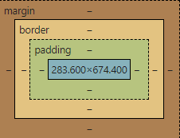
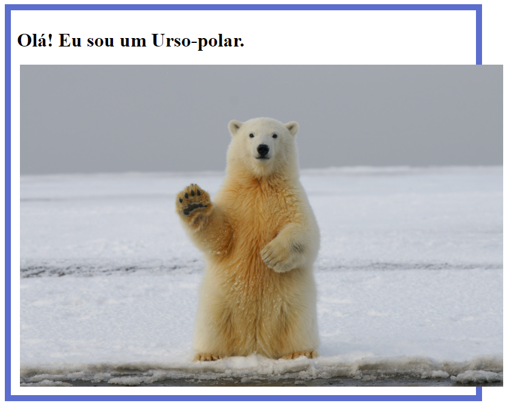
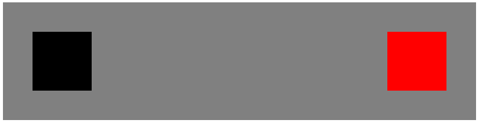

# Curso Alura - HTML e CSS: Classes, posicionamento e Flexbox

## Aula 1 - Seletores e Posicionamento

### Aula 1 - Apresentação - Vídeo 1

Transcrição
Guilherme: Olá! Meu nome é Guilherme Lima.

Rafaella: E eu sou Rafaella Ballerini.

Guilherme: Neste curso aprenderemos mais sobre CSS, certo Rafa?

Rafaella: Exatamente! Conseguiremos estilizar nossa página inteira.

Guilherme: Nós aprenderemos como posicionar elementos no CSS e utilizaremos as mesma tecnologias usadas no mundo real.

Rafaella: Conheceremos a tecnologia CSS e a forma como conseguimos trazer fontes diferentes para o nosso projeto.

Guilherme: Isso é bem legal! Também refinaremos o projeto que fizemos para deixá-lo ainda mais bonito.

Vamos começar!

### Aula 1 - Preparando o ambiente

Olá Dev!
Boas-vindas ao curso de HTML e CSS: posicionamento, fontes e Flexbox!

Neste treinamento, usaremos o editor de código [Visual Studio Code](https://code.visualstudio.com/download). Ele pode ser baixado tanto para Windows, como Linux ou Mac.

Além disso, estamos usando o Chrome como navegador principal e é importante tê-lo instalado em seu computador.

Caso você queira dar uma olhada no layout, [esse é o figma do projeto!](https://www.figma.com/community/file/1410363576427136130)

E por último e não menos importante, para se aprofundar no CSS e entender como funciona a estilização de páginas com tecnologias do mundo real, é necessário que você [baixe o zip do projeto base](https://github.com/alura-cursos/Portifolio-HTML-e-CSS/archive/refs/heads/aula_5.zip) ou acesse os [arquivos no Github!](https://github.com/alura-cursos/Portifolio-HTML-e-CSS/tree/aula_5)

Caso tenha dúvidas na instalação ou ao longo do curso, fique à vontade para se juntar ao fórum!

### Aula 1 - Classes no CSS - Vídeo 2

Transcrição  
Rafaella: Estamos em uma situação na qual queremos determinar uma cor específica para tag strong sem que essa formatação passe para todos os elementos que a utilizam. E existe uma maneira para fazermos isso.

No arquivo style.css, estamos usando as tags body e strong como seletores do CSS, o que significa que conseguimos escrever o nome da tag, as chaves ({}) e o que queremos que altere nela dentro dessas chaves. No caso do body, é a cor do fundo e da letra.

Contudo, essa não é a única forma de seletor, e uma dela que é muito utilizada no dia a dia é o seletor de classe que consegue resolver justamente esse problema. Portanto, vamos aprender como utilizá-lo.

Para isso, acessaremos o Google.

Guilherme: Podemos escrever, por exemplo, "classes CSS W3C". Inclusive o correto é "W3S", mas o Google conseguiu achar para nós como "W3C". Podemos abrir o primeiro resultado, que é o CSS .class Selector - W3Schools.

Nessa página ele tem um exemplo e uma definição, que está em inglês. Vamos alterar para o português, clicando na opção de tradução do google tradutor, que fica no canto direito da barra de endereço.

Dica: Inclusive pode aparecer uma janela flutuante com a opção de tradução no lado inferior direito da barra de endereços. O idioma inglês estará selecionado e, ao lado dele, aparecerá a opção "português". Basta clicar nela.

Então na seção "Definição e Uso" descobrimos que um seletor .class irá selecionar elementos com os atributos de uma classe específica. Essa explicação ficou um pouco confusa, mas o que ela quer dizer é que conseguimos selecionar partes para o CSS estilizar. Para selecionar cada elemento de uma classe específica, devemos escrever o ponto (referindo-se ao ponto final, ou seja, .).

Voltando para o nosso CSS, Rafa, repara que todas as nossas tags estão exatamente com o nome delas.

Rafaella: Exato!

Guilherme: O body e o strong, mas poderia ser também o h1, h2, h3, h4 e assim por diante. Basta escrevermos na estrutura nomeDaTag {} e dentro das chaves escrevermos as configurações.

Quando trabalhamos com classes, é diferente. Para criarmos classes no CSS, primeiramente vamos ao HTML e especificamos que a tag possui uma classe específica.

Rafaella: Então, no Explorador, abriremos o arquivo index.html e na linha 13, onde temos a `<strong>` adicionaremos a propriedade class (classe). Essa propriedade fica realmente dentro da tag, como descobrimos com as imagens e com a âncora.

Portanto para definir uma classe para qualquer tag, basta escrever class="" e entre as aspas o nome da classe que queremos, tudo isso dentro da tag, no caso, `<strong class="">`.

```html
//código suprimido
<strong class="">com um Front-end de qualidade!</strong></h1>
//código suprimido
```

Essa estrutura se aplica a qualquer tag para qual queiramos definir uma classe.

Guilherme: Boa, Rafa. Eu vou apenas fechar o Explorador para conseguirmos visualizar o código melhor.

E como funciona a nomeação da classe? Pode ser qualquer nome?

Rafaella: Existem diversos padrões que podemos seguir, mas nesse começo, recomendo sempre escrevermos algo que deixa bem óbvio do que se trata. Por exemplo, estamos no título da nossa página, e o strong é um destaque desse título, então seria bom nomearmos a classe como "titulo-destaque" ou "destaque-titulo".

Guilherme: Então sempre nomeamos de uma forma que faça sentido para aquele elemento.

Rafaella: Isso mesmo. Depois aprenderemos também um padrão que podemos seguir, por exemplo, estamos usando a classe "titulo-destaque", então para classe do título podemos escrever apenas "titulo". Então conseguimos encontrar padrões de nomes.

Guilherme: E aprenderemos isso com o passar do tempo.

Rafaella: Vamos então nomear como class="titulo-destaque".

Guilherme: Descobrimos também que para selecionar esse titulo-destaque precisamos usar o ponto (.) . Portanto voltaremos para o arquivo style.css e, no lugar do strong, escreveremos .titulo-destaque.

```CSS
body {
    background-color: #000000;
    color: #F6F6F6;
}

.titulo-destaque {
    color: #22D4FD;
}
```

Reparem que agora estamos em um momento diferente. Sempre que criamos uma classe CSS, selecionamos essa classe com o ponto final.

Rafaella: É a forma que informamos para o CSS que se trata de uma classe e não apenas de uma tag do HTML.

Guilherme: Temos outro desafio agora, Rafa. Pelo que fizemos, apenas o titulo-destaque estará na cor azul, enquanto o segundo strong, que está na linha 14 e que removeremos depois, porque foi apenas um exemplo, não estará com uma cor diferente.

Rafaella: Exato. É apenas para o strong do título estar azul.

Guilherme: Quando abrimos nosso projeto no navegador, observamos que funcionou. Conseguimos deixar a mesma tag, mas com uma classe específica, o que é bem comum, certo Rafa?

Rafaella: Isso! A classe é como um agrupamento de tipo. E podemos perceber que mesmo assim o trecho "React, HTML e CSS", na segunda linha, ficaram em destaque, mas apenas em negrito.

Isso ocorre porque o strong faz essa alteração quando é inserido em uma tag `<p>`. Portanto não se assustem, não é nenhuma configuração fora do normal ou alteração do CSS que fizemos, é porque utilizamos o `<strong>` que, por padrão, deixa o trecho em negrito dentro do parágrafo.

Porém podemos remover essa tag da linha 14, porque esse destaque não existe no modelo do nosso Figma. Ao retornarmos à página, observamos que o destaque sumiu no parágrafo, mas se manteve no título.

Agora aprendemos a utilizar classes no CSS e já podemos criá-las e utilizá-las em outras partes do projeto.

### Aula 1 - Para saber mais: Class

Class  
Agora você já sabe que o atributo class permite ao CSS selecionar e acessar elementos específicos através dos seletores de classe, mas para entender de forma mais clara e objetiva, você pode acessar a [documentação oficial MDN](https://developer.mozilla.org/en-US/docs/Web/HTML/Global_attributes/class) para tirar dúvidas.

Nomes de classes no CSS  
Quer entender as boas práticas para dar um nome nas classes do CSS? Recomendamos a leitura do [artigo Nomes de classes no CSS](https://www.alura.com.br/artigos/nomes-de-classes-no-css), que aborda de forma simples e prática esse conceito.

### Aula 1 - Seletor de classe

Os Seletores definem quais elementos um conjunto de regras CSS se aplica. Imagine que você precise editar a cor de um título <h1>, de preto para vermelho, que possui a propriedade class=“titulo”.

Qual a sintaxe correta do CSS para estilizar somente o elemento que possui essa classe específica?

Alternativa correta:

```CSS
.titulo {
color: red;
}
```

> Correto! Para estilizar uma classe no CSS é necessário utilizar o ponto final antes de chamar o nome atribuído à classe. Além disso, é a propriedade color do CSS que define o valor da cor de um elemento, e nesse caso, o valor red corresponde à cor vermelha.

### Aula 1 - Para saber mais: seletores

Seletores  
Agora que você já viu e praticou o conceito de seletores, te convido a ler a [documentação MDN](https://developer.mozilla.org/pt-BR/docs/Web/CSS/CSS_Selectors) para se aprofundar ainda mais no assunto.

Reset CSS  
Para mergulhar ainda mais nesse mundo Front-end, indico que leia o [artigo Reset CSS: O que é, Exemplos, Como Criar e Utilizar](https://www.alura.com.br/artigos/o-que-e-reset-css). Ele é muito relevante para o nosso treinamento, pois além de mostrar de forma detalhada como funciona essa ferramenta, também aborda conceitos e práticas que com certeza irão te auxiliar na sua jornada Dev!

### Aula 1 - Box Model - Vídeo 3

Transcrição  
Guilherme: Estamos com nosso layout um pouco desorganizado. Conseguimos adicionar as cores com hexadecimal, mas o posicionamento não está legal, Rafa.

Se observarmos, nosso título está grudado à lateral esquerda e parece que ele ocupa uma linha inteira, como também acontece com o parágrafo. O interessante é que , se rolamos a página um pouco para baixo, os links e a imagem parem também aparecer na mesma linha

A sensação que eu tenho é que, sem configurarmos, um estilo já foi aplicado.

Rafaella: Exatamente. Já existe um padrão quando estamos desenvolvendo em HTML e CSS, e justamente por isso, como pessoas desenvolvedoras Front-End, nós utilizamos a modularidade, através do "reset CSS".

Então resetamos o padrão que já existe, como uma decoração nos nossos links ou o espaçamento enorme que existe entre o início da nossa página e o título. No Figma, todo conteúdo está no centro da página, e para termos o controle de posicionamento desse título, não podemos contar com esse espaço do começo, que nem sabemos de quanto é.

Guilherme: Sendo que esse espaço não é padrão para todos os navegadores, certo?

Rafaella: Ainda tem esse ponto, os navegadores têm padrões um pouco diferentes.

Guilherme: Mudando a cor ou o tipo do link, por exemplo. Então realmente temos um problema, que é, temos um estilo e precisamos removê-lo.

Rafaella: Precisamos resetá-los para termos o controle de todos eles.

E podemos usar diversos tipos de reset para o CSS, desde gigantes, que resetam várias tags, e nem descobriremos tão cedo na nossa carreira, até os mais simples, com os quais conseguimos restar as tags mais usadas. Por exemplo, conseguimos resetar o espaçamento da página, ajustando a margem e o padding, que são duas propriedades que entenderemos agora como funcionam no CSS.

Guilherme: Antes disso, conseguimos ver esse espaçamento, Rafa?

Rafaella: Consegue!

Guilherme: Pessoal, o teste é o seguinte. Clicamos com o botão direito do mouse na página e selecionamos "Inspecionar", abrindo uma coluna na metade direita da janela com as DevTools.

Na parte superior dessa coluna pode aparecer a opção "Switch DevTools to Portuguese", e nós podemos clicar nela para mudar para o idioma das DevTools para o português. Na aba "Elementos" das DevTools há duas divisões na parte superior: na direita está a área do código e na área esquerda está a área de "Estilos".

Sendo assim, vamos clicar no botão "Selecionar Elemento" representado pelo ícone de um quadrado com o cursor do mouse no canto inferior direito. Esse botão está no canto superior esquerdo da DevTools, mas também podemos usar o atalho "Ctrl + Shift + C" para ativá-lo.

Feito isso, deixaremos o mouse no elemento do título, que está na metade esquerda da janela. Ao selecionar o título, a sensação que eu tenho, Rafa, é que tem o texto e em cima e embaixo tem algo envolvendo o texto.

Ao observarmos na aba "Estilos" da DevTools, na parte inferior temos vários retângulos um dentro do outro, cada vez menores em cores diferentes. Esses retângulo são:

- margin (margem): o maior e mais externo retângulo, que está na cor laranja-claro;
- border (borda): está dentro do retângulo da margem, sendo proporcionalmente menor a ele, e é da cor amarelo claro;
- padding (espaçamento): retângulo verde-claro que está dentro do retângulo da borda, também proporcionalmente menor a ele;
- conteúdo: um retângulo azul-claro que está dentro do retângulo de espaçamento e é proporcionalmente menor que ele.  


Na aba "Estilos", ao passarmos o mouse sobre o retângulo da margem, percebemos que no título da página, na metade esquerda da janela, observamos essa margem em destaque também, mudando a cor. Rafa, minha pergunta agora é um pouco estanha, mas vamos abrir a documentação para descobrirmos o que está acontecendo?

Rafaella: Ótima ideia! Vamos abrir outra aba e pesquisar no W3S, que já estávamos consultando, por "Box Model" (modelo de caixa). Sendo assim, vamos pesquisar no Google "w3s box model" e abrir a página correspondente ao resultado, que é o primeiro link.

Abrindo a [página de box model no W3S](https://www.w3schools.com/css/css_boxmodel.asp), encontramos a documentação com a mesma estrutura que vimos na aba "Estilos".

Guilherme: Porém as informações estão mais detalhadas, certo?

Rafaella: Estão. Eu vou traduzir a página e percebemos que esse é o modelo de caixa CSS, então cada elemento que estamos adicionando à página, ou seja, o título, o parágrafo e a imagem, todos são elementos do CSS.

Então quando voltamos para nossa página do projeto e passamos o mouse por cada um dos elementos, na aba "Estilos" constatamos que todos seguem o modelo de caixa. Da mesma forma, visivelmente enxergamos uma borda amarela em cima e embaixo do conteúdo no qual deixamos o mouse em cima. Essa borda representa a margem.

Nós não adicionamos nenhuma informação sobre margem na nossa página, então é isso que estávamos conversando. Existe um padrão que é criado automaticamente nas nossas páginas.

Voltando para documentação, descobrimos que existem, na verdade, três propriedades que conseguimos definir para o nosso elemento. O primeiro é a margem, que é mais externa, seguido da borda, que não está visível no nosso projeto, mas ela existe.

E dentro da borda existe o padding, que é o espaçamento da borda até o conteúdo. Então conseguimos encolher o conteúdo em relação à borda com o padding, enquanto da borda em relação aos elementos externos temos outro espaçamento, que é a margin.

Guilherme: Eu gostei até da explicação presente no W3S, Rafa. Nós temos o conteúdo, que é a parte visível, e temos várias outras coisas invisíveis que não sabemos que estão acontecendo.

Sabemos que existe um espaço ali, que agora sabemos que é a margem, além disso exista a borda, e o W3S explica que se trata do contorno do preenchimento do conteúdo, seja imagem ou texto.

Rafaella: O conteúdo e o padding.

Guilherme: Então Rafa, acho que nosso primeiro passo é tirar a margem de todos os elementos.

Rafaella: Vamos remover essa margem e também o padding, para garantirmos que não teremos esse espaçamento.

E voltando para o VS Code, no CSS existe uma forma de nos referirmos a todos os elementos da nossa página HTML.

Guilherme: Então não precisamos escrever todas as tags e classes, correto?

Rafaella: Não precisa. No nosso arquivo style.css, podemos fazer isso digitando apenas um asterisco (*). Assim ele pega todos os elemento da página. Em seguida, como em todos os elementos, abrimos chaves e, dento delas escrevemos margin: 0 e padding: 0.

```CSS
* {
    margin: 0;
    padding: 0;
}
```

Essa é a configuração padrão que mais utilizamos, pessoal. Existem outros resets CSS que retiram a decoração, entre outras coisas, mas usaremos só esses no nosso projeto, que é bem mais tranquilo. Feito isso, vamos salvar e conferir o resultado no navegador.

Com isso conseguimos notar que todo espaço que tínhamos entre o conteúdo e a página desapareceu. Inclusive podemos clicar para Inspecionar a página, sendo que às vezes a aba "Estilos" muda de posição. Dessa vez ela está em uma divisão abaixo do código, então vamos analisar o modelo de caixas.

Quando ativamos o seletor de elementos, pressionando "Ctrl + Shift + C" e passamos o mouse sobre os elementos da nossa página, reparamos que realmente não tem mais aquela margem padrão. Isso nos ajuda a ter muito mais controle dos elementos da nossa página.

Guilherme: E esse é o nosso próximo desafio!

### Aula 1 - Reset CSS

Você aprendeu sobre a importância de resetar o CSS antes de estilizar qualquer elemento de uma página, pois essa parte do código limpa todos os padrões dos navegadores. Diante disso, analise o erro do código abaixo e responda qual a sintaxe correta do reset.

```CSS
* {
margin: 100;
border: 100;
}
```

Resposta:  

```CSS
* {
margin: 0;
padding: 0;
}
```

> Correto! Para resetar os padrões dos navegadores de forma simples utilizamos as propriedades margin, que define a área de margem nos quatro lados do elemento (cima, direita, baixo, esquerda), e padding, que define a área de preenchimento interna nos mesmos quatro lados do elemento, ambas com valor igual à 0.

### Aula 1 - Lista de exercícios

O que é:  
Boas-vindas à nossa lista de exercícios "Mão na massa", um caminho prático e envolvente para aprender e aprimorar suas habilidades em tecnologia. Aqui, você não encontrará longas leituras teóricas ou explicações abstratas. Em vez disso, nossos exercícios são projetados para colocar você no centro do processo de aprendizado, permitindo que você construa, experimente e explore conceitos tecnológicos de forma direta e aplicada.

Para que serve:  
Esta lista é uma ferramenta dinâmica para aprender, reforçar e aprimorar habilidades práticas em programação e desenvolvimento web. Cada exercício é uma oportunidade de aplicar conhecimentos teóricos em cenários reais, preparando você não apenas para entender a tecnologia, mas para utilizá-la de maneira eficaz e criativa em seus próprios projetos ou no ambiente de trabalho.

Como fazer:

- Leia cada exercício com atenção: comece entendendo o cenário proposto e o que se espera como resultado.
- Escreva o código: utilize o ambiente de codificação de sua escolha para escrever e testar o seu código. Não se preocupe em acertar de primeira, a prática leva à perfeição.
- Verifique o gabarito: após tentar resolver o exercício, compare seu código com o gabarito fornecido em “Opinião do instrutor”. Isso ajudará a identificar áreas de melhoria e consolidar o aprendizado.
- Repita: a repetição é chave para o aprendizado. Tente fazer os exercícios mais de uma vez, aplicando melhorias e variantes.
- Lembre-se, cada desafio é uma chance de crescer. Não se desanime com os erros; eles são degraus no caminho do aprendizado. E acima de tudo, divirta-se! O aprendizado mais eficaz acontece quando nos engajamos e nos interessamos pelo que estamos fazendo.

Não se esqueça que estamos no Fórum e no Discord para te ajudar!

Bons estudos!

1) Estilizando elementos com classes CSS  
Você está trabalhando no desenvolvimento de uma página web e precisa aplicar estilos específicos a diferentes elementos usando classes CSS. Seu desafio é criar uma classe chamada "texto-destaque" no arquivo HTML para um elemento `<p>`e, em seguida, estilizar essa classe no arquivo CSS para alterar a cor do texto. Use sua criatividade para escolher cores que tornem o texto destacado, mas ainda legível e harmonioso com o design geral da página.

2) Destacando títulos com CSS  
Imagine que você está desenvolvendo um blog e precisa destacar os títulos das postagens. Crie uma classe CSS chamada "titulo-blog" e aplique-a a elementos <h1>no seu arquivo HTML. Em seguida, personalize essa classe no arquivo CSS para mudar a cor do texto, para dar mais destaque.

3) Estilos situacionais com classes CSS  
Você está trabalhando em um site de notícias e precisa aplicar um estilo diferente para notícias urgentes. Crie uma classe CSS chamada "urgente" e aplique-a a elementos <p>que contêm notícias urgentes. No CSS, faça com que o texto desses parágrafos seja vermelho, para chamar a atenção do leitor.

4) Entendendo e aplicando o reset CSS  
Você está trabalhando em um projeto de site e notou que o layout está um pouco desorganizado devido aos estilos padrões aplicados pelo navegador. Sua tarefa é aplicar um "reset CSS" para remover esses estilos padrão. Comece criando um arquivo CSS e utilize o seletor universal * para definir a margin e o padding de todos os elementos para 0. Teste o efeito dessa mudança no layout do seu site.

5) Inspecionando elementos e entendimento do modelo de caixa  
Como quem trabalha com front-end, você precisa entender como os estilos são aplicados aos elementos da sua página. Use as ferramentas de desenvolvimento (DevTools) do navegador para inspecionar o modelo de caixa de um elemento do seu site. Preste atenção nas propriedades margin, border, padding e content. Descreva como essas propriedades estão afetando o elemento selecionado.

6) Aplicando o modelo de caixa na prática  
Agora que você entendeu o modelo de caixa CSS, aplique esse conhecimento no seu projeto. Selecione um elemento específico (por exemplo, um parágrafo) e ajuste as propriedades de margin, border, padding e content. Observe como cada alteração afeta o posicionamento e a aparência do elemento na página.

Opinião do instrutor

1) Estilizando elementos com classes CSS

- Abra o arquivo HTML e localize o elemento <p>que você deseja estilizar.
- Adicione a propriedade class="texto-destaque" dentro da tag <p>.
- No arquivo CSS, crie uma nova regra para a classe .texto-destaque. Por exemplo:

```CSS
    color: #FF5733; /* Escolha uma cor vibrante */
```

2) Destacando títulos com CSS

- No arquivo HTML, adicione class="titulo-blog" aos elementos `<h1>`que representam os títulos das postagens.
- No arquivo CSS, defina a regra para .titulo-blog. Exemplo:

```CSS
    color: #007BFF; /* Escolha uma cor marcante */
```

3) Estilos situacionais com classes CSS  

- No arquivo HTML, identifique os parágrafos com notícias urgentes e adicione class="urgente" a esses elementos `<p>`.
- No CSS, crie a regra para a classe .urgente. Exemplo:

```CSS
    color: red; /* Cor vermelha para urgência */
```

4) Entendendo e aplicando o Reset CSS

- Criar o Arquivo CSS: Crie um novo arquivo CSS (por exemplo, style.css) para o seu projeto.
- Escrever o Código de Reset CSS: No arquivo style.css, adicione o seguinte código:

```CSS
   * {
       margin: 0;
       padding: 0;
   }
```

- Linkar o Arquivo CSS ao HTML: Certifique-se de que o arquivo CSS está corretamente vinculado ao seu arquivo HTML.
- Testar as Mudanças: Abra o seu site no navegador e observe as mudanças no layout. Os espaços padrões (margens e paddings) devem ter sido removidos.

5) Inspecionando elementos e entendimento do modelo de caixa

- Acessar as DevTools: Clique com o botão direito em um elemento da sua página e selecione "Inspecionar" para abrir as DevTools.
- Analisar o Modelo de Caixa: Na aba "Elementos", passe o mouse sobre as diferentes propriedades (margin, border, padding, content) para visualizar como elas estão afetando o elemento selecionado.
- Descrever as Observações: Note como cada uma dessas propriedades altera o layout do elemento. Por exemplo, margin adiciona espaço externo, padding espaço interno, border define um contorno, e content é a área onde o conteúdo do elemento é exibido.

6) Aplicando o modelo de caixa na prática

- Selecionar um Elemento: Escolha um elemento no seu HTML, como um parágrafo (`<p>`).
- Aplicar Estilos no CSS: No seu arquivo CSS, adicione estilos específicos para o elemento escolhido. Por exemplo:

```CSS
   p {
       margin: 10px;
       border: 2px solid black;
       padding: 5px;
   }
```

Observar as Mudanças: Após salvar as alterações no arquivo CSS, recarregue a página no navegador e observe como o elemento selecionado mudou. A margem adiciona espaço externo, a borda cria um contorno visual, o padding adiciona espaço interno, e o conteúdo é exibido dentro desses limites.

### Aula 1 - O que aprendemos?

- Nessa aula, você aprendeu:
- Utilizar classes no HTML e CSS;
- Boas práticas na criação das classes;
- Posicionamento de elementos com CSS;
- Importância de resetar o padrão do CSS;
- Testar os elementos da página inspecionando via ferramenta de desenvolvimento;
- Box model (margin, border e padding);

Diferentes seletores CSS.

## Aula 2 - Posicionando mais elementos

### Aula 2 - Projeto da aula anterior

Aqui você pode [baixar os arquivos da aula 01](https://github.com/alura-cursos/Portifolio-HTML-e-CSS-Curso2/archive/refs/heads/aula_1.zip) ou acessar os [arquivos no Github!](https://github.com/alura-cursos/Portifolio-HTML-e-CSS-Curso2/tree/aula_1)

### Aula 2 - Height e box-sizing - Vídeo 1

Transcrição  
Guilherme: No nosso código CSS, aplicamos o margin: 0 e o padding: 0. Existem outros padrões para adicionarmos e desenvolvermos nosso projeto de uma forma legal, Rafa?

É bom sabermos esses padrões desde o começo. Por exemplo, existe alguma forma de garantirmos que nossa página ocupará 100% do tamanho da tela? Porque isso é bem importante.

Vamos voltar ao Figma do projeto para eu mostrar uma coisa para você. Nesse Figma, toda nossa aplicação fica em uma tela. Não temos scroll, está tudo em uma tela só.

Projeto do Figma. Temos dois blocos de conteúdo, lado a lado, centralizados sobre fundo preto. O bloco esquerdo possui um texto que se divide em duas partes: título e subtítulo. O título apresenta um texto em negrito dividido em duas cores: "Eleve seu negócio digital a outro nível" em branco, seguido de "com um Front-end de qualidade!" em ciano. O subtítulo está na cor branca, e exibe o texto de apresentação da Joana Santos. Abaixo do subtítulo temos dois botões na cor ciano, lado a lado: no botão esquerdo temos o texto "Instagram" e no direito o texto "Github". Já o bloco direito se constitui de uma fotografia em preto e branco representando Joana Santos, uma mulher desenvolvedora, sentada em frente a um notebook aberto. A fotografia também conta com um desenho em ciano de uma linha circulando Joana e seu notebook três vezes e terminando em uma estrela.

Tem alguma propriedade do CSS que nos permite informar que ocupamos todo tamanho dessa tela e como vermos que não está ocupando?

Rafaella: Tem sim, vamos descobrir como. Abrindo o "Inspecionar" do nosso projeto de portfólio, e aqui eu vou diminuir o zoom, porque está em 155%, ao passarmos o mouse sobre o código body, na coluna da direita.

Lembrando que o body contém todo nosso conteúdo e, ao observamos a seleção, notamos que ele não ocupa toda página. Na verdade ele termina praticamente na metade da página.

O que conseguimos fazer é usar um padrão inicial no qual sempre conseguimos usar 100% da altura da tela. Para isso, voltaremos ao arquivo style.css no VS Code e, dentro das chaves do body, adicionaremos o valor de height (altura).

Lembrete: É comum confundir a posição do "T" em height, para isso, fica o lembrete que o T é no final.

E definiremos uma altura para o nosso body

Guilherme: Lembrem que o "T" de height fica no final, pessoal, para não se confundirem!

Rafaella: E nós vamos definir uma altura para o nosso body, ou seja, todo corpo da página. E o valor que vamos atribuir é de 100vh.

```CSS
body {
    height: 100vh;
    background-color: #000000;
    color: #F6F6F6;
}
```

E o que é esse vh?

Guilherme: Nós demos um spoiler sobre isso quando fizemos o index.html, certo, Rafa?

Rafaella: Sim! Vou até voltar para o arquivo do index.html, onde criamos uma meta informação na linha 6 chamada viewport. Essa é a tela onde estamos acessando nosso projeto.

Então no CSS nós definimos a altura dessa tela equivalente a 100% do viewport, ou seja, da tela do nosso projeto no navegador.

Guilherme: E isso já mudou no navegador?

Rafaella: Vamos ver. Vamos recarregar a tela do nosso projeto no navegador e com o Inspecionar ainda aberto, vamos passar o mouse sobre o código do elemento body. Feito isso, toda tela fica azul, que é a cor desse elemento, então estamos ocupando 100% da tela!

Guilherme: Bem legal!

Rafaella: E esse é um padrão que podemos utilizar sempre, no começo dos nossos códigos. Além disso, tem outro padrão interessante de adicionarmos.

Guilherme: Nós informamos que a altura máxima será equivalente a toda a tela do dispositivo, agora precisamos garantir que nada fique de fora dessa tela.

Rafaella: O que o Guilherme está tentando dizer é que às vezes temos uma imagem cuja margem à esquerda fica tão grande que ela sai do body. Então precisamos garantir que os elementos "filhos", que estão dentro das tags maiores, como a tag "pai" `<body>`, ou seja, uma tag que está abaixo de outra não saia da tela.

Para isso, temos uma propriedade, que veremos agora na documentação. Para acessar a documentação, vamos pesquisar pelo nome da propriedade, que é "box sizing". E para ela eu gosto muito de usar como referência o Mozilla, porque tem um exemplo mais visual.

Então acessaremos a página box-sizing do Mozilla e traduziremos o texto para o Português. No começo da página já encontramos três exemplos de box sizing no centro esquerdo da página, e o efeito deles no conteúdo do lado direito.

Inicialmente temos o valor do content-box, e ele declara o width (largura) de 100%. No segundo exemplo também tem um content-box ao qual é adicionado uma borda e um padding, que já aprendemos o que são. Por fim, tem um box-sizing com o valor border-box.

```CSS
box-sizing: content-box;
width: 100%;

box-sizing: content-box;
width: 100%;
border: solid #5B6DCD 10px;
padding: 5px;

box-sizing: border-box;
width: 100%;
border: solid #5B6DCD 10px;
padding: 5px;
```

A cada exemplo que clicamos, observamos como o conteúdo vai se alterando no lado direito. Então com o primeiro momento o elemento "filho" tem 100% da largura, então ele fica completamente dentro do elemento "pai". Pensando no nosso projeto, se deixássemos a imagem com width: 100%, ela ocuparia toda a largura do body.

No segundo exemplo temos uma borda e um padding. Se quiséssemos aplicar isso à imagem do nosso projeto, ou seja, adicionar uma borda colorida e deixar um espaçamento entre essa borda e o conteúdo, a imagem iria sair do nosso body, como aconteceu conteúdo do exemplo.

Com o valor content-box no box-sizing pode acontecer isso, e não é o que queremos. O que queremos é o valor border-box, porque com ele conseguimos criar, por exemplo, uma borda e um padding, ou o que quisermos, e o conteúdo será encolhido para sempre ser mantido dentro do elemento "pai".

Pode não parecer legal encolher esse conteúdo, mas é isso que faz com que tenhamos controle de como todos os elementos estão funcionando, já que é muito frustrante estar fazendo uma alteração no elemento "filho" e ele sair do "pai. Outro exemplo no nosso projeto: temos como "filho" o destaque do título, imagina se ele sai do elemento "pai".

Então precisamos desse controle do "filho" dentro do "pai", e para isso conseguimos usar como padrão o box-sizing: border-box. Sendo assim, vamos copiar esse código e adicioná-lo ao body do CSS.

```CSS
body {
    height: 100vh;
    box-sizing: border-box;
    background-color: #000000;
    color: #F6F6F6;
}
```

Vamos salvar e atualizar a página do projeto no navegador.

Guilherme: Visualmente não notamos nenhuma diferença, mas agora nada vai sair da nossa página.

Rafaella: E essa é uma ótima prática para vocês aplicarem em todos os projetos que criarem, caso a intenção seja evitar que a imagem saia do body, ou seja, evitar que o elemento "filho" saia do elemento "pai".

### Aula 2 - Para saber mais: Viewport

O que é Viewport?  
Em computação gráfica, a viewport é a porção de área visível de um plano e é utilizada como unidade de medida no CSS para criar páginas Web 100% responsivas. Em outras palavras, a viewport varia de dispositivo para dispositivo, por exemplo em computadores, tablets e celulares, cada tela possui dimensões diferentes e enquanto uma página não responsiva apresentaria os elementos desproporcionais, uma página responsiva utilizando viewport teria seus elementos adequados a cada proporção.

Se você demonstrou interesse pelo assunto e quer se aprofundar mais, recomendamos que leia o [artigo Guia de Unidades no CSS](https://www.alura.com.br/artigos/guia-de-unidades-no-css). Através dele você vai conhecer não só a Viewport, mas também outras unidades e conceitos muito utilizados no dia a dia de Dev Front-end.

### Aula 2 - Posicionando uma imagem com box-sizing

Você aprendeu no vídeo anterior que a propriedade box-sizing é responsável por como a largura e a altura totais de um elemento são calculadas. Diante disso, imagine que você está criando um projeto e se depara com um erro: a imagem utilizada está passando do limite do elemento pai. Em outras palavras, você quer que a imagem, elemento filho, “encolha” e se adeque ao conteúdo, elemento pai.

Utilize a imagem abaixo como exemplo da situação e responda quais devem ser os valores das propriedades box-sizing, widthe paddingpara resolver o problema corretamente.  


Print de um conteúdo demarcado pela tag main, a qual tem um título e uma imagem dentro. A imagem em questão ultrapassa a margem do conteúdo main.

Alternativa correta:

```CSS
box-sizing: border-box;
width: 100%;
padding: 5px;
```

Correto! Neste caso a imagem (elemento filho) “encolheria” e se adequaria ao tamanho do conteúdo (elemento pai). Isso acontece porque o border-box informa ao navegador para contabilizar qualquer borda e preenchimento nos valores especificados para a largura e a altura de um elemento.

### Aula 2 - Flexbox - Vídeo 2

Transcrição  
Guilherme: Rafa, por favor, eu preciso da sua ajuda, porque ele não está bonito! As cores estão legais e a imagem também, mas como mudamos o posicionamento desses elementos?

Não precisa ficar lindo, mas seria legal ter os textos de um lado e a imagem do outro.

Rafaella: Existem várias formas de posicionarmos esses elementos na página. Podemos usar posições fixas e definir quanto pixels queremos de margem, por exemplo, 300px na margem superior do título, empurrando todo conteúdo para baixo.

Entretanto definir um número fixo não é uma boa prática, porque podemos usar várias telas para abrir nosso projeto, e assim ele não ficará da mesma forma como imaginamos.

Guilherme: Vou até usar um exemplo. Você define uma margem de 300px e eu abro no celular, que não tem todo esse espaço, então vai ficar muito estranho. Ou então eu abro em um super monitor gamer de 34 polegadas e o espaço ficará minúsculo.

Rafaella: Vai ficar horroroso. Então podemos utilizar esse posicionamento específico em alguns pontos específicos. Porém quando temos dois elementos grandes para posicionar, como observamos no Figma do nosso projeto, e queremos posicionar em relação um ao outro, conseguimos usar tecnologias que já foram criadas para facilitar a resolver esse problema.

No caso, temos vários elementos para posicionar na nossa página, mas eu me referi a dois elementos porque temos uma seção principal, com o texto e os botões do lado esquerdo, e a imagem, do lado direito. Portanto são dois grandes elementos que queremos centralizar na página, mas deixá-los lado a lado.

Projeto do Figma visto no vídeo passado. Temos dois blocos de conteúdo, lado a lado, centralizados sobre fundo preto. O bloco esquerdo possui um texto que se divide em duas partes: título e subtítulo. Abaixo do subtítulo temos dois botões na cor ciano, lado a lado: no botão esquerdo temos o texto "Instagram" e no direito o texto "Github". Já o bloco direito se constitui de uma fotografia em preto e branco representando Joana Santos.

Uma das tecnologias que usaremos agora no nosso projeto é o Flexbox. E como tudo que já fizemos, buscaremos a documentação dele.

Guilherme: Podemos reparar que essa é uma prática constante. Sempre que vamos aprender algo novo, conferimos a documentação. Estamos tentando guiar vocês à uma documentação mais fácil e que tenha uma tradução em português.

Podemos até abrir a documentação do Mozilla sobre Flexbox e ao traduzir para o português somos informados que se trata de "uma nova tecnologia" e que a ideia deles é "centralizar blocos de conteúdo verticalmente dentro do seu pai". Inclusive já aprendemos que o "pai" seria o elemento que contém outros elementos dentro.

Eu recomendo que vocês leiam essa documentação com calma, mas ela é bastante técnica. Porém existe um "atalho" que vamos passa, certo, Rafa?

Rafaella: Exato, é um guia do Flexbox com imagens, sendo muito mais tranquilo de conhecerem: o chamado A Complete Guide to Flexbox. Também traduziremos essa página para o português e, ao rolar por essa página, nos deparamos com várias imagens.

Agora nós tentaremos entender como iniciar a utilização do Flexbox. O primeiro ponto é que existe uma propriedade que precisamos definir para o elemento "pai", e ela indica quando começaremos a usar o flexbox para posicionar nossos elementos. O nome dessa propriedade, como mostra o primeiro exemplo, é o display: flex.

```CSS
.container {
  display: flex; /* or inline-flex */
}
```

Nesse caso, podemos chamar a tag "pai" de container, mas sempre precisamos adicionar essa propriedade. Então vou copiar e voltar para o nosso código index.html no VS Code.

Comparando o Figma com o index.html, conseguimos analisar que o elemento "pai" dos elementos que queremos posicionar, ou seja, o container que fica o envolve, é o `<main>`. Tudo está dentro do `<main>`, portanto é nele que vamos codar a propriedade que informa onde usaremos o Flexbox, como informou o Complete Guide.

E para conseguirmos estilizar nosso main, criaremos uma classe para ele. Como nomeamos essa classe?

Guilherme: Como estamos mostrando o texto e a imagem, pode ser "apresentação".

Rafaella: Então será "apresentacao", por isso nossa linha 12 fica:

```html
<main class="apresentacao">
```

Guilherme: Rafa, em nenhum momento das classes que estamos criando você escreve com acentuação. Nós não usamos acento, certo?

Rafaella: Não, porque é uma boa prática e é mais fácil de não ter erros. Como comentamos, existe a questão de a máquina interpretar o acento como uma série de códigos, o que não é legal. Por isso escrevemos sem acento.

E agora, no style.css, após o fechamento de chaves do .titulo-destaque {} e pressionamos "Enter" duas vezes e codamos, a partir da linha 17:

```CSS
.apresentacao {
    display: flex;
}
```

Colamos dentro dessa classe a propriedade que vimos na documentação. Agora, voltando para o navegador, observamos que nosso conteúdo de texto está à esquerda enquanto a imagem está à direita da página.

Guilherme: Ele mudou! Diz se eu entendi, Rafa. Ele está dizendo que o main, que é o "pai" será display: flex, então ele coloca todos os elementos do main na mesma linha.

Rafaella: Na verdade, o Flexbox faz isso por padrão, ou seja, deixa os elementos no sentido de linha, que em inglês é Row, mas isso é configurável. Não necessariamente queremos que nossos elementos fiquem em uma linha, e eles podem ficar na posição de coluna; Essa é outra propriedade que podemos inserir no código: a flex-direction, como mostra o Complete Guide.

```CSS
.container {
  flex-direction: row | row-reverse | column | column-reverse;
}
```

Contudo, o padrão do nosso projeto é horizontal, ou seja, do lado esquerdo fica o texto e do direito a imagem. Então não precisamos alterar esse padrão, ou seja, não precisamos alterar a propriedade flex-direction e determinar se será coluna ou linha. Inclusive podemos escrever como flex-direction: row, mas ele já está fazemos o que gostaríamos.

Guilherme: Então por default (padrão) ele já tem algumas configurações.

Rafaella: Sim, por isso já ficou automaticamente em forma de linha.

Guilherme: Vamos voltar no nosso projeto no navegador, Rafa, porque tem algo que achei interessante. Tiramos a margem e, quando deixamos no display: flex ele deixou na mesma linha.

Conseguimos centralizar esse conteúdo? Porque é um segundo passo grande vencido.

Rafaella: Descendo na documentação do Complete Guide, encontramos a propriedade Itens de alinhamento. Nela temos 5 imagens que representam a disposição dos itens na página.

Representação gráfica dos itens de alinhamento, presente na documentação. Na imagem há cinco figuras de retângulos roxos com retângulos laranjas no seu interior. Os retângulos roxos estão dispostos em três linhas. Na primeira linha há dois retângulos de medidas iguais lado a lado. O do lado esquerdo está sob o título "flex-start" e dentro dele os retângulos laranjas estão alinhados horizontalmente na parte superior. Já o retângulo roxo da direita está sob o título "flex-end", e os retângulos laranjas estão alinhados horizontalmente na parte inferior. Na segunda linha de figuras, também há dois retângulos roxos, lado a lado, e ambos possuem a mesma medida. O da esquerda está sob o título "center" e os retângulos laranjas estão alinhados horizontalmente no centro do retângulo roxo. Já a figura da direita está sobre o título "stretch" e os retângulos laranjas no seu interior possuem as mesmas medidas de altura e largura, sendo que a altura do retângulo roxo e dos retângulos laranjas são iguais. Na terceira linha há apenas um retângulo roxo, cuja largura é o dobro dos retângulos anteriores, portanto ele ocupa toda extensão da linha de figuras. Ele está sob o título "baseline". Dentro dele os retângulos laranjas possuem tamanhos diferentes de altura e largura, mas a disposição deles ocupa toda largura do retângulo roxo. Dentro de cada um dos retângulos laranjas está escrito "text" em seu interior. Uma linha horizontal amarela passa por todos os retângulos laranjas, exatamente abaixo do "text text”, indicando que os textos estão alinhados.

```CSS
.container {
  align-items: stretch | flex-start | flex-end | center | baseline | first baseline | last baseline | start | end | self-start | self-end + ... safe | unsafe;
}
```

Temos os itens na forma de flex-start, que é o valor da propriedade inicial, como está a página do nosso projeto. Além disso, podemos deixar todos os conteúdos no final da página, com flex-end, mas o que você falou para fazermos é deixá-lo no centro, então no valor da propriedade vamos codar align-items: center, como a documentação está informando para nós.

```CSS
.apresentacao {
    display: flex;
    align-items: center;
}
```

Quando salvamos e voltamos para observar nossa página no navegador, vemos que os conteúdos de texto estão centralizados, mas nossos elementos não estão no centro da página.

Guilherme: Parece que está no centro da imagem.

Rafaella: É justamente isso. Na verdade o align-items alinha os itens de acordo com o próprio alinhamento deles. Então temos a imagem, que é o elemento de maior altura, e ela que define qual será o ponto central do alinhamento. Então todos os alinhamentos estão alinhados conforme a imagem.

### Aula 2 - Utilizando o Flexbox

Agora que você aprendeu que o Flexbox é uma ferramenta do CSS que visa organizar os elementos de uma página HTML de forma dinâmica e mantendo um layout flexível, analise o trecho do código HTML abaixo. Em seguida, responda como deve ser escrito o código CSS de forma a aplicar o Flexbox corretamente à classe sobre-mim.

```html
<main class=”sobre-mim”>
    <h1>Sobre mim</h1>
    <p>Olá! Sou a Rafa Ballerine, desenvolvedora Front-end e apaixonada por tecnologia.</p>
```

Resposta:  

```CSS
.sobre-mim {
display: flex;
}
```

> Correto! O seletor de classe foi utilizado corretamente através do ponto final (.) antes do nome e a propriedade display com o valor flex é a estrutura padrão do Flexbox.

### Aula 2 - Para saber mais: guia Flexbox

Guia completo do Flexbox  
Durante a aula foi apresentado o [Complete Guide to Flexbox](https://css-tricks.com/snippets/css/a-guide-to-flexbox/). Ele é recomendado, pois simplifica e abrange tudo sobre o layout CSS Flexbox, explicando sobre as diferentes propriedades para o elemento pai e os elementos filhos. Ele também inclui histórico, demonstrações, padrões e um gráfico de suporte do navegador.

Material Alura  
Se você quiser mergulhar de vez nesse assunto, você pode explorar o nosso [curso CSS: Flexbox e layouts responsivos](https://cursos.alura.com.br/course/css-flexbox-layouts-responsivos) e também recomendamos que busque por [CSS: Flexbox](https://cursos.alura.com.br/search?query=flexbox) aqui na escola. Contamos com diversos outros materiais entre cursos, artigos e Alura+ para estruturar e complementar seus estudos.

### Aula 2 - Faça como eu fiz: alinhe os elementos

HTML  
Antes de alinhar os itens no CSS temos que criar a classe lá no arquivo HTML. Para isso vamos na tag <main> e dentro delas adicionamos a propriedade class. Lembrando que como qualquer outra propriedade devemos utilizar o sinal de = para atribuir um valor, ou neste caso um nome, e o mesmo deve estar entre aspas duplas (“”). Acompanhe o código:

```html
<main class=”apresentacao”>
```

Repare que definimos o nome da classe como apresentacao e não utilizamos acento nem o cedilha, seguindo assim as boas práticas citadas anteriormente.

CSS  
Agora que o código HTML está pronto, vamos alinhar os elementos no CSS. Para começar, utilizamos o seletor .apresentacao para selecionar apenas os elementos que estão dentro da nossa classe criada no conteúdo main. Após abrir e fechar as chaves, estrutura básica do CSS, vamos utilizar apenas duas linhas de código para conseguir o resultado final. Segue o código abaixo:

```CSS
.apresentacao {
    display: flex;
    align-items: center;
}
```

Repare agora que utilizamos a propriedade display com o valor flex para podermos utilizar o flexbox em nossa estilização. Aí sim, de fato, escrevemos o align-items com o valor center para alinhar os elementos, centralizando-os em relação a si mesmo. E pronto! Temos o nosso código estruturado e funcional, com os elementos alinhados.

Opinião do instrutor

HTML

```html
<!DOCTYPE html>
<html lang="pt-br">
<head>
    <meta charset="UTF-8"> 
    <meta http-equiv="X-UA-Compatible" content="IE=edge">
    <meta name="viewport" content="width=device-width, initial-scale=1.0">
    <title>Portifolio</title>
    <link rel="stylesheet" href="style.css">
</head>
<body>
    <header></header>
    <main class="apresentacao">
        <h1>Eleve seu negócio digital a outro nível 
            <strong class="titulo-destaque">com um Front-end de qualidade!
            </strong></h1>
            <p>Olá! Sou Joana Santos, desenvolvedora 
            Front-end com especialidade em React, HTML e
            CSS. Ajudo pequenos negócios e designers a 
            colocarem em prática boas ideias. Vamos 
            conversar?</p>
            <a href="https://instagram.com/rafaballerini">Instagram</a>
            <a href="https://github.com/guilhermeonrails">GitHub</a>
            
    </main>
    <footer></footer>
</body>
</html>
```

CSS

```CSS
*{
    margin: 0;
    padding: 0;
}
body{
    height: 100vh;
    box-sizing: border-box;
    background-color: #000000;
    color: #F6F6F6;
}

.titulo-destaque{
    color: #22D4FD;
}
.apresentacao{
    display: flex;
    align-items: center;
}
```

### Aula 2 - Lista de exercícios

1) Ajustando a altura da tela com CSS
Você está desenvolvendo um site e deseja que ele ocupe 100% da altura da tela do usuário, sem deixar espaços em branco acima ou abaixo do conteúdo. Para isso, você precisa ajustar o elemento body do seu CSS para garantir que ele preencha toda a altura da tela. Utilize a propriedade height e o valor 100vh para conseguir este efeito. Teste o resultado usando a ferramenta "Inspecionar" do navegador para verificar se o body realmente ocupa toda a altura da tela.

2) Controlando o tamanho de elementos com Box Sizing  
Imagine que você está trabalhando em um projeto web e precisa garantir que todos os elementos filhos dentro do body não ultrapassem os limites, especialmente ao adicionar bordas e paddings. Para isso, você deve utilizar a propriedade box-sizing com o valor border-box no elemento body. Após aplicar esta configuração, inspecione o layout para garantir que nenhum elemento filho ultrapasse o limite do body e os seus próprios tamanhos definidos, mesmo ao adicionar bordas e paddings.

3) Criando um layout sem scroll  
Você recebeu um design do Figma para um site que deve caber em uma única tela, sem necessidade de scroll. O design inclui dois blocos de conteúdo sobre um fundo preto. O desafio é criar um layout CSS que reproduza essa estrutura, garantindo que todo o conteúdo caiba em uma tela, sem scroll. Utilize as propriedades CSS adequadas para posicionar os blocos de conteúdo lado a lado e centralizá-los na página, mantendo o design conforme especificado no Figma.

4) Flexbox: alinhando textos e imagens  
Você está desenvolvendo um site e precisa posicionar textos e uma imagem lado a lado, adaptando-se a diferentes tamanhos de tela. Utilize Flexbox para alinhar um bloco de texto à esquerda e uma imagem à direita dentro de um `<main>`.

```html
<main class="container">
  <p class="texto">Texto aqui...</p>
  
</main>
```

```CSS
.container {
  display: flex;
  justify-content: space-between;
}
```

5) Flexbox: Centralização vertical  
Seu desafio é centralizar verticalmente o conteúdo de um container usando Flexbox. Você tem uma <div> com a classe .container contendo vários itens.

```html
<div class="container">
  <div>Item 1</div>
  <div>Item 2</div>
  <!-- Mais itens aqui -->
</div>
```

```CSS
.container {
  display: flex;
  align-items: center;
  height: 300px; /* Altura ajustável conforme necessário */
}
```

6) Flexbox: responsividade e alinhamento  
Crie uma página web responsiva onde os elementos se ajustam em diferentes tamanhos de tela, evitando margens fixas. Utilize Flexbox para alternar entre dispor elementos em uma linha ou coluna.

```html
<div class="responsivo-container">
  <div>Conteúdo 1</div>
  <div>Conteúdo 2</div>
  <!-- Mais conteúdos -->
</div>
```

```CSS
.responsivo-container {
  display: flex;
  flex-direction: row;
  flex-wrap: wrap;
}
```

Opinião do instrutor

1) Ajustando a altura da tela com CSS

- Abra o arquivo CSS do seu projeto.
- Localize a seção onde o estilo do body é definido.
- Adicione a propriedade height com o valor 100vh. Isso define a altura do body para ser 100% da altura da janela de visualização (viewport height).
- Salve as alterações e abra a página no navegador.
- Utilize a ferramenta "Inspecionar" para verificar se o body agora ocupa toda a altura da tela.
Código:

```CSS
body {
    height: 100vh;
    /* Outras propriedades do body, se houver */
}
```

2) Controlando o Overflow com Box Sizing

- Abra o arquivo CSS do seu projeto.
- No estilo do body, adicione a propriedade box-sizing com o valor border-box.
- Isso garante que a largura e altura dos elementos filhos sejam calculadas incluindo bordas e paddings, evitando que eles ultrapassem os limites do body.
- Salve as alterações e teste o layout adicionando bordas e paddings aos elementos filhos para verificar se eles permanecem dentro dos limites do body.
Código:

```CSS
body {
    box-sizing: border-box;
    /* Outras propriedades do body, se houver */
}
```

3) Criando um layout sem scroll

- Abra o arquivo CSS do seu projeto.
- Utilize flexbox ou grid para criar um layout que acomode os dois blocos de conteúdo lado a lado.
- Certifique-se de que o body ou o contêiner principal tenha height: 100vh e width: 100% para ocupar toda a tela.
- Aplique estilos aos blocos de conteúdo para alinhá-los e centralizá-los conforme o design do Figma.
- Teste o layout para garantir que todo o conteúdo caiba na tela sem a necessidade de scroll.
Código:

```CSS
body {
    display: flex;
    justify-content: center;
    align-items: center;
    height: 100vh;
    width: 100%;
}
/* Estilos para os blocos de conteúdo conforme o design do Figma */
```

4) Flexbox: alinhando textos e imagens

- Adicione a propriedade display: flex; ao elemento `<main>` para ativar o Flexbox.
- Use justify-content: space-between; para posicionar o texto à esquerda e a imagem à direita.
- Aplique estilos adicionais conforme necessário para melhorar o layout.

5) Flexbox: Centralização vertical

- Acesse o arquivo CSS e selecione o container usando .container { ... }.
- Adicione display: flex; para ativar o Flexbox.
- Utilize align-items: center; para centralizar os itens verticalmente no container.
- Verifique o resultado no navegador para assegurar que o alinhamento esteja correto.

6) Flexbox: responsividade e alinhamento

- No seu CSS, selecione o container principal e defina display: flex;.
- Use flex-direction: row; ou column; para ajustar a direção dos itens.
- Adicione flex-wrap: wrap; para permitir que os itens se ajustem e mudem de linha conforme o tamanho da tela.
- Teste em diferentes tamanhos de tela para garantir a responsividade.

### Aula 2 - O que aprendemos?

Nessa aula, você aprendeu:

- Padrões de projetos CSS com height e box-sizing;
- Unidade Viewport;
- Hierarquia entre elementos pai e filho;
- Formas e parâmetros de posicionamento;
- Flexbox.

## Aula 3 - Estilos de texto e fonts

### Aula 3 - Projeto da aula anterior

Aqui você pode [baixar os arquivos da aula 02](https://github.com/alura-cursos/Portifolio-HTML-e-CSS-Curso2/archive/refs/heads/aula_2.zip) ou acessar os [arquivos no Github!](https://github.com/alura-cursos/Portifolio-HTML-e-CSS-Curso2/tree/aula_2)

### Aula 3 - Alinhando o conteúdo - Vídeo 1

Transcrição  
Guilherme: Entendemos a questão do posicionamento do flex. Porém, se abrirmos o [Figma do nosso projeto](https://www.figma.com/file/4EKKCbr5rS93RWP7kRjXIz/Portfolio---Curso-1?node-id=0%3A1) veremos que o título, o texto e os botões de Instagram e de Github parecem um só bloco, enquanto a imagem parece outro bloco acoplado.

Projeto do nosso portfólio no Figma. Temos dois blocos de conteúdo, lado a lado, centralizados sobre fundo preto. O bloco esquerdo possui um texto que se divide em duas partes: título e subtítulo. O título apresenta um texto em negrito dividido em duas cores: "Eleve seu negócio digital a outro nível" em branco, seguido de "com um Front-end de qualidade!" em ciano. O subtítulo está na cor branca, e exibe o texto de apresentação da Joana Santos. Abaixo do subtítulo temos dois botões na cor ciano, lado a lado: no botão esquerdo temos o texto "Instagram" e no direito o texto "Github". Já o bloco direito se constitui de uma fotografia em preto e branco representando Joana Santos, uma mulher desenvolvedora, sentada em frente a um notebook aberto. A fotografia também conta com um desenho em ciano de uma linha circulando Joana e seu notebook três vezes e terminando em uma estrela.

Rafaella: Exato. E no nosso código...

Guilherme: É uma coisa só, tudo centralizado.

Rafaella: São várias coisas. Vimos que é possível agrupar elementos em um único elemento pai, um container. Faremos isso no nosso HTML. Podemos agrupar todos os elementos que você apontou, do título até os botões, e manter a imagem como um elemento de fora. Acessaremos o nosso código e adicionaremos a tag `<section>` para criar uma seção separada da imagem. Vamos abri-la acima do h1 e fechá-la abaixo da última âncora do botão de Github.

Além disso, selecionaremos todos os elementos no interior da `<section>` e pressionaremos "Tab" para alinhá-los no código.

```html
    <main class="apresentacao">
        <section>
            <h1>Eleve seu negócio digital a outro nível <strong class="titulo-destaque">com um Front-end de qualidade!</strong></h1>
            <p>Olá! Sou Joana Santos, desenvolvedora Front-end com especialidade em React, HTML e CSS. Ajudo pequenos negócios e designers a colocarem em prática boas ideias. Vamos conversar?
            </p>
            <a href="https://instagram.com/rafaballerini">Instagram</a>
            <a href="https://github.com/guilhermeonrails">Github</a>
        </section>
        
```

Salvaremos esse código e refletiremos sobre a seguinte questão: estamos utilizando o Flexbox e, conforme visto anteriormente, o elemento pai informará que os elementos em seu interior devem ficar enfileirados — os quais havíamos configurado como Row. Contudo, agora temos somente dois elementos filhos. O que será que vai acontecer? Vamos acessar a aplicação por meio no navegador.

Guilherme: Agora temos uma mudança significativa.

Rafaella: Tínhamos antes cinco elementos por baixo da nossa tag pai, e portanto cinco elementos enfileirados no Flexbox. Agora temos apenas dois: um que possui vários elementos em seu interior e outro que possui apenas a imagem. Por isso em nossa aplicação conseguimos separar uma section e a imagem ao lado direito.

Projeto do nosso portfólio aberto no navegador. Ele possui todos os elementos que implementamos na aula anterior, porém dispostos em posições diferentes. O bloco esquerdo continua exibindo o texto centralizado em relação ao eixo vertical da imagem, porém o título aparece em cima, o subtítulo aparece abaixo deste, e por último temos os dois botões logo abaixo do subtítulo. O bloco direito continua exibindo a imagem de Joana Santos.

Guilherme: Legal. Contudo, mesmo separando as seções do texto e da imagem, ambos estão "grudados".

Rafaella: Sim. Enquanto no nosso Figma temos um espaço entre eles.

Guilherme: Isso.

Rafaella: Se acessarmos a página com o guia do Flexbox, veremos que ele possui formas padrão de posicionar os elementos filhos.

Guilherme: Opa, na página podemos ver um comando legal: o space-between.

Rafaella: Exatamente. Na página do Flexbox temos uma seção denominada "justificar-conteúdo" — que na verdade se trata da propriedade justify-content, em inglês. Dentro dela temos várias formas de posicionar elementos, e cada exemplo utiliza grupos de três — é importante lembrar que temos somente dois em nosso projeto.

Queremos criar um espaço entre esses dois elementos sem criar uma margem externa muito grande. Vamos apenas espaçar a seção da imagem, concorda?

Guilherme: Sim.

Rafaella: Para isso vamos utilizar o space-between localizado dentro da propriedade justify-content. Retornaremos ao nosso código e acessaremos o arquivo style.css, na qual buscaremos a seção .apresentacao{} a qual representa o nosso contêiner. Dentro de suas chaves , abaixo de align-items adicionaremos o justify-content: space-between;.

```CSS
.apresentacao {
    display: flex;
    align-items: center;
    justify-content: space-between;
}
```

Salvaremos o código e retornaremos ao navegador. Nele veremos que cada elemento filho foi alinhado em um canto da tela e criou-se um espaço entre eles.

Guilherme: A nossa tela é 100%, ele está usando tudo.

Rafaella: Exato.

Guilherme: Os elementos estavam todos "grudados". Uma seção na outra.

Rafaella: Isso.

Guilherme: Enquanto houver espaço, o conteúdo será afastado. Se tivéssemos três elementos, o space-between dividiria esse espaço entre cada um deles.

Rafaella: Exatamente. Porém, os elementos estão colados nos cantos da tela: o texto à esquerda e a imagem à direita.

Guilherme: Não dá nem para ler direito.

Rafaella: Exato! A imagem também está colada ao topo da tela. Podemos criar uma margem para fora, aglomerando os conteúdos em direção ao centro.

Guilherme: Legal.

Rafaella: O que podemos fazer com isso, Gui?

Guilherme: Já conhecemos a propriedade margin. Se retornarmos ao nosso código, ainda no arquivo style.css, veremos uma seção na linha 1 que estabelece a margem 0 para todos os elementos.

```CSS
*    {
        margin: 0;
        padding: 0;
}
```

Podemos informar que todos os elementos da propriedade apresentacao — ou seja, do main — possuirá a propriedade possuirá uma margem específica.

Rafaella: Exato. Adicionaremos uma margem para que nossos dois elementos sejam agrupados. Dentro das chaves da seção .apresentação{}, acima de display, adicionaremos o comando margin:. Qual valor de margem devemos colocar?

Guilherme: Após adicionarmos : o sistema abre uma lista com várias sugestões: auto, porcentagem, entre outras. Vamos testar a porcentagem: selecionaremos a opção 0%, mudando o conteúdo para 10%.

Rafaella: Vamos.

```CSS
.apresentacao {
    margin:10%;
    display: flex;
    align-items: center;
    justify-content: space-between;
}
```

Em seguida salvaremos o código e retornaremos ao navegador. Ficou incrível com os 10 por cento!

Projeto do nosso portfólio aberto no navegador exibindo todos os elementos que implementamos na aula anterior, com o acréscimo da margem que aplicamos, a qual cria espaçamentos iguais entre o bloco de texto, o bloco de imagem e os cantos da tela.

Guilherme: Ficou interessante. Ele deu a margem para todo mundo.

Alinhando expectativa e realidade, a nossa aplicação está ficando mais próxima ao Figma.

Rafaella: Exatamente. Podemos brincar com esses valores, alterando para 8%, salvando e retornando ao navegador para ver o resultado. Neste exemplo, a margem entre os elementos diminuiu. Retornaremos o valor da margem para 10% pois ficou excelente, e vamos manter assim.

### Aula 3 - Justificando elementos

No vídeo anterior, você aprendeu como alinhar elementos através do justify-content, comando responsável por justificar, formatando o posicionamento de acordo com o requisito do desenvolvedor.

Agora, imagine que você recebeu um código pronto, o qual, por apresentar erros, não está funcionando (analise-o com atenção):

```CSS
main {
    display: flexbox;
    justify-content: center;
}
```

Além do código, também enviaram imagens de como está e como deveria ser o projeto:

Como está:  


Como deveria ser:  


Analise o código e as imagens acima.

Como você pode corrigir o código?

Resposta:  

```CSS
main {
        display: flex;
        justify-content: space-between;
}
```

> Correto! Com esse código o projeto passa a ser como deveria, ou seja, com os quadrados em linha, dentro do limite do main e separados por um espaço no meio. Ambas as propriedades foram utilizadas dentro do padrão Flexbox e no contexto certo.

### Aula 3 - Para saber mais: indentação

Uma boa prática ao escrever seu código

Indentação é o espaçamento aplicado no início das linhas de código que ajuda a manter uma hierarquia visual. Em algumas linguagens esse não é um elemento que impede o código de ser compilado, mas manter o código indentado é fundamental para facilitar sua leitura, principalmente para terceiros.

Para ilustrar melhor, abaixo estão dois exemplos:

Código não indentado

```html
<main>
<div class=”titulos”>
<h1>Título da página</h1>
</div>
<div class=”paragrafos”>
<p>Primeiro parágrafo</p>
<p>Segundo parágrafo</p>
</div>
</main>
```

Código indentado

```html
<main>
    <div class=”titulos”>
        <h1>Título da página</h1>
    </div>
    <div class=”paragrafos”>
        <p>Primeiro parágrafo</p>
        <p>Segundo parágrafo</p>
    </div>
</main>
```

Se você curtiu aprender mais sobre a estrutura e boas práticas do HTML e deseja se aprofundar, recomendamos a [documentação Iniciando com HTML da Mozilla](https://developer.mozilla.org/pt-BR/docs/Learn/HTML/Introduction_to_HTML/Getting_started) Developer Network.

### Aula 3 - Estilizando o texto - Vídeo 2

Transcrição  
Guilherme: Se compararmos a expectativa com a realidade, veremos que o texto da nossa aplicação está posicionado. Entretanto, o tamanho desses elementos...

Rafaella: Dessa seção, né.

Guilherme: Isso! Dessa seção. A linguagem está ficando mais técnica.

Rafaella: Exato.

Guilherme: O tamanho da nossa seção de texto está diferente do Figma, onde ela possui um tamanho específico.

Rafaella: Exatamente. É possível definir um tamanho para que todos os elementos caibam dentro da seção. Para isso, utilizaremos uma propriedade dentro do arquivo CSS.

Precisamos de uma class para definir essa section localizada no index.html, assim como ocorre com a classe main. Portanto vamos adicioná-la entre os sinais de menor e maior da tag `<section>`. Qual será o nome dessa classe, Gui?

Guilherme: Estamos no elemento pai que é o main, cuja class é apresentacao. Embaixo criaremos uma nova seção, na qual colocaremos primeiro o nome do pai: apresentacao.

Dica: Por padrão, para nomear elementos filhos, as pessoas utilizam o nome do elemento pai junto ao sinal __ e junto ao nome que será criado para o elemento filho.

Já que se trata do conteúdo — ou seja, o h1, o texto e os links — vamos chamá-lo de conteudo, pode ser?

Rafaella: Vamos. Será apresentacao__conteudo.

```html
    <main class="apresentacao">
    <section class="apresentacao__conteudo">
        <h1>Eleve seu negócio digital a outro nível <strong class="titulo-destaque">com um Front-end de qualidade!</strong></h1>
        <p>Olá! Sou Joana Santos, desenvolvedora Front-end com especialidade em React, HTML e CSS. Ajudo pequenos negócios e designers a colocarem em prática boas ideias. Vamos conversar?
        </p>
        <a href="https://instagram.com/rafaballerini">Instagram</a>
        <a href="https://github.com/guilhermeonrails">Github</a>
    </section>
    
```

Acessaremos o nosso style.css e adicionaremos abaixo das chaves de .apresentacao{} uma nova seção chamada .apresentacao__conteudo{}.

```CSS
.apresentacao {
    display: flex;
    align-items: center;
    justify-content: space-between;
}

.apresentacao__conteudo{

}
```

Definiremos uma largura para essa section. De onde retiraremos esse valor?

Guilherme: Não vamos tirar da nossa cabeça, e sim da cabeça de quem fez o Figma!

Rafaella: Exatamente.

Guilherme: Vamos acessar o Figma do projeto para procurar o valor dessa largura.

Rafaella: A pessoa que fez o Figma inseriu e agrupou os elementos. Podemos clicar neles e ver as informações sobre cada seção de elementos no canto direito da tela. Nele buscaremos a aba "Design", onde veremos um valor W. O que seria esse valor?

Guilherme: É width, ou seja, a largura.

Rafaella: Exatamente, W é a largura e H é altura, ou height.

Guilherme: Uma dica que eu dou: o W é mais largo e lembra a largura, enquanto o H é mais alto e lembra a altura. Isso me ajuda.

Rafaella: Interessante. Gostei.

Vamos clicar no valor de W e copiá-lo — ele corresponde a 615. Voltaremos ao nosso código e dentro das chaves de .apresentacao__conteudo{} vamos adicionar um width: e colar o valor copiado.

Este 615 corresponde a qual unidade?

Guilherme: Pixel.

Rafaella: Exatamente. Portanto adicionaremos px e salvaremos o código.

```CSS
.apresentacao__conteudo{
    width: 615px;
}
```

Voltaremos ao navegador. O que aconteceu?

Guilherme: O bloco de texto não está mais tão comprido, existe um limite.

Rafaella: Exato. Quando o conteúdo chega no limite dessa width que configuramos, ele é quebrado para a linha de baixo.

Guilherme: Então eu sugiro um próximo passo, Rafa. Vamos aumentar o tamanho do nosso título? Se verificarmos o Figma, ele é grande.

Rafaella: Sim. O título é bem maior.

Guilherme: Podemos selecioná-lo isoladamente no Figma?

Rafaella: Podemos.

Guilherme: Este título tem um tamanho de 36 pixels. Podemos localizar esta informação na seção "Text" na coluna lateral direita do Figma. Vamos colocar esse tamanho no código.

Este conteúdo é novo, nós nunca havíamos alterado o tamanho de uma fonte.

Rafaella: Exato. Retornaremos ao nosso código e acessaremos o arquivo index.html. Em seu interior buscaremos a tag <h1> e entre os sinais de menor e maior adicionaremos uma class. Qual será o nome dessa classe?

Guilherme: Podemos chamá-la de apresentacao__conteudo__titulo.

Rafaella: Pode ser.

```html
    <main class="apresentacao">
    <section class="apresentacao__conteudo">
        <h1 class="apresentacao__conteudo__titulo">Eleve seu negócio digital a outro nível <strong class="titulo-destaque">com um Front-end de qualidade!</strong></h1>
        <p>Olá! Sou Joana Santos, desenvolvedora Front-end com especialidade em React, HTML e CSS. Ajudo pequenos negócios e designers a colocarem em prática boas ideias. Vamos conversar?
        </p>
        <a href="https://instagram.com/rafaballerini">Instagram</a>
        <a href="https://github.com/guilhermeonrails">Github</a>
    </section>
    
```

Salvaremos o código e abriremos o arquivo style.csspara utilizar esse nome de classe.

Guilherme: Boa.

Rafaella: No arquivo CSS, abaixo das chaves de .apresentacao__conteudo{}, criaremos a .apresentacao__conteudo__titulo{}.

```CSS
.apresentacao {
    display: flex;
    align-items: center;
    justify-content: space-between;
}

.apresentacao__conteudo{
    width: 615px;
}

.apresentacao__conteudo__titulo{

}
```

Guilherme: Como alteraremos o tamanho da fonte, Rafa?

Rafaella: Temos uma propriedade chamada font-size, onde font corresponde à fonte e size ao tamanho. Vamos adicioná-la dentro das chaves de .apresentacao__conteudo__titulo{}. em seguida adicionaremos o valor 36px que coletamos do Figma.

```CSS
.apresentacao__conteudo__titulo{
    font-size: 36px;
}
```

Salvaremos e retornaremos ao navegador para conferir a mudança no tamanho da fonte do título.

Guilherme: Está ficando bem legal.

Rafaella: Está. Vamos alterar também o conteúdo do subtítulo, ou seja, do parágrafo. Ele possui um tamanho específico que também podemos extrair do Figma: 24 pixels.

Retornaremos ao arquivo index.html e buscaremos a tag `<p>`. Entre os sinais de menor e maior dela criaremos uma class. Qual será o nome dela?

Guilherme: Pode ser apresentacao__conteudo__texto?

Rafaella: Pode ser.

```html
    <main class="apresentacao">
    <section class="apresentacao__conteudo">
        <h1 class="apresentacao__conteudo__titulo">Eleve seu negócio digital a outro nível <strong class="titulo-destaque">com um Front-end de qualidade!</strong></h1>
        <p class="apresentacao__conteudo__texto">Olá! Sou Joana Santos, desenvolvedora Front-end com especialidade em React, HTML e CSS. Ajudo pequenos negócios e designers a colocarem em prática boas ideias. Vamos conversar?
        </p>
        <a href="https://instagram.com/rafaballerini">Instagram</a>
        <a href="https://github.com/guilhermeonrails">Github</a>
    </section>
    
```

Salvaremos o código e acessaremos o arquivo style .css. Abaixo das chaves de .apresentacao__conteudo__titulo{} adicionaremos um apresentacao__conteudo__texto{}. Em seu interior adicionaremos um font-size: 24px.

```CSS
.apresentacao {
    display: flex;
    align-items: center;
    justify-content: space-between;
}

.apresentacao__conteudo{
    width: 615px;
}

.apresentacao__conteudo__titulo{
    font-size: 36px;
}

.apresentacao__conteudo__texto{
    font-size: 24px;
}
```

Salvaremos esse código e voltaremos ao navegador, onde veremos os textos com os tamanhos certos.

Guilherme: Está ficando cada vez melhor.

### Aula 3 - Importando fontes - Vídeo 3

Transcrição  
Rafaella: Já temos os tamanhos de fonte do nosso título e do parágrafo. Porém, existe uma grande diferença entre o Figma e a nossa página. Acessaremos o Figma do projeto e veremos que a fonte de ambos os textos é mais arredondada, é diferente.

Se clicarmos no elemento h1 (o título) pelo Figma, veremos na coluna à direita, na seção "Text", o nome da fonte utilizada nesse trecho: Krona One. Clicaremos também no parágrafo e veremos na mesma coluna o nome da sua fonte: Montserrat. Como utilizaremos essas fontes diferentes do Figma em nosso projeto?

Guilherme: Precisaremos trazer para o projeto essas fontes de alguma forma. Importar.

Rafaella: Importar, exatamente.

Guilherme: Essas fontes já estão em um lugar: o Google Fonts.

Rafaella: Exatamente! Acessaremos o site do Google e na barra de pesquisa digitaremos "google fonts". Clicaremos no primeiro link, o qual nos direcionará para o página inicial do Google Fonts. Essa página abrirá com diversas opções de fontes e línguas.

Guilherme: Se quisermos alterar a fonte do projeto, nós podemos.

Rafaella: Podemos. É possível personalizar da forma que quisermos!

Como vamos importar as fontes? Por meio do Figma, copiaremos o nome da fonte "Krona One" e colaremos no campo de pesquisa denominada "Search fonts", localizada no topo esquerdo da página do Google fonts. Após pressionarmos "Enter", a fonte que pesquisamos será exibida como resultado abaixo do campo de pesquisa. Clicaremos no resultado e seremos direcionados para a página da fonte Krona One. Vamos descê-la até a seção "Styles", onde veremos os estilos dessa fonte.

As fontes podem ter pesos diferentes: podem vir com negrito, com itálico ou com regular. No caso dessa fonte, temos apenas a opção "Regular 400". É justamente essa que estamos utilizando no Figma. Dentro da seção "Regular 400" temos um exemplo visual da fonte neste formato e neste peso. No canto direito deste exemplo, temos um botão intitulado "Select Regular 400" ("Selecione Regular 400"). Vamos clicar nele. Em seguida clicaremos no ícone denominado "View selected families" (ou "Ver famílias selecionadas"), localizado no canto superior esquerdo da página.

Neste momento uma nova coluna será aberta à direita da página, nos informando que temos a família de fontes Krona One selecionada. Em seu interior veremos a seção "Use on the web" ("use na web"). Nela veremos, lado a lado, dois botões de radio denominados `<link>` e @import, respectivamente. Eles nos permitem copiar a fonte para utilizarmos em nossas páginas web. A opção "" exibe uma tag HTML para ser inserida em um link. Já a opção "@import" nos permite inserir um @import no CSS. Vamos selecionar a segunda opção, pois é a que normalmente utilizamos.

Após essa seleção, copiaremos o trecho de código que colaremos no CSS, exibido abaixo dos botões radio:

```CSS
<style>
@import url('https://fonts.googleapis.com/css2?family=Krona+One&display=swap');
</style>
```

Deste trecho, qual parte devemos copiar?

Guilherme: Este trecho possui um `<style>`, porém esse `<style>` já é o arquivo CSS em que estamos.

Rafaella: Exato. O `<style>` está em formato de tag HTML. No HTML é possível adicionarmos um trecho de CSS por meio dessa tag. Contudo, esta não é uma prática comum nos projetos. Se o projeto crescer de tamanho, queremos ser capazes de implementar vários estilos e criar uma ou mais folhas de estilo. Além de editá-las, se necessário.

Portanto, vamos copiar somente o trecho de CSS, sem a tag `<style>`.

```CSS
@import url('https://fonts.googleapis.com/css2?family=Krona+One&display=swap');
```

Guilherme: É só copiar e colar mesmo.

Rafaella: Exatamente. O código trará a URL dessa fonte acompanhada do peso selecionado. Basta copiar e colar.

Guilherme: Os arquivos dessa fonte estão em algum lugar. Estamos falando para o CSS buscar o local dessa fonte com o @import e trazer para o arquivo.

Rafaella: Retornando ao código, acessaremos o arquivo style.css e na linha 1 pressionaremos "Enter" duas vezes para descer o restante do código. Em seguida, colaremos o trecho copiado no topo do arquivo.

```CSS
@import url('https://fonts.googleapis.com/css2?family=Krona+One&display=swap');

*{
    margin: 0;
    padding: 0;
}
```

Acabamos de importar nossa fonte.

Guilherme: Vamos ver o nosso código.

Rafaella: Acessaremos o navegador e veremos que não mudou nada. Por que isso ocorre, Gui?

Guilherme: Uma coisa é trazer a fonte para o projeto. Outra coisa é informar o local onde se deve aplicá-la.

Rafaella: Exatamente. Trouxemos a fonte, mas não estamos usando-a, de fato. Para utilizar uma fonte adicionaremos uma propriedade no elemento onde ela será aplicada. Nós a queremos no título da página, especificamente. Qual a classe desse título?

Guilherme: Vamos acessar o arquivo index.html para confirmar. Nele temos o `<h1>` cuja classe se chama apresentacao__conteudo__titulo.

Rafaella: Exato. Retornaremos ao arquivo CSS e buscaremos a seção .apresentacao__conteudo__titulo{}. Dentro de suas chaves, abaixo de font-size, adicionaremos a propriedade font-family para trazer a fonte trazida pelo Google Fonts.

```CSS
.apresentacao__conteudo__titulo{
    font-size: 36px;
    font-family: ;
}
```

Adicionaremos qual valor dentro de font-family? Retornaremos ao navegador, na página da fonte que acabamos de importar. Na coluna de "Selected Family", abaixo da seção "Use on the web", encontraremos a seção "CSS rules to specify families" (ou "regras do CSS para especificar famílias") na qual veremos o código CSS para implementar a nossa fonte.

```CSS
font-family: 'Krona One', sans-serif;
```

Copiaremos o trecho 'Krona One', sans-serif, retornaremos ao arquivo CSS e o colaremos à direita do nosso font-family.

```CSS
.apresentacao__conteudo__titulo{
    font-size: 36px;
    font-family: 'Krona One', sans-serif;
}
```

Salvaremos o código e retornaremos ao navegador, onde veremos a fonte Krona One aplicada ao título. Estamos bem mais próximos do que temos no Figma.

Guilherme: Vamos realizar o mesmo processo no parágrafo de forma bem rápida?

Rafaella: Vamos. No parágrafo aplicaremos a fonte Montserrat. Retornaremos à página inicial do Google Fonts no navegador e digitaremos "Montserrat" no campo de pesquisa. A página retornará diversas opções abaixo, dentre as quais selecionaremos aquela denominada simplesmente "Montserrat".

Desceremos a página até a seção "Styles" e veremos que esta fonte possui mais de um estilo. Vamos conferir o estilo desejado acessando o Figma, selecionando o texto a ser editado e acessando a coluna à direita. No topo dela, selecionaremos a aba "Inspect". Em seu interior acessaremos a seção "CSS", a qual possui as informações da nossa fonte.

Neste caso, não vale a pena copiar e colar o código CSS diretamente do Figma.

Guilherme: Vai dar errado.

Rafaella: No Figma podemos ver o peso da fonte no atributo font-weight dentro da aba "Inspect": 400. Retornando à página do Google Fonts, é interessante observar que temos muitas opções. Na seção "Styles" buscaremos ao lado direito dos exemplos visuais de fonte o botão "Select Regular 400" e clicaremos nele.

Acessaremos a coluna "Selected families", buscaremos e selecionaremos a opção "@import". Em seguida, copiaremos o trecho entre as tags de <style>.

```CSS
<style>
@import url('https://fonts.googleapis.com/css2?family=Krona+One&family=Montserrat&display=swap');
</style>
```

Guilherme: Este link acoplou as duas fontes.

Rafaella: Exato. Voltando ao código, no arquivo CSS substituiremos o nosso import antigo pelo copiado. Agora estamos importando com o mesmo comando as duas fontes, Krona One e Montserrat.

```CSS
@import url('https://fonts.googleapis.com/css2?family=Krona+One&family=Montserrat&display=swap');

*{
    margin: 0;
    padding: 0;
}
```

Retornaremos à coluna lateral do Google Fonts onde encontraremos o código das fontes Krona One e Montserrat, disponíveis na seção "CSS Rules to specify families".

```CSS
font-family: 'Krona One', sans-serif;
font-family: 'Montserrat', sans-serif;
```

Copiaremos o trecho da fonte a ser importada: 'Montserrat', sans-serif, e colaremos dentro das chaves de .apresentacao__conteudo__texto{}, abaixo de font-size.

```CSS
.apresentacao__conteudo__texto{
    font-size: 24px;
    font-family: 'Montserrat', sans-serif;
}
```

Salvaremos nosso código e retornaremos à página da nossa aplicação no navegador, onde veremos as fontes aplicadas corretamente.

Guilherme: Já está muito legal.

Rafaella: Já.

### Aula 3 - Customizando o título do projeto

A customização de estilos e fontes dos textos (principalmente dos títulos) é uma etapa importante no desenvolvimento de uma página Web, pois a experiência do usuário depende da parte visual.

Sabendo disso, imagine que você recebeu a tarefa de estilizar o título <h1> de uma página, trocando a fonte padrão pela fonte importada Roboto, aumentando seu tamanho de 16 pixels para 20 pixels e mudando sua cor de preto para azul.

Analise o código recebido:

```CSS
@import url('https://fonts.googleapis.com/css2?family=Roboto&display=swap');

h1 {
    font-size: 16px;
}
```

Como estilizar o código para que ele mude a fonte?

Alternativa correta:  

```CSS
h1 {
font-size: 20px;
font-family: ‘Roboto’, sans-serif;
color: blue; 
}
```

> Correto! A sintaxe tanto das propriedades quanto dos valores correspondentes foram escritos corretamente. A unidade de medida da fonte foi o pixel, como pedido no enunciado, a família Roboto importada foi utilizada e a cor alterada para azul.

### Aula 3 - Para saber mais: Google Fonts

Google Fonts  
[Google Fonts](https://fonts.google.com/) é uma biblioteca da Google com mais de 1000 fontes livres licenciadas. Além de um diretório web interativo para navegar na biblioteca, existem atalhos para usar convenientemente as fontes através do CSS.

Como importar as fontes  
Para isso, recomendamos a leitura do guia oficial [Primeiros passos com a API Google Fonts](https://fonts.google.com/), o qual explica passo a passo como funciona e como utilizar a biblioteca.

### Aula 3 - Lista de exercícios

1) Espaçamento e margens com Flexbox  
Aqui, o objetivo é ajustar o espaçamento entre a seção de texto e a imagem para criar uma aparência semelhante ao design do Figma. Use a propriedade justify-content: space-between; em Flexbox para espaçar os elementos e adicione margens para evitar que os elementos fiquem colados nas bordas da tela.

```CSS
.apresentacao {
  display: flex;
  align-items: center;
  justify-content: space-between;
  margin: 10%;
}
```

2) Definindo o tamanho da seção de texto  
Nesta atividade, você irá ajustar o tamanho de uma seção de texto para que corresponda às especificações do design no Figma. Você vai adicionar uma nova classe chamada apresentacao__conteudo à tag `<section>` no HTML e, em seguida, definir a largura dessa seção no CSS usando a propriedade width. O valor específico da largura deve ser retirado do projeto no Figma.

3) Ajustando tamanhos de títulos e textos  
O objetivo aqui é modificar o tamanho dos textos de títulos e parágrafos para que correspondam ao design no Figma. Você vai criar classes específicas para o título (apresentacao__conteudo__titulo) e para o texto (apresentacao__conteudo__texto) no HTML. Depois, no CSS, você usará a propriedade font-size para definir os tamanhos de fonte para estas classes, com os valores retirados do Figma.

4) Importando e aplicando fontes do Google Fonts  
Nesta atividade, você irá importar as fontes "Krona One" e "Montserrat" do Google Fonts para o seu projeto web. Primeiro, você precisa pesquisar essas fontes no Google Fonts e utilizar a opção de @import para incluí-las no arquivo CSS. Em seguida, você aplicará essas fontes aos elementos de texto específicos na sua página, como títulos e parágrafos, usando a propriedade font-family.

5) Personalizando fontes de títulos e textos  
Depois de importar as fontes, você irá personalizar o estilo dos títulos e textos da página para que correspondam ao design no Figma. Você modificará a propriedade font-family para os elementos de título e texto no CSS, aplicando as fontes "Krona One" e "Montserrat" respectivamente. O objetivo é garantir que o estilo visual da página web esteja alinhado com o design proposto.

Opinião do instrutor

1) Espaçamento e margens com Flexbox  
Utilize a propriedade justify-content: space-between; na classe .apresentacao para espaçar a seção de texto e a imagem.

```CSS
  .apresentacao {
      display: flex;
      align-items: center;
      justify-content: space-between;
      margin: 10%;
  }
```

- A margem de 10% ao redor do `<main>` evita que os elementos fiquem colados nas bordas.
- Após salvar, confira no navegador se o layout está de acordo com o design do Figma.

2) Definindo o tamanho da seção de texto  
1 - No HTML, adicione a classe apresentacao__conteudo à tag `<section>`:

```html
<section class="apresentacao__conteudo">
    <!-- Conteúdo da seção -->
</section>
```

2 - No CSS, defina a largura da seção usando a propriedade width. O valor da largura deve ser o mesmo encontrado no Figma:

```CSS
.apresentacao__conteudo {
    width: 615px;
}
```

3) Ajustando tamanhos de títulos e textos  
1 - No HTML, adicione classes específicas para o título e para o texto:

```html
<h1 class="apresentacao__conteudo__titulo">Título</h1>
<p class="apresentacao__conteudo__texto">Texto</p>
```

2 - No CSS, ajuste o tamanho da fonte para essas classes. Os valores devem ser os mesmos encontrados no Figma:

```CSS
.apresentacao__conteudo__titulo {
    font-size: 36px;
}

.apresentacao__conteudo__texto {
    font-size: 24px;
}
```

3 - Salve as alterações e confira no navegador se os tamanhos dos textos estão correspondendo ao design do Figma.

4) Importando e aplicando fontes do Google Fonts

1 - Acesse o Google Fonts, procure pelas fontes "Krona One" e "Montserrat" e selecione os estilos desejados.

2 - Utilize a opção @import para copiar o código de importação fornecido pelo Google Fonts:

```CSS
@import url('https://fonts.googleapis.com/css2?family=Krona+One&family=Montserrat&display=swap');
```

3 - Cole este código no topo do seu arquivo CSS.

5) Personalizando fontes de títulos e textos
1 - No arquivo CSS, aplique a fonte "Krona One" ao título:

```CSS
.apresentacao__conteudo__titulo {
    font-size: 36px;
    font-family: 'Krona One', sans-serif;
}
```

2 - Aplique a fonte "Montserrat" ao texto:

```CSS
.apresentacao__conteudo__texto {
    font-size: 24px;
    font-family: 'Montserrat', sans-serif;
}
```

3 - Salve as alterações e atualize a página no navegador para ver as fontes aplicadas corretamente.

## Aula 4 - Manipulando Botões

### Aula 4 - Posicionando os botões - Vídeo 1

Transcrição  
Guilherme: Rafa, com as fontes, o projeto está com outra cara. Porém, existe uma parte distante do resultado proposto no Figma.

Rafaella: Sim, os links do Instagram e do Github.

Guilherme: Não dá pra ver. Eu estou de óculos e não consigo enxergar.

Em nenhum momento estilizamos nossos botões. Vamos fazer isso?

Rafaella: Vamos. Podemos estilizá-los e depois posicioná-los.

Voltando no nosso Figma do projeto, veremos que os botões possuem espaçamentos.

Guilherme: Existe um grupo que os une. Ele nos diz que existem dois botões na mesma linha.

Rafaella: Exatamente. Temos também um espaço entre eles. É isso que traremos para nosso código.

Já que os botões parecem estar unidos num grupo, podemos criar de fato um grupo entre eles. Acessaremos o arquivo index.html e veremos os botões localizados na tag âncora, ou `<a>`. Para agrupá-los, criaremos uma tag chamada `<div>` que significa "divisão". Ela envolverá os dois `<a>` dos botões.

```html
    <main class="apresentacao">
        <section class="apresentacao__conteudo">
            <h1 class="apresentacao__conteudo__titulo">Eleve seu negócio digital a outro nível <strong class="titulo-destaque">com um Front-end de qualidade!</strong></h1>
            <p class="apresentacao__conteudo__texto">Olá! Sou Joana Santos, desenvolvedora Front-end com especialidade em React, HTML e CSS. Ajudo pequenos negócios e designers a colocarem em prática boas ideias. Vamos conversar?</p>
            <div>
                <a href="https://instagram.com/rafaballerini">Instagram</a>
                <a href="https://github.com/guilhermeonrails">Github</a>
            </div>
        </section>
        
```

Utilizamos esta tag para agrupamentos bem específicos, como no caso dos nossos botões. Não utilizamos para esses fins as tags `<main>` ou `<section>`.

Guilherme: Não é uma divisão de estrutura. Ela só aponta um agrupamento entre os elementos. E não precisam ser necessariamente botões. Podemos agrupar elementos de texto, desde que não se enquadrem em um contexto maior.

Rafaella: Em um contexto semântico, né. Por exemplo: o conteúdo principal precisa de um nome: é o `<main>`. Se estamos trabalhando com um agrupamento de elementos que querem dizer uma coisa só, digitamos `<section>`. Já a `<div>` é puramente visual e serve apenas para juntar os dois botões em um lugar só, não possui valor semântico.

Vamos estilizar os botões. Posicionaremos um botão à esquerda e outro à direita, na horizontal. Para isso, criaremos uma class para essa div.

Guilherme: Podemos criar uma class para qualquer elemento, né.

Rafaella: Qualquer elemento ou tag. Qual nome você quer dar a ela, Gui?

Guilherme: Já que estamos dentro da seção de apresentacao, vamos nomeá-la de apresentacao__links.

```html
    <main class="apresentacao">
        <section class="apresentacao__conteudo">
            <h1 class="apresentacao__conteudo__titulo">Eleve seu negócio digital a outro nível <strong class="titulo-destaque">com um Front-end de qualidade!</strong></h1>
            <p class="apresentacao__conteudo__texto">Olá! Sou Joana Santos, desenvolvedora Front-end com especialidade em React, HTML e CSS. Ajudo pequenos negócios e designers a colocarem em prática boas ideias. Vamos conversar?</p>
            <div class="apresentacao__links">
                <a href="https://instagram.com/rafaballerini">Instagram</a>
                <a href="https://github.com/guilhermeonrails">Github</a>
            </div>
        </section>
        
```

Rafaella: Salvaremos esse código e acessaremos o arquivo style.css. Abaixo de .apresentacao__conteudo__texto{} criaremos um .apresentacao__links{}.

```CSS
.apresentacao__conteudo__texto{
    font-size: 24px;
    font-family: 'Montserrat', sans-serif;
}

.apresentacao__links{
    
}
```

Dentro de suas chaves criaremos um Flexbox. Já fizemos algo parecido quando selecionamos o elemento pai e utilizamos o space-between. Sempre que utilizamos o Flexbox, precisamos fazer um procedimento no elemento pai. Lembrando que se trata do pai pois incluímos os dois botões em seu interior como elementos filhos, e são estes que posicionaremos.

O que devemos adicionar como propriedade no elemento pai?

Guilherme: Um display: flex.

Rafaella: Exatamente. Adicionaremos um display: flex dentro das chaves de .apresentacao__links{}. Abaixo desse comando acrescentaremos a propriedade justify-content: space-between.

```CSS
.apresentacao__links{
    display: flex;
    justify-content: space-between;
}
```

Salvaremos esse código e retornaremos à nossa aplicação exibida no navegador. Nela veremos que os botões estão separados, um de cada lado.

Guilherme: Deu certo, os botões estão separados. O nosso próximo desafio é deixá-los bonitos.

### Aula 4 - Para saber mais: divisões

Quando utilizar div  
A tag `<div>` define uma divisão em um documento HTML e costuma ser usada como um contêiner para outros elementos, o que ajuda na estilização do bloco. Por esse motivo, a `<div>` é frequentemente utilizada quando precisamos agrupar elementos sem usar as tags semânticas do HTML. Isso acontece porque a `<div>` não tem valor semântico. Portanto, não significa nada para os navegadores e mecanismos de pesquisa.

Além do mais, por ser muito utilizada para agrupar elementos, acaba facilitando na organização das informações nos layouts. Dessa forma, pode ser formatada e manipulada organicamente via CSS. Geralmente vem acompanhado de atributos de ID e classe para facilitar essa organização e formatação.

Se quiser aprofundar no assunto, recomendamos que leia a [documentação oficial](https://developer.mozilla.org/pt-BR/docs/Web/HTML/Element/div).

### Aula 4 - Estilizando os botões - Vídeo 2

Transcrição  
Rafaella: Nesta aula, estilizaremos os botões.

Guilherme: Observando nosso código no VSCode, criamos o .apresentacao__links com display: flex para as duas tags âncoras, mas agora o processo será diferente, pois queremos estilizar os dois botões. Porém, o estilo de um é igual ao do outro.

No projeto do Figma, tanto o botão "Instagram" quanto o de "GitHub", ou ainda se criarmos mais, possuem as mesmas características: retângulo com vértices arredondados, fundo azul e usam a mesma fonte sem serifa.

Rafaella: Só muda o texto que definimos no HTML.

Guilherme: Exatamente, então uma ideia seria criarmos uma classe que será utilizada para ambos os botões.

Rafaella: No arquivo index.html, iremos à `<div>` da class igual a "apresentacao__links" e, na tag `<a>`, adicionaremos a nova classe chamada "apresentacao__links__link" antes de href.

Utilizaremos essa mesma class para a tag âncora seguinte.

```html
//código omitido

    <main class="apresentacao">
        <section class="apresentacao__conteudo">

//código omitido

            <div class="apresentacao__links">
                <a  class="apresentacao__links__link" href="https://instagram.com/rafaballerini">Instagram</a>
                <a class="apresentacao__links__link" href="https://github.com/guilhermeonrails">Github</a>
            </div>
        </section>
        
    </main>
    <footer></footer>
</body>
</html>
```

Rafaella: Em nosso arquivo style.css, adicionaremos essa nova classe ao final do código para estilizarmos dentro das chaves.

Guilherme: Vamos começar pela cor de fundo que geralmente é feita com background-color:. Funciona também para a tag âncora?

Rafaella: Sim, funciona! Então podemos buscar no Figma qual é o valor hexadecimal ao clicarmos no botão, que no caso é #22D4FD. No arquivo CSS, adicionaremos o background-color: seguido deste valor que obtivemos.

Salvaremos e analisaremos o resultado no navegador.

```html
//código omitido

.apresentacao__links__link {
    background-color: #22D4FD;
}
```

Rafaella: Com isso, já teremos a cor azul no fundo dos botões, mas ainda estão muito pequenos e diferentes do Figma.

Vamos continuar estilizando o botão pegando sua largura de 280px. Copiaremos este valor e inseriremos na propriedade width: do arquivo CSS também.

Guilherme: O texto ainda está alinhado à esquerda, e precisamos centralizá-lo.

Rafaella: Para isso, teremos a propriedade text-align: com o valor center em .apresentacao__links__link para que fique alinhado ao centro.

Analisando o resultado no navegador, os escritos dos botões já estarão centralizados em suas áreas azuis, as quais ainda estão com as pontas em noventa graus.

Guilherme: Sim, pois no projeto final, esses retângulos possuem os vértices arredondados.

Rafaella: Têm sim, e este raio de arredondamento é estabelecido pela propriedade border-radius:, e no Figma veremos que seu valor é de 16px.

Com isso, o resultado no navegador ficará mais parecido com o projeto.

Guilherme: Já está melhorando! Mas a fonte dos textos dos botões deve ser maior também, contendo 24px.

Rafaella: Pegaremos este valor e adicionamos à propriedade font-size: no arquivo CSS.

Guilherme: Já ficou bem melhor!

Rafaella: Um ponto interessante que ainda está diferente do Figma é o espaço que há entre os limites do retângulo do botão e o texto central.

Lembrando do Box Model, queremos uma margem entre o conteúdo e a borda. Abriremos nosso projeto no navegador, clicaremos com o botão direito do mouse e escolheremos a opção "Inspecionar" para abrirmos a aba lateral.

Se passarmos o cursor e selecionarmos qualquer elementos, exibiremos a seleção no BoxModel da aba "Estilos". Se quisermos aumentar o espaço entre os elementos, precisaremos colocar um valor no padding:.

Para essa propriedade, iremos ao Figma, selecionaremos o conteúdo, apertaremos a tecla "Alt" e visualizaremos o valor das distâncias passando o mouse sobre a área que queremos alterar, que este caso será de 21.5px em relação à base e o topo no botão "Instagram".

Guilherme: Vamos ver o conteúdo do "GitHub" também?

Rafaella: Também é 21.5px, então adicionaremos o padding: com este valor.

Porém, já temos uma distância boa do texto até as bordas laterais, então não precisaremos alterá-la, e sim apenas no top e bottom relativos ao topo e à base respectivamente.

Até agora, selecionávamos apenas um valor para o padding:, e se escrevermos o valor de 21.5px e salvarmos, essa distância será colocada para todos os lados da área.

Quando queremos apenas selecionar um dos eixos, inserimos dois valores: o primeiro sempre será relativo ao eixo vertical, enquanto o segundo é do horizontal. Como não alteraremos este último, deixaremos como zero mesmo.

```html
//código omitido

.apresentacao__links__link {
    background-color: #22D4FD;
    width: 280px;
    text-align: center;
    border-radius: 16px;
    font-size: 24px;
    padding: 21.5px 0;
}
```

Rafaella: Feito isso, já veremos a diferença no projeto do navegador.

Guilherme: No Figma, os textos dos botões de "Instagram" e "GitHub" não estão sublinhados, diferente do que temos até agora. Vamos tirá-la também?

Rafaella: Esta linha abaixo dos conteúdos é um padrão quando estamos desenvolvendo, e teremos que tirar sua decoração.

Guilherme: Faltam duas coisas ainda: a cor do texto do botão e a fonte, pois se observarmos, a fonte está em um tom de azul um pouco mais escuro que a cor do fundo da área.

Rafaella: Ainda está como link clicável, então retiraremos o sublinhado da decoração com text-decoration: sendo none e daremos uma cor ao conteúdo com color: igual a #000000, cujo valor da cor preta também foi obtido do Figma.

Por fim, a fonte ainda está diferente, e descobrimos no Figma também que é a Montserrat que já importamos no projeto.

Portanto poderemos simplesmente fazer da mesma forma que aplicamos no parágrafo usando font-family: de 'Montserrat' e retirando as serifas com sans-serif.

Como é a mesma do seletor de .apresentacao__conteudo__texto, apenas copiaremos a linha e colaremos na .apresentacao__links__link.

Com isso, nosso botão já estará bem parecido com o projeto final, muito mais bonito e interessante. Mas, se repararmos com atenção no texto dos links, notaremos que as letras deveriam ser mais grossas.

No Figma, as selecionaremos e veremos que, na aba lateral, mesmo a fonte sendo da família Montserrat na parte de "Text", perceberemos que a propriedade font-weight: relativa ao peso da fonte é de 600 no HTML da aba de "Inspect".

Ainda não importamos este tipo de fonte, que é um detalhe pequeno porém importante.

No navegador, buscaremos a página do Google Fonts e pesquisaremos a fonte "Montserrat" na barra de busca. Clicaremos nesta opção e, na lista mais adiante da página, procuraremos pelo peso de 600.

Selecionaremos clicando no link de "Select SemiBold 600" ao lado da opção correta, e pegaremos o código HTML atualizado de <style> na parte de "Use on the web" ou "use na web" da aba lateral.

O copiaremos e o colaremos no @import url() do topo do arquivo CSS, colocaremos o font-weight: 600 abaixo de font-size e salvaremos.

```CSS
@import url('https://fonts.googleapis.com/css2?family=Krona+One&family=Montserrat:wght@400;600&display=swap');
//código omitido
.apresentacao__links__link {
    background-color: #22D4FD;
    width: 280px;
    text-align: center;
    border-radius: 16px;
    font-size: 24px;
    font-weight: 600;
    padding: 21.5px 0;
    text-decoration: none;
    color: #000000;
    font-family: 'Montserrat', sans-serif;
}
```

Rafaella: Observando o projeto no navegador, veremos se irá funcionar.

Projeto no navegador. Temos dois blocos de conteúdo, lado a lado, centralizados sobre fundo preto. O bloco esquerdo possui um texto que se divide em duas partes: título e subtítulo. O título apresenta um texto em negrito dividido em duas cores: "Eleve seu negócio digital a outro nível" em branco, seguido de "com um Front-end de qualidade!" em ciano. O subtítulo está na cor branca, e exibe o texto de apresentação da Joana Santos. Abaixo do subtítulo temos dois botões na cor ciano, lado a lado: no botão esquerdo temos o texto "Instagram" e no direito o texto "Github". O espaçamento entre esses primeiros elementos é quase inexistente. Já o bloco direito se constitui de uma fotografia em preto e branco representando Joana Santos, uma mulher desenvolvedora, sentada em frente a um notebook aberto. A fotografia também conta com um desenho em ciano de uma linha circulando Joana e seu notebook três vezes e terminando em uma estrela.

Guilherme: Ficou bem mais interessante, pois estava visualmente diferente.

Rafaella: Agora já estamos com nosso projeto bem mais parecido com o Figma.

### Aula 4 - Editando o elemento âncora

O elemento âncora `<a>` com o atributo href cria uma hiperligação nas páginas web, através de uma URL que indique o destino do link. A partir disso, imagine que você criou uma lista de links em sua página web e precisa customizá-los no CSS em dois aspectos: retirar o sublinhado e criar um fundo cinza com bordas arredondadas.

Marque a alternativa correta que indique o código CSS responsável por essa customização:

Print das listas de links aleatórios. À esquerda está a lista de links de como o projeto se encontra antes da customização, ou seja, com sublinhado, sem o fundo cinza e sem bordas arredondadas. Já à direita está a lista de links de como o projeto deve ser com as customizações.

Alternativa correta:  

```CSS
a {
text-decoration: none;
background-color: grey;
border-radius: 10px;
}
```

> Correto! Todas as propriedades e valores utilizados estão certos em contexto e sintaxe. Enquanto o valor none é responsável por limpar as decorações do elemento âncora, a propriedade border-radius torna as bordas dos links arredondadas.

### Aula 4 - Para saber mais: bordas

CSS Border  
A propriedade border é responsável pelas bordas dos elementos HTML. Ao inserir um elemento em um documento HTML, há várias possibilidades de estilizar sua borda. Você pode utilizar estilos que a propriedade já possui, além de poder também alterar sua cor, espessura e até mesmo seu formato! Utilizando apenas o poder do CSS!

Se quiser mergulhar de vez nesse assunto, você pode explorar o nosso [artigo CSS Border: estilizando com bordas seus elementos CSS](https://www.alura.com.br/artigos/css-border-estilizando-bordas-elementos-css). Nele você vai encontrar um passo a passo explicado e detalhado de como utilizar essa propriedade.

### Aula 4 - Lista de exercícios

1) Espaçamento e tamanho dos botões  
Aqui, o desafio é ajustar o espaçamento e o tamanho dos botões. Após ter alinhado os botões horizontalmente com Flexbox, você precisa garantir que eles tenham um tamanho adequado e um espaçamento consistente entre si, conforme o design do projeto. Altere o CSS para ajustar o tamanho dos botões e adicione margem para criar o espaçamento correto.

2) Melhorando a visibilidade dos botões  
Nesta atividade, seu foco será na acessibilidade e visibilidade dos botões. Guilherme mencionou a dificuldade em enxergar os botões. Portanto, aumente o tamanho da fonte, altere as cores e adicione efeitos como sombra ou borda para torná-los mais visíveis e atrativos. Use suas habilidades em CSS para melhorar a estética e a acessibilidade dos botões na página.

3) Criando uma classe comum para botões  
Nesta atividade, você irá criar uma classe CSS comum para os botões "Instagram" e "GitHub" no seu projeto HTML. Essa classe terá propriedades de estilo que farão os botões se parecerem com os do design no Figma, incluindo cor de fundo, tamanho do texto, e arredondamento dos vértices.

4) Ajustando o espaçamento interno dos botões  
O objetivo desta atividade é ajustar o espaçamento interno dos botões para que eles correspondam ao design no Figma. Você vai utilizar a propriedade padding para definir o espaço entre o texto do botão e suas bordas, garantindo que o layout seja consistente e visualmente agradável.

5) Importando e aplicando a fonte correta  
Nesta atividade, você se concentrará em ajustar a fonte dos botões. Vai importar a fonte Montserrat com o peso 600 do Google Fonts e aplicá-la aos botões, garantindo que o texto corresponda exatamente ao design no Figma. Além disso, você removerá o sublinhado padrão dos links e ajustará a cor do texto.

Opinião do instrutor

1) Espaçamento e tamanho dos botões

- Continuando no arquivo style.css, foque nas tags `<a>` dentro de .apresentacao__links.
- Defina um tamanho consistente para os botões utilizando propriedades como padding e font-size.
- Para o espaçamento, use a propriedade margin para adicionar espaço entre os botões.

```CSS
.apresentacao__links a {
    padding: 10px 20px;
    font-size: 16px;
    margin: 5px;
}
```

2) Melhorando a visibilidade dos botões

- No arquivo style.css, trabalhe nas tags <a> dentro de .apresentacao__links.
- Aumente a fonte usando font-size para melhorar a legibilidade.
- Altere a cor de fundo e a cor da fonte para contrastar melhor.

```CSS
.apresentacao__links a {
    font-size: 18px;
    background-color: #007bff;
    color: white;
    border-radius: 5px;
}
```

3) Criando uma classe comum para botões

- No arquivo index.html, adicione a classe apresentacao__links__link às tags `<a>` dentro da `<div class="apresentacao__links">`.
- No arquivo style.css, crie a classe .apresentacao__links__link e adicione as propriedades de estilo como background-color, width, text-align, border-radius e font-size.

```CSS
.apresentacao__links__link {
    background-color: #22D4FD;
    width: 280px;
    text-align: center;
    border-radius: 16px;
    font-size: 24px;
}
```

4) Ajustando o espaçamento interno dos botões

No arquivo style.css, dentro da classe .apresentacao__links__link, ajuste o padding para 21.5px na parte superior e inferior, mantendo 0 nas laterais.

```CSS
.apresentacao__links__link {
    padding: 21.5px 0;
}
```

5) Importando e aplicando a fonte correta

- Adicione o @import url da fonte Montserrat com peso 600 no início do arquivo style.css.
- Aplique a fonte Montserrat e o peso de fonte apropriado na classe .apresentacao__links__link, além de ajustar a cor do texto e remover a decoração do texto.

```CSS
@import url('https://fonts.googleapis.com/css2?family=Montserrat:wght@600&display=swap');

.apresentacao__links__link {
    font-family: 'Montserrat', sans-serif;
    font-weight: 600;
    color: #000000;
    text-decoration: none;
}
```

## Aula 5 - Ajustando o Espaçamento

### Aula 5 - Projeto da aula anterior

Aqui você pode [baixar os arquivos da aula 04](https://github.com/alura-cursos/Portifolio-HTML-e-CSS-Curso2/archive/refs/heads/aula_4.zip) ou acessar os [arquivos no Github!](https://github.com/alura-cursos/Portifolio-HTML-e-CSS-Curso2/tree/aula_4)

### Aula 5 - Recurso Gap - Vídeo 1

Transcrição  
Guilherme: Todos os detalhes do nosso trabalho estão bem bacanas até agora! Mas ainda está diferente do projeto no Figma. Alguns espaçamentos estão diferentes.

Rafaella: Exatamente! Havíamos definido uma margem de 10% em .apresentacao de style.css para o nosso conteúdo inteiro "apresentacao", que na verdade é um <main> com tudo o que estamos usando.

Essa margin: está fazendo com que dez por cento da página fique para dentro, deixando a disposição dos elementos diferente do projeto no Figma.

Também temos a opção de fixarmos um valor apertando a tecla "Alt" no Figma para obter os valores das margens em pixels, mas isso não é muito recomendável, afinal pode mudar em outras telas.

Como vimos antes, trabalhamos com o padding: do botão em que colocamos o valor de 21.5px apenas para o lado vertical e um valor 0 para o horizontal, então podemos simplesmente inserir um valor maior para as laterais em margin:, que são o segundo valor após o 10%.

Adicionaremos 15% ao margin: de .apresentacao em style.css para salvarmos e testarmos o resultado no navegador.

Com isso, notaremos que os blocos de textos e a imagem da página já se posicionaram mais ao centro da tela.

Outra questão interessante para trabalharmos é o posicionamento dos elementos textuais que estão bem juntos.

Guilherme: Deve existir um certo espaçamento, e conseguimos até ver este valor.

Rafaella: Sim! Este valor é facilmente obtido no projeto do Figma para deixarmos fixo, que no caso é 40px.

Poderemos fazer isso usando o FlexBox que já conhecemos, o qual sempre será colocado na tag `<container>`. Temos os três elementos textuais de título `<h1>`, o parágrafo `<p>` e a `<div>` com os dois botões do nosso arquivo index.html, então colocaremos o FlexBox em "apresentacao__conteudo".

Abrindo o style.css, iremos até .apresentacao__conteudo e adicionaremos display: flex abaixo de width:.

```CSS
//código omitido

.apresentacao__conteudo {
    width: 615px;
    display: flex;
}

//código omitido
```

Rafaella: Com isso, usaremos uma nova propriedade do FlexBox chamada flex-direction, descrita na documentação de guide.

Por padrão, ela é feita em row, fazendo com que nossos itens fiquem organizados por linhas.

Projeto do nosso portfólio no navegador. Temos quatro blocos de conteúdo em sentido vertical, lado a lado, e centralizados sobre fundo preto. O bloco mais à esquerda possui um título em negrito dividido em duas cores: "Eleve seu negócio digital a outro nível" em branco, seguido de "com um Front-end de qualidade!" em ciano. O subtítulo ao lado direito está na cor branca, e exibe o texto de apresentação da Joana Santos. Ao lado do subtítulo, temos dois botões na cor ciano, lado a lado: no botão esquerdo temos o texto "Instagram" e no direito o texto "Github". Já o bloco mais à direita se constitui de uma fotografia em preto e branco representando Joana Santos, uma mulher desenvolvedora, sentada em frente a um notebook aberto. A fotografia também conta com um desenho em ciano de uma linha circulando Joana e seu notebook três vezes e terminando em uma estrela.

Rafaella: Como queremos que se posicionem na vertical, utilizaremos o flex-direction: column abaixo do display: flex para que fiquem "em pé" nas colunas.

```CSS
//código omitido
.apresentacao__conteudo {
    width: 615px;
    display: flex;
    flex-direction: column;
}
//código omitido
```

Rafaella: Feito isso, o posicionamento dos elementos voltará ao normal.

Agora precisaremos criar os espaços corretos, e existe outra propriedade descrita no guia do FlexBox chamada gap, a qual possuirá o espaçamento dos elementos filhos, que neste caso será 40px segundo o Figma.

```CSS
//código omitido
.apresentacao__conteudo {
    width: 615px;
    display: flex;
    flex-direction: column;
    gap: 40px;
}
//código omitido
```

Rafaella: Salvaremos e retornaremos ao navegador para analisarmos o resultado.

Projeto final no navegador. Temos dois blocos de conteúdo, lado a lado, centralizados sobre fundo preto. O bloco esquerdo possui um texto que se divide em duas partes: título e subtítulo. O título apresenta um texto em negrito dividido em duas cores: "Eleve seu negócio digital a outro nível" em branco, seguido de "com um Front-end de qualidade!" em ciano. O subtítulo está na cor branca, e exibe o texto de apresentação da Joana Santos. Abaixo do subtítulo temos dois botões na cor ciano, lado a lado: no botão esquerdo temos o texto "Instagram" e no direito o texto "Github". Já o bloco direito se constitui de uma fotografia em preto e branco representando Joana Santos, uma mulher desenvolvedora, sentada em frente a um notebook aberto. A fotografia também conta com um desenho em ciano de uma linha circulando Joana e seu notebook três vezes e terminando em uma estrela.

Rafaella: Agora já estará bem próximo da realidade que queremos!

### Aula 5 - Para saber mais: propriedades do Flexbox

Gap
A propriedade gap não é exclusiva do Flexbox, porém é utilizada quase sempre em conjunto com ele. Ela especifica no CSS o tamanho dos espaços entre linhas e colunas em layouts de grid, flex e multi-column. Sua sintaxe é bem simples e ela aceita um ou dois valores.

Para entender mais dessa propriedade em específico, recomendamos a leitura do artigo [gap](https://css-tricks.com/almanac/properties/g/gap/), presente no [CSS-Tricks](https://css-tricks.com/).

Outras propriedades importantes
Se você deseja aprender sobre outras propriedades importantes para o Flexbox, leia o nosso artigo [Flexbox CSS: Guia Completo, Elementos e Exemplos.](https://www.alura.com.br/artigos/css-guia-do-flexbox)

### Aula 5 - Espaçando elementos filhos

Ao definir o valor da propriedade display de um elemento como flex, criamos um contêiner flex, ou seja, passamos a utilizar o Flexbox. A partir desse ponto, todos os elementos que estão dentro do contêiner são chamados de elementos-filhos e apresentarão comportamentos padronizados.

Sabendo disso, quais são as duas propriedades do Flexbox que, quando utilizadas no elemento-pai, são responsáveis pelo espaçamento dos elementos-filhos?

Alternativa correta:  
Propriedades align-items e justify-content.

> Correto! Ambas as propriedades fazem parte da estrutura do Flexbox e atuam no elemento-pai com a responsabilidade de espaçamento dos elementos-filhos.

### Aula 5 - Projeto final

Aqui você pode [baixar os arquivos da aula 05](https://github.com/alura-cursos/Portifolio-HTML-e-CSS-Curso2/archive/refs/heads/aula_5.zip) ou acessar os [arquivos no Github!](https://github.com/alura-cursos/Portifolio-HTML-e-CSS-Curso2/tree/aula_5)

### Aula 5 - Para ir mais fundo

Aqui está uma lista de referências para você se aprofundar nos estudos, aprimorar seus conhecimentos e adquirir novas habilidades.

1. [CSS: seletores avançados que facilitam o desenvolvimento](https://www.alura.com.br/artigos/css-seletores-avancados-aplicacoes-web) (Gratuito, Português, Artigo)

> Este artigo da Alura explora seletores avançados em CSS, incluindo seletores de classe, que são fundamentais para aplicar estilos específicos a elementos selecionados.

2. [Começando a organizar seu CSS](https://www.alura.com.br/artigos/comecando-a-organizar-seu-css) (Gratuito, Português, Artigo)

> Este artigo fornece dicas sobre como organizar o CSS em um projeto, incluindo o uso de classes para aplicar estilos específicos e manter o código mais limpo e gerenciável.

3. [Criando componentes CSS com o padrão BEM](https://www.alura.com.br/artigos/criando-componentes-css-com-padrao-bem) (Gratuito, Português, Artigo)

> Explore como criar componentes CSS eficientes usando o padrão BEM, que é um método de nomeação de classes CSS para tornar o código mais claro, reutilizável e fácil de entender.

======================================================================================

1. [Entendendo como funciona o Box Model e o Box Sizing](https://www.alura.com.br/artigos/entendendo-como-funciona-box-model-e-o-box-sizing) (Gratuito, Português, Artigo)

> Este artigo da Alura explica o conceito de Box Model em CSS, detalhando como cada elemento HTML é representado como um bloco retangular dividido em quatro partes: conteúdo, espaçamento interno (padding), borda (border) e margem (margin).

2. [CSS: o que é, como usar no HTML e um Guia para iniciar](https://www.alura.com.br/artigos/css) (Gratuito, Português, Artigo)

> Este guia da Alura é uma introdução abrangente ao CSS, abordando desde conceitos básicos até dicas de como começar a usar o CSS em projetos HTML.

3. [Reset CSS: O que é, Exemplos, Como Criar e Utilizar](https://www.alura.com.br/artigos/o-que-e-reset-css) (Gratuito, Português, Artigo)

> Este artigo explica o conceito de Reset CSS, uma técnica para remover estilos padrão dos navegadores, garantindo consistência e controle sobre a estilização das páginas.

4. [Organizando o CSS no seu projeto](https://www.alura.com.br/artigos/organizando-o-css-no-seu-projeto) (Gratuito, Português, Artigo)

> Este artigo da Alura discute a organização do CSS em projetos, incluindo o uso de reset.css e base.css para padronizar estilos em diferentes navegadores.

5. [Guia de Unidades no CSS](https://www.alura.com.br/artigos/guia-de-unidades-no-css) (Gratuito, Português, Artigo)

> Este artigo da Alura explica diferentes unidades no CSS, incluindo vh (viewport height), que é crucial para definir a altura dos elementos em relação à altura da viewport do usuário. A unidade vh é usada para garantir que um elemento, como o body, ocupe 100% da altura da tela.

6. [Dúvida sobre viewport em HTML e CSS: Classes, posicionamento e Flexbox](https://cursos.alura.com.br/forum/topico-duvida-viewport-271522) (Gratuito, Português, Fórum de Discussão)

> Este tópico no fórum da Alura discute o uso de height: 100vh em CSS, destacando que essa propriedade é particularmente útil em páginas sem barra de rolagem e como deve ser aplicada cuidadosamente para evitar que o conteúdo "estoure" ou exceda os limites do elemento pai.

7. [Entendendo como funciona o Box Model e o Box Sizing](https://www.alura.com.br/artigos/entendendo-como-funciona-box-model-e-o-box-sizing) (Gratuito, Português, Artigo)

> Este artigo aborda a propriedade box-sizing em CSS, especialmente o valor border-box. Box-sizing: border-box é uma configuração fundamental que altera como o tamanho do elemento é calculado, incluindo bordas e preenchimento (padding) nas dimensões totais, garantindo que os elementos filhos não ultrapassem os limites do elemento pai.

8. [Função do box-sizing: border-box em HTML e CSS](https://cursos.alura.com.br/forum/topico-qual-a-funcao-do-box-sizing-border-box-34779) (Gratuito, Português, Fórum de Discussão)

> Este tópico do fórum da Alura esclarece a função do box-sizing: border-box, explicando como essa propriedade influencia o cálculo do tamanho dos elementos, considerando as bordas e o padding.

9. [Flexbox CSS: guia completo, elementos e exemplos](https://www.alura.com.br/artigos/css-guia-do-flexbox) (Gratuito, Português, Artigo)

> Este artigo da Alura oferece um guia completo sobre Flexbox, explicando como essa tecnologia é eficiente para criar layouts, alinhar e distribuir espaços entre itens em um container. O artigo cobre os fundamentos do CSS Flexbox para alinhamento e posicionamento.

10. [CSS: Flexbox e layouts responsivos](https://www.alura.com.br/conteudo/css-flexbox-layouts-responsivos) (Gratuito, Português, Curso Online)

> Este curso da Alura foca em organizar elementos com Flexbox em um projeto real, chamado AluraPlay. O curso abrange como utilizar Flexbox para criar layouts modernos e responsivos, enfatizando a importância de adaptar o layout a diferentes tamanhos de tela.

11. [Espaçamentos e dimensões](https://www.alura.com.br/apostila-html-css-javascript/05CA-trabalhando-com-tamanhos-e-espacamento) (Gratuito, Português, Curso Online)

> Este curso da Alura explora como trabalhar com dimensões e espaçamentos em CSS, incluindo o uso de margin para criar espaçamento externo. O curso é útil para entender como as propriedades de margem (margin) e preenchimento (padding) afetam o layout dos elementos na página.

12. [Unidades relativas com EM e REM](https://www.alura.com.br/apostila-html-css-javascript/13CA-medidas-relativas-em-rem) (Gratuito, Português, Curso Online)

> Este curso da Alura explora o uso de unidades relativas como EM e REM em CSS. Ele ensina como essas unidades podem ser usadas para definir tamanhos de fonte e larguras de maneira que se ajustem proporcionalmente, dependendo do contexto em que são usadas. O curso é útil para entender como mudar o tamanho de elementos de forma dinâmica e responsiva.

13. [Importação da fonte em HTML e CSS: responsividade com mobile-first](https://cursos.alura.com.br/forum/topico-duvida-importacao-da-fonte-281161) (Gratuito, Português, Fórum de Discussão)

> Este tópico no fórum da Alura discute a importação de fontes do Google Fonts em CSS, comparando as práticas de copiar o link da fonte e colar no arquivo HTML com a prática de copiar o @import e colar no arquivo CSS. A discussão esclarece dúvidas comuns sobre a melhor maneira de incorporar fontes em projetos web.

14. [Google Fonts - Link ou import?](https://cursos.alura.com.br/forum/topico-google-fonts-link-ou-import-130517) (Gratuito, Português, Curso Online)

> Este tópico aborda a diferença entre os métodos de importação do Google Fonts, comparando a utilização da tag `<link>` e @import. A discussão destaca as diferenças no tratamento desses métodos pelos navegadores, proporcionando insights sobre qual método oferece vantagens em termos de desempenho.

15. [Tailwind: Adicionando fontes customizadas](https://www.alura.com.br/artigos/tailwind-adicionando-fontes-customizadas) (Gratuito, Português, Artigo)

> Este artigo da Alura explora como trabalhar com fontes externas e locais em CSS, incluindo o uso da tag `<link>` e @font-face. O artigo oferece uma visão geral de como incorporar fontes personalizadas em projetos web, independente da escolha entre fontes externas ou locais.

16. [Como Importar Google Fonts em Arquivo CSS](https://www.w3docs.com/snippets/css/how-to-import-google-fonts-in-css-file.html) (Gratuito, Inglês, Tutorial)

> Este tutorial fornece instruções sobre como importar Google Fonts em um arquivo CSS, usando a regra @import ou a tag `<link>`. Ele oferece um exemplo de como usar Google Fonts com @font-face em um arquivo CSS separado, mostrando o processo passo a passo para integrar fontes personalizadas em um projeto web.

17. [Como Usar Google Fonts em CSS: Importando Google Fonts para CSS](https://www.wikihow.com/Use-Google-Fonts-in-CSS) (Gratuito, Inglês, Tutorial)

> Este tutorial detalha o processo de seleção e importação de estilos de fonte do Google Fonts, incluindo instruções sobre como copiar o código necessário e aplicá-lo em um projeto CSS. O guia oferece um passo a passo simples e claro para integrar fontes do Google Fonts em páginas web.

18. [Tailwind CSS: estilizando a sua página com classes utilitárias](https://www.alura.com.br/conteudo/tailwind-css-estilizando-pagina-classes-utilitarias) (Gratuito, Português, Artigo)

> Este artigo discute o uso de classes utilitárias no Tailwind CSS, uma abordagem que pode ser aplicada para estilizar botões e outros elementos de interface. As classes utilitárias oferecem uma maneira prática de aplicar estilos específicos, facilitando o processo de design e mantendo a consistência do estilo em toda a página.

19. [Conhecendo padrões de CSS](https://www.alura.com.br/apostila-html-css-javascript/10CA-treinando-display-e-nomenclatura-de-classes) - (Gratuito, Português, Artigo)

> Este artigo da Alura explora diferentes padrões em CSS, que podem ser aplicados na estilização de botões. Conhecer esses padrões ajuda a entender como aplicar estilos de maneira mais eficiente e consistente, garantindo que os botões e outros elementos da página se integrem harmoniosamente ao design geral.

20. [Como fazer o link das redes sociais parecer um botão?](https://cursos.alura.com.br/forum/topico-como-vamos-fazer-o-link-das-redes-sociais-parecer-um-botao-317242) (Gratuito, Português, Fórum)

> Este tópico no fórum da Alura discute como estilizar links para que pareçam botões, uma técnica útil para criar interfaces de usuário atraentes e funcionais. O tópico oferece dicas práticas para transformar elementos de link padrão em botões estilizados, melhorando a experiência do usuário.

21. [Botão dos links - HTML e CSS: Classes, posicionamento e Flexbox](https://cursos.alura.com.br/forum/topico-como-vamos-fazer-o-link-das-redes-sociais-parecer-um-botao-317242) (Gratuito, Português, Fórum)

> Neste tópico do fórum da Alura, é discutida a propriedade border-radius, utilizada para arredondar as bordas dos elementos HTML, como botões. O tópico oferece exemplos práticos de como criar botões com formas retangulares e bordas arredondadas, uma técnica útil para melhorar a aparência visual dos botões.

22. [Dúvida sobre estilização de botões no curso HTML e CSS: Classes, posicionamento e Flexbox](https://cursos.alura.com.br/forum/topico-duvida-duvida-301971) (Gratuito, Português, Fórum)

> Neste tópico do fórum da Alura, é abordada a atividade de estilizar botões no contexto do curso "HTML e CSS: Classes, posicionamento e Flexbox". O tópico fornece insights sobre as técnicas e práticas recomendadas para a estilização eficiente de botões em projetos web.

23. [Como remover linhas dos links dos botões](https://cursos.alura.com.br/forum/topico-linhas-dos-links-dos-botoes-continuam-aparecendo-282291) (Gratuito, Português, Fórum)

> Este tópico do fórum da Alura oferece uma solução para remover a decoração de texto padrão dos links, que normalmente inclui uma linha sob o texto. O código text-decoration: none; é sugerido para remover essa decoração, uma técnica importante para melhorar a aparência dos botões estilizados como links.

24. [Erro no estilizando botões - HTML e CSS: Classes, posicionamento e Flexbox](https://cursos.alura.com.br/forum/topico-bug-erro-no-estilizando-botoes-299755) (Gratuito, Português, Fórum)

> ste tópico aborda problemas comuns encontrados ao estilizar botões em CSS. Ele oferece um exemplo de código para criar um botão com background-color, width, text-align, border-radius e padding, mostrando como essas propriedades podem ser combinadas para criar botões visualmente atraentes e funcionais.

25. [SASS e CSS: estilizando um site](https://www.alura.com.br/conteudo/sass-css-estilizando-site) (Gratuito, Português, Artigo)

> Neste curso da Alura, é explicado como adicionar display: flex e, em seguida, flex-direction: column para alinhar os elementos em uma única coluna. Além disso, o curso aborda a utilização da propriedade gap para adicionar espaçamento entre os itens, uma técnica eficaz para criar espaçamentos consistentes e visuais atraentes.

### Aula 5 - O que aprendemos?

- Nessa aula, você aprendeu como:
- Definir espaçamento vertical e horizontal;
- Posicionar os elementos em coluna com Flexbox;
- Utilizar o recurso Gap para espaçar cada elemento filho.

### Aula 5 - Carreira em Front-End - Vídeo (Especial)

Transcrição  
Este vídeo é oferecido pela FIAP, a faculdade do ecossistema da Alura.

Quer conhecer mais sobre a FIAP, cursos e graduações relacionadas à temática deste vídeo? Basta clicar nos links a seguir:

[FIAP](https://www.fiap.com.br/?utm_source=plataforma-alura&utm_content=%5BA-partir-do-zero-HTML-e-CSS-para-projetos-web%5D&utm_campaign=connect-the-dots)
[Pós Tech - Dev Foundations](https://postech.fiap.com.br/curso/dev-foundations/?utm_source=plataforma-alura&utm_content=%5BA-partir-do-zero-HTML-e-CSS-para-projetos-web%5D&utm_campaign=connect-the-dots)
[Gradução em Web Design](https://www.fiap.com.br/online/graduacao/tecnologo/web-design-user-experience-social-media-marketing-lowno-code-front-end-development/?utm_source=plataforma-alura&utm_content=%5BA-partir-do-zero-HTML-e-CSS-para-projetos-web%5D&utm_campaign=connect-the-dots)

Fabrício: Olá, pessoal, tudo bem? Sou Fabrício Carraro, trabalho na Alura, e você deve estar se perguntando que vídeo é esse no meio do seu curso.

Audiodescrição: Fabrício é um homem de pele clara, olhos castanhos e cabelos pretos curtos. Veste uma camiseta azul-marinho escrito "Alura" e está sentado em uma cadeira preta.

Eu sei que você está fazendo uma formação de HTML, CSS e JavaScript. E, exatamente por isso, trouxemos duas pessoas especialistas nessa área, para conversarmos sobre o mercado e a carreira de uma pessoa desenvolvedora de front-end.

Vamos ter uma conversa bem informal para te informar melhor com Rubens Rodrigues, que é coordenador na FIAP, a universidade onde estamos gravando esses podcasts, e ele também é CTO na School Guardian. Tudo bem, Rubens?

Rubens: Tudo bem, e você, Fabrício? Prazer estar com vocês.

Audiodescrição: Rubens é um homem de pele clara, possui cabelos curtos e marrons. Veste uma camiseta preta com um escrito "Postech" em branco. Usa óculos de armação retangular transparente.

Fabrício: Também convidamos o João Marques, que também é professor na FIAP e arquiteto de software na GOP. Tudo bem, João?

João: Tudo bom, Fabrício?

Audiodescrição: João é um homem de pele clara, possui cabelos curtos e pretos. Veste uma camiseta preta com um escrito "Postech" em branco. Usa óculos de armação retangular transparente e está sentado em uma cadeira preta.

O que é front-end e back-end?  
Fabrício: Para começarmos essa conversa, imagino que a pessoa que está fazendo essa formação e que está nos assistindo seja alguém que esteja ainda no começo da carreira de front-end.

Por isso, talvez ela ainda não esteja acostumada com os jargões que usamos na programação e no desenvolvimento. Então, gostaria que vocês explicassem rapidamente o que é front-end e back-end.

Rubens: O front-end é a casca, é onde você interage com a pessoa usuária. Por exemplo, é onde essa pessoa vai digitar, clicar e tocar na interface que você está programando.

Fazendo uma analogia, o front-end é o garçom e o back-end é a cozinha onde os pratos são feitos. Geralmente, o front-end vai solicitar algo para a cozinha. A cozinha prepara a informação e a retorna para que o front-end a apresente.

Claro, o front-end tem um monte de informação, mas de uma maneira bem simplória, essa analogia facilita que você entenda qual a diferença dos dois.

Fabrício: E nas empresas, atualmente, vocês diriam que ainda existe essa diferenciação entre áreas de profissionais de front-end e back-end? Ou todo mundo é full-stack?

João: Acho que depende da empresa. Depende do tamanho da empresa, às vezes ela é dividida por squads (equipes). Então, você vai ter uma squad mais focada no front-end, outra mais focada no back-end, mas também existem profissionais full-stack.

Rubens: Normalmente, grandes empresas tem esse caminho bem separado. Agora se você já pensar nas empresas startups e inovadoras, o full-stack é bem valorizado.

Mas, o que é melhor: ser um generalista ou ser um especialista? Cada um tem os seus caminhos, mas tem mercado para todo mundo. A tecnologia é boa por causa disso. Existem oportunidades para todo mundo. Não tem uma resposta certa.

Óbvio que o caminho mais natural é você se especializar no front-end, depois se especializar no back-end, e aí você se tornar full-stack, agregando ambos conhecimentos. E, no final, você pode acabar tendo uma especialidade que gosta mais.

Fabrício: É interessante o ponto que você trouxe, Rubens.

Na Alura, criamos o [TechGuide](https://techguide.sh/), um projeto gratuito que todos podem acessar, que brinca com a ideia de dev em T.

É uma pessoa que se tornará especialista em determinada área, mas que tem múltiplas qualificações.

Por exemplo, temos um guia sobre front-end. Ele mostra o que você precisa saber nos níveis 1, 2 e 3, sendo este último o nível mais sênior. Mas, também existem as partes laterais do T, que são conhecimentos que vão agregar à sua carreira, como back-end, cloud, GitHub, entre outros.

Rubens: Além disso, acrescentamos os soft skills (habilidades interpessoais), que são tão importantes hoje em dia. A aba lateral do T está ficando cada vez mais ampla, mas é super importante.

Não adianta ter uma profundidade de conhecimento, mas não ter uma amplitude de conhecimentos. Acho muito interessante essa forma de falar, pois dá uma visão real do que o mercado precisa.

HTML e CSS  
Fabrício: Agora, entrando na parte técnica, sempre falamos em desenvolvimento web como a base que você precisa conhecer. Isto é, você precisa saber HTML, CSS e JavaScript, que é a linguagem mais usada em todos os navegadores.

Para uma pessoa que está fazendo essa formação, qual o nível de especialização você acha que uma pessoa precisa ter em HTML? Ela precisa saber todas as tags de HTML? Ela precisa dominar o CSS antes de ir para o JavaScript? Ela aprende tudo junto e misturado? O que vocês recomendam?

João: Acredito que é importante saber um pouco de tudo, porque hoje em dia os frameworks entregam muitas coisas prontas. Então, você pode acabar menosprezando algo, pensando que não precisa aprender HTML, mas é importante saber o que está acontecendo. Afinal, quando surge um problema, quem tem o conhecimento base conseguirá resolvê-lo.

Rubens: O HTML e o CSS são a base de todos os frameworks. Vamos pensar em três frameworks importantes, como Angular, React e React Native (para mobile). Todos eles usam muito o HTML e o CSS como base.

Se você sabe bem HTML, você está preparado(a) para aprender esses frameworks, que é o próximo passo.

É importante você conhecer bem, principalmente o CSS. HTML é uma linguagem não tão "importante" entre aspas. Talvez não seja necessário saber todas as tags HTML, mas é essencial saber CSS, porque vai ser a base para todo o resto.

Fabrício: Nós fizemos uma imersão de front-end na Alura, onde tínhamos exatamente esse foco.

Não era para pessoas tão iniciantes. Começávamos com o HTML, relembrando conceitos como section, div e outros mais. Porém, de cinco aulas, três e meia tínham foco no CSS, porque tem muito detalhe.

Já ouvi pessoas falando para começar pelo front-end porque é mais fácil, mas quando você vê a profundidade do CSS, percebe que essa é uma visão errada.

Rubens: Atualmente, o front-end é tão robusto quanto o back-end. Vou até falar um monte de termos técnicos, me desculpem. Existe o conceito de micro serviços, mas também existe o micro front-end, que é bem robusto, onde você tem que usar vários frameworks e linguagens para entregar uma experiência mais coesa a pessoa usuária.

Além disso, existe um CSS mais "simples", mas também existe o CSS compilado, que é o Sass. Há muitas possibilidades com CSS, inclusive programar, inserir condicionais e mais. É um universo à parte, no qual é possível se aprofundar bastante.

João: Atualmente, acredito que o CSS está mais acessível, pois quando iniciamos um projeto, geralmente recorremos a ferramentas como o Bootstrap, que oferecem soluções mais prontas.

Rubens, com sua vasta experiência, certamente lembra das dificuldades com o IE6 (Internet Explorer 6), onde tínhamos que lidar com comportamentos distintos em cada navegador. Era um desafio, com testes específicos para cada navegador.

Hoje, tudo está mais simplificado, mas não podemos subestimar o CSS, como Rubens mencionou, é um universo à parte. Quando o Bootstrap não atende às necessidades, o que fazer? É necessário saber o que está sendo feito.

Fabrício: Já assisti pessoas realizando competições de CSS no YouTube, por exemplo, desenhando um Pokémon ou o símbolo do São Paulo Futebol Clube, apenas usando CSS.

Rubens: Um exercício muito bom, e que muitas pessoas fazem, é tentar recriar sites conhecidos, como o Netflix.

Fabrício: Foi o que fizemos na imersão com o Spotify.

Rubens: Você que está começando a desenvolver, é interessante pegar um site que você admira e tentar recriá-lo. Por exemplo, pode tentar criar um site igual ao da Alura.

Acredito que é um excelente exercício, tanto para uma imersão, quanto para o dia a dia. Se você vê algo interessante em um site e se pergunta como aquilo foi feito em CSS, você pode inspecionar o código ou tentar reproduzir.

Fabrício: A maioria das pessoas especialistas em front-end recomendam que, no início, para aprender, tente copiar um site. Aprenda os conceitos básicos ou principais e depois tente aplicá-los.

Se não souber algo, é possível pesquisar em sites como o Stack Overflow ou recorrer à Inteligência Artificial. Na formação que você está fazendo, por exemplo, no canto inferior direito temos a Luri, que é a Inteligência Artificial da Alura.

Se você não entendeu algo muito bem, você pode pedir um exemplo adicional para que ela te explique de uma maneira mais simples ou até te forneca um trecho de código. Claro, é importante que você entenda o que ela está fazendo, não é apenas copiar e colar. Mas, ela pode te ajudar muito nos estudos.

Isso é algo que não tínhamos antes, um professor virtual disponível 24 horas por dia. Antes, tínhamos que esperar por respostas no fórum, Discord da Alura ou Stack Overflow.

Rubens: Ou até mesmo esperar a aula presencial com o professor. Agora, temos o ensino sob demanda (on demand), o que é muito mais prático.

JavaScript
Fabrício: Agora, saindo do HTML e CSS, que não são linguagens de programação, vamos para a linguagem de programação da web, que é o JavaScript.

Imagino que muitas pessoas estejam começando ou planejam começar o curso de Lógica de Programação e ainda não estão muito familiarizadas com isso. O que vocês recomendam para quem está começando a primeira linguagem de programação, no caso, o JavaScript?

João Acredito que o JavaScript seja uma excelente escolha. Nós, que somos um pouco mais experientes, tínhamos a visão de que o JavaScript era usado apenas para front-end.

No entanto, houve uma jogada sensacional de trazer todas as pessoas que já tinham conhecimento de JavaScript para o back-end. Com isso, hoje em dia, temos o Node, que também faz o JavaScript funcionar bem no back-end.

Acho que é uma linguagem muito interessante, pois você não fica limitado a um único mundo, você acaba expandindo seu leque para o front e back-end.

Rubens: Eu aprendi com o Pascal, que também é uma linguagem interessante. Mas, brincadeiras à parte, acredito que o JavaScript é uma linguagem incrível porque é uma linguagem simples. Você não precisa de nada no seu computador, basta abrir um HTML e começar a desenvolver e rodar no site.

Fabrício: Dá para usar até no bloco de notas!

Rubens: Exatamente, não precisa instalar nada. Claro que as IDEs (ambiente de desenvolvimento integrado) são muito úteis, mas você não são obrigatórias.

Partindo da premissa de que, para começar a desenvolver um aplicativo móvel, você precisa ter um celular, desenvolver no Xcode e tal. Com o JavaScript, você não precisa de nada disso.

É uma linguagem super simples e fácil de entender - não é como algumas linguagens que são fortemente tipadas e mais robustas. Apesar de ser uma linguagem um pouco verbosa, é verdade. Para quem não sabe, verbosa significa que você tem que escrever bastante. Existem linguagens em que você escreve menos, mas o JavaScript é muito fácil de aprender e entender.

Como o João disse muito bem, é uma linguagem que abre portas. Por quê? Porque você pode começar a construir um site apenas no bloco de notas. Depois, você pode ir para o back-end, mobile ou um framework que usa JavaScript, como o React.

Aí você pode dizer: "Mas Rubens, a linguagem JavaScript não é tão robusta". Tudo bem, use TypeScript.

O que é o TypeScript? É o JavaScript fortemente tipado, onde você tem algumas ferramentas que dão mais robustez ao JavaScript.

Então, é um caminho que está expandindo seu leque de oportunidades. Acredito que tudo isso faz do JavaScript uma linguagem essencial para você começar a desenvolver atualmente.

É por isso que o mercado muitas vezes está começando a ensinar com o JavaScript e não mais com o Pascal, como no meu tempo.

Fabrício: Imagine um primeiro emprego de analista júnior, o que uma pessoa desenvolvedora front-end estará fazendo no dia a dia com a linguagem JavaScript?

João: Se partirmos para um cenário sem framework, um cenário puro, todas as ações da tela estarão sendo coordenadas com o JavaScript.

Vamos exemplificar com uma ação de botão. Podemos tanto utilizar uma tag do HTML que já vai dar uma ação quanto simplesmente escutar um clique para aparecer um alerta na tela utilizando JavaScript. Se queremos que o clique no botão faça aparecer campo, também podemos usar JavaScript.

Conforme o professor Rubens comentou, o JavaScript é a cozinha. Ele vai estar preparando tudo e o front-end vai estar entregando a comida e tudo mais. Internamente, o JavaScript vai fazer tudo.

Rubens: Com HTML, CSS e JavaScript puros, fazemos páginas menos complexas. Para lidar com a complexidade de páginas de sistemas e tudo mais, você acaba utilizando um framework - que é o próximo passo.

Hoje o mercado está muito voltado para frameworks. Acho difícil encontrar uma empresa que tenha um sistema muito robusto em HTML e CSS.

Antigamente, juntávamos PHP com HTML e CSS, era uma loucura - o que não é mais comum. Atualmente, você tem um front-end com React, Angular, Flutter Web ou outros frameworks.

Entretanto, você começa do início. O WordPress, que é um PHP, mas muitas pessoas usam, ainda é o sistema de sites mais usado no mundo. Ele usa basicamente HTML, JavaScript e CSS.

Observe a quantidade de oportunidades que você tem, por exemplo, para começar a sua carreira criando um site WordPress para uma pessoa ou até mesmo para uma empresa. Se você deseja ser uma pessoa empreendedora, também existe uma grande oportunidade ali.

Portanto, esse é o início, mas você precisa estar preparado para dar o próximo passo. E o próximo passo é um framework, dentre os quais você pode escolher o que preferir.

Typescript  
Fabrício: Você mencionou corretamente que, atualmente, as empresas utilizam frameworks. Também mencionou anteriormente sobre o TypeScript.

Tenho visto a maioria, ou muitas empresas, abandonando o JavaScript como padrão e usando o TypeScript por ser fortemente tipado. Por que eles fazem isso? Seria por segurança?

Rubens: Bom, eu posso explicar porque tenho experiência. Primeiro, vamos explicar o que é fortemente tipado, porque as pessoas talvez não saibam o que é.

Uma linguagem fortemente tipada significa que você consegue definir um tipo fixo para determinada variável, como string, inteira, double, ou outros.

O JavaScript é uma linguagem que não é fortemente tipada. Ou seja, em uma variável chamada HTML, podemos adicionar uma string, um inteiro, um array, o que quisermos.

Quando você está em um site pequeno, isso é tranquilo. Contudo, quando o seu site começa a ficar mais robusto e com mais pessoas trabalhando e você tem uma função ou um método, você não saberá o tipo que suas variáveis vão receber.

Com isso, recorremos a uma velha brincadeira: quando comparamos 1 igual a 1, estamos comparando dois tipos numéricos? Duas strings? Uma string com um numérico? Se eles não forem do mesmo tipo, vira uma confusão.

Fabrício: Eu vi um caso clássico recentemente, ao somar um número 2 como inteiro e outro 2 como string em JavaScript. Qual é o resultado? A resposta é 22, porque ele converte o número inteiro para string, então exibe um elemento após o outro em vez de somar.

Rubens: Exatamente. E o TypeScript não tem isso, porque ele define que a função vai receber e retornar um único tipo. Isso evita erros que acontecem em tempo de execução no JavaScript.

Muitas vezes passamos um valor pensando em um tipo de variável sem conferir o que está dentro daquela função. Se a função estava esperando outro tipo, você toma um erro. E como o JavaScript é uma linguagem scriptada, ou seja, roda sem precisar ser compilada, recebemos esse erro diretamente no site.

Fabrício: Com isso, a sua empresa pode perder dinheiro, clientes, enfim.

Rubens: Pode acontecer um monte de coisa, e você pode até ser prejudicado, porque vão falar "você fez um site que está dando erro".

Já a linguagem TypeScript, além de ser fortemente tipada, é compilada. Isso quer dizer que, ao compilá-la, ele verifica, por exemplo, se estamos usando uma string em um inteiro.

Fabrício: E nos dá o erro antes.

Rubens: Exatamente. Só isso já ajuda bastante no dia a dia de organização. Por isso que as empresas acabam optando pelo TypeScript. E eu já tive vários problemas assim.

Fabrício: Todo mundo teve!

Entrevistas de Emprego  
Fabrício: Falando sobre o mercado, imaginem que uma pessoa vai fazer a nossa formação completa na Alura, talvez aprender um framework, como os que mencionamos, e vai querer a primeira vaga como profissional de front-end. O que essa pessoa deve esperar da entrevista de emprego? O que deve ser demonstrado nessa primeira entrevista para o estágio ou para uma vaga de analista júnior?

João: Acredito que o conhecimento deve ser demonstrado. Obviamente, para uma posição júnior, algumas empresas pedem certas experiências, o que é um pouco complicado, mas é necessário demonstrar conhecimento.

Não se deve esperar que a empresa te ensine. Claro, haverá aprendizado no dia a dia, pois não se tem o conhecimento total, mas é preciso ter a base para poder ampliá-la.

Ou seja, é necessário fazer exatamente isso: iniciar o curso da Alura, conhecer HTML, CSS, entrar no JavaScript e no TypeScript, e assim, conhecer a base.

Quando for necessário utilizar um framework, já saberemos que ele nada mais é que a junção dessas tecnologias que citamos antes. Ele só facilita e entrega o trabalho mais "mastigado" para você. Conhecendo bem a base, você vai longe.

Fabrício: Conectando com isso que você falou, talvez seja possível criar um pequeno portfólio, como um GitHub, demonstrando que conhece a base.

Rubens: O GitHub já é essencial. Hoje, acho que 90% dos recrutadores verificam e perguntam qual é o seu GitHub quando você faz uma seleção. Não em cargos de estágio ou júnior, mas quando você é um pouco mais pleno ou sênior, eles vão pedir. E isso é bem legal.

Comece aprendendo, fazendo os cursos aqui da Alura, os exercícios, e já vai colocando no seu GitHub e divulgando. Essa estratégia te dará um diferencial perante outras pessoas junior e estagiárias em relação à vaga que você está pleiteando.

Fabrício: Isso é sobre aquilo que falamos: copiar a página da Netflix, do Spotify, e jogar no GitHub. Eles vão ver e pensar "que bonito, ficou bem parecido".

Rubens: Perfeito. No GitHub dá para jogar um HTML. Se você fizer o HTML e o CSS, já dá para colocar a página lá. Isso é uma boa dica.

Fabrício: Sim, é verdade.

Rubens: Eu, como empreendedor, fiz uma seleção de pessoas estagiárias e, nesse caso, não posso pedir experiência. Aí, chega um monte de currículo e eu penso "Qual é a diferença entre eles?"

A primeira diferença são os cursos. Se em seu currículo conta que você fez Alura, o curso tal ou a imersão tal, já detectamos um diferencial.

Portanto, é importante mostrar todos os cursos que você aprender. Quando você for mais experiente, não será capaz de mostrar todos, mas no começo da carreira, deve evidenciar qualquer curso que você vai fazendo, pois isso fornecerá um diferencial.

É importante você pensar no outro lado. Por exemplo, você mandou uma vaga para a empresa School Guardian. Você deve pensar "O que o Rubens vai olhar no meu currículo que vai chamar a atenção dele? Como vou me diferenciar dos outros currículos que vão chegar lá?"

É interessante se atentar a isso. Se você adicionar o GitHub, já faz diferença. Se a pessoa recrutadora ver uns cursos bacanas, com certeza vai se interessar. Se tem GitHub, ela vai olhar. Essas coisas são bem interessantes de adicionar.

Também é interessante pensar em qual desafio que eu, como pessoa empreendedora, coloquei para as pessoas candidatas e falei: "Galera, eu quero que vocês façam isso". Eu sabia que eles não sabiam fazer a tarefa, mas queria saber quem iria atrás e procuraria saber. Quais delas acessou a internet em busca da resposta? A internet estava liberada.

Busque respostas, porque é isso que nós queremos. Atualmente, com as Inteligências Artificiais (IA) e tudo que temos, precisamos decorar menos. Em vez disso, precisamos conhecer a essência e saber procurar.

Às vezes, digo que a pessoa desenvolvedora é uma grande usuária do Google e do Stack Overflow. Não sabemos quais serão os desafios que teremos. E quando chegamos a um desafio, devemos pensar "O que vou fazer para aprender?"

Estou com um desafio agora na minha empresa. Preciso fazer algo lá que não sei fazer. Para resolver o problema, comecei a procurar. Fui ao site Medium e vi exemplos na internet, porque é isso que fará a diferença. Tanto para quem está começando, quanto para as pessoas que têm mais experiência.

Uma coisa que aprendi no mercado de desenvolvimento de software é que um desafio nunca é igual ao outro. Cada hora é algo diferente. Então, é dessa habilidade que precisamos.

Quando procuro uma pessoa estagiária ou júnior, procuro alguém que vai "correr atrás". Acho que esse é o grande diferencial: você mostrar que busca as respostas.

Por isso, quando você coloca um curso ou um GitHub à disposição, está mostrando para a pessoa do outro lado que sabe "correr atrás" e não está parado, esperando alguém lhe dizer o que deve fazer. Hoje em dia, o mercado de trabalho está assim.

Portanto, acho que essa é a grande dica: mostrar que sabe buscar soluções.

Fabrício: Excelente. Vamos finalizar essa conversa com a última pergunta, porque as pessoas em casa querem continuar estudando e continuar a formação.

Faculdade e Diploma  
A última pergunta que vou fazer aqui é sobre faculdade e o diploma.

Estamos na FIAP, onde estamos gravando esse podcast. Existe a graduação de Web Design. Além dela, temos a pós-tech para alguém que fez, por exemplo, um curso em outra área e quer fazer a pós-tech de Dev Foundations para consolidar a base do desenvolvimento. Nela, falamos de HTML, CSS e JavaScript.

Com isso em mente, quero saber se, ao buscar a primeira vaga, as empresas veem como obrigatório ter um diploma de formação nessa área de TI.

Fabrício: Depende. Na nossa área, a resposta para quase tudo e "depende".

Existem empresas que exigem o diploma. Nestas, não importa o quão competente você seja, sofrerá impedimentos em algum processo se não tiver o diploma. Por outro lado, existem empresas que só vão olhar seu GitHub, sua experiência e permitir sua aprovação.

O Rubens, como empresário, também pode abordar esse tema.

Rubens: Bom, posso falar, e tenho uma história interessante sobre isso. Vou estender um pouco a conversa, mas que acho que vale a pena.

Eu comecei fazendo um curso técnico de processamento de dados e não queria fazer faculdade, porque achava perda de tempo. Já a minha mãe disse que eu devia fazer uma faculdade e insistiu por muitos anos.

Por insistência da minha mãe, concluí uma faculdade. Você pode pensar "Rubens, hoje você é coordenador de uma pós-graduação. Como assim, você está falando isso?"

Eu aprendi que o mercado de tecnologia é diferente da medicina, na qual precisamos ter o diploma para exercer. Ou seja, você pode trabalhar sem o diploma.

Mas qual é o ponto interessante da faculdade? Primeiramente, o networking. Você vai conhecer pessoas, e isso é super importante. Você não deve ficar no seu mundo fechado, só programando. Estamos valorizando cada vez mais o aprendizado em T.

Há também a questão de aprender a ser uma pessoa desenvolvedora. Muitas vezes, encontramos pessoas programadoras que não possuem tanta técnica, não conhecem arquiteturas, e não têm base para desenvolvimento. Quando você participa de cursos, como uma graduação ou o pós-tech de Dev Foundation, nós fornecemos essa base, ensinamos arquitetura.

Desenvolver não se resume a criar uma variável ou fazer um for com ifs no meio. Há toda uma arquitetura envolvida. Quando os projetos se tornam mais complexos, se não forem construídos com uma arquitetura sólida, podem se tornar um caos.

Boas faculdades, como a FIAP, por exemplo, fornecem essa base. A academia vai discutir sobre assuntos como Clean Architecture, Arquitetura hexagonal e Arquitetura Onion, por exemplo, e entender por que nós as utilizamos.

Para quem está começando agora, pode parecer uma perda de tempo. Eu também pensei assim no passado. Mas hoje, com minha experiência, vejo o quanto isso é importante e o quanto eu perdi por não ter buscado isso antes.

Ou seja, o mercado permite a falta de diploma, mas ele vai te dar mais oportunidades e te respeitar mais quando você apresentar diplomas e certificações adquiridos na academia.

João: Como Rubens comentou, hoje em dia temos muitas pessoas replicadoras que não sabem nem o que estão fazendo, mas conseguem fazer o código funcionar. Contudo, se você pedir para explicar, eles dirão: "eu copiei".

A faculdade vai ajudar muito na base, permitindo que você realmente entenda o que está acontecendo no código. Tudo tem um motivo. A pessoa arquiteta ou tech lead escolheu determinada arquitetura por um motivo específico. Às vezes você só copia uma pasta e se engana pensando que está usando aquela arquitetura.

Fabrício: Perfeito, pessoal. Muito obrigado pela participação de vocês. Espero que as pessoas que assistiram tenha gostado desse bate-papo. Nos veremos nos próximos vídeos!

Continue sua formação, estude, faça os projetos que mencionamos aqui, publique no seu GitHub e compartilhe conosco. Poste, por exemplo, no nosso LinkedIn, nós vamos adorar ver.

LinkedIn do Rubens
LinkedIn do João
LinkedIn do Fabrício
Quando conseguir seu primeiro emprego, nos conte! Ficaremos muito felizes por você.

Até o próximo vídeo!

### Aula 5 - Conclusão - Vídeo 2

Transcrição  
Guilherme: Se você chegou até esta etapa, parabéns! Está finalizando mais um treinamento aqui da Plataforma Alura.

E o que aprendemos neste curso, Rafa?

Rafaella: Conseguimos estilizar tudo em nossa página através da criação de classes que definem o que queremos fazer, estilizamos nossos links e o posicionamento dos elementos, aprendemos sobre o FlexBox e soubemos como importar fontes no projeto.

Guilherme: Ou seja, amadurecemos em relação a como fazer a estilização de textos e disposição de itens, mas ainda há muito mais para aprendermos!

Nosso desafio de "mergulhar" em HTML e CSS será ainda mais "profundo" nos próximos cursos.

Porém, se houver qualquer dúvida em relação ao conteúdo deste treinamento, nosso fórum está sempre aberto para nossa comunidade da Alura esclarecer e compartilhar conhecimentos.

Até o próximo curso!
