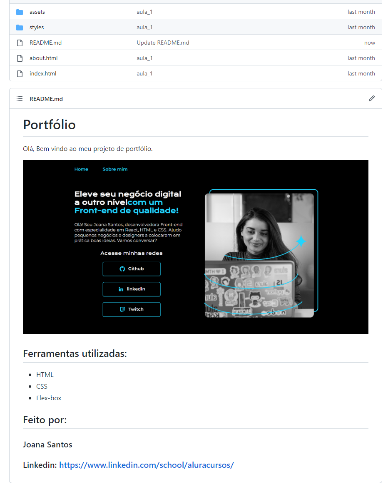

# Curso Alura - HTML e CSS: trabalhando com responsividade e publicação de projetos

## Aula 1 - Unidade de Medida

### Aula 1 - Apresentação - Vídeo 1

Transcrição  
Guilherme: Olá! Meu nome é Guilherme Lima.

Rafaela: Olá! Eu sou a Rafaela Ballerine.

Guilherme: E vamos nos aprofundar em HTML e CSS e continuar o desenvolvimento do nosso projeto.

Rafaela: Agora não o teremos apenas no nosso computador, mas também conseguiremos acessá-lo de qualquer computador. Portanto conseguiremos compartilhá-lo com nossos amigos e nossa família, que poderão acessar não apenas do desktop e notebook.

Guilherme: Mas também do celular.

E para isso aprenderemos a trabalhar com unidades de medidas diferentes, criaremos um repositório e uma conta no GitHub.

Rafaela: Também vamos fazer testes com o design da página, movimentando a imagem dependendo do tamanho da tela.

Guilherme: Construiremos um projeto incrível juntos.

E para que este projeto seja preparado, nosso objetivo é trabalhar com responsividade.Vocês perceberão que não basta diminuir e aumentar o tamanho e os posicionamentos, precisamos pensar em como esses elementos ficarão disponíveis na tela.

Vamos começar!

### Aula 1 - Preparando o ambiente

Projeto base:

O projeto inicial deste curso foi implementado no curso anterior. Então, caso você tenha feito o anterior, pode prosseguir com o mesmo projeto. Caso contrário, você pode [baixar o projeto anterior aqui](https://github.com/alura-cursos/Portifolio-HTML-e-CSS-Curso3/archive/refs/heads/aula_5.zip) ou acessar os arquivos [diretamente no Github!](https://github.com/alura-cursos/Portifolio-HTML-e-CSS-Curso3/tree/aula_5)

Figma do curso:

Neste curso tomaremos como base o protótipo que está no Figma. Para acessá-lo, [clique aqui](https://www.figma.com/community/file/1410377948870595725).

Caso não tenha uma conta, crie uma ou se já for cadastrado faça o login em uma conta existente. Para isso, entre no [site do Figma](https://www.figma.com/) e clique em Log In (caso já tenha conta) ou em Sign Up (para cadastrar nova conta).

### Aula 1 - Unidade de Medida REM - Vídeo 2

Transcrição  
Guilherme: Vamos iniciar nossos estudos de HTML e CSS mergulhando mais profundamente no tema. Agora estudaremos Unidades de medida.

Rafaela: Nós começamos a aprender sobre elas quando falamos sobre pixels e porcentagens, mas agora iremos realmente compreender o que é ideal para utilizar em cada situação, assim como conceitos novos.

Guilherme: Começando pelo primeiro ponto: nós definimos a maioria dos valores do nosso projeto utilizando a unidade de medida pixel, porém esses valores não são adaptáveis com as configurações do navegador da pessoa.

Vamos fazer esse exemplo, Rafa.

Rafaela: Vamos, lógico!

Guilherme: No canto direito da barra superior da janela do Chrome, após a barra de endereço, clica nos três pontos verticais. Em seguida, no menu, acessa "Configurações".

Somos direcionados para outra página, onde tem um menu de navegação na lateral esquerda. Nesse menu, vamos clicar em "Aparência". Com isso, no centro da tela aparecem algumas opções relacionadas à aparência do navegador.

Entre elas, temos a propriedade "Tamanho da fonte". Essa é uma propriedade que o navegador nos permite escolher. Ao abrirmos as opções, que ficam no canto direito dessa opção, notamos que podemos escolher entre: muito pequena, pequena, média (recomendado), grande e muito grande.

Rafa, conseguimos deixar nosso projeto e essa tela de configurações lado a lado?

Rafaela: Conseguimos! Eu vou abrir a página do nosso projeto, pressionar "Windows + ←" e, entre as opções que surgem para ocupar a metade direita da tela, vou clicar na janela de configurações.

Guilherme: Legal! O que eu quero fazer, Rafa, é alterar as configurações de aparência do navegador e quero que o projeto acompanhe essa alteração.

Então vamos mudar o tamanho da fonte para "muito grande".

Rafaela: Quando eu cliquei, mudou o tamanho da fonte do menu, mas no nosso projeto nada se alterou.

Guilherme: Isso é muito ruim, gente, porque não estamos com nosso projeto adaptável com as configurações da pessoa.

Rafaela: E isso é importante para muitas pessoas. Nós achamos que não, e tendemos a deixar com uma configuração padrão, mas para muitas pessoas conseguirem enxergar e clicar, até pelo touch do celular. Portanto o tamanho da fonte é importante para acompanhar o que a pessoa quer.

Guilherme: Então vamos abrir a documentação, Rafa, para descobrir qual unidade de medida precisamos usar para acompanhar essas configurações.

Rafaela: Vamos. Vou procurar no Google por "units in css".

Guilherme: Se puder deixar a fonte maior para conseguirmos visualizar.

Rafaela: Ok! Vou expandir a janela e clicar no link do W3Schools.

Guilherme: Ele explica sobre as medidas com valores absolutos. Vamos mudar para o português para entendermos melhor.

Podemos perceber que existem dois grandes grupos de medidas. Temos as absolutas, que é um valor que determinamos e ele não muda, como centímetros (cm), milímetros (mm) e pixels (px). Também temos as medidas relativas, que aprenderemos mais agora.

Existem diversas medidas relativas: em, ex, ch, rem, vw, vh, vmin, vmx e % (porcentagem). Qual vamos utilizar nesse momento, Rafa? Tem como testarmos?

Rafaela: Tem como testarmos. O que você quer testar?

Guilherme: Vamos testar o H1 que estamos utilizando? Qual medida vamos mudar?

Rafaela: Acho que seria interessante testarmos com o rem, porque ele é uma medida relativa que vai usar o root-element, que é o elemento raiz, ou seja, a página HTML. É o que a pessoa que está utilizando a página definiu no navegador.

Guilherme: É justamente o que queremos.

Rafaela: Exatamente, então vou deixar novamente a tela dividida com a janela do nosso portfólio à esquerda e nossas preferências de aparência à direita. Em seguida, vou sobrepor a janela do VS Code sobre a do código, portanto também à direita. Depois voltamos para a página com a aparência.

Nesse código, vamos alterar o H1, que tem a classe apresentacao__conteudo__titulo. Portanto vamos abrir o arquivo style.css e acessar as configurações dessa classe, que começam na linha 55.

Guilherme: Na linha 56 está marcado o tamanho da fonte como 36px. Nós precisamos alterar para rem.

Rafaela: Exatamente. E falando sobre a transformação de medidas entre si, nós usamos uma escala para mudar de pixels para rem. Nessa escala utiliza-se o valor mais recomendado pelos navegadores, que é de 16, então 16px equivale a 1rem e 32px equivale a 2rem.

E para converter os 36px, nós dividimos esse valor por 16px. Ao dividirmos 36 por 16, temos como resultado 2,25. Então 36px equivale a 2,25rem.

Parece um número quebrado, mas até o 0,25 é válido usar. Caso fosse um número muito quebrado, como 2,1752, poderíamos arredondar, mas o 2,25 é um bom valor.

Guilherme: Então pegamos o valor da medida em pixel e dividimos pode 16 e temos o valor em rem.

Rafaela: Isso! Quanto mais usarem, mais vocês irão se acostumar com essa medida. Por exemplo, para 16px vocês já usarão 1rem e para 32px, vocês usarão 2.

Guilherme: Rafa, conseguimos visualizar nosso portifólio enquanto alteramos o código para observarmos o que acontece?

Rafaela: Vamos. A janela do portifólio à esquerda e a do VS Code à direita da tela e vou alterar a linha 56 para font-size: 2.25rem;.

```CSS
.apresentacao__conteudo__titulo {
    font-size: 2.25rem;
    font-family: var(--fonte-primaria);
}
```

Salvamos e nada se altera, porque não mudamos a configuração do nosso navegador. É para ele estar com a mesma medida, porque fizemos a conta.

Contudo, se abrirmos novamente a janela de aparências, à direita da tela, e alterarmos o tamanho da fonte para "Muito grande", reparamos, no nosso portifólio que está à esquerda, que o tamanho do título acompanha essa mudança.

Guilherme: Muito bom! Ficou a dica. Vamos mudar para o tamanho "Muito pequeno" para testarmos também.

Rafaela: Vamos. Quando eu mudo para "Muito pequeno" ele se altera e fica bem pequeno.

Guilherme: Nosso próximo desafio será configurar toda página para que ela fique com esse valor relativo.

Rafaela: Exato, mudar para o valor relativo em todas os elementos que queremos utilizar.

Guilherme: Isso!

### Aula 1 - Aplicando o REM - Vídeo 3

Transcrição  
Guilherme: Agora que entendemos que codando com rem nós acompanhamos a unidade de medida do navegador, vamos aplicar isso para os nossos próximos textos, porque acho isso importante.

Rafaela: Vou abrir o nosso arquivo styles.css, e em todos os lugares que tivermos font-size faremos o cálculo da medida de pixel para rem.

Guilherme: Nós podemos procurar com "Ctrl + F", que é o atalho para encontrar uma palavra rapidamente no navegador, e pesquisamos "font-size", que já encontraremos todos.

Rafaela: Boa ideia! Então quando procuramos, descobrimos que temos seis resultados.

O primeiro está no .cabecalho__menu__link. Nós temos 24px, e ao dividirmos por 16px temos 1.5rem.

```CSS
.cabecalho__menu__link {
    font-family: var(--font-secundaria);
    font-size: 1.5rem;
    font-weight: 600;
    color: var(--cor-terciaria);
    text-decoration: none;
}
```

Vamos salvar e vamos para o próximo, clicando na seta para baixo na barra de busca, que é o segundo ícone do lado direito. O seguinte é o título, que já tínhamos alterado. Clicando na seta para baixo novamente, temos o .apresentacao__conteudo__texto, com o valor de 24px novamente, ou seja, mudamos para 1.5rem.

```CSS
.apresentacao__conteudo__texto {
    font-size: 1.5rem;
    font-family: var(--font-secundaria);
}
```

O próximo é o .apresentacao__links__subtitulo, que também tem 24px:

```CSS
.apresentacao__links__subtitulo {
    font-family: var(--fonte-primaria);
    font-weight: 400;
    font-size: 1.5rem;
}
```

Em seguida temos o .apresentacao__links__link, que é o botão com os links. Ele também tem o font-size de 24px, então mudamos para 1.5rem. Por fim temos o rodapé, que também vamos mudar para font-size: 1.5rem;.

Feita essas alterações, podemos voltar para nossa página de portfólio no navegador e analisar como ficou, e se nossas mudanças fizeram sentido.

Guilherme: Inicialmente está igual, que é o que queríamos.

Rafaela: Isso. Então vamos fazer o teste se funcionou o que queríamos fazer. Vou deixar a página de portfólio ocupando apena a lateral esquerda e a página com as configurações de aparência na lateral direita.

Guilherme: Estamos usando o padrão recomendado no tamanho da fonte, que é o médio. Vamos deixar como "Muito grande", já exagerando mesmo no tamanho.

Quando mudamos percebemos que os textos da nossa página do portfólio se adaptam, então está tudo funcionando, certo, Rafa?

Rafaela: Sim, está tudo funcionando.

Guilherme: Vamos deixar um pouco menor, deixa apenas no "Grande". O texto já diminui. Se mudarmos para o "Médio" ele diminui mais um pouco.

Rafaela: E continua diminuindo quando optamos pelos tamanhos de fonte "Pequeno" e "Muito pequeno".

### Aula 1 - Unidade de medida REM

Fizemos uma melhoria no nosso código que foi alterar todos os tamanhos de fonte que estavam em pixels para a unidade de medida REM.

Lembrando que ainda não foi definido um tamanho de fonte padrão na raiz do projeto, quais alternativas a seguir contemplam adequadamente essa conversão de pixel para REM?

Alternativa correta  
Em pixel font-size: 40px, em REM 2.5rem.

> Como não foi definido um tamanho de fonte padrão na raiz do projeto, um REM por padrão do browser equivale a 16px, desse modo 40px dividido por 16px do REM é igual a 2.5rem.

Alternativa correta  
Em pixel font-size: 24px, em REM 1.5rem.

> Como não foi definido um tamanho de fonte padrão na raiz do projeto, um REM por padrão do browser equivale a 16 pixels, desse modo, 24px dividido por 16px do REM é igual a 1.5rem.

### Aula 1 - Para saber mais: a importância de utilizar as unidades de medidas relativas

É muito importante utilizarmos as unidades de medidas relativas nos textos e títulos ou até mesmo nos elementos do nosso site, como por exemplo, as imagens.

Essa medida ajuda as pessoas com baixa visão que precisam alterar a aparência do navegador ou aplicar mais zoom para aumentar o tamanho dos elementos.

Lembrando que podemos diminuir o zoom da página também quando quisermos ter uma visão mais ampla dos elementos. Muito legal não é mesmo? :)

Esse [artigo da Alura sobre unidades de medidas](https://www.alura.com.br/artigos/guia-de-unidades-no-css) pode ajudar bastante o seu aprendizado.

Você também pode ver a [documentação sobre as Unidades de medidas](https://www.w3schools.com/cssref/css_units.php) que foram utilizadas neste curso.

### Aula 1 - Lista de exercícios

O que é:  
Boas-vindas à nossa lista de exercícios "Mão na massa", um caminho prático e envolvente para aprender e aprimorar suas habilidades em tecnologia. Aqui, você não encontrará longas leituras teóricas ou explicações abstratas. Em vez disso, nossos exercícios são projetados para colocar você no centro do processo de aprendizado, permitindo que você construa, experimente e explore conceitos tecnológicos de forma direta e aplicada.

Para que serve:  
Esta lista é uma ferramenta dinâmica para aprender, reforçar e aprimorar habilidades práticas em programação e desenvolvimento web. Cada exercício é uma oportunidade de aplicar conhecimentos teóricos em cenários reais, preparando você não apenas para entender a tecnologia, mas para utilizá-la de maneira eficaz e criativa em seus próprios projetos ou no ambiente de trabalho.

Como fazer:  
Leia cada exercício com atenção: comece entendendo o cenário proposto e o que se espera como resultado.
Escreva o código: utilize o ambiente de codificação de sua escolha para escrever e testar o seu código. Não se preocupe em acertar de primeira, a prática leva à perfeição.
Verifique o gabarito: após tentar resolver o exercício, compare seu código com o gabarito fornecido em “Opinião do instrutor”. Isso ajudará a identificar áreas de melhoria e consolidar o aprendizado.  
Repita: a repetição é chave para o aprendizado. Tente fazer os exercícios mais de uma vez, aplicando melhorias e variantes.
Lembre-se, cada desafio é uma chance de crescer. Não se desanime com os erros; eles são degraus no caminho do aprendizado. E acima de tudo, divirta-se! O aprendizado mais eficaz acontece quando nos engajamos e nos interessamos pelo que estamos fazendo.

Não se esqueça que estamos no Fórum e no Discord para te ajudar!

Bons estudos!

1) Adaptando o corpo do texto para unidades relativas  
Nesta atividade, você adaptará o corpo do texto do seu projeto para responder melhor às configurações do navegador do usuário. Escolha elementos de texto, como parágrafos (<p>) ou subtítulos (`<h2>`), no arquivo style.css e altere a unidade de medida do font-size de px para rem. Por exemplo, se um parágrafo está com font-size: 18px, converta para 1.125rem (18 / 16 = 1.125). Após a alteração, salve o arquivo e teste o comportamento do texto alterando o tamanho da fonte nas configurações de aparência do navegador.

2) Convertendo pixels para rem em CSS  
Você está trabalhando em um projeto de site e recebeu a tarefa de atualizar o CSS para melhorar a responsividade do texto. Seu objetivo é converter todas as unidades de font-size de pixels para rem, seguindo o exemplo que Guilherme e Rafaela mostraram. Inicie procurando todas as ocorrências de font-size no arquivo styles.css e faça a conversão. Lembre-se de que o valor padrão para 1rem é 16px. Por exemplo, se encontrar font-size: 24px;, você deve converter para font-size: 1.5rem;.

3) Melhorando a responsividade de um site  
Seu desafio agora é testar a responsividade do site após as alterações feitas no font-size. Para isso, abra a página de portfólio no navegador e altere as configurações de tamanho de fonte (Muito grande, Grande, Médio, Pequeno e Muito pequeno). Observe como os textos do site se adaptam a cada mudança e faça anotações sobre quaisquer problemas de layout ou legibilidade que você encontre. Isso ajudará a identificar se as mudanças feitas realmente melhoraram a experiência do usuário em diferentes configurações.

4) Ajustando o CSS para diferentes tamanhos de fonte  
Após testar a responsividade do site, você percebeu que algumas seções não se adaptam bem a tamanhos de fonte muito grandes ou muito pequenos. Sua tarefa agora é ajustar o CSS para garantir que o site permaneça legível e visualmente agradável em todos os tamanhos de fonte. Isso pode envolver ajustar margin, padding, ou até mesmo o font-size de algumas seções específicas. Faça as alterações necessárias no arquivo styles.css e teste novamente a responsividade em diferentes tamanhos de fonte.

Opinião do instrutor

1) Adaptando o corpo do texto para unidades relativas

- No arquivo style.css, escolha elementos de texto como `<p>` ou `<h2>`.
- Mude o font-size de px para rem, usando a regra de conversão (dividir o valor em pixels por 16).
- Salve e teste as mudanças nas configurações de aparência do navegador.

2) Convertendo pixels para rem em CSS

- Abra o arquivo styles.css no seu editor de texto.
- Utilize o atalho "Ctrl + F" para procurar por font-size.
- Para cada ocorrência de font-size em pixels, converta o valor para rem. Por exemplo, se o valor original é 24px, divida por 16 (base para 1rem) para obter 1.5rem.
- Substitua o valor original pelo novo valor em rem. Por exemplo: font-size: 24px; torna-se font-size: 1.5rem;.
- Salve as alterações e atualize o arquivo no projeto.

3) Melhorando a responsividade de um site

- Abra a página de portfólio no seu navegador.
- Altere as configurações de tamanho de fonte do navegador em diferentes níveis (Muito grande, Grande, Médio, Pequeno, Muito pequeno).
- Observe como os textos e o layout do site se adaptam a cada tamanho de fonte.
- Anote quaisquer problemas de layout ou legibilidade que encontrar em cada configuração de tamanho.

4) Ajustando o CSS para diferentes tamanhos de fonte

- Com base nas suas observações, retorne ao arquivo styles.css.
- Faça ajustes em margin, padding, e font-size conforme necessário para melhorar a legibilidade e o layout em diferentes tamanhos de fonte.
- Teste novamente cada tamanho de fonte no navegador para garantir que as mudanças produziram o efeito desejado.
- Continue ajustando e testando até que o site seja responsivo e confortável de ler em todos os tamanhos de fonte.

### Aula 1 - O que aprendemos?

Nessa aula, você aprendeu:

- Sobre medidas relativas e absolutas;
- Utilizar a documentação sobre unidade de medidas;
- Utilizar a unidade de medida REM;
- Alterar a aparência do navegador em configurações.

## Aula 2 - Adaptando elementos

### Aula 2 - Descubra a super unidade de medida - Vídeo 1

Transcrição
Guilherme: Conseguimos adaptar nossos textos utilizando outra unidade de medida, mas nossa aplicação não contém só textos. Temos imagens, links e outros elementos na nossa página.

Rafaela: E temos que perceber em que momento precisamos alterar o tamanho da imagem e dos outros elementos. Por exemplo, pode ser que vocês estejam assistindo à aula em uma tela completamente diferente da nossa.

Nossa tela tem um tamanho específico e estamos desenvolvendo nosso projeto pensando nessa tela. Caso a sua não seja completamente igual a nossa, pode ter ficado com espaços maiores e com a imagem diferente. São esses pontos que vamos resolver a partir desse momento.

E como conseguimos visualizar essas transição dos tamanhos de pixels da tela?

Guilherme: Como nosso projeto fica em uma tela diferente, de outro tamanho?

Rafaela: Para visualizar como fica em uma tela de notebook, que é menor, por exemplo, podemos clicar na página com o botão direito, selecionar a opção "Inspecionar". Com isso, a janela de Inspecionar abre na metade direita da tela.

No canto superior esquerdo da janela, o segundo botão, que é o "Alternar barra de ferramentas do dispositivo" tem o ícone de um celular sobrepondo o canto inferior direito de um retângulo. Ao clicar nele, aparece uma margem ao redor da nossa página para fazermos testes.

Nós conseguimos arrastar a margem lateral para direita ou para esquerda, aumentando ou diminuindo as dimensões da tela.

Guilherme: Rafa, um detalhe importante é que com o atalho "Ctrl + Shift + M" ativamos ele também. E eu tenho uma curiosidade. Vamos deixar a largura da tela menor, em 720px.

Rafaela: Vou escrever essa medida no primeiro campo que está na parte centro-superior da nossa página.

Guilherme: Feito isso, reparamos que a página abriu, mas a disposição dos elementos está estranha.

Rafaela: Muito. Percebemos que footer está menor, a imagem está levando tudo para direita, os botões estão encostados na imagem, ou seja, está tudo bem caótico.

Guilherme: Então vamos corrigir isso em etapas. Antes de modificarmos onde cada coisa ficará, existe uma forma de informarmos que queremos que esse conteúdo, a imagem e os links se adaptem?

Portanto não queremos usar unidades absolutas para esses valores, e sim unidades relativas.

Rafaela: Tem sim.

Guilherme: E qual unidade usaremos?

Rafaela: Na verdade, já até utilizamos em algumas partes, mas para conseguirmos trabalhar no tamanho da imagem, podemos usar a porcentagem(%). Inclusive nós vimos quando abrimos a [documentação do W3Schools](https://www.w3schools.com/cssref/css_units.php), sobre as unidades do CSS, que uma das unidades relativas é a porcentagem.

Vou abrir essa documentação novamente. Tento deixar em português para ficar um pouco mais claro, ele não muda, mas está informando que a porcentagem é relativa ao elemento pai.

Então ao mudarmos o tamanho da imagem para 50%, será 50% do espaço da tag pai da imagem. E quando abrimos o index.html para descobrirmos quem é a tag pai da imagem, observamos que ela é filha, assim como a `<section>`, da `<main>`.

Portanto seria o tamanho de 50% da tag main, e conseguimos usar essa unidade de medida.

Guilherme: Vamos então fazer isso. No lugar das unidades absolutas, usaremos as relativas.

Rafaela: Para a imagem, especificamente, ainda não tínhamos criado nenhuma classe, então faremos isso agora. No arquivo index.html, vamos até a linha 37 e vamos adicionar um class à tag `` e vamos seguir o padrão de nome que estamos utilizando para classe, usando "apresentacao__imagem".

```html

```

Também precisamos fazer isso no outro HTML que temos com o "Sobre mim", que é o about.html. Portanto também vamos colar essa classe na linha 25 desse arquivo, deixando o código de imagem idêntico nos dois arquivos.

Agora vamos copiar o nome dessa classe, abrir o style.css e vamos colar na linha acima à do .rodape, na linha 103. Em seguida abriremos chaves e vamos acrescentar a porcentagem para o tamanho.

Guilherme: Como estamos falando de tamanho, vamos configurar o width, certo?

Rafaela: Na verdade quando mudamos o width da imagem, que é a largura, automaticamente a altura também muda, porque ela acompanha a escala da imagem que processamos, seja ela quadrada ou redonda. Então podemos usar:

```CSS
.apresentacao__imagem {
    width: 50%;
}
```

Guilherme: Vamos testar com metade.

Rafaela: Até porque estamos realmente usando metade da página.

Guilherme: Quando voltamos para nossa página de portfólio, já observamos que mudou, mas a experiência de navegação no celular fica diferente.

Ao arrastarmos a margem lateral para esquerda, diminuindo o tamanho da tela, percebemos que tem um texto e ao lado uma imagem minúscula.

Rafaela: O tamanho das outras coisas que estão muito grandes, na verdade, e não a imagem que está pequena

Guilherme: Então vamos arrumar os outros elementos, porque, à medida que nossa tela muda de tamanho, o que está legal, mas a disposição do conteúdo está estranha, porque está fixa.

Rafaela: Exato, então temos que encontrar uma forma desse conteúdo diminuir também, à medida que diminuímos o tamanho da tela. Vamos descobrir onde alteramos isso.

Guilherme: Vamos procurar no index.html pelo elemento pai. Nele temos a apresentacao__conteudo que é filho do apresentacao. Em qual deles mudamos, Rafa?

Rafaela: Para mudar apenas o tamanho de onde estão os textos, seria na `<section>`. A imagem está fora da section, mas temos uma tag section dentro que contém o título, o texto e os botões.

Portanto, no style.css, vamos procurar pela .apresentacao__conteudo. Nela reparamos que temos uma width: 615px, ou seja, uma largura fixa, por isso está ficando muito grande. Conseguimos transformá-la em porcentagem.

Guilherme: Vamos colocar também 50% para começar.

Rafaela: Perfeito, Gui. É exatamente o que acho que deveríamos fazer, porque ela ocupa metade do `<main>`, enquanto a imagem ocupa a outra metade.

```CSS
.apresentacao__conteudo {
    width: 50%;
    display: flex;
    flex-direction: column;
    gap: 40px;
}
```

Guilherme: Interessante! Vamos voltar para o nosso projeto e diminuir a tela para observarmos como fica. Assim reparamos que a disposição dela já vai mudando.

Rafaela: Antes nosso título e nosso parágrafo não quebravam para acompanhar a diminuição ou aumento da tela. Agora nós mudamos as medidas da tela e eles ocupam uma quantidade diferente de linhas para se espalharem melhor.

Guilherme: A única coisa que ainda está estranha, Rafa, são os links, que ainda estão bem esmagados. Eu queria também aproveitar para trocar o nome de "links" para algo melhor.

Eu fiquei pensando que esse nome de classe "apresentacao__links__link" nós podemos mudar.

Rafaela: Vamos sim. Qual nome você quer colocar?

Guilherme: Podemos mudar para "apresentacao__links__navegacao".

Rafaela: Como tem vários "links", eu não posso selecionar a parte do "link" para mudar de uma única vez.

Guilherme: Tem como pressionar o "Alt" e clicar após cada "link".

Rafaela: Vamos fazer isso, pressionar o botão de apagar quatro vezes para apagar o "link" e escrever "navegacao" no lugar. Então nossa classe virou apresentacao__links__navegacao.

Em seguida, precisamos trocar no CSS, então na linha 83 vamos mudar para apresentacao__links__navegacao.

Guilherme: Isso é comum, mudarmos para um nome melhor conforme evoluímos. É complexo escolher um bom nome de primeira.

E por enquanto não fizemos nenhuma alteração no projeto, certo?

Rafaela: Ainda não. Agora vamos mudar a width do nosso link, que ainda está fixa e por isso fica muito grande. Vamos testar com 50% também, lembrando que as porcentagens são sempre relativas ao link pai, não estamos deduzindo do nada.

```CSS
.apresentacao__links__navegacao {
    display: flex;
    justify-content: center;
    gap: 16px;
    border: 2px solid var(--cor-terciaria);
    width: 50%;
    text-align: center;
    border-radius: 8px;
    font-size: 1.5rem;
    font-weight: 600;
    padding: 21.5px 0;
    text-decoration: none;
    color: var(--cor-secundaria);
    font-family: var(--font-secundaria);
}
```

Quando voltamos para página do nosso portfólio, reparamos que os links também acompanham o aumento e a diminuição da tela conforme mudamos as medidas. Entretanto, tem um ponto que se diminuímos demais a tela, ele quebra, ou seja, o texto fica fora do contorno do botão.

Guilherme: Arrumamos uma coisa, mas ainda está estranho.

Rafaela: Sim, ainda teremos muitas coisas para fazer nesse projeto.

### Aula 2 - Adaptando imagens

Aprendemos na aula que é possível adaptar os elementos da nossa página de acordo com o tamanho da nossa tela, e vimos também que existem unidades de medidas que facilitam bastante na adaptação.

Qual unidade de medida é a mais adequada para definirmos a largura de uma imagem que ocupe, de forma adaptável, metade do tamanho da tela? E qual o valor para ocupar metade do tamanho da tela?

Resposta:  
Porcentagem(%), atribuímos o valor de 50% na largura da imagem e, dessa forma, ela irá se adaptar automaticamente.

> A unidade de medida porcentagem(%) faz com que a imagem ou qualquer elemento ocupe metade de qualquer tela quando aplicamos 50% em sua largura.

### Aula 2 - Para saber mais: Dev Tools - A melhor amiga de quem desenvolve

A ferramenta de desenvolvimento (Dev Tool) ajuda muito no processo de criação e desenvolvimento de projetos web. Além de inspecionar os nossos códigos HTML e CSS, podemos fazer algumas alterações temporárias e ela nos mostra uma prévia de outros tamanhos de telas e dispositivos como tablets e celulares e isso ajuda muito na hora de criarmos a versão mobile e toda a parte responsiva.

Gostou? :) Agora você pode tentar também!

Para abrir o Dev Tools, quando estiver com o navegador aberto aperte as teclas CTRL + SHIFT + C no Chrome do Windows,ou COMMAND + OPTION + C no MAC ou você pode clicar com o botão direito do mouse na tela do navegador e clicar em inspecionar na lista suspensa ou inspect caso esteja em inglês. Veja:

Imagem da página principal do projeto desse curso, com botões de links para o GitHub, Linkedin e Twitch, e imagem indicando o inspecionar

Com o Dev Tools aberto você pode:

- Escolher o tipo de dispositivo (celular, tablet etc);
- Inspecionar os elementos HTML;
- Alterar o tamanho da tela;
- Alterar os estilos CSS da página temporariamente;
- Apertar as teclas CTRL + SHIFT + M para abrir a visualização responsiva.
- Imagem da página principal do projeto no navegador, com a ferramenta do DevTools aberta

### Aula 2 - Figma Mobile - Vídeo 2

Transcrição  
Guilherme: Agora temos um novo desafio.

Assim como no curso anterior que recebemos um Figma com uma nova página, porque nosso projeto está crescendo, temos um novo desafio, certo, Rafa, que é tornar nossa página...

Rafaela: Responsiva.

Responsividade significa termos no nosso projeto a capacidade da tela se adaptar dependendo do dispositivo que estivermos acessando. Então a página fica boa em um desktop, no notebook e até no celular.

Guilherme: A ideia no celular, na verdade, não é só deixar tudo esmagado.

Rafaela: Nós até estávamos fazendo isso e mesmo assim o design não estava bom.

Guilherme: A ideia no celular é que os elementos mudem de posição, deixando a imagem mais em cima, dispor os elementos em coluna e coisas do tipo. Pensando nisso, o que acontece no mundo real é que a pessoa que trabalha com o Figma e com design pensa nisso, e nós, devs do Front-end, implementamos o que foi pensado.

Então vamos mostrar para o pessoal, Rafa.

Rafaela: Usaremos o mesmo Figma que estávamos utilizando para fazer o footer e a segunda página com o "Sobre mim". Na parte superior da coluna da esquerda, existem duas páginas: a web, que utilizamos para desenvolver o projeto até agora, e a página mobile. Na página mobile é onde temos o design para dispositivos móveis.

Figma com o template da página para mobile. Na imagem há dois protótipos de tela, sendo a da esquerda o protótipo da tela inicial e à esquerda o da tela "Sobre mim". Na direita a barra de navegação está na parte centro-superior dos elementos já existentes dispostos em coluna na seguinte ordem: imagem, título, subtítulo, título dos links, botão do GitHub, botão do LinkedIn, botão da Twitch e barra de rodapé. Na tela da esquerda temos também o menu na parte centro-superior, seguido da foto, do título "Sobre mim", do texto e do rodapé.

Guilherme: Percebemos que o conteúdo é igual: os texto, os links e a imagem, mas a posição deles está diferente.

Eu falo tudo igual, mas a imagem talvez seja diferente, em outro tamanho, para a experiência da pessoa que vai navegar pelo celular fique melhor. Então temos um desafio, Rafa: implementar esse design de alguma forma.

Imagino que usaremos bastante o CSS, apesar de não saber ainda o código, mas imagino que teremos que informar que, ao estarmos em uma tela com determinado tamanho, a disposição dos elementos precisa mudar.

Rafaela: Será que para isso precisaremos criar outro HTML ou precisaremos criar vários arquivos CSS? O que precisaremos fazer nos nosso projeto?

Guilherme: Vamos descobrir.

### Aula 2 - Lista de exercícios

1) Adaptando imagens para diferentes tamanhos de tela  
Você está trabalhando em um site e precisa garantir que as imagens se adaptem corretamente a diferentes tamanhos de tela. Sua tarefa é adicionar uma classe apresentacao__imagem às imagens relevantes no HTML e definir o width dessa classe para 50% no CSS. Isso fará com que as imagens ocupem 50% da largura do elemento pai. Certifique-se de testar em diferentes larguras de tela, como 720px, para verificar a responsividade.

2) Ajustando o layout para diferentes dispositivos  
O layout do seu site precisa ser ajustado para diferentes dispositivos. Utilize a ferramenta "Inspecionar" do navegador para simular diferentes tamanhos de tela, como um notebook. Ajuste o layout da página para que ele se adapte de forma harmoniosa em telas menores. Isso pode envolver a alteração de margens, paddings, e até mesmo a reorganização de elementos na página.

3) Responsividade do conteúdo de texto  
O conteúdo de texto do seu site não está se adaptando bem a telas menores. Você precisa ajustar a classe .apresentacao__conteudo no CSS para usar larguras relativas em vez de fixas. Experimente definir a width para 50% e observe como o texto se adapta quando você muda o tamanho da tela. Lembre-se de que a responsividade é chave para uma boa experiência do usuário em dispositivos diversos.

4) Melhorando a responsividade dos links de navegação  
Os links de navegação do seu site estão se comportando de forma inadequada em diferentes tamanhos de tela. Sua tarefa é ajustar a classe .apresentacao__links__navegacao no CSS. Altere a width para um valor relativo, como 50%, e teste em diferentes tamanhos de tela. Observe como os links respondem a essas mudanças e ajuste conforme necessário para garantir uma navegação fluida e acessível.

Opinião do instrutor

1) Adaptando imagens para diferentes tamanhos de tela

- No HTML, adicione a classe apresentacao__imagem às tags  relevantes.
- No CSS, adicione:

```CSS
  .apresentacao__imagem {
      width: 50%;
  }
```

Teste em diferentes larguras de tela, como 720px.

2) Ajustando o layout para diferentes dispositivos

- Utilize a ferramenta "Inspecionar" do navegador para simular diferentes tamanhos de tela.
- Faça ajustes no CSS para melhorar a responsividade, alterando margens, paddings e a disposição dos elementos.

3) Responsividade do conteúdo de texto

- No CSS, altere a classe .apresentacao__conteudo:

```CSS
  .apresentacao__conteudo {
      width: 50%;
      /* Outras propriedades... */
  }
```

Teste a responsividade alterando o tamanho da tela e ajuste conforme necessário.

4) Melhorando a responsividade dos links de navegação

- No CSS, ajuste a classe .apresentacao__links__navegacao:

```CSS
  .apresentacao__links__navegacao {
      width: 50%;
      /* Outras propriedades... */
  }
```

Teste em diferentes tamanhos de tela e observe a resposta dos links. Ajuste conforme necessário.

### Aula 2 - O que aprendemos?

Nessa aula, você aprendeu:

- Adaptar elementos;
- Utilizar a ferramenta do DevTools;
- Visualizar nosso projeto na versão responsiva;
- Alterar o tamanho da visualização na tela;
- Adaptar elementos utilizando as unidades de medidas relativas.

## Aula 3 - Responsividade

### Aula 3 - Media Queries - Vídeo 1

Transcrição  
Guilherme: Um ponto muito interessante agora, Rafa, é tentarmos identificar em que momento nossa aplicação começa a ter o comportamento que não estamos esperando, com elementos muito próximos uns dos outros.

Rafaela: Vou clicar com botão direito na nossa página do portifólio, abrir a aba do "Inspecionar" e clicar no nosso atalho para ajuste de tela.

Lembrete: Também é possível usar o atalho "Ctrl + Shift + M"

Agora vamos diminuir a tela aos poucos e observar o que acontece. O que você percebeu?

Guilherme: Eu senti que a imagem está colada ao texto, isso te incomodou?

Rafaela: Bastante, porque dá a sensação de que a tela vai diminuindo e vai meio que amassando todo o conteúdo. O que podemos fazer é adicionar um gap entre os elementos da section e a imagem.

Guilherme: Vamos voltar no nosso código HTML, Rafa, porque acho interessante mostrarmos isso.

A partir da linha 17 do arquivo index.html, temos o main, que é a classe apresentacao, com o conteúdo. Dentro dessa classe temos a apresentacao__conteudo, que tem todo o texto, e a apresentacao__imagem.

O que faremos é que, por mais que esteja diminuindo, sempre iremos garantir um espaço entre os dois.

Rafaela: E esse espaço será o gap, que já conhecemos no flex box. Precisamos adicioná-lo à classe apresentacao para gerarmos esse espaço entre os filhos.

Então vamos no arquivo style.css e na linha 46, dentro da .apresentacao{}, vamos codar o gap. E o valor está no projeto web do nosso Figma, que tem a indicação do espaço que fica bom. No caso, o valor de 82px;

```CSS
.apresentacao {
    padding: 5% 15%;
    display: flex;
    align-items: center;
    justify-content: space-between;
    gap: 82px;
}
```

Agora quando voltamos para nossa página e mudamos o tamanho da tela, reparamos que o espaço entre o texto e a imagem se mantém.

Guilherme: Diminui mais, Rafa. Vamos reparar em que momento nos sentimos incomodados. Quando chega por volta de 1300px de largura da tela, começa a ficar estranho.

A parte do texto na coluna está legal, mas a imagem fica isolada sozinha no lado direito. O que podemos fazer é falar que quando a largura da tela for menor que, vou propor um valor, 1023px ou algo assim, vamos deixar a imagem na mesma coluna.

Rafaela: Vamos! Porque assim já fica pronto conforme o design mobile do Figma, que leva a imagem para cima. E para isso podemos utilizar o media no CSS, então vamos abrir a documentação para descobrir como ele funciona.

Guilherme: Então de alguma forma existe uma propriedade do CSS, que são as Media Queries que garante que se a tela tiver um tamanho máximo ou mínimo terá a aplicação do estilo que determinarmos. É isso que faremos.

Rafaela: Portanto vamos abrir a documentação do Developer Mozila, que é o segundo link que aparece quando pesquisamos "css @media". Nela já temos a sintaxe de como usamos o media queries.

Guilherme: E é isso que queremos. Na documentação temos um exemplo de max-width, ou seja, o tamanho máximo:

```CSS
<!-- CSS media query dentro de um stylesheet -->
@media (max-width: 600px)
{
  .facet_sidebar
   {
    display: none;
   }
}
```

Se o tamanho máximo for 600px, que deve ter feito sentido para esse projeto, ele abriu chaves ({) e começou a adicionou a classe.

Rafaela: Exatamente, o .facet_sidebar seria como o nosso .apresentacao.

Guilherme: Depois ele começou a manipular elementos como sempre fazemos, e é isso que queremos. Por exemplo, informamos que se for até determinado valor, aplicaremos um tipo diferente de estilos, com a apresentação, tamanho da fonte e padding diferentes.

Rafaela: Podemos mudar até a cor, então podemos informar que se for para Mobile queremos outra cor de fundo.

Guilherme: Sim, nós somos livres! No caso, não queremos mudar a cor para mobile.

Rafaela: Não, ainda não!

Guilherme: Então vamos adicionar essa propriedade ao nosso código.

Rafaela: Certo, vou abrir o styles.css e codar na última linha, que é a 118, e declarar qual será nossa condição, ou seja, a largura máxima de tela para começarmos a utilizar os estilos que iremos definir:

```CSS
@media (max-width: )
```

Guilherme: Só um detalhe, Rafa. Nós escrevemos como @media porque o CSS já tem isso naturalmente, e abrimos e fechamos parênteses (()), diferente de antes, que usávamos chaves.

Rafaela: É porque esses parênteses representam uma condição, nós verificamos se o que tem dentro deles é verdadeiro. Então se escrevermos um max-width: 1000px, se a tela tiver uma largura menor que isso, será aplicado o que está dentro das chaves.

Então os parênteses indicam que se tiver essa condição, aplica-se o que determinamos, senão, se a largura for maior, aplica-se os outros estilos que declaramos anteriormente.

Guilherme: Legal, e quanto colocamos?

Rafaela: Vamos descobrir diminuindo o tamanho da tela no navegador.

Guilherme: Por volta do 1020px começa a quebrar, certo?

Rafaela: Acho que antes, podemos deixar em 1200px, o que acha?

Guilherme: Pode ser.

Rafaela: Então se for até o tamanho de 1200px usaremos os estilos que definiremos entre chaves.

Guilherme: Vamos abrir e fechar chaves ({}) e tudo que colocarmos dentro delas, sejam as classe ou o h1 só vai mudar quando essa função for verdadeira.

Portanto, Rafa, pensando no nosso Figma, conseguimos deixar a imagem em cima e depois alinhar os demais elementos?

Rafaela: Sim! Vamos conferir nossa classe .apresentacao no arquivo do CSS, onde estamos aplicando o flex box e estamos deixando os elementos alinhados. Temos o display: flex com o flex-direction automaticamente configurado para row (linha).

Então quando voltamos na página do nosso projeto do navegador os elementos estão dispostos em linha, mas queremos transformar em coluna, portanto no @media vamos configurar o flex-direction: column;.

```CSS
@media (max-width: 1200px) {
    .apresentacao {
        flex-direction: column;
    }
}
```

Guilherme: Ao fazemos isso e voltarmos para página, reparamos que já mudou, mas a imagem ficou embaixo, enquanto no Figma a imagem está em cima.

Rafaela: Precisamos lembrar que nosso código HTML tem a imagem depois do texto. Temos a section com o título, o parágrafo e os links e após eles que vem a imagem.

Guilherme: Nós precisaríamos inverter, Rafa?

Rafaela: Isso, e o flex box tem esse valor. Ele tem o flex-direction como row (linha) e column (coluna), mas também o row-reverse (linha reversa) e column-reverse (coluna reversa), trocando a ordem dos elementos.

```CSS
@media (max-width: 1200px) {
    .apresentacao {
        flex-direction: column-reverse;
    }
}
```

Quando salvarmos esse código e voltamos para página do navegador, reparamos que a ordem da imagem foi invertida e agora ela está em cima.

Guilherme: Não está exatamente igual ao Figma, precisamos manipular outros elementos, mas já ficou com uma aparência melhor.

### Aula 3 - Media Queries

Você está desenvolvendo um projeto que precisa se adaptar para diversos tamanhos de tela. Para isso, será necessário configurar os seus pontos de quebra do layout, os famosos Break Points. Parte do layout leva em consideração um intervalo de largura que vai de, no mínimo 300 pixels até, no máximo, 700 pixels.

Qual o parâmetro esperado pela @media() para definir um tamanho de tela de, no máximo, “700px” de largura?

max-width: 700px

Dessa forma a media querie sabe que precisa ter uma largura de no máximo “700px” para aplicar os estilos CSS: @media (max-width: 700px).

### Aula 3 - Cabeçalho responsivo - Vídeo 2

Transcrição  
Rafaela: Agora já conseguimos modificar um pouco nosso estilo da página a partir do momento em que a tela fica menor, ou seja, para celulares e dispositivos com uma tela menor do que a que estamos usando. Nós conseguimos observar isso quando mudamos a largura da tela com a função disponível no inspecionar ou com o atalho "Ctrl + Shift + M".

Ao mudarmos a tela para 1200px de largura, ela muda para um design diferente. Agora vamos melhorar ainda mais esse design nos baseando no Figma que nós temos.

Guilherme: Uma coisa que está estranha quando eu olho, é o "Home" e o "Sobre mim" que estão na parte superior da tela. No Figma os dois estão bonitos e centralizados no mobile. Vamos fazer isso?

Rafaela: Vamos. Esses dois textos, no nosso index.html, nós chamamos pela classe cabecalho, que é o <header>. Então vamos abrir o style.css.

Na linha 24, nosso .cabecalho tem apenas um padding, quando nossa tela está maior. Esse padding é de 2% e o padding lateral é de 15%. Não tinha padding nem no lado direito, nem abaixo.

```CSS
.cabecalho {
    padding: 2% 0% 0% 15%;
}
```

Nesse caso, podemos começar trocando esse espaçamento, então quando estivermos em dispositivos menores, teremos um padding diferente desse. Notamos que esse deixa nosso header muito para esquerda e um dos paddings acaba quebrando. O que acha que podemos fazer, Gui?

Guilherme: A primeira coisa é voltarmos no VS Code.

Rafaela: Então voltaremos para o styles.css e dentro do @media eu vou adicionar a classe .cabecalho na linha 123.

Guilherme: Estou com uma dúvida, Rafa. O apresentação geralmente vem abaixo do cabeçalho, no @media faz sentido mantermos?

Rafaela: Faz sentido.

Guilherme: Pensando mais em reutilizar.

Então vamos alterar o padding.

Rafaela: Quanto você acha que podemos colocar? Eu sinto que podemos definir um padding maior no topo.

Guilherme: Assim como no Figma.

Rafaela: Exatamente, ele tem bem mais espaço na parte superior da tela, depois podemos centralizar os dois elemento usando o flexbox.

Guilherme: Vamos colocar então 6% de padding.

Rafaela: Pode ser.

```CSS
@media (max-width: 1200ox) {
    .cabecalho {
        padding: 6%;
    }

    .apresentacao {
        flex-direction: column;
    }
}
```

Salvamos e quando voltamos para nossa página, que está com a largura da tela menor que 1200px, reparamos que o padding já aumentou. Na lateral esquerda ele até diminuiu, mas como vamos alterar com o flexbox, não precisamos nos preocupar.

Acha que esse espaço é o suficiente?

Guilherme: Acho que podemos colocar mais.

Rafaela: Então vamos mudar para 10%. Quando observamos o projeto, vemos que ficou mais legal.

Agora conseguimos centralizar o "Home" e o "Sobre mim" usando o flexbox. Para isso vamos utilizar a classe da tag "pai" do Container. No caso, é o .cabecalho__menu, e nele usaremos o flexbox para centralizar

Guilherme: Esses dois elementos precisam estar juntos e centralizados, então será o justify-content, certo?

Rafaela: Perfeito.

Uma coisa muito importante quando estamos usando o media query é sempre analisarmos o que escrevemos anteriormente, porque se quisermos usar o flexbox, precisamos usar o display: flex.

Porém no .cabecalho__menu, que codamos na linha 28, já usamos o display: flex naturalmente, portanto não precisamos reescrever essa propriedade. Automaticamente ele vai obter essa informação do resto do nosso documento. Sendo assim, podemos usar apenas o justify-content.

```CSS
@media (max-width: 1200px) {
    .cabecalho {
        padding: 10%;
    }

    .cabecalho__menu {
        justify-content: center;
    }

    .apresentacao {
        flex-direction: column;
    }
}
```

Guilherme: Notamos que o justify-content tem várias propriedades, como baseline, center, end e first baseline. Porém queremos o center.

Rafaela: Vamos salvar e voltar para nossa página para vermos como está.

Guilherme: Já ficou diferente, porque agora está centralizado.

Rafaela: Ficou bem legal.

### Aula 3 - Para saber mais: mais de uma Media Query

Sabia que você pode ter mais de uma media query em seu projeto? É possível definir um tamanho de tela para o celular outro para o tablet e deixar a “padrão” para o desktop.

Exemplo:

Podemos definir uma largura máxima de “480px” para o celular: @media (max-width: 480px), e em outra media query definir uma largura máxima de “800px” para os tablets: @media (max-width: 800px), e então atribuímos os ajustes necessários dentro de cada media query, dessa forma teremos nosso site 100% responsivo.

Podemos também definir intervalos para os tamanhos de telas com um único media query, atribuímos o valor mínimo e depois o valor máximo separando ele pelo atributo and, veja: @media (min-width: 480px ) and (max-width: 800px), nesse caso os estilos serão aplicados em telas de no mínimo “480px” e de no máximo “800px”.

Lembrando que a maioria dos acessos à internet hoje em dia é através dos dispositivos móveis, portanto, não se esqueça de sempre deixar os seus projetos e sites responsivos.

Para aprender mais, visite o site da Mozilla, e leia a [documentação sobre media queries.](https://developer.mozilla.org/pt-BR/docs/Web/CSS/Media_Queries/Using_media_queries)

### Aula 3 - Para saber mais: o que é responsividade

Já notou que quando acessamos alguns sites eles mudam o seu layout a depender do dispositivo? Por exemplo, se você acessar o site da Alura no computador, o layout será um pouco diferente do que se você acessá-lo pelo celular.

Mas, que ferramenta é responsável por isso?

A responsividade! Quando o site adapta o tamanho de suas páginas(Layout) de acordo com o tamanho da tela do dispositivo no qual ele está sendo acessado ou quando diminuímos o tamanho da janela do navegador (essa transformação pode ser feita também quando aplicamos um zoom na página), dizemos que este site é um site responsivo.

A responsividade não só altera o tamanho das fontes e elementos, como suporta qualquer mudança como por exemplo: na cor de fundo, cor de texto, bordas, etc. Isso depende dos estilos aplicados dentro das medias queries no arquivo CSS.

Se você atribuir uma cor de fundo diferente no body dentro da media query, a cor só vai alterar quando a tela atingir o tamanho definido por ela.

Nesse exemplo foi aplicada a cor roxa no body dentro da media query utilizada no projeto para telas de no máximo 1200 pixels, veja que legal o resultado:

Gif animado da página principal do projeto aberta na ferramenta Dev Tools. A animação mostra o layout da página se adequando tanto para telas pequenas quando para telas grandes.

Você pode aprender muito mais aqui na Alura sobre responsividade através desse ótimo [curso sobre Layouts Responsivos](https://cursos.alura.com.br/course/css-flexbox-layouts-responsivos).

### Aula 3 - Lista de exercícios

1) Ajustando o layout para telas menores  
Você está trabalhando em um projeto de portfólio e percebeu que, ao diminuir o tamanho da tela, os elementos começam a se comportar de forma indesejada, com a imagem colada ao texto. Seu desafio é ajustar o layout da página para que, ao diminuir a tela, haja um espaço adequado entre os elementos. Utilize a propriedade gap no CSS para criar um espaçamento entre o conteúdo e a imagem dentro da classe .apresentacao.

2) Implementando media queries para mudança de layout  
Quando a largura da tela atinge cerca de 1300px, você nota que a imagem na página do portfólio fica isolada no lado direito. Seu objetivo agora é alterar o layout para que, em telas menores que 1023px, a imagem seja posicionada acima do texto, seguindo o design mobile no Figma. Para isso, implemente uma media query no CSS que modifique a disposição dos elementos da classe .apresentacao para uma coluna quando a tela for menor que 1023px.

3) Refinando o layout responsivo  
Agora que você ajustou o layout para telas menores, percebeu que a ordem dos elementos na classe .apresentacao não está conforme o design do Figma, onde a imagem deveria aparecer acima do texto. Seu desafio é alterar a ordem dos elementos dentro dessa classe quando a tela estiver abaixo de 1200px de largura. Utilize a propriedade flex-direction no CSS com o valor column-reverse na media query para inverter a ordem dos elementos.

4) Ajustando o cabeçalho para telas menores  
Neste desafio, você precisa ajustar o cabeçalho da página do portfólio para dispositivos com telas menores. Atualmente, o cabeçalho (header) está muito para a esquerda e quebra em certos pontos. Altere o padding da classe .cabecalho no CSS para que fique mais centralizado e com um espaço adequado na parte superior da tela, em conformidade com o design mobile no Figma.

5) Centralizando itens do menu em telas menores  
Agora que o padding do cabeçalho foi ajustado, seu próximo passo é centralizar os itens "Home" e "Sobre mim" que estão dentro do cabeçalho. Para isso, utilize o flexbox na classe .cabecalho__menu. Verifique se a propriedade display: flex já está aplicada e adicione justify-content: center para alinhar os itens centralmente.

6) Refinando o design responsivo do cabeçalho  
Por fim, verifique e refine o design do cabeçalho para telas menores. Faça os ajustes necessários no padding e nas propriedades do flexbox para que o cabeçalho fique visualmente alinhado com o design do Figma. Teste diferentes valores de padding e ajuste a propriedade justify-content para obter o melhor resultado.

Opinião do instrutor

1) Ajustando o layout para telas menores

- Observe o comportamento dos elementos ao diminuir o tamanho da tela.
- No arquivo CSS, na classe .apresentacao, adicione a propriedade gap com o valor de 82px, conforme indicado no projeto web do Figma:

```CSS
    .apresentacao {
        gap: 82px;
        /* Restante das propriedades */
    }
```

Teste a responsividade ajustando o tamanho da tela para verificar se o espaço entre o texto e a imagem se mantém adequado.

2) Implementando media queries para mudança de layout

- Determine um ponto de quebra para a largura da tela em 1023px.
- No arquivo CSS, adicione a seguinte media query:

```CSS
    @media (max-width: 1023px) {
        .apresentacao {
            flex-direction: column;
            /* Outras propriedades, se necessário */
        }
    }
```

Verifique se, ao diminuir a largura da tela para menos de 1023px, a imagem se move para cima do texto, conforme o design mobile.

3) Refinando o layout responsivo

- Ajuste a ordem dos elementos para que a imagem apareça acima do texto em telas menores que 1200px.
- No arquivo CSS, na media query para telas menores que 1200px, adicione o valor column-reverse à propriedade flex-direction da classe .apresentacao:

```CSS
    @media (max-width: 1200px) {
        .apresentacao {
            flex-direction: column-reverse;
            /* Outras propriedades, se necessário */
        }
    }
```

Teste a mudança no navegador para garantir que a imagem apareça acima do texto em telas com largura abaixo de 1200px, alinhando-se com o design do Figma.

4) Ajustando o cabeçalho para telas menores

- Observe como o cabeçalho se comporta em telas menores.
- No CSS, na media query para telas com largura máxima de 1200px, ajuste o padding da classe .cabecalho para centralizá-lo melhor:

```CSS
    @media (max-width: 1200px) {
        .cabecalho {
            padding: 10%; /* Ajuste conforme necessário */
        }
    }
```

Teste o layout em diferentes larguras de tela para garantir que o cabeçalho esteja alinhado adequadamente.

5) Centralizando itens do menu em telas menores

- Verifique se a classe .cabecalho__menu já possui a propriedade display: flex.
- Adicione justify-content: center à classe .cabecalho__menu na mesma media query para centralizar os itens:

```CSS
    @media (max-width: 1200px) {
        .cabecalho__menu {
            justify-content: center;
        }
    }
```

Teste a página para ver se os itens "Home" e "Sobre mim" estão centralizados em telas menores.

6) Refinando o design responsivo do cabeçalho

- Ajuste o padding e as propriedades do flexbox para refinar o design do cabeçalho.
- Experimente com diferentes valores de padding para encontrar o melhor alinhamento visual em relação ao design do Figma.
- Confira se as mudanças aplicadas estão proporcionando a experiência desejada em diferentes tamanhos de tela.

## Aula 4 - Responsividade e GitHub

### Aula 4 - Conteúdo responsivo - Vídeo 1

Transcrição  
Rafaella: Estamos melhorando o design para telas menores cada vez mais, porém ainda há bastante trabalho pela frente.

Guilherme: Na tela do navegador, vai parecer que todo o nosso texto foi "espremido" ao centro.

Rafaella: Exatamente, todo o texto está com muitas linhas para caber no meio entre os espaços que colocamos nas laterais da tela.

Guilherme: Este espaçamento é a largura do comprimento.

Rafaella: Sim, e definimos isso em nosso CSS para telas maiores, mas para as menores, ainda precisaremos fazer alterações.

No style.css, iremos ao .apresentacao que contém tanto a parte de imagem quanto de texto do<main> de classe "apresentacao" no arquivo index.html, em que adicionamos um padding: de 5% e 15%.

Lembrando que, sempre que tivermos dois valores nessa propriedade, o primeiro dirá respeito respectivamente ao espaço superior e inferior, enquanto o segundo definirá os espaços laterais.

Em nosso caso, o valor de 15% é muito grande, então diminuiremos para telas menores.

Guilherme: Colocaremos um padding: de 5% abaixo do flex-direction: de .apresentacao dentro @media da largura máxima de 1200px.

Rafaella: Fazendo isso, teremos o mesmo espaço para todos os lados. Vamos salvar e avaliar o resultado no navegador.

```CSS
//código omitido

@media (max-width: 1200px) {
    .cabecalho {
        padding: 10%;
    }

    .cabecalho__menu {
        justify-content: center;
    }

    .apresentacao {
        flex-direction: column-reverse;
        padding: 5%;
    }
}
```

Guilherme: Melhorou, mas o espaçamento diminuiu pouco.

Rafaella: Para entendermos o que aconteceu, abriremos o Inspecionador de Elementos no navegador e clicaremos no primeiro ícone que aparece no topo desta aba.

Conseguiremos ver o padding: de 5%, mas o conteúdo em si ainda está muito grande mesmo tendo apenas os textos dos parágrafos e os botões.

Adicionamos algo a mais, então abriremos o style.css e iremos para a .apresentacao__conteudo em que definimos a largura width: de 50%.

Quando temos telas grandes, queremos que a largura ocupe bastante o espaço do elemento-pai, ou seja, metade dele com 50%.

Porém, nos dispositivos menores, queremos que a largura acompanhe o padding: que definimos no .apresentacao acima, lembrando que a classe "apresentacao__conteudo" no index.html tem apenas o título, o parágrafo e os links.

Então precisaremos alterar a largura de 50%. Portanto, ao final do arquivo style.css, adicionaremos .apresentacao__conteudo dentro do @media de 1200px.

Dentro das chaves, colocaremos o width: com 0.

Guilherme: Se estamos usando só a metade da tela e o espaçamento ainda não está bom, iremos "zerar" a largura.

Rafaella: Sim, e com isso não teremos uma largura fixa, mas vamos salvar e testar para termos certeza.

```CSS
//código omitido
@media (max-width: 1200px) {

//código omitido

    .apresentacao {
        flex-direction: column-reverse;
        padding: 5%;
    }

    .apresentacao__conteudo {
        width: 0;
    }
}
```

Rafaella: A tela ficou pior do que estava antes e os textos ficaram mais apertados e com mais linhas ainda.

Isso aconteceu porque a propriedade width: precisa existir, e estamos apenas dizendo que nosso seletor .apresentacao__conteudo não terá largura nenhuma quando damos o valor 0, mas possui um conteúdo e irão ultrapassar os limites.

Portanto, não poderemos simplesmente "zerar" deste jeito, então teremos que dar um valor que siga o comportamento do elemento-pai, como pegar todo o espaço disponível.

Guilherme: Existe uma maneira que delimita a área a ser ocupada e o padding:.

Rafaella: Sim, é o valor auto de "automático". Vamos aplicá-lo e salvar o código para avaliarmos o resultado.

```CSS
//código omitido
@media (max-width: 1200px) {

//código omitido

    .apresentacao {
        flex-direction: column-reverse;
        padding: 5%;
    }

    .apresentacao__conteudo {
        width: auto;
    }
}
```

Rafaella: Quando fizermos isso, o conteúdo irá se adequar à área da tela conforme queríamos e o padding: de 5% estará funcionando.

### Aula 4 - Ajustando a largura

No vídeo o Gui e a Rafa definiram uma largura automática para a seção "apresentação conteúdo” com o width: auto;, existe outra forma de fazer isso que é muito utilizada na versão mobile.

Qual é a forma correta de definir a largura na versão mobile?

Alternativa correta

```CSS
.apresentacao__conteudo{
        width: 100%;
    }
```

> Dessa forma, aplicando 100% na largura da página responsiva, ela vai ter o mesmo resultado que o width: auto; e vai acompanhar o tamanho da tela de forma automática.

### Aula 4 - Criando uma conta no GitHub - Vídeo 2

Transcrição  
Guilherme: Chegamos a um momento bastante aguardado e requisitado de colocar nosso projeto no ar para que qualquer pessoa que digite um determinado endereço consiga acessar.

Pensando nisso, teremos um novo desafio.

Temos todos os códigos do projeto dentro da nossa máquina. Clicando sobre index.html na lista lateral de arquivos com o botão direito do mouse e escolhendo a opção "Open with Live Server" ou "Abrir com o Live Server" em português, conseguiremos visualizar nosso trabalho.

Então, de alguma forma, teremos que colocar os arquivos que estão somente no computador na Nuvem, ou Cloud em inglês, para que outros computadores consigam acessar também.

Para conseguirmos colocar o projeto no ar, criaremos uma conta no GitHub. Caso já tenhamos, poderemos avançar para a próxima aula, mas se ainda não, mostraremos esse processo nesta aula.

Rafaella: Até agora, falamos bastante e colocamos links do GitHub como rede, mas é algo muito comum no cotidiano de uma pessoa desenvolvedora, pois é a plataforma que hospeda as versões do nosso código e projetos, nos permitindo compartilhar com outras pessoas.

Conseguimos mandar os arquivos HTML, JavaScript, imagens, CSS e todo o resto para uma pasta compartilhável do GitHub.

Quando temos um perfil, poderemos escolher entre tema claro e escuro e subir repositórios. Na parte de "Pinned", encontraremos os projetos desenvolvidos.

Se os deixarmos como públicos, bastará clicar no repositório de algum perfil para acessar as pastas e arquivos de um projeto. Quando clicamos em algum deles, todo o código será exibido.

Em nosso caso, "subiremos" nosso código HTML e CSS. Para isso, primeiro precisaremos ter uma conta no GitHub.

Se apenas digitarmos "github.com" na barra de busca do navegador, acessaremos a página inicial do GitHub neste link. Se já tivermos uma conta, bastará clicarmos em "Sign In" no canto superior direito da tela, mas se ainda não tivermos, clicaremos em "Sign Up".

No primeiro campo exibido, inseriremos nosso e-mail e clicaremos em "Continue" para continuarmos e criamos uma senha de acordo com as diretrizes que confirmam uma senha válida.

Clicando no botão para avançarmos, criaremos um username ou "nome de usuário" para nos identificar na plataforma.

Feito isso, o GitHub nos pergunta se queremos receber produtos, responderemos e avançaremos.

Em seguida, faremos a verificação de que somos seres humanos e não robôs, seguindo as orientações também.

Depois, receberemos um código de verificação em nosso e-mail que deverá ser inserido no campo seguinte no GitHub. Quando copiarmos, colarmos e avançarmos, teremos algumas informações sobre quantos membros teremos em nosso time.

Guilherme: Inicialmente, se quisermos clicar em "Just Me" para termos apenas uma pessoa, não há problemas.

Rafaella: Sim, depois nos perguntará se somos professores ou estudantes, e neste caso seremos a segunda opção.

Clicaremos em "Continue" novamente e partiremos para a próxima etapa que pergunta quais features ou recursos específicos iremos usar. Por enquanto selecionaremos a opção de "Colaborative coding" para colaborarmos com os códigos das pessoas.

Avançando, encontraremos outra feature usada por quem é estudante, mas continuaremos com a versão gratuita por enquanto clicando em "Continue for free".

Finalizadas essas etapas, já teremos nossa conta criada no GitHub para "subirmos" nosso projeto a seguir.

### Aula 4 - Para saber mais: criando conta no GitHub

Primeiro passo para você criar uma conta no GitHub é acessar o site do GitHub através [deste link](https://github.com/) caso já tenha uma conta, clique em Sign in, caso não tenha uma conta clique em Sign up para criar uma nova:

Página inicial do GitHub onde há no canto superior direito da página dois botões: um de login Sign in e um de cadastro Sign up

Você verá uma página como essa:

Página de cadastro do GitHub onde há os campos de preenchimentos do formulário referente a nova conta

Faça o seguinte:

- Digite o seu e-mail;
- Crie uma senha;
- Digite um nome de usuário;
- Se desejar receber atualizações e anúncios de produtos por e-mail, digite "y" para sim ou "n" para não;
- Faça a verificação de humano;
- Clica no botão Create Account.
- Após preencher suas informações pessoais e clicar em Create Account Você receberá uma confirmação de cadastro por email, e daí para frente selecione as opções que achar adequado ao seu gosto.

Depois de validar sua conta é só utilizar os serviços do GitHub :)

Em caso de dúvidas, conte sempre com o fórum da Alura!

### Aula 4 - Para saber mais: Git e GitHub

O Git é uma ferramenta de controle de versão de seu arquivo, projeto ou código. Já o GitHub é uma aplicação ou site onde você vai guardar os seus projetos com os arquivos dentro.

O Git é quem faz esse meio de campo entre a nossa máquina local e o Github, o Git realiza as tarefas através de comandos, onde você pode falar para ele quais arquivos ou pastas você quer subir(mandar) para o GitHub.

O legal do Github é que você pode guardar seus projetos nele e ainda compartilhar com outras pessoas desenvolvedoras, podendo dar sugestões e oferecer ajuda em outros projetos.

É essencial toda pessoa desenvolvedora aprender a utilizar o Git e GitHub, por isso deixo aqui a indicação desse ótimo curso sobre o tema através do Link.

E também temos esse artigo do nosso CEO Paulo Silveira sobre os primeiros passos e configuração do Git e GitHub também aqui em nossa plataforma da Alura, acesse em Link.

Além disso você também pode assistir aos dois vídeos da Rafa na série [“O que é GIT e GITHUB”](https://youtu.be/DqTITcMq68k) e [Como usar o Git e GitHub na prática](https://youtu.be/UBAX-13g8OM).

### Aula 4 - Lista de exercícios

1) Ajustando o espaçamento para telas menores  
Você está trabalhando em um projeto web e percebe que o design para telas menores precisa ser aprimorado. O conteúdo parece "espremido" ao centro, devido ao espaçamento excessivo nas laterais. Seu objetivo é ajustar o padding da classe .apresentacao no CSS para melhorar a visualização em dispositivos menores.

2) Refinando a largura do conteúdo em dispositivos menores  
Após ajustar o espaçamento, você percebe que o conteúdo dentro da classe .apresentacao__conteudo ainda ocupa muito espaço em telas menores. Seu desafio agora é ajustar a largura dessa classe para que ela acompanhe o novo padding aplicado na classe .apresentacao.

3) Avaliando o efeito do width: auto em dispositivos menores  
A última tarefa envolve avaliar o impacto da mudança do width para auto na classe .apresentacao__conteudo. Você precisa verificar se a largura do conteúdo se adapta corretamente ao padding de 5% aplicado, garantindo uma exibição adequada em telas menores.

4) Criando uma conta no GitHub  
Neste exercício, você irá criar uma conta no GitHub, uma plataforma essencial para qualquer pessoa que atua com desenvolvimento web. O GitHub permite hospedar e compartilhar projetos, facilitando a colaboração. Sua tarefa é navegar pelo processo de inscrição no GitHub, configurar sua conta e explorar as principais funcionalidades disponíveis.

5) Subindo um projeto no GitHub  
Agora que você tem uma conta no GitHub, o próximo passo é aprender a "subir" um projeto. Você utilizará o GitHub para hospedar seu projeto web, que inclui arquivos HTML, CSS, JavaScript, entre outros. O foco será no processo de criação de um novo repositório e no envio (upload) dos arquivos do seu projeto para o GitHub.

Opinião do instrutor

1) Ajustando o espaçamento para telas menores

- Abra o arquivo style.css.
- Encontre a regra CSS para .apresentacao dentro do bloco @media (max-width: 1200px).
- Altere o padding para 5% para todos os lados. O código ficará assim:

```CSS
  @media (max-width: 1200px) {
      .apresentacao {
          flex-direction: column-reverse;
          padding: 5%;
      }
      ...
  }
```

2) Refinando a largura do conteúdo em dispositivos menores

- Abra o arquivo style.css.
- No bloco @media (max-width: 1200px), encontre a classe .apresentacao__conteudo.
- Defina a propriedade width para auto. O código ficará assim:

```CSS
  @media (max-width: 1200px) {
      ...
      .apresentacao__conteudo {
          width: auto;
      }
  }
```

3) Avaliando o efeito do width: auto em dispositivos menores

- Após fazer as alterações no arquivo style.css, abra o site no navegador.
- Use a ferramenta de inspeção para verificar a classe .apresentacao__conteudo.
- Observe a adaptação da largura do conteúdo ao padding de 5%. Faça ajustes no width, se necessário.

4) Criando uma conta no GitHub

- Acesse github.com em seu navegador.
- Escolha "Sign Up" para criar uma nova conta.
- Preencha as informações solicitadas, incluindo e-mail, senha e nome de usuário.
- Complete a verificação humana e insira o código de verificação enviado ao seu e-mail.
- Selecione suas preferências, como "Just Me" para o tamanho da equipe e "Student" para o tipo de usuário.
- Escolha as funcionalidades que pretende utilizar, como "Collaborative coding".
- Complete o processo e explore a interface do GitHub, observando áreas como "Pinned" para projetos em destaque.

5) Subindo um projeto no GitHub

- Faça login em sua conta do GitHub.
- Clique em "New repository" para criar um novo repositório.
- Dê um nome ao seu repositório e, se desejar, adicione uma descrição.
- Defina a visibilidade do repositório (público ou privado).
- Crie o repositório.
- Siga as instruções do GitHub para "push" (enviar) seus arquivos locais do projeto para o repositório criado. Isso geralmente envolve comandos Git no terminal do seu computador.

## Aula 5 - Repositório do GitHub

### Aula 5 - projeto da aula anterior

Aqui você pode [baixar o zip da aula 04](https://github.com/alura-cursos/Portifolio-HTML-e-CSS-Curso4/archive/refs/heads/aula_4.zip) ou acessar os [arquivos no Github!](https://github.com/alura-cursos/Portifolio-HTML-e-CSS-Curso4/tree/aula_4)

### Aula 5 - Criando o repositório - Vídeo 1

Transcrição  
Rafaela: Agora que já temos a conta no GitHub, conseguimos criar nosso primeiro repositório, que é o lugar onde vamos armazenar todos os arquivos do nosso projeto: as imagens, o HTML e o CSS.

Guilherme: Quando fazemos um repositório é como se criássemos uma nova pasta. Então eu vou para a área de trabalho, clicar com o botão direito e selecionar "Nova pasta" no menu. O repositório é como fazermos essa ação em uma nuvem de algum lugar, que teremos disponível para adicionarmos nossos arquivos.

Vou deletar essa pasta que criei na área de trabalho, Rafa.

Rafaela: Além disso, o ideal é que adicionemos apenas um projeto em cada uma dessas pastas, para conter apenas os arquivos divididos.

No canto superior direito da janela do GitHub, entre o botão de notificações e o botão de perfil, temos um botão de adicionar (+), onde clicarmos para abrir um menu. Nele podemos selecionar a opção "New repository" (Novo repositório).

Se estiverem na página do perfil, no centro superior da página haverá uma aba de repositórios. Ao clicar nela, no canto direito, abaixo do menu de abas, haverá um botão verde escrito "New", onde vocês também podem clicar para criar um repositório por lá. Porém o "+ > New repository", no canto superior direito da página, é ótimo.

Guilherme: Tem outro atalho que ganhamos quando estamos logados, como é o caso, em que estamos no perfil da Rafa. Esse atalho é o "repo.new". Então se estivermos logados no GitHub, formos na barra de endereço do navegador, digitarmos "repo.new" e pressionarmos "Enter", vamos diretamente para página de criação de repositório do GitHub.

Rafaela: Sensacional.

Guilherme: O mesmo acontece do outro jeito que a Rafa falou.

Rafaela: Clicando em "+ > New repository", somos direcionados para mesma página que digitando "repo.new" no navegador. Então vou fechar uma delas.

Qual será o nome do nosso repositório, Gui?

Guilherme: Como ele tem nosso portfólio e os links, o que você sugere?

Rafaela: Pode ser "Portfolio".

Guilherme: Aqui tem um ponto interessante. Geralmente nos projetos nós enviamos arquivos ou como linha de comando a partir de outros computadores e sistemas operacionais.

Por isso é uma boa prática não deixar o nome do repositório com letra maiúscula e, especificamente, não deixar com espaços. Sempre deixarmos com letra minúscula e as palavras separadas por traços. No caso, fica "portfolio".

Outra coisa legal é que apareceu a mensagem avisando que podemos ter esse repositório. É impossível existir no nosso projeto dois repositórios com o mesmo nome, então precisamos ter um nome diferente para cada projeto.

Rafaela: E também conseguimos escrever uma descrição para nosso projeto. Vamos escrever "Meu primeiro repositório desenvolvido com os cursos de HTML e CSS da Alura". O que acha?

Guilherme: Muito bom!

Rafaela: Podemos deixar nosso repositório como público ou privado. O nosso vamos deixar privado, mas se quiserem deixar o seu público, vocês também conseguem.

Guilherme: Isso também é um ponto legal, Rafa. Qual a diferença entre um repositório público e o privado?

No repositório privado só nós temos acesso, a não ser que nós convidemos outra pessoa para colaborar. Então se tiver um projeto que estamos trabalhando sozinhos ou sozinhas e, por algum motivo, não podemos mostrar o código, como uma feature nova, criamos um repositório privado.

Nós podemos chamar outras pessoas para trabalhar nesse projeto que está privado, mas precisamos convidá-las.

Rafaela: Esse projeto não aparece no perfil, é necessário receber um e-mail. Então você envia um e-mail para pessoa que você quer colaborando com você e ela precisa aceitar para ter acesso.

Guilherme: Já com repositório público, todas as pessoas que entrarem no link da sua aplicação poderão colaborar com você, comentando sobre o seu código.

No nosso caso deixaremos privado, mas podem deixar o de vocês público.

Rafaela: Vocês devem na verdade. É o portfólio de vocês, que fizeram tudo isso para mostrar para as pessoas. Então podem deixar público que será bem legal.

Em seguida, vocês podem adicionar ou não o README, que mostramos anteriormente. Trata-se de um arquivo apenas para descrever o que é o seu projeto.

Inclusive ao clicar para adicionar o README, vocês conseguem escrever melhor a descrição que adicionamos ao projeto. É possível também deixar em negrito, usando uma extensão chamada markdown, mas não é necessário. Nós não criaremos o README, mas vocês conseguem caso queiram entender melhor como funciona.

Depois disso, vamos diretamente para o botão verde escrito "Creating repository", que está ao final do formulário, no lado esquerdo.

Guilherme: As outras configurações não são tão importantes.

Rafaela: No momento não.

Guilherme: E quando clicamos nesse botão e mudamos de página, esse costuma ser o momento em que as pessoas desistem, porque tem um monte de códigos e vários comandos estranhos. O que fazer?

Nós vamos pegar o código que está no nosso computador e enviar para o GitHub. E para isso existe uma tag âncora azul escrito "uploading an existing file" (fazer o upload de um arquivo existente). Essa tag está no retângulo azul que fica na parte superior da tela, logo abaixo dos botões "HTTP SHH" e da barra de endereço.

Retângulo azul da parte superior da página do GitHub. Nele há o título "Quick setup - if you've done this kind of thing before". Na linha abaixo há os botões "set up in desktop", "HTTP" "SHH" e uma barra de endereços com o botão de copiar ao final dela. Abaixo dessa segunda linha há a frase "Get started by creating a new file or uploading an existing file. We recommend every repository include a README, LICENSE, and .gitignore.". Nessa frase há algumas tags âncoras, incluindo o "uploading an existing file", que está contornado de vermelho na imagem.

Ao clicarmos nessa tag, somos direcionados para outra página onde podemos selecionar os arquivos que queremos.

Rafaela: Então clicamos em "choose your files", que é outra tag âncora no centro dessa nova tela, e com isso uma janela para navegarmos pelos arquivos do nosso computador é aberta. Vamos navegar até a pasta que tem os arquivos do nosso projeto.

Na pasta correta, vamos selecionar todos os arquivo. Para isso podemos clicar em um ponto vazio da pasta e depois arrastar o mouse sobre todos os arquivos para selecioná-los.

Outra possibilidade é selecionar um por um e clicar em abrir ou arrastá-los para parte superior da página do GitHub, onde está escrito "Drag files here to add them to your repository" (Arraste os arquivos aqui para adicioná-los ao seu repositório).

Guilherme: Também podemos selecionar todos pressionando "Ctrl + A" na pasta em que estão os arquivos.

Rafaela: Também. E quando fazemos isso, reparamos que ele fez o upload de cada PNG que tínhamos no projeto: o ícone do Instagram, do LinkedIn e do Twitter. Além disso adicionou nosso arquivo CSS, nossas duas páginas HTML. Na parte inferior esquerda da página, temos um botão verde escrito "Commit changes" (Mudanças no commit), onde conseguimos fazer o commit.

Um detalhe: acho que não utilizamos o Instagram e o Twitter nós não utilizamos no nosso design, então não precisamos subir essas duas imagens.

Guilherme: Nós vamos subir como exemplo.

Rafaela: Isso, vamos subir porque estamos disponibilizando todas elas para vocês, caso vocês também tivessem essas redes e queiram adicionar, mas não precisam subir todos caso não estejam no seu projeto.

Guilherme: Vamos explicar um pouco o que é o commit. Trata-se de uma "foto", que registra o que temos de arquivo naquele momento, e ele guarda aquele momento.

Isso porque, em um futuro não-distante, à medida que vocês aprenderem mais sobre programação, HTML, CSS e, inclusive, sobre GitHub, que é uma ferramenta importante escrita até no Tech Guide da Alura, conseguiremos navegar entre versões. Então se criarmos uma versão diferente do projeto, mas precisarmos voltar para versão anterior, faremos essa navegação através dos commits.

Rafaela: Isso acontece muito, pessoal. Às vezes escrevemos o código de uma forma, tentamos mudar, não gostamos da alteração que fizemos e queremos voltar para a versão anterior. Para isso serve o commit.

Guilherme: Mas isso é conversa para Git e GitHub, não temos essa preocupação agora. Vocês só precisam saber o que é um commit e "commitar".

Rafaela: Porque nosso código, no caso, já está pronto. Não faremos alterações a partir de agora, a menos que vocês queiram melhorar, o que é bem legal.

Guilherme: Então clicamos no botão "Commit changes" e subimos os nosso arquivos.

Rafaela: Exato! Então se acessarmos nosso perfil e abrirmos a aba "Repositories" (Repositórios) ele já aparece. Com isso conseguimos clicar nele e visualizar todos os arquivos dentro dele.

Guilherme: Nosso próximo desafio é fazer com que consigam visualizar a página, porque temos apenas os arquivos, certo, Rafa?

Rafaela: Exatamente. Isso é para pessoa desenvolvedora conseguir ver os códigos e o que utilizou.

Guilherme: Vamos ver. Ao clicarmos no arquivo index.html ele abre o nosso código e vemos tudo o que escrevemos. No lado esquerdo aparece também um menu de navegação entre os nossos arquivos.

Rafaela: Tem os ícones que estamos usando, o nosso CSS, porém agora queremos subir nosso projeto para pessoas que vão acessar a página, para que elas consigam visualizar a página, e não apenas o código.

Guilherme: Faremos isso na sequência.

### Aula 5 - Para saber mais: repositório e Readme

O Repositório nada mais é que uma pasta do projeto que está salva na nuvem. No caso no GitHub, você cria o repositório com o nome do seu projeto e sobe os arquivos para dentro desta pasta. Depois de criar o repositório e colocar os arquivos dentro dele, você agora consegue criar e customizar o famoso arquivo Readme.md que é onde você consegue colocar as especificações do projeto e falar mais sobre ele, assim outras pessoas que entrarem no seu repositório irão ver e entender o seu projeto, e quais ferramentas foram utilizadas para desenvolvê-lo.

A página do arquivo Readme.md pode ser escrita utilizando o próprio HTML ou a linguagem de marcação Markdown, é mais comum utilizar markdown.

Você pode ler mais sobre [Markdown através d> este artigo](https://www.alura.com.br/artigos/como-trabalhar-com-markdown).

Para aprender mais sobre o Readme, ver exemplos e criar um do zero, acesse o [Link do template sobre o Readme!](https://github.com/alura-cursos/readme-template)

Convidar o pessoal a conhecer os Readmes dos projetos da Alura

Veja que legal o Readme do projeto Alura Midi do curso de Javascript, acesse em: [Readme Alura Midi!](https://github.com/vanessametonini/aluramidi-curso/blob/master/README.md)

E esse outro Readme do projeto android com kotlin do curso de android, acesse em: Readme [Android Kotlin!](https://github.com/alura-cursos/android-com-kotlin-personalizando-ui/blob/master/README.md)

Veja também esse exemplo de Readme escrito em Markdown feito propriamente para o repositório desse nosso curso de HTML e CSS:

Escrita em Markdown

```md

# Portfólio Olá, Bem vindo ao meu projeto de portfólio.


## Ferramentas utilizadas:

* HTML

* CSS

* Flex-box

## Feito por:

### Joana Santos

### Linkedin: https://www.linkedin.com/school/aluracursos/
```

Veja que legal como fica a página inicial do repositório:

Resultado  
Imagem da página principal do GitHub na tela mostrando os arquivos do projeto e o Readme  


Muito mais apresentável, não é mesmo?

Agora que tal editar seu arquivo Readme e customizá-lo do seu jeito? Explique um pouco mais sobre o seu projeto, ferramentas utilizadas, objetivo do projeto e etc. E mais importante, compartilhe sua experiência de aprendizado com outras pessoas! =)

### Aula 5 - Colocando o projeto no ar - Vídeo 2

Transcrição  
Guilherme: Adicionamos nosso código ao GitHub e ficou incrível. Porém ainda não conseguimos visualizar nossas páginas. Até existe um sistema ou outro que existe dentro do próprio GitHub, mas queremos mostrar o que acontece na realidade, e queremos distribuir para que outras pessoas tenham acesso.

Então nosso desafio e adicionarmos esse projeto a algum lugar onde outras pessoas tenham acesso.

Rafaela: Para que os amigos, amigas e mães de vocês, que queiram acessar esse projeto, até pelo celular, ou vocês, quando quiserem abrir o projeto no computador.

Guilherme: Queremos mostrar nosso projeto para o mundo, e qualquer pessoa que digitar um endereço consiga acessar a página.

Rafaela: Inclusive nós dois. Se vocês postarem e mandarem o link.

Guilherme: Conseguiremos acessar o projeto de vocês.

Pensando nisso utilizaremos um sistema de software muito conhecido, que é o Vercel. Trata-se de uma plataforma americana de serviços de nuvem, com um nome muito diferente.

Quando buscamos "vercel", temos até uma sugestão de "Para que serve a vercel?" e, ao expandirmos, aparece uma breve explicação.

Para que serve a vercel?

A Vercel é uma plataforma voltada para a hospedagem de aplicações de uma forma bem simples e rápida. Ela é conhecida por ser a empresa criadora do framework Next JS, voltado para o React. Entretanto, também é possível realizar o deploy de aplicações Nuxt nesta plataforma.

Então ela é uma plataforma usada para hospedagem de uma aplicação de uma forma simples e rápida.

Rafaela: Porque sempre precisamos de uma máquina rodando nosso código. Estamos fazendo isso hoje com a nossa máquina, criando o live server, e com isso conseguimos acessar nossa aplicação através do nosso computador.

Porém, para pessoas acessarem de outras máquinas, precisamos desses serviços de hospedagem, e a Vercel faz isso de uma forma gratuita e rápida, por isso vamos utilizá-la.

Então eu vou clicar no primeiro link para conseguirmos acessar a página da Vercel e traduzi-la para o português. Nela também precisaremos criar uma conta, clicando em "Inscreva-se" no canto superior direito da página.

Com isso somos direcionados para outra página onde, na lateral direita tem três botões com opções de login: com GitHub, com o GitLab e com Bitbucket. Como acabamos de criar uma conta no GitHub, vamos utilizá-la para fazer o login.

Caso vocês estiverem conectados no GitHub, como eu, ele deve se conectar automaticamente. Do contrário, basta fazerem o processo de login novamente. Quando logamos, já temos a opção de "Importar repositório Git", na metade esquerda da tela.

Então queremos disponibilizar nosso projeto e já temos nosso código dentro de um repositório do Git, portanto está tudo perfeito para subirmos o nosso projeto. Para isso, entre as opções, basta clicarmos no primeiro botão, onde está escrito "Continuar com GitHub".

Guilherme: Feito isso, ele listará todos os repositórios que temos na nossa conta. O último é o "portfolio", então vamos clicar no botão "Importar", que fica no canto direito do nome do repositório na lista.

Em seguida, somos direcionados para outra página onde tem o nome do projeto e algumas outras informações. Esse nome do projeto é o nome que aparece na barra de endereços.

Como estamos usando a versão gratuita, aparecerá como "vercel.com/portfolio" ou "/agregador de links" ou "/links-da-joana-santos", por exemplo. Então podemos nomear como preferimos ou deixar o padrão mesmo, certo, Rafa?

Rafaela: Podemos, Gui. Depois vamos clicar no botão azul escrito "Implantar", após essas informações do projeto.

Guilherme: Nesse momento ele está fazendo todo o processo de pegar o código, criar um computador que tem os projetos rodando, como se fosse um "live server" eterno e, quando ele termina, aparece a mensagem "Parabéns! Você acabou de um novo projeto no Vercel".

Rafaela: Eu só preciso fazer uma observação: no passo anterior, ele informava algo relacionado à raiz, mas é um passo que sei que muitas pessoas podem ter dificuldade. Deixando claro, só vai ter problema se você subiu no repositório do GitHub a pasta com os projetos.

Você precisa, necessariamente, subir somente os projetos, porque eles precisam estar na pasta raiz. Se você sobe uma pasta, então no repositório terá uma pasta contendo os arquivos, vocês podem ter um problema no Vercel, então cuidado com isso.

Guilherme: Isso vai de encontro com o passo que fizemos de deixarmos tanto o index.html quanto o about.html fora de qualquer pasta, já os arquivos de style.css e de assets dentro de uma pasta. Nós recomendamos que vocês tenham feito esse passo junto conosco.

Rafaela: Os arquivos HTML precisam estar por fora mesmo.

Vamos continuar. Nós acabamos de implantar o projeto e quando clicamos no preview dele que aparece abaixo da mensagem de parabéns, ele abre em uma nova página.

Guilherme: Nosso projeto está rodando e qualquer pessoa do planeta que escrever na barra de endereços "portfolio-git-rho-75.vercel.app" vai acessar nosso projeto.

Rafaela: Olha que sensacional! Vamos fazer isso do celular, Gui?

Guilherme: Vamos. Vou pegar meu celular agora e vou colocar esse endereço.

Rafaela: Sensacional! Apareceu no meu celular e no do Gui e quando clicamos no "Sobre mim" a página muda. E nosso design está adaptado para as duas telas, porque tomamos bastante cuidado com isso no CSS.

Na Home, quando clicamos no botão do "GitHub", também já vai acessar no GitHub. Está tudo funcional no nosso projeto.

### Aula 5 - Para saber mais: criando conta na Vercel

Primeiro passo para você criar uma conta na Vercel é acessar o site Vercel através [deste link](https://vercel.com/) e clicar em Sign up.

Página inicial da Vercel onde há um botão de Login e outro de cadastro Sign Up ambos no canto superior direito.

Após clicar em Sign up você verá uma página como essa:

Página de cadastro do Vercel com três botões no lado direito da página, com a primeira opção de iniciar com GitHub, segunda opção com GitLab e terceira opção com Bitbucket.

Então, clique em continuar com GitHub e pronto, sua conta foi criada! Agora é só utilizar os serviços da Vercel :)

Em caso de dúvidas, conte sempre com o fórum da Alura ou com a nossa incrível comunidade no Discord!

### Aula 5 - Projeto final do curso

Aqui você pode [baixar o zip do projeto final](https://github.com/alura-cursos/Portifolio-HTML-e-CSS-Curso4/archive/refs/heads/aula_4.zip) ou acessar os [arquivos no Github!](https://github.com/alura-cursos/Portifolio-HTML-e-CSS-Curso4/tree/aula_4)

### Aula 5 - Lista de exercícios

1) Criando um repositório no GitHub  
Neste exercício, você aprenderá a criar um repositório no GitHub para armazenar e gerenciar os arquivos do seu projeto web. O objetivo é familiarizar-se com o processo de criação de repositórios e entender a importância de organizá-los de forma eficiente.

2) Fazendo upload de arquivos para o GitHub  
Após criar o repositório, seu próximo passo é carregar os arquivos do seu projeto (HTML, CSS, imagens) para o GitHub. Este exercício ajudará você a entender como adicionar arquivos a um repositório e a importância de organizar os arquivos de forma eficiente.

3) Visualizando arquivos e preparando para exibição  
O objetivo deste exercício é explorar os arquivos do seu projeto no GitHub e entender como prepará-los para serem exibidos corretamente para os usuários finais. Você irá aprender a navegar pelo repositório e visualizar os arquivos de código.

4) Hospedando seu projeto no Vercel  
Este exercício visa ensinar como hospedar seu projeto web na Vercel, uma plataforma de hospedagem gratuita e rápida, permitindo que seu site seja acessível na internet. Você irá aprender a conectar sua conta do GitHub com a Vercel e a hospedar seu projeto lá.

5) Verificando a hospedagem do projeto  
Após hospedar seu projeto na Vercel, você deve verificar se tudo foi configurado corretamente e se o site está acessível publicamente. Este exercício foca em testar o acesso ao seu site hospedado e em entender a importância de ter seu projeto disponível online.

6) Ajustes finais e verificação de responsividade  
O último exercício foca em fazer ajustes finais no seu projeto e verificar a responsividade do site em diferentes dispositivos. Isso é crucial para garantir uma boa experiência de usuário em qualquer plataforma.

Opinião do instrutor

1) Criando um repositório no GitHub

- Faça login na sua conta do GitHub.
- Crie um novo repositório usando uma das seguintes opções:
- Clique no botão "+" no canto superior direito e selecione "New repository".
- Acesse a aba de repositórios no seu perfil e clique em "New".
- Digite "repo.new" na barra de endereço do navegador e pressione "Enter".
- Escolha um nome adequado para o repositório, seguindo as boas práticas (como usar letras minúsculas e separar palavras com traços).
- Adicione uma descrição ao seu repositório.
- Escolha se o repositório será público ou privado.
- Finalize a criação do repositório sem adicionar arquivos adicionais (como README) neste momento.

2) Fazendo upload de arquivos para o GitHub

- Acesse o repositório recém-criado no GitHub.
- Clique na tag âncora "uploading an existing file" para adicionar arquivos ao seu repositório.
- Escolha os arquivos do seu projeto no computador:
- Clique em "choose your files" e selecione os arquivos do seu projeto.
- Ou arraste e solte os arquivos na área indicada no GitHub.
- Selecione todos os arquivos necessários do projeto, como HTML, CSS, e imagens.
- Revise os arquivos selecionados e remova quaisquer arquivos desnecessários.
- Clique em "Commit changes" para finalizar o upload dos arquivos.

3) Visualizando arquivos e preparando para exibição

- Acesse o repositório onde você fez o upload dos arquivos do seu projeto.
- Explore o repositório, clicando nos diferentes arquivos para visualizar o código-fonte.
- Verifique os arquivos de imagem, CSS e HTML para garantir que estão todos presentes e corretos.
- Entenda a estrutura do repositório e como os arquivos estão organizados.
- Pense em como esses arquivos podem ser acessados e exibidos para os usuários finais (este será um passo futuro, focando em como tornar o site acessível através da web).

4) Hospedando seu projeto no Vercel

- Acesse o site da Vercel.
- Crie uma conta na Vercel, preferencialmente usando sua conta do GitHub para facilitar a integração.
- Na página inicial da Vercel, escolha a opção de "Importar repositório Git".
- Conecte-se com o GitHub e escolha o repositório que deseja hospedar (o repositório do seu projeto web).
- Siga as instruções para importar seu repositório e configurar o projeto na Vercel.
- Nomeie seu projeto e configure as opções de acordo com suas preferências.
- Clique em "Implantar" para hospedar seu projeto.

5) Verificando a hospedagem do projeto

- Após a implantação do projeto na Vercel, você receberá um link para seu site hospedado.
- Acesse o link fornecido pela Vercel para visualizar seu site hospedado.
- Teste o site em diferentes dispositivos, como computadores e smartphones, para garantir que está funcionando corretamente em várias plataformas.
- Navegue pelas diferentes páginas do seu site para verificar se todos os links e funcionalidades estão operando como esperado.
- Compartilhe o link do seu site com amigos ou colegas para obter feedback e garantir que está acessível publicamente.

6) Ajustes finais e verificação de responsividade

- Acesse seu site hospedado na Vercel a partir de diferentes dispositivos, como smartphones, tablets e computadores.
- Verifique a responsividade do design, garantindo que o layout se adapta bem a diferentes tamanhos de tela.
- Teste todas as funcionalidades do site, incluindo links, botões e transições entre páginas.
- Faça os ajustes necessários no código do seu projeto (HTML, CSS, JavaScript) caso encontre problemas de responsividade ou funcionalidade.
- Após fazer as alterações, atualize o repositório no GitHub e faça um novo deploy no Vercel para aplicar as mudanças no site hospedado.

### Aula 5 - Para ir mais fundo

Aqui está uma lista de referências para você se aprofundar nos estudos, aprimorar seus conhecimentos e adquirir novas habilidades.

1) [Guia de Unidades no CSS - Alura](https://www.alura.com.br/artigos/guia-de-unidades-no-css) (Gratuito, Português, Artigo)

> Este artigo da Alura oferece um guia completo sobre as unidades de medida no CSS, explicando tanto as medidas absolutas, que são fixas e não dependem de um valor de referência (como pixel, centímetro, metro), quanto as relativas, que são calculadas com base em outra unidade definida e são apropriadas para ajustes em diferentes dispositivos, garantindo layouts consistentes e fluidos.

2) [Entendendo unidades CSS e quando utilizá-las](https://dev.to/lixeletto/entendendo-unidades-css-e-quando-utiliza-las-3ecc) - DEV Community (Gratuito, Português, Artigo)

> Este artigo da DEV Community oferece uma visão ampla sobre unidades absolutas e relativas no CSS, explicando como elas funcionam e em quais situações devem ser utilizadas para um design responsivo.

3) [Unidades de medida no CSS: escolhendo a melhor opção para cada caso](https://dev.to/loresgarcia/unidades-de-medida-no-css-escolhendo-a-melhor-opcao-para-cada-caso-3jh9) - DEV Community (Gratuito, Português, Artigo)

> Outro artigo relevante da DEV Community, que discute como escolher a unidade de medida mais apropriada para cada situação no CSS, analisando unidades comuns como pixels, porcentagem, em, rem, vh e vw.

4) [PT-BR Unidades Relativas: rem e em](https://dev.to/mbthales/pt-br-unidades-relativas-rem-e-em-4d8j) - DEV Community (Gratuito, Português, Artigo)

O artigo do DEV Community foca nas unidades relativas rem e em, explicando suas diferenças e importância para criar um design responsivo. Para a atividade "Referências" sobre a conversão de unidades de medida de pixel para rem em CSS e sua importância no design responsivo, aqui estão algumas sugestões de recursos:

5) [Técnica para você mudar de pixels(px) para rem!](https://dev.to/gabrlcj/tecnica-para-voce-mudar-de-pixels-px-para-rem-2626) (Gratuito, Português, Artigo)

> Este artigo no DEV Community oferece uma explicação prática sobre como mudar de pixels para rem em CSS. Ele explica o significado de rem, que se refere ao tamanho de fonte raiz do elemento, e como essa medida pode ser alterada através do CSS.

6) [Importância das unidades relativas "Em" e "Rem"](https://cursos.alura.com.br/forum/topico-importancia-das-unidades-relativas-em-e-rem-257614) (Gratuito, Português, Artigo)

> Na plataforma da Alura, este tópico discute a importância do uso de unidades relativas como "em" e "rem" para criar layouts responsivos. A font-size é o parâmetro principal para estas medidas, permitindo alterações mais flexíveis e adaptáveis às configurações de acessibilidade do usuário. Para a atividade de Referência sobre a adaptação de elementos web (como imagens, links e textos) para diferentes tamanhos de tela, utilizando medidas relativas em CSS, e a inspeção de elementos via ferramentas do navegador, seguem algumas recomendações atualizadas:

7) [Guia de Flexbox no CSS](https://www.origamid.com/projetos/flexbox-guia-completo/) (Gratuito, Português, Artigo)

> Flexbox é uma técnica essencial no design responsivo. Este guia completo da Origamid cobre o uso de Flexbox para controlar o layout de elementos em uma página, adaptando-os para diferentes tamanhos de tela.

8) [A Web Mobile: Design Responsivo e além para uma Web adaptada ao mundo mobile](https://www.casadocodigo.com.br/products/livro-web-mobile?_pos=1&_sid=295b6578a&_ss=r) (Pago, Português, Livro)

> Este livro da Editora Casa do Código oferece uma visão teórica e prática sobre design responsivo. Abrange a adaptação de imagens, textos e outros elementos para diferentes tamanhos de tela.

9) [Podcast sobre CSS e Design Responsivo](https://www.alura.com.br/podcast/tendencias-no-front-end-2022-hipsters-ponto-tech-286-a1368) (Gratuito, Português, Podcast)

> Este episódio do Podcast Hipsters Ponto Tech discute tendências atuais e futuras do CSS e design responsivo, incluindo técnicas para adaptar elementos web a diferentes dispositivos.

10) [Flexbox CSS: guia completo, elementos e exemplos](https://www.alura.com.br/artigos/css-guia-do-flexbox) (Gratuito, Português, Artigo)

> Este guia da Alura aborda os fundamentos do CSS Flexbox para alinhamento e posicionamento, explicando como utilizar suas funcionalidades de maneira correta.

11) [Flexbox - Aprendendo desenvolvimento web](https://developer.mozilla.org/pt-BR/docs/Learn/CSS/CSS_layout/Flexbox) (Gratuito, Inglês, Artigo)

> O artigo do MDN detalha como o Flexbox provê ferramentas para a criação de layouts complexos e flexíveis, que eram historicamente desafiadores com o CSS.

12) [Guia completo de Flexbox - display: flex](https://triangulo.dev/posts/guia-completo-flexbox/) (Gratuito, Português, Artigo)

> Escrito por Hugo de Oliveira, este guia explica que o Flexbox é um módulo do CSS criado para facilitar a vida de quem precisa criar layouts na web, controlando tamanho, alinhamento e distribuição de elementos.

13) [Tutorial de media queries do CSS – resoluções padrão, breakpoints em CSS e tamanhos de telefone](https://www.freecodecamp.org/portuguese/news/tutorial-de-media-queries-do-css-resolucoes-padrao-breakpoints-do-css-e-tamanhos-de-telefone/) (Gratuito, Português, Artigo):

> Este artigo aborda o Design Responsivo na Web e o papel crucial das media queries do CSS neste contexto. Ele fornece uma introdução detalhada sobre como utilizar media queries para adaptar o layout de um site para diferentes tamanhos de tela, como dispositivos móveis e tablets.

14) [Como colocar seu projeto no ar com o Github Pages?](https://www.alura.com.br/artigos/como-colocar-projeto-no-ar-com-github-pages) (Gratuito, Português, Artigo)

> Este artigo da Alura fornece um guia abrangente sobre como hospedar um projeto usando o GitHub Pages. Ele explica os conceitos de hospedagem, o que é o GitHub Pages, e o processo passo a passo para colocar seu projeto no ar, incluindo informações sobre como trabalhar com arquivos HTML, CSS e JavaScript.

15) [Criar uma conta no GitHub](https://docs.github.com/pt/get-started/quickstart/creating-an-account-on-github) (Gratuito, Português, Documentação)

> Este guia oficial do GitHub explica como criar uma conta pessoal gratuita no GitHub. Ele detalha os passos para se inscrever, verificar seu endereço de e-mail e oferece dicas para começar a explorar os conceitos básicos do GitHub, como repositórios, ramificações, commits e solicitações de pull. Também é recomendado configurar a autenticação de dois fatores (2FA) para segurança adicional.

16) [GitHub para Iniciantes: Como Criar e Gerenciar Repositórios](https://www.alura.com.br/artigos/criando-repositorio-remoto-github) (Gratuito, Português, Artigo)

> Este artigo da Alura explica os fundamentos do GitHub, ensinando como criar e gerenciar repositórios. É uma leitura ideal para quem está começando e quer entender melhor como funcionam os repositórios no GitHub.

17) [Introdução ao Markdown: Como Formatar READMEs no GitHub](https://www.alura.com.br/artigos/escrever-bom-readme) (Gratuito, Português, Artigo)

> Este artigo aborda os conceitos básicos do Markdown, a linguagem de formatação usada no GitHub para criar READMEs esteticamente agradáveis e informativos. É útil para quem deseja melhorar a apresentação dos seus projetos.

### Aula 5 - O que aprendemos?

Nessa aula, você aprendeu como:

- Criar o primeiro repositório no GitHub;
- Subir o projeto para o repositório;
- Criar uma conta na Vercel;
- Colocar o projeto no ar e compartilhar com o mundo.

### Aula 5 - Conclusão - Vídeo 3

Transcrição  
Guilherme: Se chegaram até aqui, parabéns! Vocês estão finalizando mais um treinamento aqui na Alura e seu mergulho em HTML e CSS foi feito com sucesso, certo, Rafa?

Rafaela: Exatamente! Estamos muito felizes porque agora vocês têm liberdade não apenas de fazer uma página para desktop e notebook, mas também para dispositivos móveis de maneira responsiva!

Guilherme: Nesse curso aprendemos a trabalhar com Unidades de medida diferentes, como rem e porcentagem (%). Também aprendemos a criar Media queries e, o principal, aprendemos que existe uma pessoa que cria o design de acessibilidade para mobile.

Rafaela: Tudo que fizemos desde o início foi baseado no Figma que deram para nós e conseguimos desenvolver, por meio de código, uma página incrível.

Guilherme: Não só isso, criamos uma conta no GitHub que vocês usarão durante toda jornada de estudos e durante o trabalho, quando vocês estiverem em uma equipe. Isso é muito importante.

Vocês criaram um repositório e vincularam à Vercel, para que o projeto de vocês fique disponível para todas as pessoas.

Rafaela: Agora vocês conseguem compartilhar com os amigos e as amigas, com a família e nas redes sociais também, mostrando para o pessoal o que conseguiram construir.

Guilherme: Isso mesmo. Vão ao LinkedIn, ao Instagram, nos marquem, publiquem o link de vocês lá para conseguirmos visualizar o projeto de vocês. Queremos ver as cores que vocês usaram, as imagens...

Rafaela: As fotos, as redes sociais que vocês colocaram, os fundos, as cores...

Guilherme: Isso! E nosso desafio não terminou por aqui. Esse foi um grande mergulho dado em HTML e CSS, porém existem técnicas diferentes que vocês aprenderão no decorrer dessa jornada de HTML e CSS aqui da Alura.
