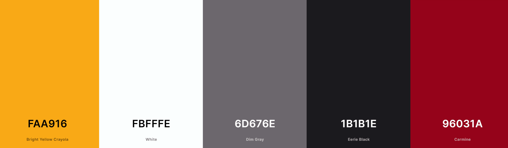
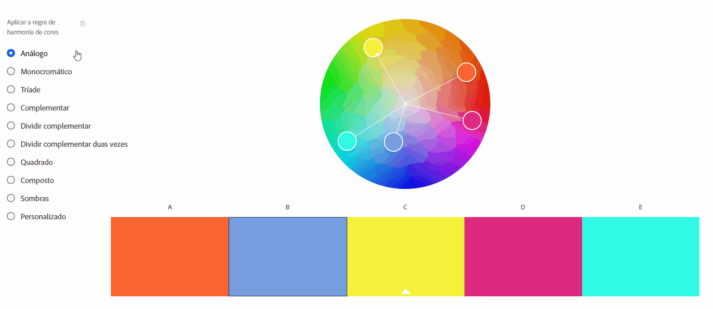
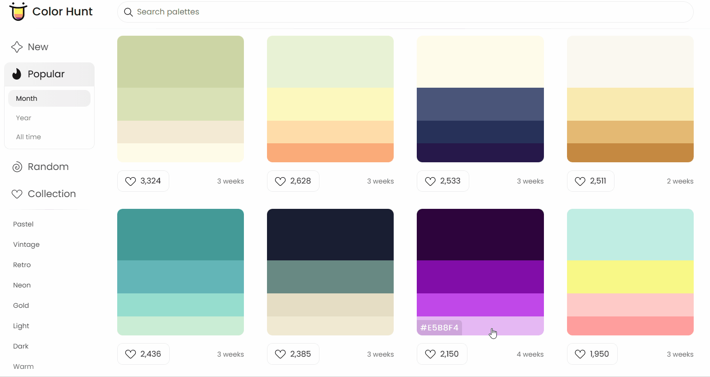
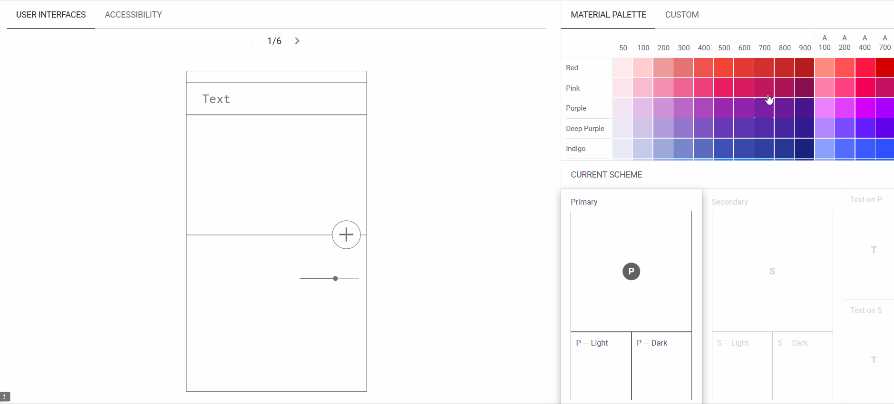

# Curso Alura - HTML e CSS: ambientes de desenvolvimento, estrutura de arquivos e tags

## Aula 1 - Editor de código VSCode

### Aula 1 - Apresentação - Vídeo 1

Transcrição  
Guilherme: Olá! Meu nome é Guilherme Lima.

Rafaella: E eu sou Rafaella Ballerini.

Guilherme: Estamos muito felizes em te acompanhar no curso HTML e CSS: Desenvolvendo uma página.

Rafaella: Afinal, o que é HTML? O que é CSS? São linguagens de programação? Como conseguimos transformar esses códigos em uma página web?

Guilherme: Aprenderemos do zero a:

- utilizar páginas HTML;
- onde escrever nossos arquivos HTML e CSS;
- para que servem essas duas linguagens.

Este curso é indicado para pessoas que nunca utilizaram HTML e CSS na vida. Se você se encaixa nessa descrição, te convidamos para mergulhar juntos!

HTML e CSS com Gui Lima e Rafa Ballerini aqui na Alura!

### Aula 1 - Criando um arquivo - Vídeo 2

Transcrição  
Rafaella: Antes de começar a codar, criaremos um arquivo com outro tipo de extensão, a qual estamos mais acostumados, para entendermos como este arquivo é criado. A primeira etapa será abrir um editor de texto — pode ser o Docs do Google, o Word ou mesmo um bloco de notas. Vamos escrever neste documento.

Guilherme: A ideia é entender que a criação de um código HTML ou CSS é similar à criação de um documento de texto. A diferença é que, no arquivo do Docs, existem elementos que nos auxiliam nessa criação.

Rafaella: Exato, elementos visuais.

Guilherme: Até de interface. Todo texto que lemos — como por exemplo um livro — possui um título. Vamos criar um título?

Rafaella: Sim. Se abrirmos o Docs do Google, veremos no topo da página uma barra de menus. Abaixo do menu "Formatar" temos uma lista de submenus de estilo que nos permite modificar automaticamente a configuração da fonte, sem precisar realizar modificações manualmente. Vamos abrir esse submenu e selecionar a opção "Título". No corpo do documento escreveremos "Isso é um título".

Guilherme: Temos um título. Pressionaremos "Enter" no final dessa linha e veremos que o tamanho do nosso cursor diminuiu. Na nova linha, o documento espera o formato "parágrafo", que consiste em um texto menor.

Rafaella: Este formato "parágrafo" é o padrão do Docs do Google. Nessa linha escreveremos "isso é um parágrafo". Podemos ver como é diferente a formatação entre o título e o parágrafo.

Guilherme: Este exemplo parece muito simples, mas explicaremos a ideia posteriormente. Os livros, geralmente, possuem imagens. Vamos acrescentar uma imagem do HTML 5?

Rafaella: Vamos. Buscaremos no google por "html 5" e clicaremos na aba "Imagens", na qual salvaremos uma imagem da logo do HTML 5. O nome do arquivo será html 5. Retornaremos ao Docs do Google, abriremos a nossa imagem e a arrastaremos para o documento que estamos editando.

Guilherme: Foram criados um título, um parágrafo e uma imagem. Você não deve estar entendendo nada. Contudo, a ideia é a seguinte: definimos que o título é um título clicando nos estilos e aplicando-os ao texto. No HTML fazemos algo parecido, porém sem clicar em menus.

Rafaella: Exatamente. As nossas páginas web também utilizam títulos, assim como os livros. Por exemplo, quando entramos em páginas de notícias percebemos um título grande, vários parágrafos com notícias e imagens embutidas. Precisamos pensar como uma página web funciona. Ela também possui esses elementos. Entretanto, para desenvolvermos um HTML não temos menus de estilização prontos, em vez disso utilizaremos códigos.

No caso do HTML, utilizaremos as tags. Elas serão responsáveis por informar quais trechos serão títulos, por exemplo.

Guilherme: Boa. Precisamos aprender todas as tags de uma só vez?

Rafaella: Não.

Guilherme: Não façam isso, por favor.

Rafaella: É uma questão de prática. Devemos analisar o que se encaixa melhor em cada contexto. Não adianta simplesmente decorar.

Guilherme: É isso aí. Vamos prestar atenção em um detalhe interessante, que é a extensão. Vamos dar um nome para esse documento?

Rafaella: Vamos. O nome será "Exemplo".

Guilherme: Baixaremos este arquivo. Quando clicamos no menu "Arquivo" localizado na barra de menus, uma lista de submenus é exibida. Selecionaremos o submenu "Fazer download" e nele veremos uma lista com vários tipos de extensão. Elas são formas com as quais esse arquivo será representado, ou seja, como ele vai funcionar. Pode ser um arquivo DOCX, um PDF, um TXT, e até mesmo um HTML compactado!

Podemos codar a partir de um editor de texto como o Docs Google ou o Word?

Rafaella: Não recomendamos.

Guilherme: Não conhecemos ninguém que faz isso.

Rafaella: Como pessoas desenvolvedoras, utilizamos na prática ferramentas específicas para essas tecnologias: os editores de código, algo como ambientes ou IDEs.

Neste curso utilizaremos um editor muito bom para códigos HTML e CSS: o Visual Studio Code, ou VS Code.

Guilherme: A seguir, aprenderemos como baixar e instalar o VS Code na nossa máquina para criarmos nosso arquivo HTML e desenvolver as nossas páginas.

### Aula 1 - Preparando o ambiente

No curso, usaremos uma ferramenta chamada [Visual Studio Code](https://code.visualstudio.com/), que é um editor de código desenvolvido pela Microsoft para Windows, Linux e macOS. Caso queira acompanhar os instrutores com as mesmas configurações, reserve um tempinho para a instalação do mesmo.

Para baixar o VSCODE, você pode procurar no Google por Visual Studio Code e clicar no primeiro link que aparece:

Tela do Google com o resultado da busca sobre Visual Studio Code

Se o seu sistema operacional for Windows você pode clicar para baixar no botão Download for Windows:

Tela da página de download do Visual Studio Code

Senão você pode clicar logo abaixo em other platforms que irá abrir uma página com opção de download para Linux e macOS também:

Tela da página de download do Visual Studio Code com foco em other platforms

Tela da página de download do Visual Studio Code para Linux e macOS

Se o seu sistema operacional for o Windows 8, 10 ou 11, siga os seguintes passos para instalação:

Tela da página de download do Visual Studio Code mostrando a opção do Windows destacada

Após clicar na opção de baixar para Windows, o instalador do Visual Studio Code vai para a pasta de Downloads do seu computador. Acesse a pasta, localize o arquivo de instalação, clique com o botão direito sobre ele e “Execute como administrador”.

Tela da pasta que contém o arquivo de instalação do Visual Studio Code, na qual mostra destacada a opção de Executar como administrador, que aparece após clicar com o botão direito do mouse sobre o arquivo, para iniciar a instalação

Após aceitar as permissões do Windows para a instalação, o instalador será iniciado e nessa etapa você deve aceitar o acordo de licença para poder prosseguir.

Tela inicial do instalador que requer marcar a opção de Eu aceito o acordo antes de poder prosseguir com o botão Próximo destacado no canto inferior direito

A próxima tela é para você selecionar o local de destino, ou seja, onde o Visual Studio Code será instalado no seu computador. Caso prefira, pode deixar como está sem alterar nada e clique em “Próximo”. Antes de prosseguir com a instalação, é importante lembrar que para poder instalar o Visual Studio Code o seu computador tem que ter o espaço necessário livre.

Tela do instalador para selecionar o local de destino onde o editor será instalado.

A tela seguinte serve apenas para você decidir se o Windows criará ou não uma pasta do Visual Studio Code no Menu Iniciar, ou seja, no menu que encontramos quando clicamos no símbolo do Windows na barra de tarefas do computador ou até mesmo no nosso teclado. Você pode renomear a pasta se quiser e prosseguir.

Tela do instalador para selecionar se será criada ou não a pasta do menu iniciar do Windows, bem como o nome dessa pasta caso ela seja criada.

Essa próxima etapa é a seleção de tarefas adicionais que o Visual Studio Code será responsável ou capaz de fazer em seu computador. Recomendamos que marque todas as opções para poder desfrutar das diversas funcionalidades da ferramenta.

Tela do instalador para selecionar as tarefas adicionais que o Visual Studio Code será capaz de realizar.

Pronto, chegamos no final da configuração de instalação e agora podemos clicar na opção “Instalar” para executar a última etapa do processo, a instalação de fato.

Tela do instalador que exibe as configurações de instalação que selecionamos e dá a opção de Instalar de fato o editor.

Na próxima tela podemos ver o progresso da instalação, ou seja, da extração dos arquivos baixados para a pasta de destino que selecionamos. Após a barra de extração se completar, podemos prosseguir para a última tela.

Tela do instalador que mostra visualmente o progresso da instalação.

Chegamos na última tela, essa é apenas para informar se o Visual Studio Code foi instalado com sucesso. Você pode marcar a opção “Iniciar o Visual Studio Code” para abri-lo após o fechamento do instalador. Finalmente, ao clicar em “Concluir” o instalador será fechado e todo o processo finalizado. A partir disso você pode usar o VSCode normalmente.

Tela final do instalador que exibe o sucesso da instalação

Caso seu ambiente não seja Windows e tenha dúvidas durante a instalação ou no decorrer do curso, pode contar conosco criando um tópico no fórum ou interagindo no nosso servidor do servidor do Discord. Também não deixe de ajudar outros colegas. Vamos construir juntos essa grande comunidade da Alura? :)

### Aula 1 - Instalando o VS Code - Vídeo 3

Transcrição  
Rafaella: Instalaremos o VS Code para criar nosso primeiro arquivo do projeto.

Guilherme: Vamos lá. Abriremos uma aba no navegador e pesquisaremos Vs Code.

Rafaella: Ou Visual Studio Code. Clicaremos sempre no primeiro link retornado pelo buscador. Deixaremos disponível aqui o link do site do VS Code. Em seu interior, alinhado à esquerda, temos um botão denominado "Download for Windows". Vamos clicar nele.

Caso a plataforma utilizada não seja o Windows, basta clicar no botão à direita de "Download Windows", o qual abrirá um submenu para escolher entre baixar Stables ou Insiders, sendo possível escolher, para as duas opções, entre as plataformas macOS, Windows x64 e Linux x64.

Após baixarmos o editor de código, vamos clicar no arquivo e seguir os passos de instalação. Na etapa "Selecione o Local de Destino" é possível escolher o local de instalação. Podemos deixar na pasta padrão ou escolher outra. Na etapa "Selecionar Tarefas Adicionais" podemos instalar configurações. Marcaremos a checkbox da opção "Criar um atalho na área de trabalho" para que seja criado um ícone do VS Code em área de trabalho. No fim das etapas, clicaremos em "Instalar".

Guilherme: A instalação é bem simples.

Rafaella: Sim. Este é um dos motivos pelos quais decidimos utilizar esse editor no curso.

No fim da instalação, marcaremos a checkbox da opção "Iniciar o Visual Studio Code" e clicaremos em "Concluir". Neste momento o Visual Studio Code será aberto na tela, na primeira página: o Get Started (ou "Vamos começar"). Caso queiramos entender o funcionamento, podemos clicar nos links "Get Started with VS Code" ("Comece com VS Code") e "Learn the Fundamentals" ("Aprenda os Fundamentos").

Já que faremos juntos, não será necessário acessar esses links.

Criaremos o projeto em si. Que tal criarmos nossa pasta na área de trabalho para facilitar?

Guilherme: Sim.

Importante: Geralmente um projeto possui diversos arquivos, seja ele HTML, CSS, Python ou Java. Por isso, colocamos todos os arquivos deste projeto em uma pasta.

Vamos dar um nome para nossa pasta?

Rafaella: Vamos. Ela se chamará "Portfólio". Se clicarmos dentro dela veremos que ela está vazia.

Guilherme: O nosso desafio é abrir essa pasta no VS Code.

Rafaella: Exatamente. Abriremos novamente o VS Code, e na página inicial "Get Started", à direita, clicaremos na opção "Open Folder".

Caso você não possua mais a tela "Get Started" aberta, basta acessar a barra de menus no topo da aplicação e clicar em "File" (ou "Arquivo"). Com esse menu aberto, clicaremos no submenu "Open Folder" (ou atalho "Ctrl + K + Ctrl + O").

Após selecionarmos "Open Folder", uma janela será aberta, onde devemos procurar a nossa pasta "Portfólio" através do explorador e selecioná-la. Em seguida clicaremos em "Selecionar Pasta". Neste momento o editor vai abri-la automaticamente.

Guilherme: Antes de abrir a pasta, surgirá uma janela perguntando se a gente confia nos autores que criaram essa pasta.

Rafaella: Basta clicar na opção "Yes, I trust the authors" ("Sim, eu confio nos autores", em português).

Guilherme: A gente criou a pasta e ela está aparecendo no explorador do VS Code, localizado em uma coluna na lateral esquerda da tela. Por enquanto essa pasta não tem nada.

Rafaella: Nada. Ainda estamos com a tela principal do aplicativo exibindo o "Get Started".

Guilherme: Vamos fechar essa aba clicando no X acima dela, no canto superior esquerdo. No explorador vamos ser capazes de visualizar todo os nossos arquivos e documentos que temos na pasta "Portfólio".

Criaremos o primeiro arquivo HTML. Geralmente ele possui um nome padrão.

Rafaella: Sim. Quando precisamos encontrar o HTML principal da página, procuramos por "index.html" — o nosso índice.

Guilherme: Quando falamos do Word, vimos as extensões .docx, .txt e .pdf. O nosso HTML possui a extensão que é o .html. Portanto, criaremos o nome padrão que incide na maioria dos projetos: index.html.

Rafaella: Acessaremos o explorador e, ao lado do nome da nossa pasta, clicaremos no ícone de uma página com um símbolo de + embaixo, que corresponde à opção "New File". É possível também realizar esta ação através da barra de menus, clicando em "File > New File" (ou atalho "Ctrl + Alt + Windows + N").

Após clicarmos nessa opção, um campo de texto vazio será exibido abaixo do nome da nossa pasta. Em seu interior digitaremos o nome do novo arquivo: "index.html" e daremos "Enter".

Guilherme: Uma curiosidade: se clicarmos em "Ctrl + N", o sistema cria uma aba na tela principal denominada "Untitled-1" e com a extensão indefinida. No corpo da tela, será exibida a opção "Select a language" ("Selecionar a linguagem"). Após clicar nessa opção, será aberto um campo de texto vazio no qual digitaremos "html" e daremos "Enter". Desta forma será criado um novo arquivo HTML denominado "Untitled-1".

Para salvá-lo, basta digitar "Ctrl + S" para abrir uma janela de salvamento. Vamos selecionar a pasta "Portfólio", digitar no campo de texto o nome "index2.html" e clicar em "Salvar". Neste momento, ele surgirá no explorador do VS Code, logo abaixo do nosso index.html.

Rafaella: Legal, ele já fica dentro da pasta.

Guilherme: Vamos deletar esse arquivo index2.html, pois o criamos somente para explicação do atalho.

Rafaella: Vamos fechá-lo primeiro.

É importante perceber que quando fechamos a aba do arquivo, nós não estamos deletando-o do projeto. Sempre que quisermos deletar, iremos até o explorador e clicaremos no arquivo com o botão direito, selecionando a opção "Delete".

Guilherme: Instalamos o VS Code, criamos o arquivo index.html e abrimos a pasta do projeto. Nosso próximo desafio será codar o conteúdo.

Vamos voltar no modelo que criamos acessando o nosso arquivo do Google Docs para relembrar o conteúdo que precisamos implementar em nosso projeto. Precisamos criar um título, um parágrafo e uma imagem com HTML.

### Aula 1 - Iniciando o projeto

As boas práticas na organização de um projeto podem ser consideradas um dos pilares fundamentais nas etapas iniciais do desenvolvimento. É muito importante iniciarmos da forma correta. Levando em consideração o que vimos anteriormente, podemos afirmar que:

Resposta:  
É uma boa prática criarmos pastas e subpastas que explicitem e organizem os arquivos de código de forma lógica.

> Nem sempre seus projetos terão apenas dois ou três arquivos, a depender do nível de complexidade, podemos chegar na casa das centenas de arquivos. Portanto, é uma boa prática separarmos arquivos por categorias claras e objetivas fazendo uso de pastas e subpastas.

### Aula 1 - Nome do arquivo

No mundo fantasia do Pokemon, treinadores pokemon decidem criar um site eletrônico, o Pokémart.com: um site de comércio eletrônico onde os treinadores poderiam comprar e vender itens, como Pokébolas, Potions e Berries. Para começar, por enquanto, seguindo nosso padrão eles precisam criar um arquivo chamado:

Resposta:  
index.html

> É a página principal que o navegador carrega ao visitar o site.

### Aula 1 - Criando seu arquivo HTML principal

Seu amigo está construindo um site utilizando HTML e pediu que você analisasse o projeto que ele desenvolveu.

Ao explorar os arquivos do projeto, você percebeu que o nome da página HTML principal é “teste123.html”. Isso pode gerar algum problema?

Resposta:  
Não afeta o funcionamento, mas o ideal é nomear como "index.html", pois é o padrão utilizado para a página principal.

> É um padrão nomearmos nossa página principal como "index.html", essa prática pode ajudar futuramente na comunicação com um servidor.

### Aula 1 - Para saber mais: criação de pastas

Geralmente um projeto de Front-end possui vários arquivos sendo eles HTML, CSS, Javascript, etc. Quando iniciamos, precisamos criar uma pasta para organizar os nossos arquivos pois não queremos que nenhum se perca, não é mesmo?

Vamos lá:

Para criar o projeto basta criarmos uma pasta no computador, pode ser na área de trabalho mesmo:

Na área de trabalho clique com o botão direito do mouse na parte vazia da tela, nas opções clique em novo depois em pasta para criar uma nova pasta projeto:

Tela da área de trabalho criando nova pasta

Depois definimos o nome da pasta que vai ser o mesmo nome do nosso projeto:

Tela da área de trabalho inserindo nome na pasta

E agora basta abrir essa pasta dentro do VSCode para criar os arquivos nela e começar a codificar:

Tela do Visual Studio Code abrindo a pasta

No VSCode podemos visualizar a pasta com o nome do projeto e os arquivos do projeto:

### Aula 1 - O que aprendemos?

- Nessa aula, você aprendeu como:
- Diferenciar a criação de um arquivo no Google Docs e no HTML;
- Fazer download e instalar o Visual Studio Code;
- Criar pasta e abrir no editor de código.

## Aula 2 - Documentação e HTML

### Aula 2 - Preparando o ambiente - Vídeo 1

Nos próximos vídeos, os instrutores irão utilizar uma imagem de exemplo. Você pode [baixar essa imagem aqui](https://github.com/alura-cursos/html-logo/archive/refs/heads/main.zip).

### Aula 2 - Documentação e estrutura básica do HTML - Vídeo 2

Transcrição  
Rafaella: Criamos nosso primeiro arquivo HTML. Agora vamos aprender a escrever o texto em HTML.

Guilherme: Isso. O que geralmente acontece quando queremos aprender uma linguagem de programação ou uma tecnologia nova? Procuramos o manual. No nosso caso, procuramos a documentação da linguagem.

Rafaella: Exatamente. Temos manuais de diversas tecnologias. Se quisermos aprender Javascript, procuraremos a documentação. Isso é muito importante.

Guilherme: Vamos abrir a documentação. Recomendamos, inicialmente, a w3s html intro. Vamos digitar esse nome na barra de pesquisa do Google.

Clicaremos no primeiro link retornado na pesquisa, o qual nos direcionará para a página de introdução do HTML no site W3Schools. Essa página nos mostra o conteúdo em inglês. Vamos colocá-la em português.

No topo da tela há uma barra de menus branca. Abaixo desta, há uma barra secundária de menus na cor preta, onde clicaremos no ícone de planeta denominado "Translate W3Schools", localizado à direita. Neste momento, à esquerda desse ícone, veremos um botão denominado "selecione o idioma", no qual clicaremos e selecionaremos a opção "Português". Após esse procedimento, a página será exibida em português.

Afinal, o que é HTML?

Rafaella: Encontraremos a resposta na página que abrimos. Nela há a seção "O que é HTML?", onde encontramos o seguinte tópico:

HTML significa Hyper Text Markup Language (ou "linguagem de marcação de hiper texto").
Ou seja, o HTML é uma linguagem de marcação. Existe uma polêmica envolvendo o HTML e que alimenta dúvidas sobre o HTML ser uma linguagem de programação ou não. De fato, o HTML é uma linguagem de marcação, e por isso, não se trata de uma linguagem de programação. Utilizamos o HTML para designar as partes do texto.

Retornando ao nosso documento de texto, podemos ver que marcamos a frase "Isso é um título" como um título. No caso do Docs Google, não precisamos escrever tags ou códigos para marcação, pois o programa utilizado facilita esse processo. Já no HTML utilizaremos tags para marcar títulos, parágrafos e imagens.

Guilherme: Voltando à página do HTML, ainda na seção "O que é HTML?" encontramos os dois tópicos abaixo:

HTML descreve a estrutura de uma página da Web.  
Os elementos HTML rotulam partes do conteúdo como "isto é um título", "isto é um parágrafo", "isto é um link", etc.
Isso significa que teremos um local onde rotularemos cada elemento da página: é como se indicássemos "isto será um título", "isto será uma imagem","estes serão dois parágrafos". O objetivo do HTML é marcar toda a página Web.

É interessante notar que existe um código por trás das páginas com as quais interagimos indicando a função de cada elemento.

Rafaella: Abaixo da seção "O que é HTML?" temos a seção "Um Documento HTML Simples" no qual é possível ver um spoiler do que seriam as tags:

```html
<!DOCTYPE html>
<html>
<head>
<title>Page Title</title>
</head>
<body>

<h1>My First Heading</h1>
<p>My first paragraph.</p>

</body>
</html>
```

Guilherme: Se olharmos este trecho não vamos entender muita coisa. A melhor forma para aprendermos uma técnica ou linguagem relacionada à tecnologia é praticando. Não existe outro jeito.

Rafaella: Exatamente.

Guilherme: Nós criamos um arquivo simples no Docs Google, indicando um título, um parágrafo e uma imagem. Conforme praticamos o HTML, essa tarefa se tornará comum.

Conforme podemos ver no trecho de exemplo, toda propriedade do HTML começa com o sinal < e termina com o sinal >.

Rafaella: No interior destes sinais, temos o rótulo daquela porção da página Web.

Rafaella: Exatamente. Vamos criar esse código no VS Code. Criaremos uma tag por vez e entenderemos o que cada uma significa.

Rafaella: Perfeito.

A primeira se chama `<!DOCTYPE html>`. Conforme a própria página do HTML define, se trata de uma declaração que define o documento como um documento HTML5. Mesmo que criemos a extensão .html, é importante declarar esta tag pois ela define a versão. É possível copiá-la e colar no VS Code, mas vamos escrever do zero para que entendamos melhor.

Retornaremos ao VS Code, criaremos nossos sinais < e >. Entre eles escreveremos um !DOCTYPE em letras maiúsculas, daremos um espaço e escreveremos html em letras minúsculas.

`<!DOCTYPE html>`

Guilherme: O que a Rafa comentou é interessante. Essa tag serve para identificar que estamos trabalhando nesse arquivo HTML com a versão 5. Esta será a versão utilizada quando abrirmos este projeto no navegador. Se estamos falando da versão 5, significa que existiram versões diferentes? A resposta é sim. Faremos um teste sobre isso depois.

Rafaella: Retornando à página do HTML, a próxima tag a ser copiada será a `<html>`. Esta tag indica que tudo o que existir dentro dela será o documento HTML.

Guilherme: A documentação nos informa que o `<html>` é o elemento raiz de uma página HTML, ou seja, este elemento será a base para tudo o que existir na página.

Vamos retornar ao VS Code e adicioná-la abaixo de `<!DOCTYPE html>`.

```html
<!DOCTYPE html>
<html>
```

Neste momento, o Visual Studio Code completará automaticamente a tag que abrimos com a tag posterior, ou seja, de fechamento.

```html
<!DOCTYPE html>
<html></html>
```

O que seria a tag posterior? Temos algumas tags que, para serem implementadas, precisam de uma abertura e de um fechamento.

Se voltarmos à página do HTML no navegador, veremos que existe a tag de fechamento `</html>` no final do trecho, precedida por vários outros elementos. Isso significa que todos os elementos entre `<html>` e `</html>` farão parte desta tag.

Toda tag de fechamento possui uma barra (/) após o sinal <.

Caso o VS Code não preencha a tag automaticamente, basta escrevê-la manualmente.

Posicionaremos o cursor no meio das tags `<html>` e `</html>` e pressionaremos "Enter" para abrir um espaço onde começaremos a escrever nosso documento.

```html
<!DOCTYPE html>
<html>

</html>
```

Guilherme: Já temos a nossa tag HTML. No caso do `<!DOCTYPE html>` não existe uma tag de fechamento. Isso é um padrão. Não sabemos o motivo exato disso.

Rafaella: Exato. Existem tags com fechamento e outras sem. Neste curso veremos todos os tipos de tags.

Antes de continuar, salvaremos o código com o atalho "Ctrl + S".

Guilherme: O HTML indica que a nossa página abriu. Voltaremos ao navegador e veremos nossa próxima tag: `<head>`, a qual, segundo a documentação, contém meta informações sobre a página HTML.

Rafaella: O que seriam meta informações? São as informações sobre o próprio documento. São metatags. Vamos adicioná-las dentro do tal `<head>`.

Vamos retornar ao VS Code, e entre as tags de abertura e fechamento do html adicionaremos a `<head>`.

Importante: Para indentarmos o código — ou seja, para mantê-lo organizado visualmente — devemos pressionar "Tab" a cada tag que abrirmos no interior de outra, criando dessa forma uma distância entre as tags e impedindo que todo o código fique "reto". Após a abertura e o fechamento da head pressionaremos "Enter". Dentro do espaço criado da <head> escreveremos as meta informações da nossa página.

```html
<!DOCTYPE html>
<html>
    <head></head>
</html>
```

Guilherme: Temos conteúdos na página que podemos visualizar e outros que não vemos diretamente.

Rafaella: Exato. Consultando a página do HTML, veremos que a primeira tag de metainformação é o `<title>`. No VS Code, vamos adicioná-la entre as tags do `<head>`, sem esquecer de pressionar "Tab" antes.

```html
<!DOCTYPE html>
<html>
    <head>
        <title></title>
    </head>
</html>
```

Guilherme: Vamos dar um título para a página entre as tags do title?

Rafaella: Vamos. Pode ser "Portfolio"?

Guilherme: Pode.

```html
<!DOCTYPE html>
<html>
    <head>
        <title>Portfolio</title>
    </head>
</html>
```

Rafaella: Salvaremos o arquivo e abriremos no navegador. Para abri-lo, acessaremos o explorador de arquivos do computador, acessaremos o local em que salvamos a pasta do projeto. Abriremos essa pasta e clicaremos duas vezes no arquivo que estamos escrevendo: o index.html. Podemos abri-lo com qualquer navegador disponível. Neste caso, abriremos no mesmo navegador que estamos usando.

Guilherme: Neste momento o navegador abrirá uma tela em branco. No corpo não tem nada, mas a metainformação que passamos no <head> deu um nome para a nossa aba: a aba se chama Portfolio. Ou seja, criamos um arquivo HTML e demos a ele um title denominado Portfolio.

A seguir, abordaremos de fato o conteúdo que queremos criar

### Aula 2 - Para saber mais: documentação do HTML

A importância da documentação

Ao começar a aprender HTML, uma dúvida comum é: "Como saber o que escrever e quais são as regras dessa linguagem?" Em outras palavras, onde encontrar informações confiáveis para aprender? A resposta é: na documentação oficial ou em sites de referência. Mas mesmo lendo a documentação, quem está começando pode se sentir perdido ao ver tantos códigos e termos. Como podemos aprender de forma prática e clara? Consultando sempre a documentação.

O que é:

A documentação é um guia que toda pessoa desenvolvedora deve levar a sério no dia a dia, é através dela que aprendemos como funcionam as linguagens de programação e também ferramentas e bibliotecas no mundo da tecnologia.

Sua importância:

A documentação é muito importante no aprendizado e no desenvolvimento de aplicações. Afinal quem melhor que a pessoa que criou a ferramenta para nos orientar sobre as suas funcionalidades, não é mesmo?

Quando devemos utilizar:

Devemos ler a documentação sempre que precisamos saber a estrutura de um método, ou quando queremos saber algum comando ou recurso de uma biblioteca, ou até mesmo quando esquecemos certa funcionalidade e precisamos relembrar.

Outra forma de ajuda:

Existem também as comunidades de tecnologia e programação que são bem úteis para tirarmos nossas dúvidas e aprendermos mais, como por exemplo a Stackoverflow que é uma das maiores comunidades de ajuda sobre programação e tecnologia atualmente. É uma comunidade onde você vai encontrar dúvidas sobre quase todas as linguagens de programação, entre outras ferramentas. Super recomendável acessá-la.

Aqui na Alura tem um artigo muito legal sobre comunidades, você pode conferir acessando Comunidades Front-End. Você pode acessar também a documentação do HTML que foi apresentada na aula através do link da w3schools. A w3schools também é uma ótima opção para quem precisa aprender algum método novo ou consultar exemplos sobre determinada linguagem. É um site bem completo e de fácil compreensão.

A importância da prática:

HTML é simples de começar, mas exige prática para entender como as tags funcionam juntas. Assim como aprendemos a formatar um texto no Word com o tempo, escrever HTML se torna natural conforme praticamos.

Próximos passos:

Agora que aprendemos a criar a estrutura básica e adicionamos um título à página, o próximo passo será incluir elementos visíveis no corpo da página, como títulos, parágrafos e imagens. Vamos construir isso juntos no VS Code!

### Aula 2 - Criando o corpo da página - Vídeo 2

Transcrição  
Rafaella: Temos o início da nossa página Web. Já adicionamos a metainformação title a qual aparece na aba da nossa página. Ainda não escrevemos nada da estrutura, do corpo da página. Faremos isso agora.

Guilherme: Vamos retornar à documentação do HTML para ver o próximo passo.

```html
<!DOCTYPE html>
<html>
<head>
<title>Page Title</title>
</head>
<body>

<h1>My First Heading</h1>
<p>My first paragraph.</p>

</body>
</html>
```

Rafaella: Já escrevemos tudo até a tag de fechamento `</head>`.

Guilherme: Entraremos na tag `<body>`. A documentação nos informa que ele define o corpo do documento e é um recipiente para todos os conteúdos visíveis, como cabeçalhos, parágrafos, imagens, hiperlinks, tabelas e listas. Vamos criar nossa tag retornando ao VS Code.

Rafaella: A tag `<body>` não ficará dentro do `<head>`. A palavra "head" significa cabeça, e "body" significa corpo. Se pensarmos bem, o corpo fica abaixo da cabeça.

Vamos criar o `<body>` abaixo do `<head>`, mas ainda dentro da tag `<html>`. Já que ambas estarão no mesmo nível em relação ao html, não pressionaremos "Tab".

Entre as tags de abertura e fechamento do body, pressionaremos "Enter" para abrir um espaço onde iremos escrever.

```html
<!DOCTYPE html>
<html>
    <head>
        <title>Portfolio</title>
    </head>
    <body>
    
    </body>
</html>
```

O que adicionaremos neste espaço?

Guilherme: Vamos voltar para o nosso documento do Google Docs para ver o que escrevemos. Lá encontraremos, em primeiro lugar, o nosso título. Precisamos escrever "Isso é um título" lá no HTML.

Voltaremos ao VS Code e escreveremos dentro do `<body>` a frase "Isso é um título".

```html
<!DOCTYPE html>
<html>
    <head>
        <title>Portfolio</title>
    </head>
    <body>
        Isso é um título
    </body>
</html>
```

Salvaremos o código e voltaremos à nossa página por meio do navegador, onde veremos o resultado. No canto superior esquerdo vemos a frase "Isso é um título" bem pequena. Ela não se parece com um título.

Rafaella: Não é só porque escrevemos "título" que o HTML entenderá que queremos um título. Ele não entende português. Nós, pessoas programadoras, precisamos rotular esse texto como um título de fato. Fazemos isso com o uso de tags.

Já vimos que o `<title>` se trata de uma meta informação do nome da página, que é inserida na aba. Existe uma outra tag denominada heading, a qual declaramos somente com `<h>`, o qual é acompanhado de um número que designa o peso daquele título. Podemos utilizá-la tanto para títulos quanto para subtítulos. Vamos envolver o nosso título com a heading no tamanho 1 — digitaremos portanto o comando `<h1>` à esquerda, e fecharemos com `</h1>` no final do texto.

```html
<!DOCTYPE html>
<html>
    <head>
        <title>Portfolio</title>
    </head>
    <body>
        <h1>Isso é um título</h1>
    </body>
</html>
```

Guilherme: Temos o `<html>` aberto, todo o seu conteúdo e em seguida o seu fechamento. Abrimos e fechamos a tag `<h1>`, e tudo que escrevemos no espaço entre essas tags será o heading 1.

Rafaella: Exato.

Guilherme: Alguma coisa mudou no código?

Rafaella: Vamos ver. Salvaremos o código, retornaremos ao navegador e atualizaremos a página. Ainda vemos a frase "Isso é um título", mas agora ela possui um tamanho maior, mais compatível com um título.

Guilherme: Visualmente já está diferente.

Rafaella: Seria interessante entendermos como seriam os headings de tamanho 2, para o subtítulo, e de tamanho 3. O h2 é maior do que o parágrafo padrão, mas é menor do que nosso h1. As headings diminuem de tamanho conforme aumentamos o número.

Guilherme: Muito bom. Nossos títulos geralmente possuem uma única tag de heading. E devemos manter essa ordem, de cima para baixo: h1, depois h2, e assim por diante.

Rafaella: Exato.

Guilherme: As headings vão até qual número?

Rafaella: Até h6.

Guilherme: Vamos tomar cuidado com isso.

E para o nosso parágrafo, Rafa?

Rafaella: Se escrevermos o parágrafo sem uma tag, o conteúdo será exibido. Contudo, o ideal é sempre adicioná-las, pois a página, por vezes, pode interpretar aquele texto de uma forma errada.

Acessibilidade: O uso das tags é essencial para pessoas que utilizam leitores de tela. Sem esse mecanismo, a navegação se torna muito difícil para esse público.

Abaixo do `<h1>` vamos adicionar a tag `<p>`, de parágrafo, com abertura e fechamento. Entre elas adicionaremos o texto "Isso é um parágrafo".

```html
<!DOCTYPE html>
<html>
    <head>
        <title>Portfolio</title>
    </head>
    <body>
        <h1>Isso é um título</h1>
        <p>Isso é um parágrafo</p>
    </body>
</html>
```

Salvaremos o código e retornaremos ao navegador. Atualizaremos a página e veremos o texto "Isso é um título". e logo abaixo dele vemos o texto "Isso é um parágrafo", em fonte menor. Agora temos nosso parágrafo.

Guilherme: Mesmo que não tenhamos alterado o tamanho do texto, o navegador agora sabe que se trata de um parágrafo. Se não escrevêssemos nada, não seria uma boa prática, por conta da acessibilidade. Precisamos entender desde o começo que as tags auxiliam o navegador a entender nossa página.

Rafaella: Exatamente.

Guilherme: Temos um desafio final: precisamos inserir a imagem. Se retornarmos ao nosso documento no Docs Google, veremos a imagem escolhida — o ícone do HTML5. Vamos adicioná-la ao nosso código.

Rafaella: Nós já havíamos salvado essa imagem em nosso computador, portanto vamos buscá-la através do explorador. Em seguida, vamos simplesmente arrastá-la para o explorador do VS Code.

Dica: É possível também inserir a imagem no projeto através da barra de menus do VS Code, através do caminho "File > Open File" e em seguida arrastá-la da tela para o explorador.

Guilherme: Você não precisa utilizar essa mesma imagem no seu projeto, pode escolher uma que você quiser! Mesmo assim, disponibilizaremos esta imagem nas atividades do curso.

Rafaella: Pode ser um gatinho, uma calopsita, qualquer coisa.

Neste momento, uma aba da imagem estará aberta na tela principal do VS Code. Vamos fechá-la clicando no X localizado nessa aba. Para trazer essa imagem para nosso HTML utilizaremos a tag ``, que vem da palavra "image" (ou "imagem"). Vamos adicioná-la abaixo do parágrafo e dentro do `<body>`, pois este é o local onde adicionaremos tudo o que é visível.

```html
<!DOCTYPE html>
<html>
    <head>
        <title>Portfolio</title>
    </head>
    <body>
        <h1>Isso é um título</h1>
        <p>Isso é um parágrafo</p>
        
    </body>
</html>
```

A `` é uma tag que não possui fechamento. Para adicionar a imagem nesta tag não vamos arrastá-la, copiá-la ou colá-la, mas sim escrever o seu endereço. Com este endereço, a tag buscará a imagem e a exibirá em nossa tela.

Guilherme: Por enquanto, a aplicação não sabe que imagem é. Precisamos informar a ela.

Rafaella: Isso mesmo. Informaremos onde está a imagem através da propriedade src. As propriedades ficam dentro dos sinais de maior e menor da nossa tag. Quando digitarmos "src" e pressionarmos "Enter", o próprio VS Code deverá completar o comando adicionando o sinal de igual = e duas aspas duplas "". Caso não tenha ocorrido o autopreenchimento, podemos digitar manualmente.

```html
<!DOCTYPE html>
<html>
    <head>
        <title>Portfolio</title>
    </head>
    <body>
        <h1>Isso é um título</h1>
        <p>Isso é um parágrafo</p>
        
    </body>
</html>
```

Inserimos o src que vem de "source" ("fonte", em português), adicionamos o sinal de igual e abrimos aspas para escrever entre elas onde está o endereço da imagem. Neste caso, nossa imagem possui o nome que demos anteriormente: html.png, e se encontra na mesma pasta do nosso arquivo index.html: a pasta "Portfolio". Já que ambos estão na mesma pasta, basta adicionarmos html.png entre as aspas de nosso src.

```html
<!DOCTYPE html>
<html>
    <head>
        <title>Portfolio</title>
    </head>
    <body>
        <h1>Isso é um título</h1>
        <p>Isso é um parágrafo</p>
        
    </body>
</html>
```

Salvaremos o código e retornaremos ao navegador. Atualizaremos a página e veremos o Título, o parágrafo, e logo abaixo deste último veremos a nossa imagem.

Guilherme: Nosso projeto está bem mais próximo da expectativa!

Agora vamos abordar um aspecto muito importante da nossa página: não é só o `<head>` que carrega as meta informações relevantes para a nossa página. No <body> também temos informações muito relevantes para a página e que não são visíveis. Essas informações são utilizadas por pessoas que utilizam leitores de tela.

Rafaella: Exato. O navegador quando utiliza leitores de tela sabe identificar o que são títulos, subtítulos, e consegue lê-los na ordem correta.

Como o navegador lê uma imagem e a exibe para as pessoas que utilizam leitores de tela? Nós precisamos descrever essa imagem, e para isso utilizamos dentro de  a propriedade alt. Após digitá-la, daremos "Enter" e o sistema completará a estrutura com o sinal de igual e as aspas duplas.

```html
<!DOCTYPE html>
<html>
    <head>
        <title>Portfolio</title>
    </head>
    <body>
        <h1>Isso é um título</h1>
        <p>Isso é um parágrafo</p>
        
    </body>
</html>
```

O alt permite que adicionemos um texto alternativo para nossa imagem. Qual texto digitaremos para a imagem do HTML5?

Guilherme: Podemos descrevê-la como "Logo do HTML 5".

```html
<!DOCTYPE html>
<html>
    <head>
        <title>Portfolio</title>
    </head>
    <body>
        <h1>Isso é um título</h1>
        <p>Isso é um parágrafo</p>
        
    </body>
</html>
```

Isso muda algo na nossa página?

Rafaella: Na página não há nenhuma mudança. O texto alternativo será lido somente por leitores de tela que passarem por essa imagem. Entretanto, em casos de quebra de imagem, o texto alternativo será exibido no lugar dela.

Para aumentar a acessibilidade e para nos prepararmos melhor em casos de erro na aplicação, é muito importante adicionar um bom texto alternativo em todas as nossas imagens.

### Aula 2 - Adicionando uma imagem

Nessa aula, aprendemos que para inserir uma imagem em sua página é necessário utilizar a tag ``. Pensando nisso, considere o código a seguir:

```html
<!DOCTYPE html>
<html>
    <head>
        <title>Portfólio</title>
    </head>
    <body>
        <h1>Isso é um título</h1>
        <p>Isso é um parágrafo</p>
        
    </body>
</html>
```

Assinale as alternativas corretas a respeito do código acima:

Resposta:  
Apenas o texto alternativo será exibido e a imagem estará indisponível, porque o atributo src da tag `` foi escrito incorretamente.

> A imagem não será localizada e não conseguiremos visualizá-la na página, pois escrevemos scr ao invés de src no atributo da tag . A página aparecerá da seguinte forma:

Captura de tela da parte superior de uma página HTML, exibindo um título principal, um parágrafo de texto e um espaço reservado para o logo do HTML5 que não é mostrada, apenas o alt da imagem aparece. O atributo src vem do termo em inglês “source”, que significa fonte, pois indica o caminho onde a imagem está localizada.

### Aula 2 - Quirks Mode e Live Server - Vídeo 5

Transcrição  
Rafaela: Temos uma página Web mais bonita, com todos os nossos elementos. Porém, ainda podemos brincar com esse código.

Guilherme: Exatamente. Quando seguimos a documentação de uma linguagem, sentimos uma certa desconfiança: será que se tirarmos uma propriedade indicada, conseguiremos ter o mesmo resultado?

Vamos alimentar a nossa curiosidade e mexer no código, tirando e colocando elementos de volta no lugar. Por exemplo, vamos retirar a primeira linha: o `<!DOCTYPE html>`.

Rafaela: Vamos. Esta linha foi indicada como importante para indicar a versão do HTML.

Guilherme: Isso. Vamos retirá-la e salvar o código.

```html
<html>
    <head>
        <title>Portfolio</title>
    </head>
    <body>
        <h1>Isso é um título</h1>
        <p>Isso é um parágrafo</p>
        
    </body>
</html>
```

Rafaela: Retornaremos ao navegador e atualizaremos a nossa página. Veremos que nada foi alterado. Aparentemente tudo está funcionando.

Guilherme: Aparentemente, contudo, houve sim uma alteração.

Existe uma forma de verificar o código HTML e CSS de qualquer página da internet. Para isso, na tela do navegador, clicaremos com o botão direito e selecionaremos a opção "Inspecionar". Neste instante, será aberta uma aba à direita da página Web, onde existe uma barra de menus superior. Nela, selecionaremos o menu "Elements". No interior deste menu será exibido o código-fonte da nossa página index.html.

Vamos acessar esse código-fonte e perceber que, quando passamos o cursor por cima de uma tag, o navegador realça o elemento correspondente diretamente na página Web. Vamos conferir se todos os elementos que codamos estão na página: `<html>`, `<head>`, `<title>`, `<body>`, `<h1>`, `<p>` e ``.

Aparentemente, está tudo igual. Ou seja, a retirada do `<!DOCTYPE html>` não mudou a parte visual da nossa página. Contudo, houve uma alteração na forma como o navegador enxerga essa página. Podemos ver a alteração dentro da própria aba "Inspecionar", selecionando o ícone de balão de comentário, localizado à direita da barra de menus superior. Este ícone aponta as issues da página. Após a seleção, será aberta uma aba secundária denominada "Issues", na parte inferior da aba "Inspecionar", a qual exibirá a seguinte mensagem:

Page layout may be unexpected due to Quirks Mode

Podemos traduzi-la como "O layout da página pode ser inesperado devido ao Modo Quirks". Ou seja, a página está em "modo peculiaridades". Não sabemos o que isso significa. Vamos clicar nesta mensagem para entender mais a fundo.

Abaixo da mensagem será exibida uma explicação mais detalhada do problema apontado,a qual apresentaremos uma versão resumida e traduzida:

Um ou mais documentos desta página foram abertos em um modo diferente do esperado. O Modo Quirks existe por razões históricas. Caso ele tenha sido acionado de forma não intencional, adicione o `<!DOCTYPE html>` para renderizá-la sem o Modo Quirks.

Afinal, o que é o Modo Quirks? Vamos acessar o link disponibilizado acima, o qual nos direcionará para uma nova página. Na parte superior dela veremos o título "A página não tem o doctype HTML, acionando assim o Modo Quirks". Esta página possui várias informações e links sobre o Modo Quirk, o modo Standards, códigos-fonte, etc. Recomendamos que você a leia posteriormente.

Vamos resumir o problema: antigamente existiam dois grandes navegadores, o NetScape e o Internet Explorer. Quando codávamos, precisávamos informar para qual navegador a página estava sendo construída. Hoje em dia isso não é mais necessário, a não ser que seja algo intencional — como em casos de projetos antigos.

Na página sobre Quirks Mode e Standards Mode existe a seção "Como os navegadores determinam qual modo usar?", onde há uma explicação sobre a questão da determinação de modos. Nela veremos que, para informarmos ao navegador que utilizaremos o HTML5, precisamos adicionar o `<!DOCTYPE html>`.

Rafaela: Atualmente, todos os navegadores sabem utilizar o HTML5.

Guilherme: Isso mesmo. Vamos sair do modo peculiaridades.

Rafaela: Vamos fechar as abas de explicação e a aba "Inspecionar". Em seguida retornaremos ao VS Code.

Guilherme: Para sair desse modo, pressionaremos "Ctrl + Z" para recuperar o DOCTYPE que havíamos deletado.

```html
<!DOCTYPE html>
<html>
    <head>
        <title>Portfolio</title>
    </head>
    <body>
        <h1>Isso é um título</h1>
        <p>Isso é um parágrafo</p>
        
    </body>
</html>
```

Salvaremos esse código e voltaremos ao nosso projeto aberto no navegador. Nele pressionaremos "F5" para atualizar a página e abriremos novamente a aba "Inspecionar". Veremos que, à direita da barra de menus, não existe mais o ícone de issues.

Existe um ponto que incomoda em nossa página: a necessidade de atualizá-la sempre que alteramos o código.

Rafaela: Vamos adicionar uma extensão ao nosso editor de código para que ocorram atualizações automáticas na nossa página a cada salvamento. Acessaremos a coluna lateral esquerda do nosso VS Code, onde selecionaremos o ícone "Extensions" ("Extensões"). Podemos acessá-lo também por meio do atalho "Ctrl + Shift + X".

Neste momento, o explorador de arquivos será substituído por um campo de busca. Nele digitaremos "live server" e faremos a busca. Nos resultados abaixo do campo, buscaremos a opção "Live Server", a qual possui milhões de downloads.

Guilherme: Muitas pessoas a utilizam.

Rafaela: Nós, inclusive. Após a seleção, essa extensão será aberta na tela principal do VS Code, onde clicaremos no botão "Install". Após o término da instalação, Ela será habilitada automaticamente. Caso contrário, basta clicar no botão "Enable". Em seguida fecharemos a aba dessa extensão.

Existem extensões para milhares de tarefas, inclusive para embelezar sintaxes de linguagens específicas. Podemos explorá-las e utilizá-las sempre que quisermos.

Guilherme: Como a extensão funciona?

Rafaela: Agora temos um botão na barra inferior do VS Code denominado "Go Live". Como o arquivo HTML selecionado, clicaremos neste botão. Uma aba de Alerta de Segurança será aberta pelo nosso sistema, na qual selecionaremos a opção "Permitir acesso". Neste momento será aberta uma aba com a nossa página HTML no nosso navegador.

Guilherme: Vamos manter as duas abas abertas. Veremos que ambas estão rodando de locais diferentes: a antiga está rodando no local do arquivo, enquanto a nova (com live server ativo) exibe a URL com um número constituído de 10 dígitos.

Retornando ao VS Code, alteraremos o parágrafo adicionando "interessante" ao final da frase.

`<p>`Isso é um parágrafo interessante`</p>`

Salvaremos esse código e voltaremos ao navegador. Na aba nova, veremos a nossa alteração.

Rafaela: Na aba antiga, a mudança só aparecerá se atualizarmos a página.

Guilherme: A principal vantagem do live server é não precisar atualizar a página a todo momento.

Rafaela: O único passo necessário é salvar o arquivo no editor.

### Aula 2 - Para saber mais: extensões do VSCode

Agora que você conheceu o Live Server, que tal explorar mais algumas extensões que podem facilitar seu dia a dia no desenvolvimento com o VSCode?

Para isso, preparamos o artigo Extensões VS Code: descubra quais são as mais usadas, para que você conheça outras extensões e escolha aquelas que preferir para auxiliar em seus estudos!

### Aula 2 - Para saber mais: estruturando uma página HTML

A estrutura básica do HTML

Para criar um arquivo HTML funcional devemos seguir um padrão de construção, utilizando um conjunto de elementos, ou seja, os hipertextos, que se conectam entre si formando a página. Como já visto anteriormente, os elementos HTML ou também chamados de tags HTML, são utilizados para informar ao navegador que tipo de estrutura é essa que está sendo construída, podendo ser títulos, parágrafos, imagens, links, entre outros.

Um exemplo prático dessa estrutura básica seria:

```html
<!DOCTYPE html>
<html lang="pt-br">
<head>
    <meta charset="UTF-8">
    <meta http-equiv="X-UA-Compatible" content="IE=edge">
    <meta name="viewport" content="width=device-width, initial-scale=1.0">
    <title>Document</title>
</head>
<body>

</body>
</html>
```

É importante entender como funciona e o que faz cada elemento dentro da estrutura básica do HTML, e para isso deixamos como recomendação o artigo O que é o HTML e suas tags? Parte 1: estrutura básica. Lembrando que esse artigo compõe uma série de cinco artigos sobre o que é HTML e suas tags, os quais podem ser encontrados aqui na plataforma da Alura e são perfeitos para desenvolvedores HTML de primeira viagem.

### Aula 2 - Lista de exercícios

O que é:  
Boas-vindas à nossa lista de exercícios "Mão na massa", um caminho prático e envolvente para aprender e aprimorar suas habilidades em tecnologia. Aqui, você não encontrará longas leituras teóricas ou explicações abstratas. Em vez disso, nossos exercícios são projetados para colocar você no centro do processo de aprendizado, permitindo que você construa, experimente e explore conceitos tecnológicos de forma direta e aplicada.

Para que serve:  
Esta lista é uma ferramenta dinâmica para aprender, reforçar e aprimorar habilidades práticas em programação e desenvolvimento web. Cada exercício é uma oportunidade de aplicar conhecimentos teóricos em cenários reais, preparando você não apenas para entender a tecnologia, mas para utilizá-la de maneira eficaz e criativa em seus próprios projetos ou no ambiente de trabalho.

Como fazer:  
Leia cada exercício com atenção: comece entendendo o cenário proposto e o que se espera como resultado.
Escreva o código: utilize o ambiente de codificação de sua escolha para escrever e testar o seu código. Não se preocupe em acertar de primeira, a prática leva à perfeição.
Verifique o gabarito: após tentar resolver o exercício, compare seu código com o gabarito fornecido em “Opinião do instrutor”. Isso ajudará a identificar áreas de melhoria e consolidar o aprendizado.
Repita: a repetição é chave para o aprendizado. Tente fazer os exercícios mais de uma vez, aplicando melhorias e variantes.
Lembre-se, cada desafio é uma chance de crescer. Não se desanime com os erros, eles são degraus no caminho do aprendizado. E acima de tudo, divirta-se! O aprendizado mais eficaz acontece quando nos engajamos e nos interessamos pelo que estamos fazendo.

Não se esqueça que estamos no Fórum e no Discord para te ajudar!

Bons estudos!

1) Construindo a estrutura básica do HTML  
Você acabou de iniciar um estágio em uma empresa de desenvolvimento web e sua primeira tarefa é criar um documento HTML básico para um novo projeto. O objetivo é construir a estrutura fundamental de um arquivo HTML, incluindo as tags essenciais: `<!DOCTYPE html>, <html>, <head>, e <body>`. Além disso, dentro da tag `<head>`, adicione uma tag `<title>` com um título de sua escolha para a página. Lembre-se de seguir as práticas de indentação corretas para manter o código organizado.

2) Adicionando conteúdo ao HTML
Agora que a estrutura básica do seu documento HTML está pronta, seu supervisor pediu para adicionar um cabeçalho e um parágrafo ao corpo do documento. Use as tags <h1> para o cabeçalho e `<p>` para o parágrafo. Escolha um tema para o cabeçalho e escreva um breve parágrafo relacionado a esse tema.

3) Trabalhando com meta tags e título
Você precisa otimizar a seção `<head>` da página HTML existente. Adicione uma meta tag para definir a codificação de caracteres como UTF-8 e altere o título da página para algo mais descritivo e apropriado para o conteúdo do site.

4) Organizando conteúdo com tags HTML
Você está desenvolvendo a página inicial de um site para um projeto pessoal. Você precisa criar um título principal e um subtítulo, seguidos por um breve parágrafo explicativo. Utilize HTML para estruturar esses elementos. Crie um arquivo HTML e adicione um título principal com a tag `<h1>`, um subtítulo com a tag `<h2>`, e um parágrafo com a tag `<p>`. Use textos de sua escolha para cada um destes. Lembre-se de seguir a hierarquia correta das tags e verificar o resultado no navegador.

5) Adicionando imagens com acessibilidade
Neste desafio, você vai adicionar uma imagem ao seu projeto de site pessoal. Escolha uma imagem de sua preferência (pode ser um logo ou uma foto relacionada ao tema do site). Utilize a tag `` para inserir a imagem no corpo do documento HTML, e não se esqueça de incluir o atributo alt para descrever a imagem, melhorando a acessibilidade do site. Verifique o resultado no navegador.

6) Listando Itens em HTML
Agora, adicione uma lista de itens ao seu site. Esta lista pode ser de características do projeto, etapas de desenvolvimento, ou qualquer outra informação relevante. Utilize a tag `<ul>` para uma lista não ordenada ou `<ol>` para uma lista ordenada, e `<li>`para cada item da lista. Verifique o layout no navegador após a inserção.

7) Explorando o impacto do DOCTYPE no HTML
A sua tarefa é explorar o impacto da declaração `<!DOCTYPE html>` em um documento HTML. Crie um arquivo HTML básico com a estrutura apresentada no relato, incluindo elementos como `<head>`, `<title>`, `<body>`, `<h1>`, `<p>`, e ``. Primeiro, visualize a página com a declaração `<!DOCTYPE html>`. Em seguida, remova a declaração e visualize novamente. Use a ferramenta de inspeção do navegador para explorar as diferenças no modo de renderização da página, focando na presença ou ausência do "Modo Quirks".

8) Automatizando a atualização da página com Live Server
Instale e utilize a extensão "Live Server" no Visual Studio Code para automatizar a atualização da sua página HTML. Faça alterações no código HTML, como adicionar um texto ao parágrafo, e observe as mudanças sendo refletidas automaticamente no navegador.

Ver opinião do instrutor
Opinião do instrutor

1) Construindo a estrutura básica do HTML
Abra um editor de código como o VS Code.
Comece o documento com a declaração `<!DOCTYPE html>` para especificar que você está usando HTML5.
Abra a tag `<html>` para definir o início do documento HTML.
Adicione a tag `<head>`dentro da tag `<html>`. A tag `<head>` contém informações sobre o documento.
Dentro de `<head>`, inclua a tag `<title>` e dê um título à sua página, como `<title>`Meu primeiro projeto`</title>`.
Após `<head>`, adicione a tag `<body>`, que conterá o conteúdo visível da sua página.
Feche as tags `</body>` e `</html>` em ordem.
Código:

```html
<!DOCTYPE html>
<html>
    <head>
        <title>Meu primeiro projeto</title>
    </head>
    <body>
        <!-- Conteúdo da página vai aqui -->
    </body>
</html>
```

2) Adicionando conteúdo ao HTML
No editor de código, localize a tag `<body>` no seu documento HTML.
Adicione a tag `<h1>`com um texto de cabeçalho relevante, como `<h1>`Boas-vindas ao meu site`</h1>`.
Abaixo da tag `<h1>`, adicione a tag `<p>`e escreva um parágrafo, como `<p>`Este é um exemplo de um parágrafo em HTML.`</p>`.
Salve as alterações e visualize o arquivo em um navegador para ver o cabeçalho e o parágrafo exibidos.
Código:

```html
<!DOCTYPE html>
<html>
    <head>
        <title>Meu primeiro projeto</title>
    </head>
    <body>
        <h1>Boas-vindas ao meu site</h1>
        <p>Este é um exemplo de um parágrafo em HTML.</p>
    </body>
</html>
```

3) Trabalhando com meta tags e título
Abra o documento HTML no editor de código.
Na seção `<head>`, adicione a meta tag `<meta charset="UTF-8">`. Isso define a codificação de caracteres para UTF-8, o que é essencial para exibir caracteres especiais corretamente.
Altere o conteúdo da tag `<title>` para algo que descreva melhor o site, como `<title>`Aventuras em HTML`</title>`.
Salve o documento e abra-o em um navegador para verificar as mudanças.
Código:

```html
<!DOCTYPE html>
<html>
    <head>
        <meta charset="UTF-8">
        <title>Aventuras em HTML</title>
    </head>
    <body>
        <h1>Boas-vindas ao meu site</h1>
        <p>Este é um exemplo de um parágrafo em HTML.</p>
    </body>
</html>
```

4) Organizando conteúdo com tags HTML
Crie um arquivo HTML.
Adicione a estrutura básica do HTML (`<!DOCTYPE html>, <html>, <head>, e <body>`).
Dentro da tag `<body>`, adicione a tag `<h1>` para o título principal. Exemplo: `<h1>`Meu projeto pessoal`</h1>`.
Adicione a tag `<h2>` para o subtítulo. Exemplo: `<h2>`Uma breve introdução`</h2>`.
Adicione a tag `<p>` para um parágrafo explicativo. Exemplo: `<p>`Este é um projeto que visa... `</p>`.
Salve o arquivo e abra-o no navegador para visualizar o resultado.
Código:

```html
<!DOCTYPE html>
<html>
    <head>
        <title>Meu projeto</title>
    </head>
    <body>
        <h1>Meu projeto pessoal</h1>
        <h2>Uma breve introdução</h2>
        <p>Este é um projeto que visa...</p>
    </body>
</html>
```

5) Adicionando imagens com acessibilidade
Escolha uma imagem e salve-a na mesma pasta do seu arquivo HTML.
No seu arquivo HTML, abaixo do parágrafo, adicione a tag ``. Use o atributo src para especificar o caminho da imagem. Exemplo: ``.
Adicione o atributo alt para descrever a imagem. Exemplo: ``.
Salve o arquivo e abra-o no navegador para visualizar a imagem inserida.
Código:

```html
<!DOCTYPE html>
<html>
    <head>
        <title>Meu projeto</title>
    </head>
    <body>
        <h1>Meu projeto pessoal</h1>
        <h2>Uma breve introdução</h2>
        <p>Este é um projeto que visa...</p>
        
    </body>
</html>
```

6) Listando Itens em HTML
Decida se a lista será ordenada (`<ol>`) ou não ordenada (`<ul>`).
Após o último elemento inserido no corpo do documento, adicione a tag escolhida (`<ul>` ou `<ol>`).
Dentro desta tag, adicione várias tags `<li>`, cada uma contendo um item da lista. Exemplo: `<li>`Item 1`</li>`.
Salve e abra o arquivo no navegador para visualizar a lista.
Código:

```html
<!DOCTYPE html>
<html>
    <head>
        <title>Meu projeto</title>
    </head>
    <body>
        <h1>Meu projeto pessoal</h1>
        <h2>Uma breve introdução</h2>
        <p>Este é um projeto que visa...</p>
        
        <ul>
            <li>Característica 1</li>
            <li>Característica 2</li>
            <li>Característica 3</li>
        </ul>
    </body>
</html>
```

7) Explorando o impacto do DOCTYPE no HTML

- Crie um arquivo HTML e adicione a estrutura básica com a declaração `<!DOCTYPE html>`.
- Visualize a página no navegador e observe sua aparência.
- Remova a declaração `<!DOCTYPE html>` e visualize a página novamente.
- Abra a ferramenta de inspeção do navegador e verifique se o "Modo Quirks" foi ativado, observando as diferenças de renderização.
- Adicione novamente a declaração `<!DOCTYPE html>` e note as mudanças no modo de renderização da página ao atualizar.

8) Automatizando a atualização da página com Live Server

- Abra o VS Code e acesse a seção "Extensions".
- Pesquise por "Live Server" e instale a extensão.
- Abra seu arquivo HTML e clique em "Go Live" na barra inferior do VS Code.
- Faça uma alteração no código, como adicionar uma palavra ao parágrafo.
- Observe a atualização automática na página do navegador, sem a necessidade de recarregar manualmente.

### Aula 2 - O que aprendemos?

Nessa aula, você aprendeu:

- A importância da documentação W3S;
- O que é HTML e porque é considerada uma linguagem de marcação;
- Estruturar um documento HTML com tags e elementos;
- A utilidade da introdução `<!DOCTYPE html>`;
- Diferença entre a metainformação presente no `<head>` e o conteúdo presente no `<body>` de uma página HTML;
- Criar textos alternativos (alts) para uma imagem;
- Acessar a Developer Tools (Ferramentas para Desenvolvedores) de um navegador;
- Quirks mode (modo peculiaridade);
- Utilizar extensões no Visual Studio Code (Live Server por exemplo).

## Aula 3 - Layout e Tags semânticas

### Aula 3 - Projeto da aula anterior

Aqui você pode [baixar os arquivos](https://github.com/alura-cursos/Portifolio-HTML-e-CSS/archive/refs/heads/aula_2.zip) da aula 02 ou acessar os [arquivos no Github!](https://github.com/alura-cursos/Portifolio-HTML-e-CSS/tree/aula_2)

### Aula 3 - Preparando o ambiente

As próximas aulas serão baseadas no Figma, que é uma ferramenta de prototipagem de interfaces, onde vamos construir o layout da página do Portfólio. Para acessá-lo, [clique aqui](https://www.figma.com/community/file/1405564525582286850).

Para ter a mesma visualização que a da aula, primeiramente é necessário criar uma conta ou fazer login em uma existente. Para isso, entre no site do Figma e clique em Log In (caso já tenha conta) ou em Sign Up (para cadastrar nova conta). Depois de estar com uma conta conectada, [acesse o projeto no Figma](https://www.figma.com/community/file/1405564525582286850).

Atenção: Observe que as abas Design e Inspect demonstradas no curso passaram por atualizações recentes no figma e hoje são opções premium, ou seja, pagas. Mas não se preocupe, no figma fornecido você pode pegar as informações dos elementos através da aba Properties! Basta clicar nos componentes e verificar suas propriedades na aba, como demonstrado abaixo:

Tela do Figma com uma lista de opções aparecendo no topo

Caso queira criar uma cópia do layout para a sua conta do Figma, assim garantindo o acesso de edição, entre no link do layout original que está acima e no menu superior da plataforma, clique no nome do arquivo: Portfolio - Curso 1. Irão abrir algumas opções, clique em “Duplicate to your drafts” e o arquivo do projeto estará duplicado para uso próprio.

Tela inicial do Figma ao entrar com a conta conectada

E para demonstrar como uma pessoa desenvolvedora Front-end utiliza o Figma, separamos esse [Alura+ com a Rafa Ballerini](https://cursos.alura.com.br/extra/alura-mais/como-front-end-utiliza-o-figma-c858) onde você aprenderá tudo o que é necessário para analisar um documento do Figma para transformá-lo em código, desde a exportação de imagens e ícones até a estilização com CSS.

Ativando o WebGL

Caso apareça a mensagem: "we can't open that file. We can't open this file because WebGL isn't supported, or is disabled, in your browser. If your browser supports WebGL, check out this help article to find out how to enable it", significa que o WebGl do seu navegador está desativado e você precisa ativá-lo.

No Google Chrome, digite o seguinte na barra de pesquisa: chrome://flags/. Em seguida, pesquise por "WebGL" na lista e ative-o, trocando de Disabled para Enabled. Depois disso, aparecerá um botão para reiniciar o Google Chrome. Reinicie o navegador e pronto.

Se por acaso o seu navegador não for o Google Chrome, o procedimento é semelhante. O WebGL está desativado e precisa ser ativado.

### Aula 3 - Projeto no Figma - Vídeo 1

Transcrição  
Rafaella: Já temos todas as ferramentas para começarmos nosso projeto de fato, pois até agora só fizemos testes, aprendemos como escrever títulos e configuramos o VSCode para nosso desenvolvimento.

Como pessoas desenvolvedoras, criamos uma página de portfolio com estilos de cores e fontes próprias, ou nos baseamos em algum modelo pronto?

Guilherme: Geralmente, o mercado e o cotidiano de quem trabalha com desenvolvimento é dividido em dois tipos de profissionais: Há a pessoa que faz o desenho da página e indica onde estarão as imagens, ícones, cores e tamanhos, e que passa para a segunda pessoa que irá codificar o design com HTML, CSS, React, JavaScript e etc.

Rafaella: Em nosso caso, somos este segundo tipo de profissional que recebe um projeto já desenhado e tem a tarefa de codar a página web.

A pessoa que desenha a página "do zero" faz toda uma pesquisa sobre ideias e direções para construir o design, estudando os porquês de cada elemento possuir uma cor e um formato com base na importante Experiência do Usuário ou UX/UI.

Guilherme: A Isa, nossa designer aqui da Escola de Front-End da Alura produziu o layout que estamos trabalhando, e ela de fato desenhou e pesquisou bastante para isso.

Rafaella: Na prática, existem várias ferramentas que essas pessoas utilizam para construir páginas e que servem como base para profissionais de desenvolvimento.

Uma das mais utilizadas é o Figma, justamente o que estamos usando para desenvolver.

A Isa já nos enviou o link do projeto no Figma e conseguimos ter todo o acesso às informações necessárias para codificarmos as páginas neste curso.

Projeto no Figma. Temos dois blocos de conteúdo, lado a lado, centralizados sobre fundo preto. O bloco esquerdo possui um texto que se divide em duas partes: título e subtítulo. O título apresenta um texto em negrito dividido em duas cores: "Eleve seu negócio digital a outro nível" em branco, seguido de "com um Front-end de qualidade!" em ciano. O subtítulo está na cor branca, e exibe o texto de apresentação da Joana Santos. Abaixo do subtítulo, temos dois botões na cor ciano, lado a lado: no botão esquerdo temos o texto "Instagram" e no direito o texto "Github". Já o bloco direito se constitui de uma fotografia em preto e branco representando Joana Santos, uma mulher desenvolvedora, sentada em frente a um notebook aberto. A fotografia também conta com um desenho em ciano de uma linha circulando Joana e seu notebook três vezes e terminando em uma estrela.

Guilherme: Se observarmos a tela inicial, os espaçamentos, a imagem, as cores e os demais elementos foram elaborados a partir de estudos.

Se quisermos saber mais sobre layouts, sobre o Figma, criação de telas e outros assuntos das áreas de Experiência de Usuário e Interface de Usuário, ou User Experience (UX) e User Interface (UI) em inglês, há diversos cursos em formações muito interessantes aqui da Alura.

Nosso desafio é o segundo passo do processo, pois alguém já fez o design da página e sua estrutura, mas como podemos trabalhar a partir das informações do Figma?

Rafaella: Primeiramente, quando abrirmos o projeto através do link disponibilizado neste curso, precisaremos ter o cadastro na plataforma para acessar todos os dados.

Além de conseguirmos visualizar a página já montada, pegaremos as informações ao clicarmos nos elementos. Por exemplo, clicando no botão de "Instagram", abriremos uma aba lateral direita contendo três abas no topo: "Design", "Protótipo" ou "Prototype" e "Inspecionar" ou "Inspect".

Basicamente utilizaremos mais a primeira e a última aba durante nosso trabalho.

Na aba de "Design", encontraremos informações sobre largura em "W:" e altura em "H:", o formato do botão, as cores que são utilizadas, entre outras.

Já na aba "Inspect", teremos outras formas de valores para as mesmas propriedades. Inclusive, na parte "Code", há um código CSS, mas não veremos isso agora.

Portanto, conseguiremos obter todos os dados necessários nesta ferramenta chamada Figma.

Guilherme: Nosso desafio é codar o HTML das telas já construídas.

Rafaella: Exatamente, as transformaremos em páginas web utilizando tanto o HTML quanto o CSS.

Faremos a estrutura dos elementos com o primeiro, e aplicaremos a estilização com o segundo, adicionando cores, formatos, fontes, posicionamento e etc.

Pensando de fato no HTML e observando a página inicial no Figma, teremos o título principal no topo do bloco de código à esquerda. Abaixo, há um parágrafo seguido de dois botões, além da foto de nossa desenvolvedora da Alura à direita, mas é interessante termos uma imagem própria para nosso portfólio.

Guilherme: Inclusive poderemos alterar o conteúdo textual, as cores e outras propriedades se quisermos.

A seguir, vamos começar a trabalhar com o HTML!

### Aula 3 - Tags semânticas - Vídeo 2

Transcrição  
Rafaella: Iremos iniciar nosso projeto e transformar o design do Figma em código.

Guilherme: Vamos abrir o arquivo index.html no VSCode. Sempre que criarmos uma página HTML, devemos escrever `<!DOCTYPE html>, <html>, <head>, <body>` e fechá-los?

Rafaella: Existem alguns atalhos que nos permitem iniciar um documento .html com essa estrutura básica.

Para entendermos, excluiremos todo o conteúdo do arquivo, salvaremos e notaremos que não há mais nada da página no navegador, lembrando que ainda estamos rodando o Live Server.

Em seguida, digitaremos apenas um ponto de exclamação ! na primeira linha do documento e exibiremos uma janela de título "Emmet Abbreviation" contendo todo um código. Quando simplesmente apertarmos a tecla "Enter", toda a estrutura básica do HTML aparecerá.

```html
<!DOCTYPE html>
<html lang="en">
<head>
    <meta charset="UTF-8">
    <meta http-equiv="X-UA-Compatible" content="IE=edge">
    <meta name="viewport" content="width=device-width, initial-scale=1.0">
    <title>Document</title>
</head>
<body>
    
</body>
</html>
```

Também perceberemos que há mais coisas do que antes, como as três informações `<meta>` e lang="en". Entenderemos o que são essas novas tags.

Guilherme: Isso é tão comum que criaram este atalho para gerar o texto automaticamente.

Fazendo uma primeira leitura, ao posicionarmos o cursor sobre lang="en", exibiremos uma caixa de diálogo com um texto explicando que este trecho define a língua oficial do elemento que estamos trabalhando, que neste caso está em inglês.

Rafaella: Utilizaremos em português e escreveremos o conteúdo usando os acentos específicos que não são usados com "en", então substituiremos por "pt-br" para especificar que é do Brasil.

Guilherme: Na quarta linha, encontraremos a primeira tag `<meta>` seguido de charset="UTF-8".

Rafaella: O UTF-8 é a codificação dos caracteres mais usada no mundo, pois consegue trazer todos os acentos que comentamos, além de interpretar corretamente as outras línguas.

Guilherme: É Unicode, como se fosse um grande dicionário de caracteres que usaremos na aplicação.

Rafaella: Se não utilizarmos o UTF-8, pode ser que não consigamos exibir acentos como ~ ou circunflexo ^ corretamente em alguns navegadores.

Guilherme: Entendi! E na quinta linha com a segunda `<meta>` que tem http-equiv="X-UA-Compatible" e content="IE=edge", é algo para o Microsoft Edge?

Rafaella: Exato, esta é uma configuração para sempre utilizarmos sua versão mais recente neste navegador especificamente.

Caso estejamos rodando o código no Edge, é importante que coloquemos esta informação `<meta>`, além de que a pessoa usuária final que vai usar nossa aplicação pode estar rodando nele também, principalmente se forem versões anteriores.

Guilherme: Já na sétima linha, temos o `<title>` que já conhecemos, contendo Document. Na sexta linha com o terceiro `<meta>` que tem name="viewport" e o content que inclusive fica com a parte final encoberta pelo limite da tela do VSCode.

Se apertarmos as teclas "Alt + Z" com o cursor sobre esta linha, iremos fazer com que este trecho passe para a linha seguinte e fique totalmente visível dentro do espaço de texto.

Aparentemente, o conteúdo de content parece dizer respeito à largura e ao tamanho da imagem.

Rafaella: Exato, o nome "viewport" é o próprio dispositivo que acessará nossa página, e obtém sua largura com width=device-width para depois gerar a escala da página com initial-scale, que sempre iniciará com 1.0 com base na tela, seja de celular, Ipad, computador, entre outras.

Com isso, não teremos o problema dos elementos ficarem posicionados de forma errada e nem da fonte ter um tamanho desproporcional.

Guilherme: Cientes disso, poderemos começar alterando o conteúdo do `<title>`.

Rafaella: Escreveremos Portfolio mesmo, que é o nosso projeto. Salvaremos e abriremos o navegador para exibirmos este nome na aba. Como é uma metainformação, não aparecerá no corpo da página. Agora começaremos a desenvolver todos os elementos dela.

Guilherme: Mas só iremos escrever HTML diretamente?

Rafaella: Talvez sim, e há pessoas que fazem isso apesar de não ser recomendado, pois sempre teremos que pensar e planejar o que iremos desenvolver em nossa página web.

Por exemplo, é interessante analisarmos o Figma e separar nossas tarefas em partes, como pelo cabeçalho da página no topo, ou o rodapé na base, e há também o conteúdo principal no centro da tela, como no nosso caso.

No HTML, utilizamos algumas tags de maneira semântica para separarmos de fato os elementos da página conforme as estruturas que temos. A que seguiremos será pelo cabeçalho, conteúdo principal e o rodapé.

Guilherme: Se acessarmos a própria plataforma da Alura, encontraremos esses elementos. Temos o menu onde fazemos o login, o conteúdo principal ao centro e o footer na base.

Rafaella: Às vezes precisaremos descer ou scrollar para o final da página, mas este é o básico.

Guilherme: Então vamos criar esta estrutura! Como cada um desses elementos são feitos por tags que possuem conteúdos internos, elas devem ser abertas com < e fechadas com />.

Rafaella: Como são tags estruturais, sim.

Primeiramente, no topo da página, teremos o menu com `<header>` que significa "cabeçalho", que é diferente de `<head>`. A inseriremos dentro de `<body>`, abrindo e fechando na mesma linha.

Em seguida, teremos o conteúdo principal em `<main>` na linha seguinte, que é a própria tradução do inglês.

Dentro desta tag, iremos colocar o título, o parágrafo, os botões e a imagem.

Na linha seguinte, teremos o `<footer>` relativo a "rodapé", também abrindo e fechando.

```html
<!DOCTYPE html>
<html lang="pt-br">
<head>
    <meta charset="UTF-8">
    <meta http-equiv="X-UA-Compatible" content="IE=edge">
    <meta name="viewport" content="width=device-width, initial-scale=1.0">
    <title>Portfolio</title>
</head>
<body>
    <header></header>
    <main></main>
    <footer></footer>
</body>
</html>
```

Guilherme: Com isso, teremos a estrutura básica do HTML, e vamos começar com o `<main>`.

### Aula 3 - Acelere sua produtividade no VSCode com Emmet

Imagine que você é um desenvolvedor de software trabalhando em um projeto web no Visual Studio Code (VSCode). Você está inserido em um ambiente ágil, onde a produtividade e a eficiência são fundamentais. O projeto exige a criação de código HTML e CSS para várias páginas e elementos. No entanto, escrever todo esse código repetitivo pode ser entediante e consumir muito tempo.

O problema

O problema em questão é a necessidade de acelerar o processo de escrita de código HTML e CSS no VSCode. Os desenvolvedores frequentemente se deparam com tarefas repetitivas, como criar várias tags, classes e IDs, o que pode levar a erros e diminuir a velocidade de desenvolvimento. Além disso, novos membros da equipe podem levar tempo para se familiarizar com o código já existente, caso a estrutura não esteja otimizada.

A solução

Para resolver esse problema, podemos contar com o auxílio do Emmet, uma extensão poderosa e amplamente utilizada no VSCode. O Emmet: https://docs.emmet.io/ é uma ferramenta que permite escrever códigos HTML e CSS de forma extremamente rápida e produtiva. Ele utiliza abreviações para gerar estruturas complexas de código com apenas alguns comandos, aumentando significativamente a eficiência do desenvolvedor.

O que é Emmet

Emmet, anteriormente conhecido como Zen Coding, é uma ferramenta de codificação avançada desenvolvida por Sergey Chikuyonok. Ele foi projetado para facilitar a escrita de código HTML e CSS de forma rápida e simplificada. O Emmet oferece uma maneira inteligente de criar estruturas complexas por meio de abreviações fáceis de lembrar.

O Emmet utiliza a sintaxe CSS-like para criar código HTML e CSS. Com apenas algumas letras-chave, você pode gerar rapidamente blocos inteiros de código. Por exemplo, ao digitar ul>li*3, o Emmet criará automaticamente uma lista não ordenada (ul) com três itens de lista (li).

Instalação do Emmet no VSCode

Caso você ainda não tenha o Emmet instalado no seu VSCode, siga os passos abaixo:

- Abra o Visual Studio Code.
- Clique na aba de extensões no menu lateral esquerdo ou use o atalho Ctrl+Shift+X (Windows/Linux) ou Cmd+Shift+X (macOS).
- Na barra de pesquisa, digite "Emmet" e pressione Enter.
- Localize a extensão "Emmet" na lista de resultados e clique em "Instalar".
- Após a instalação, você verá a opção "Emmet" ativada e pronto para uso no VSCode.

Como usar o Emmet

Com o Emmet instalado, você pode começar a utilizar suas abreviações para acelerar o desenvolvimento. Algumas abreviações comuns incluem:

- html: Gera a estrutura básica de um documento HTML.
- ul>li*5: Cria uma lista não ordenada com cinco itens de lista.
- div>h1+p: Cria uma div contendo um cabeçalho (h1) seguido de um parágrafo (p).
- input[type=text]+input[type=password]: Cria dois campos de entrada, um para texto e outro para senha.

Essas são apenas algumas das muitas abreviações que o Emmet oferece. À medida que você se familiariza com as abreviações, sua produtividade aumentará significativamente.

Conclusão

O Emmet é uma extensão indispensável para qualquer desenvolvedor que deseja otimizar sua produtividade no Visual Studio Code. Com suas abreviações intuitivas, ele permite a criação rápida e eficiente de código HTML e CSS, economizando tempo e evitando erros comuns.

### Aula 3 - Desenvolvendo o HTML - Vídeo 3

Transcrição  
Rafaella: Vamos começar a codar dentro do nosso `<main>`.

O primeiro passo é entender o que precisamos fazer em nossa página web e planejar o que iremos estruturar.

Guilherme: Observando a tela inicial do projeto no Figma, notaremos dois blocos de texto um em cima do outro, dois botões lado a lado logo abaixo de "Instagram" e "GitHub", e uma imagem à direita desses elementos.

Rafaella: Uma boa sugestão é começar a trabalhar com os elementos da esquerda para direita, de cima para baixo. Então começaremos pelo título, depois pelo parágrafo, seguido pelos botões, e por fim colocaremos a foto.

Vamos fazer isso no nosso arquivo index.html no VSCode.

Abriremos uma nova linha dentro da tag `<main>` e começaremos com o título usando `<h1>`, em que "h" remete a "heading".

Voltaremos ao Figma e clicaremos várias vezes sobre o texto para o selecionarmos inteiro, para depois copiarmos o escrito com "Ctrl + C" e colarmos dentro de <h1> com "Ctrl + V".

```html
<!DOCTYPE html>
<html lang="pt-br">
<head>
    <meta charset="UTF-8">
    <meta http-equiv="X-UA-Compatible" content="IE=edge">
    <meta name="viewport" content="width=device-width, initial-scale=1.0">
    <title>Portfolio</title>
</head>
<body>
    <header></header>
    <main>
        <h1>Eleve seu negócio digital a outro nível com um Front-end de qualidade!</h1>
    </main>
    <footer></footer>
</body>
</html>
```

Rafaella: Outro detalhe importante é que, ainda na parte do título, o trecho "com um Front-end de qualidade!" possui uma cor diferente que o destaca do começo do texto.

Para fazer essa diferenciação, existe uma tag semântica em nosso próprio HTML que indica ao navegador que deve destacar essa parte.

Guilherme: É para deixarmos este trecho mais em forte evidência mesmo.

Rafaella: Para isso, antes desta parte de destaque, aplicaremos a `<strong>`, que é justamente a palavra em inglês para "forte", e a fecharemos antes do fechamento da `<h1>`, pois a tag está dentro dela.

```html
<!DOCTYPE html>
<html lang="pt-br">

//código omitido

<body>
    <header></header>
    <main>
        <h1>Eleve seu negócio digital a outro nível<strong>com um Front-end de qualidade!</strong></h1>
    </main>
    <footer></footer>
</body>
</html>
```

Rafaella: Salvaremos esse código e veremos o resultado no navegador.

Página do projeto no navegador, em que o nome da aba é "Portfólio" e a url é "127.0.0.1:5500/index.html". No corpo da página, aparece somente o texto "Eleve seu negócio digital a outro nível com um Front-end de qualidade!" em uma linha única, escrito em preto com fonte serifada e em um fundo branco.Guilherme: Visualmente, não há diferença entre os trechos, mas o navegador já sabe que a parte importante deve ser destacada.

Rafaella: Trabalharemos com essas questões visuais quando entrarmos na parte de estilização.

Em seguida, observando o Figma, teremos o nosso parágrafo que também copiaremos e, logo abaixo da `</h1>` no index.html, adicionaremos a tag `<p>` de "parágrafo" que já conhecemos para então colarmos o texto dentro dela.

```html
<!DOCTYPE html>
<html lang="pt-br">

//código omitido

<body>
    <header></header>
    <main>
        <h1>Eleve seu negócio digital a outro nível<strong>com um Front-end de qualidade!</strong></h1>
        <p>Olá! Sou Joana Santos, desenvolvedora Front-end com especialidade em React, HTML e CSS. Ajudo pequenos negócios e designers a colocarem em prática boas ideias. Vamos conversar?</p>
    </main>
    <footer></footer>
</body>
</html>
```

Guilherme: Lembrando que o escrito pode mudar, afinal nem todo mundo se chama "Joana Santos". Vamos salvar e ver o resultado.

Mesma página do projeto no navegador de antes, porém, no corpo da página abaixo do texto anterior de título, há o parágrafo em menor tamanho escrito em uma linha única, na cor preta com fonte serifada e em um fundo branco.

Rafaella: Com isso, já teremos as duas partes de texto em nossa página, e agora vamos colocar os dois botões. Mas o que são de fato?

Guilherme: Excelente pergunta; quando clicamos em "Instagram" ou "GitHub", o esperado é que nos redirecionem para outro lugar. Mas esta questão de redirecionamento para outra página geralmente não é o comportamento de um botão.

Existe uma tag do HTML chamada `<Botao>` que é usada quando estamos trabalhando com formulário, por exemplo. Semanticamente, neste nosso caso, usaremos a tag âncora <a>.

Rafaella: Certo, então a adicionaremos após `</p>` e sabemos que ela abre e fecha também. Mas o que colocamos como conteúdo?

Guilherme: Colocaremos o link. Se voltarmos ao código, o que escrevermos dentro dela como um texto é o que será exibido na tela, ou seja, Instagram. Inseriremos outra tag <a> abaixo e adicionaremos Github para salvarmos e vermos o resultado.'

```html
<!DOCTYPE html>
<html lang="pt-br">

//código omitido

<body>
    <header></header>
    <main>
        <h1>Eleve seu negócio digital a outro nível<strong>com um Front-end de qualidade!</strong></h1>
        <p>Olá! Sou Joana Santos, desenvolvedora Front-end com especialidade em React, HTML e CSS. Ajudo pequenos negócios e designers a colocarem em prática boas ideias. Vamos conversar?</p>
        <a>Instagram</a>
        <a>Github</a>
    </main>
    <footer></footer>
</body>
</html>
```

Guilherme: Na página no navegador, notaremos que aparece o texto "Instagram Github".

Rafaella: Mas não está clicável, e parece apenas um outro parágrafo.

Guilherme: Está exatamente igual, e não é esse comportamento que esperamos, pois queremos poder clicar e nos redirecionar para o Instagram ou o Github.

Poderemos colocar o Instagram da Rafaella para exemplificar.

Rafaella: A tag âncora é bastante semelhante à propriedade que estávamos colocando de imagem com src, que vem de source ou "fonte", e que ser para buscar o caminho para encontrá-la.

Em `<a>`, vamos usar um hiperlink que nos permite clicar e ir para outra pagina. Escrevendo href entre a e > na abertura da primeira tag, e já exibiremos uma caixa com uma descrição.

Depois do sinal de igual =, escreveremos a URL de destino entre aspas para onde vamos nos redirecionar. Neste exemplo, será "https://instagram.com/rafaballerini", depois salvaremos e veremos o que vai acontecer.

```html
<!DOCTYPE html>
<html lang="pt-br">

//código omitido

<body>
    <header></header>
    <main>

//código omitido

        <a href="https://instagram.com/rafaballerini">Instagram</a>
        <a>Github</a>
    </main>
    <footer></footer>
</body>
</html>
```

Mesma página do projeto no navegador contendo o título e parágrafo, porém, abaixo dele, está escrito "Instagram" sublinhado em azul ao lado de "GitHub" escrito em preto com a mesma fonte serifada dos demais textos.

Guilherme: Já mudou e visualmente está diferente.

Rafaella: Já se tornou um elemento clicável com o destaque sublinhado em azul, e quando clicamos, nos redirecionaremos para a página do Instagram que colocamos em href.

Guilherme: No botão de "Github", pode colocar o meu mesmo como exemplo para vermos.

Rafaella: Teremos o mesmo formato usando href igual a "https://github.com/guilhermeonrails". Vamos salvar e ver o resultado no navegador.

```html
<!DOCTYPE html>
<html lang="pt-br">

//código omitido

<body>
    <header></header>
    <main>

//código omitido

        <a href="https://instagram.com/rafaballerini">Instagram</a>
        <a href="https://github.com/guilhermeonrails">Github</a>
    </main>
    <footer></footer>
</body>
</html>
```

Rafaella: Quando clicarmos em "Github" também já clicável e sublinhado em azul, iremos para a página do GitHub do Guilherme.

Guilherme: Revisando o que fizemos, construímos tudo isso dentro do `<main>` até agora.

Na tag `<strong>`, pegamos o texto em destaque no Figma, mas visualmente não há diferença no navegador. Mesmo não tendo alterado nada, já indicou que é algo a ser destacado.

Também criamos o parágrafo com `<p>`, além dos dois links que redirecionam para o Instagram e GitHub, que não são literalmente dois botões.

Deixaremos essas duas âncoras `<a>` para outros sites com aparência de botão apenas, como está na tela no Figma.

Rafaella: Exatamente. Nosso último passo é inserir a fotografia da direita, e conseguimos fazer seu download direto do Figma, afinal não a encontraremos no Google.

Mas poderemos usar qualquer outra imagem que tivermos salvas no computador.

Para pegarmos direto do Figma, clicaremos sobre o elemento que queremos baixar e, na aba lateral direita chamada "Design", teremos a opção de "Export" onde clicaremos no botão de "Export Imagem" para fazermos o download.

Abriremos a pasta em que o arquivo foi salvo e poderemos renomear se quisermos, como apenas "imagem" mesmo para padronizarmos.

Clicando e arrastando a imagem para dentro do VSCode, criaremos o arquivo imagem.png na lista lateral esquerda chamada "Explorer", da mesma forma que fizemos com o HTML 5.

Para a adicionarmos no código, inseriremos a tag `` que já conhecemos e sabemos que é única, então não precisamos abrir e fechar.

A propriedade usada para encontrar a imagem é a src que será igual a "imagem.png" entre aspas, pois já está na mesma pasta do projeto, bastando só escrever o nome do arquivo.

Além disso, usaremos outra importante propriedade chamada alt que diz respeito ao texto alternativo que descreve a imagem, como "Foto da Joana Santos programando" por exemplo.

Vamos Salvar e ver o resultado no navegador.

```html
<!DOCTYPE html>
<html lang="pt-br">
//código omitido
<body>
    <header></header>
    <main>
//código omitido
        <a href="https://instagram.com/rafaballerini">Instagram</a>
        <a href="https://github.com/guilhermeonrails">Github</a>
        
    </main>
    <footer></footer>
</body>
</html>
```

Mesma página do projeto no navegador contendo o título, o parágrafo e os links de "Instagram" e "GitHub" sublinhados em azul com a mesma fonte serifada dos demais textos. Ao lado deles, está a fotografia em preto e branco representando Joana Santos, uma mulher desenvolvedora, sentada em frente a um notebook aberto. A imagem também conta com um desenho em ciano de uma linha circulando Joana e seu notebook três vezes e terminando em uma estrela.

Rafaella: Ainda não está como o projeto do Figma porque ainda temos muito o que estilizar, e é o que faremos a seguir.

### Aula 3 - Para saber mais: tags semânticas

Quando começamos um arquivo HTML, há uma estrutura padrão que é usada em qualquer projeto. É importante saber quais são as tags que precisam ser implementadas e entender suas funções dentro do código. Para facilitar esse processo, utilizamos as tags semânticas, que são tags descritivas sobre o conteúdo que armazenam, como é o caso das tags `<header>`, `<main>` e `<footer>`, que conhecemos nessa aula. Elas servem tanto para otimizar a leitura pelos navegadores, como pelas pessoas desenvolvedoras que vão fazer a manutenção do código.

Para aprender mais sobre as tags que fazem parte da base de um arquivo HTML, você pode ler a [documentação MDN “Semântica”](https://developer.mozilla.org/pt-BR/docs/Glossary/Semantics) e conhecer outros elementos semânticos disponíveis para tornar o seu código mais claro, seja para outras pessoas programadoras, para navegadores ou mecanismos de buscas.

### Aula 3 - Sobre os metadados

Quando construímos a estrutura básica de tags do HTML, inserimos meta tags dentro da tag <head>. As tags meta determinam os metadados, que são as informações sobre dados de um documento HTML. Logo abaixo, podemos visualizar os metadados que colocamos no código do projeto Portfolio.

```html
 <meta charset="UTF-8">
 <meta http-equiv="X-UA-Compatible" content="IE=edge">
 <meta name="viewport" content="width=device-width, initial-scale=1.0">
```

Dadas as afirmações abaixo, selecione as alternativas corretas sobre metadados:

Alternativas corretas:

O metadado http-equiv="X-UA-Compatible" content="IE=edge" é utilizado para configurar a página web no Internet Explorer, para que ela esteja sempre em sua versão mais recente.

> Exatamente esse metadado é utilizado para configurar a página para ser renderizada como em outra versão do Internet Explorer. Caso não definirmos esse metadado, o Internet Explorer, especificamente, pode encontrar problemas de compatibilidade, por isso é importante utilizarmos essa tag meta pois o usuário final pode estar utilizando este navegador.

O metadado charset="UTF-8" é empregado para repassar aos navegadores qual é o formato de codificação de caracteres utilizado naquele documento.

> Ao utilizarmos a tag meta charset="UTF-8”, estamos comunicando aos navegadores que a codificação daquela página é a UTF-8, o padrão de codificação mais utilizado, também conhecido por Unicode. Com esse padrão as informações são unificadas ao redor do mundo e os navegadores renderizam todos os conteúdos a partir das regras estabelecidas pelo UTF-8.

### Aula 3 - Usando tags semânticas

Vimos nas aulas que para escrever um título, um parágrafo, precisamos respeitar uma estrutura básica do HTML.

Diante disso, veja o exemplo abaixo um título e dois parágrafos:

ALURA - Mergulhe em Tecnologia!

- Você vai estudar, praticar, discutir e se aprofundar em uma plataforma que respira tecnologia.
- Mergulhe com profundidade e navegue em outras áreas de Tecnologia. Profissional em T.
- Como escrever um código que gera um título e dois parágrafos?

Resposta:  
`<h1>`ALURA - Mergulhe em Tecnologia!`</h1>`  
`<p>`Você vai estudar, praticar, discutir e se aprofundar em uma plataforma que respira tecnologia.`</p>`
`<p>` Mergulhe com profundidade e navegue em outras áreas de Tecnologia. Profissional em T `</p>`

Isso mesmo, para criarmos um título em destaque abrimos a tag com `<h1>` e fechamos com `</h1>`. E para adicionar parágrafos usamos as tags `<p>` também fechando com `</p>`.

### Aula 3 - Diferença entre âncora e botão

Vimos que para desenvolver diferentes funcionalidades do HTML precisamos entender o comportamento das tags, e que, embora muitas vezes duas ou mais tags sejam parecidas em nome ou finalidade, cada uma é específica à certa situação. Dessa maneira, pensando nas tags `<button>` de botão e `<a>` de âncora, responda qual a diferença entre elas.

Resposta:  
A tag `<button>` é diferente da tag `<a>`, pois, além da semântica, a finalidade também é outra. Usamos `<button>` para criar um botão de ação e `<a>` para indicar um link.

> As tags são diferentes em ambos os aspectos e é necessário saber utilizar cada uma na sua função correta. Enquanto `<button>` pode ser utilizada para ações como envios de formulários, a tag `<a>` não possui essa funcionalidade, já que seu papel é apenas redirecionar o usuário para diferentes urls.

### Aula 3 - Lista de exercícios

1) Construindo a estrutura HTML do portfólio

Você acaba de receber um layout de uma página de portfólio da sua designer. O desafio é transformar esse design em uma página web funcional. Utilizando HTML, crie a estrutura básica da página. Lembre-se de incluir os elementos principais: um título principal, um subtítulo, dois botões (Instagram e Github), e um espaço para a imagem da desenvolvedora. Sinta-se livre para personalizar o texto e a imagem para adaptá-los ao seu portfólio pessoal.

2) Estruturando a página com tags semânticas

Agora que você entende a importância das tags semânticas no HTML, é hora de aplicar esse conhecimento. Utilize as tags header, main, e footer para estruturar sua página de portfólio. No header, insira um menu ou um logotipo. No main, adicione os elementos do portfólio como título, parágrafo, botões e imagem. Por fim, no footer, coloque informações como contato ou direitos autorais. Lembre-se de que cada elemento deve ser colocado de forma lógica e estruturada para criar um site acessível e bem organizado.

3) Entendendo e aplicando as tags meta

Explore o uso das tags meta no cabeçalho do seu HTML. Altere a tag lang para "pt-br", ajuste o charset para "UTF-8", adicione a tag meta para compatibilidade com o Edge e outra para configuração do viewport. Por fim, mude o título da sua página para algo relacionado ao seu projeto, por exemplo, "Portfólio de [Seu Nome]". Entenda como cada uma dessas mudanças afeta a funcionalidade e a acessibilidade do seu site.

4) Inserindo e formatando elementos no HTML

Agora que você já tem uma base sólida sobre a estrutura HTML, vamos adicionar e formatar elementos na sua página de portfólio. Siga o layout do Figma e comece adicionando um título (`<h1>`) com um destaque (`<strong>`) em uma parte dele. Em seguida, insira um parágrafo (`<p>`) com uma breve introdução sobre você ou sua empresa. Finalmente, adicione links (<a>) para suas redes sociais ou portfólios online, como Instagram e GitHub. Certifique-se de que cada elemento esteja corretamente formatado e colocado conforme o design do Figma.

5) Incorporando imagens com tags HTML

Chegou a hora de dar um toque visual à sua página! Escolha uma imagem que represente você ou seu trabalho e adicione-a à sua página de portfólio usando a tag . Lembre-se de incluir a propriedade src com o caminho para a imagem e alt com uma descrição adequada da imagem. Isso não apenas melhora a acessibilidade do seu site, mas também ajuda os motores de busca a entenderem o conteúdo da imagem.

Opinião do instrutor

1) Construindo a estrutura HTML do portfólio

- Estruture o documento HTML com as tags básicas (html, head, body).
- Dentro do body, crie um div para o bloco principal. Dentro dele, inclua um h1 para o título e um p para o subtítulo.
- Adicione dois botões (button ou a tags) para Instagram e Github.
- Insira um espaço para a imagem (img tag) do lado direito.
- Personalize o texto e a imagem conforme seu portfólio.
Código:

```html
<!DOCTYPE html>
<html>
<head>
    <title>Meu Portfólio</title>
</head>
<body>
    <div>
        <h1>Eleve seu negócio digital a outro nível</h1>
        <p>Joana Santos, Desenvolvedora Front-end</p>
        <button>Instagram</button>
        <button>Github</button>
        
    </div>
</body>
</html>
```

Código:

```css
h1 {
    color: white;
    /* Adicionar mais estilos conforme necessário */
}
p {
    color: white;
    /* Adicionar mais estilos conforme necessário */
}
button {
    background-color: ciano;
    color: white;
    border: none;
    /* Adicionar mais estilos conforme necessário */
}
img {
    /* Adicionar estilos para formatar a imagem */
}
/* Adicionar mais estilos conforme necessário */
```

2) Estruturando a página com tags semânticas

- Comece com as tags básicas do HTML (html, head, body).
- No body, crie uma tag header e adicione um menu ou logotipo.
- Use a tag main para adicionar o conteúdo principal: título, parágrafo, botões, e imagem.
- Finalize com a tag footer, incluindo informações de contato ou direitos autorais.
Código:

```html
<!DOCTYPE html>
<html lang="pt-br">
<head>
    <title>Meu Portfólio</title>
</head>
<body>
    <header>
        <!-- Menu ou Logotipo -->
    </header>
    <main>
        <h1>Título do Portfólio</h1>
        <p>Descrição</p>
        <!-- Botões e Imagem -->
    </main>
    <footer>
        <!-- Informações de Contato ou Direitos Autorais -->
    </footer>
</body>
</html>
```

3) Entendendo e aplicando as tags meta

- Defina o idioma com lang="pt-br" na tag html.
- Use charset="UTF-8" na tag meta para suportar acentuação.
- Adicione uma tag meta para compatibilidade com o Edge (http-equiv="X-UA-Compatible" e content="IE=edge").
- Configure o viewport com name="viewport" e content="width=device-width, initial-scale=1.0".
- Mude o título da página para algo personalizado.
Código:

```html
<!DOCTYPE html>
<html lang="pt-br">
<head>
    <meta charset="UTF-8">
    <meta http-equiv="X-UA-Compatible" content="IE=edge">
    <meta name="viewport" content="width=device-width, initial-scale=1.0">
    <title>Portfólio de [Seu Nome]</title>
</head>
<body>
    <!-- Estrutura da página -->
</body>
</html>
```

4) Inserindo e formatando elementos no HTML

- Adicione um título (`<h1>`) no seu HTML. Use a tag `<strong>` para destacar uma parte do título.
- Insira um parágrafo (`<p>`) logo abaixo do título, apresentando uma introdução ou descrição.
- Crie links (`<a>`) para suas redes sociais ou portfólios. Lembre-se de usar o atributo href com os links corretos.
Código:

```html
<h1>Eleve seu negócio digital a outro nível <strong>com um Front-end de qualidade!</strong></h1>
<p>Olá! Sou [Seu Nome], [sua profissão ou descrição]. Ajudo [seu público-alvo] a [seu objetivo]. Vamos conversar?</p>
<a href="https://instagram.com/seuusuario">Instagram</a>
<a href="https://github.com/seuusuario">Github</a>
```

5) Incorporando imagens com tags HTML

- Escolha uma imagem relevante para o seu portfólio.
- Adicione a imagem à sua página utilizando a tag ``.
- Use a propriedade src para indicar o caminho da imagem e alt para descrever a imagem.
Código:

```html

```

## Aula 4 - Estilizando o Projeto com CSS

### Aula 4 - Projeto da aula anterior

Aqui você pode baixar o [zip da aula 03](https://github.com/alura-cursos/Portifolio-HTML-e-CSS/archive/refs/heads/aula_3.zip) ou acessar os [arquivos no Github](https://github.com/alura-cursos/Portifolio-HTML-e-CSS/tree/aula_3)!

### Aula 4 - Como funciona o CSS - Vídeo 1

Transcrição  
Guilherme: Já criamos um HTML semântico, e escrevemos as estruturas e as marcações de todo o conteúdo que queremos realizar, mas não está visualmente bem finalizado.

Rafaella: Os elementos já estão estruturados, mas falta colocar as cores e formatos que fazem uma página web.

Guilherme: Isso faz muita diferença, pois há anos atrás, a parte visual não era tão desenvolvida como atualmente, tanto que há uma área profissional que se dedica somente a esta parte de criação.

O desafio desta aula é deixarmos a página mais bonita e parecida com o projeto no Figma, com as cores, tamanhos, formas e posicionamentos corretos.

Rafaella: Já compreendemos que o HTML é uma linguagem de marcação enquanto o CSS é uma linguagem de estilização, portanto não são linguagens de programação.

Vamos começar a estilizar nossa página.

Guilherme: Sempre quando formos aprender algo novo, é interessante consultarmos a documentação. Na barra de busca do navegador, digitaremos "CSS w3s" para acessarmos o link sobre CSS no W3Schools que aparece na lista de resultados.

Este tutorial é bem simples e possui vários exemplos. Há outras documentações, mas esta é bastante objetiva.

Clicando na opção "CSS Introduction" na lista lateral esquerda do site, abriremos o texto de introdução. Poderemos alterar para o português clicando no ícone de planeta ao lado da lupa na barra superior de opções da cor preta, para depois clicarmos em "Selecionar idioma" e escolhermos "português".

O HTML é a sigla para "Hyper Text Markup Language" em inglês, ou "Linguagem de Marcação de HiperTexto".

O CSS é a sigla para "Cascading Style Sheet" ou "Folhas de Estilo em Cascatas" em português.

Guilherme: O CSS descreve como esses elementos HTML devem ser exibidos na tela, mas não necessariamente é só a cor, mas também o posicionamento deles, tamanho, peso da fonte e diversos outros detalhes visuais importantes na construção final da página.

A introdução da documentação diz que o CSS "economiza" bastante trabalho, pois pode controlar o layout de várias páginas web de uma só vez.

Além disso, também são armazenados em arquivos .css, da mesma forma que o HTML é armazenado em arquivos .html.

Vamos ver uma demonstração de seu uso neste link.

Rafaella: Mais adiante na introdução, encontraremos a parte de "Demonstração CSS - Uma página HTML - Vários estilos!" com um mesmo arquivo .html relacionados com arquivos .css diferentes, ou seja, com estilizações diferentes aplicados a um mesmo HTML.

Quando clicamos na opção de "Folha de estilo 1" à esquerda e abaixo de "Bem-Vindo à minha página inicial", teremos uma composição de cores, posições, formas e tamanhos específica, e se clicarmos no "Folha de estilo 2" em seguida, teremos outra composição, e assim por diante.

Todas as alterações são estabelecidas nos arquivos .css, mesmo contendo o mesmo conteúdo textual. A última opção de "Sem estilo de folha" é a mais básica e bem parecida com a nossa página atual do projeto.

Portanto, já conseguimos entender como funciona na prática e como escrevemos em CSS.

Guilherme: Semelhante ao HTML, existem palavras que são específicas para realizar alguma ação.

Da mesma forma que comentamos que não é necessário aprendermos todas as tags em um primeiro curso de HTML, também não é possível aprender todas as propriedades de todas as estilizações que existem em CSS de uma só vez. Então focaremos nas principais.

Na parte de "Por que usar CSS?" Teremos um exemplo de código contendo body que abre e fecha chaves {}, e dentro delas, escreveremos as propriedades que vamos precisar e que veremos de forma gradativa ao longo das aulas.

Rafaella: Em seguida, teremos a parte de "CSS resolveu um grande problema".

Antigamente, tínhamos apenas o HTML que apenas descreve o conteúdo de uma página web. Ao longo do tempo, aumentou a necessidade de fazer com que as telas fiquem mais visualmente agradáveis e eficientes.

Primeiramente era apenas para passar informações e marcar o que é cada elemento, e aos poucos as estilizações foram aumentando. Conforme está no texto,

"O HTML NUNCA foi destinado a conter tags para formatar uma página da web!"

Justamente para resolver este problema, o World Wide Web Consortium (W3C) removeu a formatação de estilo da página HTML e criou o CSS para essa responsabilidade.

Guilherme: Inclusive comenta que:

"Quando tags como `<font>` e atributos de cor foram adicionados à especificação do HTML 3.2, começou um 'pesadelo' para os desenvolvedores da web"

Antes, tínhamos tags de marcação e de estilização juntas em um único arquivo, que o deixava bem grande e confuso. Então resolveram isolar essas questões.

Um arquivo ficou responsável pelas informações e marcação do texto que vai aparecer na página, enquanto outro contém os estilos.

Mais adiante, na parte de "CSS economiza muito trabalho!", temos algo que é muito relevante:

"As definições de estilo são normalmente salvas em arquivos .css externos".

Rafaella: Ou seja, temos o arquivo .html e há outro separado com a extensão .css.

Guilherme: Também diz que "Com um arquivo de folha de estilo externo, você pode alterar a aparência de um site inteiro alterando apenas um arquivo!"

Rafaella: É exatamente este arquivo que trabalharemos a seguir.

### Aula 4 - Incluindo CSS na página

Você está desenvolvendo um site e precisa aplicar estilos para definir a aparência dos elementos. Para isso você usa as “Folhas de Estilos em Cascata” (CSS), uma linguagem que descreve um conjunto de regras de formatação que controlam a aparência de uma página da internet.

Qual seria a melhor prática para usar o CSS de forma eficiente?

Resposta:  
Criar um arquivo CSS separado e vinculá-lo ao HTML dentro da tag `<head>`.

> O CSS externo é o mais indicado e recomendado, pois além dos seus arquivos HTML ficarem com uma estrutura mais limpa e tamanho menor, os mesmos estilos do arquivo .css podem ser usados em várias páginas.

### Aula 4 - Criando o CSS - Vídeo 2

Transcrição
Rafaella: Vamos criar o arquivo CSS e estilizar nossa página web. Para isso, clicaremos no primeiro ícone do lado direito do nome da pasta "PORTFOLIO" na aba lateral "Explorer".

Mas qual nome iremos dar?

Guilherme: Damos o nome de index.html para a página principal da aplicação, e para o estilo principal, geralmente nomeamos apenas como style.css, que é "estilos” em inglês.

Com isso, teremos nosso primeiro arquivo CSS.

Voltando ao Figma, notaremos que há vários detalhes como cores dos elementos e fundo, posicionamentos, tamanhos e outras características, então não conseguiremos fazer tudo de uma só vez.

Uma sugestão é começarmos pela cor de fundo e pela cor do texto.

Rafaella: É uma boa ideia, porque começamos de algo que engloba todos os elementos até irmos especificando cada um deles.

Conforme a documentação do CSS que vimos anteriormente, conseguimos definir qual a tag que queremos alterar. Neste caso, como estamos utilizando a página inteira, conseguiremos usar a `<body>`, que é justamente onde inicia o corpo da página logo abaixo das metainformações.

Na primeira linha em style.css, escreveremos body e abriremos as chaves {} em seguida.

Guilherme: Com a tecla "Enter", abriremos o bloco e todos os estilos que aplicaremos ficarão entre as chaves.

A ideia do código em "cascata" remete ao sentido de cima para baixo, e "desceremos" em cada elemento conforme avançamos.

Na aula anterior, comentamos que não aprenderemos todas as propriedades de uma só vez, então focaremos em algumas específicas.

Rafaella: Há uma que é relacionada a cor do plano fundo, chamada background-color:, que é este mesmo termo em inglês.

Guilherme: Quando estamos escrevendo background, o próprio editor de código exibe as opções possíveis em uma lista.

Rafaella: Conseguiremos autocompletar da mesma forma que fizemos no HTML, subindo e descendo com as setas do teclado para passar pelos sufixos disponíveis.

Em nosso caso, queremos o background-color:, então o selecionaremos e apertaremos a tecla "Tab" para autocompletar. Em seguida, o editor preencherá com a estrutura que usaremos para aplicarmos o valor da propriedade.

Como observamos no Figma, a cor do background é preta, então bastará escrevermos black e salvaremos o arquivo.

```CSS
body {
    background-color: black;
}
```

Rafaella: No navegador, notaremos que o código não funcionou porque a cor de fundo continua branca como antes.

Guilherme: Isso se deu porque algo de errado aconteceu na comunicação entre o arquivo CSS e o HTML.

Rafaella: Exatamente, pois simplesmente não ligamos um ao outro, e precisaremos sempre linkar o CSS no HTML para que seja utilizado e os estilos sejam de fato aplicados.

Abrindo o index.html, iremos às metainformações do `<head>` e usaremos uma tag chamada `<link>`, a qual também possui algumas propriedades que serão inseridas dentro para indicarmos o arquivo CSS que iremos usar.

Primeiro, escreveremos a rel que irá indicar qual a relação do documento HTML com o outro que traremos, que no caso será "stylesheet" que significa "folha de estilo".

Em seguida, colocaremos onde este arquivo está usando href igual ao nosso próprio "style.css" entre aspas. Por fim, fecharemos a tag apenas com > e salvaremos o arquivo para vermos o resultado.

```JavaScript
<!DOCTYPE html>
<html lang="pt-br">
<head>
    <meta charset="UTF-8">
    <meta http-equiv="X-UA-Compatible" content="IE=edge">
    <meta name="viewport" content="width=device-width, initial-scale=1.0">
    <title>Portfolio</title>
    <link rel="stylesheet" href="style.css">
</head>
//código suprimido
```

Rafaella: No navegador, veremos a cor de fundo preta desta vez.

Guilherme: Sim, porém todo o texto sumiu porque é da mesma cor do background, mas é possível vê-lo quando o selecionamos com o cursor do mouse, então ainda está na página.

Rafaella: Vamos mudar apenas a cor do texto. Em nosso arquivo style.css no editor de código, usaremos a propriedade color:.

Guilherme: Então teremos o background-color que diz respeito à cor de fundo, e apenas color: que altera a cor do texto.

Rafaella: Vamos definir como branco usando o valor white, do mesmo jeito que aparece no projeto do Figma.

```JavaScript
body {
    background-color: black;
    color: white;
}
```

Rafaella: Salvando e atualizando nossa página no navegador, conseguiremos exibir o texto em branco sobre um fundo preto, tornando a leitura possível.

Página do projeto no navegador, em que o nome da aba é "Portfolio" e a url é "127.0.0.1:5500/index.html". No corpo da página, aparece somente o texto "Eleve seu negócio digital a outro nível com um Front-end de qualidade!" em uma linha única, escrito em branco com fonte serifada e em um fundo preto. Abaixo, está o texto do parágrafo também em branco e com tamanho menor. Abaixo deles, está a fotografia em preto e branco representando Joana Santos, uma mulher desenvolvedora, sentada em frente a um notebook aberto. A imagem também conta com um desenho em ciano de uma linha circulando Joana e seu notebook três vezes e terminando em uma estrela. Ao lado esquerdo da imagem, próximo à base, estão os links de "Instagram" e "Github" pouco visíveis escritos em azul e sublinhados, também com a mesma fonte dos demais textos.

Guilherme: Só os links que ainda aparecem em azul e sublinhados na base esquerda da imagem da programadora.

Rafaella: Mais adiante iremos estilizá-los especificamente, mas por enquanto já conseguimos aplicar alguns estilos.

### Aula 4 - Estilizando o HTML com CSS

Para que os estilos em CSS sejam aplicados nos elementos HTML, a folha de estilos precisa estar conectada corretamente no documento HTML através de uma tag <link>, caso contrário, os estilos não serão aplicados.

Considere que o nome do seu arquivo CSS é “nomedoarquivo.css” e, mostre o código HTML que escreva a tag de forma correta, indicando também a posição adequada onde essa tag deve ser colocada.

Resposta:  

```html
<head>
    <link rel="stylesheet" href="nomedoarquivo.css">
</head>
```

> O HTML não reconhece a página de estilo automaticamente, portanto é necessário adicionar a tag <link rel="stylesheet" href="nomedoarquivo.css"> dentro do <head> para que a estilização seja aplicada.

### Aula 4 - Cor de fundo

Você recebeu um código CSS e precisa trocar a cor de fundo para red (vermelho).

Analise o trecho de código atentamente:

```CSS
body {
  background-color: blue;
  color: green;
  font-family: 'Comic Sans MS', sans-serif;
  font-size: 16px;
  line-height: 1.5;
}
```

Que modificação você pode fazer no código para deixar o fundo vermelho?

resposta:  

```CSS
body {
  background-color: red;
  color: green;
  font-family: 'Comic Sans MS', sans-serif;
  font-size: 16px;
  line-height: 1.5;
}
```

> Alternativa correta! Perfeito, background-color é o atributo de cor de fundo.

### Aula 4 - Faça como eu fiz: estilize seu HTML

Nessa aula, aprendemos que com o CSS podemos selecionar elementos do HTML e atribuir propriedades do CSS dentro de chaves para que esses elementos sejam estilizados.

Fizemos isso atribuindo à tag `<body>` uma cor de fundo preta, através da propriedade background-color e alteramos a cor do texto para branco utilizando a propriedade color, da seguinte maneira:

```CSS
body{
    background-color: black;
    color: white;
}
```

Agora que você já sabe como criar uma folha de estilo para sua página HTML, é hora de aplicar o que aprendeu nessa aula. Manipule o estilo da tag <body>, teste novas cores para o fundo e para o texto e deixe o projeto com a sua cara! =)

Não se esqueça de aplicar a tag `<link rel=”stylesheet” href=”style.css”>` dentro do `<head>` em seu arquivo HTML, para que sua estilização funcione corretamente.

Opinião do instrutor

É muito importante para seu aprendizado que você tenha curiosidade para explorar e colocar em prática aquilo que estuda. Mudar as cores de uma página pode parecer algo simples, mas facilita com que você tenha cada vez mais familiaridade com essas linguagens. No exemplo a seguir, a cor de fundo foi mudada para azul claro e a cor do texto para azul escuro:

```CSS
body{
background-color: lightblue;
color: blue;
}
```

Feita essa alteração no CSS, o background que antes era preto com o texto em branco, torna-se azul claro com o texto em azul escuro, como podemos observar na imagem a seguir:

Comparação entre a tela do projeto antes e depois da alteração no CSS: na parte superior da imagem temos tela com a cor de fundo preta e texto na cor branca e na parte inferior da imagem temos a mesma tela após a alteração no CSS, com a cor de fundo azul claro e o texto na cor azul escuro

### Aula 4 - Lista de exercícios

1) Criando e linkando o arquivo CSS

Você vai criar um arquivo CSS chamado style.css para estilizar uma página web. Após criar o arquivo, seu objetivo é linkar esse arquivo CSS ao HTML. Para isso, você usará a tag `<link>` dentro do `<head>` do documento HTML, especificando o caminho do arquivo CSS. Este processo é crucial para que os estilos definidos no CSS sejam aplicados à página HTML.

2) Definindo estilos básicos

No arquivo CSS, defina a cor de fundo do corpo da página (`<body>`) para indigo (indigo) e a cor do texto para branco (white). Salve as alterações e verifique no navegador se o fundo da página está na cor indigo (entre o violeta e o azul) e o texto branco.

3) Estilizando com cores e formatos

Você recebeu o desafio de dar vida a uma página web que atualmente tem apenas HTML. Sua tarefa é utilizar CSS para adicionar cores e formatos aos elementos da página, inspirando-se em um design específico fornecido no Figma. Foque em selecionar cores adequadas para os fundos, textos e bordas, além de aplicar estilos aos botões e cabeçalhos para torná-los visualmente atraentes. Você pode usar como referência essa tabela de nomes de cores.

4) Personalizando a página com CSS

Imagine que você está trabalhando em um projeto web e chegou o momento de dar vida à sua página com cores, formas e estilos. Sua tarefa é criar um arquivo CSS para estilizar uma página HTML simples, a qual contém um cabeçalho, um parágrafo e um rodapé. Use seu conhecimento para definir as cores do texto e do fundo.

5) Aplicando estilos com CSS

Agora, vamos um pouco além. Você precisa criar três arquivos CSS diferentes, cada um com um estilo único, para o mesmo arquivo HTML. Isso demonstrará como o CSS pode drasticamente mudar a aparência de uma página sem alterar o HTML. Crie estilos variados para os elementos da página - um arquivo com um estilo formal e elegante, outro com um estilo colorido e divertido, e um terceiro com um visual minimalista e limpo.

6) Personalizando Links

A última tarefa é estilizar os links na página. Você deverá modificar a aparência dos links para que se destaquem do fundo e do texto. Utilize as propriedades CSS, como colorpara personalizá-los, seguindo as diretrizes do design fornecido no Figma.

Opinião do instrutor

1) Criando e linkando o arquivo CSS

1 - Primeiro, crie o arquivo style.css na pasta do projeto.

2 - No documento HTML, dentro do `<head>`, insira a tag `<link>` para conectar o arquivo CSS:

```html
<!DOCTYPE html>
<html lang="pt-br">
<head>
    <!-- Outras metainformações -->
    <title>Portfolio</title>
    <link rel="stylesheet" href="style.css">
</head>
<!-- Restante do HTML -->
```

2) Definindo estilos básicos

No arquivo style.css, defina a cor de fundo do `<body>`para preto e a cor do texto para branco.
Código CSS

```CSS
body {
    background-color: indigo;
    color: white;
}
```

3) Estilizando com cores e formatos

1 - Primeiramente, defina as cores dos elementos principais da página, como o fundo (background-color), texto (color) e bordas (border). Por exemplo:

```CSS
body {
    background-color: #f0f0f0;
}
h1 {
    color: #333333;

}
```

2 - Aplique estilos aos botões (button) e cabeçalhos (h1, h2, etc.) para torná-los mais atraentes, usando propriedades como border-radius, padding e font-weight:

```CSS
button {
    background-color: green;
    color: white;

}
```

4) Personalizando a página com CSS

1 - Crie um arquivo chamado estilo.css.

2 - No arquivo estilo.css, defina o estilo do cabeçalho (header) com uma cor de fundo e cor do texto. Exemplo:

```CSS
   header {
       background-color: lightblue;
       color: white;

   }
```

3 - Estilize o parágrafo (p) com um cor de fonte agradável. Por exemplo:

```CSS
   p {
       color: darkgray;
   }
```

4 - Para o rodapé (footer), defina uma cor de fundo distinta:

```CSS
   footer {
       background-color: gray;
       color: white;
   }
```

5) Aplicando estilos com CSS

Para cada estilo:

1 - Estilo Formal e Elegante: Crie estilo1.css.

Use cores sóbrias, como preto, cinza e branco.
Exemplo:

```CSS
     body {
         background-color: white;
         color: black;

     }
```

2 - Estilo Colorido e Divertido: Crie estilo2.css.

Utilize cores vibrantes e variações de fontes mais descontraídas.
Exemplo:

```CSS
     body {
         background-color: yellow;
         color: blue;

     }
```

3 - Estilo Minimalista e Limpo: Crie estilo3.css.

Prefira um esquema de cores minimalista, como branco sobre preto.
Exemplo:

```CSS
     body {
         background-color: black;
         color: white;
     }
```

6) Personalizando links

1 - Personalize os links para que se destaquem no design. Por exemplo:

```CSS
a {
    color: DodgerBlue;

}
```

2 - Salve as alterações e atualize a página no navegador para ver o resultado.

### Aula 4 - O que aprendemos?

- Nessa aula você aprendeu:
- O que é CSS (Cascading Style Sheets);
- Estilização na prática;
- Propriedades CSS;
- Criar um arquivo externo para estilizar a página;
- Integrar o arquivo CSS ao arquivo HTML.

## Aula 5 - Super estilizando seu CSS

### Aula 5 - Projeto da aula anterior

Aqui você pode baixar o [zip da aula 04](https://github.com/alura-cursos/Portifolio-HTML-e-CSS/archive/refs/heads/aula_4.zip) ou acessar os [arquivos no Github](https://github.com/alura-cursos/Portifolio-HTML-e-CSS/tree/aula_4)!

### Aula 5 - Cores no CSS - Vídeo 1

Transcrição
Guilherme: Já conseguimos alterar tanto a cor de fundo quanto a cor do texto, mas ainda há um detalhe importante.

No Figma, será que a cor branca que colocamos com white é realmente esta?

Abrindo o projeto no Figma e selecionando o bloco de texto, notaremos que há duas cores: um valor 22D4FD para azul claro e F6F6F6 para o branco, e não white.

Mas isso tem uma diferença, afinal não faz sentido dizermos no cotidiano que outros objetos de cor branca são da cor "F6F6F6", como uma camisa por exemplo, dizemos que é "branca". Mas para o computador, faz sentido.

Rafaella: Vamos usar esses valores obtidos do Figma em nossas propriedades no arquivo style.css. Copiaremos "F6F6F6" e colaremos no lugar de white em color: para salvarmos e vermos o resultado.

```CSS
body {
    background-color: black;
    color: F6F6F6;
}
```

No navegador, notaremos que o texto está em preto, da mesma cor que o fundo, e não ficou visível.

Guilherme: Sabemos que o texto ainda está no corpo da página quando selecionamos com o cursor do mouse.

Rafaella: Está com a cor padrão que é preto igual ao fundo, do mesmo jeito que estava antes de aplicarmos estilos no CSS. Ou seja, apenas o que escrevemos de valor para a cor branca não está funcionando.

Guilherme: Não reconheceu porque temos que adicionar um sinal quando queremos representar cores de outra forma, que é a cerquilha ou hashtag # antes do valor da cor.

```CSS
body {
    background-color: black;
    color: #F6F6F6;
}
```

Rafaella: Salvando e atualizando a página no navegador, conseguiremos deixar o texto em branco sobre o fundo preto.

Guilherme: Então teremos um problema, pois conseguimos representar cores no HTML e estilizando no CSS de maneiras diferentes.

Na barra de busca no navegador, pesquisaremos por "cores no CSS" e, logo no topo da lista de resultados do buscador, aparecerá a Especificação CSS Level 1.

Especificação - Palavra-chave - valores hex RGB

 gray `#808080`
CSS Level 1 - white - `#ffffff`
marron  - `#800000`
red - `#ff0000`

Portanto, existem formas diferentes de gerar nossas cores.

Acessando a documentação oficial do Mozilla neste link, encontraremos uma tabela mais completa de cores, nomes e códigos.

Repararemos que podemos usar palavras-chave para as cores como o black e white que fizemos antes. Mas também poderemos representá-las com Notação Hexadecimal RGB que sempre começam com a cerquilha # seguido de seis números ou letras.

Rafaella: O Hexadecimal usa números de zero até nove e da letra "A" até "F". Por exemplo, o preto que é a ausência de cor é "000000", e o branco que é a junção de todas as cores é "ffff".

Todas as outras cores estão neste intervalo e sua numeração representa a proporção de vermelho, verde e azul que possuem, ou seja, red, green e blue que compõe o padrão RGB.

Guilherme: Vamos fazer um teste então. Eu vou escolher a cor "purple" por palavra-chave.

Rafaella: E eu vou outra com valor "00ffff" pelo RGB.

Guilherme: De volta ao código style.css, vamos usar a cor purple em background-color: e `#00ffff` em color:

```CSS
body {
    background-color: purple;
    color: #00ffff;
}
```

Guilherme: Vamos salvar e ver como ficaram essas cores aleatórias na página do navegador.

Página do projeto no navegador, em que o nome da aba é "Portfolio" e a url é "127.0.0.1:5500/index.html". No corpo da página, aparece somente o texto "Eleve seu negócio digital a outro nível com um Front-end de qualidade!" em uma linha única, escrito em azul claro com fonte serifada e em um fundo roxo. Abaixo, está o texto do parágrafo também em azul claro e com tamanho menor. Abaixo deles, está a fotografia em preto e branco representando Joana Santos, uma mulher desenvolvedora, sentada em frente a um notebook aberto. A imagem também conta com um desenho em ciano de uma linha circulando Joana e seu notebook três vezes e terminando em uma estrela.

Guilherme: Não ficou tão ruim, mas a versão que a pessoa designer elaborou para nosso projeto é muito melhor. De volta ao nosso código no VSCode, voltaremos com as cores black e #F6F6F6 do nosso projeto.

Isso acontece porque a junção das cores de forma harmônica é baseada em estudos, boas práticas e conceitos da área.

Deixaremos um desafio para pesquisar e escolher as cores que poderiam ficar interessantes, e há várias ferramentas para isso.

Pesquisando no navegador, digitaremos "roda de cores adobe" na barra de busca e clicaremos no link do Adobe Colors.

Esta Roda de Cores produz paletas com boa interação entre si que ajudam na escolha dos estilos, e há várias regras de harmonia de cores como "Análogo", "Monocromático", "Tríade", "Complementar"< entre outras. Vale a pena explorar, mas há outros também.

Rafaella: Continuando, poderemos deixar a cor black como padrão substituindo-a pelo Hexadecimal #00000 em background-color.

```CSS
body {
    background-color: #000000;
    color: #F6F6F6;
}
```

Rafaella: Salvaremos e rodaremos a aplicação sem problemas.

### Aula 5 - Para saber mais: escolhendo as cores do projeto

Chegou a hora de colocar as mãos na massa. Desafiamos você a escolher cores para o seu projeto, pois uma paleta é essencial para providenciar uma boa experiência de usuário e enriquecer a identidade de sua página. E para te ajudar com esse desafio, separamos alguns sites.

Coolors

O [Coolors](https://coolors.co/) possui uma interface bem clara. Com a barra de espaço do seu teclado, você consegue criar várias combinações, e uma das funções mais legais é a opção travar, que você pode usar se gostar de apenas uma cor, e assim que você clica nela, consegue continuar elaborando outras combinações levando em conta a cor que você escolheu.

Tela do seletor de paleta de cores do site Coolors  


Adobe Color

O [Adobe color](https://color.adobe.com/pt/create/color-wheel) apresenta um Color Wheel (roda de cores) que pode ser ajustado de maneiras variadas para obter uma harmonia de cores, e você pode aplicar diversas regras de harmonia de cores, como o modo análogo, monocromático, tríade, complementar, quadrado, composto, entre outros.

Tela da roda de cores do site Adobe Color, onde as paletas de cores se modificam ao selecionar opções como “monocromático” e “complementar”  


Color Hunt

O [Color Hunt](https://colorhunt.co/) dispõe de diversas paletas elaboradas. Você consegue encontrar a combinação que mais te agrada e consegue buscar por palavras-chave como pastel, vintage, neon e assim por diante. E caso não encontre nenhuma que te agrade, você consegue criar a sua própria paleta clicando nos três pontinhos do canto superior direito da página.

Rolagem da tela com várias opções de paletas de cores do site Color Hunt  


Color Tool - Material Design

O [Color Tool](https://m2.material.io/resources/color/#!/?view.left=0&view.right=0&primary.color=6002ee) é ótimo para criar, compartilhar e aplicar paletas de cores à interface do usuário, bem como é possível medir o nível de acessibilidade de qualquer combinação de cores na aba accessibility.

Tela do seletor de paleta de cores do site Color Tool - Material Design, no qual é possível simular a interface de um aplicativo e modificar a paleta de cores  


São opções incríveis, não é? Se você conhece algum outro site nesse estilo pode indicar no fórum ou no Discord da Alura para que outras pessoas estudantes também conheçam.

Agora é com você! Encontre a paleta de cores que mais te agrada e aplique no projeto para deixá-lo com a sua carinha :D

### Aula 5 - Cor de fundo

Utilizamos o CSS para alterar os estilos dos elementos, como por exemplo a cor de fundo, fontes, margens, etc.

Pensando nisso, quais atributos do CSS podemos utilizar quando queremos alterar a cor de fundo do `<body>` para a cor branca?

Respostas:

```CSS
body{  background: #FFFFFF;}
```

> O background serve para configurar todas as propriedades do plano de fundo em uma declaração mais implícita.

```CSS
body{  background-color: #FFFFFF;}
```

> Utilizamos o atributo background-color para mudarmos a cor de fundo de um elemento.

### Aula 5 - Destacando o texto - Vídeo 2

Transcrição  
Rafaella: Olhando para o nosso design, já aplicamos os estilos de plano de fundo e decidimos a cor principal das nossas fontes.

Porém, o trecho "com um Front-End de qualidade!" em destaque no título está na cor azul.

Por isso definimos a tag `<strong>` em index.html para destacarmos essa parte. Como utilizaremos o CSS para estilizar com essa outra cor?

Guilherme: No arquivo style.css, pegamos a body que queríamos, abrimos chaves e dentro colocamos as duas propriedades.

Já que strong também é uma tag, poderemos pegá-la e indicar qual a cor iremos usar nesse trecho do texto com color:.

Pegaremos o valor hexadecimal dela no projeto do Figma, que é #22D4FD e colaremos na propriedade.

```CSS
body {
    background-color: #000000;
    color: #F6F6F6;
}

strong {
    color: #22D4FD;
}
```

Rafaella: Vamos salvar e voltar à página atualizada no navegador para vermos o resultado.

Página do projeto no navegador, em que o nome da aba é "Portfolio" e a url é "127.0.0.1:5500/index.html". No corpo da página, aparece o título "Eleve seu negócio digital a outro nível" em cor branca, seguido de "com um Front-end de qualidade!" em cor azul claro em uma linha única, com fonte serifada e em um fundo preto. Abaixo, está o texto do parágrafo também em branco e com tamanho menor. Abaixo deles, está a fotografia em preto e branco representando Joana Santos, uma mulher desenvolvedora, sentada em frente a um notebook aberto. A imagem também conta com um desenho em ciano de uma linha circulando Joana e seu notebook três vezes e terminando em uma estrela.

Guilherme: Funcionou, mas se voltarmos ao Figma, notaremos que, durante todo o projeto, a maioria dos textos que aparecem possuem a cor branca `#F6F6F6`.

Já o trecho "com um Front-end de qualidade!" foi definido com `<strong>`. Mas se a colocarmos em outra parte do projeto, também irá alterar a cor?

Rafaella: Vamos testar para saber. No index.html, copiaremos a tag de destaque do trecho e a colaremos para destacar o trecho com as três tecnologias citadas no texto do parágrafo em `<p>`, "React, HTML e CSS". O restante ficará em branco mesmo.

```html
<!DOCTYPE html>
<html lang="pt-br">
//código omitido
<body>
    <header></header>
    <main>
       <h1>Eleve seu negócio digital a outro nível <strong>com um Front-end de qualidade!</strong></h1>
        <p>Olá! Sou Joana Santos, desenvolvedora Front-end com especialidade em <strong>React, HTML e CSS</strong>. Ajudo pequenos negócios e designers a colocarem em prática boas ideias. Vamos conversar? 
        </p>

//código omitido

    </main>
    <footer></footer>
</body>
</html>
```

Rafaella: Vamos salvar e analisar o resultado no navegador.

Página do projeto no navegador igual à anterior, porém o trecho "React, HTML e CSS" do texto do parágrafo abaixo do título está em destaque na cor azul claro.

Rafaella: Veremos que a `<strong>` deixou na mesma cor azul claro que havíamos definido no CSS, portanto toda vez que ela for aplicada, terá a mesma cor.

Guilherme: Certo, mas não é o que queremos, pois teoricamente, se nosso projeto continuar evoluindo e o código aumentando, todas as partes de texto que tiverem essa tag terão a cor que definimos.

Rafaella: Caso queiramos depois criar um subtítulo com outro trecho em destaque em uma cor diferente, não poderemos usar a `<strong>`.

Guilherme: Exatamente, então precisaremos de uma forma para dizer que somente uma dessas tags usará o azul claro. Mas faremos isso mais adiante.

### Aula 5 - Para saber mais: destacando o texto

Você aprendeu a destacar o texto utilizando a tag `<strong>`, porém existe outra tag que também é muito utilizada para isso que é a tag `<span>`, diferente da strong a span não deixa em negrito por padrão, mas é uma ótima forma de marcar trechos do texto em HTML. Veja:

HTML:

```html
<h1>Formação de <span>Front-end</span></h1>
```

CSS:

```CSS
h1{
            font-weight: bold;
}
span{
            color: #22D4FD;
            border: 1px solid #22D4FD;
            padding: 10px;
}
```

Explicando o código acima:

font-weight: bold; (Texto em negrito)

color: `#22D4FD`; (Cor do texto azul)

border: 1px solid `#22D4FD`; (Borda com 1 px de largura, do tipo sólida e cor da borda azul)

padding: 10px; (Espaçamento interno de 10px)

RESULTADO:

Título Formação de Front-end

### Aula 5 - Projeto final do curso

Aqui você pode [baixar o zip da aula 05](https://github.com/alura-cursos/Portifolio-HTML-e-CSS/archive/refs/heads/aula_5.zip) ou acessar os [arquivos no Github!](https://github.com/alura-cursos/Portifolio-HTML-e-CSS/tree/aula_5)

### Aula 5 - Desafio: compartilhe seu projeto com o mundo

Agora que você conheceu HTML e CSS e criou a base do seu portfólio, que tal customizar esse projeto e deixar com a sua cara?

Você pode personalizar o título e adicionar informações sobre você no parágrafo de texto, colocar sua foto e os links para suas redes sociais, além de alterar o CSS trabalhando com as cores e destaques. Solte sua criatividade!

Além disso, queremos muito ver seu progresso nesse curso! Por isso fique à vontade para compartilhar seu projeto conosco publicando em suas redes sociais como Instagram, Twitter e LinkedIn. Você pode fazer isso da maneira que preferir, seja através de fotos, stories, vídeos etc. E não se esqueça de marcar o perfil da Alura, estaremos de olho nos projetos!

Opinião do instrutor

Quando estudamos tecnologia, a interação com a comunidade é um dos momentos em que podemos aprender ainda mais através da troca de conhecimentos com outras pessoas desenvolvedoras. Ainda, apresentar o que criamos através das redes sociais pode ser uma boa maneira de mostrar seu trabalho, aumentar sua rede de contatos e quem sabe ter acesso a novas oportunidades

### Aula 5 - Lista de exercícios

1) Harmonia de cores no CSS

Imagine que você está trabalhando no desenvolvimento de um site pessoal. Utilize a Roda de Cores da Adobe para criar uma paleta de cores harmoniosa. Escolha uma cor principal e duas cores secundárias para o seu site. Em seguida, aplique essas cores no arquivo style.css do seu projeto, usando a cor principal para o background-color e as cores secundárias para o color de dois tipos diferentes de texto (por exemplo, títulos e parágrafos).

2) Identificando e corrigindo erros de cores no CSS

Você ficou responsável por corrigir um erro em um projeto web onde o texto não está visível devido a um problema de cor. O corpo da página está com background-color: #000000; e o color do texto foi definido como black, tornando-o invisível. Sua tarefa é corrigir esse erro alterando o valor de color para uma cor visível, como #F6F6F6 ou outra cor clara, garantindo a legibilidade do texto.

3) Jogando com cores RGB no CSS

Vamos experimentar a representação de cores em RGB no CSS. Escolha duas cores que você goste, uma para o fundo (background-color) e outra para o texto (color). Use a notação hexadecimal RGB para definir essas cores no arquivo style.css. Por exemplo, você pode usar #FF5733 para uma cor laranja vibrante e #00FF00 para um verde brilhante. Aplique essas cores no corpo da sua página e veja como elas interagem.

Opinião do instrutor

1) Harmonia de cores no CSS

- Acesse a Roda de Cores da Adobe.
- Escolha uma cor principal e duas secundárias.
- No arquivo style.css, defina a cor principal no background-color e as secundárias em color para diferentes elementos.  
Código:

```CSS
body {
    background-color: #suaCorPrincipal;
}
h1 {
    color: #suaCorSecundária1;
}
p {
    color: #suaCorSecundária2;
}
```

2) Identificando e corrigindo erros de cores no CSS

- Identifique o problema no código CSS onde background-color e color são da mesma cor.
- Altere o valor de color para uma cor clara, como #F6F6F6.  
Código:

```CSS
body {
    background-color: #000000;
    color: #F6F6F6;
}
```

3) Jogando com cores RGB no CSS

- Escolha duas cores em notação hexadecimal RGB.
- No style.css, defina uma para o background-color e outra para o color.  
Código:

```CSS
body {
    background-color: #FF5733; /* Laranja */
    color: #00FF00; /* Verde */
}
```

### Aula 5 - Para ir mais fundo

Aqui está uma lista de referências para você se aprofundar nos estudos, aprimorar seus conhecimentos e adquirir novas habilidades.

1. [HTML, CSS e JavaScript - As diferenças](https://www.alura.com.br/artigos/html-css-e-js-definicoes) - (Gratuito, Português, Texto)  
`Este artigo apresenta uma visão geral das três principais linguagens utilizadas no front-end da programação web. O HTML, sendo uma linguagem de marcação, é usado para estruturar elementos numa página web, enquanto o CSS é uma linguagem de estilo que define a aparência estética dos elementos HTML. Por outro lado, o JavaScript é uma linguagem de programação que adiciona dinamismo e interatividade às páginas web.

2. [HTML para iniciantes: o que é e como funciona](https://www.hostinger.com.br/tutoriais/o-que-e-html-conceitos-basicos) - (Gratuito, Português, Texto)  
Este artigo oferece uma introdução clara ao HTML, explicando sua função, estrutura básica, e como ele é usado na criação de páginas web. É uma leitura fundamental para entender a base do desenvolvimento web.

3. [Introdução às tags HTML](https://www.w3schools.com/tags/) - (Gratuito, Inglês, Tutorial)  
Um guia detalhado sobre as diversas tags HTML disponíveis. Cada tag é explicada com exemplos práticos, facilitando o entendimento de como usar tags para estruturar uma página web.

4. [Tutorial de HTML Básico](https://developer.mozilla.org/pt-BR/docs/Learn/Getting_started_with_the_web/HTML_basics) - MDN Web Docs (Gratuito, Português, Online)  
A MDN Web Docs apresenta um guia para iniciantes sobre HTML, cobrindo os conceitos fundamentais e estrutura de um documento HTML. Este tutorial é detalhado e está disponível em português, sendo uma excelente referência para quem está começando.

5. [Guia de referência rápida de HTML](https://htmldog.com/references/html/) - HTML Dog (Gratuito, Inglês, Online)  
HTML Dog fornece um guia de referência rápida para tags HTML, atributos, e exemplos. É um recurso útil para consulta rápida durante a prática de codificação ou para esclarecer dúvidas específicas.

6. [Estrutura básica de uma página HTML](https://htmldog.com/guides/html/beginner/) - HTML Dog (Gratuito, Inglês, Online)  
HTML Dog oferece um guia simples e claro sobre a estrutura básica de uma página HTML, explicando a importância de cada seção, incluindo `<body>, <head>, <h1>, <p>, e `.

7. [Tutorial de acessibilidade na web](https://webaim.org/intro/) - WebAIM (Gratuito, Inglês, Online)  
O WebAIM fornece um tutorial introdutório sobre acessibilidade na web, essencial para entender como tornar o conteúdo acessível a todos os usuários, incluindo aqueles que usam leitores de tela.

8. [Modo Quirks e padrões em navegadores](https://developer.mozilla.org/en-US/docs/Web/HTML/Quirks_Mode_and_Standards_Mode) - MDN Web Docs (Gratuito, Inglês, Online)  
A MDN Web Docs oferece uma visão detalhada sobre o Modo Quirks e o Modo Standards, explicando como os navegadores interpretam códigos HTML baseados na presença ou ausência do DOCTYPE.

9. [Uso de extensões no Visual Studio Code](https://code.visualstudio.com/docs/editor/extension-gallery) - Visual Studio Code Docs (Gratuito, Inglês, Online)  
Documentação oficial do Visual Studio Code sobre como utilizar extensões, incluindo a instalação e configuração do Live Server, que permite a atualização automática da página HTML durante o desenvolvimento.

10. [Live Server Extension para Visual Studio Code](https://github.com/ritwickdey/vscode-live-server) - GitHub (Gratuito, Inglês, Online)  
Página oficial da extensão Live Server no GitHub, fornecendo detalhes sobre suas funcionalidades, instalação e uso, essencial para um desenvolvimento de páginas web mais eficiente.

11. [UX/UI Design: Fundamentos para a qualidade na interface de usuário](https://www.interaction-design.org/literature/topics/ux-design) - Interaction Design Foundation (Gratuito/Pago, Inglês, Online)  
A Interaction Design Foundation oferece recursos educativos abrangentes sobre UX/UI Design, fundamentais para entender a importância do design na experiência do usuário.

12. [Dicas de CSS](https://css-tricks.com/guides/) (Gratuito, Inglês, Online)  
CSS Tricks apresenta tutoriais completos e dicas sobre CSS, essencial para estilizar páginas da web de acordo com as especificações de design.

13. [Guia de estruturação de páginas HTML com semântica](https://developer.mozilla.org/en-US/docs/Web/HTML/Element) - MDN Web Docs (Gratuito, Inglês, Online)  
Um guia completo sobre a estruturação de páginas HTML, enfatizando o uso de tags semânticas como `<header>, <main>, e <footer>`, essencial para criar páginas bem organizadas e acessíveis.

14. [Utilizando Emmet para acelerar o desenvolvimento HTML](https://css-tricks.com/emmet/) - CSS-Tricks (Gratuito, Inglês, Online)  
Um artigo detalhado sobre como utilizar Emmet, uma ferramenta de produtividade para desenvolvimento web, para acelerar a escrita de códigos HTML, incluindo a geração automática da estrutura básica da página.

15. [Introdução ao HTML5 e tags semânticas](https://html.com/html5/) - HTML.com (Gratuito, Inglês, Online)  
Um guia abrangente sobre HTML5, destacando a importância e o uso de tags semânticas como `<header>, <main>, <footer>, e <strong>`, essenciais para criar uma estrutura de página clara e acessível.

16. [Uso efetivo de tags âncora em HTML](https://www.w3schools.com/html/html_links.asp) - W3Schools (Gratuito, Inglês, Online)  
Este recurso explica como usar tags âncora (`<a>`) em HTML, um componente fundamental para criar links que redirecionam para outras páginas ou recursos.

17. [Como inserir Imagens em HTML](https://developer.mozilla.org/en-US/docs/Web/HTML/Element/img) - MDN Web Docs (Gratuito, Inglês, Online)  
Um guia detalhado sobre a tag `` em HTML, incluindo como usar o atributo src para inserir imagens e a importância do atributo alt para acessibilidade.

18. [Práticas recomendadas para design responsivo](https://www.smashingmagazine.com/2011/01/guidelines-for-responsive-web-design/) - Smashing Magazine (Gratuito, Inglês, Online)  
Este artigo aborda as melhores práticas para design responsivo em desenvolvimento web, algo crucial para garantir que um site funcione bem em todos os dispositivos e tamanhos de tela.

19. [Introdução ao CSS](https://www.w3schools.com/css/) - W3Schools (Gratuito, Inglês, Online)  
Um recurso introdutório ao CSS, oferecendo lições passo a passo sobre como usar CSS para melhorar a aparência das páginas HTML, abordando desde a formatação básica até conceitos mais avançados.

20. [Como utilizar folhas de estilo em cascata (CSS)](https://developer.mozilla.org/en-US/docs/Web/CSS) - MDN Web Docs (Gratuito, Inglês, Online)  
Este recurso da MDN Web Docs explica em detalhes como usar CSS para estilizar elementos HTML, incluindo como criar e vincular arquivos CSS externos.

21. [Guia de cores e fontes em CSS](https://color.adobe.com/create/color-wheel) - Adobe Color (Gratuito, Inglês, Online)  
Este guia da Adobe ajuda a entender como combinar cores e escolher fontes em CSS, alinhando o design da página web com as especificações do projeto no Figma.

22. [Hipsters ponto tech episódio #09 CSS: cansei de ser simples](https://www.hipsters.tech/css-cansei-de-ser-simples-hipsters-09/) - (Gratuito, Português, Áudio)
Esse episódio é uma excelente opção para aqueles interessados em entender não apenas como usar CSS, mas também para compreender os desafios e soluções que envolvem o uso eficaz dessa linguagem na estilização de páginas web.

### Aula 5 - Conclusão - Vídeo 3

Transcrição  
Guilherme: Se você chegou até esta etapa, Parabéns! Você está finalizando um curso de HTML e CSS aqui da Alura!

Rafaella: Exato! Agora já sabemos como criar arquivos .html, como utilizar o VSCode para escrever o código, além de criar o link entre o HTML e o arquivo .css para estilizarmos os elementos.

Guilherme: Caso tenha ficado com alguma dúvida durante o treinamento, use nosso fórum para consolidar seu conhecimento.

Lembrando que o "mergulho" em HTML e CSS ainda não acabou, e no próximo curso, deixaremos layout deste projeto ainda melhor.

Rafaella: Para isso, iremos conhecer algumas novas tecnologias para nossa página ficar bastante fiel ao design no Figma que recebemos.

Até lá!
