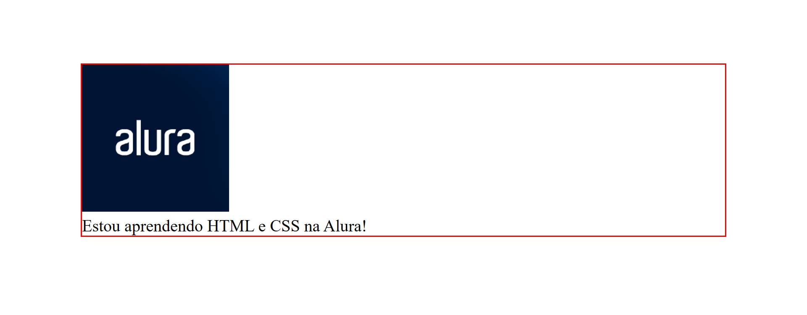
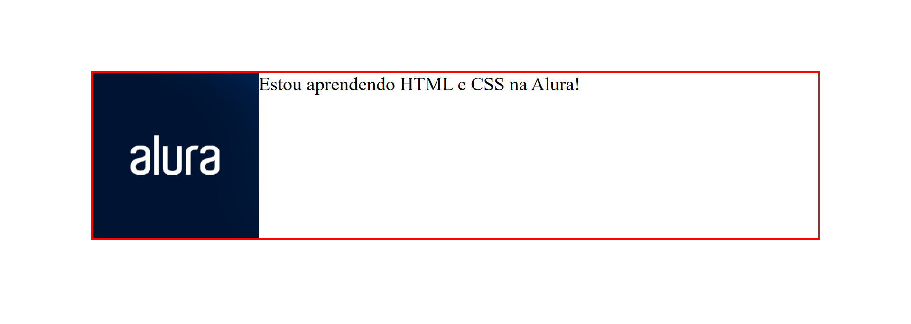

# Curso Alura - HTML e CSS: cabeçalho, footer e variáveis CSS

## Aula 1 - Preparando o layout do projeto

### Aula 1 - Apresentação - Vídeo 1

Transcrição  
Guilherme: Olá! Meu nome é Guilherme Lima.

Rafaella: Eu sou a Rafaella Ballerini.

Guilherme: Neste curso receberemos um projeto para atualizar o que havíamos implementado.

Rafaella: Exatamente. Teremos uma tela com novas funcionalidades, assim como faremos a implementação de uma nova tela.

Guilherme: Refinaremos ainda mais nosso projeto, para que os ícones sejam exibidos ao lado dos nossos links. Além disso, implementaremos um aspecto essencial do projeto: a navegação entre as telas.

Rafaella: Teremos um cabeçalho onde conseguiremos transitar de uma tela para a outra. Além disso, veremos detalhes relacionados ao código, como por exemplo, maneiras de trocar as cores do projeto todo através de um único local do nosso código.

Guilherme: Vamos nessa?

Rafaella: Vamos.

### Aula 1 - Preparando o ambiente

Olá Dev!  
Boas vindas ao curso de HTML e CSS - Desenvolvendo o cabeçalho, footer e variáveis CSS!

Este curso é o terceiro da sequência de HTML e CSS, por isso, caso você não tenha desenvolvido o código dos cursos anteriores, é importante que [baixe o zip do projeto](https://github.com/alura-cursos/Portifolio-HTML-e-CSS-Curso2/archive/refs/heads/aula_5.zip) dos cursos anteriores ou acesse os arquivos no Github antes de iniciarmos.

Aqui vamos aprimorar ainda mais nosso projeto de portfólio, aprenderemos a atualizar nosso código e a implementar a navegação entre telas!

Para que esse refinamento ocorra da melhor forma possível, iremos trabalhar com um layout atualizado, que você pode acessar através [desse Figma](https://www.figma.com/community/file/1410367096860989575).

Além disso, seguiremos utilizando o editor de código [Visual Studio Code](https://code.visualstudio.com/download) como ferramenta de desenvolvimento, que pode ser baixado para Windows, Linux ou Mac.

> Caso tenha dúvidas na instalação ou ao longo do curso, fique à vontade tanto para criar um tópico no fórum como para interagir conosco através do Discord da Alura. E ainda que não tenha dúvidas, você também pode ajudar outras pessoas compartilhando seus aprendizados e projetos por lá e nós vamos adorar acompanhar seu progresso!

### Aula 1 - Figma do projeto atualizado - Vídeo 2

Transcrição  
Guilherme: Iniciaremos um novo desafio: atualizar a nossa aplicação. No mundo real, geralmente desenvolvemos uma tela, assim como fizemos, e de repente precisamos atualizá-la, incluindo novas funcionalidades.

Sistemas de software, páginas Web e aplicações geralmente passam por atualizações.

Rafaella: Principalmente em momentos de alta nas vendas, como na Black Friday. Nestas datas, empresas de e-commerce enviam landing pages para que modifiquemos, adicionando chamadas de desconto. É bem comum recebermos no dia-a-dia pedidos de atualização de projetos.

Guilherme: Traremos acontecimentos do mundo real para esse curso. Não somos um e-commerce, mas temos uma atualização a ser implementada. O nosso projeto evoluirá um pouco mais: ele terá uma nova tela.

Vamos acessar o Figma do nosso projeto em sua nova etapa.

Tela atualizada do projeto no Figma. O fundo é preto. Na parte superior, temos dois textos em negrito na cor ciano: "Home" e "Sobre mim", dispostos na horizontal, da esquerda para a direita. Abaixo deles, temos dois blocos de conteúdo, lado a lado, centralizados. O bloco esquerdo possui um texto que se divide em duas partes: título e parágrafo. O título apresenta um texto em negrito dividido em duas cores: "Eleve seu negócio digital a outro nível" em branco, seguido de "com um Front-end de qualidade!" em ciano. O parágrafo está na cor branca, e exibe o texto de apresentação de Joana Santos. Abaixo do parágrafo temos subtítulo com o texto "Acesse minhas redes:", em negrito. Abaixo dele temos três botões pretos que possuem um contorno na cor ciano, dispostos na vertical: no botão superior temos o texto "Github" e à esquerda um ícone que representa esta aplicação. No botão do meio temos o texto texto "LinkedIn" acompanhado do ícone que representa esta aplicação, à esquerda. No botão inferior temos o texto "Twitch" e à esquerda o ícone representando esta aplicação. Já o bloco direito se constitui de uma fotografia em preto e branco representando Joana Santos, uma mulher desenvolvedora, sentada em frente a um notebook aberto. A fotografia também conta com um desenho em ciano de uma linha circulando Joana e seu notebook três vezes e terminando em uma estrela. Na parte inferior da tela, temos uma barra na cor ciano que se estende do canto esquerdo ao canto direito. Em seu interior há o texto "Desenvolvido por Alura", na cor preta.

Temos botões com ícones em seu interior. O que visualmente chama mais a atenção, Rafa?

Rafaella: Os botões, definitivamente. Também temos o novo subtítulo "Acesse minhas redes", que antes eram completamente ciano. Agora eles possuem apenas uma borda nesta cor. Temos também ícones nos botões.

Guilherme: Estes elementos estão nas cores que estamos utilizando.

Rafaella: Exato.

Guilherme: Agora temos também na parte superior os menus "Home" e "Sobre mim".

Rafaella: Nós já desenvolvemos o `<header>`, agora vamos adicionar em seu interior todas as nossas tags para criar o cabeçalho de fato. Nós o adicionamos e o deixamos vazio somente para entender onde ele deveria ficar.

Guilherme: O mesmo vale para o `<footer>` (ou "rodapé"). Onde está escrito "Desenvolvido por Alura", você pode adicionar seu nome.

Além dessa, temos uma página nova, que será acessada quando clicarmos no menu "Sobre mim".

Tela "Sobre mim" do projeto no Figma. O fundo é preto. Na parte superior, temos dois textos em negrito na cor ciano: "Home" e "Sobre mim", dispostos na horizontal, da esquerda para a direita. Abaixo deles, temos dois blocos de conteúdo, lado a lado, centralizados. O bloco esquerdo possui um texto que se divide em duas partes: título e parágrafo. O título apresenta o texto "Sobre mim" em negrito e na cor branca. Os dois parágrafos estão um abaixo do outro, na cor branca, e exibem um texto "Lorem ipsum". Já o bloco direito se constitui de uma fotografia em preto e branco representando Joana Santos, uma mulher desenvolvedora, sentada em frente a um notebook aberto. A fotografia também conta com um desenho em ciano de uma linha circulando Joana e seu notebook três vezes e terminando em uma estrela. Na parte inferior da tela, temos uma barra na cor ciano que se estende do canto esquerdo ao canto direito. Em seu interior há o texto "Desenvolvido por Alura", na cor preta.

Nela, o cabeçalho e o rodapé continuam iguais. O que muda é o conteúdo principal, do meio da tela. Teremos a chance de criar uma biografia, onde poderemos escrever um pouco sobre nós. Por isso, o texto que incluímos no Figma e no curso é ilustrativo.

Rafaella: É importante salientar que, quando recebemos um design para trabalhar, é comum que haja nele esse tipo de texto chamado Lorem ipsum. Ele serve para nos mostrar como o texto final fica disposto na página, sem precisarmos acessar o texto verdadeiro, o qual às vezes nem foi produzido ainda.

Guilherme: Vamos comparar as duas páginas?

Rafaella: Vamos sim.

Guilherme: Os estilos das duas páginas são parecidos, utilizam os mesmos estilos.

Rafaella: Exatamente, a mudança está nas disposições e nos tamanhos do texto. A foto também é a mesma.

Guilherme: Com base no que já aprendemos, é possível deduzir os estilos de cada trecho: o "Sobre mim" seria um <h1>, e os blocos de biografia seriam dois blocos de parágrafo. Nós nos pegamos pensando se vamos utilizar um Flexbox na horizontal ou na vertical. Isso é muito comum. Com a prática, aos poucos, desenvolvemos esse tipo de percepção e passamos a aplicá-la em todas as páginas que vemos.

A seguir, começaremos a criar esta nova etapa do nosso projeto.

### Aula 1 - Posicionando os links - Vídeo 3

Transcrição  
Guilherme: Já conhecemos o projeto novo. Por onde devemos começar: cabeçalho, rodapé, botões?

Rafaella: Isso é uma escolha de cada pessoa desenvolvedora. No nosso caso podemos começar pelos botões, pois existe uma diferença bem clara entre a etapa anterior e a atual.

Guilherme: A primeira mudança que podemos ver é a presença de um novo subtítulo antes dos links, escrito "Acesse minhas redes:". Vamos adicioná-lo.

Rafaella: Voltando ao VS Code, acessaremos o arquivo index.html. Em seu interior encontraremos a `<div>` que agrega os dois botões que criamos: "Instagram" e "Github". Criamos ela para utilizar o Flexbox e realizar o posicionamento dos dois.

```html
//código omitido
    <main class="apresentacao">
        <section class="apresentacao__conteudo">
//código omitido
           <div class="apresentacao__links">
                <a  class="apresentacao__links__link" href="https://instagram.com/rafaballerini">Instagram</a>
                <a class="apresentacao__links__link" href="https://github.com/guilhermeonrails">Github</a>
            </div>
        </section>
        
    </main>
    <footer></footer>
</body>
</html>
```

Adicionaremos o novo subtítulo dentro dessa `<div>`, pois ela fará parte da divisão. Acima da linha com o botão do Instagram, adicionaremos um `<h2>`. Por que usamos o `<h2>` e não o `<h1>`?

Guilherme: Porque o `<h1>` é o título principal da página.

Rafaella: Isso mesmo. O correto é utilizar somente um `<h1>` por página, para não atrapalharmos a pesquisa dela no Google. Assim, a página será retornada na pesquisa exibindo somente um título.

Entre as tags de fechamento e abertura do `<h2>` adicionaremos o texto "Acesse minhas redes:".

```html
//código omitido
    <main class="apresentacao">
        <section class="apresentacao__conteudo">
//código omitido
            <div class="apresentacao__links">
                <h2>Acesse minhas redes:</h2>
                <a  class="apresentacao__links__link" href="https://instagram.com/rafaballerini">Instagram</a>
                <a class="apresentacao__links__link" href="https://github.com/guilhermeonrails">Github</a>
            </div>
        </section>
        
    </main>
    <footer></footer>
</body>
</html>
```

Guilherme: Acessaremos a nossa página por meio do navegador e veremos que o texto aparece em uma disposição totalmente errada: à esquerda dos botões, e não acima.

Precisamos alterar a forma como dispomos esses elementos.

Rafaella: Exatamente. Eles estão na horizontal porque criamos, dentro de style.css, um .apresentacao__links{} cujo interior possui um justify-content: space-between. Sabemos que quando se cria um display: flex, automaticamente a direção dele será de Row (ou linha). Precisamos alterar a sua direção para Column (ou coluna).

Para isso, acessaremos novamente o arquivo style.css. No interior das chaves de .apresentacao__links{}, abaixo de display: flex adicionaremos um flex-direction: column.

```CSS
.apresentacao__links{
    display: flex;
    flex-direction: column;
    justify-content: space-between;
}
```

Guilherme: Isso mesmo. Queremos que eles fiquem dispostos em coluna, ou seja, na vertical.

Rafaella: Se retornarmos à nossa página aberta no navegador já veremos a alteração. Agora o texto "Acesse minhas redes:" aparece acima dos botões.

Guilherme: Os três elementos (texto e botões) estão grudados. A impressão é de que, além de estarem muito próximos um do outro, estão encostados na borda esquerda do espaço dedicado a eles.

Rafaella: Exatamente. Para centralizar nossos elementos no eixo vertical, podemos utilizar uma outra propriedade do Flexbox, a qual já utilizamos anteriormente: o align-items.

Importante: Anteriormente havíamos utilizado o align-items para centralizar os elementos na vertical, pois o flex-direction estava em Row. Agora que alteramos a direção do Flexbox para Column, os elementos serão alinhados na vertical. Sempre que realizarmos uma alteração no flex-direction, ela se aplicará a todas as propriedades relacionadas.

Por este motivo, utilizaremos a mesma propriedade, mas obteremos um resultado diferente do anterior. Acessaremos novamente o interior das chaves de .apresentacao__links{}, e abaixo de justify-content adicionaremos um align-items: center.

```CSS
.apresentacao__links{
    display: flex;
    flex-direction: column;
    justify-content: space-between;
    align-items: center;
}
```

Guilherme: Se abrirmos o Figma, temos um espaço entre cada elemento. Podemos adicioná-lo com o gap.

Rafaella: Se clicarmos no subtítulo e arrastarmos o mouse para o primeiro botão, o Figma nos mostrará a distância exata entre cada elemento: 32px.

Guilherme: Podemos dizer que queremos um espaço de 32px entre cada uma das redes.

Rafaella: Exato. Já havíamos conhecido a propriedade gap, a qual deve ser inserida em nossa tag contêiner. Para configurar esse espaçamento vamos adicionar um gap: 32px abaixo de align-items: center.

```CSS
.apresentacao__links{
    display: flex;
    flex-direction: column;
    justify-content: space-between;
    align-items: center;
    gap: 32px;
}
```

Salvaremos nosso código e retornaremos à página aberta no navegador. Nela, tanto o texto "Acesse minhas redes:" quanto os botões aparecem centralizados verticalmente, com um espaçamento entre cada um deles.

Guilherme: Nossa página está cada vez mais parecida com o projeto principal. Se abrirmos o Figma, veremos que os botões possuem a mesma cor do fundo da página, possuem uma imagem ao lado do texto e parece que o tamanho do botão também é diferente.

Rafaella: Exatamente.

Guilherme: A seguir, vamos implementar essas mudanças.

### Aula 1 - Alinhando com display flex

Aprendemos que podemos utilizar o display: flex para posicionar elementos na tela, observando seu comportamento padrão. Dito isso, observe o código HTML a seguir, no qual o elemento pai container contém quatro divs e cada uma será um quadrado na tela:

```html
    <body>
        <div class="container">
            <div class="quadrado"></div>
            <div class="quadrado"></div>
            <div class="quadrado"></div>
            <div class="quadrado"></div>
        </div>
    </body>
```

Já no CSS, o elemento pai foi estilizado da seguinte maneira:

```CSS
.container {
margin: 20%;/* adiciona uma margem para centralizar os quadrados na tela*/
display: flex;/* coloca os quadrados lado a lado */
gap: 10px;/* adiciona espaços iguais entre cada quadrado */
}
```

Esses códigos exibem o seguinte resultado na tela:

Tela com fundo branco com quatro quadrados azuis alinhados ao centro da tela e horizontalmente dispostos lado a lado com espaços iguais entre si

Imagine que você deseja alinhar esses quadrados verticalmente, um embaixo do outro, porém mesmo adicionando o display: flex ainda não obteve esse resultado.

Como você pode organizar os quadrados verticalmente?

Resposta:  
Podemos adicionar a propriedade flex-direction: column ao CSS da classe .container.

> Ao adicionarmos a propriedade flex-direction: column os quadrados irão se posicionar verticalmente, já que define que a direção do display: flex deve ser em “coluna”.

### Aula 1 - Estilizando os links - Vídeo 4

Transcrição  
Rafaella: Conseguimos posicionar nossos links corretamente. O subtítulo ainda possui fonte e tamanho errados, portanto vamos estilizá-lo.

Guilherme: Vamos.

Rafaella: Retornaremos ao VS Code e acessaremos o arquivo index.html, onde criaremos uma classe para o subtítulo. Acessaremos a tag de abertura do nosso <h2>, entre os sinais de menor e de maior, e adicionaremos uma class="". Qual será o nome dessa classe?

Guilherme: Considerando o padrão seguido, pode ser apresentacao__links__subtitulo?

Rafaella: Pode ser. Adicionaremos este nome entre as aspas e salvaremos nosso código.

```html
<!-- código omitido -->
    <main class="apresentacao">
                    <section class="apresentacao__conteudo">
            <div class="apresentacao__links">
                <h2 class="apresentacao__links__subtitulo">Acesse minhas redes:</h2>
                <a  class="apresentacao__links__link" href="https://instagram.com/rafaballerini">Instagram</a>
                <a class="apresentacao__links__link" href="https://github.com/guilhermeonrails">Github</a>
            </div>
        </section>
        
    </main>
    <footer></footer>
</body>
</html>
```

Copiaremos o nome da classe e acessaremos o arquivo style.css.

Devemos sempre escrever o CSS na ordem em que utilizamos as *tags no HTML*. Portanto, adicionaremos a nova classe .apresentacao__links__subtitulo{} acima de .apresentacao__links__link{}.

```CSS
.apresentacao__links__subtitulo{

}

.apresentacao__links__link{
    //código omitido
}
```

Iniciaremos a nossa estilização.

Guilherme: O primeiro detalhe a ser alterado será a fonte do subtítulo.

Rafaella: Se acessarmos o Figma e clicarmos neste elemento, descobriremos na aba "Design" o nome da fonte: Krona One. Já utilizamos esta fonte anteriormente, portanto já temos a sua importação no projeto. Basta que a chamemos.

Guilherme: Para chamá-la, adicionaremos entre as chaves de .apresentacao__links__subtitulo{} um font-family:'Krona One', 'sans-serif'. Temos que modificar também o peso e o tamanho dessa fonte.

Rafaella: Exato. Se acessarmos o Figma e clicarmos no subtítulo, descobriremos na aba "Inspect" o font-weight (ou "peso da fonte"): 400. Na mesma aba veremos o Size (ou "tamanho") de 24px.

Voltaremos ao VS Code e traremos estas configurações adicionando abaixo de font-family um font-weight: 400. Abaixo de font-weight, por sua vez, adicionaremos um font-size: 24px.

```CSS
.apresentacao__links__subtitulo{
    font-family:'Krona One', 'sans-serif';
    font-weight: 400;
    font-size: 24px;
}
```

Guilherme: O sans-serif é uma propriedade, portanto não precisamos adicioná-lo entre aspas simples. Vamos retirá-las.

```CSS
.apresentacao__links__subtitulo{
    font-family:'Krona One', sans-serif;
    font-weight: 400;
    font-size: 24px;
}
```

Rafaella: Salvaremos o código e retornaremos à página aberta pelo navegador. Nela, temos o subtítulo com a fonte, tamanho e peso desejados. Em seguida, estilizaremos os botões em si, trocando o fundo ciano por bordas nessa cor.

Retornaremos ao arquivo style.css pelo VS Code e buscaremos a classe .apresentacao__links__link{}. Entre suas chaves, alteraremos os seguintes elementos:

- removeremos o fundo ciano, deletando o comando background-color: #22D4FD;
- mudaremos a cor dos textos, modificando o valor de color de #000000 (preto) para #F6F6F6 (branco);
- adicionaremos a borda 2px solid (borda sólida com 2px de espessura), na cor #22D4FD (ciano);

Os valores de cor do texto e de borda encontraremos no Figma. Com a seleção ativa nestes elementos, veremos na aba "Inspect" os campos color: #F6F6F6 e border: 2px solid #22D4FD, respectivamente. Basta copiar os valores destes campos.

Dica: Se você gostou da configuração anterior, é possível comentar estes trechos de código em vez de excluí-los. Os trechos de código que comentamos não são lidos pelo sistema. No Visual Studio Code, o atalho para comentar uma linha de código é "Ctrl + K + C". Após ativá-lo, o VS Code adicionará os comando /* e */ no início e no final da linha, respectivamente.

Vamos comentar um trecho do código como exemplo: /* background-color: #22D4FD; */.

```CSS
.apresentacao__links__link{
    /* background-color: #22D4FD; */
    border: 2px solid #22D4FD;
    width: 280px;
    text-align: center;
    border-radius: 16px;
    font-size: 24px;
    font-weight: 600;
    padding: 21.5px 0;
    text-decoration: none;
    color: #F6F6F6;
    font-family: 'Montserrat', sans-serif;
}
```

Salvaremos o código e retornaremos à página aberta pelo navegador. Nela, temos os dois botões na cor preta, com bordas ciano e seus respectivos textos na cor branca. Ficou do jeito que queríamos.

Guilherme: Vamos entender o código: na propriedade border, o primeiro valor informa a espessura da borda.

Rafaella: O segundo valor informa o tipo de tracejado. Neste caso é sólido. Se acessarmos a página do W3Schools sobre bordas do CSS, veremos na seção "CSS Border Style" (ou "estilo de borda CSS") vários opções de estilização de borda disponíveis.

Guilherme: O próprio CSS possui configurações nativas. Existem muitas propriedades pré-definidas, e cabe a nós explorarmos e aprendermos sobre elas.

Rafaella: Imagine receber um Figma com bordas pontilhadas, por exemplo. Se não houvesse a propriedade border, seria muito difícil configurar algo assim.

Voltaremos ao VS Code para entender o último valor de border: a cor. Como vimos anteriormente, se trata de um valor hexadecimal que traz a cor escolhida.

Acessaremos o Figma e veremos que a largura do botão também mudou, está maior. Clicaremos neste elemento e buscaremos na aba Inspect o valor de sua width: 378px. Copiaremos este valor e voltaremos ao VS Code. Em .apresentacao__links__link{} substituiremos o valor da width de 280px para 378px.

A forma do botão também mudou. Antes, tínhamos cantos arredondados, e agora eles estão mais retos. Buscaremos e copiaremos no Figma o valor de Radius da borda: 8px. Ainda em .apresentacao__links__link{} substituiremos o valor da border-radius de 16px para 8px.

```CSS
.apresentacao__links__link{
    /* background-color: #22D4FD; */
    border: 2px solid #22D4FD;
    width: 378px;
    text-align: center;
    border-radius: 8px;
    font-size: 24px;
    font-weight: 600;
    padding: 21.5px 0;
    text-decoration: none;
    color: #F6F6F6;
    font-family: 'Montserrat', sans-serif;
}
```

Salvaremos o código e veremos as alterações no navegador, onde temos os dois botões mais largos e com bordas menos redondas.

Guilherme: Os ícones dos botões estão fazendo falta. A seguir, vamos adicioná-los.

### Aula 1 - Para saber mais: border e comentário nos códigos

Durante a aula, personalizamos a propriedade CSS chamada border, para adicionar a borda em volta dos botões. Essa propriedade pode ser usada para definir os valores de largura da borda, estilo da borda e cor da borda e possui alguns estilos diferentes, como o “dotted”, que conhecemos na aula [através da documentação](https://www.w3schools.com/css/css_border.asp).

Caso você queira conhecer melhor essa propriedade, que tal dar uma olhada no artigo [CSS Border: estilizando com bordas seus elementos CSS](https://www.alura.com.br/artigos/css-border-estilizando-bordas-elementos-css) e no [Alura+](https://cursos.alura.com.br/extra/alura-mais/css-border-estilizando-com-bordas-seus-elementos-css-c1486) de mesmo nome feitos pelo instrutor Luan Alves.

O que são comentários?  
Comentários são notas de texto que podem ser inseridas ao longo do desenvolvimento e que serão ignoradas pelo código, portanto não interferem em seu funcionamento.

Para que servem os comentários  
Os comentários podem ser usados para anotar informações importantes sobre o código, para salvar códigos que estivermos testando sem que haja necessidade de apagar e reescrever, para descrever alguma função específica e facilitar manutenções futuras ou até para auxiliar na organização das ideias de construção do código.

Como comentar em HTML e CSS  
O uso de comentários é comum em diversas linguagens e cada uma terá sua sintaxe particular. Isso também acontece em HTML e CSS, já que em cada uma temos uma maneira de adicionar comentários, que vamos conhecer a seguir:

HTML  
Os comentários no HTML se assemelham com uma abertura de tag. Abrimos um comentário com <!-- e fazemos seu fechamento com -->. Tudo que estiver entre esses dois marcadores será considerado como comentário, inclusive quebras de linha:

```html
<p> Isso é um parágrafo de texto e será exibido pelo navegador </p>

<!-- Isso é um comentário e será ignorado  -->

<!-- Isso é um comentário com quebra de linha

e também será ignorado  -->

<p> Isso é um parágrafo de texto e será exibido pelo navegador </p>
```

CSS
Os comentários em CSS também possuem abertura e fechamento. Abrimos esse tipo de comentário com /* e fechamos com */ e assim como no HTML, tudo que estiver entre essas marcações será considerado comentário, ainda que esteja entre mais de uma linha:

```CSS
body{
    background-color: white; 
    /* Isso é um comentário em CSS */
    /* 
        Isso é um comentário em CSS com
        quebra de linha
    */
}
```

Boas práticas ao comentar  
Os comentários podem ser muito úteis para facilitar o desenvolvimento, no entanto, precisamos ter atenção a algumas boas práticas para fazer seu uso adequado:

- Evite adicionar muitos comentários para não gerar uma “bagunça” em seu código;
- Evite criar comentários muito longos. Tenha em mente que apesar de não serem executados, esses comentários ocupam espaço e podem deixar seu arquivo mais pesado;
- Use os comentários a seu favor, ou seja, anote informações essenciais neles, pois isso irá facilitar com que você encontre aquilo que é realmente necessário lembrar no momento de fazer manutenções em seu código;
- Ao usar comentários para testar sua aplicação, lembre-se de apagar essas notas quando terminar, para que seu código não fique desorganizado e com partes desnecessárias;
- Por fim, lembre-se sempre que um código descritivo é mais duradouro que muitos comentários. Quando estiver trabalhando com HTML, lembre-se de usar as [Tags semânticas](https://developer.mozilla.org/pt-BR/docs/Glossary/Semantics) e ao criar suas classes CSS, adicione nomes significativos. Assim, seu código ficará naturalmente descritivo e não dependerá tanto dos comentários, que podem ser apagados ou se perderem ao longo de manutenções =) .

### Aula 1 - Lista de exercícios

O que é:  
Boas-vindas à nossa lista de exercícios "Mão na massa", um caminho prático e envolvente para aprender e aprimorar suas habilidades em tecnologia. Aqui, você não encontrará longas leituras teóricas ou explicações abstratas. Em vez disso, nossos exercícios são projetados para colocar você no centro do processo de aprendizado, permitindo que você construa, experimente e explore conceitos tecnológicos de forma direta e aplicada.

Para que serve:  
Esta lista é uma ferramenta dinâmica para aprender, reforçar e aprimorar habilidades práticas em programação e desenvolvimento web. Cada exercício é uma oportunidade de aplicar conhecimentos teóricos em cenários reais, preparando você não apenas para entender a tecnologia, mas para utilizá-la de maneira eficaz e criativa em seus próprios projetos ou no ambiente de trabalho.

Como fazer:

- Leia cada exercício com atenção: comece entendendo o cenário proposto e o que se espera como resultado.
- Escreva o código: utilize o ambiente de codificação de sua escolha para escrever e testar o seu código. Não se preocupe em acertar de primeira, a prática leva à perfeição.
- Verifique o gabarito: após tentar resolver o exercício, compare seu código com o gabarito fornecido em “Opinião do instrutor”. Isso ajudará a identificar áreas de melhoria e consolidar o aprendizado.
- Repita: a repetição é chave para o aprendizado. Tente fazer os exercícios mais de uma vez, aplicando melhorias e variantes.
- Lembre-se, cada desafio é uma chance de crescer. Não se desanime com os erros; eles são degraus no caminho do aprendizado. E acima de tudo, divirta-se! O aprendizado mais eficaz acontece quando nos engajamos e nos interessamos pelo que estamos fazendo.

Não se esqueça que estamos no Fórum e no Discord para te ajudar!

Bons estudos!

1) Adicionando um subtítulo à página  
Imagine que você está desenvolvendo uma página web para compartilhar suas redes sociais. Você precisa adicionar um subtítulo "Acesse minhas redes:" acima dos links para Instagram e Github. Sua tarefa é editar o arquivo index.html para incluir esse subtítulo. Lembre-se de usar a tag `<h2>` para o subtítulo e colocá-lo dentro da `<div>` que já contém os links.

2) Alterando a disposição dos elementos com Flexbox  
Agora que o subtítulo foi adicionado, você percebe que ele está alinhado à esquerda dos botões, ao invés de acima deles. Isso aconteceu porque os elementos estão dispostos horizontalmente. Sua missão é alterar a disposição dos elementos (subtítulo e botões) para uma disposição vertical. Edite o arquivo style.css, modificando a propriedade flex-direction para column dentro da classe .apresentacao__links. Isso mudará a direção do Flexbox, alinhando os elementos verticalmente.

3) Ajustando o alinhamento e o espaçamento dos elementos  
Após modificar a direção do Flexbox, você observa que os elementos (texto e botões) estão muito próximos uns dos outros e alinhados à esquerda. Para melhorar a estética da página, você precisa centralizar esses elementos verticalmente e adicionar um espaçamento entre eles. No arquivo style.css, dentro da classe .apresentacao__links, adicione a propriedade align-items: center para centralizar os elementos. Em seguida, insira a propriedade gap com o valor de 32px para adicionar o espaçamento entre cada elemento.

4) Criando uma classe para o subtítulo  
Você está desenvolvendo uma página web e decidiu que o subtítulo "Acesse minhas redes:" precisa de uma estilização específica. Para isso, você vai criar uma classe CSS para este subtítulo. No arquivo index.html, encontre a tag `<h2>` que contém o subtítulo e adicione uma classe chamada apresentacao__links__subtitulo. Sua tarefa é inserir essa classe na tag `<h2>` de forma correta.

5) Estilizando o subtítulo  
Agora que você criou uma classe para o subtítulo, é hora de estilizá-lo. No arquivo style.css, adicione a classe .apresentacao__links__subtitulo e configure as propriedades de estilo. Utilize a fonte 'Krona One', com um peso de fonte (font-weight) de 400 e um tamanho de fonte (font-size) de 24px. Ajuste a fonte para ser 'sans-serif' sem aspas. Sua tarefa é escrever o código CSS para aplicar essas configurações ao subtítulo.

6) Modificando o estilo dos botões  
Os botões da sua página precisam de um novo visual. No arquivo style.css, encontre a classe .apresentacao__links__link e faça as seguintes alterações: remova o fundo ciano, mude a cor do texto para branco (#F6F6F6), adicione uma borda sólida de 2px na cor ciano (#22D4FD), altere a largura para 378px, e ajuste o border-radius para 8px. Sua tarefa é alterar o código CSS para refletir estas mudanças, criando botões com bordas ciano, texto branco, e cantos menos arredondados.

Opinião do instrutor

1) Adicionando um subtítulo à página

- Abra o arquivo index.html.
- Localize a `<div class="apresentacao__links">`.
- Acima da linha do primeiro link, adicione a tag `<h2>` com o texto "Acesse minhas redes:". Seu código deve ficar assim:

```html
<div class="apresentacao__links">
    <h2>Acesse minhas redes:</h2>
    <a class="apresentacao__links__link" href="https://instagram.com/rafaballerini">Instagram</a>
    <a class="apresentacao__links__link" href="https://github.com/guilhermeonrails">Github</a>
</div>
```

2) Alterando a disposição dos elementos com Flexbox

- Abra o arquivo style.css.
- Encontre a classe .apresentacao__links.
- Adicione a propriedade flex-direction: column; para mudar a disposição dos elementos para vertical. O código ficará:

```CSS
.apresentacao__links {
    display: flex;
    flex-direction: column;
    justify-content: space-between;
}
```

3) Ajustando o alinhamento e o espaçamento dos elementos

- Continuando no arquivo style.css, dentro da classe .apresentacao__links:
- Adicione align-items: center; para centralizar os elementos verticalmente.
- Insira gap: 32px; para criar um espaçamento de 32px entre cada elemento. O código final será:

```CSS
.apresentacao__links {
    display: flex;
    flex-direction: column;
    justify-content: space-between;
    align-items: center;
    gap: 32px;
}
```

4) Criando uma classe para o subtítulo

- Abra o arquivo index.html.
- Localize a tag `<h2>` que contém o texto "Acesse minhas redes:".
- Adicione a classe apresentacao__links__subtitulo à tag `<h2>`. O trecho de código deve ficar assim: `<h2 class="apresentacao__links__subtitulo">Acesse minhas redes:</h2>`

5) Estilizando o subtítulo

- Abra o arquivo style.css.
- Adicione a classe .apresentacao__links__subtitulo no início do arquivo.
- Configure as propriedades da classe da seguinte forma:

```CSS
.apresentacao__links__subtitulo {
    font-family: 'Krona One', sans-serif;
    font-weight: 400;
    font-size: 24px;
}
```

6) Modificando o estilo dos botões

- Ainda no arquivo style.css, encontre a classe .apresentacao__links__link.
- Faça as seguintes modificações na classe:

```CSS
.apresentacao__links__link {
    /* background-color: #22D4FD; */ /* Código comentado */
    border: 2px solid #22D4FD;
    color: #F6F6F6;
    width: 378px;
    border-radius: 8px;
    /* Outras propriedades existentes permanecem inalteradas */
}
```

Salve o arquivo e visualize as mudanças no navegador.

## Aula 2 - Criando icones Clicáveis

### Aula 2 - Projeto da aula anterior

Aqui você pode [baixar os arquivos da aula 01](https://github.com/alura-cursos/Portifolio-HTML-e-CSS-Curso3/archive/refs/heads/aula_1.zip) ou acessar os [arquivos no Github!](https://github.com/alura-cursos/Portifolio-HTML-e-CSS-Curso3/tree/aula_1)

### Aula 2 - Preparando o ambiente

Nas próximas aulas iremos adicionar ícones ao nosso projeto. Para baixar a pasta com as imagens que usaremos para criar esses ícones, basta [clicar aqui](https://github.com/alura-cursos/Assets-aula2-curso3-html-e-css/archive/refs/heads/main.zip) ou acessar os [arquivos no Github!](https://github.com/alura-cursos/Assets-aula2-curso3-html-e-css) =)

### Aula 2 - Ícones das redes sociais - Vídeo 1

Transcrição  
Guilherme: Vamos inserir os ícones em nossos links. Em nosso código, temos links de duas redes: o Instagram e o Github.

Rafaella: Isso. Já no Figma, temos três: Github, LinkedIn e Twitch. Vamos atualizar com base no Figma. Contudo, você pode atualizar com as suas próprias redes!

Voltando ao VS Code, acessaremos novamente o arquivo index.html para trazer as imagens dos ícones, considerando que já sabemos como criar a tag ``.

Primeiro, vamos realizar os passos abaixo:

- deletar a tag `<a>` correspondente ao Github;
- alterar o texto do primeiro `<a>`, de "Instagram" para "Github", substituindo o endereço do Instagram por um endereço de Github;
- separar a tag de abertura `<a>`, o texto "Github" e a tag de fechamento `</a>`, pressionando "Enter" entre elas, deixando uma linha vazia acima do texto.
- Nesta linha vazia adicionaremos a tag ``.

```html
//código omitido
    <main class="apresentacao">
        <section class="apresentacao__conteudo">
//código omitido
            <div class="apresentacao__links">
                <h2 class="apresentacao__links__subtitulo">Acesse minhas redes:</h2>
                <a  class="apresentacao__links__link" href="https://github.com/rafaballerini">
                    
                    Github
                </a>
            </div>
        </section>
        
    </main>
    <footer></footer>
</body>
</html>
```

O que faremos para trazer a nossa imagem?

Guilherme: Precisamos especificar o local em que essa imagem está. Já fizemos o download de todas as imagens com os ícones das redes que precisamos.

Rafaella: Inclusive de alguns que não utilizaremos no projeto, mas que disponibilizamos para que sejam utilizados.

Guilherme: Acessaremos o explorador do nosso sistema operacional. Abriremos a pasta onde se encontram as imagens, e em seguida vamos selecioná-las e arrastá-las para o explorador do VS Code. Neste momento, todas as imagens serão coladas no projeto e ficarão dispostas aleatoriamente entre os arquivos.

Como boa prática, criaremos uma pasta para isolar todas as imagens do restante dos arquivos.

Rafaella: No topo do explorador, clicaremos no ícone de pasta denominado "New Folder" (ou "Novo Arquivo"). No campo de texto que será aberto, digitaremos o nome da nova pasta. Vamos nomeá-la "assets" pois é um nome muito utilizado nos projetos reais.

Pelo explorador, arrastaremos cada uma das imagens para dentro da pasta "assets".

Observação: A imagem que já havíamos utilizado, denominada imagem.png, será realocada. Portanto, precisamos informar no código o novo local em que ela se encontra. Para isso, acessaremos a linha dessa `` e substituiremos dentro de src o local antigo ("imagem.png") pelo local novo: "./assets/imagem.png".

```html
//código omitido
        </section>
        
    </main>
    <footer></footer>
</body>
</html>
```

Guilherme: Informaremos o caminho da imagem que vamos inserir — ou seja, o ícone do Github. Voltaremos à nova tag `` e antes do sinal de menor adicionaremos um src="", o qual possuirá entre as aspas duplas o endereço ./assets/github.png.

```html
//código omitido
    <main class="apresentacao">
        <section class="apresentacao__conteudo">

//código omitido

            <div class="apresentacao__links">
                <h2 class="apresentacao__links__subtitulo">Acesse minhas redes:</h2>
                <a  class="apresentacao__links__link" href="https://github.com/rafaballerini">
                
                Github
                </a>
            </div>
        </section>
        
    </main>
    <footer></footer>
</body>
</html>
```

Rafaella: Para adicionar os outros ícones e botões, copiaremos a estrutura da tag `<a>` e colaremos duas vezes, uma embaixo da outra, já que utilizaremos a mesma classe, apresentacao__links__link, para as três.

Em seguida modificaremos o conteúdo de href, de src e do texto para que correspondam à cada rede social: acima o Github, no meio o LinkedIn, e embaixo a Twitch.

Atenção ao endereço de cada rede social, pois elas possuem padrões diferentes. Por exemplo, o endereço base do LinkedIn é "linkedin.com/in/nome-da-pessoa".

```html
//código omitido
    <main class="apresentacao">
        <section class="apresentacao__conteudo">

//código omitido

            <div class="apresentacao__links">
                <h2 class="apresentacao__links__subtitulo">Acesse minhas redes:</h2>
                <a  class="apresentacao__links__link" href="https://github.com/rafaballerini">
                    
                    Github
                </a>
                <a  class="apresentacao__links__link" href="https://linkedin.com/in/rafaellaballerini">
                    
                    LinkedIn
                </a>
                <a  class="apresentacao__links__link" href="https://twitch.tv/guilimadev">
                    
                    Twitch
                </a>
            </div>
        </section>
        
    </main>
    <footer></footer>
</body>
</html>
```

Salvaremos o nosso código e retornaremos ao navegador, onde veremos nossa página com os três botões, "Github", "LinkedIn" e "Twitch", com seus respectivos ícones à esquerda. Entretanto, eles estão desalinhados em relação ao texto (alguns para cima, outros para baixo). Precisamos modificar a estilização de posicionamento dos nossos dois elementos que estão dentro de cada botão.

Guilherme: Faremos isso na sequência.

### Aula 2 - Buscando arquivos em pastas

Aprendemos que uma prática comum no desenvolvimento com HTML e CSS é criar uma pasta assets para inserir todas as imagens do projeto. No entanto, quando buscamos alguma imagem através da tag img no HTML, precisamos nos atentar ao caminho desse arquivo que está dentro de pastas. Com isso em mente, observe a organização das pastas do projeto à seguir:

Aba de pastas do editor de código, na parte superior esquerda há o nome da pasta de projeto aberto, que é “meu-projeto”. Dentro dessa pasta há um arquivo “index.html” e um arquivo “style.css”, além de uma pasta “assets”, que contém um arquivo chamado “montanha.png”.

Você precisa que o arquivo montanha.png, localizado dentro da pasta assets do projeto, seja exibido em uma página (com HTML). Logo, você escreve o código à seguir:

```html
<div class="container">

</div>
```

Como a imagem será exibida na página?

Alternativa correta:  
A imagem será quebrada e será exibido apenas o texto alternativo, já que o link da imagem em src está incorreto.

> O HTML não irá encontrar a imagem, pois o link em src deveria considerar que a imagem está dentro de uma pasta. Portanto, o link correto deveria ser ./assets/montanha.png. Devemos sempre estar atentos à organização das pastas quando queremos buscar um arquivo através de seu caminho.

### Aula 2 - Posicionando os ícones - Vídeo 2

Transcrição
Rafaella: Alinharemos os ícones junto a seus respectivos textos dentro dos botões de redes sociais. Consegue imaginar como faremos isso?

Guilherme: Teremos que alterar o alinhamento e disposição de todos os elementos localizados dentro da tag `<a>`.

Rafaella: Por que justamente na tag `<a>`?

Guilherme: Porque precisamos alinhar tanto a imagem quanto o texto.

Rafaella: Exatamente. São os dois elementos filhos dessa tag. Normalmente, no Flexbox, alteramos o contêiner com as propriedades que costumamos usar. Também existem propriedades para os elementos filhos.

Acessaremos o arquivo style.css, no qual encontraremos a tag `<a>`. Faremos isso através da busca pela classe dela: .apresentacao__links__link{}. Qual propriedade usaremos para iniciar o Flexbox?

Guilherme: Para garantir que os elementos tenham uma disposição diferente através do Flexbox, utilizamos o display: flex.

Rafaella: Perfeito. Vamos inserir o display: flex junto ao seu ponto e vírgula. Essa inserção será feita entre os códigos background-color e border.

```CSS
.apresentacao__links__link {
    /* background-color: #22D4FD; */
    display: flex;
    border: 2px solid #22D4FD;
    width: 378px;
    text-align: center;
    border-radius: 8px;
    font-size: 24px;
    font-weight: 600;
    padding: 21.5px 0;
    text-decoration: none;
    color: #F6F6F6;
    font-family: 'Montserrat', sans-serif;
}
```

Guilherme: Se consultarmos nossa página por meio do navegador, veremos que tanto os ícones quanto os textos foram movidos para o canto esquerdo do botão.

Rafaella: Sim, pois este é o padrão do Flexbox.

Guilherme: Agora precisamos alterar o alinhamento, informando aos elementos do botão que eles devem ser centralizados.

Rafaella: Para isso, utilizaremos qual propriedade?

Guilherme: O justify-content.

Rafaella: Isso mesmo. Consultaremos a página do Flexbox Guide (ou "Guia do Flexbox") conforme já fizemos anteriormente. Nela vamos até a seção "justify-content", onde encontraremos o valor que devemos utilizar dentro da propriedade justify-content para que o nosso conteúdo fique centralizado no eixo horizontal: center.

Vamos lembrar que, no Flexbox, a direção padrão é Row (ou seja, já é horizontal). Portanto, basta que adicionemos ao CSS dos nossos botões o comando justify-content: center. Essa adição será feita entre os códigos display e border.

```CSS
.apresentacao__links__link {
    /* background-color: #22D4FD; */
    display: flex;
    justify-content: center;
    border: 2px solid #22D4FD;
    width: 378px;
    text-align: center;
    border-radius: 8px;
    font-size: 24px;
    font-weight: 600;
    padding: 21.5px 0;
    text-decoration: none;
    color: #F6F6F6;
    font-family: 'Montserrat', sans-serif;
}
```

Guilherme: Temos outro problema: o ícone e o texto estão grudados. Se consultarmos o Figma, veremos que existe um pequeno espaço entre eles.

Rafaella: Sim. Acessaremos o Figma do projeto e clicaremos em um dos ícones de botão. Em seguida, direcionaremos o cursor para o texto à sua direita. O número que aparece em laranja é o valor do espaçamento em px entre o ícone e o texto. Neste caso, o valor é 16. Utilizaremos este valor em uma propriedade específica. Qual seria ela?

Guilherme: Para adicionar espaço entre todos os elementos, usaremos o gap.

Rafaella: Perfeito. Retornaremos ao arquivo CSS onde, abaixo da propriedade justify-content, adicionaremos um gap: 16px.

```CSS
.apresentacao__links__link {
    /* background-color: #22D4FD; */
    display: flex;
    justify-content: center;
    gap: 16px;
    border: 2px solid #22D4FD;
    width: 378px;
    text-align: center;
    border-radius: 8px;
    font-size: 24px;
    font-weight: 600;
    padding: 21.5px 0;
    text-decoration: none;
    color: #F6F6F6;
    font-family: 'Montserrat', sans-serif;
}
```

Salvaremos nosso código e voltaremos à nossa página aberta pelo navegador. Veremos que os ícones e textos estão agora centralizados no interior do botão, separados por um pequeno espaço entre eles.

### Aula 2 - Posicionando com Flexbox

Você cria um projeto HTML com uma imagem e um parágrafo de texto, que estão dentro de uma section, como podemos observar no código a seguir:

```html
<section>
    
    <p>Estou aprendendo HTML e CSS na Alura!</p>
</section>  
```

Logo, você cria um arquivo CSS para essa página, onde estiliza alguns detalhes de acordo com sua preferência e adiciona um display: flex para posicionar os elementos lado a lado, da seguinte forma:

```CSS
section{
    border-style: solid;    /* Cria uma borda sólida */
    border-color:red;   /* Colore a borda com a cor vermelha */
    margin: 10%;    /* Adiciona uma margem ao redor da section */
    display: flex;  /* Adiciona o display flex */
}
```

Com o display: flex, os elementos que antes ficavam um embaixo do outro como nessa imagem:  


Tela com fundo branco e um retângulo com uma borda fina em vermelho e área interna com fundo branco. Dentro do retângulo, no canto esquerdo encostado na borda há uma imagem que é um quadrado em azul escuro com o texto “Alura” escrito na cor branca no centro do quadrado. Abaixo da imagem, também encostado na borda esquerda do retângulo há o texto “Estou aprendendo HTML e CSS na Alura!” escrito na cor preta

Se posicionam lado a lado na tela, como está representado na imagem abaixo:  


Tela com fundo branco e um retângulo com uma borda fina em vermelho e área interna com fundo branco. Dentro do retângulo, no canto esquerdo encostado na borda há uma imagem que é um quadrado em azul escuro com o texto “Alura” escrito na cor branca no centro do quadrado. Do lado direito da imagem, encostado na borda superior do retângulo há o texto “Estou aprendendo HTML e CSS na Alura!” escrito na cor preta

Observe que mesmo aplicando o display: flex em seu elemento pai (section), todos os elementos filhos (imagem e parágrafo) continuaram deslocados para o canto esquerdo da section.

O que podemos fazer para que a imagem e o parágrafo se desloquem para o centro dentro dessa section ?

Alternativa correta:  
Podemos adicionar a propriedade justify-content: space-around ao CSS da section.

> A propriedade justify-content controla o posicionamento dos elementos filhos ao longo do eixo principal e também ajuda a distribuir o espaço livre entre eles. Com o valor space-around, os itens serão distribuídos cada um com um espaço ao seu redor.

Alternativa correta:  
Podemos adicionar a propriedade justify-content: center ao CSS da section.

> A propriedade justify-content controla o posicionamento dos elementos filhos ao longo do eixo principal e também ajuda a distribuir o espaço livre entre eles. Com o valor center, os elementos serão centralizados em seu elemento pai, mas sem espaços entre si.

Alternativa correta:  
Podemos adicionar a propriedade justify-content: space-evenly ao CSS da section.

> A propriedade justify-content controla o posicionamento dos elementos filhos ao longo do eixo principal e também ajuda a distribuir o espaço livre entre eles. Com o valor space-evenly, os itens são distribuídos com espaços iguais entre si e até as bordas. Como temos apenas 2 elementos, eles ficarão centralizados.

### Aula 2 - Hover - Vídeo 3

Transcrição  
Rafaella: Conseguimos aproximar nosso código do Figma. No entanto, existe um detalhe que não é possível visualizar no Figma: uma espécie de animação. Quando passamos o mouse por cima do explorador lateral do Figma, cada menu perpassado ganha um destaque por meio de uma borda azul. Chamamos este efeito de Hover.

Vamos aplicá-lo em nossa página de portfólio, de modo que quando passamos o cursor por cima dos botões, eles serão destacados em outra cor.

Guilherme: É possível notar outro detalhe: quando o cursor passa pela tela da nossa página, ele se torna uma seta. Já quando o passamos por cima de um botão, ele se torna uma mão com o indicador levantado.

Rafaella: Exatamente. Isso é feito automaticamente pela âncora, quando utilizamos essa tag. Contudo, também é possível estilizar esse pointer, ou cursor. Por ora, focaremos no Hover.

Guilherme: A ideia consiste em ativar um recurso visual quando o cursor acessar a área do nosso elemento clicável.

Rafaella: Exatamente. Os designers disponibilizaram dentro do Figma, abaixo da nossa página, dois ícones de botão soltos: um representando o seu estado normal, e outro representando a borda destacada do Hover, preenchida na cor 272727. Essa cor consiste na cor de fundo original, em um tom levemente mais claro. Esta será a cor que veremos quando o cursor passar por cima do botão.

Veremos como esse processo funciona acessando a documentação do Hover no site W3Schools. Dentro da subseção "Example", veremos o exemplo de utilização abaixo.

```CSS
a:hover {
    background-color: yellow;
}
```

Acima deste exemplo temos uma frase indicando que, com este comando, seremos capazes de selecionar e estilizar o link quando o mouse estiver por cima dele.

No exemplo, utilizamos a tag âncora a seguida de :hover.

Guilherme: Contudo, não precisamos necessariamente utilizar a tag a. Em vez disso, podemos informar uma classe.

Rafaella: Exatamente. Estamos utilizando a classe .apresentacao__links__link {}, portanto vamos copiá-la e colá-la abaixo de suas chaves, inserindo :hover à direita.

```CSS
.apresentacao__links__link {
//código omitido
}

.apresentacao__links__link:hover {

}
```

Guilherme: Quando estamos inserindo o hover, o VS Code mostra que existem várias outras opções de configuração possíveis.

Rafaella: Sim, existem outras configurações para utilizarmos no CSS.

Tudo o que adicionarmos dentro das chaves de .apresentacao__links__link:hover {} será estilizado no momento em que o mouse passar por cima dos links. Podemos mudar diversos aspectos: o tamanho da fonte, o seu tipo, a borda, etc. Neste caso, modificaremos apenas o fundo — adicionaremos um background-color que receberá uma hashtag (#) junto à cor que encontramos no Figma: 272727.

```CSS
.apresentacao__links__link {
//código omitido
}

.apresentacao__links__link:hover {
    background-color: #272727;
}
```

Salvaremos o nosso código e retornaremos à nossa página aberta pelo navegador. Se passarmos o mouse por cima de um dos botões, a sua cor será alterada para o tom que configuramos — um preto mais claro do que a cor de fundo da tela principal.

Guilherme: Isso é interessante pois conseguimos perceber visualmente a presença do mouse no botão.

Rafaella: Exato. Se adicionássemos uma cor para a fonte, ela seria alterada junto à cor de fundo. Neste caso faremos somente a alteração de cor do botão, pois já conseguimos um ótimo efeito.

### Aula 2 - Desafio: personalizando com o Hover

Agora que você já conhece o seletor hover temos um desafio para você!

Escolha algum elemento em seu portfólio, pode ser seu nome, o texto sobre você, o link de suas redes sociais ou algum item novo que você queira adicionar.

Nesse elemento, você deve fazer alguma personalização através do uso do hover. Aqui vale explorar cores, tamanhos, imagens e perceber como cada elemento age com o hover.

Lembre-se que para usar o hover, basta chamar em seu CSS o seletor da tag que deseja personalizar, seja seu nome ou classe, seguido por :hover. Por exemplo, se quisesse personalizar uma div, chamaria:

```CSS
div:hover{
    /* insira aqui sua personalização */
}
```

A ideia aqui é deixar o projeto com a sua cara, então capriche na customização =)

Opinião do instrutor

O seletor hover pode ser uma ferramenta muito divertida do CSS, já que conseguimos simular algumas animações com seu comportamento. Adicionando um padding: 3% no hover da classe apresentacao__links__link, por exemplo, conseguimos um efeito semelhante a uma animação nos botões, como podemos ver no gif abaixo:

gif da tela do projeto de portfólio do curso, com fundo escuro, uma imagem no lado direito e do lado esquerdo, na parte superior, há um título com um parágrafo de texto logo abaixo, ambos com a cor branca. Ainda do lado esquerdo, abaixo do parágrafo de texto, estão em foco os três botões com link para o Github, Linkedin e Twitch em cada um deles, respectivamente e ao passarmos o mouse sobre eles, a cor de fundo muda de preto para cinza e há aumento em seu tamanho, devido ao uso da propriedade hover.

O hover permite personalizar nossa aplicação de muitas formas e ao usarmos a criatividade, podemos criar efeitos encantadores com essa ferramenta.

### Aula 2 - Para saber mais: Hover

O hover é usado para selecionar elementos quando você passa o mouse sobre eles. Essa e outras informações úteis sobre o hover você pode encontrar na [documentação](https://www.w3schools.com/CSSref/sel_hover.php) =)

### Aula 2 - Lista de exercícios

1) Organizando ícones nas redes sociais

Imagine que você está trabalhando em um projeto pessoal onde deseja incluir links para suas redes sociais com ícones correspondentes. Você já tem um link para o GitHub com um ícone, mas precisa adicionar outros dois: LinkedIn e Twitch. Utilize o seguinte trecho de código HTML como ponto de partida:

```html
<main class="apresentacao">
    <section class="apresentacao__conteudo">
        <div class="apresentacao__links">
            <h2 class="apresentacao__links__subtitulo">Acesse minhas redes:</h2>
            <a class="apresentacao__links__link" href="https://github.com/seunome">
                
                Github
            </a>
            <!-- Adicione os links do LinkedIn e Twitch aqui -->
        </div>
    </section>
    
</main>
<footer></footer>
</body>
</html>
```

2) Centralizando ícones e textos nos botões  
Imagine que você está trabalhando em um projeto de site onde precisa alinhar ícones de redes sociais com seus respectivos textos dentro de botões. O desafio é utilizar Flexbox para centralizar tanto o ícone quanto o texto dentro dos botões. Comece acessando o arquivo style.css e encontre a classe .apresentacao__links__link. Sua tarefa é adicionar as propriedades display: flex, justify-content: center e gap: 16px nesta classe, respeitando a ordem e posição corretas entre as outras propriedades existentes.

3) Espaçamento entre ícones e textos  
Neste desafio, você precisa ajustar o espaçamento entre os ícones e os textos dentro dos botões de redes sociais no mesmo projeto do site. Primeiro, consulte o Figma do projeto para identificar o valor exato do espaçamento em pixels entre o ícone e o texto. Depois, volte ao arquivo style.css e adicione a propriedade gap com o valor encontrado no Figma à classe .apresentacao__links__link. Certifique-se de que o gap esteja posicionado corretamente dentro da declaração da classe.

4) Personalizando o efeito Hover  
Você está desenvolvendo uma página de portfólio e quer criar um efeito visual atraente. O objetivo é fazer com que, ao passar o mouse sobre os botões, eles se destaquem com uma borda azul. Para isso, utilize a classe .apresentacao__links__link já existente no seu código CSS. Seu desafio é adicionar o efeito Hover a essa classe, fazendo com que a borda do botão mude para a cor azul (#0000FF) quando o cursor passar sobre ele.

5) Alterando o cursor e o fundo dos botões  
Na sua página de portfólio, você observou que, ao passar o mouse sobre um botão, o cursor se transforma em uma mão com o indicador levantado. Além disso, você deseja que o fundo do botão mude para um tom de preto levemente mais claro (#272727) ao passar o mouse. Seu desafio é editar a classe .apresentacao__links__link:hover no seu arquivo CSS para alterar o cursor para o estilo 'pointer' e mudar a cor de fundo do botão ao passar o mouse sobre ele.

Opinião do instrutor

1) Organizando ícones nas redes sociais  
1.1 Copie a estrutura da tag `<a>` do GitHub.  
1.2 Cole-a duas vezes para criar espaços para LinkedIn e Twitch.  
1.3 Altere o atributo href para refletir os endereços corretos de suas contas no LinkedIn e Twitch.  
1.4 Modifique o atributo src da tag `` para apontar para os ícones corretos do LinkedIn e Twitch, armazenados na pasta assets.  
1.5 Atualize o texto dentro da tag `<a>` para corresponder a cada rede social.  
O código finalizado para adicionar os links do LinkedIn e Twitch deve ser semelhante a este:  

```html
<main class="apresentacao">
    <section class="apresentacao__conteudo">
        <div class="apresentacao__links">
            <h2 class="apresentacao__links__subtitulo">Acesse minhas redes:</h2>
            <a class="apresentacao__links__link" href="https://github.com/seunome">
                
                Github
            </a>
            <a class="apresentacao__links__link" href="https://linkedin.com/in/seunome">
                
                LinkedIn
            </a>
            <a class="apresentacao__links__link" href="https://twitch.tv/seunome">
                
                Twitch
            </a>
        </div>
    </section>
    
</main>
<footer></footer>
</body>
</html>
```

2) Centralizando ícones e textos nos botões

- Acesse o arquivo style.css.
- Localize a classe .apresentacao__links__link.
- Adicione a propriedade display: flex entre background-color e border.
- Em seguida, adicione justify-content: center entre display: flex e border.

O código deve ficar assim:

```CSS
.apresentacao__links__link {
    /* background-color: #22D4FD; */
    display: flex;
    justify-content: center;
    border: 2px solid #22D4FD;
    ... /* outras propriedades */
}
```

3) Espaçamento entre ícones e textos

- Consulte o Figma do projeto para verificar o valor de espaçamento (em px) entre o ícone e o texto.
- Volte ao arquivo style.css.
- Localize a mesma classe .apresentacao__links__link.
- Adicione a propriedade gap com o valor identificado no Figma, posicionando-a após justify-content.

O código deve ficar assim:

```CSS
.apresentacao__links__link {
    /* background-color: #22D4FD; */
    display: flex;
    justify-content: center;
    gap: 16px; /* valor do espaçamento identificado no Figma */
    ... /* outras propriedades */
}
```

4) Personalizando o efeito Hover

- Comece encontrando a classe .apresentacao__links__link no seu arquivo CSS.
- Abaixo desta classe, crie uma nova regra para o estado Hover: .apresentacao__links__link:hover.
- Dentro das chaves desta nova regra, adicione a propriedade border e defina-a para 2px solid #0000FF. Isso adicionará uma borda azul ao redor do botão quando o mouse estiver sobre ele.
Código:

```CSS
  .apresentacao__links__link:hover {
      border: 2px solid #0000FF;
  }
```

5) Alterando o cursor e o fundo dos botões

- Acesse novamente a classe .apresentacao__links__link:hover no seu arquivo CSS.
- Adicione a propriedade cursor: pointer; para mudar o estilo do cursor para uma mão com o indicador levantado.
- Adicione a propriedade background-color: #272727; para alterar a cor de fundo do botão para um tom de preto mais claro ao passar o mouse sobre ele.
Código:

```CSS
  .apresentacao__links__link:hover {
      cursor: pointer;
      background-color: #272727;
  }
```

### Aula 2 - O que aprendemos?

Nessa aula, você aprendeu como:

- Adicionar ícones aos links clicáveis;
- Alinhar elementos com justify-content;
- Estilizar elementos ao passar o mouse sobre eles com o seletor hover.

## Aula 3 - Criando o Header e o Footer

### Aula 3 - Projeto da aula anterior
 Próxima Atividade

Aqui você pode [baixar os arquivos da aula 02](https://github.com/alura-cursos/Portifolio-HTML-e-CSS-Curso3/archive/refs/heads/aula_2.zip) ou acessar os [arquivos no Github!](https://github.com/alura-cursos/Portifolio-HTML-e-CSS-Curso3/tree/aula_2)

### Aula 3 - Desenvolvendo o footer - Vídeo 1

Transcrição
Guilherme: Nosso próximo desafio sera o menu de "Home" e "Sobre mim", ou o footer. O que você sugere, Rafa?

Rafaella: Como ainda não criamos a outra página, poderemos finalizar o rodapé da página inicial para depois trabalharmos no menu.

Guilherme: Vamos copiar o texto de "Desenvolvido por Alura" na base da tela do Figma, porque é o único conteúdo que possui.

Rafaella: Sim, depois abriremos o arquivo index.html no VSCode e iremos até o <footer> que tínhamos definido no momento em que separamos a página em <header>, <main> e a tag do rodapé.

Dentro dela, abriremos uma nova linha e adicionaremos um parágrafo com <p> que receberá o texto copiado do Figma.

Guilherme: Lembrando que "Desenvolvido por Alura" pode ser substituído por qualquer outro escrito que quisermos.

Rafaella: No <footer>, adicionaremos uma classe chamada "rodape" para podermos estilizar o rodapé.

<!DOCTYPE html>
<html lang="pt-br">

//código omitido

<body>

//código omitido

    <footer class="rodape">
        <p>Desenvolvido por Alura.</p>
    </footer>
</body>
</html>Copiar código
Rafaella: Em seguida, acessaremos o arquivo style.css e, na última linha, criaremos o seletor .rodape e abriremos chaves.

Guilherme: Salvando e voltando ao navegador, notaremos o texto "Desenvolvido por Alura" escrito bem pequeno na parte esquerda da base da tela.

Mesmo que não tenhamos colocado uma propriedade color: diretamente em .rodape, os caracteres aparecem na cor branca porque definimos como #F6F6F6 em body.

Rafaella: Esse texto "herda" dos elementos-pais que estão acima, e por isso fica em branco mesmo automaticamente.

Guilherme: Então vamos alterar a cor do texto do .rodape colocando color: com o valor #000000 para ficar na cor preta.

Já a propriedade da cor de fundo background-color terá o valor hexadecimal #22D4FD para ficar com a cor azul claro.

Conforme utilizamos a mesma paleta com os mesmos valores nas propriedades, o VSCode memoriza automaticamente o que escrevemos.

//código omitido

.rodape {
    color: #000000;
    background-color: #22D4FD;
}Copiar código
Guilherme: Vamos observar o resultado no navegador.

Rafaella: Já está aparecendo com a cor de texto e de fundo que definimos, mas a faixa ainda está muito estreita porque tem a altura do conteúdo, então não há uma margem e uma borda com padding: no rodapé.

Guilherme: Vamos relembrar o que é essa propriedade?

Rafaella: Abrindo a janela lateral de "Inspecionar" em nossa página no navegador, teremos uma parte inferior com a aba "Estilos" contendo a representação dos elementos da tela.

Parte da página do projeto no navegador em que está visível apenas a fotografia em preto e branco representando Joana Santos, uma mulher desenvolvedora, sentada em frente a um notebook aberto. A imagem também conta com um desenho em ciano de uma linha circulando Joana e seu notebook três vezes e terminando em uma estrela. Ao lado direito da tela, está aberta a aba de "Inspecionar" em que apenas a metade inferior está visível, e contém a aba "Estilos" aberta. Abaixo, há uma área contendo quatro retângulos com linhas pontilhadas com valores de distâncias entre si que representam os posicionamentos dos elementos: O maior e mais externo é "margin" em vermelho, dentro há o "border" em laranja", dentro deste está "padding" em verde e por fim há um retângulo azul menor ao centro.

Guilherme: Temos a margem ou "margin" que é onde o conteúdo está, dentro dela temos a borda ou "border" onde inserimos o border-radius, e dentro dele há o "padding" que representa a distância do conteúdo para a borda de sua área.

Rafaella: Neste caso do rodapé, só teremos o conteúdo textual mesmo.

Não colocaremos uma margem para aumentarmos a altura da faixa azul porque significaria da borda dela para os demais elementos externos. No arquivo style.css, criaremos uma propriedade margin: de 28px apenas para entendermos como funciona.

//código omitido

.rodape {
    margin: 28px;
    color: #000000;
    background-color: #22D4FD;
}Copiar código
Rafaella: Quando fazemos isso, salvamos e voltamos ao navegador, notaremos que há um espaçamento entre a borda da tela inteira e o início da faixa azul do rodapé, criando pequenos espaços em preto nas laterais dela.

Como queremos trabalhar na distância entre o conteúdo e a borda dessa própria faixa, substituiremos o margin: por padding:.

De volta ao Figma, apertaremos a tecla "Alt" e passaremos o cursor sobre o rodapé para obtermos o valor dessa propriedade.

Depois adicionaremos 24px à propriedade do .rodape.

//código omitido

.rodape {
    padding: 24px;
    color: #000000;
    background-color: #22D4FD;
}Copiar código
Rafaella: Salvando e analisando o resultado no navegador, notaremos uma distância maior entre os limites da faixa azul do rodapé e o conteúdo textual interno.

Guilherme: O texto ainda está alinhado à esquerda, e iremos centralizá-lo de acordo com o projeto do Figma usando a propriedade text-align:.

Rafaella: Exatamente. A colocaremos com o valor center e salvaremos o arquivo.

//código omitido

.rodape {
    padding: 24px;
    color: #000000;
    background-color: #22D4FD;
    text-align: center;
}Copiar código
Rafaella: No navegador, já teremos o escrito centralizado.

Guilherme: Ainda precisamos definir a fonte correta e o tamanho do texto.

Rafaella: A família da fonte 'Montserrat' será definida na propriedade font-family: que já conhecemos, que também é sem serifa ou sans-serif.

Em seguida, o tamanho de font-size: será de 24px. Vamos salvar e analisar a página no navegador.

//código omitido

.rodape {
    padding: 24px;
    color: #000000;
    background-color: #22D4FD;
    text-align: center;
    font-family: 'Montserrat', sans-serif;
    font-size: 24px;
}Copiar código
Rafaella: Agora já estará bem parecido com o projeto no Figma.

Guilherme: Ainda falta vermos se o peso da fonte está certo também.

Rafaella: Vamos abrir o Figma e acessar a aba "Inspect" da janela lateral direita de propriedades, onde descobriremos que é 400.

De volta ao código, adicionaremos font-weight: com este valor, salvaremos e observaremos o resultado no navegador.

//código omitido

.rodape {
    padding: 24px;
    color: #000000;
    background-color: #22D4FD;
    text-align: center;
    font-family: 'Montserrat', sans-serif;
    font-size: 24px;
    font-weight: 400;
}Copiar código
Rafaella: Agora já está certo.

Guilherme: Como comentamos no início do nosso curso, queremos que todo o conteúdo em body esteja visível no tamanho da página usando a propriedade height: 100vh que determina a altura.

Rafaella: Ou seja, este valor é de 100% do viewport height ou da "altura da tela".

Guilherme: Agora não há mais necessidade de termos isso.

Rafaella: Sim, afinal já temos um rodapé e mais elementos na página, e antes os elementos não alcançavam a base da tela, justificando o uso de toda altura disponível que não é mais necessário.

Inclusive, abrindo o Inspecionador de Elementos e selecionando a área do body, veremos que a seleção não atinge a base onde está o rodapé.

Portanto é interessante retiramos a height: 100vh para ajustarmos um novo valor e o footer ficar dentro do body.

No style.css, comentaremos a linha desta propriedade da altura usando o atalho "Ctrl + K + C" e salvaremos.

//código omitido

body {
    /* height: 100vh; */
    box-sizing: border-box;
    background-color: #000000;
    color: #F6F6F6;
}

//código omitidoCopiar código
Com a aba de Inspecionar Elementos aberta no navegador, notaremos que a seleção do body estará englobando toda a página, inclusive os novos elementos adicionados que estavam maiores do que a área visível da tela.

Guilherme: Outro problema que temos agora é que os espaçamentos entre todos os elementos estão maiores do que deveriam. Quando navegamos e scrollamos, notaremos um espaço desnecessariamente grande no topo.

Rafaella: Já tínhamos definido essas margens como 10% e 15%, então poderemos usar um padding: ao invés de margin:, o qual definirá a distância da borda da tela até o conteúdo interno.

Em .apresentacao no style.css, substituiremos a propriedade de margem pelo padding:.

Guilherme: Vamos testar um valor de porcentagem como de 5%, por exemplo.

//código omitido

.apresentacao {
    padding: 5% 15%;
    display: flex;
    align-items: center;
    justify-content: space-between;
}

//código omitidoCopiar código
Rafaella: Salvando e observando a página no navegador, notaremos que os elementos até cabem na tela, mas o ideal é mantermos um espaço para inserirmos o cabeçalho. Então vamos testar o valor de 8%.

Guilherme: E já ficou bem melhor.

A seguir, nosso próximo passo será trabalharmos com o header.

### Aula 3 - Desenvolvendo o cabeçalho - Vídeo 2

Transcrição
Guilherme: Agora que terminamos nosso rodapé, nosso próximo desafio será o cabeçalho.

Rafaella: No Figma, temos dois links no topo da tela principal para "Home" e "Sobre mim".

Em nosso projeto no index.html, já temos a tag <header> preparada dentro de <body> para conseguirmos desenvolver o cabeçalho.

Guilherme: O <header> geralmente é composto por um menu de navegação na grande maioria das páginas web, contendo diversos links que nos direcionam para outras telas.

Para isso, também existe uma tag semântica.

Rafaella: Ela é chamada <nav> e receberá os links para navegarmos na página, que podem ser de um blog com uma hierarquia de links por assuntos, como uma opção "Programação" que envolveria "Front-end", seguido de "HTML" por exemplo. Essa forma também é uma navegação com a tag <nav>.

Nosso caso possui apenas dois: o da página inicial e "Sobre mim" com outras informações.

Dentro de <nav>, adicionaremos a tag âncora que já conhecemos, a qual receberá o texto Home. Já na segunda <a>, teremos Sobre mim.

Também criaremos as classes do cabeçalho para podermos estilizar. Então, ao lado de <header e antes de > na mesma linha, escreveremos class igual a "cabecalho". Já em <nav, a classe será "cabecalho__menu", e as duas tags <a, será "cabecalho__menu__link".

Guilherme: Vamos salvar e ver o resultado no navegador.

<!DOCTYPE html>
<html lang="pt-br">

//código omitido

<body>
    <header class="cabecalho">
        <nav class="cabecalho__menu">
            <a class="cabecalho__menu__link">Home</a>
            <a class="cabecalho__menu__link">Sobre mim</a>
        </nav>
    </header>

//código omitido

</body>
</html>Copiar código
Rafaella: Parece que não há nada.

Guilherme: Sim, mas na verdade está bem pequeno no canto superior, então precisaremos estilizar no arquivo style.css para ficar igual ao projeto no Figma.

### Aula 3 - Trabalhando com tags semânticas
 Próxima Atividade

Trabalhamos com as tags semânticas <header> e <footer> na organização de nosso projeto.

Sobre essas tags, selecione as alternativas corretas:

Alternativa correta
A tag <header> representa o cabeçalho da página, que tem como principal função otimizar a navegação da pessoa usuária e irá conter elementos que favoreçam esse processo.


A tag <header> auxilia com que a pessoa usuária se localize na página e aceita elementos como barra de navegação, logo da página, informações de autoria e até mesmo formulários de pesquisa, embora não seja comum usá-los no <header>.

A tag <footer> representa o rodapé e é comum que contenha informações sobre o autor da página, direitos autorais, endereços ou links para outras páginas relacionadas.


A tag <footer> será uma área informativa sobre a página e segue o mesmo princípio de <header>, pois não deve ser criada dentro de outra tag <footer> ou dentro de tag <header>.

Alternativa correta
A tag header pode receber títulos de <h1> até <h6>, entre outros elementos comuns ao corpo do HTML, como a tag <p>.


A tag <header> permite o uso das tags comuns ao corpo do HTML, mas precisamos nos atentar que não é recomendável colocar tag <header> dentro de outra tag <header> ou dentro de <footer>.

### Aula 3 - Para saber mais: Padding
 Próxima Atividade

Observe a imagem a seguir:

Imagem com foco nos botões do projeto para acessar as redes sociais. O fundo em cor preta. Na parte superior há o texto “Acesse minhas redes” centralizado, escrito em cor branca. Abaixo há três botões, cada um com uma borda retangular em azul claro delimitando seus espaços, que são iguais. Esses botões estão posicionados um abaixo do outro no sentido vertical. O primeiro tem dentro de sua borda o logo do Github em azul claro, seguido do texto “Github” em branco. O segundo tem dentro de sua borda o logo do Linkedin em azul claro, seguido do texto “linkedin” em branco. O terceiro tem dentro de sua borda o logo da Twitch em azul claro, seguido do texto “Twitch” em branco. Não há espaço entre as bordas dos botões e seu conteúdo, que no caso é composto pelo texto e o ícone.

A tela acima apresenta os botões que criamos em nosso projeto para acessar as redes sociais. No entanto, podemos perceber que o ícone e o texto dentro de cada botão ficou “espremido” pelas bordas, o que desfavorece o visual do projeto.

Todos os botões têm conteúdos: um ícone e o texto com o nome da rede social. Além disso, todos os botões possuem uma borda fina em azul. Portanto, precisamos adicionar alguma propriedade que faça com que haja um espaço entre o conteúdo e as bordas do botão, para obtermos o seguinte resultado:

Imagem com foco nos botões do projeto para acessar as redes sociais. O fundo em cor preta. Na parte superior há o texto “Acesse minhas redes” centralizado, escrito em cor branca. Abaixo há três botões, cada um com uma borda retangular em azul claro delimitando seus espaços, que são iguais. Esses botões estão posicionados um abaixo do outro no sentido vertical. O primeiro tem dentro de sua borda o logo do Github em azul claro, seguido do texto “Github” em branco. O segundo tem dentro de sua borda o logo do Linkedin em azul claro, seguido do texto “linkedin” em branco. O terceiro tem dentro de sua borda o logo da Twitch em azul claro, seguido do texto “Twitch” em branco. Há espaço entre as bordas dos botões e seu conteúdo, que no caso é composto pelo texto e o ícone.

Bem melhor, não é? Mas você sabe qual propriedade nos ajudou a definir a distância entre o conteúdo e a borda?

Se você pensou no padding, acertou!

O Padding é responsável por definir a distância entre um conteúdo e suas bordas. No caso do nosso projeto, adicionamos um padding: 21.5px 0, que já foi suficiente para criar um espaço interno mais amplo nos botões. Essa propriedade é extremamente útil pois garante que exista esse espaço de “respiro” entre as bordas e o conteúdo, deixando o visual mais limpo e harmônico.

Para entender melhor ainda como o padding funciona, você pode consultar a documentação.

### Aula 3 - Lista de exercícios
 Próxima Atividade

1) Personalizando o rodapé do seu site
Imagine que você está desenvolvendo um site e chegou a hora de personalizar o rodapé. O desafio é criar um rodapé estilizado com as seguintes características: deve ter um fundo azul claro (#22D4FD), texto em preto (#000000), e o texto deve ser centralizado e usar a fonte 'Montserrat', tamanho 24px e peso 400. Além disso, o rodapé deve ter um padding de 24px. Use o HTML e CSS fornecidos como base e aplique as modificações necessárias.

2) Ajustando o espaçamento interno da apresentação
Você ficou responsável por ajustar o layout de uma seção de apresentação em um site. Atualmente, os elementos estão muito próximos das bordas, o que prejudica a estética do site. Sua tarefa é substituir a propriedade margin por padding na classe .apresentacao do CSS, testando valores de porcentagem para encontrar o espaçamento ideal. Comece com 5% e ajuste conforme necessário para obter um visual equilibrado.

3) Removendo o height para adaptar o layout
Seu site está enfrentando um problema de layout: a propriedade height: 100vh no body está impedindo que o conteúdo se ajuste corretamente na tela, especialmente com a adição de novos elementos como um rodapé. Sua missão é comentar a linha que define height: 100vh no CSS e verificar o impacto dessa mudança no layout do site. Observe como o conteúdo e o rodapé se adaptam à nova configuração.

4) Estilizando o cabeçalho com CSS
Você está criando um site e chegou a hora de estilizar o cabeçalho para que ele fique visível e atraente, similar ao projeto no Figma. Você precisa adicionar estilo ao cabeçalho no arquivo style.css, de forma que os links "Home" e "Sobre mim" fiquem alinhados horizontalmente e com uma aparência moderna. Considere usar propriedades como font-size, color, margin, padding, e display. Tente também adicionar um hover para alterar a cor dos links quando o mouse passar por cima.

5) Ajustando o espaçamento interno dos links
Com base no estilo atual do cabeçalho, percebe-se que os links podem estar muito próximos um do outro ou da borda do cabeçalho, o que pode afetar a legibilidade e a estética do site. Sua tarefa é ajustar o espaçamento interno (padding) dos links "Home" e "Sobre mim" para garantir que eles tenham um espaçamento adequado em torno do texto. Isso tornará o cabeçalho mais atraente e fácil de usar.

Ver opinião do instrutor
Opinião do instrutor

1) Personalizando o rodapé do seu site
Abra o arquivo style.css e localize a classe .rodape.
Atualize a propriedade background-color para #22D4FD.
Defina a propriedade color para #000000.
Centralize o texto adicionando text-align: center.
Aplique a fonte 'Montserrat', com tamanho 24px e peso 400 usando font-family: 'Montserrat', sans-serif; e font-size: 24px; e font-weight: 400.
Adicione padding: 24px para criar um espaçamento interno.
.rodape {
    padding: 24px;
    color: #000000;
    background-color: #22D4FD;
    text-align: center;
    font-family: 'Montserrat', sans-serif;
    font-size: 24px;
    font-weight: 400;
}
Copiar código
2) Ajustando o espaçamento interno da apresentação
Abra o arquivo style.css e localize a classe .apresentacao.
Substitua a propriedade margin por padding.
Inicialmente, defina padding: 5% 15%.
Ajuste o valor do padding para encontrar o equilíbrio visual ideal, por exemplo, 8%.
.apresentacao {
    padding: 8% 15%;
    display: flex;
    align-items: center;
    justify-content: space-between;
}
Copiar código
3) Removendo o height para adaptar o layout
Abra o arquivo style.css e localize a seção do body.
Comente a linha que contém height: 100vh usando /* height: 100vh; */.
Salve o arquivo e observe como o layout do site se adapta, especialmente a área do rodapé.
body {
    /* height: 100vh; */
    box-sizing: border-box;
    background-color: #000000;
    color: #F6F6F6;
}
Copiar código
4) Estilizando o cabeçalho com CSS
Adicione as seguintes propriedades CSS à classe cabecalho__menu__link para estilizar os links:
  .cabecalho__menu__link {
      font-size: 18px;
      color: #333;
      margin: 0 10px;
      padding: 5px 10px;
      text-decoration: none;
  }

  .cabecalho__menu__link:hover {
      color: #007bff;
  }
Copiar código
Ajuste as propriedades display, justify-content e align-items na classe cabecalho__menu para alinhar os links horizontalmente:
  .cabecalho__menu {
      display: flex;
      justify-content: center;
      align-items: center;
  }
Copiar código
5) Ajustando o espaçamento interno dos links
Para melhorar o espaçamento interno dos links no cabeçalho, ajuste a propriedade padding na classe cabecalho__menu__link. Isso aumentará o espaço ao redor do texto dentro dos links, tornando-os mais legíveis e esteticamente agradáveis. Aqui está o código:
  .cabecalho__menu__link {
      padding: 10px 15px;
  }
Copiar código
Essa alteração garantirá que os links tenham um espaçamento interno maior, tornando o cabeçalho mais confortável para navegação.

### Aula 3 - O que aprendemos?
 Próxima Atividade

Nessa aula, você aprendeu como:
Criar e fazer a estilização do footer da página;
Criar o header da página;
Aplicar os links de navegação através da tag <nav>.

### Aula 3 -  - Vídeo 7
### Aula 3 -  - Vídeo 8
### Aula 3 -  - Vídeo 9
