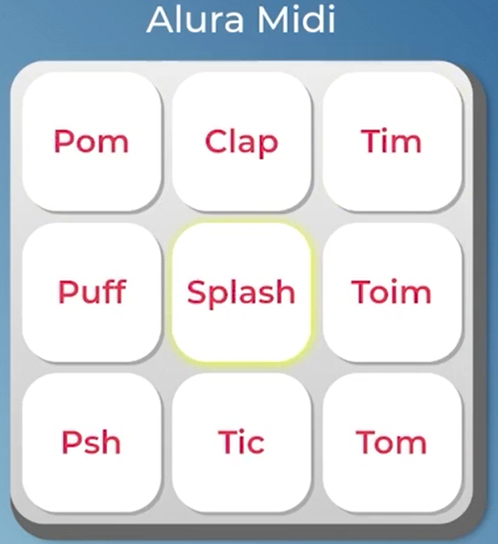

# Curso Alura - JavaScript para Web: Crie páginas dinâmicas

## Aula 1 - Conhecendo o JavaScript

### Aula 1 - Apresentação - Vídeo 1

Transcrição  
Olá! Boas-vindas! Eu sou a Vanessa Tonini, instrutora da Alura.

Audiodescrição: Vanessa é uma mulher de pele clara, cabelos lisos e castanho-escuros na altura dos ombros, de óculos com armação preta e arredondada. Está usando um headphone branco e camiseta cinza-escura. Ao fundo, uma parede iluminada por tons de azul-claro a lavanda.

Se você veio da nossa formação de HTML e CSS ou já sabe codificar páginas com HTML e CSS, esse curso é para você!

O Alura Midi é um instrumento musical de interface digital, onde cada botão reproduz o som de um instrumento.


Interface gráfica deo 'Alura Midi' com um conjunto de nove botões brancos e retangulares dispostos em uma grade 3x3. Cada botão contém uma palavra em inglês, representando diferentes sons: 'Pom', 'Clap', 'Tim', 'Puff', 'Splash', 'Toim', 'Psh', 'Tic' e 'Tom'. A palavra 'Splash' está realçada com um halo amarelo ao redor do botão, indicando seleção ou interação.
Se clicamos em "Pom", um som parecido com essa onomatopeia é reproduzido. O mesmo para o Clap, Tim, Splash e assim por diante, lembrando diferentes sons de uma bateria acústica.

O código do projeto já virá com o HTML e o CSS prontos para focarmos no desenvolvimento do JavaScript do zero, utilizando recursos atuais da linguagem, como constantes, variáveis, querySelector, template strings, eventos de teclado e de mouse e muito mais.

Vale lembrar que neste curso não vamos utilizar recursos avançados do JavaScript, como integração com o back-end, APIs do navegador, classes e objetos a fundo.

Se desenvolver o Alura Midi despertou interesse em você, te esperamos no nosso próximo vídeo!

### Aula 1 - Baixando o projeto

Preparando o ambiente
Para realizarmos este curso, usamos um editor de código chamado [Visual Studio Code](https://code.visualstudio.com/download). Se você quiser usá-lo também pode baixar tanto para Windows, como Linux ou Mac.

Porém fique a vontade para usar seu editor de código favorito.

Além disso, estamos usando o Firefox como navegador principal e é importante tê-lo instalado em seu computador, assim como o Chrome onde realizamos testes também.

Baixando o projeto
Após preparar o ambiente, vamos precisar [baixar o projeto](https://github.com/alura-cursos/aluramidi-curso/archive/refs/heads/arquivos-iniciais.zip) em seu computador:

Para acompanhar o desenvolvimento deste curso, é importante que você tenha os arquivos necessários do projeto inicial.

Depois de baixado, extraia o conteúdo em algum lugar que você consiga encontrar depois.

Abrindo no Visual Studio Code
Primeiro abra o editor de código. Na tela inicial, no canto superior esquerdo, clique em "arquivo" ou "file".

Tela inicial do editor Visual Studio Code com uma seta vermelha apontando para a palavra File no canto superior esquerdo

Um menu dropdown deve aparecer. Selecione a opção "abrir pasta" ou "open folder".

Menu dropdown com a opção Open Folder selecionada

Navegue para onde você baixou os arquivos do projeto e clique na pasta (clique apenas uma vez para selecionar). Depois clique em "Abrir" ou "Open".

Tela de seleção de arquivo com dois círculos vermelhos. Um círculo marcando a pasta selecionada e outro círculo no botão Open. Os números 1 e 2 aparecem respectivamente ao lado dos círculos

Você deve ter uma estrutura de arquivos e pastas na esquerda do editor.

Tela inicial do Visual Studio Code com a seguinte estrutura de pastas e arquivos no painel à esquerda: "css", "images", "sounds" e "index.html"

Agora podemos começar!

### Aula 1 - Clicando no botão - Vídeo 2

Transcrição  
Olá! Agora que já conhecemos o Midi, precisamos descobrir como começar a desenvolver suas funcionalidades.

Reproduzindo som no HTML  
Por ser um instrumento musical, queremos reproduzir um som diferente ao clicar em cada um dos botões. Porém, como fazemos para o HTML reproduzir um som?

Vamos abrir nosso código no Visual Studio Code, nosso editor de código, e expandir toda a estrutura de pastas dos arquivos do curso. Temos uma pasta com o nosso CSS ("css"), com as imagens ("images") e com os arquivos de som ("sounds"), que são os sons que vamos reproduzir ao clicar nos botões. Além disso, temos o arquivo index.html, o HTML principal da nossa aplicação.

Vamos abrir o arquivo HTML e ir direto para a tag body. Nela há uma section com uma série de buttons, que são os botões que vimos no navegador, já estilizados com o CSS para ter a aparência desejada do Midi.

Embaixo dessa seção com os botões, temos uma série de tags audio. Essas tags audio são as responsáveis por carregar e fornecer ao navegador os sons dos instrumentos que queremos reproduzir.

A tag audio não está aparecendo no HTML, porque omitimos um atributo importante para a visualização dela. É um atributo da tag audio chamado controls. Esse atributo, ao ser adicionado, vai começar a exibir a tag. Vamos adicioná-lo em todas as tags audio, selecionando uma e pressionando o atalho "Ctrl + D", que seleciona todas as tags iguais, e e escrevendo o atributo controls.

index.html

```html
  <audio controls src="sounds/keyq.wav" id="som_tecla_pom"></audio>
  <audio controls src="sounds/keyw.wav" id="som_tecla_clap"></audio>
  <audio controls src="sounds/keye.wav" id="som_tecla_tim"></audio>
  <audio controls src="sounds/keya.wav" id="som_tecla_puff"></audio>
  <audio controls src="sounds/keys.wav" id="som_tecla_splash"></audio>
  <audio controls src="sounds/keyd.wav" id="som_tecla_tom"></audio>
  <audio controls src="sounds/keyz.wav" id="som_tecla_psh"></audio>
  <audio controls src="sounds/keyx.wav" id="som_tecla_tic"></audio>
  <audio controls src="sounds/keyc.wav" id="som_tecla_tom"></audio>
```

Vamos salvar o nosso arquivo HTML e abrir o navegador.

Ao recarregar a página, notamos que as tags audio começaram a ser exibidas abaixo da grade de botões do Alura Midi, em forma de nove players de áudio, um depois do outro. Isso ocorre porque adicionamos o atributo controls.

Podemos notar que essa tag audio já vem com controles nativos, como o botão de play, uma barra de progresso, a duração do som e um slider de volume. Ao clicar nos botões de play, são reproduzidos os sons dos nossos instrumentos, que no caso são as diferentes vozes de uma bateria, na ordem em que os botões aparecem.

No navegador Firefox, a tag audio tem uma aparência muito específica e muito parecida com um mini player. Ela é retangular, com fundo preto e botões brancos. No Chrome, esse mini player tem os mesmos elementos, mas num fundo branco, bordas arredondadas, botões pretos. A divergência na aparência desse player entre um navegador e o outro não é ideal.

Queremos ter uma consistência de design na nossa aplicação para as pessoas usuárias, e esse tipo de tag é muito difícil de customizar, não sendo possível customizar com CSS diretamente.

Portanto, precisamos passar o controle da reprodução do som, que está na tag audio, para os nossos botões. É aqui que começamos a precisar utilizar uma linguagem de programação que trabalhe com HTML e que trabalhe com CSS, que é o JavaScript.

Atributo onclick  
Vamos voltar para o nosso VS Code e retirar o atributo control das tags audio, pois não vamos precisar mais dele aqui. Em seguida vamos até a seção com os botões.

O primeiro botão do nosso Alura Midi é a tecla Pom (tecla_pom). Para fazermos algo com JavaScript nesse botão, podemos utilizar um atributo HTML na tag button chamado onclick.

O atributo onclick, como muitos atributos HTML, também vem acompanhado do sinal de igual e aspas duplas, e dentro das aspas duplas podemos escrever qualquer código JavaScript — onclick="".

Vamos começar com um código bem simples, só para testar esse dinamismo que o JavaScript é capaz de agregar a uma página.

Podemos usar uma função muito famosa do JavaScript, chamada alert. O alert cria uma janela com uma mensagem específica e um botão de "OK" para fechá-la. Essa janela é muito utilizada em várias aplicações para testar funcionalidades, mandar mensagens para as pessoas usuárias e assim por diante.

Então, escrevemos alert dentro das aspas duplas do onclick, depois adicionamos parênteses, e dentro dos parênteses adicionamos aspas simples — onclick="alert('')". Precisa ser aspas simples para não entrar em conflito com aspas duplas do HTML.

Dentro das aspas simples vamos escrever uma mensagem. Como estamos clicando na tecla de um som, vamos escrever Pom, o som do instrumento desse botão.

index.html

```html
<button onclick="alert('Pom')" class="tecla tecla_pom">Pom</button>
```

Agora vamos salvar o nosso HTML com o atalho "Ctrl + S" e retornar ao navegador. No Chrome, ao recarregar a página e clicar na tecla Pom, recebemos o alert no topo da tela, uma pequena janela com a mensagem "This page says Pom" e o botão "OK". Podemos clicar no OK para fechá-la.

Vamos verificar como essa janela aparece no Firefox. Ao recarregar a página e clicar na tecla Pom, a janela do alert aparece no centro da tela, com apenas o texto "Pom" e o botão OK.

Conclusão  
Esse é o primeiro código JavaScript desse curso! Começamos a adicionar dinamismo à nossa aplicação! Claro, isso ainda está bem longe da nossa proposta, porém, já é o primeiro passo para entender o que o JavaScript faz numa página web.

No nosso próximo vídeo, você vai aprender a fazer um código ainda melhor para adicionar comportamentos à página com JavaScript.

### Aula 1 - Conectar JS com o HTML - Vídeo 3

Transcrição  
Agora, nós já sabemos como inserir um alert dentro de um onclick e executar um primeiro código JavaScript bem simples. Porém, se observarmos nosso HTML, percebemos que escrevemos o código JavaScript dentro da tag do HTML.

Isso é muito semelhante ao CSS Inline, que já sabemos não ser a melhor prática, pois dificulta a reprodução dos mesmos estilos para outras tags. Se quisermos modificar algo, teremos que alterar todas as outras tags, correndo o risco de cometer algum erro. O mesmo ocorre com JavaScript. Acabamos de fazer JavaScript Inline através do atributo onclick.

Imagine se tivéssemos 88 teclas, como um piano completo, ou outros instrumentos no Alura Midi. Ficaria muito difícil reproduzir essa lógica se tivéssemos que colocar elemento por elemento, tecla por tecla do nosso instrumento e se tivéssemos que fazer alguma modificação futuramente.

Portanto, entendemos que JavaScript Inline não é a melhor prática, apesar de podermos e conseguirmos fazê-lo para fins de teste e conhecer as potencialidades do JavaScript no HTML.

Além disso, cada linguagem tem a sua responsabilidade. O HTML é responsável pela estrutura semântica da página, o CSS pelos estilos da página e o JavaScript adiciona o dinamismo e as atualizações de programação, a lógica na página, utilizando essa lógica de programação que não é fornecida pelo HTML.

Portanto, como podemos fazer o JavaScript de uma maneira consistente e correta? Com um arquivo externo! Assim como o CSS tem um arquivo CSS e o HTML tem um arquivo HTML, também teremos um arquivo JavaScript.

Criando o arquivo JavaScript  
Vamos criá-lo dentro da nossa estrutura de arquivos, no Visual Studio Code, por meio do atalho "New file" ("Novo arquivo") no canto superior esquerdo da tela, representado por um ícone de folha com um sinal de mais. O nome desse novo arquivo será main.js. Pressionamos "Enter" para confirmar e entrar no arquivo.

O nome main ("principal" em inglês) é uma convenção das pessoas desenvolvedoras de JavaScript para o arquivo principal de JavaScript, para facilitar a compreensão de todo site ou aplicação escrita com JavaScript sobre qual é o arquivo que dá a entrada a toda lógica e todos os arquivos JavaScript. Portanto, vamos seguir essa convenção utilizada pelo mercado.

E como fazemos, então, para ligar esse arquivo JavaScript dentro do HTML?

Conectando o JavaScript ao HTML - tag `<script>`
No nosso HTML (index.html) temos a tag head, que contém tags que ajudam a configurar a página, por exemplo: metadados (meta), título (title), links com ícones, com CSS, com fontes, etc. Também podemos ter dentro dessa tag head a tag script, responsável por carregar o JavaScript dentro do nosso HTML.

É interessante sempre utilizar a ajuda do VS Code para escrever script, para garantir que não cometemos nenhum erro de digitação.

Assim como a tag img e a tag audio, a tag script tem o atributo src, que significa o source ("recurso" em inglês) que vai ser carregado por essa tag. Depois dele, adicionamos o sinal de igual e aspas duplas.

Vamos indicar o caminho desse arquivo dentro das aspas duplas, que será o main.js, automaticamente sugerido pelo VS Code.

index.html

```html
<script src="main.js"></script>
```

Agora, como garantimos que esse arquivo foi corretamente carregado e está funcionando no nosso HTML? Da mesma forma que usamos o alert para conhecer o onclick no botão, também podemos utilizá-lo dentro do arquivo main.js para testar seu funcionamento.

Então, vamos escrever nele o nome da função diretamente na primeira linha, alert(), inserimos aspas simples dentro dos parênteses e, dentro deles, digitamos a mensagem "Olá mundo". Depois do parênteses, colocamos ponto e vírgula.

O ponto e vírgula é opcional no JavaScript, cujo código funciona sem ele na maioria dos casos, porém é altamente recomendado utilizá-lo para evitar possíveis erros futuros.

main.js

```JavaScript
alert('Olá mundo');
```

Vamos salvar o arquivo JS com o atalho "Ctrl + S" e voltar para o navegador.

Recarregando a página, uma mensagem com a caixa de alerta é exibida na tela, com a mensagem "Olá mundo" e um botão de OK para fechá-la, sobre o fundo cinza da tela no Firefox e sobre um fundo branco no Chrome. Ao clicar em "OK" e fechar a caixa de alerta, surge o Alura Midi.

Isso confirma que o arquivo main.js foi devidamente carregado na nossa aplicação!

Agora, analisando nossos dois arquivos, temos um desafio: Como fazemos para pegar esse botão (button) que está dentro do HTML, chamá-lo dentro do main.js e fazer alguma coisa com esse botão?

Vamos descobrir isso no próximo vídeo!

### Aula 1 - Buscar um elemento - Vídeo 4

Transcrição  
Agora precisamos descobrir como vamos colocar um botão do HTML dentro do JavaScript. É muito parecido com o que já fizemos no CSS.

Conhecendo o DevTools  
Vamos utilizar aquela ferramenta do navegador que auxilia as pessoas desenvolvedoras para nos ajudar a fazer essa tarefa, que é o DevTools. Basta clicar com o botão direito do mouse na página e escolher a opção de "Inspect". No nosso caso, está em inglês, mas você também pode encontrá-lo como "Inspecionar", "Inspecionador de elementos" ou "Inspect element" - depende bastante de navegador para navegador.

Às vezes, o DevTools pode se abrir como um painel na parte inferior do navegador, mas a Vanessa prefere trabalhar com ele no lado direito. Por isso, vamos clicar no ícone de três pontinhos e escolher "Dock to right" para colocá-lo na direita.

Sempre começamos a trabalhar com esse DevTools, essa ferramenta de desenvolvedores, na aba "Elements". Essa aba contém todos os nossos elementos HTML do index.html e embaixo temos essa aba "Styles", que tem o CSS de cada elemento, como já aprendemos também nos cursos de CSS, no dia a dia desenvolvimento front-end, com os estilos das nossas tags.

Para conseguir selecionar e adicionar um estilo em um botão, por exemplo, foi preciso criar uma classe para adicionar esses estilos, como boa prática do CSS. Poderíamos ter estilizado direto a tag pelo nome button ou por seu ID, mas o correto é sempre usar o nome da classe ou o nome do elemento.

E para o JavaScript não é diferente, precisamos ter um nome para encontrar dentro do JavaScript esse elemento com o qual queremos fazer alguma ação.

No DevTools, vamos utilizar a aba "Console", que fica do lado da aba "Elements", que nela vamos poder executar qualquer código JavaScript dentro desse arquivo index.js, que está carregado ali nesse momento. E isso vai nos ajudar a desenvolver e a entender o nosso código.

Seguindo essa lógica parecida com CCS, o primeiro passo é ter nome do seletor, que pode ser o nome da tag, pode ser o nome da classe, pode ser um ID, enfim, qualquer seletor CSS. Por enquanto, vamos usar o seletor do nome da tag chamado tecla_pom.

Se escrevemos tecla_pom entre aspas simples no console do Chrome e damos um "Enter", vai nos retornar tecla_pom.

```html
'tecla_pom'
```

'tecla_pom'

Não teve nenhum problema. Se tivesse algum com problema nessa escrita, já saberíamos, porque o console também nos retorna todos os problemas do nosso código. Então tecla_pom entre aspas é um seletor válido.

Só que só esse tecla_pom entre aspas é basicamente um texto, é o mesmo que escrever entre aspas o nome Vanessa ou Alura, por exemplo. É um texto. Precisamos passar esse texto para alguém ou algo que consiga fazer essa busca por esse elemento através desse seletor informado.

Buscando um elemento com querySelector
Agora, vamos usar a funcionalidade de limpar o console, clicando no botão "Clear console" (ou atalho "Ctrl + L"). Em seguida, vamos digitar e apresentar para vocês uma função que é capaz de buscar e nos trazer um elemento, quando informamos o seletor desse elemento, que é a função querySelector.

Então a função querySelector, com Q minúsculo e S maiúsculo, faz uma busca pelo seletor e é exatamente isso que significa o nome dela. Query em inglês, uma das traduções é "busca", e selector é "seletor", o mesmo seletor de CSS.

Assim como o alert, essa função também tem a sintaxe padrão. Em outras palavras, deve vir com o parêntese depois e entre parênteses, aspas simples, porque vamos passar um texto para ela. Nesse caso, vamos passar o nome do seletor.

```JavaScript
querySelector('')
```

Como o seletor é um nome, precisamos decidir se será uma classe, o nome da tag ou ID - assim como no CSS. Se for o nome da tag, é direto o nome da tag button.

Exemplo para nome da tag:

```JavaScript
querySelector('button')
```

Se for uma classe ponto e o nome da classe, .tecla_pom.

Exemplo para nome da classe:

```JavaScript
querySelector('.tecla_pom')
```

Se for um ID, vamos começar com hashtag, #som_tecla_pom, que é o ID de um outro elemento. Podemos abrir a aba "Elements" para conferir que é o ID de uma das tags <audio>. Informamos um ID que realmente existe.

Exemplo para ID:

```JavaScript
querySelector('#som_tecla_pom')
```

Mas, queremos acessar o botão da tecla Pom, então vamos selecioná-lo com o nome de sua classe:

```JavaScript
querySelector('.tecla_pom')
```

Ao dar um "Enter", teremos o nosso primeiro erro no JavaScript.

Uncaught ReferenceError: querySelector is not defined at `<anonymous>`:1:1

Esse erro significa que querySelector não está definido, é um erro referência.

O alert é uma funcionalidade que está em um escopo maior, que é a nossa janela. Por isso, podemos chamá-lo em qualquer lugar do nosso código. É uma funcionalidade que está disponível para qualquer parte, qualquer momento do nosso código e para qualquer situação.

Diferentemente do alert, o querySelector é uma funcionalidade que precisa ter um escopo, precisamos dizer para o JavaScript onde queremos que seja buscado este elemento, com este seletor. Por isso, sempre devemos executar o querySelector dentro de um outro lugar que precisamos informar. Pode ser uma outra tag, mas geralmente usamos dentro do nosso documento HTML.

Pedimos para o JavaScript, dentro do documento HTML, buscar o elemento que tem este seletor, que é a classe tecla_pom. Para fazer isso, o JavaScript tem uma palavra reservada, chamada document.

A palavra reservada document representa todo o documento HTML.

Inclusive, ao escrever essa palavra, toda a página do Alura Midi ficou destacada com azul, como se tivéssemos passado o inspecionador de elemento e tivesse selecionado todo o documento HTML. Está representando a seleção de todo esse documento.

Agora, para executar algo dentro desse documento, vamos usar um caractere que acessa esse documento, ou seja, que entra dentro dessa palavra, que é o ponto (.).

O ponto é capaz de entrar dentro dessa representação do document e acessar atributos e funcionalidades que são possíveis serem executadas dentro do documento, e uma delas é o querySelector.

Após o ponto, acessamos o querySelector() sempre com q minúsculo S maiúsculo e abre e fecha parênteses.

Dentro dos parênteses, colocamos aspas simples e escrevemos .tecla e já funciona! Isso porque todos os nossos botões têm duas classes: a classe tecla e a classe tecla seguido de underline e um som.

```JavaScript
document.querySelector('.tecla')
```

Por isso, a própria classe tecla já funciona e destaca o elemento correto no nosso HTML. E, embaixo também dá uma prévia do que esse código que escrevemos vai retornar. Nesse caso, já informa que vai ser a tecla pom.

Para ser mais específico, poderíamos colocar tecla_pom para retornar a primeira tecla. Se colássemos tecla_clap, retornaria a segunda e assim por diante.

Primeiro, vamos pegar a tecla_pom e dar um "Enter".

```JavaScript
document.querySelector('.tecla_pom')
```

Com o "Enter", confirmamos a execução desse código JavaScript que vai nos trazer a representação, a referência daquele botão:

```html
<button class="tecla tecla_pom">Pom
```

Esse código acessa o documento HTML, busca aquele elemento daquele seletor informado e nos retorna a referência desse elemento - nesse caso, o botão com o qual queremos trabalhar.

E só mais um detalhe! Se colocamos um elemento que não existe, por exemplo, tecla_tum, ele vai retornar null, ou seja, nulo, porque não encontrou nada.

Exemplo de elemento que não existe:

```JavaScript
document.querySelector('.tecla_tum')
```

null

Além disso, se escrevemos queryselector com S minúsculo, vamos ter um erro também, porque queryselector todo minúsculo não é uma função, não existe.

Exemplo de função com erro de digitação:

```JavaScript
document.queryselector('.tecla_pom')
```

Uncaught TypeError: document.queryselector is not a function at `<anonymous>`:1:10

O JavaScript é sensível a letras maiúsculas e minúsculas, portanto, devemos ter muita atenção na hora de escrever.

Às vezes escrevemos tudo minúsculo ou fazemos um erro de digitação, como esquecer de escrever uma letra da palavra, também retorna o mesmo erro. Esse erro indica que aconteceu algum equívoco na hora de digitar, seja no querySelector ou no document.

Por isso, sempre utilize o auto complete, ou seja, essas sugestões do navegador e do Visual Studio Code que nos ajudam a digitar o código corretamente.

Sabendo que esse código está correto, vamos copiá-lo e colá-lo no main.js. Caso você queira praticar mais um pouco, podemos digitá-lo no main.js.

Voltando no VS Code, vamos apagar aquele alert, pois não precisamos mais dele. No lugar, vamos digitar document. O Visual Studio Code já nos ajuda a digitar, adivinhando que íamos usar o querySelector. Podemos dar um "Enter" para autocompletar.

Entre parênteses e aspas simples, usamos o seletor .tecla_pom. Não se esqueça de colocar o ponto e vírgula no final!

main.js:

```JavaScript
document.querySelector('.tecla_pom')
```

Sabemos que esse código quando for lido pelo JavaScript vai nos trazer um elemento HTML - no caso, com esse seletor, será o nosso botão.

Após salvar o main.js, vamos recarregar a página. Nada acontece, nenhum problema, nenhuma letra vermelha no console. O botão Pom ainda não reproduz nada.

Também podemos testar no Firefox. Abrimos o navegador, recarregamos a página, clicamos com o botão direito, abrimos o DevTools e acessamos a aba "Console". Não aparece nenhum erro e nenhum som é reproduzido ao clicar na tecla Pom. Está tudo correto.

Próximos passos  
Já temos o acesso ao botão Pom através do código, porém ainda não fazemos nada com ele. Na próxima aula, vamos descobrir como adicionar uma funcionalidade dentro desse botão e reproduzir o som do nosso instrumento musical.

Até lá!

### Aula 1 - Para que serve o DevTools?

A ferramenta DevTools presente nos navegadores web é de grande ajuda para comunidade de desenvolvedores web, a ponto de serem apelidados carinhosamente de “melhor amiga/o” da pessoa desenvolvedora.

Marque as alternativas com afirmações verdadeiras a respeito da ferramenta DevTools.

Alternativa correta  
Através dessa ferramenta, conseguimos editar a aplicação em tempo de execução, adicionar ou remover tags HTML, mexer no CSS da página, escrever código JavaScript no console e ver as modificações sem persistência.

> Alternativa correta! É isso mesmo! Com essa ferramenta, conseguimos realizar modificações em tempo real tanto de HTML, como de CSS e JavaScript, porém sem alterar o código fonte real.

Alternativa correta  
Diferente do método tradicional para resolver problemas do código fonte que consistia em abrir o código e olhar linha a linha para descobrir o erro, o DevTools apresenta uma maneira mais simples e direta do problema no código, bastando acessar a aba Console que lá estará indicando o tipo e o arquivo onde se encontra o erro.

> Alternativa correta! Como conseguimos mexer em tempo real no código da aplicação através do navegador, uma prática muito comum, principalmente se tratando do CSS, é ir escrevendo as propriedades e vendo como o site se comporta, para aí depois, colocar o código final no código fonte da aplicação.

### Aula 1 - Faça como eu fiz: Brinque com seletores no JS

Praticar ajuda bastante no aprendizado de um novo conceito, assim, é muito importante que você esteja sempre praticando. Pensando nisso, gostaria de propor este pequeno desafio que envolve o que foi visto em aula.

A partir deste código a seguir:

HTML

```html
<h1> Alura Fone </h1>
 <section class="teclado">
    <input type="button" value="1">
    <input type="button" value="2">
    <input type="button" value="3">
    <input type="button" value="4">
    <input type="button" value="5">
    <input type="button" value="6">
    <input type="button" value="7">
    <input type="button" value="8">
    <input type="button" value="9">
    <input type="button" value="*">
    <input type="button" value="0">
    <input type="button" value="#">
  </section>
  <input type="tel" placeholder="Digite seu telefone">
```
  
CSS

```CSS
* {
  box-sizing: border-box;
}

body {
  display: flex;
  justify-content: center;
  align-items: center;
  flex-direction: column;
  background-color: #191919;
  min-height: 100vh;
}

input {
  border: none;
  color: inherit;
  font-size: inherit;
  font-weight: inherit;
  font-family: inherit;
}

h1 {
  font-family: 'Montserrat', sans-serif;
  font-size: 24px;
  color: #fff;
}

.teclado {
  display: grid;
  grid-template-columns: repeat(3, 1fr);
  gap: 10px; 
  background-color: #cccccc;
  border-radius: 30px;
  padding: 10px;
}

input[type=button] {
  border-radius: 20px;
  cursor: pointer;
  font-family: 'Montserrat', sans-serif;
  height: 80px;
  width: 80px;
}

input[type=tel] {
  background-color: #cccccc;
  border-radius: 10px;
  font-family: monospace;
  font-size: 22px;
  height: 40px;
  margin-bottom: 24px;
  padding: 10px;
  text-align: center;
  width: 280px;
}
```

Escreva o código em JavaScript capaz de selecionar o elemento HTML input do tipo telefone:

Como fazer:

- Abra o editor de código de sua preferência;
- Crie dois arquivos: desafio.html e desafio-estilo.css;
- Copie o código acima e cole dentro da tag < body> do arquivo chamado desafio.html e o código CSS no arquivo desafio-estilo.css;
- Para resolver este desafio, você pode usar apenas a aba Console da ferramenta DevTools;

Opinião do instrutor

Gabarito:

```JavaScript
document.querySelector('input[type=tel]');
```

Para selecionar o elemento HTML input do tipo tel podemos utilizar o código document.querySelector(‘input[type=tel]’), porquê com essa linha, o JavaScript vai acessar o documento HTML (representado por document) e procurar pelo elemento input que tenha como atributo [type=tel], os colchetes fazem parte da sintaxe para seleção de atributos de um elemento HTML, funciona tanto para o CSS quanto para o Javascript.

### Aula 1 - Para saber mais: HTML x CSS x JavaScript

Para que fique mais claro o porquê de se utilizar arquivos separados para HTML e JavaScript, leia o artigo da instrutora Rafaella Ballerini, que explica a diferença entre essas linguagens.

Artigo: [HTML X CSS X JavaScript. Quais as diferenças?](https://www.alura.com.br/artigos/html-css-e-js-definicoes)

### Aula 1 - Lista de exercícios

O que é:  
Boas-vindas à nossa lista de exercícios , um caminho prático e envolvente para aprender e aprimorar suas habilidades em tecnologia. Aqui, você não encontrará longas leituras teóricas ou explicações abstratas. Em vez disso, nossos exercícios são projetados para colocar você no centro do processo de aprendizado, permitindo que você construa, experimente e explore conceitos tecnológicos de forma direta e aplicada.

Para que serve:  
Esta lista é uma ferramenta dinâmica para aprender, reforçar e aprimorar habilidades práticas em programação e desenvolvimento web. Cada exercício é uma oportunidade de aplicar conhecimentos teóricos em cenários reais, preparando você não apenas para entender a tecnologia, mas para utilizá-la de maneira eficaz e criativa em seus próprios projetos ou no ambiente de trabalho.

Como fazer:  

- Leia cada exercício com atenção: comece entendendo o cenário proposto e o que se espera como resultado.
- Escreva o código: utilize o ambiente de codificação de sua escolha para escrever e testar o seu código. Não se preocupe em acertar de primeira, a prática leva à perfeição.
- Verifique o gabarito: após tentar resolver o exercício, compare seu código com o gabarito fornecido em “Opinião do instrutor”. Isso ajudará a identificar áreas de melhoria e consolidar o aprendizado.  
- Repita: a repetição é chave para o aprendizado. Tente fazer os exercícios mais de uma vez, aplicando melhorias e variantes.
- Lembre-se, cada desafio é uma chance de crescer. Não se desanime com os erros; eles são degraus no caminho do aprendizado. E acima de tudo, divirta-se! O aprendizado mais eficaz acontece quando nos engajamos e nos interessamos pelo que estamos fazendo. Não se esqueça: estamos no Fórum e no Discord para ajudar você!

Bons estudos!

Vamos, agora, conhecer os exercícios da aula 1!

1) Selecionando elementos com JavaScript  
Você já sabe como usar o DevTools para inspecionar elementos HTML. Agora, está trabalhando em um projeto de site musical e precisa interagir com os botões que representam as teclas de um piano. Logo, seu desafio é: utilize o Javascript para selecionar um botão específico na sua página.

2) Emitindo um alerta na tela  
Imagine que você está trabalhando em um projeto de site que inclui elementos interativos como botões que emitem sons, semelhante a um piano. Até o momento, você já aprendeu como emitir o som utilizando JavaScript, agora, a sua missão é emitir um alerta escrito “Fui clicado”, em um botão assim que ele receber um clique.

3) Integrando estilo e funcionalidade em um projeto Web  
Neste exercício, você enfrentará um desafio comum no desenvolvimento web: garantir consistência de design entre diferentes navegadores. Trabalhando com o mesmo projeto do instrumento musical digital, você percebeu que o mini player de áudio tem aparências diferentes no Firefox e no Chrome. Seu objetivo é personalizar o estilo desse player de áudio usando CSS para que ele tenha uma aparência consistente em ambos os navegadores. Como a tag audio é difícil de estilizar diretamente, você precisará encontrar uma maneira criativa de contornar essa limitação, talvez usando elementos HTML adicionais e CSS para alcançar o design desejado.

Opinião do instrutor

Veja as soluções dos exercícios. Lembre-se de que há várias maneiras de solucionar um mesmo problema (e tudo bem caso seu código tenha saído diferente). O importante é que ele esteja organizado, bem escrito e funcione.

1) Selecionando elementos com JavaScript

- Abra o DevTools no seu navegador;
- Use a aba "Console" para testar a seleção de um botão específico, utilizando a função querySelector;
- Tente selecionar o botão usando diferentes seletores: nome da tag, classe, e ID;
- Verifique se a seleção está correta observando o retorno no console do DevTools;
- Salve as alterações no arquivo main.js.
- Código utilizado aplicado no console do navegador:

```JavaScript
document.querySelector('.tecla_pom');
```

2) Emitindo um alerta na tela

- No seu arquivo HTML, adicione a tag `<script>` dentro da tag `<head>` ou antes do fechamento da tag `<body>`. Use o atributo src para vincular ao arquivo main.js;
- No arquivo main.js, adicione um alert para testar se está tudo funcionando.
- Use um método como document.getElementById ou document.querySelector para selecionar um botão do seu HTML;
- Adicione um eventListener ao botão para que, quando clicado, execute uma função;
- Teste a interação no navegador para garantir que o código JavaScript está manipulando corretamente o elemento HTML.  
Código HTML:

```html
<button>Clique aqui</button>
<script src="main.js"></script>
```

Código JavaScript:

```JavaScript
let botao = document.querySelector('button');

botao.addEventListener('click', function() {
    alert('Fui clicado!');
});
```

3) Integrando estilo e funcionalidade em um projeto Web

- Como não é possível estilizar diretamente a tag audio, crie um novo elemento HTML que servirá como seu player personalizado. Por exemplo, um div com botões para play e pause;
- Utilize CSS para estilizar esse novo elemento de forma que tenha uma aparência consistente em diferentes navegadores;
- Teste a aparência e a funcionalidade do seu player personalizado nos navegadores Firefox e Chrome para garantir consistência.  
Código CSS:

```CSS
    .meuPlayer {
        background-color: #fff;
        border-radius: 5px;
        color: #000;
        /* Adicione mais estilos conforme necessário */
    }
```

## Aula 2 - Funções

### Aula 2 - Play no JS - Vídeo 1

Transcrição  
Na aula anterior aprendemos como trazer um botão que está no HTML para dentro do JavaScript, e portanto assim vamos conseguir adicionar um clique e fazer as demais funcionalidades que precisamos para funcionar o Alura Midi.

Porém, agora precisamos descobrir como fazemos para reproduzir um som que está carregado dentro de uma tag `<audio>`.

Reproduzindo som  
Acessando o navegador, vamos abrir a aba "Elements" no DevTools. A aba de elementos tem as tags `<audio>`, a qual não está sendo exibida porque omitimos o atributo controls.

Porém essa tag contém todos os controles necessários para reprodução de uma mídia, como um som. Portanto vamos ter disponível também, via JavaScript esses controles para reprodução do som.

Seguindo a mesma lógica do botão, precisamos acessar essa tag `<audio>` para então conseguir acessar os controles dela.

Para isso, vamos usar o document, porque queremos procurar o elemento dentro do documento, utilizando a função .document.querySelector(), que é a função que busca um elemento através do seu seletor. Entre parênteses, devemos abrir e fechar aspas simples.

Podemos conferir na aba "Elements" novamente qual é o seletor que queremos usar, podemos usar tanto o nome da tag `<audio>` quanto o id dela.

Para ser mais certeiro, o ideal é utilizar o id dessa tag. Colocamos uma hashtag para o seletor começar com ID, então #som_tecla_pom.

```JavaScript
document.querySelector('#som_tecla_pom')
```

Ao dar "Enter", realmente localizamos e conseguimos trazer com o JavaScript a referência desse elemento áudio.

Retorno:

```JavaScript
<audio src="sounds/keyq.wav" id="som_tecla_pom"></audio>
```

Agora que sabemos acessá-lo é muito fácil entrar dentro dele e encontrar os controles de reprodução da mídia que ela está carregando.

Portanto podemos repetir esse mesmo código, document.querySelector('#som_tecla_pom') e esse código representa uma tag, um elemento áudio, portanto, se logo após os parênteses do querySelector colocarmos um ponto, estaremos acessando este elemento.

Ou seja, estaremos entrando dentro dele e conseguindo acessar todas as funcionalidades que estão disponíveis dentro desse elemento áudio, que está sendo retornado pelo querySelector.

Como é um elemento de multimídia, após colocar o ponto, abre-se uma janela no console com uma lista de sugestões de atributos e funcionalidades disponíveis para esse tipo de elemento.

Com a seta do teclado para baixo, é possível navegar por todas as coisas que tem dentro dessa lista de funcionalidades ou atributos. Dentre elas, existe uma chamada play. É justamente essa que reproduz o nosso som.

Sabemos que é uma funcionalidade, porque quando selecionamos play, logo embaixo aparece um "F" no console. Isso significa que é uma função.

Se é uma função, devemos usar sintaxe de função para reproduzir. Isto é, abre e fecha parênteses.

```JavaScript
document.querySelector('#som_tecla_pom').play()
```

Não é preciso passar nada entre parênteses para que ela funcione, só vamos apertar o "Enter" e esse código vai ser executado e vamos escutar o som do Pom.

Promise {`<pending>`}

Escutaram? Já sabemos como reproduzir o som de uma tag `<audio>` com JavaScript. Porém não precisamos nos preocupar com retorno promise pending, pois não vamos usar isso.

Vamos seguir agora com esse código dentro do nosso main.js.

Em main.js, vamos dar "Enter" e vamos escrever o código que fizemos e executamos no console:

main.js:

```JavaScript
document.querySelector('#som_tecla_pom').play();
```

Vamos salvar, abrir o navegador e recarregar a página. O que esperar dessa execução?

Uncaught TypeError: Cannot read properties of null (reading 'play') at main.js:3

Então, recarregamos e recebemos um erro. É normal receber erros, devemos estar preparados para conseguir tratar esses erros.

### Aula 2 - O que é uma função? - Vídeo 2

Transcrição  
Recarregamos o navegador Chrome e no console já obtivemos um erro.

Mudando local da tag `<script>`
Não precisamos ter medo de erros, precisamos aprender a lidar com os erros, pois eles nos ajudam a entender o nosso código.

Uncaught TypeError: Cannot read properties of null (reading 'play') at main.js:3

Esse erro nos informa que não é possível ler as propriedades de nulo. Nesse caso, ele está tentando ler uma propriedade 'play'.

Outro lugar que podemos conseguir entender melhor nosso erro é abrir outro navegador. Vamos abrir o Firefox? Ao recarregar navegador, aparecerá o mesmo erro, só que fraseado de forma diferente.

Uncaught TypeError: document.querySelector(…) is null «anonynous> file://home/vanessa/Desktop/aluramidi-curso/main.js:3

O Firefox explicita que é o document.querySelector que está nulo. Ambos navegadores também informam que o erro ocorre na linha 3 do arquivo main.js.

main.js, linha 3:

```JavaScript
document.querySelector('#som_tecla_pom').play();
```

Se conferimos a linha 3, é onde está o nosso código recém-escrito com um document.querySelector. Os erros estão dizendo que a execução document.querySelector('#som_tecla_pom') não existe e retorna nulo, portanto, não é possível executar o play() de algo que é nulo, que não existe.

Colocamos esse erro de forma proposital para entendermos um conceito muito importante, que é o local correto do arquivo main.js.

O navegador lê o nosso arquivo HTML linha por linha e já vai chamando e executando os códigos que estão escritos e declarados no arquivo. Portanto, no momento em que o navegador passa na linha 18, onde colocamos a tag `<script>`, ele entra no arquivo main.js para executar esses códigos JavaScript. Porém, esses códigos dependem do `<body>` do HTML, e o navegador ainda não chegou na linha 21 do HTML e não construiu o `<body>`.

Desse modo, temos um código que depende dessa estrutura do HTML abaixo, mas que não existe ainda nesse momento.

Essa é uma lição muito importante sobre o local da tag `<script>`:

Conseguimos colocar a tag `<script>` tanto no `<head>` quanto no `<body>`. Contudo, se o nosso JavaScript depende da estrutura HTML carregada e pronta, devemos colocá-la dentro do `<body>`, logo antes do fechamento da tag `<body>` e não dentro da tag `<head>`.

Vamos fazer isso? Podemos recortá-la da tag `<head>` e colá-la logo antes do fechamento da tag `<body>`.

index.html:

```html
<body>

    <!-- Cógido omitido… --> 

    <script src="main.js"></script>

</body>
```

Se nosso arquivo JavaScript tiver um monte de funcionalidades que não dependem do que tem declarado dentro da tag <body>, então podemos colocar, sim, o <script> dentro da tag <head>.

Após salvar, vamos voltar no navegador. Conseguimos resolver o problema do nulo, mas agora temos outro problema.

Uncaught (in promise) DOMException: play() failed because the user didn't interact with the document first.

E às vezes quando estamos codando em JavaScript é assim mesmo, temos um problema atrás do outro e isso é muito legal, pois vamos aprendendo como a linguagem funciona.

Executando um som sem permissão  
Vamos recarregar também o Firefox. O erro também aconteceu sobre o método play que estamos fazendo.

Uncaught (in promise) DOMException: The play method is not allowed by the user agent or the platform in the current context, possibty because the user denied permission.

Esse erro é muito peculiar, da natureza da nossa aplicação, porque precisamos executar um som e o JavaScript, como mencionamos para vocês, ele vai sendo lido e executado imediatamente pelo navegador.

Imagina que você está abrindo um site qualquer. Quando você abre o site, você ainda nem fez nada, o site está carregando e já começa a tocar um monte de sons indesejados!

Por causa disso, os navegadores têm uma política de bloquear esse tipo de código que já executa mídias e sons antes da pessoa usuária interagir com a página.

O erro que está acontecendo no Chrome é um problema com a permissão e controle das pessoas usuárias. O mesmo erro também acontece no Firefox, pois o navegador não permite que demos o play pelo JavaScript antes da pessoa usuária fazer algum tipo de atividade na nossa página, interagir com a nossa página.

E realmente não faz sentido, não queremos que os sons do Alura Midi sejam reproduzidos ao abrir a página, só queremos que seja reproduzido quando clicamos no botão.

Por isso, vamos ter que fazer algo para guardar esse código do play() para ele ser chamado somente quando nós quisermos. E quando precisamos de um código que é chamado somente quando nós queremos, precisamos criar uma função.

Criando uma função  
Agora, vamos abrir o arquivo main.js para aprender como fazemos para criar nossa própria função - porque até agora usamos funções prontas que já vem no JavaScript ou nos elementos.

Vamos voltar para a linha 1 e empurrar o código mais para baixo dando "Enter". Na linha 1, vamos escrever uma declaração de função, digitando a palavra reservada do JavaScript function. Ao digitar function, o código já fica com uma outra cor e em itálico, justamente identificando que é uma palavra reservada.

Quando criamos uma função, é preciso dar um nome para essa função. Lembrando que a nossa função vai armazenar esse código que toca o som de algum instrumento, de alguma tecla, portanto vai ser uma função que toca um som. Por isso, vamos colocar o nome dessa função de tocaSom. E como ela vai tocar o som da tecla Pom, vamos colocar tocaSomPom para ser mais específica.

main.js:

```JavaScript
function tocaSomPom
```

Continuando na sintaxe de criação de uma função, precisamos declarar abre e fecha parênteses. Depois do fechamento dos parênteses, abre e fecha chaves. Damos um "Enter" dentro das chaves e tudo que vai dentro das chaves vai ser o código que vai ser guardado dentro dessa função para ser executado apenas quando a função for chamada por alguém.

Agora, vamos transferir esse código que está como play para dentro da função. Podemos arrastar com o mouse ou dar um "Ctrl + X", "Ctrl + V". Por fim, podemos tirar esses espaços que colocamos e salvar o código.

```JavaScript
function tocaSomPom () {
    document.querySelector('#som_tecla_pom').play();
}
```

Em seguida, voltamos ao navegador para verificar se aquele erro continua. Após recarregar, o erro saiu tanto do Firefox quanto do Chrome. Mas, quando clicamos na tecla Pom, nada acontece.

Isso porque a nossa função foi criada, ela existe e ela já está disponível para ser utilizada, inclusive de dentro do console.

Se começamos a digitar o nome da função no console, o navegador até completa o nome, porque ele percebe que dentro do main.js já tem funções disponíveis. Então, escrevemos tocaSomPom, e como é uma função, devemos colocar abre e fecha parênteses para executar.

Quando der "Enter" vai reproduzir o nosso som.

console:

```JavaScript
tocaSomPom()
```

undefined

Tocou! Vocês não precisam se preocupar com esse undefined que apareceu. Ele aparece porque o retorno não está definido, mas não vamos trabalhar com isso.

Próximos  
Nossa função já está funcionando, falta só um pequeno detalhe. No próximo vídeo, aprendemos como conectar o clique com o botão que já trouxemos para o JavaScript e também com a função que reproduz o som daquela tecla.

Falta muito pouco para concluirmos a nossa atividade principal do Alura Midi. Até logo!

### Aula 2 - O local da tag script?

Como vimos nesta aula, é possível inserir um arquivo JavaScript em dois locais do documento HTML, dentro da tag head ou da tag body.

Com base nessas informações, devemos colocar o JavaScript dentro da tag body logo antes do seu fechamento, `</body>`, quando:

Resposta:  
O script depende de elementos do body já carregados pelo navegador.

> Alternativa correta! Quando o código JavaScript que vamos adicionar depende de elementos que estão no body, por exemplo um querySelector que espera receber determinado seletor, o local mais apropriado para sua inserção é dentro da tag body e na linha anterior ao fechamento da tag `</body>`. No head podemos inserir scripts, porém eles não devem ter dependencias de elementos do body, por exemplo uma biblioteca de funcionalidades.

### Aula 2 - Faça como eu fiz: Para que serve uma função?

Como vimos nesta aula, declaramos uma função no JavaScript quando precisamos guardar um código que será executado num segundo momento, ou seja apenas quando ele for chamado/invocado.

Agora declare a função tocaSomClap, e desenvolva dentro dela o código necessário para dar play no áudio do som clap.

Opinião do instrutor

Gabarito:

```JavaScript
function tocaSomClap() {
    document.querySelector('#som_tecla_clap').play()
}
```

Para declarar uma função no JavaScript, usamos a palavra function e depois o nome que escolhemos, no caso tocaSomClap seguido da sua sintaxe padrão, que são os parênteses e depois chaves.

O espaço dentro das chaves é conhecido como bloco ou corpo da função, e é nele que colocamos o script que desejamos executar quando a função for chamada.

Como queremos executar o som do clap, devemos localizar o elemento audio pelo seu seletor id: #som_tecla_clap.

```JavaScript
document.querySelector('#som_tecla_clap')
```

Este código irá retornar o elemento, portanto logo em seguida já podemos usar o operador ponto para entrar dentro deste elemento e já acessar a função play() que é nativa dos elementos audio do HTML.

```JavaScript
 document.querySelector('#som_tecla_clap').play()
```

### Aula 2 - Clique no botão - Vídeo 3

Transcrição  
Como aprendemos no vídeo anterior, agora já sabemos como pegar um botão com JavaScript e também já sabemos como reproduzir o som de uma tag `<audio>` quando quisermos, através da nossa própria função.

Agora falta só um único detalhe, que é como vamos unir o botão que vai chamar a função que vai dar play e executar o som do instrumento. Precisamos de algo que chamará essa função.

Na verdade, já sabemos o que é. Sabemos que é esse momento do usuário clicar em cima do botão do Alura Midi. Até já aprendemos como fazer algo quando a pessoa usuária clica no botão.

Clicando no botão  
No VS Code, vamos navegar até o elemento `<button>` no HTML para usar aquele atributo onclick Já aprendemos que não é ideal utilizá-lo, mas vamos colocá-lo só para testar a função tocaSomPom().

Alteração de teste no index.html:

```JavaScript
<button onclick="tocaSomPom()" class="tecla tecla_pom">Pom</button>
```

Após voltar no navegador e recarregar a página, o som do bumbo já vai tocar ao clicar no botão Pom.

Já havíamos feito isso, porém sabemos que JavaScript inline não é legal por vários motivos, já que dificulta a manutenção e a escalabilidade, assim como CSS inline. Por isso, precisamos fazer esse onclick lá de dentro do arquivo main.js, que é onde estamos mantendo as nossas boas práticas de JavaScript.

Lembrem que criamos um código document.querySelector, passando o seletor da tecla Pom, que é a classe tecla_pom. Sabemos que esse código vai trazer o botão da tecla Pom.

Se você tiver dúvida do que esse código faz, você pode copiar esse trecho e colá-lo na aba console do navegador. Ao dar "Enter", você vai garantir que é retornado o botão com som Pom.

Da mesma forma que conseguimos acessar com querySelector, o elemento da tag `<audio>` através do ponto. No main.js, podemos tirar o ponto vírgula e continuar o código do querySelector('. tecla_pom'). usando o ponto.

O ponto vai entrar para dentro daquele elemento que está sendo buscado no querySelector e vai trazer todas as propriedades e funcionalidades que são possíveis ser consultadas ou executadas dentro daquele elemento. Então com um ponto o próprio Visual Studio Code abriu uma janela de coisas que são possíveis fazer.

E o que queremos agora é acessar o atributo onclick desse elemento, que sabemos que existe porque está lá no HTML, se podemos usá-lo no HTML, também podemos usá-lo no JavaScript.

Então, podemos escrever .onclick para ter acesso a esse atributo. Como ele é um atributo, para passar e definir um valor para ele, devemos usar o sinal de atribuição, o mesmo do HTML, que é o sinal de igual (=). Esse sinal vai poder atribuir tudo que vem para o lado direito aquilo, nesta propriedade/atributo o que está do lado esquerdo do sinal.

Portanto, queremos que quando o onclick deste elemento da tecla Pom seja executado, queremos que chame a função tocaSomPom().

main.js:

```JavaScript
document.querySelector('.tecla_pom').onclick = tocaSomPom();
```

Uncaught (in promise) DOMException: play() failed because the user didn't interact with the document first.

Vamos salvar e verificar se dá certo. Ao recarregar a página, já aparece um problema. O problema do play(), que o usuário não interagiu com a página antes. Já encontramos esse problema antes.

Já havíamos corrigido esse problema, porém voltamos a tê-lo por culpa nossa mesmo. O que acontece no JavaScript? Quando escrevemos o nome da função e abrimos e fechamos parênteses imediatamente, não estamos guardando essa função dentro do atributo onclick. Isso é uma peculiaridade do arquivo JavaScript. Já estamos dizendo para o navegador passar por esse trecho de código e executar a função imediatamente.

Portanto, se dentro de um arquivo .js queremos guardar uma função em um atributo onclick, precisamos retirar esses parênteses, porque só assim se ele vai guardar dentro do onclick a referência, esse nome da função e não vai necessariamente executá-la no mesmo momento em que ela é guardada. Isso tem relação com a ordem de execução do código JavaScript.

```JavaScript
document.querySelector('.tecla_pom').onclick = tocaSomPom;
```

Voltando no navegador e recarregando, esse problema deixa de acontecer, porque agora não estamos chamando a função tocaSomPom() que toca imediatamente o play da tag <audio>. Estamos realmente guardando a função tocaSomPom() dentro onclick do botão Pom. Agora, se apertamos a tecla Pom, vai executar o som de bumbo.

Vamos testar se no Firefox terá algum problema? Recarregamos o Firefox, apertamos o botão e o som tocou novamente.

Próximos passos  
Na próxima aula, vamos aprender como reproduzir esse som de forma automática para todos os botões do nosso teclado, porque já conseguimos fazer funcionar para uma, mas como fazemos automaticamente para todos os nossos botões?

Lembrem-se, imagine se tivéssemos um piano com 88 teclas? Até lá.

### Aula 2 - Lista de exercícios

Vamos praticar o que aprendemos até aqui?

1) Desenvolvendo interatividade com JavaScript e HTML  
Imagine que você está trabalhando no projeto de um instrumento musical digital, similar ao Alura Midi, onde ao clicar nos botões, sons diferentes são reproduzidos. Sua tarefa é utilizar HTML e JavaScript para criar a interatividade desses botões:

Inicie com o botão que representa o som "Pom";  
Utilize a tag button no HTML e adicione a funcionalidade de reprodução de som usando JavaScript.
Para fazer essas ações, você precisa vincular o som específico (que já está disponível em um arquivo de áudio) ao clique deste botão.

2) Resolvendo erros de nulo no JavaScript  
Você está desenvolvendo um site que inclui a reprodução de sons ao clicar em botões. Ao testar o site, você se depara com um erro no console do navegador: o JavaScript está tentando acessar uma propriedade de um elemento que ainda não foi carregado, resultando em um erro de "nulo". Sua tarefa é corrigir esse erro, garantindo que o script só execute depois que todos os elementos necessários da página tenham sido carregados. Para fazer a correção, você precisa mover a tag <script> para o local apropriado no arquivo HTML.

3) Adicionando funcionalidade de áudio ao botão  
Você está desenvolvendo um aplicativo web de instrumentos musicais e precisa criar uma interface que permita aos usuários tocar sons diferentes ao clicar em botões específicos. Já existe um botão com a classe tecla_pom e uma função tocaSomPom() que reproduz o som. Seu desafio é vincular a função tocaSomPom() ao evento de clique do botão tecla_pom sem usar o atributo onclick no HTML, mantendo as boas práticas de JavaScript.

4) Criando uma função para tocar sons  
Agora, você identificou um segundo problema: os sons estão sendo automaticamente reproduzidos ao carregar a página, o que é bloqueado por padrão pelos navegadores por razões de experiência do usuário (algumas pessoas não gostam de ser surpreendidas por sons). Para resolver isso, você precisa modificar o arquivo JavaScript para que o som só seja reproduzido quando um botão específico for clicado. Crie uma função chamada tocaSomPom, que será responsável por reproduzir o som apenas quando invocada, e assegure que ela seja chamada corretamente quando o botão apropriado for clicado.

Opinião do instrutor

Veja as soluções dos exercícios. Lembre-se de que há várias maneiras de solucionar um mesmo problema (e tudo bem caso seu código tenha saído diferente). O importante é que ele esteja organizado, bem escrito e funcione.

1) Desenvolvendo interatividade com JavaScript e HTML

- Adicione um botão em seu arquivo HTML com a tag button;
- Vincule o arquivo de áudio do som "Pom" ao seu projeto HTML. Inclua a tag audio sem o atributo controls e com o ID correspondente;
- No seu arquivo JavaScript, crie uma função para reproduzir o som quando o botão for clicado;
- Teste o botão no seu navegador para garantir que o som seja reproduzido corretamente ao clicar.  
Código HTML:

```html
     <button id="tecla_pom" class="tecla_pom">Pom</button>

    <audio src="caminho_para_seu_arquivo_de_som_pom.mp3" id="som_tecla_pom"></audio>
```

Código JavaScript:

```JavaScript
 document.querySelector("#tecla_pom").onclick = function() {
    document.querySelector("#som_tecla_pom").play();
};
```

2) Resolvendo erros de nulo no JavaScript

- Verifique a localização da tag `<script>` no seu arquivo HTML. Ela deve estar colocada ao final do corpo do documento, logo antes do fechamento da tag `</body>`;
- Mova a tag `<script>` para essa nova localização. Isso garantirá que o JavaScript só será executado após todos os elementos da página terem sido carregados;
- Salve as alterações e recarregue a página no navegador. Verifique se o erro de nulo foi resolvido.  
Código HTML:

```html
<body>
    <!-- Conteúdo do body -->
    <!-- ... -->
    <script src="main.js"></script>
</body>
```

3) Adicionando funcionalidade de áudio ao botão

- Primeiro, selecione o botão com a classe tecla_pom (como no código Javascript abaixo):

```JavaScript
const botaoPom = document.querySelector('.tecla_pom')
```

Em seguida, adicione um event listener de clique a este botão:

```JavaScript
botaoPom.addEventListener('click', tocaSomPom);
```

Pronto!

4) Criando uma função para tocar sons

- No arquivo JavaScript (main.js), crie uma nova função chamada tocaSomPom;
- Dentro da função, coloque o código que executa o som. Este código deve ser a causa do erro de reprodução automática anteriormente;
- Adicione um evento de clique ao botão desejado que, quando clicado, invoca a função tocaSomPom;
- Salve as alterações e teste o botão no navegador para garantir que o som só é reproduzido ao clicar no botão.  
Código JavaScript:

```JavaScript
function tocaSomPom() {
    // Código para tocar o som
}

document.querySelector('#botaoPom').addEventListener('click', tocaSomPom);
```

### Aula 2 - O que aprendemos?

Nesta aula, você aprendeu:

Play no JS:  
Como manipular a tag `<audio>` do HTML através do JavaScript, como selecionar um elemento a partir de um seletor de id e a reproduzir um som a partir da função play(). Além disso, viu também como os erros são apresentados na aba Console da ferramenta DevTools.

O que é uma função?:  
O que é uma função, para que servem, como declará-la e sua sintaxe básica. Além disso, viu que a ordem de execução de um código JavaScript importa, desde a inserção da tag script antes do fechamento da tag `</body>` no HTML até a ordem do código JavaScript dentro do seu próprio arquivo.

Clique no botão:  
A utilizar o onclick como atributo no JavaScript, e como atribuir uma função ao onclick sem que esta função seja invocada imediatamente.

## Aula 3 - 

### Aula 3 -  - Vídeo 1
### Aula 3 -  - Vídeo 2
### Aula 3 -  - Vídeo 3
### Aula 3 -  - Vídeo 4
### Aula 3 -  - Vídeo 5
### Aula 3 -  - Vídeo 6
### Aula 3 -  - Vídeo 7
