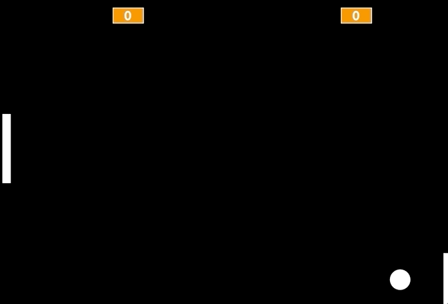

# Curso Alura - Lógica de programação: comece em lógica com o jogo Pong e JavaScript

## Aula 1 - Pong no Scratch

### Aula 1 - INtrodução - Vídeo 1

Transcrição  
Tudo bem, pessoal? Meu nome é Guilherme Lima, e neste curso iremos desenvolver o primeiro jogo lucrativo da história, um jogo de esporte conhecido por Pong, que simula um tênis de mesa. Este jogo foi tão importante que deu origem ao setor de games que conhecemos hoje.

Para entendermos como ele funciona, no jogo original temos uma imagem com dois traços simulando raquetes, e uma bolinha que interage com eles. Há também um tracejado no centro, identificando o meio da "quadra", e a pontuação é exibida no topo. Cada vez que a bolinha é lançada por uma raquete e a outra não consegue tocá-la, a primeira ganha um ponto.

Faremos algumas melhorias e mudanças neste jogo, para deixá-lo mais dinâmico e ágil. Inicialmente, vamos desenvolvê-lo utilizando a linguagem Scratch. Desenharemos as raquetes, desenvolveremos todo o nosso código para fortalecer a nossa lógica de programação. Utilizaremos as setas do teclado para movimentar as raquetes, e sempre que nós ou o nosso adversário marcar um ponto, temos um som, além de todos os principais efeitos na criação de um jogo — sonoros, visuais, de movimentação.

Em seguida, após aperfeiçoarmos nossa lógica de programação, desenvolveremos o mesmo jogo utilizando outra linguagem, o JavaScript.

E aí, estão preparados para este desafio? Vamos recriar este jogo clássico, e aprender a desenvolvê-lo utilizando duas linguagens distintas de programação?

### Aula 1 - Como usar o fórum - Vídeo 2

Transcrição  
Estou muito feliz que você dará os seus primeiros passos no mundo da programação.

Antes de iniciarmos com os estudos, gostaria de passar algumas recomendações para que você utilize nossa plataforma de modo mais eficaz. A primeira é o uso do fórum.

O fórum é um lugar especial e incrível onde podemos tirar dúvidas relacionadas ao curso. Então, pensando que em algum momento do curso você não obteve o mesmo resultado que o instrutor ou instrutora que estava ministrando a aula, há um local para tirar essas dúvidas.

Nós priorizamos que o fórum seja utilizado apenas para dúvidas. Caso não tenha nenhuma, você pode utilizá-lo para ajudar outras pessoas, fortalecendo a nossa comunidade da Alura.

Outra dica legal que quero recomendar é um local para postar o que aprendeu. "Poxa! Fiz um projeto incrível que ficou muito bonito. Eu posto ele no fórum?". Talvez não seja o local mais atrativo.

Dois locais muito bacana para postar os seus projetos são o Linkedin e o GitHutb. Quero mostrar para vocês dois projetos postados no Linkedin que alcançaram uma visibilidade muito maior do que o fórum da Alura, que é exclusivo para dúvidas.

O primeiro projeto que quero mostrar é dessa aluna, que fez algo incrível! Ela criou um texto no Linkedin. Caso você não saiba usar o Linkedin ou a finalidade dele, você pode realizar um cadastro, existem vários vídeos mostrando como fazer isso, e criar uma postagem, como uma das nossas alunas.

Ela escreveu um texto contando a experiência dela e, embaixo, colocou um GIF do código com o projeto finalizado, o que ficou muito legal. E foi o mesmo que outro aluno fez.

Ele comentou que estava continuando a formação de programação e agradece o instrutor, que no caso fui eu. Muito obrigado, fico feliz por isso. Embaixo do texto, ele colocou um GIF de como ficou o projeto dele, e ficou muito legal.

Então se você quer que outras pessoas vejam os projetos que você fez, poste no Linkedin ou no GitHub, que são ferramentas muito legais para isso. Vamos deixar o uso do fórum exclusivamente para dúvidas do curso.

Lembrando que se você não tem dúvidas, pode ajudar outras pessoas a entenderem, além de reforçar ainda mais o conhecimento que você adquiriu nos seus treinamentos.

Pensando nisso, comece a codar no próximo vídeo.

Vamos começar nosso treinamento.

### Aula 1 - Preparando o ambiente

Seja bem vindo
Olá, neste curso vamos criar um jogo do zero, utilizando duas linguagens de programação diferentes: [Scratch](https://scratch.mit.edu/) e [Javascript](https://www.alura.com.br/apostila-html-css-javascript/38CA-eventos-com-javascript) dentro do [P5](https://editor.p5js.org/).

> Neste treinamento, não usaremos uma IDE como VSCode, pois para executar a biblioteca precisaríamos subir um servidor e esse não é o objetivo do curso. Vamos dedicar toda atenção apenas no Javascript.

Vamos desenvolver o jogo do [Pong](https://pt.wikipedia.org/wiki/Pong), que é um jogo eletrônico de esporte que simula uma partida de tênis de mesa.


Conta
Você precisa de um cadastro para salvar e compartilhar seus projetos dentro do Scratch. Caso não tenha conta no Scratch, siga as instruções abaixo para criar sua conta:

Acesse o Scratch e clique na opção aderir ao scratch:


- Em seguida, escolha um nome e uma senha:
- Na sequência, preencha os formulário com outras informações:
- Informe seu email para concluir o cadastro:
- Agora, uma mensagem de boas vindas será exibida, mas ainda falta confirmar seu cadastro, clicando no link que o Scratch enviará para você por email.

Agora sim!

Tudo pronto. Vamos começar?

### Aula 1 - Primeiros passos com Scratch - Vídeo 3

Transcrição  
Vamos iniciar nossos estudos. A primeira coisa que faremos é acessar a plataforma Scratch. Na atividade anterior temos uma descrição de como é feito o login para utilizarmos essa ferramenta.

Após logarmos, clicaremos na opção "Criar". Na atividade anterior também temos um breve spoiler de como ficará o nosso jogo: teremos uma bolinha e duas raquetes sobre um fundo todo escuro, onde recriaremos o clássico jogo "Pong".

Existem algumas recomendações para conseguirmos criar esse jogo de maneira interessante. Após clicarmos em "Criar", o Scratch gera toda a estrutura da página. No ícone de "mundo" no canto superior esquerdo da página é possível selecionar ou alterar o idioma, no nosso caso "Português Brasileiro".

Na janela do canto inferior direito, temos um "Ator1" representado por um gato alaranjado, presente, por padrão, em todo projeto que é criado. Como não vamos utilizá-lo, poderemos removê-lo clicando no ícone de lixeira.

Nós vamos desenhar tanto a nossa bolinha quanto as raquetes. Para isso, clicaremos na opção "Selecionar um Ator", abrindo um menu com diversas outras opções, como "Enviar Ator", para fazer o upload de um desenho que já temos no computador; "Surpresa", para criar um ator aleatório provido pela plataforma; e "Pintar", que usaremos nesse treinamento.

Ao clicarmos em "Pintar", será exibida uma janela com layout semelhante ao Paint. Clicamos no círculo e o desenharemos na área pontilhada. Quando fazemos isso, é possível que o círculo fique bastante elíptico, semelhante a um ovo, algo que não queremos. Para mantermos o desenho com uma estrutura arredondada, seguraremos o botão "Shift" do teclado enquanto clicamos e arrastamos na área.

Repare que todas as bolinhas que desenhamos aparecem na cor roxa e com um contorno preto em volta. Para removermos esse contorno, clicaremos na seta no menu à esquerda e em seguida na bolinha. No menu acima, selecionaremos "Contornar" e clicaremos na opção de remover o contorno, representada por uma reta diagonal em vermelho.

Uma coisa bastante importante é centralizar nossos atores. A nossa bolinha, por exemplo, não está alinhada com o centro da área pontilhada, representado por uma bolinha cortada por uma cruz. Da forma que está agora, se quisermos que nosso ator vá para uma posição específica, não teremos o comportamento esperado.

Sendo assim, arrastaremos a bolinha para o centro da área, o que fará com que ela também seja centralizada no jogo. Também é possível centralizar o nosso ator por meio do código, algo que aprenderemos mais adiante.

A bolinha que criaremos não pode ser muito pequena, pois isso pode causar um bug no qual a bolinha entra na raquete. Além disso, ela também não pode ser muito grande. Isso também vale para a raquete.

Vamos desenhar um novo ator usando a opção "Selecione um Ator > Pintar". Se tentarmos desenhar usando a reta na lateral esquerda da página, teremos uma linha muito fina e que não se parece com a raquete do jogo Pong. Utilizaremos a ferramenta quadrilátero, representada por um quadrado, e desenharemos um retângulo com as proporções ideais. Também removeremos o contorno da raquete e a centralizaremos.

Na tela do jogo nossos atores estarão um em cima do outro, e mais adiante aprenderemos a definir, por meio do código, suas respectivas posições - uma raquete de cada lado, a bolinha na área de jogo e o placar na parte superior. Para que você não tenha nenhum "bug" em seu jogo, lembre-se de seguir os passos que fizemos durante a aula. Você pode até mudar a cor dos seus atores da forma que preferir.

No próximo vídeo daremos os primeiros passos na criação do nosso jogo.

### Aula 1 - Desenho dos atores

No processo de criação dos atores, é necessário pintar o ator. Para a bolinha, precisamos fazer um círculo e, para a raquete, utilizamos um retângulo. Os atores podem ou não ter a mesma cor, isso é opcional, ou seja, cada ator pode ter sua singularidade. Entretanto, o que ambos os atores devem ter em comum?

Alternativa correta

Os atores precisam estar centralizados, para que as coordenadas que iremos utilizar na programação representem-nos verdadeiramente.

> A centralização dos objetos que desenhamos fará toda a diferença no projeto devido ao sistema de coordenadas. Se o objeto não estiver centralizado irá acontecer alguns bugs, principalmente quando precisamos inverter a direção do ator.

### Aula 1 - Bolinha e minha raquete - Vídeo 4

Transcrição  
Vamos começar a criar nosso jogo de Pong com o Scratch, para fortalecermos nossa lógica de programação! Relembrando que a bolinha atuará em posições aleatórias, e temos que acertá-la, colidindo com ela por meio das raquetes. Acessaremos o site do Scratch — caso não esteja logado em sua conta, na etapa anterior há uma explicação de preparação do ambiente, com um passo a passo do que é necessário para criá-la.

Clicaremos em "Criar", no menu superior, e para configurarmos a língua utilizada, poderemos clicar no ícone de globo localizado no menu do topo, e selecionar "Português Brasileiro". No Pong, temos um fundo preto, e a bolinha e as raquetes na cor branca. Vamos deletar o gatinho clicando no "x" do painel inferior direito, ou clicando com o lado direito do mouse e selecionando "Apagar".

Feito isso, clicaremos no painel "Palco", no canto inferior direito, na aba "Cenários" no painel principal, e trocaremos a cor de preenchimento para preto, que será a mesma cor do contorno. Selecionaremos a ferramenta de quadrado e criaremos um que ocupe todo o espaço disponível.

Para criarmos a bolinha, clicaremos no ícone com a face de um gato no canto inferior direito da tela para selecionarmos um ator, que pode ser algum próprio da galeria do Scratch. No caso, queremos personalizá-lo, portanto clicaremos na opção "Pintar", o que abrirá um editor bem similar ao que utilizamos para pintar o cenário. Desta vez, tanto a cor quanto o contorno serão em branco. Com a ferramenta de círculo, desenharemos uma bolinha. Alinhe o centro do círculo desenhado à tela do painel, pois a discrepância entre esses pontos pode gerar bugs no jogo como a bolinha pular de posição ou mesmo rebater várias vezes na raquete.

Sobre o painel localizado à direita, para testarmos, clicaremos no ícone de bandeira verde, porém nada acontece. Geralmente, quando jogamos algo, os personagens não ficam posicionados aleatoriamente, tampouco na última posição em que estiveram. Isto é, eles possuem uma posição inicial, e neste jogo não será diferente.

Selecionaremos uma posição inicial para a nossa bolinha clicando em "Eventos", e em "quando [ícone de bandeira verde] for clicado", que arrastaremos ao painel principal. Depois, clicaremos em "Movimento" e em "vá para x: 182 y: -135", que também arrastaremos ao painel principal, encaixando na primeira "peça". Clicaremos nestes valores para os alterarmos para 0 e 0.

Assim, ao clicarmos no ícone de bandeira verde, teremos que a bolinha começa no centro do jogo. Agora, precisaremos movimentá-la! Clicaremos e arrastaremos "mova 10 passos" para o painel principal, encaixando-a na peça anterior. Clicando no ícone de bandeira verde, a bolinha se locomove um pouco para a direita, mas se clicarmos novamente, nada acontece.

Acontece que, quando nosso jogo se inicia, ele faz o que está definido na segunda peça e logo muda para a terceira, entretanto, isto ocorre apenas uma vez, quando na verdade queremos que a bolinha siga se movimentando. Para isso, clicaremos e arrastaremos outro evento "quando [ícone de bandeira verde] for clicado" para cima de "mova 10 passos", formando um segundo conjunto. E então clicaremos em "Controle" e em "sempre", que arrastaremos ao segundo conjunto, englobando o "mova 10 passos".

Assim, o movimento acontecerá sempre, ou seja, os 10 passos serão adicionados continuamente. Ao testarmos, a bolinha começará no centro e terminará no canto direito da tela, visível pela metade. Para um movimento de vai e volta, existe um código em "Movimento" que verifica essa colisão com as bordas da nossa tela, denominada "se tocar na borda, volte", o qual posicionaremos dentro de "sempre", abaixo de "mova 10 passos".

Aumentaremos a velocidade da bolinha aumentando o número de passos para 12. Entretanto, deste modo o movimento se dará apenas horizontalmente, então, poderemos indicar uma direção para ela, acrescentando "aponte para a direção 90" logo abaixo de "vá para x: 0 y: 0". Reparem que, ao clicarmos no valor, é demonstrado um círculo para demonstrar que o movimento se inicia em 90º. Vamos alterá-lo para 45.

Desta vez, a nossa bolinha se movimenta em vários sentidos, de acordo com essa angulação. E como é que iremos interagir com este jogo? Teremos raquetes, atores que criaremos a seguir!

### Aula 1 - Direção de movimento

Para realizar a movimentação da bolinha, utilizamos o bloco mova 10 passos.

Esse bloco cria a movimentação de acordo com a direção que o ator estiver apontando. Desse modo, se o ator estiver apontado para a direção de 90 graus, ele vai andar para a direita; se estiver apontado para a direção de 180 graus, o ator vai andar para baixo; se for 0 grau, o ator vai andar para cima; se apontar para -90 graus, o ator vai andar para a esquerda.

Se a direção da bolinha for de -180 graus, para qual direção ela irá se deslocar?

Resposta:

Para baixo.

> Ao girar 180º no sentido horário ou anti-horário, chegaremos na mesma posição.

### Aula 1 - Bolinha e minha raquete parte 2 - Vídeo 5

Transcrição  
Renomearemos o novo ator para "bolinha", e pintaremos outro ator, denominado "minha raquete", um retângulo de preenchimento e contorno brancos, para simular uma das raquetes. Na aba "Código", uma vez que queremos que ele comece do lado esquerdo da tela, enquanto a bolinha está no centro, definiremos que quando a bandeira verde for pressionada, queremos que a raquete vá para X -220 e Y 0.

Isso, porém, ainda não fará com que a raquete se movimente, pois não programamos nosso jogo para fazer isso. Queremos utilizar nosso teclado para que a raquete se mova verticalmente, e para fazermos isto de forma organizada, arrastaremos outro "quando [ícone de bandeira verde] for clicado" e encaixaremos abaixo dele "se [hexágono] então", existente em "Controle".

De "Sensores", clicaremos e arrastaremos "tecla espaço pressionada?" no espaço onde havia o símbolo de hexágono, e modificaremos "espaço" para "seta para cima". Assim, se a seta para cima for pressionada, a bolinha irá para cima. Sempre que tivermos dúvidas em relação a X e Y, no canto inferior esquerdo do programa podemos clicar em "Selecionar Cenário" e em "Xy-grid", que utilizaremos como gabarito. O X corresponde ao eixo horizontal, enquanto o Y corresponde ao eixo vertical.

Então, assim que a seta para cima for pressionada, queremos que a raquete vá para cima também. Ou seja, adicionaremos um valor para Y, e para tal clicaremos e arrastaremos "adicione 10 a y" dentro de "se [hexágono] então". Ao testarmos, porém, a raquete não se movimenta, já que o código é executado assim que o jogo é ligado, momento em que ainda não estamos com a tecla da seta para cima pressionada, e esta verificação é feita apenas uma vez.

Para resolvermos isso, envolveremos todo o segundo bloco abaixo de "quando [ícone de bandeira verde] for clicado" em outro, "sempre". No entanto, isso fará com que consigamos mover a raquete apenas para cima, portanto duplicaremos o bloco envolvido por "sempre" — clicando com o lado direito do mouse e em "Duplicar" — e substituiremos "seta para cima" por "seta para baixo", e o valor 10 por -10.

A bolinha ainda não está colidindo com a raquete, ultrapassando-a e tocando a lateral da tela. Podemos, inclusive, visualizar isto melhor diminuindo a velocidade da bolinha, que queremos que mude de direção assim que tocar na raquete. Podemos criar um bloco para verificar se estamos tocando na borda.

Para deixar o código organizado, é possível clicar com o lado direito do mouse no painel principal e em "Limpar Blocos".

Continuando, criaremos mais um bloco de código para quando o jogo for iniciado, para verificarmos se a bolinha está tocando a raquete. Teremos, então, "quando [ícone de bandeira verde] for clicado", e logo abaixo, "se [hexágono] então", cujo hexágono será preenchido por "tocando em minha raquete?".

Para invertermos a rota da bolinha, reconhecendo a colisão com a raquete e alterar a direção, inverteremos o valor multiplicando-o por -1. De "Movimento", clicaremos e arrastaremos "aponte para a direção 90" para dentro de "se 'tocando em minha raquete?' então". Substituiremos o valor 90 pela opção "direção".

De "Operadores" selecionaremos o bloco verde com "[] * []", e para o primeiro espaço arrastaremos o "direção" que tínhamos movimentado anteriormente, o qual multiplicaremos por -1, valor que digitaremos no segundo espaço do bloco. Daí, sim, encaixaremos o bloco final para onde "direção" estava antes, de modo a ficar "aponte para a direção 'direção * -1'".

Porém, mais uma vez, o código só foi executado uma vez, quando o jogo se iniciou. Envolveremos todo o bloco do "se..." em outro, "sempre". Agora, sim, temos o comportamento esperado!

### Aula 1 - Movimento da Raquete

A movimentação da raquete é realizada por meio de duas teclas: setas para cima ou para baixo. Essas teclas podem ser alteradas conforme a preferência da pessoa que está programando, ou seja, é possível alterar para as teclas W e S, desde que ela programe de maneira correta.

Entretanto, na execução do código abaixo, a movimentação na vertical não está ocorrendo (para cima e para baixo):


Qual é o erro que está ocorrendo neste caso?

Resposta

Ao invés de utilizar a coordenada cartesiana X, devemos utilizar a coordenada Y, pois ela é responsável por realizar deslocamentos na vertical.

> Lembrando que valores positivos a Y deslocam o ator para cima e valores negativos a Y deslocam o ator para baixo.

### Aula 1 - Oponente e placar - Vídeo 6

Transcrição  
A colisão da bolinha com a raquete está funcionando bem, porém a bolinha está se movimentando muito devagar e, além disso, nosso oponente é a parede. Vamos corrigir estes pontos alterando o bloco de código referente ao movimento da bolinha para "mova 12 passos" e duplicando a raquete que criamos clicando com o lado direito do mouse sobre o ator "minha raquete" e depois em "Duplicar".

Por ser uma cópia, a segunda raquete fará exatamente os mesmos movimentos da primeira, portanto não iremos enxergá-la. Em relação ao bloco de código da segunda raquete, então, substituiremos o bloco "vá para x: -220 y: 0" por "vá para x: 239 y: 9". Vamos ajustar o eixo Y da segunda raquete para que fique alinhada à primeira, mudando seu valor de 9 para 0.

Com isso, se testarmos o jogo, as duas raquetes se movimentam de forma similar, sincronizadas, cada uma de um lado da tela. Assim, iremos remover os blocos "se..." da primeira raquete, responsáveis pelos seus movimentos. Queremos que a raquete do oponente se movimente para colidir com a bolinha, assim que ela voltar da colisão com a primeira raquete.

Poderíamos passar a posição da bolinha para a raquete do oponente, porém, para cada ator no Scratch existem códigos em "Movimento" denominados "posição x", "posição y". Todavia, não queremos saber se a bolinha estará mais para a direita ou para a esquerda, pois o movimento da raquete do oponente também será na vertical. Isto é, precisaremos passar a posição Y da bolinha.

Sendo assim, criaremos uma variável para guardar este valor, de modo a conseguirmos compartilhá-lo com outros atores. Acessaremos a opção "Variáveis" e clicaremos em "Criar uma Variável"; ela se chamará "posição y da bolinha". Sempre que a bolinha se movimentar, o valor desta variável será alterada, e para isso acrescentaremos "mude 'minha variável' para 0" entre "mova 12 passos" e "se tocar na borda, volte". Alteraremos "minha variável" para "posição y da bolinha", e encaixaremos "posição y" no lugar de "0".

Reparem que, ao criarmos uma variável, existem as opções de visibilidade "Para todos os atores" e "Apenas para este ator"; no caso, escolhemos a primeira. Agora, para que a raquete do oponente se mova verticalmente, incluiremos "deslize por 1 segs. até x: 236 y: 56" dentro de "sempre", sendo que a posição X será a mesma do início, 239, enquanto a Y será substituída por "posição y da bolinha".

Ao testarmos, teremos que a raquete não está seguindo a bolinha. Isto acontece pois deixamos o deslize durante 1 segundo, então o alteraremos para 0, para que ele ocorra no mesmo momento que a bolinha. A posição Y da bolinha está aparecendo na tela — será que a pessoa que for jogar precisará desta informação?

Vamos esconder esta variável selecionando o ator bolinha e incluindo, no primeiro bloco de código, "esconda a variável 'posição y da bolinha'", logo após o "aponte para a direção 45". Nosso jogo está cada vez melhor, mas será que a raquete do oponente realmente está tocando na bolinha, isto é, existe a colisão?

Para enxergarmos isto, vamos diminuir novamente a velocidade da bolinha, de 12 para 2, e clicar no ícone da bandeira verde. A bolinha está tocando na borda da tela, ultrapassando a segunda raquete! Para o código correspondente a esta ação feito para a primeira raquete, iremos a "Operadores", clicaremos e arrastaremos o losango composto por "[hexágono] ou [hexágono]" para o painel principal, dentro do bloco "se...".

Para o primeiro espaço de hexágono, arrastaremos "tocando em 'minha raquete'?", preexistente no bloco "se...", e para o segundo espaço traremos de "Sensores" a opção "tocando em 'raquete do oponente'?".

Neste momento, a segunda raquete estava nomeada como "minha raquete2" por default, por ser uma cópia, lembram? Basta renomeá-la para darmos um sentido melhor para ela, como para "raquete do oponente".

Isso quer dizer que se a bolinha estiver tocando na "minha raquete" ou em "raquete do oponente", esperamos que a direção seja alterada, resultando na efetiva colisão. Entretanto, teremos um problema: o oponente sempre irá seguir a posição da bolinha, ou seja, ele nunca irá errar. Consequentemente, nossas chances de ganharmos o jogo será mínima. Precisaremos pensar em alguma maneira de aumentá-las!

### Aula 1 - Variáveis

Com a constante movimentação do ator “bolinha”, as coordenadas x e y também são alteradas. Para que possamos coletar as informações atualizadas da posição do ator “bolinha”, podemos criar uma variável a fim de armazenar os valores das coordenadas. Por meio dessa variável, o ator “raquete do oponente” poderá “ver” as coordenadas x e y do ator “bolinha”.

Para essa aplicação, dependendo da sua criação, qual é uma possível limitação da variável?

Resposta

A variável deve ser vista “para todos os atores”.

> Isso! Uma vez que a variável é “somente para este ator”, é uma variável local. Nesse caso, precisamos de uma variável global que todos os atores possam ver.

### Aula 1 - Oponente e placar parte 2 - Vídeo 7

Transcrição  
Estamos passando à raquete do oponente a posição Y da bolinha... E se manipulássemos este valor, incluindo uma margem de erro? Então, em vez de passarmos a posição exata da bolinha em "mude 'posição y da bolinha' para 0", incluiremos no lugar de 0 um bloco de operação "[] - []", que terá no primeiro espaço "posição y", e no segundo, 50. Além disso, voltaremos a aumentar a velocidade da bolinha para 12.

Ao testarmos, em dado momento a bolinha toca a lateral da tela, e não a raquete do oponente, o que significaria o ganho de um ponto para nós. Mas como é que iremos saber disso? De que forma contabilizaremos isso? Seria interessante se estas pontuações ficassem visíveis de alguma forma.

Já sabemos que armazenamos valores na memória do nosso computador por meio de variáveis. Por conta disso, criaremos duas variáveis, disponíveis para todos os atores — uma para armazenamento dos nossos pontos, denominada "meus pontos", e outra para os pontos do oponente, "pontos do oponente". Deixar da maneira padrão não é tão interessante visualmente, então clicaremos sobre elas com o lado direito do mouse para verificarmos as opções de exibição das variáveis; neste caso, escolheremos "letras grandes".

Também é possível clicar duas vezes sobre a exibição das variáveis para alterá-las!

Apesar de termos incluído esta exibição de pontuação, os pontos não estão sendo marcados ainda. Isso porque ainda não programamos desta forma. Precisaremos indicar que, assim que a bolinha tocar na lateral da tela (e não nas raquetes), queremos que um ponto seja marcado para o adversário. O valor do X identifica este momento, então, se X for menor que 229, queremos acrescentar um ponto para o oponente.

Para fazermos esta verificação, manteremos o ator "bolinha" selecionado e criaremos o código correspondente: "quando [ícone de bandeira verde] for clicado", seguido por "se [hexágono] então", cujo hexágono ficará com "'posição x' < -229", e dentro do qual teremos "adicione 1 a 'pontos do oponente'". Todo código inserido em uma repetição, isto é, que acontece mais de uma vez, tem uma borda dourada.

Da maneira em que está, este último bloco de código possui esta borda assim que clicamos no ícone de bandeira verde, mas ela não se mantém. É necessário envolvermos o bloco contendo "se..." em outro, "sempre". Além disso, queremos poder criar nossos próprios pontos, então dentro de "sempre" acrescentaremos outro bloco "se...", que ficará "se 'posição x' > 229 então" acompanhado por "adicione 1 a 'meus pontos'".

Entretanto, ao testarmos, o jogo se inicia com 2 pontos para o adversário. Para corrigirmos isto, acrescentaremos "mude 'meus pontos' para 0" e "mude 'pontos do oponente' para 0" após "esconda a variável 'posição y da bolinha'". Testando o jogo, perceberemos que tudo funciona conforme esperado.

Porém, as verificações constantes acabam consumindo memória, então poderemos alterar este último "se..." para algo que espere até que se atinjam estas posições da bolinha que definimos nas condições. Isso fará com que ganhemos em processamento, pensando na otimização do nosso jogo. Este último bloco será separada em dois:

quando [ícone de bandeira verde] for clicado

sempre

  espere até que 'posição x' < -229

  adicione 1 a 'pontos do oponente'
  ```


E

quando [ícone de bandeira verde] for clicado

sempre

  espere até que 'posição x' > 229

  adicione 1 a 'meus pontos'
  ```


### Aula 1 - Pontuação

Para desenvolver um algoritmo de pontuação do jogo Pong, é necessário avaliar se a bolinha realmente passa sem que seja rebatida pela raquete.

Para descrever essa situação em código, qual é o principal valor de referência que devemos avaliar para gerar essa pontuação?

Alternativa correta  
Verificar se a coordenada x do ator “bolinha” é maior do que a coordenada x do ator “raquete do oponente” ou menor do que a coordenada x do ator “minha raquete”.

> Lembre-se sempre que, com coordenadas negativas, a referência muda, por essa razão, precisamos alterar as condições lógicas de maior (>) para valores de posição X maior que zero (no caso maior que 229), e menor (<) para valores de posição X menor do que zero (no caso -229).

### Aula 1 - Sons e compartilhando o jogo - Vídeo 8

Transcrição  
Nosso jogo está ficando muito legal, temos as colisões da bolinha nas raquetes, a marcação de pontos... Mas há um recurso faltando em nosso jogo, existente na maioria dos jogos: o som, que nos auxilia na ambientação. No Scratch, temos a aba "Sons", e ao clicarmos nele, teremos um som padrão, que iremos deletar. No canto inferior esquerdo, há um ícone de alto falante para selecionarmos um som de nossa preferência.

Que categoria de som combina mais com o nosso jogo? "Esportes", talvez, composta por sons variados, dentre eles, de tênis e ping pong. Escolheremos este último (Ping Pong Hit, que poderá ser renomeado para "raquetada", por exemplo), e poderemos editá-lo clicando na opção "Cortar Trecho", cortando o primeiro barulho da bolinha batendo e mantendo apenas o segundo. Clicaremos em "Salvar" e voltaremos à aba "Código".

Como queremos que este som toque quando a bolinha colidir com qualquer uma das raquetes, de "Som" clicaremos e arrastaremos "toque o som 'raquetada'". Os blocos ficarão da seguinte maneira:

quando [ícone de bandeira verde] for clicado

sempre

   se "tocando em 'minha raquete'? ou 'tocando em 'raquete do oponente'?"

   aponte para a direção "direção" * -1

   toque o som "raquetada"

Testaremos e diminuiremos o volume do som na aba "Sons". Agora, podemos definir um som para quando se marca um ponto. Escolheremos "Coin" da categoria "Efeitos", diminuiremos seu volume e alteraremos seu nome para "ponto". Acrescentaremos "toque o som 'ponto'" nos blocos de código referentes tanto à nossa pontuação quanto ao do oponente, dentro dos laços "sempre".

Também acrescentaremos uma trilha sonora de fundo ao nosso jogo. Para isto, temos a categoria "Loops". No código, como queremos que o som comece a tocar assim que iniciamos o jogo, posicionaremos "toque o som 'trilha sonora' até o fim" no primeiro bloco. Porém, para que ele toque sem parar, devemos inclui-lo em um bloco "sempre".

Para mostrarmos o jogo para outras pessoas, no topo do programa existe um nome, no caso, "Untitled-36", lado do botão "Compartilhar". Vamos trocar este nome para "Pong com Scratch" e clicar no botão "Ver a Página do Projeto". Na parte de instruções, podemos escrever algo como:

"Utilize as setas para cima e para baixo para movimentar a raquete!"

Por fim, basta clicarmos em "Compartilhar", na parte superior da tela, e distribuir o link exibido na barra de endereços do navegador. Agora que desenvolvemos a nossa lógica de programação, vamos partir para outro desafio — criar este mesmo jogo utilizando outra linguagem de programação, o JavaScript.

### Aula 1 - Faça como eu fiz na aula

Sua vez!
Queremos criar o Pong, um jogo onde temos 2 raquetes, uma bolinha e um placar indicando os pontos de cada jogador utilizando o Scratch como linguagem de programação. Sabendo disso, siga todos os passos realizados por mim durante os vídeos desta aula e desenvolver do zero este grande clássico do mundo dos jogos.

Faça a bolinha deslizar dentro das bordas da tela do jogo, movimente uma raquete através das setas para cima e para baixo do teclado e movimente o oponente informando a posição yda bolinha. Crie 2 variáveis para armazenar a quantidade de pontos de cada jogador e adicione sons no jogo!

Atenção! Caso seu jogo apresente o comportamento de ficar com a bolinha presa na requete e com isso travar o jogo contabilizando vários pontos, dê uma olhada neste tópico do fórum que traz uma solução para este bug do Scratch.

Opinião do instrutor

Resumo do código

- ator bolinha:
- ator minha raquete:
- ator raquete oponente:

O gabarito deste exercício é o passo a passo demonstrado no vídeo. Tenha certeza de que tudo está certo antes de continuar.

Ficou com dúvida? Recorra ao nosso fórum, não perca tempo!

### Aula 1 - Jogo mais difícil

Para movimentar a raquete do oponente de forma inteligente, uma pessoa desenvolveu o seguinte código no ator bolinha:


E ator raquete oponente:


Após jogar algum tempo, percebeu que o jogo estava muito fácil, pois o oponente errava muito.

Com base no código usado pela pessoa, o que ela pode fazer para a raquete do oponente acertar mais a bolinha?

Alternativa correta  
No código de ator bolinha, a pessoa pode diminuir o valor do subtraendo.

> Certo! Quanto mais próximo de 0 for o subtraendo, mais perfeito será o movimento da raquete do oponente. Conforme diminuímos esse valor, também reduzimos a chance de erro da raquete do oponente.

### Aula 1 - O que aprendemos?

Nessa aula:

- Desenvolvemos o jogo do Pong utilizando a linguagem de programação Scratch;
- Implementamos a colisão da bolinha com as bordas, minha raquete e a raquete do oponente;
- Movimentamos a raquete do oponente de forma individual, para acertar a bolinha na maioria das vezes;
- Criamos o placar do jogo, indicando os meus pontos e do oponente;
- Adicionamos sons e editamos a página do jogo no Scratch para que outras pessoas possam jogar.

Projeto desta aula
[Neste link, você pode acessar o jogo](https://scratch.mit.edu/projects/303401594/), ver o projeto por dentro e fazer um remix se preferir.

[Neste link, você encontra o jogo](https://cdn3.gnarususercontent.com.br/555-Pong-com-P5Js/aula1/Pong+com+Scratch.sb3) do que foi desenvolvido nesta aula para download.

Na próxima aula
Vamos desenvolver este mesmo jogo, em outra linguagem de programação:

## Aula 2 - Iniciando no JavaScript

### Aula 2 - Cenário e bolinha - Vídeo 1

Transcrição  
Desenvolvemos nosso jogo e consolidamos a lógica de programação! Agora, vamos desenvolvê-lo em outra linguagem de programação, o JavaScript. Mas onde iremos fazer isso, e como iremos visualizá-lo?

Utilizaremos um serviço Web chamado p5.js, que exige cadastro de uma conta para podermos salvar os nossos projetos. Iremos manter o Scratch aberto, também, para fazermos algumas comparações. Nele, temos o ícone de bandeira verde, enquanto no p5 temos um botão de play que, ao ser pressionado, habilita um quadrado de "Preview"; na área de código, há algumas linhas preexistentes.

O fundo cinza em "Preview" é criado a partir da função createCanvas(), que possui dois valores, ambos 400. Vamos testar alterando somente o primeiro para 800. Isto fará com que a largura do retângulo cinza, que é onde será exibido nosso jogo, aumente. As alterações feitas no código se refletem ao seu lado conforme são feitas.

Também temos a função background(), cujo valor default é 220. Trocaremos para 260, e o fundo ficará todo branco, em vez de cinza. Quanto menor este valor, mais escuro fica o fundo do retângulo que antes era cinza. Por isto, deixaremos 0 para que o fundo do nosso jogo fique preto.

Há um problema: no Scratch, todo o código fica visível e é intuitivo montá-los, bastando buscá-los de acordo com o que queremos fazer dentre as opções disponibilizadas. Começaremos desenhando uma bolinha, tal como fizemos no Scratch. Simplesmente escrever circulo dentro do bloco de código de draw() não nos traz nenhum retorno, e ainda dá erro — "circulo is not defined", ou "circulo não está definido".

Para buscarmos pelos códigos necessários, clicaremos em "Help & Feedback" e em "Reference", o que abrirá uma nova aba. Em Shape, dentre as funções listadas, está circle() que, após clicarmos, exibirá um exemplo: circle(30, 30, 20). Descendo um pouco a página, temos a explicação da sua sintaxe, circle(x, y, d), cujos parâmetros são, respectivamente, a coordenada no eixo X, no eixo Y e o diâmetro do círculo.

Lembrando que o diâmetro é o dobro do raio de uma circunferência, que é a linha que liga o centro da mesma à sua borda.

O trecho de código ficará, portanto, assim:

```JavaScript
function setup() {
    createCanvas(600, 400);
}
function draw() {
    background(0);
    circle(0, 0, 50);
}
```

Ao pressionarmos o botão de play, teremos cerca de 1/4 do círculo posicionado no canto superior esquerdo da tela. Por quê será que isso acontece? No Scratch, definimos como posição inicial da bolinha a coordenada (0, 0), a partir do centro, enquanto aqui o plano cartesiano, isto é, a movimentação nos eixos X e Y será um pouco diferente: o (0, 0) da nossa tela passa a ser o extremo canto superior esquerdo, exatamente onde se encontra a bolinha no momento.

Será necessário, portanto, aumentar os valores deles para que a bolinha fique visível e localizada no centro da tela. E para que o código fique ainda mais claro e legível, armazenaremos tais valores em variáveis, usando a palavra let:

```JavaScript
let xBolinha = 300;
let yBolinha = 200;
let diametro = 15;

function setup() {
    createCanvas(600, 400);
}

function draw() {
    background(0);
    circle(xBolinha, yBolinha, diametro);
}
```

As nomenclaturas de variáveis seguem a convenção de terem a primeira letra da primeira palavra em minúscula, e as primeiras letras das demais palavras, se houver, em maiúscula. Esta convenção se denomina Camel Case.

Agora, precisaremos fazer com que ela se movimente, em ambos os eixos. Para isso, indicaremos na função draw() que xBolinha sempre terá acréscimo de 1, o que fará com que a bolinha se movimente para a direita, em linha reta.

```JavaScript
function draw() {
    background(0);
    circle(xBolinha, yBolinha, diametro);
    xBolinha = xBolinha + 1;
}
```

O 1, então, seria a velocidade com que a bolinha se movimenta, porém isto não fica claro em nosso código. Criaremos a variável velocidadeXBolinha, para a qual atribuiremos o valor 6, para testarmos, e teremos xBolinha = xBolinha + velocidadeXBolinha. Com isto, a bolinha se locomove para a direita até sumir da tela.

Uma forma mais elegante de escrevermos esta mesma linha é xBolinha += velocidadeXBolinha, ou seja, o X da bolinha será seu valor acrescido de sua velocidade. Como queremos que a bolinha se movimente para direções distintas, criaremos yBolinha, e a variável velocidadeYBolinha, com valor 6.

```JavaScript
let xBolinha = 300;
let yBolinha = 200;
let diametro = 15;

let velocidadeXBolinha = 6;
let velocidadeYBolinha = 6;

function setup() {
    createCanvas(600, 400);
}
function draw() {
    background(0);
    circle(xBolinha, yBolinha, diametro);
    xBolinha += velocidadeXBolinha;
    yBolinha += velocidadeYBolinha;
}
```

Assim, sempre que iniciarmos o jogo, a bolinha surgirá do centro, indo para baixo diagonalmente até desaparecer na tela. Não é bem isso que queremos, e sim que ela permaneça dentro das bordas da tela. Faremos isso a seguir!

### Aula 2 - Cor do fundo

Nesta aula, aprendemos a trabalhar em um editor de texto chamado p5.js. Se quisermos alterar a cor do preview, qual função devemos usar?

background()

Alternativa correta. Ao modificarmos os valores dessa função, teremos uma alteração na tonalidade do preview.

### Aula 2 - Velocidade da bolinha

Criamos 2 variáveis para movimentar os eixos x e y da bolinha, como ilustra o código abaixo:

```JavaScript
let velocidadeXBolinha = 6
let velocidadeYBolinha = 6
```

O que acontecerá se alterarmos os valores numéricos para 3, ao invés de 6, como mostra o código abaixo?

```JavaScript
let velocidadeXBolinha = 3
let velocidadeYBolinha = 3
```

Alternativa correta  
A velocidade da bolinha diminuirá.

> Alternativa correta. Quanto maiores os valores das variáveis de velocidade para os eixos x e y da bolinha, maior será sua velocidade. Logo, ao diminuirmos esses valores, a velocidade também diminuirá.

### Aula 2 - Colisão com as bordas - Vídeo 2

Transcrição  
A bolinha está se movendo para além das bordas do nosso jogo, e não é este o comportamento que queremos. Queremos que, assim que ela toque uma das bordas, ela inverta a posição, assim como fizemos no Scratch. Para isto, precisamos verificar se ela está tocando a borda em algum momento, dentro da função que está desenhando o nosso jogo (draw()).

Na programação, esta verificação, o "se", é escrito com if, e usaremos uma variável que o próprio p5 disponibiliza. Além disso, comentaremos a linha contendo yBolinha. Se xBolinha for maior que a largura (width) da tela, queremos fazer algo, que por sua vez estará entre chaves (ou "bigodes"). No caso, iremos multiplicar velocidadeXBolinha por -1, para que ela se movimente no sentido oposto.

```JavaScript
function draw() {
    background(0);
    circle(xBolinha, yBolinha, diametro);
    xBolinha += velocidadeXBolinha;
    //yBolinha += velocidadeYBolinha;

    if (xBolinha > width) {
        velocidadeXBolinha *= -1;
    }
}
```

Ao testarmos este código, a bolinha parte da área central da tela, colide com a lateral direita da tela, inverte o sentido, e desaparece quando ultrapassa a lateral esquerda da tela. Sabemos que esta lateral esquerda é o X = 0, portanto acrescentaremos outra condição no código, por meio de duas barras verticais, o que quer dizer "ou":

```JavaScript
if (xBolinha > width || xBolinha < 0) {
    velocidadeXBolinha *= -1;
}
```

Desta vez, temos a bolinha reconhecendo tanto o limite lateral direito quanto o esquerdo. Para lidarmos com os movimentos verticais, descomentaremos a linha com yBolinha e comentaremos a linha com xBolinha, para melhor entendimento. Faremos algo bem similar ao que fizemos anteriormente, em relação a X, mas desta vez lidaremos com a altura (height) da tela.

```JavaScript
function draw() {
    background(0);
    circle(xBolinha, yBolinha, diametro);
    //xBolinha += velocidadeXBolinha;
    yBolinha += velocidadeYBolinha;

    if (xBolinha > width || xBolinha < 0) {
        velocidadeXBolinha *= -1;
    }
    if (yBolinha > height || yBolinha < 0) {
        velocidadeYBolinha *= -1;
    }
}
```

Descomentaremos a linha com xBolinha e verificaremos que as bordas estão sendo reconhecidas, como gostaríamos.

### Aula 2 - Sintaxe do IF

Usamos as condicionais para realizar uma verificação de algum aspecto do código e executar uma ação.

Qual é a sintaxe correta para escrevermos uma condicional, em programação na linguagem JavaScript, a fim de verificar se a posição da bolinha no eixo x é maior que a largura da tela?

Alternativa correta  
> if (xBolinha > width) { }

Alternativa correta. Nessa opção, temos a condicional apresentada com if, seguido da variável em parênteses e, ao fim, o par de chaves para indicar a ação.

### Aula 2 - Comentários no código

Durante a aula aprendemos como fazer comentários (ou anotações) no nosso código. Se escrevermos uma parte do nosso código da seguinte maneira, o que acontecerá com o código ao executarmos?

xBolinha += velocidadeXBolinha;
//yBolinha += velocidadeYBolinha;

Resposta

A bolinha irá se mover apenas no eixo X, o eixo Y não será lido durante a execução, uma vez que está com um comentário.

> Alternativa correta. As duas barras no início da linha indicam que há um comentário ou anotação e, portanto, a linha não será considerada na execução do código.

### Aula 2 - Raio e diâmetro - Vídeo 3

Transcrição  
Alteraremos as velocidades relativas tanto ao eixo X quanto ao eixo Y para 2 para deixar a bolinha mais lenta e assim conseguirmos observar melhor estes movimentos. Uma parte da bolinha ainda ultrapassa os limites das bordas, e não queremos que isso aconteça. Vamos voltar às velocidades originais, 6, e pensar no porquê disso estar acontecendo.

Na documentação do circle(), é indicado que o X é o centro do círculo, o que será levado em consideração para que se reconheça que houve uma colisão da bolinha com alguma das bordas. No entanto, queremos que isto se dê a partir do raio, isto é, das extremidades da bolinha. Uma vez que o diâmetro é 2x o valor do raio, criaremos a variável raio, que receberá diametro / 2.

Com isso, diminuiremos as velocidades da bolinha novamente (para 2), para enxergarmos melhor os movimentos, e comentaremos a linha com yBolinha para testar primeiro no eixo X, em que somaremos o valor do raio para o lado direito, e subtrairemos o mesmo valor do lado esquerdo:

```JavaScript
if (xBolinha + raio > width || xBolinha - raio < 0) {
    velocidadeXBolinha *= -1;
}
```

Em seguida, descomentaremos a linha com yBolinha e comentaremos a linha com xBolinha. Da mesma forma como fizemos em relação ao eixo X, para o eixo vertical teremos:

```JavaScript
if (yBolinha + raio > height || yBolinha - raio < 0) {
    velocidadeYBolinha *= -1;
}
```

Voltaremos a velocidade da bolinha para 6 e testaremos mais uma vez, agora sem nenhum trecho comentado. Nossa bolinha está reconhecendo todas as bordas da tela do jogo!

### Aula 2 - Refatoração e funções - Vídeo 4

Transcrição 
Em nosso jogo, criamos uma bolinha e verificamos suas colisões com as bordas e, para que pudéssemos ter este resultado, criamos variáveis para a bolinha, melhorando a legibilidade do código. Na função draw() fazemos várias ações: desenhamos e movimentamos a bolinha dentro de uma determinada área, e verificamos se a bolinha está de fato colidindo ou não com as bordas.

Será que existe uma maneira de deixarmos nosso código ainda melhor?

Poderemos fazê-lo sem alterar seu comportamento por meio da refatoração e o uso de funções para melhor identificarmos cada trecho de código. Fora do escopo de draw(), criaremos a função mostraBolinha(), mas isto não será o suficiente, pois é necessário chamá-la em draw(). Do mesmo modo, criaremos movimentaBolinha() e verificaColisaoBorda()

```JavaScript
function draw() {
    background(0);
    mostraBolinha();
    movimentaBolinha();
    verificaColisaoBorda();
}
function mostraBolinha() {
    circle(xBolinha, yBolinha, diametro)
}
function movimentaBolinha() {
    xBolinha += velocidadeXBolinha;
    yBolinha += velocidadeYBolinha;
}
function verificaColisaoBorda() {
    if (xBolinha + raio > width || xBolinha - raio < 0) {
        velocidadeXBolinha *= -1;
    }
    if (yBolinha + raio > height || yBolinha - raio < 0) {
        velocidadeYBolinha *= -1;
    }
}
```

Continuando, as variáveis xBolinha, yBolinha, diametro e raio se referem à bolinha, portanto poderemos adicionar um comentário //variáveis da bolinha, assim como um //variáveis da velocidade da bolinha logo acima das linhas que contém velocidadeXBolinha e velocidadeYBolinha.

```JavaScript
//variáveis da bolinha
let xBolinha = 300;
let yBolinha = 200;
let diametro = 15;
let raio = diametro / 2;

//velocidade da bolinha
let velocidadeXBolinha = 6;
let velocidadeYBolinha = 6;
```

Esta é uma das formas de melhorarmos nosso código, deixando-o mais compreensível e organizado, sem modificar o comportamento final.

### Aula 2 - Entendendo o P5.js e Draw()

P5.js
Ao longo do curso você já deve ter se perguntado “como a bolinha se movimenta na tela?”, ou mesmo “O que é essa tal de function draw() e por qual motivo preciso chamar as funções que construí na function draw()”, não é?!

Para solucionar essas dúvidas, devemos entender um pouquinho sobre a nossa ferramenta. A biblioteca p5.js. Vamos lá?

O p5.js é uma biblioteca JavaScript criada para tornar o desenvolvimento algo acessível e inclusivo para artistas, designers, educadores e iniciantes, ou seja, para qualquer pessoa! Por conta dessa característica, a biblioteca vem com inúmeras funções ”pré-fabricadas” (algo pré-pronto apenas para você usar), que facilita o processo de escrita do código. Sendo assim, a função draw(), setup(), preload() são alguns exemplos dessas soluções que já estão incluídas na biblioteca para facilitar a vida do desenvolvedor. 

Ok, mas você deve continuar se perguntando: “e os desenhos?”

A função própria da biblioteca p5.js responsável por mostrar os desenhos na tela de pré-visualização e atribuir comportamentos ao seu código é a function draw(). Além disso, o p5.js utiliza um sistema de coordenadas que atribui um valor em cada ponto da tela para que possamos identificar o local exato onde os desenhos aparecem.

Mas vamos entender como essa função funciona?

> function draw()

A function draw() é a função que faz a "mágica acontecer". Essa função “pré-pronta” do p5.js executa continuamente o seu código, linha por linha. Um aspecto interessante da função é que ela funciona como se possuísse um loop (um laço de repetição) , o que faz com que o código escrito em seu escopo seja executado continuamente e por isso que consegue desenhar os elementos no ambiente de visualização e fazê-los se movimentar.

Vamos conferir o código da função draw():

```JavaScript
function draw() {
  background(0); //1 - Desenha o background 
  mostraBolinha(); // 2 - Desenha a bolinha
  movimentaBolinha(); // 3 - Movimenta a Bolinha
  verificaColisaoBorda(); // 4 - Verifica Colisão da bolinha
 
 // 5- Volta para o início da função draw()
}
```

É importante ter em mente que essa leitura é feita de forma muito rápida e por isso não "sentimos essa mudança

Vamos entender um pouco mais?

Logo abaixo você encontra algumas das características principais da function draw() e também formas de fazer um melhor uso dela, vamos conferir:

- Nós não precisamos construir e declarar a draw() porque ela já está contida na biblioteca do p5.js de forma padrão. :)
- A draw () é chamada automaticamente após a setup() e nunca deve ser chamada explicitamente;
- A draw () executa continuamente as linhas de código contidas em seu bloco até que o programa seja interrompido ou noLoop () seja chamada;
- Dentro da draw() as ações são controladas com noLoop(), redraw() e loop(). Depois que noLoop() interrompe a execução do código em draw(), a redraw() faz com que o código dentro de draw() seja executado uma vez e loop() fará com que o código dentro de draw() retome a execução continuamente;
- Podemos inserir diretamente o código na draw() ou chamar as funções que apresentam o comportamento desejado (por questões de boas práticas, o instrutor trabalha com funções no curso);
- Só pode haver uma função draw() para cada sketch, e draw() deve existir se você quiser que o código seja executado continuamente ou para processar eventos como mousePressed();
- Às vezes, você pode ter uma chamada vazia para draw() em seu programa, (...)”.
- Sistema de coordenadas
- Além de todas essas informações, um elemento super importante para compreender o posicionamento dos objetos em tela é o sistema de coordenadas do p5.js. Para compreender melhor como funciona, vou deixar um link para o artigo sobre o tema:

[P5.JS: Plano cartesiano](https://www.alura.com.br/artigos/p5-plano-cartesiano).

Vou deixar também alguns links que redirecionam para a sessão de referência do p5.js:

Reference do p5.js que explica detalhadamente o que é a function draw();

Home do p5 com informações sobre a biblioteca.

### Aula 2 - Função na programação

Sem alterar o comportamento do jogo, movemos alguns códigos da função draw para funções que criamos:

- function mostraBolinha()

- function movimentaBolinha()

- function verificaColisaoBorda()

Sabendo disso, podemos definir que função é:

Resposta

Um conjunto de comandos ou códigos que realiza uma tarefa específica.

> Certo! No nosso caso, cada função criada é responsável por um comportamento, tornando a leitura do código mais intuitiva e simples.

### Aula 2 - Faça como eu fiz na aula

Sua vez!  
Após desenvolver o Pong utilizando o Scratch, vamos desenvolver este jogo utilizando outra linguagem de programação: Javascript.

Utilizando o editor web do P5, pinte o cenário na cor preta e crie uma bolinha que se movimente e reconheça as bordas da tela, usando a mesma lógica de programação do Scratch.

Opinião do instrutor

Resumo do código

```JavaScript
//variáveis da bolinha
let xBolinha = 300;
let yBolinha = 200;
let diametro = 15;
let raio = diametro / 2 ;

//velocidade da bolinha
let velocidadeXBolinha = 6;
let velocidadeYBolinha = 6;

function setup() {
  createCanvas(600, 400);
}

function draw() {
  background(0);
  mostraBolinha();
  movimentaBolinha();
  verificaColisaoBorda();
}

function mostraBolinha(){
  circle(xBolinha, yBolinha, diametro);
}

function movimentaBolinha(){
  xBolinha += velocidadeXBolinha;
  yBolinha += velocidadeYBolinha;
}

function verificaColisaoBorda(){
  if (xBolinha + raio> width ||
     xBolinha - raio< 0){
    velocidadeXBolinha *= -1;
  }
  if (yBolinha + raio> height ||
     yBolinha - raio < 0){
    velocidadeYBolinha *= -1;
  }
}
```

O gabarito deste exercício é o passo a passo demonstrado no vídeo. Tenha certeza de que tudo está certo antes de continuar.

Ficou com dúvida? Recorra ao nosso fórum, não perca tempo!

### Aula 2 - O que aprendemos?

Nessa aula:

- Conhecemos o ambiente de desenvolvimento web P5 Js.

- Pintamos o cenário de preto alterando o valor do parâmetro da função background de 220 para 0

- Criamos a bolinha do jogo através da função circle

- Detectamos a colisão da bolinha com as bordas verificando a posição x e y

- Melhoramos o código criando anotações e funções sem alterar o comportamento do jogo

Na próxima aula  
Vamos criar a minha raquete, que se movimenta através das teclas do teclado e implementar a colisão da bolinha com ela!

## Aula 3 - Criando minha raquete no jogo

### Aula 3 - Criando minha raquete - Vídeo 1

Transcrição  
Em nosso jogo, atualmente temos a bolinha reconhecendo as bordas, mas ainda faltam componentes extremamente importantes: as raquetes. Para a criação da bolinha temos a função mostraBolinha() com circle(), uma palavra reservada do p5. Não adianta criarmos uma função raquete(), pois obteremos um erro indicando que este nome não está definido.

Vamos consultar a documentação acessando "Help & Feedback > Reference", no menu superior do p5. Dentre as funções listadas em Shape, está rect(), que se refere à forma retangular. Ao ser clicado, teremos alguns exemplos e os parâmetros necessários para seu uso. O X e o Y, que são os primeiros parâmetros, se relacionam à posição do retângulo, enquanto o terceiro e o quarto, W e H, respectivamente, são a largura e a altura.

```JavaScript
rect(x, y, w, h, [tl], [tr], [br], [bl])
```

Acrescentaremos a função ao nosso código, passando parâmetros com valores arbitrários para testarmos:

```JavaScript
function draw() {
    background(0);
    mostraBolinha();
    movimentaBolinha();
    verificaColisaoBorda();
    rect(5, 150, 10, 90);
}
```

Já que neste momento iremos lidar apenas com a raquete, podemos comentar a linha movimentaBolinha() para testarmos melhor. E assim como fizemos para a bolinha, criaremos variáveis para armazenar os valores relacionados à raquete — não podemos nos esquecer de substituir os valores antes definidos na função rect() por estas variáveis!

```JavaScript
//variáveis da raquete
let xRaquete = 5;
let yRaquete = 150;
let raqueteComprimento = 10;
let raqueteAltura = 90;
```

Por fim, colocaremos todo o código de rect() para uma função, visando melhor organização e legibilidade:

```JavaScript
function mostraRaquete() {
    rect(xRaquete, yRaquete, raqueteComprimento, raqueteAltura);
}
```

E então precisaremos executar esta função dentro do draw():

```JavaScript
function draw() {
    background(0);
    mostraBolinha();
    movimentaBolinha();
    verificaColisaoBorda();
    mostraRaquete();
}
```

Em seguida movimentaremos nossa raquete!

### Aula 3 - Criando uma raquete

Meu objetivo agora é desenhar uma raquete na tela com as funções pré-existentes na biblioteca do p5.js. O que acontece se eu apenas chamar uma função raquete() no código?

Alternativa correta

Uma mensagem de erro aparecerá, avisando que o nome não está definido.

> Alternativa correta. Nossa raquete será um retângulo. No p5, já existe uma função predefinida para desenhá-lo, esta chamada de rect(). É possível criar uma função chamada raquete() e obter o mesmo resultado na tela. Mas para isso, devemos inserir a função rect() dentro da função raquete() e chamá-la na função draw(). Para facilitar, vamos usar somente a função rect() e criar nossa raquete através dela.

### Aula 3 - Movimento minha raquete - Vídeo 2

Transcrição  
Nossa raquete ficou bem legal no nosso jogo — seu posicionamento e tamanhos estão da maneira como gostaríamos. No entanto, ela ainda não se movimenta como no Scratch, em que verificávamos se a seta para cima ou para baixo estava pressionada, e para cada um destes casos executávamos uma ação correspondente.

O JavaScript está em inglês, e não em português como no Scratch; ao modificarmos o idioma no Scratch, verificamos como estre trecho fica após a tradução. Será que se escrevermos desta forma no p5 conseguimos o resultado desejado?

Para garantirmos isto, vamos acessar a documentação mais uma vez e buscar por "events". Estão listados eventos de aceleração, teclado, mouse, toque, dentre os quais optaremos por keyPressed(). No exemplo dado pela documentação, a cor do retângulo é alterada depois de se pressionar a tecla.

Porém, queremos criar um movimento por meio do uso das setas do teclado, e não mudar a cor da raquete. Voltando à documentação, poderíamos testar cada uma das funções relativas ao Keyboard, mas como não há tempo, ficaremos com keyIsDown(). Vamos criar uma função para de fato movimentarmos a raquete.

Assim, se a tecla da seta para cima for pressionada, queremos que a raquete se movimente para cima, e para isto é necessário subtrairmos a posição de Y. Faremos algo muito similar para quando a tecla da seta para baixo for pressionada, e teremos o seguinte código:

```JavaScript
function movimentaMinhaRaquete() {
    if (keyIsDown(UP_ARROW)) {
        yRaquete -= 10;
    }
    if (keyIsDown(DOWN_ARROW)) {
        yRaquete += 10;
    }
}
```

Para que esta função seja executada no bloco draw(), incluiremos-na junto às demais:

```JavaScript
function draw() {
    background(0);
    mostraBolinha();
    //movimentaBolinha();
    verificaColisaoBorda();
    mostraRaquete();
    movimentaMinhaRaquete();
}
```

Testaremos pressionando as teclas de seta para cima e para baixo, e repararemos que há um som vinculado a estes movimentos, colocado pelo p5 por questões de acessibilidade. Podemos ativá-lo ou desativá-lo clicando no ícone de engrenagem no canto superior direito da tela, na aba "Accessibility". Por ora, desmarcaremos as checkboxes de "Plain-text", "Table-text" e "Sound".

Para que possamos testar o jogo no p5, é necessário dar ênfase à tela do jogo, isto é, clicar nela após pressionarmos o ícone de play.

### Aula 3 - Colisão com a raquete - Vídeo 3

Transcrição  
Já fizemos com que a raquete se movimente por meio das setas do teclado! E para que o jogo funcione, descomentaremos movimentaBolinha() e testaremos novamente. A bolinha parece ultrapassar a raquete, ignorando sua existência, o que pode ser percebido com maior clareza se diminuirmos a velocidade da bolinha. Além disso, poderemos comentar a linha yBolinha += velocidadeYBolinha, para que o movimento só aconteça no eixo X.

Assim como no Scratch, queremos criar uma colisão entre a raquete e a bolinha, portanto criaremos a função verificaColisaoRaquete(), que chamaremos dentro de draw() e será bem parecida com o que temos em verificaColisaoBorda().

```JavaScript
function verificaColisaoRaquete() {
    if (xBolinha - raio < xRaquete + raqueteComprimento) {
        velocidadeXBolinha *= -1;
    }
}
```

A colisão funciona bem, então testaremos posicionar a raquete para cima do nível em que a bolinha se locomove horizontalmente. Mesmo sem tocar a raquete, ela deixa de tocar a borda lateral esquerda. O mesmo acontece se mantivermos a raquete abaixo do nível de locomoção horizontal da bolinha.

Isto acontece pois definimos que se xBolinha - raio < xRaquete + raqueteComprimento, a bolinha deverá mudar de direção. Não especificamos a posição de Y da bolinha em relação à posição de Y da nossa raquete. Para isso, não precisaremos criar um if para verificar se a bolinha está acima, ou abaixo da raquete.

Queremos inverter a velocidade de X caso haja colisão, portanto incluiremos mais duas verificações:

```JavaScript
function verificaColisaoRaquete() {
    if (xBolinha - raio < xRaquete + raqueteComprimento
        && yBolinha - raio < yRaquete + raqueteAltura
        && yBolinha + raio > yRaquete) {
        velocidadeXBolinha *= -1;
    }
}
```

Agora que conseguimos corrigir isso, voltaremos a velocidade da bolinha para 6 e descomentaremos todos os trechos de código que estavam comentados.

### Aula 3 - Para saber mais: Entendendo a colisão

No vídeo anterior, implementamos a colisão da bolinha com a raquete utilizando a seguinte função:

```JavaScript
function verificaColisaoRaquete() {
    if (xBolinha - raio < xRaquete + raqueteComprimento
        && yBolinha - raio < yRaquete + raqueteAltura
        && yBolinha + raio > yRaquete) {
        velocidadeXBolinha *= -1;
    }
}
```

Contudo, pode ser um pouco difícil entender exatamente quais são os pontos que estão sendo referidos dentro da condição do bloco if. Vamos explorar mais esses pontos?

Definindo os pontos  
O primeiro ponto que podemos definir é a extremidade esquerda da bolinha, calculado por xBolinha - raio, como na imagem abaixo:

Há duas setas partindo do canto superior esquerdo: uma delas representa o eixo X e aponta para a direita, indicando que o valor de X aumenta nessa direção; a outra representa o eixo Y e aponta para baixo, indicando que o valor de Y aumenta nessa direção. No centro da imagem, há um círculo. Do centro dele, parte uma seta que aponta para o texto "xBolinha". Da extremidade esquerda dele, parte uma seta que aponta para o texto "xBolinha - raio".

Os próximo pontos a serem definidos são a extremidade superior da bolinha, calculado por yBolinha - raio, e a extremidade inferior da bolinha, calculado por yBolinha + raio, como na imagem abaixo:

Temos as mesmas setas indicando os eixos X e Y. No centro, temos o mesmo círculo, mas agora temos três outras setas: uma parte do centro e aponta para o texto "yBolinha"; outra parte da extremidade superior e aponta para o texto "yBolinha - raio"; a terceira parte da extremidade inferior e aponta para o texto "yBolinha + raio".

Lembre-se que no eixo Y (vertical), quanto maior o valor, mais para baixo estamos indo. É por isso que yBolinha + raio está abaixo do centro da bolinha e é um valor maior que yBolinha. Da mesma forma, yBolinha - raioestá acima do centro da bolinha e é um valor menor que yBolinha.

Agora, vamos definir mais três pontos na raquete. A extremidade superior da raquete é calculada por yRaquete, a extremidade inferior da raquete é calculada por yRaquete + raqueteAltura e a extremidade direita da raquete é calculada por xRaquete + raqueteComprimento, como na imagem abaixo:

Temos as mesmas setas indicando os eixos X e Y. Agora temos um retângulo, do qual partem três setas: uma parte da extremidade superior e aponta para o texto "yRaquete"; outra parte da extremidade inferior e aponta para o texto "yRaquete + raqueteAltura"; a terceira parte da extremidade direita e aponta para o texto "xRaquete + raqueteComprimento".

Entendido como são calculados cada ponto, podemos até mesmo criar novas variáveis para facilitar a leitura do código! Vamos criar as seguintes variáveis no arquivo sketch.js:

```JavaScript
    let esquerdaBolinha = xBolinha - raio;
    let superiorBolinha = yBolinha - raio;
    let inferiorBolinha = yBolinha + raio;
    
    let direitaRaquete = xRaquete + raqueteComprimento;
    let superiorRaquete = yRaquete;
    let inferiorRaquete = yRaquete + raqueteAltura;	
```

Agora, o código da função pode ser reescrito para o seguinte:

```JavaScript
function verificaColisaoRaquete() {	
    if (esquerdaBolinha < direitaRaquete
        && superiorBolinha < inferiorRaquete
        && inferiorBolinha > superiorRaquete) {
        velocidadeXBolinha *= -1;
    }
}
```

Bem melhor, não é? Na programação, podemos criar variáveis dessa forma para facilitar a leitura do código. Agora, vamos entender melhor as relações entre esses pontos e as verificações do if?

Entendendo as verificações

A primeira verificação da condição do if é esquerdaBolinha < direitaRaquete. Como mostrado em vídeo, se essa for a única verificação do if, a bolinha irá mudar de direção sempre que sua extremidade esquerda ultrapassar a extremidade direita da raquete, independente da altura da bolinha.

Contudo, nós queremos que a bolinha mude de direção apenas se ela não estiver acima ou abaixo da raquete!

Utilizando as nossa variáveis, nós sabemos que a bolinha não está abaixo da raquete se superiorBolinha < inferiorRaquete, como ilustrado na imagem abaixo.

Temos as mesmas setas indicando os eixos X e Y. No centro, temos o retângulo e o círculo que está à direita do retângulo, sem estar acima ou abaixo dele. Há uma seta partindo da extremidade inferior do retângulo, que aponta para o texto "inferiorRaquete". Também há uma seta partindo da extremidade superior do círculo, que aponta para o texto "superiorBolinha". Há um texto descritivo no canto da imagem, que diz: "Nesse caso, superiorBolinha < inferiorRaquete (bolinha não está abaixo da raquete)".

Reforçando: no eixo Y (vertical), se superiorBolinha é menor que inferiorRaquete, quer dizer que superiorBolinha está acima de inferiorRaquete.

E é isso que significa a verificação superiorBolinha < inferiorRaquete na condição do if. Se superiorBolinha > inferiorRaquete, então a bolinha está abaixo da raquete e código do if não será executado, que é o comportamento que queremos.

Continuando nossa lógica, nós sabemos que a bolinha não está acima da raquete se inferiorBolinha > superiorRaquete, como ilustrado na imagem a seguir:

Temos as mesmas setas indicando os eixos X e Y. No centro, temos o retângulo e o círculo que está à direita do retângulo, sem estar acima ou abaixo dele, como na imagem anterior. Mas agora há uma seta partindo da extremidade superior do retângulo, que aponta para o texto "superiorRaquete". Também há uma seta partindo da extremidade inferior do círculo, que aponta para o texto "inferiorBolinha". Há um texto descritivo no canto da imagem, que diz: "Nesse caso, inferiorBolinha > superiorRaquete (bolinha não está acima da raquete)".

E é isso que significa a verificação inferiorBolinha > superiorRaquete na condição do if. Se inferiorBolinha < superiorRaquete, então a bolinha está acima da raquete e código do if não será executado, que é o comportamento que queremos também.

Para resumir, vou adicionar um comentário do lado de cada verificação do if, segue o código:

```JavaScript
function verificaColisaoRaquete() {	
    if (esquerdaBolinha < direitaRaquete  // bolinha alcançou a raquete
        && superiorBolinha < inferiorRaquete  // bolinha não está abaixo da raquete
        && inferiorBolinha > superiorRaquete) {  // bolinha não está acima da raquete
        velocidadeXBolinha *= -1;
    }
}
```

Ou seja, além de sabermos se a bolinha alcançou a raquete, precisamos garantir que ela não está acima ou abaixo da raquete. Apenas assim iremos mudar a direção da bolinha, efetivamente implementando a colisão!

### Aula 3 - Verifica colisão da raquete

Na função para verificar a colisão com a raquete, criamos o seguinte condicional:

```JavaScript
function verificaColisaoRaquete(){
  if (xBolinha - raio < xRaquete + raqueteComprimento 
  && yBolinha - raio < yRaquete + raqueteAltura 
  && yBolinha + raio > yRaquete){
    velocidadeXBolinha *= -1;
  }
}
```

Ao utilizarmos a sintaxe &&, estamos nos referindo a qual operador lógico em JavaScript?

Alternativa correta

E

> Alternativa correta. Com o operador AND (e em inglês), a condicional SE só será executada quando todas as operações matemáticas forem verdadeiras.

### Aula 3 - Importando outra biblioteca - Vídeo 4

Transcrição  
Implementamos a colisão da bolinha com a raquete, e obtivemos um comportamento esperado, a mudança de direção da bolinha sempre que isto acontece. Será que outras pessoas já não passaram por este mesmo problema utilizando o p5 e o JavaScript? Será que elas não compartilharam as soluções encontradas para que outras pessoas pudessem usá-las também? A resposta é sim!

Na documentação do p5, há em Libraries algumas bibliotecas contendo soluções ou implementações que podemos adicionar em nosso projeto, feitas por outras pessoas. Escolheremos, por exemplo, "p5.collide2D", que ao ser clicado abrirá uma página do GitHub, plataforma que serve para hospedar código, seja de projetos pessoais ou profissionais.

Neste caso, a página exibe o funcionamento das funções contidas nesta biblioteca. Em nosso projeto, na função mostraRaquete() temos o rect(), e em mostraBolinha() temos circle(). Similarmente, na biblioteca existe a função collideRectCircle(), exatamente o que precisaríamos para o nosso projeto.

Na explicação sobre como ela funciona existe um trecho de código. Será que basta adicioná-la em nosso projeto para que funcione conforme gostaríamos?

Na verdade, uma biblioteca é composta por uma série de códigos, portanto, inicialmente iremos baixá-los, clicando no botão "Clone or download > Download ZIP", no GitHub. O arquivo que iremos utilizar é o p5.collide2d.js; no p5, do lado esquerdo do painel que contém nosso código, existe um > que, ao ser clicado, exibe todas as pastas e arquivos que compõem o projeto: index.html, style.css e sketch.js.

Clicaremos no símbolo v ao lado de "project-folder", e em "Add file" para adicionar o arquivo recém baixado. Segundo a documentação, a função collideRectCircle() cria uma variável hit para verificar se há colisão ou não, com var hit = false. Em nosso projeto, o var corresponde a let. Vamos criar uma variável similar:

> let colidiu = false;

E então, todo o código referente à colisão é inserida na função draw(), que em nosso código é bem específica e contém uma função para cada ação tomada. Vamos acrescentar a função colisaoMinhaRaqueteBiblioteca() e comentar a linha que vem acima, com verificaColisaoRaquete(), uma vez que queremos utilizar a solução encontrada por outra pessoa, isto é, colisaoMinhaRaqueteBiblioteca(), que criaremos no fim do nosso código:

```JavaScript
function colisaoMinhaRaqueteBiblioteca() {
    collideRectCircle(200, 200, 100, 150, mouseX, mouseY, 100);
}
```

O que significam estes parâmetros?

Os quatro parâmetros iniciais se referem ao nosso retângulo, que é a raquete, os quais podem ser substituídos por xRaquete, yRaquete, raqueteComprimento e raqueteAltura, respectivamente. Os demais parâmetros têm a ver com o círculo, e os trocaremos por xBolinha, yBolinha e raio.

Para identificarmos se de fato há colisão, ou não, atribuiremos o resultado desta função à variável colidiu, e implementaremos uma condição para quando esta variável for true, a direção do movimento da bolinha se inverta.

```JavaScript
function colisaoMinhaRaqueteBiblioteca() {
    colidiu = collideRectCircle(xRaquete, yRaquete, raqueteComprimento, raqueteAltura, xBolinha, yBolinha, raio);
    if (colidiu) {
        velocidadeXBolinha *= -1;
    }
}
```

Ao testarmos, obteremos um erro, e de acordo com o console, collideRectCircle não está definido. Acontece que não referenciamos o novo arquivo em nosso código! Faremos isto em index.html, entre as tags de abertura e fechamento de `<body>`:

```JavaScript
<body>
    <script src="sketch.js"></script>
    <script src="p5.collide2d.js"></script>
</body>
```

Desta vez, ao testarmos, teremos o resultado que gostaríamos. Então, quando precisamos de uma solução, poderemos nos perguntar se ela não existe, se alguém já não passou por isso. Muito provavelmente a resposta será sim, e podemos pesquisar por muitas alternativas na internet.

Estamos utilizando a solução de outra pessoa, e quando pressionamos o botão de play, o console exibe ### p5.collide ###. Isto não foi escrito por nós, sendo proveniente do código que baixamos, em console.log("### p5.collide ###"). Para que nada seja exibido no console, basta deletarmos toda esta linha. Isto nos mostra que, mesmo quando pegamos uma possível solução alheia, é possível alterá-la.

### Aula 3 - Outras bibliotecas no GitHub

Criamos o código que verifica a colisão da bolinha com a nossa raquete verificando a posição x e y de cada um deles. Porém, acessando a documentação do P5 Js, vimos que existe uma [solução disponível no GitHub](https://github.com/bmoren/p5.collide2D), para reconhecer a colisão entre objetos 2D.

Sabendo disso, analise as afirmações abaixo e marque as verdadeiras.

Resposta

É possível compartilhar um código com a solução desenvolvida por nós para que outras pessoas possam usar.

> Certo! Podemos hospedar nosso código no GitHub, compartilhando uma solução, ajudando assim outras pessoas da comunidade.

O GitHub permite a socialização com pessoas que possuem os mesmos interesses que você.

> Certo! O GitHub funciona também como um rede social entre pessoas programadores.

### Aula 3 - Faça como eu fiz na aula

Sua vez!  
Agora que a bolinha se movimenta e reconhece a colisão com as bordas da tela, precisamos criar a nossa raquete, para interagirmos com o jogo. Sabendo disso:

Desenhe um retângulo com a função rect, posicione no canto esquerdo da tela e o movimente através das setas para cima e para baixo do teclado.

Opinião do instrutor

Resumo do código

```JavaScript
//variáveis da bolinha
let xBolinha = 300;
let yBolinha = 200;
let diametro = 15;
let raio = diametro / 2 ;

//velocidade da bolinha
let velocidadeXBolinha = 6;
let velocidadeYBolinha = 6;

//variáveis da raquete
let xRaquete = 5;
let yRaquete = 150;
let raqueteComprimento = 10;
let raqueteAltura = 90;

function setup() {
  createCanvas(600, 400);
}
function draw() {
  background(0);
  mostraBolinha();
  movimentaBolinha();
  verificaColisaoBorda();
  mostraRaquete();
  movimentaMinhaRaquete();
  verificaColisaoRaquete();
}
function mostraBolinha(){
  circle(xBolinha, yBolinha, diametro);
}
function movimentaBolinha(){
  xBolinha += velocidadeXBolinha;
  yBolinha += velocidadeYBolinha;
}
function verificaColisaoBorda(){
  if (xBolinha + raio> width ||
     xBolinha - raio< 0){
    velocidadeXBolinha *= -1;
  }
  if (yBolinha + raio> height ||
     yBolinha - raio < 0){
    velocidadeYBolinha *= -1;
  }
}
function mostraRaquete(){
  rect(xRaquete, yRaquete, raqueteComprimento, 
      raqueteAltura);
}
function movimentaMinhaRaquete(){
  if (keyIsDown(UP_ARROW)){
    yRaquete -= 10;
  }
  if (keyIsDown(DOWN_ARROW)){
    yRaquete += 10;
  }
}
function verificaColisaoRaquete(){
  if (xBolinha - raio < xRaquete + raqueteComprimento && 
      yBolinha - raio < yRaquete + raqueteAltura && 
      yBolinha + raio > yRaquete){
    velocidadeXBolinha *= -1;
  }
}
```

O gabarito deste exercício é o passo a passo demonstrado no vídeo. Tenha certeza de que tudo está certo antes de continuar.

Ficou com dúvida? Recorra ao nosso fórum, não perca tempo!

### Aula 3 - O que aprendemos?

Nessa aula:

- Criamos uma função para desenhar a raquete

```JavaScript
function mostraRaquete(){
rect(xRaquete, yRaquete, raqueteComprimento, 
    raqueteAltura);
}
```

- Movimentamos a raquete através das setas para cima e para baixo do teclado, através dos códigos keyIsDown(UP_ARROW) e keyIsDown(DOWN_ARROW) respectivamente

- Implementamos a colisão da bolinha com a minha raquete, verificando a posição x e y de cada um deles

- Importamos uma biblioteca do Github que verifica a colisão

Na próxima aula  
Vamos criar a raquete do oponente e o placar do jogo!

## Aula 4 - Criando a Raquete do oponente

### Aula 4 - Raquete do oponente - Vídeo 1

Transcrição  
Atualmente, temos a bolinha se movimentando para várias direções, a raquete se movimentando por meio das teclas de setas, a colisão entre elas acontecendo... Mas não estamos jogando contra ninguém. Assim como fizemos no Scratch, poderemos criar um oponente, isto é, outra raquete. Em nosso código, acrescentaremos:

```JavaScript
//variáveis do oponente
let xRaqueteOponente = 585;
let yRaqueteOponente = 150;
```

Também criaremos uma função similar à mostraRaquete():

```JavaScript
function mostraRaqueteOponente() {
    rect(xRaqueteOponente, yRaqueteOponente, raqueteComprimento, raqueteAltura);
}
```

Não podemos nos esquecer de inclui-la no draw(), em que comentaremos a linha movimentaBolinha() para deixar o jogo pausado. Reparem, porém, que as funções mostraRaqueteOponente() e mostraRaquete() são iguais, exceto pelos dois primeiros parâmetros de rect(). Será que de fato é necessário criarmos uma função para cada caso?

Vamos deletar a função recém criada, então, e alterar a mostraRaquete(), que passará a necessitar dois parâmetros. Do mesmo modo, xRaquete e yRaquete serão, simplesmente, x e y, respectivamente:

```JavaScript
function mostraRaquete(x,y) {
    rect(x, y, raqueteComprimento, raqueteAltura);
}
```

Então, a função draw() ficará da seguinte forma:

```JavaScript
function draw() {
    background(0);
    mostraBolinha();
    //movimentaBolinha();
    verificaColisaoBorda();
    mostraRaquete(xRaquete, yRaquete);
    movimentaMinhaRaquete();
    //verificaColisaoRaquete();
    colisaoMinhaRaqueteBiblioteca();
    mostraRaquete(xRaqueteOponente, yRaqueteOponente);
}
```

Assim, reutilizamos as funções que criamos, e temos uma função que mostra a raquete, não importa se a nossa ou a do oponente. A única diferença são os parâmetros passados a ela. Nossa raquete se movimenta verticalmente, porém não queremos que a raquete do oponente permaneça imóvel, sendo assim chamaremos a função movimentaRaqueteOponente() dentro do bloco de draw(), e a criaremos no fim do nosso código:

```JavaScript
function movimentaRaqueteOponente() {

}
```

No Scratch movimentamos a raquete adversária passando a posição Y da bolinha, para que ela fosse seguida, e alterávamos esta posição. Vamos fazer o mesmo no p5: criaremos uma função para alterar a velocidade Y relacionada ao oponente, similarmente ao que temos para a movimentação da bolinha, velocidadeXBolinha e velocidadeYBolinha.

```JavaScript
//variáveis do oponente
let xRaqueteOponente = 585;
let yRaqueteOponente = 150;
let velocidadeYOponente;
```

Manipularemos o valor de velocidadeYOponente em movimentaRaqueteOponente(), que ficará da seguinte forma:

```JavaScript
function movimentaRaqueteOponente() {
    velocidadeYOponente = yBolinha - yRaqueteOponente - raqueteComprimento / 2 - 30;
    yRaqueteOponente += velocidadeYOponente
}
```

Deste modo, indicaremos que velocidadeYOponente receberá a posição Y da bolinha, subtraída da posição Y da raquete do oponente e o comprimento da raquete, para que a bolinha sempre toque em algum ponto dela. Este valor será dividido por 2 e, ainda, subtrairemos 30, mesma margem utilizada no Scratch, em que deixamos 30. Vamos testando e entendendo o que ficará melhor.

Movimentaremos a bolinha descomentando a linha movimentaBolinha() de draw(), entretanto o faremos apenas no eixo Y, ou seja, comentaremos xBolinha += velocidadeXBolinha em movimentaBolinha(). Ao pressionarmos o play, teremos que a raquete do oponente segue a bolinha.

Descomentaremos xBolinha += velocidadeXBolinha, mas, assim como já aconteceu anteriormente, a impressão é a de que a bolinha ultrapassa a raquete. Precisaremos corrigir isto, mas, antes, diminuiremos a velocidade da bolinha para 2 e movimentaremos a bolinha apenas no eixo horizontal comentando a linha yBolinha += velocidadeYBolinha, para comprovarmos que isto realmente acontece.

Significa que não temos uma colisão da bolinha com a raquete do oponente. Lidaremos com isto a seguir!

### Aula 4 - Lógica por trás da velocidade da raquete

Entendendo a lógica por trás da velocidade da raquete do oponente
A função movimentaRaqueteOponente() é responsável pela atualização da posição vertical da raquete do oponente levando em consideração a posição da bola. A função completa pode ser vista a seguir:

```JavaScript
function movimentaRaqueteOponente() {
velocidadeYOponente = yBolinha - yRaqueteOponente - raqueteComprimento / 2 - 30;
yRaqueteOponente += velocidadeYOponente;
}
```

Nela temos a equação velocidadeYOponente = yBolinha - yRaqueteOponente - raqueteComprimento / 2 - 30, que calcula a velocidade da raquete do oponente no eixo Y. Vamos entender os detalhes dessa equação:

A subtração (yBolinha - yRaqueteOponente) da posição vertical da bola (yBolinha) pela posição atual da raquete do oponente (yRaqueteOponente) serve para determinar o deslocamento necessário para posicionar no local correto a raquete do oponente levando em consideração a posição da bola. Em outras palavras, isso serve para a raquete do oponente seguir a posição da bolinha pelo eixo y (eixo vertical).

Já a divisão raqueteComprimento / 2 encontra o valor da metade do comprimento da raquete. Depois é subtraído esse valor encontrado (- raqueteComprimento / 2) para certificar que a raquete do oponente esteja sempre posicionada corretamente em relação ao centro da bolinha.

E por fim, é subtraído o valor constante 30 para ajustar a posição vertical da raquete através de um deslocamento adicional. Isso torna a movimentação da raquete do oponente mais fluída e natural. Esse valor pode ser ajustado levando em consideração as dimensões do jogo.

Depois de encontrar a velocidade da raquete, o trecho de código yRaqueteOponente += velocidadeYOponente; adiciona essa velocidade a posição vertical da raquete, para que ela de fato se mova verticalmente em direção a bolinha, acompanhando-a conforme ela se movimenta na tela.

### Aula 4 - Desenho das raquetes

Durante a construção da raquete do oponente, percebemos que não precisaríamos criar a função mostraRaqueteOponente(), pois a função mostraRaquete() já continha os parâmetros necessários. Selecione a alternativa que explica por que decidimos usar a função existente em nosso código em vez de criar uma nova.

Alternativa correta

Pois assim usamos menos linhas de código, já que nossos parâmetros são muito semelhantes.

> Alternativa correta. Utilizamos a mesma função. O conteúdo das funções mostraRaqueteOponente() e mostraRaquete() são iguais porque executam a mesma ação, que é desenhar um ator na tela. No entanto, os dois primeiros parâmetros de rect() são diferentes, isso ocorre para identificar o posicionamento das raquetes na tela

### Aula 4 - Colisão com o oponente - Vídeo 2

Transcrição  
Criamos e movimentamos a raquete do oponente, porém ainda não existe uma colisão entre ela e a bolinha. No momento, temos colisaoMinhaRaqueteBiblioteca(), que duplicaremos e alteraremos:

```JavaScript
function colisaoRaqueteOponenteBiblioteca() {
    colidiu = collideRectCircle(xRaqueteOponente, yRaqueteOponente, raqueteComprimento, raqueteAltura, xBolinha, yBolinha, raio);
    if (colidiu){
        velocidadeXBolinha *= -1;
    }
}
```

Chamaremos esta função em draw(), colocando-a junto às demais, e ao pressionarmos play, agora, sim, teremos a colisão, comportamento que queremos, mas será que nosso código está escrito da melhor forma possível?

Esperamos o mesmo resultado de colisaoMinhaRaqueteBiblioteca() e colisaoRaqueteOponenteBiblioteca(), e ambas as funções são idênticas entre si. Será que precisamos de mais nove linhas de código para mudarmos dois parâmetros? Como vimos anteriormente, poderemos dar um nome genérico para a função que unirá estas duas, como verificaColisaoRaquete().

No lugar de xRaquete, passaremos simplesmente x, e da mesma forma, yRaquete ficará com y, os quais receberemos como parâmetro da função. Lembrando que x e y podem ser nomeados como preferirmos.

```JavaScript
function verificaColisaoRaquete(x, y) {
    colidiu = collideRectCircle(x, y, raqueteComprimento, raqueteAltura, xBolinha, yBolinha, raio);
    if (colidiu){
        velocidadeXBolinha *= -1;
    }
}
```

Em draw(), substituiremos as linhas colisaoRaqueteOponenteBiblioteca() por verificaColisaoRaquete(xRaqueteOponente, yRaqueteOponente) e colisaoMinhaRaqueteBiblioteca() por verificaColisaoRaquete(xRaquete, yRaquete).

Quando verificaColisaoRaquete() for executada, com os parâmetros correspondentes, teremos o mesmo comportamento de antes, o reconhecimento da colisão em ambas as raquetes. Vamos, então, voltar a velocidade da bolinha para 6, descomentar a linha verificaColisaoRaquete() em draw(), e yBolinha += velocidadeYBolinha em movimentaBolinha(), e testar o jogo. Tudo funciona conforme gostaríamos!

### Aula 4 - Colisão do oponente

Até o momento no jogo Pong, podemos visualizar o código abaixo dentro da função draw:

```JavaScript
function draw() {
  background(0);
  mostraBolinha();
  movimentaBolinha();
  verificaColisaoBorda();
  mostraRaquete(xRaquete, yRaquete);
  movimentaMinhaRaquete();
  verificaColisaoRaquete(xRaquete, yRaquete);
  mostraRaquete(xRaqueteOponente, yRaqueteOponente);
  movimentaRaqueteOponente();
  verificaColisaoRaquete(xRaqueteOponente, yRaqueteOponente);
}
```

Sabendo disso, analise as alternativas abaixo e marque aquela que mostra a função correta que está relacionada à colisão da raquete do oponente.

Alternativa correta  

verificaColisaoRaquete(xRaqueteOponente, yRaqueteOponente)

> Alternativa correta. A função verificaColisaoRaquete(xRaqueteOponente, yRaqueteOponente) verifica se há colisão nos eixos X e Y da raquete do oponente.

### Aula 4 - Comentários no código

Um aluno ingressou na plataforma da Alura e foi muito bem na construção de seu jogo com Scratch, mas ainda está meio perdido durante a escrita e leitura de algumas linhas de códigos do jogo com a linguagem JavaScript. Em especial com as barras // que aparecem antes de algumas frases ou blocos de códigos.

```JavaScript
//variáveis da raquete
let xRaquete = 5;
let yRaquete = 150;
let comprimento = 10;
let altura = 90;

//variáveis da raquete oponente
let xRaqueteOponente;
let yRaqueteOponente ;
```

O que será executado quando as linhas //variáveis da raquete e //variáveis da raquete oponente do oponente forem lidas?

Resposta

As primeiras linhas apontadas estão comentadas, ou seja, não são consideradas na execução do código.

> Alternativa correta. Todo código que possua // em seu início, não será executado pelo Javascript.

### Aula 4 - Para saber mais: Raquete passando da tela

Ao definir a movimentação das raquetes, tornamos possível mover a raquete do jogador usando as setas do teclado, bem como a movimentação da raquete do computador, que é baseada na posição da bolinha.

No entanto, quando uma das raquetes se aproxima muito do canto inferior ou superior da tela, pode acontecer da raquete sair da tela e não ser mais visível no jogo. Esse comportamento é indesejado, uma vez que queremos que tanto o nosso jogador quanto o oponente estejam sempre na tela até que tenhamos um vencedor da partida.

Portanto, vamos limitar para que a raquete não consiga ultrapassar as bordas da tela!

Para isso, podemos utilizar uma função fornecida pelo p5.js chamada constrain(). Essa função limita um valor aos valores passados a ela. Caso o valor seja maior que o limite superior, a função retornará o limite superior. Se o valor for menor que o limite inferior, será retornado o valor do limite inferior.

Vamos imaginar que estamos usando o p5.js para calcular as médias escolares e nos deparamos com o seguinte código:

```JavaScript
let notaLogicaDeProgramacao = constrain(notaLogicaDeProgramacao, 0, 10);
```

Caso a variável de lógica de programação passe do valor 10, que é nosso limite superior, ela será armazenada com o valor 10, pois esse é o valor máximo que a nota pode atingir. Da mesma forma, se a variável tentar assumir um valor menor que 0, o valor armazenado será 0, pois esse é o valor mínimo que a variável pode ter.

Note que a primeira informação que precisamos passar para a função constrain() é a variável que queremos limitar. As outras duas informações são o limite inferior (valor mínimo) e o limite superior (valor máximo) que a função pode retornar.

Agora que entendemos como a função constrain() funciona, podemos utilizá-la para limitar o movimento da raquete.

Como estamos falando de limitar o movimento da raquete, fica claro que precisamos mexer nas funções responsáveis por movimentar a raquete do jogador e do computador. Então vamos primeiro alterar a função de movimentação da raquete controlável:

```JavaScript
function movimentaMinhaRaquete() {
    if (keyIsDown(UP_ARROW)) {
        yRaquete -= 10;
    }
    if (keyIsDown(DOWN_ARROW)) {
        yRaquete += 10;
    }

    // Vamos limitar a movimentação da raquete para que ela não ultrapasse as bordas:
    yRaquete = constrain(yRaquete, 10, 310);
}
```

Agora, vamos adicionar a restrição de movimento na raquete do oponente:

```JavaScript
function movimentaRaqueteOponente() {
    velocidadeYOponente = yBolinha - yRaqueteOponente - raqueteComprimento / 2 - 30;
    yRaqueteOponente += velocidadeYOponente;

    // Vamos limitar a movimentação da raquete para que ela não ultrapasse as bordas:
    yRaqueteOponente = constrain(yRaqueteOponente, 10, 310);
}
```

Nesse caso, utilizamos o valor mínimo 10 e o valor máximo 310 com base no canvas onde o jogo está acontecendo, declarado na função setup(). No entanto, esses valores precisariam ser alterados para um canvas com altura diferente.

E prontinho, agora as raquetes estão limitadas à tela do jogo e não vão mais fugir em busca de novas aventuras!

### Aula 4 - Placar do jogo - Vídeo 3

Transcrição  
Nosso jogo está bem interessante, mas está faltando algo — saber quem venceu o jogo. No Scratch, inserimos um placar para quando a bolinha tocar na lateral da tela, sem o intermédio da raquete. Além disso, criamos duas variáveis, meus pontos e pontos do oponente, em que armazenamos os pontos de cada jogador, e queremos fazer algo similar no p5.

```JavaScript
//placar do jogo
let meusPontos = 0;
let pontosDoOponente = 0;
```

Então, precisaremos desenhar e exibir estes valores na tela. Para deixarmos nosso projeto organizado, assim como temos feito, criaremos a função incluiPlacar(), que também chamaremos em draw(). Nela, incluiremos text(), que exige como parâmetros o conteúdo da variável meusPontos, e as posições X e Y de onde esta pontuação será exibida na tela.

Para ganharmos tempo, poderemos colocar uma posição já testada anteriormente, 218 no eixo horizontal e 26 no eixo vertical. Vamos pausar o movimento da bolinha comentando em movimentaBolinha() para testarmos. Os pontos ainda não estão sendo exibidos...

Na verdade, eles estão sendo exibidos, porém na cor preta, mesma cor do nosso fundo. Precisaremos pintar a pontuação, por meio de fill().

```JavaScript
function incluiPlacar() {
    fill(255);
    text(meusPontos, 278, 26);
    text(pontosDoOponente, 321, 26);
}
```

Para testarmos a implementação, comentaremos o movimento da raquete do oponente na função draw(), movimentaRaqueteOponente(), e descomentaremos movimentaBolinha(). Os pontos não estão sendo contabilizados, e queremos que quando a bolinha tocar a borda direita, nós marquemos um ponto, e quando ela tocar a borda esquerda, o oponente marque um ponto.

No Scratch lidamos com a posição que corresponde quase ao limite da tela e, ao alcançarmos um número maior que ele, marcamos um ponto. Sabendo que a largura total da nossa tela é de 600, quando o jogo se inicia, a extrema borda lateral esquerda corresponde a 0, enquanto a extrema borda lateral direita corresponde a 600, nosso limite.

Tiraremos um pouco deste valor, por exemplo, 590. Assim, se o X da bolinha for maior que este valor, marcaremos um ponto. Para isso, criaremos a função marcaPonto(), que não podemos deixar de chamar em draw().

```JavaScript
function marcaPonto() {
    if (xBolinha > 590) {
        meusPontos += 1;
    }
    if (xBolinha < 10) {
        pontosDoOponente += 1;
    }
}
```

Em draw(), manteremos apenas verificaColisaoRaquete() comentado e testaremos o jogo, que funciona corretamente.

No momento, temos a função incluiPlacar(), que contém dois text() preenchidos na cor branca. Pensando em alguma forma de reutilizarmos o código, uma opção seria incluir pontos, x e y como parâmetros de incluiPlacar(), e em draw(), quando ela é chamada, passarmos os parâmetros necessários.

Entretanto, será que de fato esta refatoração é imprescindível? Da maneira como está, o código não utiliza poucas linhas para fazer uma determinada ação de forma mais clara possível?

Estes pontos são sempre importantes de serem analisados e discutidos durante a criação de um projeto, ficando a critério do seu time ou empresa. O importante é levar em consideração o que pode ser feito com o código para melhorá-lo e torná-lo cada vez mais legível.

### Aula 4 - Marcando pontos

Durante o curso, após movimentar a raquete do oponente de forma automática, suponhamos que um aluno ou uma aluna resolveu criar um placar do jogo, mostrando os pontos ganhos por cada raquete. Para isso, desenvolveu a seguinte função:

```JavaScript
function marcaPonto(){
  if (xBolinha > 590){
    pontosDoOponente += 1;
  }
  if (xBolinha < 10){
    meusPontos += 1;
  }
}
```

Porém, ao executar o programa, percebeu que algo não funcionou como esperado.

Com base no código, podemos afirmar que:

Resposta

Quando eu fizer um ponto, este ponto será atribuído ao oponente.

> Certo! A parede do lado do opoente tem o valor x igual a 600. Sendo assim, caso a primeira condição seja verdadeira, é somado a variável pontosDoOponente 1.

### Aula 4 - Faça como eu fiz na aula

Sua vez!  
No nosso jogo, estamos jogando sozinho contra a parede e não é isso que queremos. Para tornar nosso jogo mais desafiador e estabelecer um vencedor:

Crie a raquete do oponente, reutilizando o código que cria nossa raquete e a movimente passando a posição y da bolinha. Além disso, crie um placar para armazenar os pontos de cada raquete

Opinião do instrutor

Resumo do código

```JavaScript
//variáveis da bolinha
let xBolinha = 300;
let yBolinha = 200;
let diametro = 15;
let raio = diametro / 2 ;

//velocidade da bolinha
let velocidadeXBolinha = 6;
let velocidadeYBolinha = 6;
let raqueteComprimento = 10;
let raqueteAltura = 90;

//variáveis da raquete
let xRaquete = 5;
let yRaquete = 150;

//variáveis do oponente
let xRaqueteOponente = 585;
let yRaqueteOponente = 150;
let velocidadeYOponente;

let colidiu = false;

//placar do jogo
let meusPontos = 0;
let pontosDoOponente = 0;

function setup() {
  createCanvas(600, 400);
}
function draw() {
  background(0);
  mostraBolinha();
  movimentaBolinha();
  verificaColisaoBorda();
  mostraRaquete(xRaquete, yRaquete);
  movimentaMinhaRaquete();
  //verificaColisaoRaquete();
  verificaColisaoRaquete(xRaquete, yRaquete);
  mostraRaquete(xRaqueteOponente, yRaqueteOponente);
  movimentaRaqueteOponente();
  verificaColisaoRaquete(xRaqueteOponente, yRaqueteOponente);
  incluiPlacar();
  marcaPonto();
}
function mostraBolinha(){
  circle(xBolinha, yBolinha, diametro);
}
function movimentaBolinha(){
  xBolinha += velocidadeXBolinha;
  yBolinha += velocidadeYBolinha;
}
function verificaColisaoBorda(){
  if (xBolinha + raio> width ||
     xBolinha - raio< 0){
    velocidadeXBolinha *= -1;
  }
  if (yBolinha + raio> height ||
     yBolinha - raio < 0){
    velocidadeYBolinha *= -1;
  }
}
function mostraRaquete(x,y){
  rect(x, y, raqueteComprimento, 
      raqueteAltura);
}
function movimentaMinhaRaquete(){
  if (keyIsDown(UP_ARROW)){
    yRaquete -= 10;
  }
  if (keyIsDown(DOWN_ARROW)){
    yRaquete += 10;
  }
}
function verificaColisaoRaquete(){
  if (xBolinha - raio < xRaquete + raqueteComprimento && 
      yBolinha - raio < yRaquete + raqueteAltura && 
      yBolinha + raio > yRaquete){
    velocidadeXBolinha *= -1;
  }
}
function verificaColisaoRaquete(x, y){
  colidiu = collideRectCircle(x, y,raqueteComprimento,raqueteAltura,
                              xBolinha,yBolinha,raio);
  if (colidiu){
    velocidadeXBolinha *= -1;
  }
}
function movimentaRaqueteOponente(){
  velocidadeYOponente = yBolinha - yRaqueteOponente - raqueteComprimento / 2 - 30;
  yRaqueteOponente += velocidadeYOponente
}
function incluiPlacar(){
  fill(255);
  text(meusPontos, 278, 26);
  text(pontosDoOponente, 321, 26)
}
function marcaPonto(){
  if (xBolinha > 590){
    meusPontos += 1;
  }
  if (xBolinha < 10){
    pontosDoOponente += 1;
  }
}
```

O gabarito deste exercício é o passo a passo demonstrado no vídeo. Tenha certeza de que tudo está certo antes de continuar.

Ficou com dúvida? Recorra ao nosso fórum, não perca tempo!

### Aula 4 - O que aprendemos?

Nessa aula:

- Reutilizamos a função mostraRaquete() para criar a minha raquete e a raquete do oponente

- Reaproveitamos também a função verificaColisaoRaquete() para reconhecer a colisão da bolinha tanto com minha raquete quanto com a raquete do oponente

- Criamos o placar do jogo, marcando os meus pontos e os pontos do oponente

Na próxima aula

Vamos melhorar a exibição do placar e adicionar sons no jogo com base no que fizemos no Scratch!

## Aula 5 - Editando o placar e adicionando sons

### Aula 5 - Editando o placar do jogo - Vídeo 1

Transcrição  
O placar do nosso jogo não está visualmente agradável, pequeno demais. Para editá-lo sem nos distrairmos, pausaremos o movimento da bolinha comentando movimentaBolinha(), definiremos um tamanho por meio de textSize(), centralizaremos os textos com textAlign().

No Scratch, as pontuações estão envoltas em retângulos laranjas com cantos arredondados e borda branca, além de estarem um pouco mais afastados uma da outra. Para fazermos isto, alteraremos o X do text() de ambos, assim, eles ficarão a 150 de distância das bordas. E para criarmos a caixinha laranja que envolve os números, utilizaremos a função rect() para a nossa pontuação e para a do oponente.

```JavaScript
function incluiPlacar() {
    textAlign(CENTER);
    textSize(16);
    fill(255);
    rect(150, 10, 40, 20);
    text(meusPontos, 150, 26);
    rect(450, 10, 40, 20);
    text(pontosDoOponente, 450, 26);
}
```

As caixinhas estão brancas, portanto teremos que incluir a função fill(color()) para cada rect(). Em seguida, será necessário ajustar os posicionamentos delas em relação ao eixo X, para que fiquem alinhadas com os textos contidos nelas. Por fim, no Scratch, temos uma borda branca contornando as caixinhas com as pontuações. Para aplicá-la utilizamos stroke(), na cor branca.

Conseguimos encontrar facilmente na internet os números correspondentes a cada cor, pesquisando por tabelas de cores HTML, RGB e hexadecimais.

```JavaScript
function incluiPlacar() {
    stroke(255);
    textAlign(CENTER);
    textSize(16);
    fill(color(255, 140, 0));
    rect(150, 10, 40, 20);
    fill(255);
    text(meusPontos, 170, 26);
    fill(color(255, 140, 0));
    rect(450, 10, 40, 20);
    fill(255);
    text(pontosDoOponente, 470, 26);
}
```

Porém, para que esta função não aumente o contorno de todos os componentes do jogo, isto é, da bolinha e das raquetes, diminuiremos o valor de diametro para 13. Vamos verificar o funcionamento do jogo descomentando movimentaBolinha() e comentando movimentaRaqueteOponente(). Feito o teste, descomentaremos esta função novamente.

Pronto! Agora temos o mesmo jogo feito em outra linguagem de programação!

### Aula 5 - Preparando o ambiente

Sons do jogo

Você pode fazer o [download dos sons](https://cdn3.gnarususercontent.com.br/alurastart-555-pong/aula5/Pong+-+Sons.zip) usados pelo Guilherme.

Sinta-se a vontade para adicionar estes ou outros sons no seu jogo.

Vamos lá?

### Aula 5 - Adicionando sons - Vídeo 2

Transcrição  
O último detalhe que falta inserirmos no jogo para que ele fique de fato completo é o som! No Scratch, temos três sons principais: o da trilha sonora, das raquetadas, e o dos pontos sendo marcados. Sendo assim, vamos inseri-los no p5; na atividade anterior, estão disponíveis para download três sons que utilizaremos no projeto.

Carregaremos estes áudios da mesma forma como fizemos com p5.collide2d.js, clicando na seta para baixo ao lado de "project-folder" e em "Add file". No Scratch, os sons são acessados em uma aba específica para isso, e já se encontram na memória do nosso jogo. No p5, por enquanto apenas os carregamos, e para armazená-los criaremos algumas variáveis.

Então, precisaremos de uma função que os carregue antes do nosso jogo ser inciado. Usaremos a função preload(), dentro do qual chamaremos as variáveis, e iremos atribuir um pré-carregamento de cada som, por meio de loadSound(), que exige como parâmetro o caminho do local onde está o áudio.

```JavaScript
//sons do jogo
let raquetada;
let ponto;
let trilha;

function preload() {
    trilha = loadSound("trilha.mp3");
    ponto = loadSound("ponto.mp3");
    raquetada = loadSound("raquetada.mp3");
}
```

O som da trilha poderá ser incluído na função setup(), em que ocorre a preparação de todo o jogo:

```JavaScript
function setup() {
    createCanvas(600, 400);
    trilha.play();
}
```

Vamos testar para verificar se tudo funciona conforme esperado. Após um período de tempo, o som para de tocar, já que solicitamos sua execução apenas uma única vez. Sendo assim, precisaremos substituir play() por loop():

```JavaScript
function setup() {
    createCanvas(600, 400);
    trilha.loop();
}
```

Incluiremos o som da raquetada no if quando a bolinha colide com alguma das raquetes e muda a sua direção:

```JavaScript
function verificaColisaoRaquete() {
    if (xBolinha - raio < xRaquete + raqueteComprimento && yBolinha - raio < yRaquete + raqueteAltura && yBolinha + raio > yRaquete) {
        velocidadeXBolinha *= -1;
        raquetada.play();
    }
}

function verificaColisaoRaquete(x, y) {
    colidiu = collideRectCircle(x, y, raqueteComprimento, raqueteAltura, xBolinha, yBolinha, raio);
    if (colidiu) {
        velocidadeXBolinha *= -1;
        raquetada.play();
    }
}
```

Falta o som de quando marcamos ponto:

```JavaScript
function marcaPonto() {
    if (xBolinha > 590) {
        meusPontos += 1;
        ponto.play();
    }
    if (xBolinha < 10) {
        pontosDoOponente += 1;
        ponto.play();
    }
}
```

Com isso, temos o jogo completo.

### Aula 5 - Sons no P5 JS

Para deixar o jogo mais emocionante e criarmos uma atmosfera de ação para ele, escolhemos colocar uma trilha sonora, que é executada quando o jogo é iniciado.

Dentro de um jogo, são necessárias algumas ações para reproduzir um áudio ou uma trilha em formato de loop (repetidamente). Selecione as alternativas que apresentam partes necessárias nesse processo:

Alternativa correta  
Carregar o áudio com a trilha que queremos tocar.

> Certo! Precisamos adicionar o arquivo com a música que queremos executar. Utilizando o P5 js, podemos fazer isso escolhendo a opção add file e selecionar o arquivo necessário.

Alternativa correta  
Criar a função preload() e atribuir a variável o resultado da função loadSound() com o caminho da trilha e sua extensão.

> Certo! Sem essa função, não é possível carregar a trilha do jogo nem executá-la.

Alternativa correta  
Criar uma variável para armazenar a trilha em tempo de execução do nosso jogo.

> Certo! Podemos usar a palavra let para criar a variável.

### Aula 5 - Multiplayer - Vídeo 3

Transcrição  
Vamos conferir como está o nosso jogo?

Quando executamos, temos nossa aplicação funcionando. A nossa raquete está mexendo como esperado, mas a raquete do oponente sempre está seguindo a bolinha, porém não é o que pretendemos.

Queremos que a raquete do oponente seja controlada por outra pessoa, ou seja, que a nossa raquete seja movimentada com as setas "↑" e "↓", como já acontece, mas a do oponente seja movimentada com as teclas "W e "S". Descobriremos como fazer isso, porque assim conseguiremos jogar com mais de uma pessoa, que é o nosso propósito.

Analisando nosso código, encontraremos a function movimentaRaqueteOponente() . No nosso cálculo, ela está sempre seguindo a bolinha, mas não é o que queremos. Apagaremos o código dentro dessa função e codar um código semelhante ao movimento da nossa raquete.

Na function movimentaMinhaRaquete() , escrevemos a propriedade keyIsDown(UP_ARROW) , informando que a seta "↑" move a nossa raquete para cima no eixo y, e keyIsDown(DOWN_ARROW) , que move a nossa raquete para baixo quando apertamos a seta "↓". Copiaremos esse trecho do código e colar na function movimentaRaqueteOponente() para fazermos algumas alterações.

```JavaScript
function movimentaRaqueteOponente(){
    if (keyIsDown(UP_ARROW)){
        yRaqueteOponente -= 10;
    }
    if (keyIsDown(DOWN_ARROW)){
        yRaqueteOponente += 10;
    }
}
```

Entretanto, não queremos movimentar o yRaquete , porque essa é a nossa raquete. Queremos movimentar a YRaqueteOponente . Agora nosso problema é descobrir o nome da tecla. Se, por exemplo, colocarmos "W" e executarmos, perceberemos que, quando apertamos a tecla "W", a raquete não se movimenta para cima, ou seja, não muda nada. Portanto, precisamos passar algum código para função keyIsDown() funcionar.

Para isso, pesquisaremos por "keydown p5 js" no navegador e clicaremos no primeiro link. Nesta página temos a documentação e um exemplo. Quando descemos a página, temos uma descrição que informa que “podemos utilizar o código da tecla que queremos alterar para verificarmos se está alterando”, informando um link para key code.

Na nova página, observamos exemplos do código que estamos utilizando, ou seja, UP_ARROW e DOWN_ARROW. Contudo, o que queremos descobrir é o código da tecla "W" e da tecla "S". Descendo esta página, encontramos outro link chamado keycode.info. Ao clicarmos, somos levados para uma página com a mensagem "Press any key to get the JavaScript event keycode", ou seja, pressione qualquer tecla para ter o código em JavaScript. Quando apertamos a tecla "W", aparece o número "87".

Vamos voltar para o nosso código e, ao invés de codarmos "W", escreveremos keyIsDown(87) . Ao executarmos o código, poderemos reparar que agora a raquete do oponente sobe ao apertarmos “W”, mas ainda não desce com a tecla "S". Então voltaremos naquela página que informa o código e apertaremos "S".

O site nos informa o número "83" e, no canto inferior direito, informa que o código se refere à "keyS", ou seja, à tecla "S". Portanto escreveremos keyIsDown(83) , ou seja, se a tecla "S" estiver pressionada para baixo, a raquete do oponente irá para baixo.

Executaremos o código e, a princípio, movimentaremos apenas a raquete do oponente para baixo e para cima, apertando "W" e "S". Podemos perceber que o código funcionou. Ao testarmos os movimentos da raquete do jogador com as setas "↑" e "↓", notamos que as duas raquetes estão funcionando.

Claramente não jogaremos movimentando as duas raquetes, porque não dará certo. Nem sempre teremos coordenação suficiente para isso. Contudo, dessa forma poderemos jogar com mais de uma pessoa, não deixando apenas a máquina rodando.

Se quisermos deixar a máquina rodando, basta deixarmos o código como estava, ou podemos manter a alteração e chamar alguém da família, algum amigo ou alguma amiga para jogar com a gente.

### Aula 5 - Faça como eu fiz na aula

Sua vez!  
Após desenvolver o Pong utilizando o Scratch, vamos desenvolver este jogo utilizando o outra linguagem de programação: JavaScript.

Utilizando o editor web do P5, pinte o cenário na cor preta e crie uma bolinha que se movimente e reconheça as bordas da tela, usando a mesma lógica de programação do Scratch.

Opinião do instrutor

Resumo do código

```JavaScript
//variáveis da bolinha
let xBolinha = 300;
let yBolinha = 200;
let diametro = 13;
let raio = diametro / 2 ;

//velocidade da bolinha
let velocidadeXBolinha = 6;
let velocidadeYBolinha = 6;
let raqueteComprimento = 10;
let raqueteAltura = 90;

//variáveis da raquete
let xRaquete = 5;
let yRaquete = 150;

//variáveis do oponente
let xRaqueteOponente = 585;
let yRaqueteOponente = 150;
let velocidadeYOponente;

let colidiu = false;

//placar do jogo
let meusPontos = 0;
let pontosDoOponente = 0;

//sons do jogo
let ponto;
let raquetada;
let trilha;

function preload(){
  trilha = loadSound("trilha.mp3");
  raquetada = loadSound("raquetada.mp3");
  ponto = loadSound("ponto.mp3");
}

function setup() {
  createCanvas(600, 400);
  trilha.loop();
}

function draw() {
  background(0);
  mostraBolinha();
  movimentaBolinha();
  verificaColisaoBorda();
  mostraRaquete(xRaquete, yRaquete);
  movimentaMinhaRaquete();
  //verificaColisaoRaquete();
  verificaColisaoRaquete(xRaquete, yRaquete);
  mostraRaquete(xRaqueteOponente, yRaqueteOponente);
  movimentaRaqueteOponente();
  verificaColisaoRaquete(xRaqueteOponente, yRaqueteOponente);
  incluiPlacar();
  marcaPonto();
}

function mostraBolinha(){
  circle(xBolinha, yBolinha, diametro);
}

function movimentaBolinha(){
  xBolinha += velocidadeXBolinha;
  yBolinha += velocidadeYBolinha;
}

function verificaColisaoBorda(){
  if (xBolinha + raio> width ||
     xBolinha - raio< 0){
    velocidadeXBolinha *= -1;
  }
  if (yBolinha + raio> height ||
     yBolinha - raio < 0){
    velocidadeYBolinha *= -1;
  }
}

function mostraRaquete(x,y){
  rect(x, y, raqueteComprimento, 
      raqueteAltura);
}

function movimentaMinhaRaquete(){
  if (keyIsDown(UP_ARROW)){
    yRaquete -= 10;
  }
  if (keyIsDown(DOWN_ARROW)){
    yRaquete += 10;
  }
}

function verificaColisaoRaquete(){
  if (xBolinha - raio < xRaquete + raqueteComprimento && yBolinha - raio < yRaquete + raqueteAltura && yBolinha + raio > yRaquete){
    velocidadeXBolinha *= -1;
  }
}

function verificaColisaoRaquete(x, y){
  colidiu = collideRectCircle(x, y,raqueteComprimento,raqueteAltura,
xBolinha,yBolinha,raio);
  if (colidiu){
    velocidadeXBolinha *= -1;
    raquetada.play();
  }
}

function movimentaRaqueteOponente(){
  velocidadeYOponente = yBolinha -yRaqueteOponente - raqueteComprimento / 2 - 30;
  yRaqueteOponente += velocidadeYOponente
}

function incluiPlacar(){
  stroke(255);
  textAlign(CENTER);
  textSize(16);
  fill(color(255, 140, 0));
  rect(150, 10, 40, 20);
  fill(255);
  text(meusPontos, 170, 26);
  fill(color(255, 140, 0));
  rect(450, 10, 40, 20);
  fill(255);
  text(pontosDoOponente, 470, 26);
}

function marcaPonto(){
  if (xBolinha > 590){
    meusPontos += 1;
    ponto.play();
  }
  if (xBolinha < 10){
    pontosDoOponente += 1;
    ponto.play();
  }
}
```

O gabarito deste exercício é o passo a passo demonstrado no vídeo. Tenha certeza de que tudo está certo antes de concluir o curso.

Ficou com dúvida? Recorra ao nosso fórum, não perca tempo!

### Aula 5 - Para saber mais: erro do oponente

Possibilitando o erro da raquete do oponente
Com base nos conhecimentos adquiridos no decorrer deste treinamento, vamos criar uma forma do oponente errar:

Crie uma variável chamada chanceDeErrar:

> let chanceDeErrar = 0;

Agora, na função que movimenta a raquete do oponente, atribua a variável chanceDeErrar e chame uma função que criaremos a seguir chamada calculaChanceDeErrar:

```JavaScript
function movimentaRaqueteOponente(){
  velocidadeYOponente = yBolinha -yRaqueteOponente - raqueteComprimento / 2 - 30;
  yRaqueteOponente += velocidadeYOponente + chanceDeErrar
  calculaChanceDeErrar()
}
```

Para finalizar, vamos criar a função verificando se os pontos do oponente são iguais ou maiores que meus pontos, aumentamos a chance do erro da raquete do oponente:

```JavaScript
function calculaChanceDeErrar() {
  if (pontosDoOponente >= meusPontos) {
    chanceDeErrar += 1
    if (chanceDeErrar >= 39){
    chanceDeErrar = 40
    }
  } else {
    chanceDeErrar -= 1
    if (chanceDeErrar <= 35){
    chanceDeErrar = 35
    }
  }
}
```

Compartilhando o jogo

Caso tenha criado um código diferente para raquete do oponente errar, compartilhe o link do seu projeto através deste link, assim como fez o aluno Wesley Bissoni, Wendel Rodrigues Reis e Raphael Aracelli!

### Aula 5 - Bolinha presa na raquete?

Dica do estudante: Bolinha presa na raquete?

Enquanto você estava jogando o nosso Pong deve ter notado que a bolinha às vezes fica “presa” atrás da raquete e contabiliza vários pontos no placar, como aparece no gif abaixo, não é?

gif que mostra o preview do editor p5.js e a bolinha fica travada na raquete

Esse problema realmente acontece em alguns momentos, e esse tipo de acontecimento é algo corriqueiro no cotidiano do desenvolvedor. E como podemos resolver?

O primeiro passo é identificar o bug e depois entender como o comportamento inesperado está acontecendo no jogo. Vamos lá?

Esse comportamento ocorre porque a bolinha colide com a borda lateral da tela. Uma possibilidade para solucionar o problema é impor uma condição para que todas as vezes que a bolinha ultrapasse a raquete, volte para o centro da tela ou então apareça em frente a raquete.

Vários alunos contribuíram com soluções excelentes e vou compartilhar algumas agora com você:

Essa é uma solução simples e funcional. A aluna Lais criou uma função para reconhecer quando a bolinha atravessa a área da raqueta e envia uma instrução para a bolinha surgir um pouco à frente da posição da raquete, vamos ver no código?

```JavaScript
function bolinhaNaoFicaPresa(){
    if (XBolinha - raio < 0){
    XBolinha = 23
    }
}
```

Muito legal, não é?

Você pode conferir o link do tópico aqui:

- Link para tópico: pong criado com solução alternativa para bola presa atras da raquete
- Outros alunos também depararam com esse problema e deram sugestões muito bacanas. Vou compartilhar os tópicos aqui com você:

O aluno Roger também aplicou uma solução simples e funcional:

- Link para o tópico: Evitar que a bolinha trave atras da raquete
- Além disso, o aluno Thiago Manata pensou em uma solução um pouco mais elaborada tecnicamente aqui no tópico:

- Link para o tópico: Erro incremental no pong
- Bolinha saindo da tela do jogo?

Além do problema da bolinha presa na raquete que vimos anteriormente algumas maneiras de resolver, pode ser que você se depare com algum bug relacionado à bolinha sumir da tela do jogo durante a execução. Esse é um bug do próprio p5.js e para resolver se acontecer com você, basta alterar a direção da bolinha tanto para o eixo x quanto para o eixo y, caso ela ultrapasse a altura ou a largura, adicionando este trecho de código:

```JavaScript
function verificaColisaoBorda(){
  if (xBolinha + raio> width 
     xBolinha - raio< 0){
    velocidadeXBolinha *= -1;
  }
  if (yBolinha + raio> height 
     yBolinha - raio < 0){
    velocidadeYBolinha *= -1;
  }
}
```

Desta maneira você conseguirá impedir que a bolinha ultrapasse os limites da tela de execução. Se quiser dar uma olhada em mais detalhes pode consultar este tópico do fórum com a resolução.

As super dicas estão aqui e agora é com você!

Bons estudos!

### Aula 5 - O que aprendemos?

Nessa aula:

- Editamos o placar do jogo, alterando seu tamanho, criando uma caixa inspirada na exibição do placar do Scratch

- Incluímos sons no jogo, para melhorar a ambientação da pessoa que vai jogar

Projeto final do curso



### Aula 5 - Conclusão - Vídeo 4

Transcrição  
Se você chegou até aqui, parabéns!! Você acaba de concluir mais um curso, no decorrer do qual desenvolvemos um jogo utilizando duas linguagens de programação: Scratch, para reforçarmos a lógica de programação, e depois o JavaScript.

Na primeira, desenvolvemos o jogo Pong, em que criamos o cenário, implementamos um placar e acrescentamos sons. Fizemos este mesmo jogo em JavaScript, trabalhando com variáveis, sons, funções, e refatorando o código.

Mostre o jogo para os seus amigos e pessoas ao seu redor, e comemore bastante esta conquista!

### Aula 5 - Parabéns

Chegou o momento de celebrar sua grande conquista!

Neste curso, todas as barreiras foram vencidas e você concluiu o curso
Neste curso, você recriou um jogo clássico em 2 linguagens de programação diferentes: Scratch e Javascript. Você aprendeu a trabalhar com animação, eventos, funções, variáveis e deixou o jogo bem lindão. Além disso, aprendeu a importância de manter um código limpo e organizado.

Nossa, quanta coisa legal!

Agora, dê a nota do curso, pegue seu certificado e comemore bastante essa conquista.

"Quando penso que já cheguei ao meu limite, descubro que tenho forças para ir além." (Ayrton Senna)

Parabéns!!!
