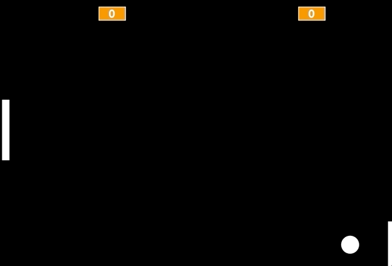
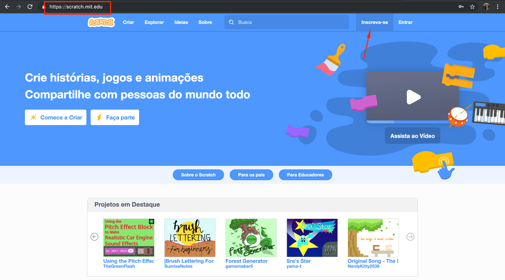
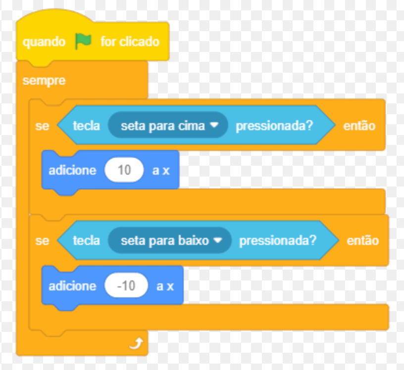
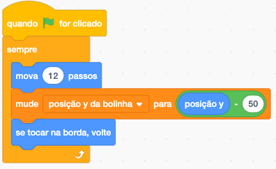
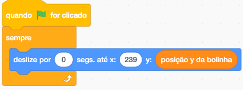

# Curso Alura - Lógica de programação: comece em lógica com o jogo Pong e JavaScript

## Aula 1 - Pong no Scratch

### Aula 1 - INtrodução - Vídeo 1

Transcrição  
Tudo bem, pessoal? Meu nome é Guilherme Lima, e neste curso iremos desenvolver o primeiro jogo lucrativo da história, um jogo de esporte conhecido por Pong, que simula um tênis de mesa. Este jogo foi tão importante que deu origem ao setor de games que conhecemos hoje.

Para entendermos como ele funciona, no jogo original temos uma imagem com dois traços simulando raquetes, e uma bolinha que interage com eles. Há também um tracejado no centro, identificando o meio da "quadra", e a pontuação é exibida no topo. Cada vez que a bolinha é lançada por uma raquete e a outra não consegue tocá-la, a primeira ganha um ponto.

Faremos algumas melhorias e mudanças neste jogo, para deixá-lo mais dinâmico e ágil. Inicialmente, vamos desenvolvê-lo utilizando a linguagem Scratch. Desenharemos as raquetes, desenvolveremos todo o nosso código para fortalecer a nossa lógica de programação. Utilizaremos as setas do teclado para movimentar as raquetes, e sempre que nós ou o nosso adversário marcar um ponto, temos um som, além de todos os principais efeitos na criação de um jogo — sonoros, visuais, de movimentação.

Em seguida, após aperfeiçoarmos nossa lógica de programação, desenvolveremos o mesmo jogo utilizando outra linguagem, o JavaScript.

E aí, estão preparados para este desafio? Vamos recriar este jogo clássico, e aprender a desenvolvê-lo utilizando duas linguagens distintas de programação?

### Aula 1 - Como usar o fórum - Vídeo 2

Transcrição  
Estou muito feliz que você dará os seus primeiros passos no mundo da programação.

Antes de iniciarmos com os estudos, gostaria de passar algumas recomendações para que você utilize nossa plataforma de modo mais eficaz. A primeira é o uso do fórum.

O fórum é um lugar especial e incrível onde podemos tirar dúvidas relacionadas ao curso. Então, pensando que em algum momento do curso você não obteve o mesmo resultado que o instrutor ou instrutora que estava ministrando a aula, há um local para tirar essas dúvidas.

Nós priorizamos que o fórum seja utilizado apenas para dúvidas. Caso não tenha nenhuma, você pode utilizá-lo para ajudar outras pessoas, fortalecendo a nossa comunidade da Alura.

Outra dica legal que quero recomendar é um local para postar o que aprendeu. "Poxa! Fiz um projeto incrível que ficou muito bonito. Eu posto ele no fórum?". Talvez não seja o local mais atrativo.

Dois locais muito bacana para postar os seus projetos são o Linkedin e o GitHutb. Quero mostrar para vocês dois projetos postados no Linkedin que alcançaram uma visibilidade muito maior do que o fórum da Alura, que é exclusivo para dúvidas.

O primeiro projeto que quero mostrar é dessa aluna, que fez algo incrível! Ela criou um texto no Linkedin. Caso você não saiba usar o Linkedin ou a finalidade dele, você pode realizar um cadastro, existem vários vídeos mostrando como fazer isso, e criar uma postagem, como uma das nossas alunas.

Ela escreveu um texto contando a experiência dela e, embaixo, colocou um GIF do código com o projeto finalizado, o que ficou muito legal. E foi o mesmo que outro aluno fez.

Ele comentou que estava continuando a formação de programação e agradece o instrutor, que no caso fui eu. Muito obrigado, fico feliz por isso. Embaixo do texto, ele colocou um GIF de como ficou o projeto dele, e ficou muito legal.

Então se você quer que outras pessoas vejam os projetos que você fez, poste no Linkedin ou no GitHub, que são ferramentas muito legais para isso. Vamos deixar o uso do fórum exclusivamente para dúvidas do curso.

Lembrando que se você não tem dúvidas, pode ajudar outras pessoas a entenderem, além de reforçar ainda mais o conhecimento que você adquiriu nos seus treinamentos.

Pensando nisso, comece a codar no próximo vídeo.

Vamos começar nosso treinamento.

### Aula 1 - Preparando o ambiente

Seja bem vindo
Olá, neste curso vamos criar um jogo do zero, utilizando duas linguagens de programação diferentes: [Scratch](https://scratch.mit.edu/) e [Javascript](https://www.alura.com.br/apostila-html-css-javascript/38CA-eventos-com-javascript) dentro do [P5](https://editor.p5js.org/).

> Neste treinamento, não usaremos uma IDE como VSCode, pois para executar a biblioteca precisaríamos subir um servidor e esse não é o objetivo do curso. Vamos dedicar toda atenção apenas no Javascript.

Vamos desenvolver o jogo do [Pong](https://pt.wikipedia.org/wiki/Pong), que é um jogo eletrônico de esporte que simula uma partida de tênis de mesa.

Conta
Você precisa de um cadastro para salvar e compartilhar seus projetos dentro do Scratch. Caso não tenha conta no Scratch, siga as instruções abaixo para criar sua conta:

Acesse o Scratch e clique na opção aderir ao scratch:

- Em seguida, escolha um nome e uma senha:
- Na sequência, preencha os formulário com outras informações:
- Informe seu email para concluir o cadastro:
- Agora, uma mensagem de boas vindas será exibida, mas ainda falta confirmar seu cadastro, clicando no link que o Scratch enviará para você por email.

Agora sim!

Tudo pronto. Vamos começar?

### Aula 1 - Primeiros passos com Scratch - Vídeo 3

Transcrição  
Vamos iniciar nossos estudos. A primeira coisa que faremos é acessar a plataforma Scratch. Na atividade anterior temos uma descrição de como é feito o login para utilizarmos essa ferramenta.

Após logarmos, clicaremos na opção "Criar". Na atividade anterior também temos um breve spoiler de como ficará o nosso jogo: teremos uma bolinha e duas raquetes sobre um fundo todo escuro, onde recriaremos o clássico jogo "Pong".

Existem algumas recomendações para conseguirmos criar esse jogo de maneira interessante. Após clicarmos em "Criar", o Scratch gera toda a estrutura da página. No ícone de "mundo" no canto superior esquerdo da página é possível selecionar ou alterar o idioma, no nosso caso "Português Brasileiro".

Na janela do canto inferior direito, temos um "Ator1" representado por um gato alaranjado, presente, por padrão, em todo projeto que é criado. Como não vamos utilizá-lo, poderemos removê-lo clicando no ícone de lixeira.

Nós vamos desenhar tanto a nossa bolinha quanto as raquetes. Para isso, clicaremos na opção "Selecionar um Ator", abrindo um menu com diversas outras opções, como "Enviar Ator", para fazer o upload de um desenho que já temos no computador; "Surpresa", para criar um ator aleatório provido pela plataforma; e "Pintar", que usaremos nesse treinamento.

Ao clicarmos em "Pintar", será exibida uma janela com layout semelhante ao Paint. Clicamos no círculo e o desenharemos na área pontilhada. Quando fazemos isso, é possível que o círculo fique bastante elíptico, semelhante a um ovo, algo que não queremos. Para mantermos o desenho com uma estrutura arredondada, seguraremos o botão "Shift" do teclado enquanto clicamos e arrastamos na área.

Repare que todas as bolinhas que desenhamos aparecem na cor roxa e com um contorno preto em volta. Para removermos esse contorno, clicaremos na seta no menu à esquerda e em seguida na bolinha. No menu acima, selecionaremos "Contornar" e clicaremos na opção de remover o contorno, representada por uma reta diagonal em vermelho.

Uma coisa bastante importante é centralizar nossos atores. A nossa bolinha, por exemplo, não está alinhada com o centro da área pontilhada, representado por uma bolinha cortada por uma cruz. Da forma que está agora, se quisermos que nosso ator vá para uma posição específica, não teremos o comportamento esperado.

Sendo assim, arrastaremos a bolinha para o centro da área, o que fará com que ela também seja centralizada no jogo. Também é possível centralizar o nosso ator por meio do código, algo que aprenderemos mais adiante.

A bolinha que criaremos não pode ser muito pequena, pois isso pode causar um bug no qual a bolinha entra na raquete. Além disso, ela também não pode ser muito grande. Isso também vale para a raquete.

Vamos desenhar um novo ator usando a opção "Selecione um Ator > Pintar". Se tentarmos desenhar usando a reta na lateral esquerda da página, teremos uma linha muito fina e que não se parece com a raquete do jogo Pong. Utilizaremos a ferramenta quadrilátero, representada por um quadrado, e desenharemos um retângulo com as proporções ideais. Também removeremos o contorno da raquete e a centralizaremos.

Na tela do jogo nossos atores estarão um em cima do outro, e mais adiante aprenderemos a definir, por meio do código, suas respectivas posições - uma raquete de cada lado, a bolinha na área de jogo e o placar na parte superior. Para que você não tenha nenhum "bug" em seu jogo, lembre-se de seguir os passos que fizemos durante a aula. Você pode até mudar a cor dos seus atores da forma que preferir.

No próximo vídeo daremos os primeiros passos na criação do nosso jogo.

### Aula 1 - Desenho dos atores

No processo de criação dos atores, é necessário pintar o ator. Para a bolinha, precisamos fazer um círculo e, para a raquete, utilizamos um retângulo. Os atores podem ou não ter a mesma cor, isso é opcional, ou seja, cada ator pode ter sua singularidade. Entretanto, o que ambos os atores devem ter em comum?

Alternativa correta

Os atores precisam estar centralizados, para que as coordenadas que iremos utilizar na programação representem-nos verdadeiramente.

> A centralização dos objetos que desenhamos fará toda a diferença no projeto devido ao sistema de coordenadas. Se o objeto não estiver centralizado irá acontecer alguns bugs, principalmente quando precisamos inverter a direção do ator.

### Aula 1 - Bolinha e minha raquete - Vídeo 4

Transcrição  
Vamos começar a criar nosso jogo de Pong com o Scratch, para fortalecermos nossa lógica de programação! Relembrando que a bolinha atuará em posições aleatórias, e temos que acertá-la, colidindo com ela por meio das raquetes. Acessaremos o site do Scratch — caso não esteja logado em sua conta, na etapa anterior há uma explicação de preparação do ambiente, com um passo a passo do que é necessário para criá-la.

Clicaremos em "Criar", no menu superior, e para configurarmos a língua utilizada, poderemos clicar no ícone de globo localizado no menu do topo, e selecionar "Português Brasileiro". No Pong, temos um fundo preto, e a bolinha e as raquetes na cor branca. Vamos deletar o gatinho clicando no "x" do painel inferior direito, ou clicando com o lado direito do mouse e selecionando "Apagar".

Feito isso, clicaremos no painel "Palco", no canto inferior direito, na aba "Cenários" no painel principal, e trocaremos a cor de preenchimento para preto, que será a mesma cor do contorno. Selecionaremos a ferramenta de quadrado e criaremos um que ocupe todo o espaço disponível.

Para criarmos a bolinha, clicaremos no ícone com a face de um gato no canto inferior direito da tela para selecionarmos um ator, que pode ser algum próprio da galeria do Scratch. No caso, queremos personalizá-lo, portanto clicaremos na opção "Pintar", o que abrirá um editor bem similar ao que utilizamos para pintar o cenário. Desta vez, tanto a cor quanto o contorno serão em branco. Com a ferramenta de círculo, desenharemos uma bolinha. Alinhe o centro do círculo desenhado à tela do painel, pois a discrepância entre esses pontos pode gerar bugs no jogo como a bolinha pular de posição ou mesmo rebater várias vezes na raquete.

Sobre o painel localizado à direita, para testarmos, clicaremos no ícone de bandeira verde, porém nada acontece. Geralmente, quando jogamos algo, os personagens não ficam posicionados aleatoriamente, tampouco na última posição em que estiveram. Isto é, eles possuem uma posição inicial, e neste jogo não será diferente.

Selecionaremos uma posição inicial para a nossa bolinha clicando em "Eventos", e em "quando [ícone de bandeira verde] for clicado", que arrastaremos ao painel principal. Depois, clicaremos em "Movimento" e em "vá para x: 182 y: -135", que também arrastaremos ao painel principal, encaixando na primeira "peça". Clicaremos nestes valores para os alterarmos para 0 e 0.

Assim, ao clicarmos no ícone de bandeira verde, teremos que a bolinha começa no centro do jogo. Agora, precisaremos movimentá-la! Clicaremos e arrastaremos "mova 10 passos" para o painel principal, encaixando-a na peça anterior. Clicando no ícone de bandeira verde, a bolinha se locomove um pouco para a direita, mas se clicarmos novamente, nada acontece.

Acontece que, quando nosso jogo se inicia, ele faz o que está definido na segunda peça e logo muda para a terceira, entretanto, isto ocorre apenas uma vez, quando na verdade queremos que a bolinha siga se movimentando. Para isso, clicaremos e arrastaremos outro evento "quando [ícone de bandeira verde] for clicado" para cima de "mova 10 passos", formando um segundo conjunto. E então clicaremos em "Controle" e em "sempre", que arrastaremos ao segundo conjunto, englobando o "mova 10 passos".

Assim, o movimento acontecerá sempre, ou seja, os 10 passos serão adicionados continuamente. Ao testarmos, a bolinha começará no centro e terminará no canto direito da tela, visível pela metade. Para um movimento de vai e volta, existe um código em "Movimento" que verifica essa colisão com as bordas da nossa tela, denominada "se tocar na borda, volte", o qual posicionaremos dentro de "sempre", abaixo de "mova 10 passos".

Aumentaremos a velocidade da bolinha aumentando o número de passos para 12. Entretanto, deste modo o movimento se dará apenas horizontalmente, então, poderemos indicar uma direção para ela, acrescentando "aponte para a direção 90" logo abaixo de "vá para x: 0 y: 0". Reparem que, ao clicarmos no valor, é demonstrado um círculo para demonstrar que o movimento se inicia em 90º. Vamos alterá-lo para 45.

Desta vez, a nossa bolinha se movimenta em vários sentidos, de acordo com essa angulação. E como é que iremos interagir com este jogo? Teremos raquetes, atores que criaremos a seguir!

### Aula 1 - Direção de movimento

Para realizar a movimentação da bolinha, utilizamos o bloco mova 10 passos.

Esse bloco cria a movimentação de acordo com a direção que o ator estiver apontando. Desse modo, se o ator estiver apontado para a direção de 90 graus, ele vai andar para a direita; se estiver apontado para a direção de 180 graus, o ator vai andar para baixo; se for 0 grau, o ator vai andar para cima; se apontar para -90 graus, o ator vai andar para a esquerda.

Se a direção da bolinha for de -180 graus, para qual direção ela irá se deslocar?

Resposta:

Para baixo.

> Ao girar 180º no sentido horário ou anti-horário, chegaremos na mesma posição.

### Aula 1 - Bolinha e minha raquete parte 2 - Vídeo 5

Transcrição  
Renomearemos o novo ator para "bolinha", e pintaremos outro ator, denominado "minha raquete", um retângulo de preenchimento e contorno brancos, para simular uma das raquetes. Na aba "Código", uma vez que queremos que ele comece do lado esquerdo da tela, enquanto a bolinha está no centro, definiremos que quando a bandeira verde for pressionada, queremos que a raquete vá para X -220 e Y 0.

Isso, porém, ainda não fará com que a raquete se movimente, pois não programamos nosso jogo para fazer isso. Queremos utilizar nosso teclado para que a raquete se mova verticalmente, e para fazermos isto de forma organizada, arrastaremos outro "quando [ícone de bandeira verde] for clicado" e encaixaremos abaixo dele "se [hexágono] então", existente em "Controle".

De "Sensores", clicaremos e arrastaremos "tecla espaço pressionada?" no espaço onde havia o símbolo de hexágono, e modificaremos "espaço" para "seta para cima". Assim, se a seta para cima for pressionada, a bolinha irá para cima. Sempre que tivermos dúvidas em relação a X e Y, no canto inferior esquerdo do programa podemos clicar em "Selecionar Cenário" e em "Xy-grid", que utilizaremos como gabarito. O X corresponde ao eixo horizontal, enquanto o Y corresponde ao eixo vertical.

Então, assim que a seta para cima for pressionada, queremos que a raquete vá para cima também. Ou seja, adicionaremos um valor para Y, e para tal clicaremos e arrastaremos "adicione 10 a y" dentro de "se [hexágono] então". Ao testarmos, porém, a raquete não se movimenta, já que o código é executado assim que o jogo é ligado, momento em que ainda não estamos com a tecla da seta para cima pressionada, e esta verificação é feita apenas uma vez.

Para resolvermos isso, envolveremos todo o segundo bloco abaixo de "quando [ícone de bandeira verde] for clicado" em outro, "sempre". No entanto, isso fará com que consigamos mover a raquete apenas para cima, portanto duplicaremos o bloco envolvido por "sempre" — clicando com o lado direito do mouse e em "Duplicar" — e substituiremos "seta para cima" por "seta para baixo", e o valor 10 por -10.

A bolinha ainda não está colidindo com a raquete, ultrapassando-a e tocando a lateral da tela. Podemos, inclusive, visualizar isto melhor diminuindo a velocidade da bolinha, que queremos que mude de direção assim que tocar na raquete. Podemos criar um bloco para verificar se estamos tocando na borda.

Para deixar o código organizado, é possível clicar com o lado direito do mouse no painel principal e em "Limpar Blocos".

Continuando, criaremos mais um bloco de código para quando o jogo for iniciado, para verificarmos se a bolinha está tocando a raquete. Teremos, então, "quando [ícone de bandeira verde] for clicado", e logo abaixo, "se [hexágono] então", cujo hexágono será preenchido por "tocando em minha raquete?".

Para invertermos a rota da bolinha, reconhecendo a colisão com a raquete e alterar a direção, inverteremos o valor multiplicando-o por -1. De "Movimento", clicaremos e arrastaremos "aponte para a direção 90" para dentro de "se 'tocando em minha raquete?' então". Substituiremos o valor 90 pela opção "direção".

De "Operadores" selecionaremos o bloco verde com "[] * []", e para o primeiro espaço arrastaremos o "direção" que tínhamos movimentado anteriormente, o qual multiplicaremos por -1, valor que digitaremos no segundo espaço do bloco. Daí, sim, encaixaremos o bloco final para onde "direção" estava antes, de modo a ficar "aponte para a direção 'direção * -1'".

Porém, mais uma vez, o código só foi executado uma vez, quando o jogo se iniciou. Envolveremos todo o bloco do "se..." em outro, "sempre". Agora, sim, temos o comportamento esperado!

### Aula 1 - Movimento da Raquete

A movimentação da raquete é realizada por meio de duas teclas: setas para cima ou para baixo. Essas teclas podem ser alteradas conforme a preferência da pessoa que está programando, ou seja, é possível alterar para as teclas W e S, desde que ela programe de maneira correta.

Entretanto, na execução do código abaixo, a movimentação na vertical não está ocorrendo (para cima e para baixo):

Qual é o erro que está ocorrendo neste caso?

Resposta

Ao invés de utilizar a coordenada cartesiana X, devemos utilizar a coordenada Y, pois ela é responsável por realizar deslocamentos na vertical.

> Lembrando que valores positivos a Y deslocam o ator para cima e valores negativos a Y deslocam o ator para baixo.

### Aula 1 - Oponente e placar - Vídeo 6

Transcrição  
A colisão da bolinha com a raquete está funcionando bem, porém a bolinha está se movimentando muito devagar e, além disso, nosso oponente é a parede. Vamos corrigir estes pontos alterando o bloco de código referente ao movimento da bolinha para "mova 12 passos" e duplicando a raquete que criamos clicando com o lado direito do mouse sobre o ator "minha raquete" e depois em "Duplicar".

Por ser uma cópia, a segunda raquete fará exatamente os mesmos movimentos da primeira, portanto não iremos enxergá-la. Em relação ao bloco de código da segunda raquete, então, substituiremos o bloco "vá para x: -220 y: 0" por "vá para x: 239 y: 9". Vamos ajustar o eixo Y da segunda raquete para que fique alinhada à primeira, mudando seu valor de 9 para 0.

Com isso, se testarmos o jogo, as duas raquetes se movimentam de forma similar, sincronizadas, cada uma de um lado da tela. Assim, iremos remover os blocos "se..." da primeira raquete, responsáveis pelos seus movimentos. Queremos que a raquete do oponente se movimente para colidir com a bolinha, assim que ela voltar da colisão com a primeira raquete.

Poderíamos passar a posição da bolinha para a raquete do oponente, porém, para cada ator no Scratch existem códigos em "Movimento" denominados "posição x", "posição y". Todavia, não queremos saber se a bolinha estará mais para a direita ou para a esquerda, pois o movimento da raquete do oponente também será na vertical. Isto é, precisaremos passar a posição Y da bolinha.

Sendo assim, criaremos uma variável para guardar este valor, de modo a conseguirmos compartilhá-lo com outros atores. Acessaremos a opção "Variáveis" e clicaremos em "Criar uma Variável"; ela se chamará "posição y da bolinha". Sempre que a bolinha se movimentar, o valor desta variável será alterada, e para isso acrescentaremos "mude 'minha variável' para 0" entre "mova 12 passos" e "se tocar na borda, volte". Alteraremos "minha variável" para "posição y da bolinha", e encaixaremos "posição y" no lugar de "0".

Reparem que, ao criarmos uma variável, existem as opções de visibilidade "Para todos os atores" e "Apenas para este ator"; no caso, escolhemos a primeira. Agora, para que a raquete do oponente se mova verticalmente, incluiremos "deslize por 1 segs. até x: 236 y: 56" dentro de "sempre", sendo que a posição X será a mesma do início, 239, enquanto a Y será substituída por "posição y da bolinha".

Ao testarmos, teremos que a raquete não está seguindo a bolinha. Isto acontece pois deixamos o deslize durante 1 segundo, então o alteraremos para 0, para que ele ocorra no mesmo momento que a bolinha. A posição Y da bolinha está aparecendo na tela — será que a pessoa que for jogar precisará desta informação?

Vamos esconder esta variável selecionando o ator bolinha e incluindo, no primeiro bloco de código, "esconda a variável 'posição y da bolinha'", logo após o "aponte para a direção 45". Nosso jogo está cada vez melhor, mas será que a raquete do oponente realmente está tocando na bolinha, isto é, existe a colisão?

Para enxergarmos isto, vamos diminuir novamente a velocidade da bolinha, de 12 para 2, e clicar no ícone da bandeira verde. A bolinha está tocando na borda da tela, ultrapassando a segunda raquete! Para o código correspondente a esta ação feito para a primeira raquete, iremos a "Operadores", clicaremos e arrastaremos o losango composto por "[hexágono] ou [hexágono]" para o painel principal, dentro do bloco "se...".

Para o primeiro espaço de hexágono, arrastaremos "tocando em 'minha raquete'?", preexistente no bloco "se...", e para o segundo espaço traremos de "Sensores" a opção "tocando em 'raquete do oponente'?".

Neste momento, a segunda raquete estava nomeada como "minha raquete2" por default, por ser uma cópia, lembram? Basta renomeá-la para darmos um sentido melhor para ela, como para "raquete do oponente".

Isso quer dizer que se a bolinha estiver tocando na "minha raquete" ou em "raquete do oponente", esperamos que a direção seja alterada, resultando na efetiva colisão. Entretanto, teremos um problema: o oponente sempre irá seguir a posição da bolinha, ou seja, ele nunca irá errar. Consequentemente, nossas chances de ganharmos o jogo será mínima. Precisaremos pensar em alguma maneira de aumentá-las!

### Aula 1 - Variáveis

Com a constante movimentação do ator “bolinha”, as coordenadas x e y também são alteradas. Para que possamos coletar as informações atualizadas da posição do ator “bolinha”, podemos criar uma variável a fim de armazenar os valores das coordenadas. Por meio dessa variável, o ator “raquete do oponente” poderá “ver” as coordenadas x e y do ator “bolinha”.

Para essa aplicação, dependendo da sua criação, qual é uma possível limitação da variável?

Resposta

A variável deve ser vista “para todos os atores”.

> Isso! Uma vez que a variável é “somente para este ator”, é uma variável local. Nesse caso, precisamos de uma variável global que todos os atores possam ver.

### Aula 1 - Oponente e placar parte 2 - Vídeo 7

Transcrição  
Estamos passando à raquete do oponente a posição Y da bolinha... E se manipulássemos este valor, incluindo uma margem de erro? Então, em vez de passarmos a posição exata da bolinha em "mude 'posição y da bolinha' para 0", incluiremos no lugar de 0 um bloco de operação "[] - []", que terá no primeiro espaço "posição y", e no segundo, 50. Além disso, voltaremos a aumentar a velocidade da bolinha para 12.

Ao testarmos, em dado momento a bolinha toca a lateral da tela, e não a raquete do oponente, o que significaria o ganho de um ponto para nós. Mas como é que iremos saber disso? De que forma contabilizaremos isso? Seria interessante se estas pontuações ficassem visíveis de alguma forma.

Já sabemos que armazenamos valores na memória do nosso computador por meio de variáveis. Por conta disso, criaremos duas variáveis, disponíveis para todos os atores — uma para armazenamento dos nossos pontos, denominada "meus pontos", e outra para os pontos do oponente, "pontos do oponente". Deixar da maneira padrão não é tão interessante visualmente, então clicaremos sobre elas com o lado direito do mouse para verificarmos as opções de exibição das variáveis; neste caso, escolheremos "letras grandes".

Também é possível clicar duas vezes sobre a exibição das variáveis para alterá-las!

Apesar de termos incluído esta exibição de pontuação, os pontos não estão sendo marcados ainda. Isso porque ainda não programamos desta forma. Precisaremos indicar que, assim que a bolinha tocar na lateral da tela (e não nas raquetes), queremos que um ponto seja marcado para o adversário. O valor do X identifica este momento, então, se X for menor que 229, queremos acrescentar um ponto para o oponente.

Para fazermos esta verificação, manteremos o ator "bolinha" selecionado e criaremos o código correspondente: "quando [ícone de bandeira verde] for clicado", seguido por "se [hexágono] então", cujo hexágono ficará com "'posição x' < -229", e dentro do qual teremos "adicione 1 a 'pontos do oponente'". Todo código inserido em uma repetição, isto é, que acontece mais de uma vez, tem uma borda dourada.

Da maneira em que está, este último bloco de código possui esta borda assim que clicamos no ícone de bandeira verde, mas ela não se mantém. É necessário envolvermos o bloco contendo "se..." em outro, "sempre". Além disso, queremos poder criar nossos próprios pontos, então dentro de "sempre" acrescentaremos outro bloco "se...", que ficará "se 'posição x' > 229 então" acompanhado por "adicione 1 a 'meus pontos'".

Entretanto, ao testarmos, o jogo se inicia com 2 pontos para o adversário. Para corrigirmos isto, acrescentaremos "mude 'meus pontos' para 0" e "mude 'pontos do oponente' para 0" após "esconda a variável 'posição y da bolinha'". Testando o jogo, perceberemos que tudo funciona conforme esperado.

Porém, as verificações constantes acabam consumindo memória, então poderemos alterar este último "se..." para algo que espere até que se atinjam estas posições da bolinha que definimos nas condições. Isso fará com que ganhemos em processamento, pensando na otimização do nosso jogo. Este último bloco será separada em dois:

quando [ícone de bandeira verde] for clicado

sempre

  espere até que 'posição x' < -229

  adicione 1 a 'pontos do oponente'Copiar código

E

quando [ícone de bandeira verde] for clicado

sempre

  espere até que 'posição x' > 229

  adicione 1 a 'meus pontos'Copiar código

### Aula 1 - Pontuação

Para desenvolver um algoritmo de pontuação do jogo Pong, é necessário avaliar se a bolinha realmente passa sem que seja rebatida pela raquete.

Para descrever essa situação em código, qual é o principal valor de referência que devemos avaliar para gerar essa pontuação?

Alternativa correta  
Verificar se a coordenada x do ator “bolinha” é maior do que a coordenada x do ator “raquete do oponente” ou menor do que a coordenada x do ator “minha raquete”.

> Lembre-se sempre que, com coordenadas negativas, a referência muda, por essa razão, precisamos alterar as condições lógicas de maior (>) para valores de posição X maior que zero (no caso maior que 229), e menor (<) para valores de posição X menor do que zero (no caso -229).

### Aula 1 - Sons e compartilhando o jogo - Vídeo 8

Transcrição  
Nosso jogo está ficando muito legal, temos as colisões da bolinha nas raquetes, a marcação de pontos... Mas há um recurso faltando em nosso jogo, existente na maioria dos jogos: o som, que nos auxilia na ambientação. No Scratch, temos a aba "Sons", e ao clicarmos nele, teremos um som padrão, que iremos deletar. No canto inferior esquerdo, há um ícone de alto falante para selecionarmos um som de nossa preferência.

Que categoria de som combina mais com o nosso jogo? "Esportes", talvez, composta por sons variados, dentre eles, de tênis e ping pong. Escolheremos este último (Ping Pong Hit, que poderá ser renomeado para "raquetada", por exemplo), e poderemos editá-lo clicando na opção "Cortar Trecho", cortando o primeiro barulho da bolinha batendo e mantendo apenas o segundo. Clicaremos em "Salvar" e voltaremos à aba "Código".

Como queremos que este som toque quando a bolinha colidir com qualquer uma das raquetes, de "Som" clicaremos e arrastaremos "toque o som 'raquetada'". Os blocos ficarão da seguinte maneira:

quando [ícone de bandeira verde] for clicado

sempre

   se "tocando em 'minha raquete'? ou 'tocando em 'raquete do oponente'?"

   aponte para a direção "direção" * -1

   toque o som "raquetada"

Testaremos e diminuiremos o volume do som na aba "Sons". Agora, podemos definir um som para quando se marca um ponto. Escolheremos "Coin" da categoria "Efeitos", diminuiremos seu volume e alteraremos seu nome para "ponto". Acrescentaremos "toque o som 'ponto'" nos blocos de código referentes tanto à nossa pontuação quanto ao do oponente, dentro dos laços "sempre".

Também acrescentaremos uma trilha sonora de fundo ao nosso jogo. Para isto, temos a categoria "Loops". No código, como queremos que o som comece a tocar assim que iniciamos o jogo, posicionaremos "toque o som 'trilha sonora' até o fim" no primeiro bloco. Porém, para que ele toque sem parar, devemos inclui-lo em um bloco "sempre".

Para mostrarmos o jogo para outras pessoas, no topo do programa existe um nome, no caso, "Untitled-36", lado do botão "Compartilhar". Vamos trocar este nome para "Pong com Scratch" e clicar no botão "Ver a Página do Projeto". Na parte de instruções, podemos escrever algo como:

"Utilize as setas para cima e para baixo para movimentar a raquete!"

Por fim, basta clicarmos em "Compartilhar", na parte superior da tela, e distribuir o link exibido na barra de endereços do navegador. Agora que desenvolvemos a nossa lógica de programação, vamos partir para outro desafio — criar este mesmo jogo utilizando outra linguagem de programação, o JavaScript.

### Aula 1 - Faça como eu fiz na aula

Sua vez!
Queremos criar o Pong, um jogo onde temos 2 raquetes, uma bolinha e um placar indicando os pontos de cada jogador utilizando o Scratch como linguagem de programação. Sabendo disso, siga todos os passos realizados por mim durante os vídeos desta aula e desenvolver do zero este grande clássico do mundo dos jogos.

Faça a bolinha deslizar dentro das bordas da tela do jogo, movimente uma raquete através das setas para cima e para baixo do teclado e movimente o oponente informando a posição yda bolinha. Crie 2 variáveis para armazenar a quantidade de pontos de cada jogador e adicione sons no jogo!

Atenção! Caso seu jogo apresente o comportamento de ficar com a bolinha presa na requete e com isso travar o jogo contabilizando vários pontos, dê uma olhada neste tópico do fórum que traz uma solução para este bug do Scratch.

Opinião do instrutor

Resumo do código

- ator bolinha:
- ator minha raquete:
- ator raquete oponente:

O gabarito deste exercício é o passo a passo demonstrado no vídeo. Tenha certeza de que tudo está certo antes de continuar.

Ficou com dúvida? Recorra ao nosso fórum, não perca tempo!

### Aula 1 - Jogo mais difícil

Para movimentar a raquete do oponente de forma inteligente, uma pessoa desenvolveu o seguinte código no ator bolinha:

E ator raquete oponente:

Após jogar algum tempo, percebeu que o jogo estava muito fácil, pois o oponente errava muito.

Com base no código usado pela pessoa, o que ela pode fazer para a raquete do oponente acertar mais a bolinha?

Alternativa correta  
No código de ator bolinha, a pessoa pode diminuir o valor do subtraendo.

> Certo! Quanto mais próximo de 0 for o subtraendo, mais perfeito será o movimento da raquete do oponente. Conforme diminuímos esse valor, também reduzimos a chance de erro da raquete do oponente.

### Aula 1 - O que aprendemos?

Nessa aula:

- Desenvolvemos o jogo do Pong utilizando a linguagem de programação Scratch;
- Implementamos a colisão da bolinha com as bordas, minha raquete e a raquete do oponente;
- Movimentamos a raquete do oponente de forma individual, para acertar a bolinha na maioria das vezes;
- Criamos o placar do jogo, indicando os meus pontos e do oponente;
- Adicionamos sons e editamos a página do jogo no Scratch para que outras pessoas possam jogar.

Projeto desta aula
[Neste link, você pode acessar o jogo](https://scratch.mit.edu/projects/303401594/), ver o projeto por dentro e fazer um remix se preferir.

[Neste link, você encontra o jogo](https://cdn3.gnarususercontent.com.br/555-Pong-com-P5Js/aula1/Pong+com+Scratch.sb3) do que foi desenvolvido nesta aula para download.

Na próxima aula
Vamos desenvolver este mesmo jogo, em outra linguagem de programação:

## Aula 2 - Iniciando no JavaScript

### Aula 2 - Cenário e bolinha - Vídeo 1

### Aula 2 -  - Vídeo 2
### Aula 2 -  - Vídeo 3
### Aula 2 -  - Vídeo 4
### Aula 2 -  - Vídeo 5
### Aula 2 -  - Vídeo 6
### Aula 2 -  - Vídeo 7
### Aula 2 -  - Vídeo 8
